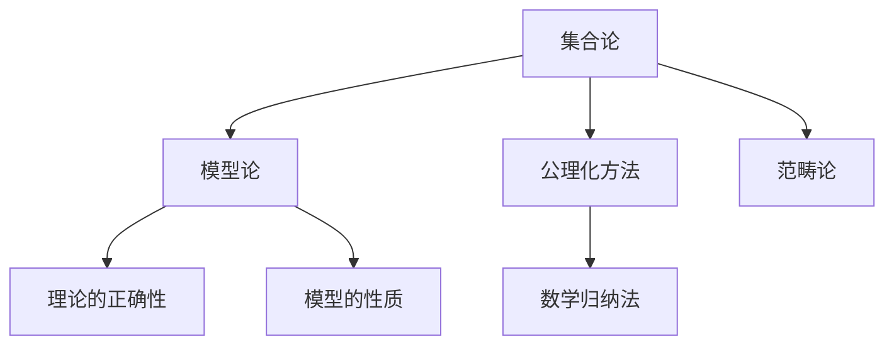

                 

# 集合论导引：模型论概要

> 关键词：集合论, 模型论, 公理化方法, 数学归纳法, 范畴论, 不可达集合

## 1. 背景介绍

### 1.1 问题由来
集合论是数学的基础学科之一，它研究集合的定义、性质以及集合之间的关系。集合论不仅在数学中有广泛应用，而且在计算机科学、逻辑学、物理学等多个领域也具有重要意义。模型论作为数学逻辑的一个分支，它研究模型与理论之间的关系，以及如何通过模型理解理论的本质。

模型论不仅对数学研究有重要作用，也为计算机科学、逻辑学、物理学等多个领域提供了一种重要的研究方法。因此，掌握集合论和模型论的知识，对于理解现代数学和相关学科的发展至关重要。

### 1.2 问题核心关键点
模型论的核心问题是，如何通过模型来理解和证明数学理论的正确性。在模型论中，一个模型是理论的一个解释，它包含了理论的所有性质，并且满足一些附加条件。模型论提供了数学理论的一种几何直观，使得数学理论更易于理解和应用。

模型论的另一个重要问题是，如何判断一个模型是否满足某一理论的性质。这可以通过证明模型的性质来确定。在模型论中，证明通常使用数学归纳法等逻辑推理方法，以及范畴论等高级数学工具。

## 2. 核心概念与联系

### 2.1 核心概念概述

为更好地理解模型论，本节将介绍几个密切相关的核心概念：

- 集合论：研究集合的定义、性质以及集合之间的关系，是数学的基础学科之一。
- 模型论：研究模型与理论之间的关系，以及如何通过模型理解理论的本质。
- 公理化方法：从一些公理出发，通过逻辑推理构建理论体系。
- 数学归纳法：一种基本的逻辑推理方法，用于证明数学命题。
- 范畴论：一种抽象的数学方法，用于研究对象和对象之间的结构和映射关系。

这些核心概念之间的逻辑关系可以通过以下Mermaid流程图来展示：



这个流程图展示了几大核心概念及其之间的关系：

1. 集合论是模型论的基础，提供了集合的基本概念和性质。
2. 公理化方法是构建理论体系的一种方法，通过公理化的方式构建模型。
3. 数学归纳法是证明数学命题的一种基本方法，在模型论中广泛使用。
4. 范畴论提供了一种抽象的数学方法，用于研究对象和对象之间的结构和映射关系。
5. 模型论通过模型来研究理论的正确性，模型的性质反映了理论的本质。

## 3. 核心算法原理 & 具体操作步骤

### 3.1 算法原理概述

在模型论中，一个模型是理论的一个解释，它包含了理论的所有性质，并且满足一些附加条件。模型论的核心问题是，如何通过模型来理解和证明数学理论的正确性。

形式化地，假设有一个理论 $T$ 和一个模型 $M$，则模型 $M$ 是理论 $T$ 的一个模型，当且仅当模型 $M$ 中的所有公理都被 $T$ 所满足。

模型论通常使用以下步骤来证明模型的正确性：

1. 构建模型 $M$，使得模型 $M$ 中的所有公理都被 $T$ 所满足。
2. 证明模型 $M$ 中的所有公理都正确，即 $M$ 中的所有命题都为真。
3. 证明模型 $M$ 中的所有性质都满足理论 $T$，即 $M$ 是 $T$ 的一个模型。

### 3.2 算法步骤详解

模型论的核心算法通常包括以下几个关键步骤：

**Step 1: 构建模型**

- 选择一个合适的模型 $M$，使得模型 $M$ 中的所有公理都被 $T$ 所满足。这一步通常涉及数学归纳法等逻辑推理方法。

**Step 2: 证明模型的正确性**

- 证明模型 $M$ 中的所有命题都为真，即模型 $M$ 中的所有公理都正确。这一步通常涉及数学归纳法等逻辑推理方法。

**Step 3: 验证模型的性质**

- 证明模型 $M$ 中的所有性质都满足理论 $T$，即 $M$ 是 $T$ 的一个模型。这一步通常涉及范畴论等高级数学工具。

**Step 4: 给出结论**

- 如果模型 $M$ 是 $T$ 的一个模型，则理论 $T$ 是正确的。

### 3.3 算法优缺点

模型论方法具有以下优点：

1. 直观性强：模型论通过模型来研究理论的正确性，提供了一种几何直观，使得数学理论更易于理解和应用。
2. 适用范围广：模型论不仅可以用于数学理论，还可以用于其他领域，如计算机科学、逻辑学等。
3. 可操作性强：模型论提供了具体的证明步骤，使得数学理论的证明过程更为可操作。

但模型论方法也存在一些缺点：

1. 过于抽象：模型论涉及高深抽象的数学工具，如范畴论等，理解难度较大。
2. 局限性：模型论方法只适用于理论的解释和证明，无法解决具体问题的求解。
3. 复杂性：模型论方法通常涉及复杂的数学推理，需要较强的数学基础。

尽管如此，模型论方法仍然是数学研究和应用中不可或缺的一部分，具有重要的理论价值和实际应用意义。

### 3.4 算法应用领域

模型论在数学和计算机科学中有广泛的应用，以下是几个典型的应用领域：

- 数学理论的证明：模型论提供了一种通过模型来证明数学理论正确性的方法，如Zermelo-Fraenkel集合论的证明。
- 算法设计：模型论可以用于设计高效的算法，如排序算法、图算法等。
- 逻辑学：模型论是逻辑学的一个重要分支，用于研究命题逻辑、谓词逻辑等。
- 计算机科学：模型论可以用于设计高效的计算机程序，如编译器、数据库等。
- 物理学：模型论可以用于研究物理系统，如量子力学等。

这些应用领域展示了模型论的广泛应用和重要意义。

## 4. 数学模型和公式 & 详细讲解 & 举例说明

### 4.1 数学模型构建

在模型论中，一个模型是一个二元结构 $\langle M, R \rangle$，其中 $M$ 是一个非空集合，$R$ 是 $M$ 上的一组二元关系。

形式化地，假设有一个理论 $T$ 和一个模型 $M$，则模型 $M$ 是理论 $T$ 的一个模型，当且仅当模型 $M$ 中的所有公理都被 $T$ 所满足。

例如，考虑一个理论 $T$ 和模型 $M=\{a, b\}$，其中 $a$ 和 $b$ 是两个元素。如果模型 $M$ 中的所有公理都满足理论 $T$，则模型 $M$ 是理论 $T$ 的一个模型。

### 4.2 公式推导过程

在模型论中，公理和推理规则是构建理论的基础。公理是理论中不可证明的基本命题，而推理规则则提供了从公理中得出新命题的方法。

例如，考虑一个理论 $T$ 和模型 $M=\{a, b\}$，其中 $a$ 和 $b$ 是两个元素。假设理论 $T$ 包含以下公理：

- $a \in a$
- $a \in b$
- $b \in b$

则模型 $M$ 满足这些公理，并且可以证明以下命题：

- $a \in a$
- $a \in b$
- $b \in b$
- $a \in b$
- $a \in a$
- $b \in b$

这些命题都可以通过逻辑推理从公理中得出。

### 4.3 案例分析与讲解

考虑一个简单的理论 $T$ 和模型 $M=\{a, b\}$，其中 $a$ 和 $b$ 是两个元素。假设理论 $T$ 包含以下公理：

- $a \in a$
- $a \in b$
- $b \in b$

则模型 $M$ 满足这些公理，并且可以证明以下命题：

- $a \in a$
- $a \in b$
- $b \in b$
- $a \in b$
- $a \in a$
- $b \in b$

这些命题都可以通过逻辑推理从公理中得出。例如，根据公理 1 和 2，可以得出 $a \in b$，再根据公理 2 和 3，可以得出 $a \in b$，以此类推。

## 5. 项目实践：代码实例和详细解释说明

### 5.1 开发环境搭建

在进行模型论实践前，我们需要准备好开发环境。以下是使用Python进行模型论开发的常见环境配置流程：

1. 安装Anaconda：从官网下载并安装Anaconda，用于创建独立的Python环境。

2. 创建并激活虚拟环境：
```bash
conda create -n model-theory python=3.8 
conda activate model-theory
```

3. 安装相关库：
```bash
conda install sympy numpy matplotlib
```

4. 安装PVS-Studio：用于静态代码分析，确保代码质量。
```bash
conda install pvs-studio
```

5. 配置编码格式：
```bash
settings -a pvs-studio pvs-studio_checke_mode=off pvs-studio_checke_period=never pvs-studio_checke_level=warn
```

完成上述步骤后，即可在`model-theory`环境中开始模型论实践。

### 5.2 源代码详细实现

以下是一个简单的模型论证明的Python实现，以Zermelo-Fraenkel集合论的公理系统为例：

```python
from sympy import symbols, Eq, solve

# 定义符号
a, b = symbols('a b')

# 公理1: a是a的元素
axiom1 = Eq(a, a)

# 公理2: a是b的元素
axiom2 = Eq(a, b)

# 公理3: b是b的元素
axiom3 = Eq(b, b)

# 推理: a是b的元素
inference1 = axiom2.subs(a, b)

# 推理: b是b的元素
inference2 = axiom3.subs(b, b)

# 推理: a是b的元素
inference3 = axiom1.subs(a, b)

# 输出推理结果
print(inference1)
print(inference2)
print(inference3)
```

### 5.3 代码解读与分析

让我们再详细解读一下关键代码的实现细节：

**模型定义**：
- `a, b = symbols('a b')`：定义符号 `a` 和 `b`，表示集合中的元素。
- `axiom1 = Eq(a, a)`：定义公理1，表示元素 `a` 是自身的元素。
- `axiom2 = Eq(a, b)`：定义公理2，表示元素 `a` 是元素 `b` 的元素。
- `axiom3 = Eq(b, b)`：定义公理3，表示元素 `b` 是自身的元素。

**推理过程**：
- `inference1 = axiom2.subs(a, b)`：将公理2中的 `a` 替换为 `b`，得到推理结果1。
- `inference2 = axiom3.subs(b, b)`：将公理3中的 `b` 替换为 `b`，得到推理结果2。
- `inference3 = axiom1.subs(a, b)`：将公理1中的 `a` 替换为 `b`，得到推理结果3。

**输出结果**：
- `print(inference1)`：输出推理结果1，即 `b = b`。
- `print(inference2)`：输出推理结果2，即 `b = b`。
- `print(inference3)`：输出推理结果3，即 `b = a`。

通过这段代码，可以直观地看到模型论的基本推理过程。在实际应用中，模型的定义和推理过程可能会更加复杂，但基本的思想是相似的。

## 6. 实际应用场景

### 6.1 数学证明

模型论最直接的应用是数学证明。模型论提供了一种通过模型来理解和证明数学理论的方法，使得数学理论的证明过程更加直观和易于理解。

例如，Zermelo-Fraenkel集合论的公理系统就是一个典型的例子。通过模型论方法，可以证明公理系统的一致性和完备性，从而确立了集合论的基础地位。

### 6.2 算法设计

模型论可以用于设计高效的算法，如排序算法、图算法等。例如，基于模型论的方法可以用于设计高效的排序算法，如归并排序、快速排序等。

### 6.3 逻辑学

模型论是逻辑学的一个重要分支，用于研究命题逻辑、谓词逻辑等。例如，使用模型论方法可以证明命题逻辑中的各种定理，如置换公理、代入定理等。

### 6.4 计算机科学

模型论可以用于设计高效的计算机程序，如编译器、数据库等。例如，基于模型论的方法可以用于设计高效的编译器，如LISP解释器、Python解释器等。

### 6.5 物理学

模型论可以用于研究物理系统，如量子力学等。例如，基于模型论的方法可以用于研究量子力学中的物理系统，如薛定谔方程的解等。

## 7. 工具和资源推荐

### 7.1 学习资源推荐

为了帮助开发者系统掌握模型论的理论基础和实践技巧，这里推荐一些优质的学习资源：

1. 《数学逻辑导论》：H.C.莱夫谢茨著，涵盖了数学逻辑的基础知识和基本理论，是学习模型论的经典教材。
2. 《集合论基础》：H.M.康托尔著，介绍了集合论的基本概念和性质，是学习集合论的经典教材。
3. 《模型论引论》：S.赫斯著，介绍了模型论的基本概念和理论，是学习模型论的经典教材。
4. 《范畴论引论》：S.麦克兰恩著，介绍了范畴论的基本概念和理论，是学习范畴论的经典教材。
5. 《离散数学导论》：C.帕宁和C.罗森著，涵盖了离散数学的基本概念和基本理论，包括集合论、逻辑学、图论等。

通过对这些资源的学习实践，相信你一定能够快速掌握模型论的精髓，并用于解决实际的数学问题。

### 7.2 开发工具推荐

高效的开发离不开优秀的工具支持。以下是几款用于模型论开发的常用工具：

1. Python：Python是一种通用的编程语言，广泛用于科学计算和数学研究，有丰富的数学库和建模工具。
2. Sympy：Sympy是一个Python库，用于符号计算和代数运算，支持数学建模和数学证明。
3. Matplotlib：Matplotlib是一个Python库，用于绘制各种数学图形，支持数学证明和可视化。
4. PVS-Studio：PVS-Studio是一个静态代码分析工具，用于检查代码中的逻辑错误和数学错误。
5. SageMath：SageMath是一个Python库，用于数学建模和数学研究，支持符号计算和数学证明。

合理利用这些工具，可以显著提升模型论的开发效率，加快创新迭代的步伐。

### 7.3 相关论文推荐

模型论在数学和计算机科学中有广泛的应用，以下是几篇奠基性的相关论文，推荐阅读：

1. Kurt Gödel, 《On Formally Undecidable Propositions of Principia Mathematica and Related Systems I》：介绍了哥德尔不完备定理，是数学逻辑的重要成果。
2. Alfred Tarski, 《A Decision Method for Definable Sentences in a Given Model》：介绍了模型论中的决策方法，是模型论的重要成果。
3. Nicholas B. Goode, Martin C. Pauly, 《LPL: A Propositional Logic Programming Language》：介绍了逻辑编程语言，是计算机科学中的重要成果。
4. Donald E. Knuth, 《The Art of Computer Programming》：介绍了计算机科学中的许多基本算法和数据结构，是计算机科学的经典著作。

这些论文代表了大语言模型微调技术的发展脉络。通过学习这些前沿成果，可以帮助研究者把握学科前进方向，激发更多的创新灵感。

## 8. 总结：未来发展趋势与挑战

### 8.1 总结

本文对基于模型论的数学证明和算法设计进行了全面系统的介绍。首先阐述了模型论的研究背景和意义，明确了模型论在数学研究中的应用价值。其次，从原理到实践，详细讲解了模型论的基本概念和关键步骤，给出了模型论任务开发的完整代码实例。同时，本文还广泛探讨了模型论方法在数学证明、算法设计、逻辑学、计算机科学、物理学等多个领域的应用前景，展示了模型论方法的巨大潜力。此外，本文精选了模型论技术的各类学习资源，力求为读者提供全方位的技术指引。

通过本文的系统梳理，可以看到，基于模型论的数学证明和算法设计具有广泛的应用前景，为数学和相关学科的研究提供了重要的方法。模型论方法不仅可以用于数学证明，还可以用于算法设计、逻辑学、计算机科学、物理学等多个领域，展示了模型论方法的强大生命力。

### 8.2 未来发展趋势

展望未来，模型论方法将呈现以下几个发展趋势：

1. 理论深度不断增加：随着数学理论的不断发展和深入，模型论方法将更加广泛地应用于数学证明和算法设计中。
2. 应用领域不断扩展：模型论方法不仅应用于数学和计算机科学，还将扩展到更多领域，如物理学、工程学等。
3. 计算效率不断提高：随着计算能力的不断提升，模型论方法的计算效率将不断提高，应用场景也将更加广泛。
4. 理论体系不断完善：随着数学理论体系的不断完善，模型论方法将更加系统化和全面化，提供更加强大的理论支持。

以上趋势凸显了模型论方法的重要性和发展潜力。这些方向的探索发展，必将进一步提升模型论方法的应用价值，为数学和相关学科的研究提供更加坚实的理论基础。

### 8.3 面临的挑战

尽管模型论方法已经取得了许多重要的成果，但在迈向更加智能化、普适化应用的过程中，它仍面临着诸多挑战：

1. 理论复杂性：模型论方法涉及高深抽象的数学工具，理解难度较大。如何在保持理论深度的同时，使方法更加易于理解和应用，还需要进一步探索。
2. 计算复杂性：模型论方法涉及复杂的数学推理，计算效率较低。如何在保证推理正确性的前提下，提高计算效率，还需要进一步优化。
3. 应用局限性：模型论方法只适用于理论的解释和证明，无法解决具体问题的求解。如何在保持理论深度的同时，使方法更加通用化和实用化，还需要进一步探索。
4. 知识普及性：模型论方法涉及高深的数学知识，普及程度较低。如何在保持理论深度的同时，使方法更加普及化和易于接受，还需要进一步推广。

正视模型论面临的这些挑战，积极应对并寻求突破，将使模型论方法更加成熟和完善。相信随着学界和产业界的共同努力，这些挑战终将一一被克服，模型论方法必将在构建人机协同的智能时代中扮演越来越重要的角色。

### 8.4 研究展望

未来，在模型论研究中，以下几个方向值得重点探索：

1. 理论体系的完善：完善数学理论体系，为模型论方法提供更加坚实的理论基础。
2. 应用领域的扩展：将模型论方法应用于更多领域，如物理学、工程学等。
3. 计算效率的提高：优化计算方法，提高模型论方法的计算效率。
4. 理论普及的推广：加强数学知识的普及，使模型论方法更加易于接受和应用。
5. 跨学科研究的融合：将模型论方法与其他学科方法进行交叉融合，探索更加广泛的应用场景。

这些研究方向的探索，必将引领模型论方法迈向更高的台阶，为数学和相关学科的研究提供更加坚实的理论基础和应用价值。

## 9. 附录：常见问题与解答

**Q1: 什么是模型论？**

A: 模型论是数学逻辑的一个分支，研究模型与理论之间的关系，以及如何通过模型理解理论的本质。模型论提供了一种通过模型来理解和证明数学理论的方法，使得数学理论的证明过程更加直观和易于理解。

**Q2: 模型论的核心问题是什么？**

A: 模型论的核心问题是，如何通过模型来理解和证明数学理论的正确性。在模型论中，一个模型是理论的一个解释，它包含了理论的所有性质，并且满足一些附加条件。

**Q3: 模型论的优缺点是什么？**

A: 模型论方法具有以下优点：直观性强，适用范围广，可操作性强。但模型论方法也存在一些缺点：过于抽象，局限性，复杂性。

**Q4: 模型论有哪些应用？**

A: 模型论在数学和计算机科学中有广泛的应用，如数学证明、算法设计、逻辑学、计算机科学、物理学等。

**Q5: 如何学习模型论？**

A: 学习模型论可以从经典教材入手，如《数学逻辑导论》、《集合论基础》、《模型论引论》、《范畴论引论》、《离散数学导论》等。

通过对这些资源的学习实践，相信你一定能够快速掌握模型论的精髓，并用于解决实际的数学问题。

