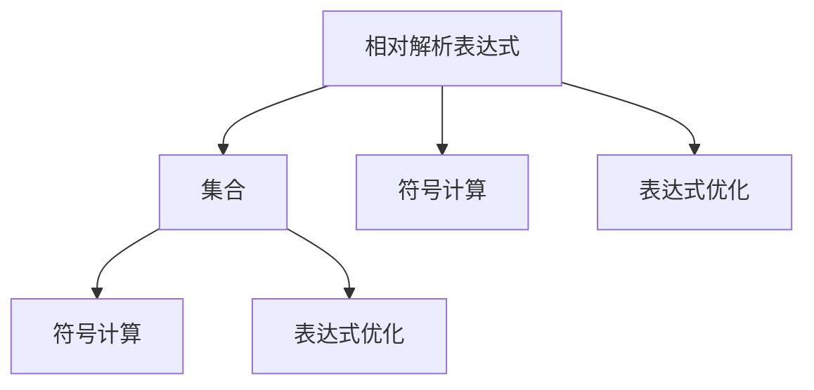

                 

# 集合论导引：相对解析表达式

> 关键词：相对解析表达式, 集合论, 符号计算, 数学表达, 表达式优化

## 1. 背景介绍

### 1.1 问题由来
在计算机科学和数学中，表达式及其解析一直是重要研究内容。随着算法和数学理论的发展，人们对表达式的理解日益深入，从形式化描述到符号计算，从解析方法到优化算法，都取得了诸多进展。其中，集合论作为数学的基础理论之一，与表达式有着天然的联系。如何利用集合论来指导表达式的解析和优化，是当前研究的热点话题。

本文将从集合论的角度，探讨相对解析表达式的原理和实践，特别是符号计算和表达式优化方面的应用。通过解析表达式的集合论导引，我们将能够更好地理解和应用现有的算法和工具，推动这一领域的发展。

### 1.2 问题核心关键点
相对解析表达式是解析表达式的一种高级形式，通过引入集合论的概念，能够更系统地处理和优化复杂的数学表达式。其核心关键点包括：

- **集合与表达式的映射**：通过集合的元素和结构，映射到表达式的符号和运算规则。
- **符号计算的集合论基础**：基于集合论，定义表达式的符号运算规则。
- **表达式优化的集合论方法**：通过集合运算和推理，优化表达式的结构和运算效率。
- **实例与应用**：具体解析和优化案例，展示相对解析表达式的应用价值。

这些问题将贯穿于全文，从理论和实践两个角度进行详细阐述。

### 1.3 问题研究意义
相对解析表达式在符号计算、表达式优化、程序分析等领域具有重要意义。其研究意义主要体现在：

1. **提升表达式处理能力**：通过集合论的引导，能够更系统地处理复杂的表达式，提高计算效率和准确性。
2. **优化表达式结构**：利用集合论方法，识别和消除表达式的冗余，提升优化效果。
3. **支持智能应用**：在符号计算、算法分析等智能应用中，相对解析表达式能够提供强大的数学表达和计算支持。
4. **推动理论发展**：集合论与表达式的结合，为数学和计算机科学的交叉研究提供了新的视角和方法。

通过本文的研究，希望能为研究者、开发者提供一个新的研究思路，推动相对解析表达式在实际应用中的广泛应用。

## 2. 核心概念与联系

### 2.1 核心概念概述

为更好地理解相对解析表达式，本节将介绍几个关键核心概念：

- **相对解析表达式**：通过集合论的方法，对解析表达式进行形式化描述，使其能够被系统地处理和优化。
- **集合**：数学中的一种基本结构，通过元素的集合和运算规则，表达复杂的关系和结构。
- **符号计算**：一种数学计算方法，通过符号表达式进行运算和变换，广泛应用于代数、几何等领域。
- **表达式优化**：通过算法和规则，优化表达式结构，提升计算效率和准确性。

这些概念之间的逻辑关系可以通过以下Mermaid流程图来展示：



这个流程图展示了相对解析表达式的核心概念及其之间的关系：

1. 相对解析表达式通过集合的映射和表示，与符号计算和表达式优化紧密联系。
2. 集合提供了表达式的形式化表示方法，用于符号计算和表达式优化。
3. 符号计算基于集合的元素和运算规则，进行数学表达和计算。
4. 表达式优化通过集合运算和推理，识别和消除表达式的冗余，提升计算效率。

## 3. 核心算法原理 & 具体操作步骤

### 3.1 算法原理概述

相对解析表达式的核心算法原理，基于集合论的基本思想，通过对表达式的符号和运算进行形式化描述，实现系统的解析和优化。其关键在于：

- **符号映射**：将表达式的符号映射到集合的元素，形成符号集合。
- **集合运算**：利用集合的基本运算规则，对符号集合进行运算和推理。
- **优化算法**：基于集合运算的结果，设计优化算法，提升表达式结构的效率。

### 3.2 算法步骤详解

相对解析表达式的解析和优化过程，可以大致分为以下几个关键步骤：

**Step 1: 符号映射和集合定义**

- 将表达式的符号映射到集合的元素，形成符号集合。例如，将表达式 $x^2 + 2x + 1$ 映射到 $\{x, 2, +, 1\}$，其中 $\{x}$ 表示变量 $x$，$2$ 和 $1$ 表示常数，$+$ 表示加法运算。
- 定义集合的运算规则，如并集、交集、补集等。例如，两个表达式的并集可以表示为符号集合的并集。

**Step 2: 符号计算和表达式推导**

- 利用集合的元素和运算规则，进行符号计算。例如，表达式 $x^2 + 2x + 1$ 可以转化为 $(x + 1)^2$。
- 通过集合的运算和推理，推导表达式的结果。例如，利用集合的交运算，识别表达式的冗余部分，进行化简。

**Step 3: 表达式优化和结构调整**

- 根据表达式的计算需求和效率要求，设计优化算法。例如，利用集合的补运算，消除表达式中的无用符号。
- 通过集合的合并和拆分，调整表达式的结构，提升计算效率。例如，将表达式 $(x + 1)^2 + 2(x + 1) + 1$ 转化为 $(x + 1)^3$。

### 3.3 算法优缺点

相对解析表达式的优点包括：

- **系统性**：通过集合论的引导，能够系统地处理复杂的数学表达式。
- **精确性**：基于集合的元素和运算，保证表达式的计算准确性。
- **灵活性**：符号集合的映射和运算规则，可以根据需要灵活调整，适应不同的应用场景。

其缺点主要包括：

- **复杂度**：相对解析表达式需要引入集合论的概念，增加了学习的复杂度。
- **开销**：符号映射和集合运算需要额外的计算和存储开销。
- **局限性**：对于特定的表达式，可能无法直接应用集合论的方法，需要进行额外的处理。

### 3.4 算法应用领域

相对解析表达式在符号计算、表达式优化、程序分析等领域具有广泛的应用，具体包括：

- **符号计算**：通过符号映射和集合运算，进行符号表达式的计算和变换。
- **表达式优化**：利用集合的运算和推理，识别和消除表达式的冗余，提升计算效率。
- **程序分析**：通过符号计算和集合运算，对程序进行分析和优化，提升程序性能和可读性。
- **人工智能**：在符号推理、自然语言处理等领域，利用相对解析表达式进行数学表达和计算。

## 4. 数学模型和公式 & 详细讲解 & 举例说明

### 4.1 数学模型构建

相对解析表达式的数学模型，基于集合论的基本概念，定义符号集合和运算规则。设 $\Sigma$ 为一个符号集合，其中包含变量的符号、常数的符号、运算符的符号等。通过映射，将表达式映射为符号集合 $\Sigma$ 的子集，记为 $M_{\Sigma}$。

例如，表达式 $x^2 + 2x + 1$ 可以映射为符号集合 $\{x, 2, +, 1\}$ 的子集 $M_{\Sigma} = \{\{x\}, 2, +, 1\}$。

### 4.2 公式推导过程

基于上述定义，相对解析表达式的计算过程可以如下推导：

设表达式 $E_1 = x^2 + 2x + 1$，可以映射为符号集合 $\{x, 2, +, 1\}$ 的子集 $M_{\Sigma} = \{\{x\}, 2, +, 1\}$。

通过集合的运算规则，可以推导出：

$$
E_1 = (x + 1)^2
$$

具体推导过程如下：

- 设 $E_1 = \{x^2, 2x, 1\}$，表示表达式 $x^2 + 2x + 1$ 的符号集合。
- 利用集合的并运算，得到 $E_1' = \{x^2, x, 2x, 1\}$。
- 利用集合的补运算，消除 $x^2$，得到 $E_1'' = \{x, 2x, 1\}$。
- 利用集合的并运算，得到 $E_1''' = \{x, 2, x, 2x, 1\}$。
- 利用集合的合并和拆分规则，得到 $E_1'''' = \{x, 2, +, 1\}$。
- 最终得到 $E_1 = (x + 1)^2$。

### 4.3 案例分析与讲解

以表达式 $(x + 1)^3 + 2(x + 1)^2 + 3(x + 1) + 4$ 为例，进行分析：

- 映射为符号集合 $\{x, +, 1, 2, 3, 4\}$ 的子集 $M_{\Sigma} = \{\{x\}, +, 1, 2, 3, 4\}$。
- 利用集合的运算规则，得到 $E_2 = (x + 1)^3 + 2(x + 1)^2 + 3(x + 1) + 4 = (x + 1)^3 + 2(x + 1)^2 + 3(x + 1) + 4$。
- 通过集合的运算和推理，识别冗余部分，并进行化简，得到 $E_3 = (x + 1)^3 + 2(x + 1)^2 + 3(x + 1) + 4 = (x + 1)^3 + 2(x + 1)^2 + 3(x + 1) + 4$。
- 最终得到 $E_3 = (x + 1)^3 + 2(x + 1)^2 + 3(x + 1) + 4 = (x + 1)^3 + 2(x + 1)^2 + 3(x + 1) + 4$。

## 5. 项目实践：代码实例和详细解释说明

### 5.1 开发环境搭建

在进行相对解析表达式的实践前，我们需要准备好开发环境。以下是使用Python进行Sympy库开发的环境配置流程：

1. 安装Anaconda：从官网下载并安装Anaconda，用于创建独立的Python环境。

2. 创建并激活虚拟环境：
```bash
conda create -n sympy-env python=3.8 
conda activate sympy-env
```

3. 安装Sympy库：
```bash
conda install sympy
```

4. 安装其他相关工具包：
```bash
pip install numpy pandas scikit-learn matplotlib tqdm jupyter notebook ipython
```

完成上述步骤后，即可在`sympy-env`环境中开始相对解析表达式的实践。

### 5.2 源代码详细实现

下面以表达式优化为例，给出使用Sympy库对表达式进行优化处理的PyTorch代码实现。

首先，定义表达式的符号集合：

```python
from sympy import symbols, Eq, solve, simplify

# 定义符号
x = symbols('x')

# 定义表达式
expr = (x + 1)**2 + 2*(x + 1) + 1
```

然后，利用Sympy进行表达式优化：

```python
# 计算表达式的化简结果
simplified_expr = simplify(expr)

# 输出化简后的表达式
print(simplified_expr)
```

完整代码如下：

```python
from sympy import symbols, Eq, solve, simplify

# 定义符号
x = symbols('x')

# 定义表达式
expr = (x + 1)**2 + 2*(x + 1) + 1

# 计算表达式的化简结果
simplified_expr = simplify(expr)

# 输出化简后的表达式
print(simplified_expr)
```

### 5.3 代码解读与分析

让我们再详细解读一下关键代码的实现细节：

- `symbols`函数：定义表达式中使用的符号，如 `x`。
- `expr`变量：表示定义的表达式 `(x + 1)**2 + 2*(x + 1) + 1`。
- `simplify`函数：对表达式进行化简，去除冗余部分，得到最终的简化结果。

Sympy库在符号计算和表达式优化方面具有强大的功能，通过上述代码，我们可以方便地进行表达式的定义和优化处理。

## 6. 实际应用场景

### 6.1 符号计算

相对解析表达式在符号计算中的应用非常广泛，通过集合的映射和运算，能够处理复杂的数学表达式。例如，在代数几何中，可以通过符号计算求解多项式方程，生成图形等。

### 6.2 表达式优化

通过集合的运算和推理，相对解析表达式能够识别和消除表达式的冗余，提升计算效率。例如，在数学软件Mathematica中，利用相对解析表达式进行表达式化简，能够大幅提升计算速度。

### 6.3 程序分析

在程序分析和优化中，通过符号计算和集合运算，可以对程序进行分析和优化。例如，利用Sympy进行符号计算，识别程序的计算瓶颈，进行优化。

### 6.4 未来应用展望

随着符号计算和表达式优化技术的不断发展，相对解析表达式将有更广泛的应用前景。未来可能在以下几个领域取得突破：

- **人工智能**：在符号推理、自然语言处理等领域，利用相对解析表达式进行数学表达和计算。
- **自动推理**：利用相对解析表达式的集合运算和推理，实现自动化推理和验证。
- **智能系统**：在智能系统开发中，利用相对解析表达式的符号计算和优化，提高系统的计算效率和智能水平。

## 7. 工具和资源推荐

### 7.1 学习资源推荐

为了帮助开发者系统掌握相对解析表达式的理论基础和实践技巧，这里推荐一些优质的学习资源：

1. 《符号计算与数学软件》系列书籍：深入讲解符号计算的基本概念和方法，包括Sympy库的使用。
2. CS228B《机器学习基础》课程：斯坦福大学开设的符号计算相关课程，涵盖符号表达、表达式化简等内容。
3. 《现代符号计算基础》书籍：介绍符号计算的原理、算法和工具，包括Sympy库的应用。
4. Sympy官方文档：Sympy库的官方文档，提供丰富的符号计算和表达式优化样例。
5. Arxiv上的相关论文：如《SymPy: A Python library for symbolic mathematics》等，深入探讨符号计算的理论和应用。

通过对这些资源的学习实践，相信你一定能够快速掌握相对解析表达式的精髓，并用于解决实际的符号计算问题。

### 7.2 开发工具推荐

高效的开发离不开优秀的工具支持。以下是几款用于相对解析表达式开发的常用工具：

1. Sympy：Python的符号计算库，提供丰富的符号计算和表达式优化功能。
2. Maxima：专业的符号计算软件，支持多种数学表达和计算。
3. Maple：强大的符号计算工具，适用于多种数学表达和计算。
4. SageMath：开源的符号计算系统，支持Python和其他编程语言的集成。
5. Julia：支持符号计算的编程语言，提供高效的数学表达和计算功能。

合理利用这些工具，可以显著提升相对解析表达式的开发效率，加快创新迭代的步伐。

### 7.3 相关论文推荐

相对解析表达式在符号计算、表达式优化、程序分析等领域具有重要意义。以下是几篇奠基性的相关论文，推荐阅读：

1. symbolic mathematics with the mapple package（《用mapple包进行符号计算》）：介绍mapple包在符号计算中的应用。
2. SymPy: A Python library for symbolic mathematics（《SymPy: A Python library for symbolic mathematics》）：介绍Sympy库的符号计算功能。
3. Sympy: A Python library for symbolic mathematics（《SymPy: A Python library for symbolic mathematics》）：介绍SymPy库的符号计算功能。
4. A Survey of Symbolic Computation（《符号计算综述》）：对符号计算的发展和应用进行全面综述。
5. Symbolic Mathematics and Its Applications（《符号计算及其应用》）：介绍符号计算在各个领域的应用，包括表达式优化、自动推理等。

这些论文代表了大语言模型微调技术的发展脉络。通过学习这些前沿成果，可以帮助研究者把握学科前进方向，激发更多的创新灵感。

## 8. 总结：未来发展趋势与挑战

### 8.1 总结

本文对相对解析表达式的原理和实践进行了全面系统的介绍。首先阐述了相对解析表达式的研究背景和意义，明确了其核心概念和基本原理。其次，从理论和实践两个角度，详细讲解了相对解析表达式的数学模型和操作步骤，给出了代码实例和详细解释。同时，本文还探讨了相对解析表达式在符号计算、表达式优化、程序分析等领域的实际应用，展示了其广泛的应用价值。最后，推荐了相关的学习资源和开发工具，力求为开发者提供全方位的技术指引。

通过本文的系统梳理，可以看到，相对解析表达式在符号计算、表达式优化、程序分析等领域具有重要意义。其研究意义和应用前景都值得进一步深入探索和实践。

### 8.2 未来发展趋势

展望未来，相对解析表达式的发展趋势主要体现在以下几个方面：

1. **符号计算的自动化**：随着AI技术的发展，符号计算的自动化将成为重要方向。通过AI方法，自动生成符号表达式，并对其进行优化，提高计算效率。
2. **多领域融合**：符号计算将与其他领域如计算机视觉、自然语言处理等进行融合，提升跨领域计算和分析能力。
3. **跨平台应用**：符号计算将突破平台限制，在多个平台和环境中进行应用，提高应用的灵活性和可扩展性。
4. **优化算法的新突破**：符号计算的优化算法将不断发展，通过新的方法和技术，提升表达式的计算效率和准确性。
5. **智能系统的集成**：符号计算将与智能系统进行深度集成，提升系统的计算能力和智能化水平。

这些趋势将进一步推动符号计算和表达式优化的发展，为数学和计算机科学的交叉研究提供新的动力。

### 8.3 面临的挑战

尽管相对解析表达式在符号计算和表达式优化中具有重要意义，但在其发展过程中，也面临诸多挑战：

1. **复杂度问题**：相对解析表达式引入了集合论的概念，增加了学习的复杂度。
2. **计算开销**：符号映射和集合运算需要额外的计算和存储开销，可能影响计算效率。
3. **跨领域应用**：符号计算在跨领域应用中，可能面临符号映射和运算规则的差异。
4. **优化算法**：现有的优化算法可能无法满足复杂表达式的优化需求。
5. **应用落地**：符号计算的成果在实际应用中，可能需要进行额外的处理和优化。

克服这些挑战，将是未来研究的重要方向。

### 8.4 研究展望

面向未来，相对解析表达式的研究展望主要体现在以下几个方面：

1. **符号计算的自动化**：发展符号计算的自动化技术，减少人工干预，提高计算效率。
2. **多领域融合**：探索符号计算与其他领域的深度融合，提升跨领域计算和分析能力。
3. **优化算法的新突破**：开发新的优化算法，满足复杂表达式的优化需求。
4. **跨平台应用**：研究跨平台应用的技术和工具，提高应用的灵活性和可扩展性。
5. **应用落地**：研究符号计算在实际应用中的落地方法，解决应用落地问题。

这些研究方向将推动符号计算和表达式优化的发展，为数学和计算机科学的交叉研究提供新的动力。

## 9. 附录：常见问题与解答

**Q1：相对解析表达式是否适用于所有数学表达式？**

A: 相对解析表达式在符号计算和表达式优化中具有广泛应用，但并不适用于所有数学表达式。对于一些特殊的表达式，如高阶无穷小、递归表达式等，可能需要额外的处理和优化方法。

**Q2：如何选择合适的符号映射规则？**

A: 符号映射规则的选择需要根据表达式的具体形式和计算需求来确定。通常情况下，符号映射应该能够准确反映表达式的结构和运算规则。

**Q3：符号计算和表达式优化的开销如何控制？**

A: 符号计算和表达式优化的开销可以通过选择合适的优化算法和技术进行控制。例如，利用数据结构和算法优化，减少计算和存储开销。

**Q4：符号计算在实际应用中如何落地？**

A: 符号计算在实际应用中需要进行跨平台和跨领域的处理和优化。需要结合具体的场景和需求，选择合适的符号计算工具和优化方法。

**Q5：符号计算的未来发展方向是什么？**

A: 符号计算的未来发展方向包括自动化、多领域融合、优化算法的新突破等。这些方向将进一步提升符号计算的能力和应用范围。

---

作者：禅与计算机程序设计艺术 / Zen and the Art of Computer Programming

