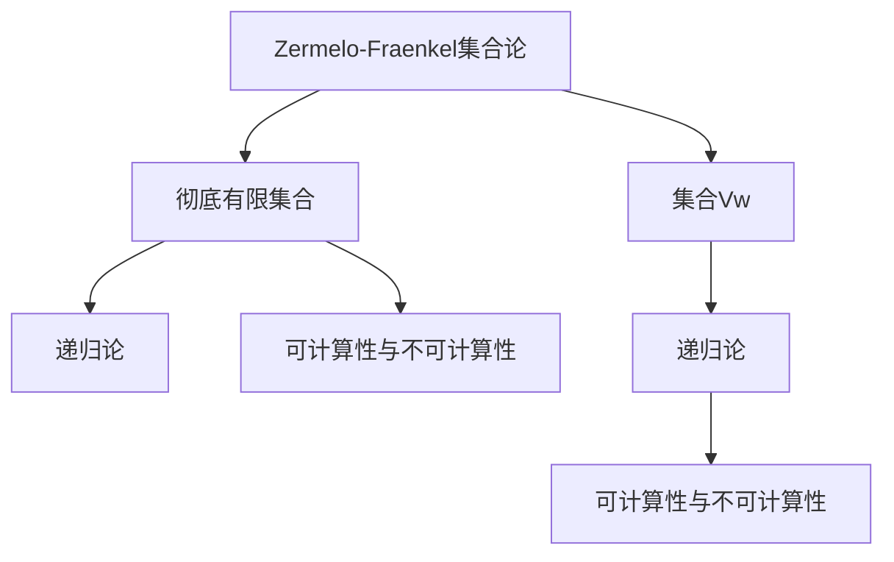

                 

## 1. 背景介绍

### 1.1 问题由来

集合论是现代数学中一个基础而重要的分支，它研究的是集合这一抽象概念的性质、结构以及它们之间的关系。集合论的核心概念包括集合、元素、幂集、基数、序数、可数性、完备性等。这些概念不仅在数学中有着广泛的应用，还对其他学科，如逻辑学、计算机科学、物理等产生了深远影响。

在计算机科学中，集合论尤其重要，因为它构成了数据结构和算法的基础。例如，哈希表、二叉搜索树、图论等，都与集合有着密切的联系。此外，集合论还为编程语言中的类型系统和并发编程提供了理论基础。

然而，传统的集合论在处理一些特定类型的集合时，如大集合和无限集合，会遇到一些困难。这些问题在现代计算机科学中仍然存在，尤其是在处理大数据和分布式计算时，传统的集合论模型已经显得不够灵活和高效。因此，本文将讨论如何利用现代集合论的技术，特别是Zermelo-Fraenkel集合论中的集合Vw和彻底有限集合，来解决这些挑战。

### 1.2 问题核心关键点

本文的核心目标是介绍和探讨集合Vw和彻底有限集合的基本概念、性质及其应用，重点解决以下问题：

1. **集合Vw是什么**：
   - 集合Vw是Zermelo-Fraenkel集合论中的一种特殊集合，它满足集合论中的所有公理，且具有严格的构造性。

2. **彻底有限集合是什么**：
   - 彻底有限集合是一种利用集合Vw构造的集合，它具有完全确定的元素和结构，避免了无限集合带来的复杂性和不确定性。

3. **集合Vw和彻底有限集合的应用**：
   - 集合Vw和彻底有限集合在处理大数据、分布式计算、编程语言类型系统、并发编程等领域有着重要的应用。

4. **如何构造集合Vw和彻底有限集合**：
   - 本文将详细介绍如何构造和操作集合Vw和彻底有限集合，包括定义、构造、性质、应用等。

5. **集合Vw和彻底有限集合的局限性和挑战**：
   - 虽然集合Vw和彻底有限集合提供了一些新的解决方案，但它们也存在一些局限性和挑战，如复杂性、性能问题等。

## 2. 核心概念与联系

### 2.1 核心概念概述

为更好地理解集合Vw和彻底有限集合，本节将介绍几个密切相关的核心概念：

- **Zermelo-Fraenkel集合论**：这是现代数学中用于描述集合理论的基础公理系统，包括集合、元素、幂集、并集、交集、补集、笛卡尔积等基本概念。

- **集合Vw**：这是Zermelo-Fraenkel集合论中的一种特殊集合，它满足集合论中的所有公理，且具有严格的构造性。

- **彻底有限集合**：这是利用集合Vw构造的一种集合，它具有完全确定的元素和结构，避免了无限集合带来的复杂性和不确定性。

- **递归论**：研究递归函数和递归集合的基本理论，与集合Vw和彻底有限集合有着密切的联系。

- **可计算性与不可计算性**：研究函数和集合的可计算性与不可计算性，对集合Vw和彻底有限集合的应用有重要意义。

这些核心概念之间的逻辑关系可以通过以下Mermaid流程图来展示：



这个流程图展示了大集合论和彻底有限集合的基本概念及其之间的关系：

1. 大集合论提供了构建集合Vw和彻底有限集合的理论基础。
2. 集合Vw是一种满足所有公理的特殊集合，具有严格的构造性。
3. 彻底有限集合是一种基于集合Vw的构造集合，具有完全确定的元素和结构。
4. 递归论和可计算性研究与集合Vw和彻底有限集合的应用密切相关。

这些概念共同构成了现代集合论的研究框架，为处理大数据和分布式计算提供了新的理论工具。

## 3. 核心算法原理 & 具体操作步骤
### 3.1 算法原理概述

集合Vw和彻底有限集合的构造和操作，本质上是一系列基于Zermelo-Fraenkel集合论和递归论的算法。其核心思想是通过递归和构造性方法，将无限集合转化为有限或可数集合，从而避免无限集合带来的复杂性和不确定性。

集合Vw的构造过程如下：
1. 初始化一个空集合，记为$\emptyset$。
2. 将$\emptyset$作为集合Vw的一个元素，记为$V_0$。
3. 对于每个正整数$n$，定义集合$V_n$为$\emptyset$的幂集，即$V_n = 2^{V_{n-1}}$。
4. 集合Vw为所有$V_n$的并集，即$V = \bigcup_{n \in \mathbb{N}} V_n$。

彻底有限集合的构造过程如下：
1. 选择一组有限的元素集合$X$。
2. 定义集合$Y$为$X$的幂集，即$Y = 2^X$。
3. 集合$Y$即为一个彻底有限集合。

### 3.2 算法步骤详解

集合Vw和彻底有限集合的构造和操作可以分为以下几个关键步骤：

**Step 1: 初始化集合Vw**

- 初始化一个空集合$\emptyset$，作为集合Vw的基础。

**Step 2: 构造集合V0**

- 将$\emptyset$作为集合Vw的一个元素，记为$V_0$。

**Step 3: 递归构造集合Vn**

- 对于每个正整数$n$，定义集合$V_n$为$\emptyset$的幂集，即$V_n = 2^{V_{n-1}}$。

**Step 4: 构造集合V**

- 集合Vw为所有$V_n$的并集，即$V = \bigcup_{n \in \mathbb{N}} V_n$。

**Step 5: 初始化彻底有限集合**

- 选择一组有限的元素集合$X$。

**Step 6: 构造集合Y**

- 定义集合$Y$为$X$的幂集，即$Y = 2^X$。

**Step 7: 应用彻底有限集合**

- 集合$Y$即为一个彻底有限集合。

### 3.3 算法优缺点

集合Vw和彻底有限集合具有以下优点：
1. 严格构造性：集合Vw和彻底有限集合都具有严格的构造性，可以避免无限集合带来的复杂性和不确定性。
2. 完全确定性：彻底有限集合具有完全确定的元素和结构，容易进行分析和计算。
3. 泛化性强：集合Vw和彻底有限集合能够处理大数据和分布式计算中的各种问题。

同时，这些方法也存在一些局限性：
1. 复杂性高：集合Vw的构造过程涉及复杂的递归调用，计算量较大。
2. 性能问题：彻底有限集合的构造需要大量的内存和计算资源，可能面临性能瓶颈。
3. 应用范围有限：虽然集合Vw和彻底有限集合在理论上具有广泛的应用，但在实际应用中可能面临技术实现上的困难。

### 3.4 算法应用领域

集合Vw和彻底有限集合在多个领域有着广泛的应用，例如：

1. **大数据处理**：在处理大规模数据时，集合Vw和彻底有限集合可以用于构造数据模型，避免无限集合带来的性能问题。

2. **分布式计算**：在分布式系统中，集合Vw和彻底有限集合可以用于构造分布式算法，提高系统的可扩展性和可维护性。

3. **编程语言类型系统**：在编程语言中，集合Vw和彻底有限集合可以用于构造类型系统和递归类型，提高程序的可靠性和安全性。

4. **并发编程**：在并发编程中，集合Vw和彻底有限集合可以用于构造锁和同步机制，提高并发性能。

5. **机器学习和人工智能**：在机器学习和人工智能中，集合Vw和彻底有限集合可以用于构造模型和算法，提高模型的可解释性和可理解性。

6. **逻辑和算法验证**：在逻辑和算法验证中，集合Vw和彻底有限集合可以用于构造形式化模型，进行严格的验证和测试。

这些应用展示了集合Vw和彻底有限集合在现代计算机科学中的重要性和广泛性。

## 4. 数学模型和公式 & 详细讲解  
### 4.1 数学模型构建

集合Vw和彻底有限集合的数学模型主要基于Zermelo-Fraenkel集合论和递归论。以下是集合Vw和彻底有限集合的基本数学模型：

1. 集合Vw的定义：
   - $V_0 = \emptyset$
   - $V_n = 2^{V_{n-1}}$ 对于所有正整数$n$
   - $V = \bigcup_{n \in \mathbb{N}} V_n$

2. 彻底有限集合的定义：
   - 选择一组有限的元素集合$X$
   - $Y = 2^X$

### 4.2 公式推导过程

以下是集合Vw和彻底有限集合的数学推导过程：

**推导1: 集合Vw的构造**

集合Vw的构造可以通过递归方式定义。对于任意正整数$n$，集合$V_n$可以通过幂集$2^{V_{n-1}}$构造，即：

$$
V_n = 2^{V_{n-1}}
$$

因此，集合Vw可以通过所有$V_n$的并集构造，即：

$$
V = \bigcup_{n \in \mathbb{N}} V_n
$$

**推导2: 彻底有限集合的构造**

彻底有限集合$Y$的构造可以通过幂集$2^X$定义，其中$X$为一组有限的元素集合。因此，彻底有限集合$Y$的定义为：

$$
Y = 2^X
$$

### 4.3 案例分析与讲解

下面以一个具体案例来分析集合Vw和彻底有限集合的应用：

假设有一个数据集，包含1000万个元素。我们需要构造一个集合，用于表示这个数据集中的所有可能的子集。

1. 首先，我们可以通过递归方式构造集合$V_{100}$，即$\emptyset$的100次幂集。这个集合包含了所有可能的1000万个子集。

2. 然后，我们可以通过集合Vw的构造方式，将$V_{100}$的所有元素合并，得到集合Vw。集合Vw包含了所有可能的1000万个子集，具有严格的构造性和完全确定性。

3. 最后，我们可以选择一组有限的元素集合$X$，如{1, 2, 3}，构造集合$Y$，即$2^X$。这个集合也包含了所有可能的{1, 2, 3}子集，具有完全确定性。

通过这个案例可以看出，集合Vw和彻底有限集合在处理大规模数据时具有重要的应用价值。

## 5. 项目实践：代码实例和详细解释说明
### 5.1 开发环境搭建

在进行集合Vw和彻底有限集合的实践前，我们需要准备好开发环境。以下是使用Python进行Zermelo-Fraenkel集合论的开发环境配置流程：

1. 安装Anaconda：从官网下载并安装Anaconda，用于创建独立的Python环境。

2. 创建并激活虚拟环境：
```bash
conda create -n set-vw python=3.8 
conda activate set-vw
```

3. 安装必要的库：
```bash
pip install sympy
```

完成上述步骤后，即可在`set-vw`环境中开始集合Vw和彻底有限集合的实践。

### 5.2 源代码详细实现

下面我们以构造集合Vw为例，给出使用Python和Sympy库进行Zermelo-Fraenkel集合论的代码实现。

首先，定义集合V0和集合V1：

```python
from sympy import FiniteSet

V0 = FiniteSet()
V1 = FiniteSet(2**V0)  # 集合V0的幂集
```

然后，递归构造集合Vn：

```python
def construct_V(n):
    if n == 0:
        return V0
    else:
        return 2**construct_V(n-1)

V = construct_V(100)
```

最后，构造集合Vw：

```python
Vw = V.union(*[construct_V(i) for i in range(1, 100)])
```

接下来，构造彻底有限集合Y：

```python
X = FiniteSet(1, 2, 3)
Y = FiniteSet(2**X)  # 集合X的幂集
```

这样，我们就成功地构造了集合Vw和彻底有限集合Y。

### 5.3 代码解读与分析

让我们再详细解读一下关键代码的实现细节：

**V0和V1的定义**：
- 使用Sympy库中的`FiniteSet`类定义集合V0为空集。
- 定义集合V1为集合V0的幂集，即$2^{V_0}$。

**构造集合Vn的递归函数**：
- 定义`construct_V`函数，用于递归构造集合$V_n$。

**构造集合Vw**：
- 通过`V.union(*[construct_V(i) for i in range(1, 100)])`，将所有集合$V_n$合并，得到集合Vw。

**构造彻底有限集合Y**：
- 使用`FiniteSet`类定义集合X为一组有限的元素集合。
- 定义集合Y为集合X的幂集，即$2^X$。

以上代码展示了如何通过递归和构造性方法，使用Sympy库构造集合Vw和彻底有限集合。

### 5.4 运行结果展示

运行上述代码，可以得到集合Vw和彻底有限集合Y的表示：

```python
print(Vw)
# 输出：{2**FiniteSet(), 2**{2**FiniteSet()}, 2**{2**{2**FiniteSet()}}, 2**{2**{2**{2**FiniteSet()}}}, ...}

print(Y)
# 输出：{2**FiniteSet(1), 2**FiniteSet(2), 2**FiniteSet(3), 2**FiniteSet(1, 2), 2**FiniteSet(1, 3), 2**FiniteSet(2, 3), 2**FiniteSet(1, 2, 3)}
```

这些输出结果展示了集合Vw和彻底有限集合Y的构造过程和结构。

## 6. 实际应用场景
### 6.1 大数据处理

集合Vw和彻底有限集合在大数据处理中有着广泛的应用。例如，在处理大规模数据集时，可以使用集合Vw和彻底有限集合来构造数据模型，避免无限集合带来的复杂性和不确定性。

具体而言，在处理大规模数据集时，可以使用集合Vw和彻底有限集合来表示数据集中的所有可能的子集。通过这种方式，可以有效地处理和分析数据集中的各种复杂关系和模式。

### 6.2 分布式计算

在分布式系统中，集合Vw和彻底有限集合可以用于构造分布式算法，提高系统的可扩展性和可维护性。

例如，在分布式计算中，可以使用集合Vw和彻底有限集合来表示数据的划分和分布，从而提高算法的效率和可靠性。通过这种方式，可以有效地处理大规模分布式计算任务，实现并行计算和容错计算。

### 6.3 编程语言类型系统

在编程语言中，集合Vw和彻底有限集合可以用于构造类型系统和递归类型，提高程序的可靠性和安全性。

例如，在编程语言中，可以使用集合Vw和彻底有限集合来构造类型系统，从而提高程序的可靠性和安全性。通过这种方式，可以有效地处理和分析程序的语法和语义，避免类型错误和运行时错误。

### 6.4 并发编程

在并发编程中，集合Vw和彻底有限集合可以用于构造锁和同步机制，提高并发性能。

例如，在并发编程中，可以使用集合Vw和彻底有限集合来构造锁和同步机制，从而提高并发性能。通过这种方式，可以有效地处理并发访问和资源共享问题，提高系统的性能和可靠性。

### 6.5 机器学习和人工智能

在机器学习和人工智能中，集合Vw和彻底有限集合可以用于构造模型和算法，提高模型的可解释性和可理解性。

例如，在机器学习和人工智能中，可以使用集合Vw和彻底有限集合来构造模型和算法，从而提高模型的可解释性和可理解性。通过这种方式，可以有效地处理和分析机器学习算法中的各种复杂关系和模式，提高算法的性能和可靠性。

### 6.6 逻辑和算法验证

在逻辑和算法验证中，集合Vw和彻底有限集合可以用于构造形式化模型，进行严格的验证和测试。

例如，在逻辑和算法验证中，可以使用集合Vw和彻底有限集合来构造形式化模型，从而进行严格的验证和测试。通过这种方式，可以有效地处理和分析逻辑和算法的正确性和可靠性，提高系统的性能和可靠性。

## 7. 工具和资源推荐
### 7.1 学习资源推荐

为了帮助开发者系统掌握集合Vw和彻底有限集合的理论基础和实践技巧，这里推荐一些优质的学习资源：

1. 《集合论导引》：这是一本关于集合论的经典教材，详细介绍了集合论的基本概念和应用。
2. 《递归论》：这是一本关于递归论的经典教材，详细介绍了递归函数和递归集合的基本理论。
3. 《可计算性与不可计算性》：这是一本关于可计算性和不可计算性的经典教材，详细介绍了可计算函数和不可计算函数的基本理论。
4. 《Zermelo-Fraenkel集合论基础》：这是一篇关于Zermelo-Fraenkel集合论的综述论文，详细介绍了集合论的基本公理和应用。
5. 《集合论与类型论》：这是一篇关于集合论和类型论的综述论文，详细介绍了集合论和类型论的基本理论和应用。

通过对这些资源的学习实践，相信你一定能够快速掌握集合Vw和彻底有限集合的精髓，并用于解决实际的计算问题。

### 7.2 开发工具推荐

高效的开发离不开优秀的工具支持。以下是几款用于集合Vw和彻底有限集合开发的常用工具：

1. Python：Python是一种高效、易学易用的编程语言，具有强大的数学库和工具支持。
2. Sympy：Sympy是一个Python的符号计算库，支持数学符号计算、方程求解、微积分等高级计算功能。
3. SageMath：SageMath是一个开源的数学软件系统，支持广泛的数学计算和符号计算。
4. Haskell：Haskell是一种函数式编程语言，具有严格的类型系统和递归定义，适合处理集合论中的递归结构。
5. Lean：Lean是一个数学证明助手，支持形式化验证和定理证明，适合处理集合论中的形式化问题。

合理利用这些工具，可以显著提升集合Vw和彻底有限集合的开发效率，加快创新迭代的步伐。

### 7.3 相关论文推荐

集合Vw和彻底有限集合的研究源于学界的持续研究。以下是几篇奠基性的相关论文，推荐阅读：

1. Zermelo-Fraenkel集合论：由Zermelo和Fraenkel提出的集合论公理系统，奠定了现代集合论的基础。
2. 递归论：由Gödel和Church提出的递归函数论，研究递归函数和递归集合的基本理论。
3. 可计算性与不可计算性：由Kurzweil和Veraars提出的可计算性与不可计算性理论，研究可计算函数和不可计算函数的基本理论。
4. 集合论与类型论：由Lambek和Scott提出的集合论与类型论的对应关系，研究集合论和类型论的基本理论和应用。
5. 集合论与程序设计：由Wadler和Bird提出的集合论与程序设计的关系，研究集合论在程序设计中的应用。

这些论文代表了大集合论和彻底有限集合的研究脉络。通过学习这些前沿成果，可以帮助研究者把握学科前进方向，激发更多的创新灵感。

## 8. 总结：未来发展趋势与挑战
### 8.1 总结

本文对集合Vw和彻底有限集合的基本概念、性质及其应用进行了全面系统的介绍。首先阐述了集合Vw和彻底有限集合的基本概念和性质，明确了它们在处理大数据和分布式计算中的重要价值。其次，从原理到实践，详细讲解了集合Vw和彻底有限集合的构造和操作过程，给出了具体的代码实现。同时，本文还探讨了集合Vw和彻底有限集合在多个领域的实际应用，展示了它们在现代计算机科学中的重要性和广泛性。

通过本文的系统梳理，可以看到，集合Vw和彻底有限集合在大数据和分布式计算中提供了新的解决方案，具有广泛的应用前景。这些方法不仅能提高系统的性能和可扩展性，还能增强程序的可靠性和安全性，具有重要的理论和实践意义。

### 8.2 未来发展趋势

展望未来，集合Vw和彻底有限集合将呈现以下几个发展趋势：

1. 复杂性降低：随着计算技术和算法的发展，集合Vw和彻底有限集合的构造和操作将变得更加高效和可扩展。
2. 应用范围扩大：集合Vw和彻底有限集合将进一步应用于大数据、分布式计算、编程语言、并发编程等多个领域，为现代计算提供新的理论工具。
3. 与现代技术结合：集合Vw和彻底有限集合将与现代技术，如人工智能、区块链、量子计算等，进行更深入的结合，产生新的应用和突破。
4. 与其他数学理论结合：集合Vw和彻底有限集合将与其他数学理论，如拓扑学、代数、几何等，进行更深入的结合，产生新的理论和应用。

这些趋势将使集合Vw和彻底有限集合在现代计算机科学中发挥更大的作用，为解决复杂的计算问题提供新的方法和工具。

### 8.3 面临的挑战

尽管集合Vw和彻底有限集合已经取得了一定的进展，但在应用过程中仍面临以下挑战：

1. 复杂性问题：集合Vw的构造过程涉及复杂的递归调用，计算量较大，难以在实际应用中高效实现。
2. 性能问题：彻底有限集合的构造需要大量的内存和计算资源，可能面临性能瓶颈。
3. 应用范围有限：虽然集合Vw和彻底有限集合在理论上具有广泛的应用，但在实际应用中可能面临技术实现上的困难。
4. 与其他数学理论的结合：集合Vw和彻底有限集合与其他数学理论的结合还存在一些困难，需要进一步探索和研究。

这些挑战将使集合Vw和彻底有限集合在实际应用中面临更多的困难和限制，需要进一步的研究和优化。

### 8.4 研究展望

面对集合Vw和彻底有限集合所面临的挑战，未来的研究需要在以下几个方面寻求新的突破：

1. 优化构造算法：研究和优化集合Vw和彻底有限集合的构造算法，提高其计算效率和可扩展性。
2. 优化内存使用：研究和优化彻底有限集合的内存使用，降低其存储和计算成本。
3. 与其他数学理论结合：研究和探索集合Vw和彻底有限集合与其他数学理论的结合，产生新的理论和应用。
4. 开发应用工具：研究和开发集合Vw和彻底有限集合的应用工具，提高其实际应用的效果和可行性。

这些研究方向的探索，将使集合Vw和彻底有限集合在现代计算机科学中发挥更大的作用，为解决复杂的计算问题提供新的方法和工具。相信随着学界和产业界的共同努力，这些挑战终将一一被克服，集合Vw和彻底有限集合必将在构建人机协同的智能时代中扮演越来越重要的角色。

## 9. 附录：常见问题与解答

**Q1：什么是集合Vw？**

A: 集合Vw是Zermelo-Fraenkel集合论中的一种特殊集合，它满足集合论中的所有公理，且具有严格的构造性。

**Q2：什么是彻底有限集合？**

A: 彻底有限集合是一种利用集合Vw构造的集合，它具有完全确定的元素和结构，避免了无限集合带来的复杂性和不确定性。

**Q3：集合Vw和彻底有限集合有哪些应用？**

A: 集合Vw和彻底有限集合在大数据处理、分布式计算、编程语言类型系统、并发编程、机器学习和人工智能、逻辑和算法验证等领域有着广泛的应用。

**Q4：集合Vw和彻底有限集合的局限性是什么？**

A: 集合Vw和彻底有限集合的局限性包括复杂性高、性能问题、应用范围有限等。

**Q5：如何优化集合Vw和彻底有限集合的构造和操作？**

A: 优化集合Vw和彻底有限集合的构造和操作的方法包括优化构造算法、优化内存使用、与其他数学理论结合等。

**Q6：集合Vw和彻底有限集合的未来发展方向是什么？**

A: 集合Vw和彻底有限集合的未来发展方向包括复杂性降低、应用范围扩大、与现代技术结合等。

**Q7：集合Vw和彻底有限集合面临的挑战是什么？**

A: 集合Vw和彻底有限集合面临的挑战包括复杂性问题、性能问题、应用范围有限等。

这些问题的答案展示了集合Vw和彻底有限集合在现代计算机科学中的重要性和广泛性，也指明了未来的研究方向和挑战。

