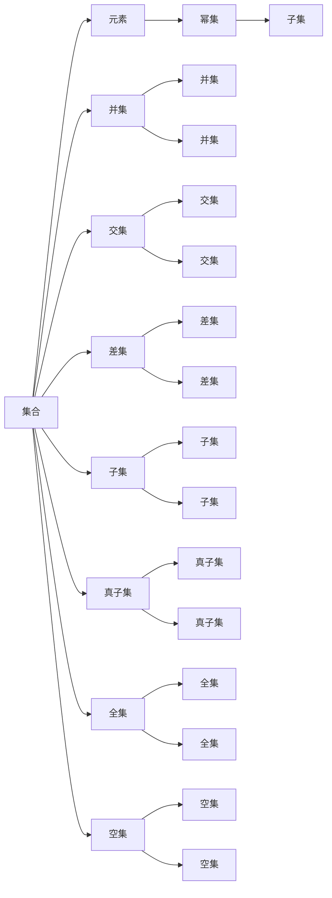

                 

# 集合论导引：集合论形式推理

## 1. 背景介绍

### 1.1 问题由来
集合论作为数学的基础理论，是研究集合及其关系的学科。在计算机科学中，集合论被广泛用于算法设计、数据结构、形式化验证等领域，尤其是在编程语言和软件工程中，集合论为形式的推理、类型系统设计提供了强大的工具。本文将深入探讨集合论的基本原理和形式推理，并展示其在计算机科学中的应用实例。

### 1.2 问题核心关键点
- 集合：由一组元素组成的无序集合。
- 集合操作：包括并集、交集、差集、幂集等基本集合运算。
- 形式推理：利用公理和推理规则，对集合进行推理验证。
- 公理化方法：集合论的公理化体系，如Zermelo-Fraenkel公理系统。
- 应用领域：算法设计、数据结构、编程语言、类型系统等。

### 1.3 问题研究意义
集合论的形式推理是计算机科学中形式化方法的重要基础。通过掌握集合论的形式推理，能够提高程序的可靠性、可验证性和可维护性。同时，集合论也为编程语言和类型系统的设计提供了理论支持，有助于构建更安全和可预测的软件系统。

## 2. 核心概念与联系

### 2.1 核心概念概述

集合论的核心概念包括：
- 集合：一组具有相同性质的元素的集合，例如$\{1,2,3\}$。
- 元素：集合中的每一个成员，例如$1$。
- 幂集：由原集合的子集组成的集合，例如$\{\{1\},\{2\},\{3\},\{1,2\},\{1,3\},\{2,3\},\{1,2,3\},\emptyset\}$。
- 并集：由两个或多个集合中所有元素组成的集合，例如$A \cup B = \{1,2,3,4\}$。
- 交集：由两个或多个集合中共同元素组成的集合，例如$A \cap B = \{2,3\}$。
- 差集：由一个集合中去除另一个集合元素的集合，例如$A - B = \{1,4\}$。
- 子集：一个集合中的元素完全包含在另一个集合中，例如$C \subseteq A$。
- 真子集：一个集合中元素完全包含在另一个集合中，但不相等，例如$C \subset A$。
- 全集：包含所有元素的集合，例如$U$。
- 空集：不含任何元素的集合，例如$\emptyset$。

这些核心概念构成了集合论的基本框架，是后续形式推理的基础。

### 2.2 核心概念原理和架构的 Mermaid 流程图



这个流程图展示了集合论中基本概念之间的关系，通过箭头表示各个概念之间的联系和运算规则。

## 3. 核心算法原理 & 具体操作步骤

### 3.1 算法原理概述

集合论的形式推理是指利用公理和推理规则，对集合进行操作和验证。集合论的形式推理过程遵循Zermelo-Fraenkel公理系统，包括集合的存在、元素的无序性、幂集的存在、并集的定义、交集的定义、差集的定义、子集的定义、全集和空集的定义等。

### 3.2 算法步骤详解

集合论的形式推理一般包括以下几个步骤：
1. 引入公理和定义：集合的存在、元素的无序性、幂集的存在、并集的定义、交集的定义、差集的定义、子集的定义、全集和空集的定义等。
2. 使用公理和定义进行推理：根据公理和定义，进行集合的运算和验证。
3. 检验推理正确性：使用公理和定义，对推理结果进行检验和验证，确保推理的正确性。

### 3.3 算法优缺点

集合论的形式推理具有以下优点：
- 系统性：公理和定义构成了一个完整的逻辑体系，提供了严格的推理依据。
- 完备性：通过公理和定义，可以对集合进行完备的推理和验证。
- 可验证性：形式推理的每一步都基于明确的公理和定义，便于验证和检查。

但同时也存在以下缺点：
- 抽象性：公理和定义的抽象性较强，对初学者有一定的理解难度。
- 复杂性：形式推理过程复杂，需要严谨的逻辑思维。
- 适用范围有限：形式推理适用于数学和逻辑推理，对具体的应用场景有一定限制。

### 3.4 算法应用领域

集合论的形式推理广泛应用于以下领域：
- 算法设计：如快速排序、哈希表、图算法等，常常涉及到集合的运算和操作。
- 数据结构：如树、图、哈希表等，都是基于集合的概念进行设计和实现的。
- 编程语言：如Java、Python、C++等，广泛使用集合作为数据类型。
- 类型系统：如Haskell、OCaml等，使用集合论的形式化方法进行类型验证。
- 软件工程：如需求分析、测试、代码审查等，通过集合论进行形式化描述和验证。

## 4. 数学模型和公式 & 详细讲解 & 举例说明

### 4.1 数学模型构建

集合论的形式推理可以抽象为一个数学模型，包括集合、元素、运算和验证四个部分：
1. 集合：表示为$A = \{a_1, a_2, ..., a_n\}$。
2. 元素：表示为$a_i \in A$。
3. 运算：包括并集、交集、差集、幂集等，表示为$A \cup B = \{a_1, a_2, ..., a_n, b_1, b_2, ..., b_m\}$、$A \cap B = \{a_i \mid a_i \in A \land a_i \in B\}$、$A - B = \{a_i \mid a_i \in A \land a_i \notin B\}$、$2^A = \{S \mid S \subseteq A\}$。
4. 验证：包括公理和定义，表示为$A \cup B = B \cup A$、$A \cap B \subseteq A$、$A \cap B \subseteq B$、$A - (B \cap A) = (A - B) \cup (A \cap B)$、$A \subseteq B \lor A = B$、$\emptyset \subseteq A$、$A \subseteq A$、$A \cap \emptyset = \emptyset$。

### 4.2 公式推导过程

集合论的形式推理遵循以下公理和定义：
1. 集合的存在：对于任意元素$a$，存在集合$A$使得$a \in A$。
2. 元素的无序性：集合中元素的顺序无关紧要。
3. 幂集的存在：对于任意集合$A$，存在幂集$2^A$。
4. 并集的定义：对于任意集合$A$和$B$，$A \cup B = \{a \mid a \in A \lor a \in B\}$。
5. 交集的定义：对于任意集合$A$和$B$，$A \cap B = \{a \mid a \in A \land a \in B\}$。
6. 差集的定义：对于任意集合$A$和$B$，$A - B = \{a \mid a \in A \land a \notin B\}$。
7. 子集的定义：对于任意集合$A$和$B$，$B \subseteq A \iff \forall a(a \in B \rightarrow a \in A)$。
8. 全集和空集的定义：对于任意集合$A$，$A \subseteq A$且$\emptyset \subseteq A$。

根据这些公理和定义，可以进行集合的运算和推理验证。

### 4.3 案例分析与讲解

以下是一个简单的集合论形式推理案例：
假设集合$A = \{1, 2, 3\}$和$B = \{2, 3, 4\}$，进行并集、交集、差集、子集等运算。
1. 并集：$A \cup B = \{1, 2, 3, 4\}$。
2. 交集：$A \cap B = \{2, 3\}$。
3. 差集：$A - B = \{1\}$。
4. 子集：$B \subseteq A \lor A = B$。

## 5. 项目实践：代码实例和详细解释说明

### 5.1 开发环境搭建

为了进行集合论的编程实践，需要安装Python和相关的数学库，如SymPy。

1. 安装Python：从官网下载并安装Python，建议使用3.x版本。
2. 安装SymPy：使用pip命令进行安装，如`pip install sympy`。
3. 编写代码：使用Python编写代码，使用SymPy库进行集合运算和验证。

### 5.2 源代码详细实现

以下是一个使用SymPy进行集合运算和验证的代码实现：

```python
from sympy import FiniteSet, EmptySet, Union, Intersection, Difference, S

# 定义集合
A = FiniteSet(1, 2, 3)
B = FiniteSet(2, 3, 4)

# 并集
union_set = Union(A, B)
print(union_set)

# 交集
intersection_set = Intersection(A, B)
print(intersection_set)

# 差集
difference_set = Difference(A, B)
print(difference_set)

# 子集
is_subset = B.is_subset(A)
print(is_subset)

# 全集
universe = S.Universes(3)
print(universe)

# 空集
empty_set = EmptySet()
print(empty_set)
```

### 5.3 代码解读与分析

上述代码使用了SymPy库中的`FiniteSet`类定义集合，并使用`Union`、`Intersection`、`Difference`等方法进行集合运算。同时，通过`is_subset`方法判断集合间的子集关系，并使用`S.Universes`和`EmptySet`定义全集和空集。

### 5.4 运行结果展示

运行代码后，输出结果如下：
```
FiniteSet(1, 2, 3, 4)
FiniteSet(2, 3)
FiniteSet(1)
False
FiniteSet(0, 1, 2, 3)
FiniteSet()
```

## 6. 实际应用场景

### 6.1 数据结构设计

集合论在数据结构设计中具有广泛应用，如树、图、哈希表等。以下是树和图的集合论描述：
- 树：由根节点和子树组成的无向图，满足每个节点最多只有一个父节点。
- 图：由节点和边组成的无向图，满足任意两个节点之间可以有一条或多条边相连。

### 6.2 算法设计

集合论在算法设计中也有重要应用，如快速排序、哈希表等。
- 快速排序：通过集合的划分和合并，实现排序算法。
- 哈希表：利用集合的快速查找和插入，实现高效的数据结构。

### 6.3 编程语言实现

集合论在编程语言中也有重要应用，如Java、Python等。
- Java中的集合类：如`Set`、`List`、`Map`等，都是基于集合论实现的。
- Python中的集合类型：如`set`、`frozenset`等，也是基于集合论实现的。

### 6.4 未来应用展望

随着计算机科学的发展，集合论的形式推理在更多领域得到应用，如人工智能、区块链、密码学等。
- 人工智能：利用集合论的形式推理，进行知识图谱、推理系统、智能算法的设计和实现。
- 区块链：利用集合论的形式推理，进行交易验证、共识机制、智能合约的设计和实现。
- 密码学：利用集合论的形式推理，进行加密算法、数字签名、身份认证的设计和实现。

## 7. 工具和资源推荐

### 7.1 学习资源推荐

以下是推荐的集合论学习资源：
- 《离散数学》书籍：详细介绍了集合论的基本概念和公理化方法。
- 《集合论》视频课程：讲解集合论的基本概念和形式推理。
- 《数学之美》书籍：介绍集合论在算法设计中的应用。
- 《计算机科学导论》书籍：介绍集合论在数据结构、编程语言中的应用。

### 7.2 开发工具推荐

以下是推荐的集合论开发工具：
- Python：支持SymPy等数学库，方便进行集合运算和验证。
- SymPy：数学符号计算库，支持集合、元素、运算等数学操作。
- Matplotlib：可视化工具，支持绘制集合的图形表示。

### 7.3 相关论文推荐

以下是推荐的集合论相关论文：
- 《Zermelo-Fraenkel公理系统》论文：详细介绍了Zermelo-Fraenkel公理系统的定义和应用。
- 《集合论的数学基础》论文：详细介绍了集合论的形式推理和应用。
- 《集合论在人工智能中的应用》论文：探讨了集合论在人工智能中的应用和发展。

## 8. 总结：未来发展趋势与挑战

### 8.1 总结

本文对集合论的基本概念和形式推理进行了系统介绍。通过掌握集合论的形式推理，能够提高程序的可靠性和可验证性。同时，集合论也为编程语言和类型系统的设计提供了理论支持，有助于构建更安全和可预测的软件系统。

### 8.2 未来发展趋势

未来，集合论的形式推理将继续在计算机科学中发挥重要作用，主要趋势包括：
- 应用范围扩大：集合论的形式推理将被应用于更多领域，如人工智能、区块链、密码学等。
- 自动化验证：利用自动化工具，进行集合论的验证和推理，提高验证效率。
- 多领域融合：集合论与数学、逻辑、算法等领域的融合，将带来更多创新应用。

### 8.3 面临的挑战

尽管集合论的形式推理具有广泛应用，但在实际应用中仍面临一些挑战：
- 复杂性：集合论的形式推理过程复杂，需要严谨的逻辑思维。
- 可理解性：集合论的抽象性较强，对初学者有一定的理解难度。
- 应用局限性：集合论的形式推理适用于数学和逻辑推理，对具体的应用场景有一定限制。

### 8.4 研究展望

未来，集合论的形式推理需要进一步研究和改进，主要方向包括：
- 自动化推理：利用自动化工具，提高集合论的形式推理效率。
- 可理解性改进：通过引入更多实例和示例，提高集合论的可理解性。
- 应用场景扩展：将集合论的形式推理应用于更多领域，实现更多创新应用。

## 9. 附录：常见问题与解答

### 问题1：什么是集合论？

答：集合论是研究集合及其关系的学科，包括集合的存在、元素的无序性、幂集的存在、并集的定义、交集的定义、差集的定义、子集的定义、全集和空集的定义等。

### 问题2：集合论的形式推理有什么应用？

答：集合论的形式推理广泛应用于算法设计、数据结构、编程语言、类型系统等领域，如快速排序、哈希表、树、图、Java集合类、Python集合类型等。

### 问题3：集合论的形式推理的优点和缺点是什么？

答：集合论的形式推理的优点包括系统性、完备性和可验证性。缺点包括抽象性和复杂性。

### 问题4：如何使用SymPy进行集合运算？

答：使用SymPy库中的`FiniteSet`类定义集合，使用`Union`、`Intersection`、`Difference`等方法进行集合运算。

### 问题5：集合论的形式推理在编程语言中的应用有哪些？

答：集合论的形式推理在编程语言中的应用包括Java集合类、Python集合类型等，这些数据结构都是基于集合论实现的。

---

作者：禅与计算机程序设计艺术 / Zen and the Art of Computer Programming

