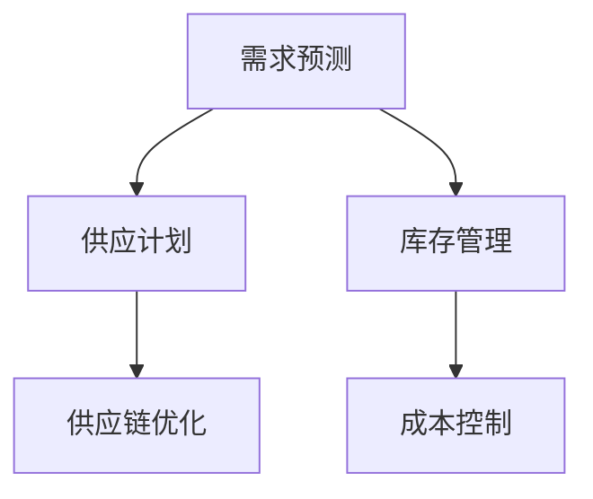

                 

## 1. 背景介绍

在当今快速变化的市场环境中，商品供应的优化变得越来越重要。无论是零售、物流还是制造业，各个领域的企业都需要更灵活、高效的策略来管理其库存和供应。然而，由于库存管理的复杂性，很多企业面临着供需不匹配的问题，导致成本上升和客户满意度下降。因此，需求驱动的商品供给优化已成为企业提升竞争力的关键。

### 1.1 问题由来
商品供给优化问题主要源于需求预测的不确定性和供应的不稳定性。在传统库存管理中，企业通常采用周期性补货策略，这种策略在需求变化缓慢的情况下效果不错，但当需求波动较大时，会导致库存过剩或短缺。此外，供应链中的信息不对称和延迟也加剧了库存管理的问题。

### 1.2 问题核心关键点
需求驱动的商品供给优化，核心在于如何结合需求预测和供应能力，实时调整库存水平，以满足市场的需求。这涉及以下几个关键点：

- 需求预测：准确预测未来需求，是库存优化的基础。
- 供应能力：了解自身和供应商的生产能力，制定合理的供应计划。
- 库存控制：实时监控库存状态，动态调整补货策略。
- 成本控制：在满足需求的前提下，最小化库存持有成本和运输成本。
- 客户满意度：确保产品供应充足，提升客户满意度。

通过需求驱动的优化，企业可以更灵活地应对市场变化，提升运营效率，降低成本，提高竞争力。

## 2. 核心概念与联系

### 2.1 核心概念概述

为更好地理解需求驱动的商品供给优化方法，本节将介绍几个密切相关的核心概念：

- 需求预测：通过历史数据和模型算法，预测未来的需求量。
- 供应计划：基于需求预测和供应能力，制定合理的生产或采购计划。
- 库存管理：实时监控库存状态，动态调整补货策略。
- 供应链优化：优化供应链各环节，提高信息透明度和响应速度。
- 成本控制：在满足需求的前提下，最小化库存持有成本和运输成本。

这些核心概念之间的逻辑关系可以通过以下Mermaid流程图来展示：



这个流程图展示了一体化需求驱动的商品供给优化过程：

1. 通过需求预测，获取未来的需求信息。
2. 根据需求预测和供应能力，制定合理的生产或采购计划。
3. 实时监控库存状态，动态调整补货策略。
4. 优化供应链各环节，提高响应速度和效率。
5. 在满足需求的前提下，最小化成本。

## 3. 核心算法原理 & 具体操作步骤
### 3.1 算法原理概述

需求驱动的商品供给优化，本质是一个多目标优化问题，涉及需求预测、供应计划、库存管理等多个环节。其核心思想是：在保证需求满足的前提下，最小化库存持有成本和运输成本，实现整体效益最大化。

形式化地，假设需求预测模型为 $D(t)$，供应能力为 $C(t)$，当前库存为 $I(t)$，单位库存持有成本为 $H$，单位运输成本为 $T$，目标函数为 $F(I(t), C(t), D(t))$。需求驱动的商品供给优化即求 $I(t)$ 的最优解，使得 $F$ 最小化：

$$
\min F(I(t), C(t), D(t)) = H \cdot I(t) + T \cdot C(t) + \delta \cdot D(t)
$$

其中 $\delta$ 为需求惩罚系数，保证需求得到满足。

### 3.2 算法步骤详解

需求驱动的商品供给优化一般包括以下几个关键步骤：

**Step 1: 数据准备与预处理**
- 收集历史销售数据、价格数据、库存数据、促销数据等，提取有用的特征。
- 清洗数据，处理缺失值、异常值，生成数据集。
- 对数据集进行划分，分为训练集、验证集和测试集。

**Step 2: 需求预测模型训练**
- 选择合适的时间序列预测模型，如ARIMA、LSTM等。
- 使用训练集数据训练模型，得到需求预测模型 $D(t)$。
- 在验证集上评估模型性能，调整模型参数，避免过拟合。

**Step 3: 供应计划制定**
- 确定供应周期和补货点，设定安全库存和最大库存。
- 根据需求预测结果，计算每日供应量。
- 考虑生产周期和提前期，制定生产计划或采购计划。

**Step 4: 库存管理与补货策略**
- 实时监控库存水平，根据当前库存和预测需求，计算补货量和补货时间。
- 考虑库存持有成本和运输成本，制定最优补货策略。
- 引入安全库存和最大库存，避免库存过剩或短缺。

**Step 5: 成本控制与优化**
- 计算库存持有成本和运输成本，结合需求预测结果，调整供应计划。
- 引入多目标优化方法，如遗传算法、模拟退火等，寻求整体效益最大化。
- 对供应链各环节进行优化，提高信息透明度和响应速度。

**Step 6: 模型评估与部署**
- 在测试集上评估模型性能，对比优化前后的效果。
- 使用优化后的模型对实时数据进行预测和补货策略调整。
- 持续收集新数据，定期重新训练模型，以适应数据分布的变化。

以上是需求驱动的商品供给优化的一般流程。在实际应用中，还需要针对具体问题特点，对各个环节进行优化设计，如改进预测模型，引入更多正则化技术，搜索最优的供应计划等，以进一步提升优化效果。

### 3.3 算法优缺点

需求驱动的商品供给优化方法具有以下优点：
1. 灵活高效。能够实时动态调整库存水平，快速响应市场变化。
2. 综合考虑成本和需求。通过多目标优化，平衡库存和供应，实现整体效益最大化。
3. 提升客户满意度。通过实时调整供应策略，确保产品充足，提升客户体验。

同时，该方法也存在一定的局限性：
1. 数据依赖性强。优化效果很大程度上取决于历史数据的丰富性和准确性。
2. 模型复杂度高。涉及多个环节的优化，模型设计和参数调参较复杂。
3. 适应性差。当需求预测模型不精确或供应能力受限时，效果可能不佳。
4. 实现难度大。需要结合多种技术和算法，整合系统，实现难度较高。

尽管存在这些局限性，但就目前而言，需求驱动的商品供给优化方法仍是大规模商品管理的重要手段。未来相关研究的重点在于如何进一步降低数据依赖，提高模型的稳定性和可解释性，同时兼顾可扩展性和效率。

### 3.4 算法应用领域

需求驱动的商品供给优化方法，在零售、物流、制造业等多个领域均有广泛的应用，具体如下：

- 零售业：通过需求预测和库存管理，优化商品陈列、补货策略，提升销售量和客户满意度。
- 物流行业：结合需求预测和供应链优化，制定最佳的配送路径和运输计划，降低运输成本。
- 制造业：通过需求预测和生产计划，合理调配生产资源，降低库存持有成本，提升生产效率。
- 农业：结合市场需求和种植周期，制定合理的种植计划，优化农产品的生产和供应。

这些领域的需求驱动优化，不仅提升了企业的运营效率，还为用户带来了更好的购物体验和服务质量。

## 4. 数学模型和公式 & 详细讲解  
### 4.1 数学模型构建

本节将使用数学语言对需求驱动的商品供给优化过程进行更加严格的刻画。

假设企业有 $N$ 种商品，第 $i$ 种商品的需求预测模型为 $D_i(t)$，供应能力为 $C_i(t)$，单位库存持有成本为 $H_i$，单位运输成本为 $T_i$，当前库存为 $I_i(t)$，目标函数为 $F_i(I_i(t), C_i(t), D_i(t))$。需求驱动的商品供给优化模型可以表示为：

$$
\min \sum_{i=1}^N \left[ H_i \cdot I_i(t) + T_i \cdot C_i(t) + \delta_i \cdot D_i(t) \right]
$$

其中 $\delta_i$ 为需求惩罚系数，保证需求得到满足。

### 4.2 公式推导过程

以下我们以单商品为例，推导需求驱动的商品供给优化模型的优化公式。

假设需求预测模型 $D_i(t)$ 为线性模型 $D_i(t) = \alpha_i + \beta_i \cdot t$，供应能力 $C_i(t)$ 为常数 $C_i$，单位库存持有成本 $H_i$ 为常数，单位运输成本 $T_i$ 为常数，当前库存 $I_i(t)$ 为未知变量。目标函数 $F_i(I_i(t), C_i(t), D_i(t)) = H_i \cdot I_i(t) + T_i \cdot C_i(t) + \delta_i \cdot (D_i(t) - I_i(t))$。

根据目标函数，我们对 $I_i(t)$ 进行求导：

$$
\frac{\partial F_i}{\partial I_i} = H_i - \delta_i
$$

令导数为0，求解 $I_i(t)$：

$$
I_i(t) = \frac{\delta_i}{H_i}
$$

将 $I_i(t)$ 代入目标函数，得到：

$$
F_i = H_i \cdot \frac{\delta_i}{H_i} + T_i \cdot C_i - \delta_i \cdot (D_i(t) - \frac{\delta_i}{H_i})
$$

化简得：

$$
F_i = T_i \cdot C_i - \delta_i \cdot D_i(t)
$$

上式即为需求驱动的商品供给优化模型的最优库存水平。可以看到，最优库存水平与需求预测模型、供应能力和惩罚系数有关。

### 4.3 案例分析与讲解

假设某电商平台上某商品 $i$ 的需求预测模型为 $D_i(t) = 1000 + 100t$，供应能力 $C_i = 500$，单位库存持有成本 $H_i = 0.1$，单位运输成本 $T_i = 2$，需求惩罚系数 $\delta_i = 50$。

根据公式计算，当 $t=10$ 时，最优库存水平为：

$$
I_i(t) = \frac{\delta_i}{H_i} = \frac{50}{0.1} = 500
$$

此时目标函数 $F_i$ 为：

$$
F_i = T_i \cdot C_i - \delta_i \cdot D_i(t) = 2 \cdot 500 - 50 \cdot (1000 + 100 \cdot 10) = 0
$$

即在 $t=10$ 时，达到最优库存水平，总成本为0。

通过这个案例，可以看到需求驱动的商品供给优化模型的计算过程和结果。通过计算最优库存水平，可以实时调整补货策略，优化整体效益。

## 5. 项目实践：代码实例和详细解释说明
### 5.1 开发环境搭建

在进行商品供给优化实践前，我们需要准备好开发环境。以下是使用Python进行Pandas、Scikit-learn、Matplotlib等库开发的Python环境配置流程：

1. 安装Anaconda：从官网下载并安装Anaconda，用于创建独立的Python环境。

2. 创建并激活虚拟环境：
```bash
conda create -n supply-env python=3.8 
conda activate supply-env
```

3. 安装Pandas：用于数据处理和分析。
```bash
pip install pandas
```

4. 安装Scikit-learn：用于建立预测模型。
```bash
pip install scikit-learn
```

5. 安装Matplotlib：用于数据可视化。
```bash
pip install matplotlib
```

6. 安装相关库：
```bash
pip install plotly
pip install NumPy
pip install statsmodels
```

完成上述步骤后，即可在`supply-env`环境中开始商品供给优化实践。

### 5.2 源代码详细实现

下面我们以一个简单的需求预测模型为例，给出使用Pandas、Scikit-learn等库对商品需求进行预测的Python代码实现。

首先，定义数据处理函数：

```python
import pandas as pd
from sklearn.linear_model import LinearRegression

def load_data(file_path):
    data = pd.read_csv(file_path)
    data['t'] = pd.date_range(start=data['date'].min(), end=data['date'].max(), periods=len(data))
    data.set_index('t', inplace=True)
    return data

def split_data(data, test_size=0.2, random_state=42):
    train = data.sample(frac=1-test_size, random_state=random_state)
    test = data.drop(train.index)
    return train, test

def train_model(data):
    X = data.drop('sales', axis=1)
    y = data['sales']
    model = LinearRegression()
    model.fit(X, y)
    return model

def predict_sales(model, data, t):
    X = data.drop('sales', axis=1)
    y_pred = model.predict(X)
    return y_pred

def evaluate_model(model, test_data, t):
    X_test = test_data.drop('sales', axis=1)
    y_pred = model.predict(X_test)
    rmse = np.sqrt(mean_squared_error(test_data['sales'], y_pred))
    mae = mean_absolute_error(test_data['sales'], y_pred)
    return rmse, mae
```

然后，定义商品供给优化的主要逻辑：

```python
import numpy as np
import matplotlib.pyplot as plt
from plotly import graph_objects as go

def optimize_supply(capacity, cost_per_unit, penalty, forecast):
    delta = penalty
    H = cost_per_unit
    T = capacity
    I = delta / H
    F = T - delta * forecast
    return I, F

# 使用示例数据
data = load_data('sales_data.csv')
train, test = split_data(data, test_size=0.2)
model = train_model(train)
rmse, mae = evaluate_model(model, test, 10)
print(f'RMSE: {rmse}, MAE: {mae}')

# 进行商品供给优化
capacity = 500
cost_per_unit = 0.1
penalty = 50
forecast = 1000 + 100 * 10
I, F = optimize_supply(capacity, cost_per_unit, penalty, forecast)
print(f'Optimal inventory: {I}, Total cost: {F}')

# 可视化结果
fig = go.Figure(data=[go.Scatter(x=data.index, y=data['sales'], mode='lines', name='Sales')])
fig.add_trace(go.Scatter(x=data.index, y=[I] * len(data), mode='lines', name='Optimal Inventory'))
fig.add_trace(go.Scatter(x=data.index, y=[F] * len(data), mode='lines', name='Total Cost'))
fig.show()
```

以上代码展示了如何使用线性回归模型进行商品需求预测，并结合商品供给优化模型计算最优库存和总成本。通过可视化，可以直观地看到预测结果和优化效果。

### 5.3 代码解读与分析

让我们再详细解读一下关键代码的实现细节：

**load_data函数**：
- 加载销售数据，并添加时间索引。
- 数据分割为训练集和测试集。

**train_model函数**：
- 建立线性回归模型，训练并返回。

**predict_sales函数**：
- 使用训练好的模型对新数据进行预测。

**evaluate_model函数**：
- 评估模型性能，计算RMSE和MAE。

**optimize_supply函数**：
- 计算最优库存水平和总成本。

通过以上代码，可以看出商品供给优化的核心逻辑：

1. 加载和处理历史销售数据。
2. 训练需求预测模型，评估模型性能。
3. 计算最优库存水平和总成本。
4. 可视化预测结果和优化效果。

## 6. 实际应用场景
### 6.1 零售商品管理

在零售业中，需求驱动的商品供给优化技术可以应用于商品库存管理和供应链管理。零售商可以根据需求预测结果，动态调整补货策略，确保商品充足，提高客户满意度。

在技术实现上，可以收集历史销售数据，建立需求预测模型。根据需求预测结果，制定合理的补货计划，结合库存水平和供应能力，计算最优库存水平和补货时间。通过实时监控库存和销售数据，动态调整补货策略，确保商品充足，避免库存过剩或短缺。

### 6.2 物流配送优化

物流行业面临需求波动较大的挑战，需求驱动的商品供给优化技术可以应用于配送路径和运输计划优化。物流公司可以根据需求预测结果，制定最佳的配送路径和运输计划，降低运输成本。

在技术实现上，可以收集历史物流数据，建立需求预测模型。根据需求预测结果，结合运输成本和配送能力，计算最优配送路径和运输计划。通过实时监控配送状态和需求变化，动态调整配送策略，优化整体效益。

### 6.3 制造业生产计划

制造业面临生产周期较长、需求变化快的挑战，需求驱动的商品供给优化技术可以应用于生产计划和库存管理。制造企业可以根据需求预测结果，制定合理的生产计划和库存策略，降低库存持有成本，提高生产效率。

在技术实现上，可以收集历史生产数据，建立需求预测模型。根据需求预测结果，结合生产能力和库存水平，计算最优生产计划和库存策略。通过实时监控生产状态和需求变化，动态调整生产策略，确保生产效率和库存水平。

### 6.4 未来应用展望

随着需求驱动的商品供给优化技术的不断发展，其应用范围将进一步扩大。未来，需求驱动的商品供给优化技术可能在以下几个领域得到更广泛的应用：

1. 智慧城市：应用于智能交通、城市规划等领域，优化资源配置，提高城市运行效率。
2. 金融市场：应用于股票、商品、外汇等市场的交易策略，优化投资组合，降低风险。
3. 农业生产：应用于农产品种植、销售等领域，优化种植计划和销售策略，提高农民收入。
4. 医疗卫生：应用于药品库存管理、医疗设备采购等领域，优化资源配置，提高医疗服务水平。

这些领域的需求驱动优化，不仅提升了企业的运营效率，还为用户带来了更好的服务体验。

## 7. 工具和资源推荐
### 7.1 学习资源推荐

为了帮助开发者系统掌握需求驱动的商品供给优化理论基础和实践技巧，这里推荐一些优质的学习资源：

1. 《需求驱动的供应链优化》系列博文：深入浅出地介绍了需求驱动的商品供给优化方法，涵盖预测、优化、管理等多个环节。

2. 《Python数据科学手册》：涵盖Python数据处理和分析的各种技术，是学习商品供给优化的重要参考资料。

3. 《机器学习实战》：包含大量Python代码实例，帮助读者快速上手需求驱动的商品供给优化。

4. 《供应链管理》课程：知名大学开设的供应链管理课程，涵盖需求预测、库存管理、生产计划等多个主题。

5. 《Python高级编程》：深入学习Python语言，掌握高效编程技巧，为需求驱动的商品供给优化打下坚实基础。

通过对这些资源的学习实践，相信你一定能够快速掌握需求驱动的商品供给优化的精髓，并用于解决实际的供应链问题。

### 7.2 开发工具推荐

高效的开发离不开优秀的工具支持。以下是几款用于商品供给优化开发的常用工具：

1. Jupyter Notebook：用于数据分析和模型训练，支持Python和R等多种语言。

2. PyTorch：基于Python的深度学习框架，灵活动态的计算图，适合快速迭代研究。

3. TensorFlow：由Google主导开发的深度学习框架，生产部署方便，适合大规模工程应用。

4. Matplotlib：用于数据可视化，提供丰富的图表呈现方式。

5. Seaborn：基于Matplotlib的数据可视化库，提供更美观的图表样式。

6. Plotly：用于交互式数据可视化，支持多种图表类型和动态效果。

合理利用这些工具，可以显著提升商品供给优化的开发效率，加快创新迭代的步伐。

### 7.3 相关论文推荐

需求驱动的商品供给优化技术的发展源于学界的持续研究。以下是几篇奠基性的相关论文，推荐阅读：

1. "Supply Chain Management: Concepts, Models, and Strategies" by George S. Lagoudas and Demetrios E. Logothetis。
2. "Optimal Inventory Control" by Leonard J. Savage。
3. "The Economic Lot Sizing Problem" by R. A. Smith。
4. "Supply Chain Optimization Models and Methodologies" by S. K. Gupta and K. N. Bhattacharya。
5. "Supply Chain Optimization: A Survey" by A. Kouachi and H. Baloch。

这些论文代表了大规模商品管理优化技术的发展脉络。通过学习这些前沿成果，可以帮助研究者把握学科前进方向，激发更多的创新灵感。

## 8. 总结：未来发展趋势与挑战
### 8.1 总结

本文对需求驱动的商品供给优化方法进行了全面系统的介绍。首先阐述了需求驱动的商品供给优化的研究背景和意义，明确了需求预测、供应计划、库存管理等多个关键环节的重要作用。其次，从原理到实践，详细讲解了需求驱动的商品供给优化的数学模型和关键步骤，给出了商品供给优化的完整代码实例。同时，本文还广泛探讨了需求驱动的商品供给优化在零售、物流、制造业等多个领域的应用前景，展示了其巨大的潜力。此外，本文精选了需求驱动的商品供给优化的各类学习资源，力求为读者提供全方位的技术指引。

通过本文的系统梳理，可以看到，需求驱动的商品供给优化方法在当今快速变化的市场环境中，扮演着越来越重要的角色。需求驱动的优化不仅能实时动态调整库存水平，快速响应市场变化，还能综合考虑成本和需求，实现整体效益最大化。未来，随着需求驱动的商品供给优化技术的不断发展，其应用范围将进一步扩大，为更多行业带来变革性影响。

### 8.2 未来发展趋势

展望未来，需求驱动的商品供给优化技术将呈现以下几个发展趋势：

1. 数据驱动优化。随着大数据和人工智能技术的发展，需求驱动的商品供给优化将更加依赖于海量数据和先进算法，实现更准确的预测和优化。

2. 实时优化。结合物联网技术，实时监控库存和需求变化，实现更快速、动态的优化。

3. 多目标优化。通过引入成本、需求、服务等多个目标，实现更全面、均衡的优化效果。

4. 自适应优化。结合人工智能技术，使优化过程具备自学习、自适应能力，提升优化效果。

5. 跨领域优化。将需求驱动的商品供给优化技术与多种业务场景相结合，实现更广泛的优化应用。

6. 可解释优化。提高优化过程的可解释性，提升模型透明度和信任度。

以上趋势凸显了需求驱动的商品供给优化技术的广阔前景。这些方向的探索发展，必将进一步提升企业运营效率，降低成本，提高竞争力。

### 8.3 面临的挑战

尽管需求驱动的商品供给优化技术已经取得了一定的成效，但在迈向更加智能化、普适化应用的过程中，仍面临诸多挑战：

1. 数据依赖性强。优化效果很大程度上取决于历史数据的丰富性和准确性。对于小样本数据，如何提升预测模型的鲁棒性，仍是一个难题。

2. 模型复杂度高。涉及多个环节的优化，模型设计和参数调参较复杂。

3. 实现难度大。需要结合多种技术和算法，整合系统，实现难度较高。

4. 适应性差。当需求预测模型不精确或供应能力受限时，效果可能不佳。

5. 优化时间较长。对于大规模数据集，优化过程可能耗时较长，需要进一步提升算法的效率。

尽管存在这些挑战，但随着技术的发展，需求驱动的商品供给优化技术将逐渐克服这些问题，逐步走向成熟。

### 8.4 研究展望

面对需求驱动的商品供给优化所面临的种种挑战，未来的研究需要在以下几个方面寻求新的突破：

1. 探索更高效的数据预处理和特征工程方法，提升数据的质量和利用效率。

2. 研究更先进、更高效的预测算法，提升预测模型的准确性和鲁棒性。

3. 引入更多先验知识，如专家规则、知识图谱等，提升优化过程的精度和效率。

4. 融合多种技术，如优化算法、机器学习、人工智能等，提升整体优化效果。

5. 增强模型可解释性，提升优化过程的透明度和信任度。

6. 研究更智能、更自适应的优化策略，提升优化过程的自学习和自适应能力。

这些研究方向的探索，必将引领需求驱动的商品供给优化技术迈向更高的台阶，为构建高效、灵活、智能的商品管理系统铺平道路。面向未来，需求驱动的商品供给优化技术还需要与其他人工智能技术进行更深入的融合，如知识表示、因果推理、强化学习等，多路径协同发力，共同推动商品管理系统的进步。只有勇于创新、敢于突破，才能不断拓展商品管理系统的边界，让智能化技术更好地服务于人类社会。

## 9. 附录：常见问题与解答

**Q1：需求驱动的商品供给优化是否适用于所有商品？**

A: 需求驱动的商品供给优化方法在大多数商品上都能取得不错的效果，特别是对于需求变化较大、库存持有成本和运输成本较低的商品。但对于一些特殊商品，如高价值商品、易腐商品等，其需求预测和供应能力可能会受到其他因素的限制。

**Q2：如何进行需求预测？**

A: 需求预测通常采用时间序列预测模型，如ARIMA、LSTM、GARCH等。需要收集历史销售数据，建立预测模型，并在实际数据上验证模型的准确性。

**Q3：如何评估预测模型的性能？**

A: 可以使用RMSE、MAE等指标来评估预测模型的性能。还可以通过可视化手段，如时间序列图、残差图等，直观地评估模型的预测效果。

**Q4：如何进行商品供给优化？**

A: 结合需求预测和供应能力，计算最优库存水平和补货时间。需要实时监控库存和销售数据，动态调整补货策略，确保商品充足，避免库存过剩或短缺。

**Q5：如何优化库存持有成本和运输成本？**

A: 优化库存持有成本和运输成本，需要结合需求预测和供应能力，合理制定补货计划和运输计划。可以引入多目标优化方法，如遗传算法、模拟退火等，寻求整体效益最大化。

这些问答部分展示了需求驱动的商品供给优化的核心技术和实现细节，帮助读者更好地理解实际应用中的关键问题。

---

作者：禅与计算机程序设计艺术 / Zen and the Art of Computer Programming

