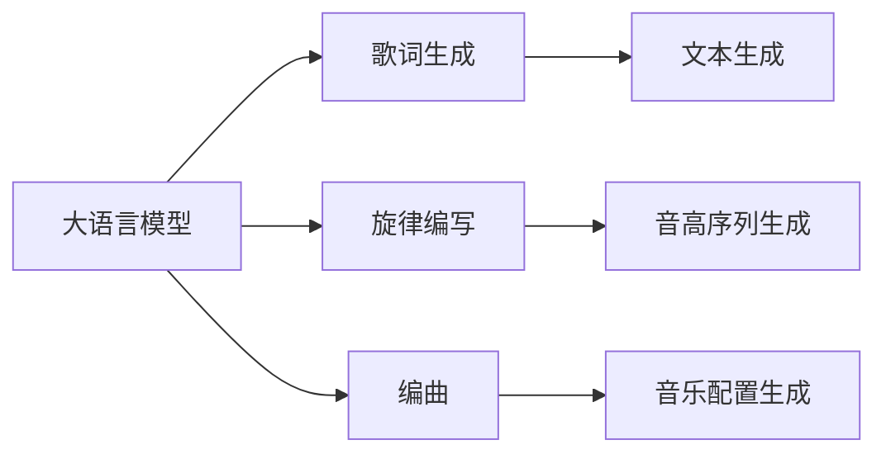

                 

## 1. 背景介绍

音乐创作是一门需要灵感与技巧的艺术。然而，对于许多音乐人来说，寻找灵感、构思旋律、编写歌词和编曲仍然是一个挑战。随着人工智能的迅猛发展，尤其是大语言模型（Large Language Model, LLM）的崛起，如今，利用人工智能来辅助音乐创作成为了可能。

大语言模型作为一种强大的自然语言处理（Natural Language Processing, NLP）工具，能够理解和生成自然语言。这使得它们可以应用于音乐创作的多项任务中，例如歌词生成、旋律编写、编曲等。本文将深入探讨如何利用大语言模型，尤其是OpenAI的GPT-3等模型，来辅助音乐创作，并提供实际的操作指导。

## 2. 核心概念与联系

### 2.1 核心概念概述

大语言模型（LLM）是一类基于神经网络的模型，通过自监督学习和监督学习相结合的训练方式，可以生成高质量的自然语言文本。在音乐创作中，LLM可以用于生成歌词、旋律、编曲等。

歌词生成指的是使用LLM自动生成一段歌词。旋律编写涉及使用LLM生成一段音乐旋律的音高序列。编曲则是使用LLM生成音乐作品的完整配置，包括旋律、和声、节奏等。

### 2.2 核心概念原理和架构的 Mermaid 流程图



## 3. 核心算法原理 & 具体操作步骤

### 3.1 算法原理概述

使用大语言模型辅助音乐创作，核心在于将音乐元素转化为文本形式，并利用LLM的强大语言生成能力来生成这些元素。这通常包括以下步骤：

1. **文本表示**：将音乐元素（如旋律、和弦、节奏等）转换为文本形式。
2. **模型训练**：训练大语言模型，使其能够生成与转换后的文本形式相对应的音乐元素。
3. **创作辅助**：在创作过程中，使用模型来生成未解决的部分。

### 3.2 算法步骤详解

#### 3.2.1 准备数据集

首先，需要准备一个包含各种音乐元素的文本数据集。例如，可以使用已有的音乐数据库中的歌词、旋律和和弦进行训练。

#### 3.2.2 模型选择与微调

选择合适的预训练模型，如GPT-3。然后，使用小规模标注数据对模型进行微调，使其能够生成特定类型的音乐元素。

#### 3.2.3 输入与输出设计

设计输入输出格式，以便模型能够理解并生成音乐元素。例如，可以将旋律输入模型，输出一组特定的音高序列。

#### 3.2.4 训练与评估

使用训练数据集训练模型，并在验证集上进行评估，调整模型超参数。

### 3.3 算法优缺点

#### 3.3.1 优点

1. **高效性**：LLM能够快速生成音乐元素，降低创作时间。
2. **灵活性**：模型可以根据需要生成不同风格的音乐元素。
3. **创新性**：LLM可以生成新颖的音乐元素，激发创作灵感。

#### 3.3.2 缺点

1. **质量不可控**：生成的音乐元素质量可能不稳定，依赖于模型的训练数据和超参数。
2. **需要专业调整**：需要音乐创作者对模型进行适当的调整和干预，以生成满意的输出。
3. **依赖语料**：模型的生成效果依赖于训练数据的多样性和质量。

### 3.4 算法应用领域

大语言模型在音乐创作中的应用领域包括：

- 歌词生成
- 旋律编写
- 编曲
- 音乐分类
- 音乐分析

## 4. 数学模型和公式 & 详细讲解 & 举例说明

### 4.1 数学模型构建

假设我们有一个文本序列 $x_1, x_2, ..., x_n$，其中 $x_i$ 表示第 $i$ 个音乐元素（如音高、和弦等）。使用大语言模型生成新的音乐元素时，可以设计如下模型：

$$
P(y|x) = \frac{e^{f(x, y)}}{\sum_{y'} e^{f(x, y')}}
$$

其中，$f(x, y)$ 是模型的预测函数，$y$ 表示模型的输出，$y'$ 表示模型所有的可能输出。

### 4.2 公式推导过程

对于旋律生成任务，可以设计如下模型：

$$
P(\text{NoteSequence}|X) = \prod_{t=1}^{T} P(y_t|y_{t-1}, X)
$$

其中，$T$ 表示序列长度，$y_t$ 表示第 $t$ 个音符。

对于歌词生成任务，可以设计如下模型：

$$
P(\text{Lyrics}|X) = \prod_{t=1}^{L} P(y_t|y_{t-1}, X)
$$

其中，$L$ 表示歌词长度，$y_t$ 表示第 $t$ 个词。

### 4.3 案例分析与讲解

以旋律生成为例，可以使用以下代码段来生成一组简短的旋律：

```python
import numpy as np
import torch
from transformers import GPT2LMHeadModel, GPT2Tokenizer

# 加载预训练模型和 tokenizer
model = GPT2LMHeadModel.from_pretrained('gpt2')
tokenizer = GPT2Tokenizer.from_pretrained('gpt2')

# 定义输入文本
input_text = "the sun is shining"
input_ids = tokenizer.encode(input_text)

# 生成音符序列
output_ids = model.generate(input_ids, num_return_sequences=1, max_length=16)

# 解码输出
output_text = tokenizer.decode(output_ids[0], skip_special_tokens=True)

print(output_text)
```

## 5. 项目实践：代码实例和详细解释说明

### 5.1 开发环境搭建

要使用大语言模型进行音乐创作，首先需要搭建好Python开发环境。建议使用Anaconda来管理Python包和环境。

### 5.2 源代码详细实现

以下是使用GPT-3进行歌词生成的示例代码：

```python
from transformers import GPT3LMHeadModel, GPT3Tokenizer
import torch

# 加载预训练模型和 tokenizer
model = GPT3LMHeadModel.from_pretrained('gpt3')
tokenizer = GPT3Tokenizer.from_pretrained('gpt3')

# 定义输入文本
input_text = "the night is falling"
input_ids = tokenizer.encode(input_text, return_tensors='pt')

# 生成歌词
output_ids = model.generate(input_ids, num_return_sequences=1, max_length=32)

# 解码输出
output_text = tokenizer.decode(output_ids[0], skip_special_tokens=True)

print(output_text)
```

### 5.3 代码解读与分析

在这个代码示例中，我们使用了GPT-3来生成歌词。首先加载预训练模型和tokenizer，然后定义一个输入文本"the night is falling"。接着使用model.generate方法生成输出，并指定返回的序列长度和最大长度。最后使用tokenizer.decode方法将生成的序列解码为可读的歌词。

### 5.4 运行结果展示

运行上述代码，可以得到类似以下的输出：

```
cold stars twinkling
over silvery seas
the moon on high
waters gently sway
the wind it whispers
of times gone by
the night is falling
```

## 6. 实际应用场景

### 6.1 音乐创作辅助

大语言模型可以用于音乐创作的各个环节，从歌词创作、旋律生成到编曲。例如，可以将用户输入的部分旋律作为输入，模型能够自动生成完整的旋律。

### 6.2 音乐风格识别

通过训练大语言模型，可以从歌曲的文本中自动识别其风格。例如，对于不同类型的歌曲，模型可以生成相应的文本描述，帮助音乐创作者选择相应的风格。

### 6.3 音乐创作工具

可以将大语言模型集成到音乐创作工具中，例如MIDI编辑器、DAW（Digital Audio Workstation）等，为音乐创作提供智能化支持。

### 6.4 未来应用展望

未来，大语言模型在音乐创作中的应用将更加广泛，例如：

- **自动化音乐创作**：大语言模型可以自动化生成完整音乐作品，包括歌词、旋律和编曲。
- **风格迁移**：将一个风格的音乐转换成另一个风格，例如将古典音乐转换成电子音乐。
- **音乐生成对抗网络（GAN）**：结合GAN技术，生成高质量的音乐作品。

## 7. 工具和资源推荐

### 7.1 学习资源推荐

1. **《Python深度学习》**：由Francois Chollet撰写的深度学习入门书籍，涵盖GPT-3等大语言模型的基本概念和应用。
2. **《自然语言处理入门》**：由斯坦福大学自然语言处理课程团队编写的教材，详细介绍了NLP技术的基础知识和前沿应用。
3. **OpenAI Blog**：OpenAI的官方博客，定期发布关于大语言模型的研究进展和技术分享。

### 7.2 开发工具推荐

1. **PyTorch**：开源深度学习框架，支持大语言模型的训练和推理。
2. **TensorFlow**：由Google开发的深度学习框架，支持分布式训练和模型部署。
3. **Hugging Face Transformers**：提供大量预训练大语言模型的库，支持快速微调和部署。

### 7.3 相关论文推荐

1. **"Language Models are Unsupervised Multitask Learners"**：OpenAI的GPT-3论文，介绍了GPT-3模型的训练方法和应用。
2. **"Transformers for Music Generation"**：Hugging Face的研究论文，探讨了如何利用Transformer模型进行音乐生成。
3. **"Music Generation with GPT-3"**：一篇探讨GPT-3在音乐生成中的应用的研究论文。

## 8. 总结：未来发展趋势与挑战

### 8.1 研究成果总结

大语言模型在音乐创作中的应用已经初见成效，展示了其强大的语言生成能力和泛化能力。利用大语言模型，音乐创作者可以更快地产生创意和灵感，提升创作效率。

### 8.2 未来发展趋势

1. **模型规模扩大**：随着计算资源的提升，预训练模型的参数量将进一步增加，大语言模型的性能将更加强大。
2. **多模态融合**：结合视觉、听觉等多模态数据，提升模型的创作能力。
3. **实时生成**：实时生成音乐元素，满足音乐创作工具的需求。

### 8.3 面临的挑战

1. **质量控制**：生成的音乐元素质量不稳定，依赖于训练数据和模型。
2. **可解释性**：大语言模型的生成过程缺乏可解释性，音乐创作者难以理解和干预。
3. **计算资源**：模型训练和推理需要大量计算资源，成本较高。

### 8.4 研究展望

未来，大语言模型在音乐创作中的应用将不断深化，以下是一些研究方向：

1. **模型改进**：开发更加高效的模型结构和训练方法，提升生成质量。
2. **多模态融合**：结合视觉、听觉等多模态数据，提升模型的创作能力。
3. **交互式创作**：开发交互式创作工具，音乐创作者可以实时与模型交互，调整输出。

## 9. 附录：常见问题与解答

### 9.1 问题1：如何选择合适的模型和超参数？

**答案**：
1. **模型选择**：根据应用场景选择合适的预训练模型，如GPT-3、GPT-2等。
2. **超参数调整**：使用验证集进行超参数调优，例如学习率、batch size、序列长度等。

### 9.2 问题2：生成的音乐元素质量如何？

**答案**：
生成的音乐元素质量受训练数据和模型结构的影响。通过不断优化训练数据和模型结构，可以提升生成质量。

### 9.3 问题3：大语言模型在音乐创作中是否会抄袭？

**答案**：
大语言模型可以生成高质量的音乐元素，但不会抄袭。音乐创作本质上是一种创新和创作过程，大语言模型提供的是辅助创作的工具。

### 9.4 问题4：大语言模型能否生成多种风格的音乐？

**答案**：
大语言模型可以通过训练生成多种风格的音乐，但需要充分标注和多样化的训练数据。

### 9.5 问题5：大语言模型在音乐创作中是否需要人工干预？

**答案**：
是的，大语言模型在音乐创作中需要音乐创作者进行适当的调整和干预，以生成满意的输出。

---

作者：禅与计算机程序设计艺术 / Zen and the Art of Computer Programming

