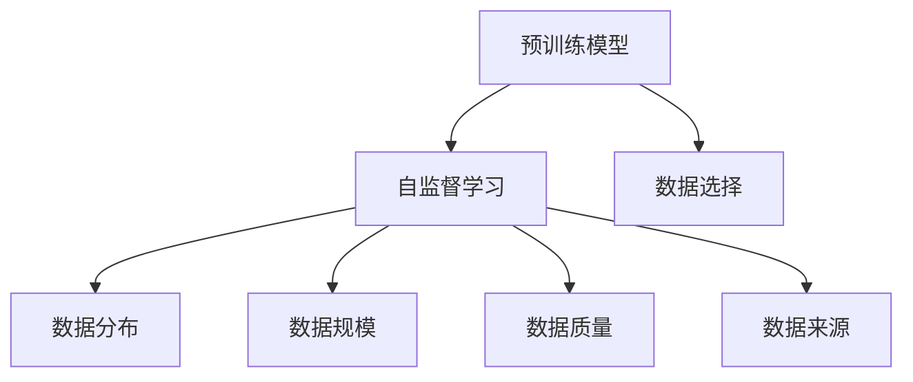

                 

## 1. 背景介绍

### 1.1 问题由来

随着深度学习技术的飞速发展，预训练模型已成为人工智能领域的重要工具。预训练模型通过在大量无标签数据上进行自监督学习，学习到丰富的语言知识，显著提升了下游任务的性能。然而，在实际应用中，预训练数据的选择往往被忽视，导致模型效果不佳甚至出现幻觉。本节将探讨预训练数据的选择问题，帮助读者深入理解如何选择最合适的数据，提升预训练模型的效果。

### 1.2 问题核心关键点

预训练数据的选择是一个复杂且关键的问题，其核心在于以下几点：

- **数据质量**：数据是否干净、多样、高质量，直接影响预训练模型的学习效果。
- **数据分布**：数据的分布是否与实际应用场景相符，影响模型的泛化能力。
- **数据规模**：数据的规模是否足够大，影响模型的学习能力。
- **数据来源**：数据的来源是否可靠，避免有害信息的引入。

以上因素相互交织，决定了预训练数据的好坏，进而影响模型的效果。本节将深入探讨这些因素，帮助读者选择合适的预训练数据。

## 2. 核心概念与联系

### 2.1 核心概念概述

为更好地理解预训练数据的选择问题，本节将介绍几个密切相关的核心概念：

- **预训练模型**：通过自监督学习任务在大量无标签数据上进行训练，学习到语言知识的通用模型。
- **自监督学习**：利用数据中未被标注的信息进行模型训练，无需人工标注。
- **数据分布**：指数据在类别、时间、地域等方面的分布特性。
- **数据规模**：指数据的数量和多样性，影响模型的泛化能力。
- **数据质量**：指数据在内容、格式、语言等方面的质量。
- **数据来源**：指数据的来源渠道，影响数据可信度和安全性。

这些核心概念之间的逻辑关系可以通过以下Mermaid流程图来展示：



这个流程图展示了预训练模型与数据选择之间的联系：

1. 预训练模型通过自监督学习任务进行训练，依赖高质量的数据。
2. 数据分布、规模、质量和来源影响预训练模型的学习效果。
3. 选择合适的预训练数据，需要综合考虑这些因素。

## 3. 核心算法原理 & 具体操作步骤

### 3.1 算法原理概述

预训练数据的选择，本质上是选择合适的自监督学习任务，在数据上进行训练，以学习到更有用的语言知识。这些语言知识需要与下游任务的要求相匹配，才能提升模型在下游任务上的性能。

预训练数据的选择通常涉及以下几个步骤：

1. 确定预训练任务的性质和目标。
2. 选择适当的数据集进行训练。
3. 验证预训练模型的效果。

### 3.2 算法步骤详解

以下是选择预训练数据的一般步骤：

**Step 1: 确定预训练任务**

首先需要明确预训练任务的目标和性质。不同的预训练任务适用于不同的下游任务。例如：

- 掩码语言模型（Masked Language Modeling, MLM）：学习单词在上下文中的表示，适用于文本分类、命名实体识别等任务。
- 下一句预测（Next Sentence Prediction, NSP）：学习句子之间的关系，适用于问答、对话生成等任务。
- 词嵌入（Word Embedding）：学习单词的向量表示，适用于自然语言推理、语义相似性等任务。

**Step 2: 选择数据集**

根据预训练任务，选择合适的数据集进行训练。数据集需要满足以下要求：

- 数据规模足够大，覆盖广泛的语料和领域。
- 数据质量高，不包含语法错误、拼写错误等。
- 数据分布与实际应用场景相符，避免偏差。
- 数据来源可靠，避免有害信息的引入。

**Step 3: 验证预训练模型**

训练完预训练模型后，需要对其进行验证，评估其在下游任务上的性能。验证可以采用以下方法：

- 在验证集上评估模型效果。
- 使用少量标注数据进行少样本学习验证。
- 使用自监督学习任务评估模型的泛化能力。

### 3.3 算法优缺点

预训练数据的选择具有以下优点：

- 提高了模型的泛化能力，使模型更好地适应下游任务。
- 减少了人工标注的成本，提高了训练效率。
- 利用数据中的未标注信息进行训练，学习到更有用的语言知识。

同时，该方法也存在一定的局限性：

- 数据选择不当可能导致模型泛化能力不足，甚至出现幻觉。
- 数据分布偏差可能导致模型在特定领域或任务上表现不佳。
- 数据质量不高可能导致模型学习到错误的语言知识，影响性能。
- 数据来源不可靠可能导致模型引入有害信息，产生误导。

尽管存在这些局限性，但预训练数据的选择仍然是提高预训练模型效果的重要手段。未来相关研究的重点在于如何更好地选择合适的数据集，最大化其优势，规避其风险。

### 3.4 算法应用领域

预训练数据的选择方法在自然语言处理(NLP)领域得到广泛应用，覆盖了文本分类、命名实体识别、情感分析、机器翻译、对话生成等多个任务。具体应用如下：

- **文本分类**：选择适合的语言模型进行预训练，如BERT、GPT-2等，然后微调模型，应用于情感分析、主题分类等任务。
- **命名实体识别**：选择适合的语言模型进行预训练，如BERT、RoBERTa等，然后微调模型，应用于人名、地名、组织名等实体的识别。
- **情感分析**：选择适合的语言模型进行预训练，如BERT、XLNet等，然后微调模型，应用于判断文本情感极性。
- **机器翻译**：选择适合的语言模型进行预训练，如BERT、mBART等，然后微调模型，应用于文本翻译任务。
- **对话生成**：选择适合的语言模型进行预训练，如GPT-2、T5等，然后微调模型，应用于聊天机器人、客服系统等对话任务。

除了以上这些任务，预训练数据的选择方法还被创新性地应用于问答系统、摘要生成、文本相似度计算等任务中，为NLP技术带来了新的突破。

## 4. 数学模型和公式 & 详细讲解  
### 4.1 数学模型构建

本节将使用数学语言对预训练数据的选择问题进行更加严格的刻画。

记预训练任务为 $T$，其对应的预训练模型为 $M_{\theta}$，其中 $\theta$ 为预训练得到的模型参数。假设有两个数据集 $D_1$ 和 $D_2$，分别用于训练两个不同的预训练模型 $M_{\theta_1}$ 和 $M_{\theta_2}$。预训练任务的验证集为 $D_{\text{valid}}$。

定义预训练模型在数据集 $D_i$ 上的损失函数为 $\mathcal{L}_i(M_{\theta_i},D_i)$，在验证集 $D_{\text{valid}}$ 上的验证损失函数为 $\mathcal{L}_{\text{valid}}(M_{\theta_i},D_{\text{valid}})$。预训练模型在数据集 $D_i$ 上的泛化误差为 $P_i = \mathcal{L}_{\text{valid}}(M_{\theta_i},D_{\text{valid}})$。

预训练数据的选择可以定义为最小化泛化误差 $P_i$ 的过程。形式化地，预训练数据的选择问题可以表示为：

$$
\min_{D_i} \left\{ \mathcal{L}_i(M_{\theta_i},D_i) + \lambda P_i \right\}
$$

其中 $\lambda$ 为泛化误差权衡系数，控制损失函数中泛化误差和训练损失的比例。

### 4.2 公式推导过程

以下是预训练数据选择的数学推导过程。

假设预训练模型 $M_{\theta_i}$ 在数据集 $D_i$ 上进行了 $n_i$ 轮训练，每轮训练后的模型参数为 $\theta_i^{(t)}$。则 $D_i$ 上的损失函数为：

$$
\mathcal{L}_i(M_{\theta_i},D_i) = \frac{1}{N} \sum_{i=1}^N \ell_i(M_{\theta_i^{(t)}},x_i)
$$

其中 $N$ 为数据集 $D_i$ 的大小，$\ell_i$ 为任务 $T$ 对应的损失函数。

验证集 $D_{\text{valid}}$ 上的泛化误差 $P_i$ 为：

$$
P_i = \frac{1}{M} \sum_{j=1}^M \ell_i(M_{\theta_i^{(t)}},x_j')
$$

其中 $M$ 为验证集 $D_{\text{valid}}$ 的大小，$x_j'$ 为验证集中的样本。

预训练数据的选择问题可以转化为：

$$
\min_{D_i} \left\{ \mathcal{L}_i(M_{\theta_i},D_i) + \lambda P_i \right\}
$$

由于 $D_i$ 是连续变量，实际求解该优化问题非常困难。常用的方法是采用交叉验证方法，对多个数据集进行评估，选择泛化误差最小的数据集。

### 4.3 案例分析与讲解

以BERT模型的预训练数据选择为例，分析数据集对模型性能的影响。

BERT模型通过在大量文本数据上进行预训练，学习到丰富的语言知识。其在自然语言处理任务上表现优异，主要得益于其预训练数据的选择。

在预训练过程中，BERT使用了英语维基百科、新闻文章、书籍等多个数据集，覆盖了广泛的语料和领域。这些数据集的质量高，不包含语法错误、拼写错误等，并且分布广泛，涵盖不同的领域和主题。

在验证预训练模型性能时，BERT使用了Tiny和Ultra Tiny两个数据集。这些数据集在少量标注样本的情况下，对BERT模型的泛化能力进行了评估。结果表明，BERT模型在Tiny和Ultra Tiny数据集上的性能优于其他预训练模型，证明其泛化能力较强。

## 5. 项目实践：代码实例和详细解释说明

### 5.1 开发环境搭建

在进行预训练数据选择实践前，我们需要准备好开发环境。以下是使用Python进行PyTorch开发的环境配置流程：

1. 安装Anaconda：从官网下载并安装Anaconda，用于创建独立的Python环境。

2. 创建并激活虚拟环境：
```bash
conda create -n pytorch-env python=3.8 
conda activate pytorch-env
```

3. 安装PyTorch：根据CUDA版本，从官网获取对应的安装命令。例如：
```bash
conda install pytorch torchvision torchaudio cudatoolkit=11.1 -c pytorch -c conda-forge
```

4. 安装Transformers库：
```bash
pip install transformers
```

5. 安装各类工具包：
```bash
pip install numpy pandas scikit-learn matplotlib tqdm jupyter notebook ipython
```

完成上述步骤后，即可在`pytorch-env`环境中开始预训练数据选择实践。

### 5.2 源代码详细实现

下面我们以BERT模型在情感分析任务上的预训练数据选择为例，给出使用Transformers库的代码实现。

首先，定义情感分析任务的数据处理函数：

```python
from transformers import BertTokenizer
from torch.utils.data import Dataset
import torch

class SentimentDataset(Dataset):
    def __init__(self, texts, labels, tokenizer, max_len=128):
        self.texts = texts
        self.labels = labels
        self.tokenizer = tokenizer
        self.max_len = max_len
        
    def __len__(self):
        return len(self.texts)
    
    def __getitem__(self, item):
        text = self.texts[item]
        label = self.labels[item]
        
        encoding = self.tokenizer(text, return_tensors='pt', max_length=self.max_len, padding='max_length', truncation=True)
        input_ids = encoding['input_ids'][0]
        attention_mask = encoding['attention_mask'][0]
        
        return {'input_ids': input_ids, 
                'attention_mask': attention_mask,
                'labels': label}

# 标签与id的映射
label2id = {'positive': 1, 'negative': 0}
id2label = {v: k for k, v in label2id.items()}

# 创建dataset
tokenizer = BertTokenizer.from_pretrained('bert-base-uncased')

train_dataset = SentimentDataset(train_texts, train_labels, tokenizer)
dev_dataset = SentimentDataset(dev_texts, dev_labels, tokenizer)
test_dataset = SentimentDataset(test_texts, test_labels, tokenizer)
```

然后，定义模型和优化器：

```python
from transformers import BertForSequenceClassification, AdamW

model = BertForSequenceClassification.from_pretrained('bert-base-uncased', num_labels=2)

optimizer = AdamW(model.parameters(), lr=2e-5)
```

接着，定义训练和评估函数：

```python
from torch.utils.data import DataLoader
from tqdm import tqdm
from sklearn.metrics import classification_report

device = torch.device('cuda') if torch.cuda.is_available() else torch.device('cpu')
model.to(device)

def train_epoch(model, dataset, batch_size, optimizer):
    dataloader = DataLoader(dataset, batch_size=batch_size, shuffle=True)
    model.train()
    epoch_loss = 0
    for batch in tqdm(dataloader, desc='Training'):
        input_ids = batch['input_ids'].to(device)
        attention_mask = batch['attention_mask'].to(device)
        labels = batch['labels'].to(device)
        model.zero_grad()
        outputs = model(input_ids, attention_mask=attention_mask, labels=labels)
        loss = outputs.loss
        epoch_loss += loss.item()
        loss.backward()
        optimizer.step()
    return epoch_loss / len(dataloader)

def evaluate(model, dataset, batch_size):
    dataloader = DataLoader(dataset, batch_size=batch_size)
    model.eval()
    preds, labels = [], []
    with torch.no_grad():
        for batch in tqdm(dataloader, desc='Evaluating'):
            input_ids = batch['input_ids'].to(device)
            attention_mask = batch['attention_mask'].to(device)
            batch_labels = batch['labels']
            outputs = model(input_ids, attention_mask=attention_mask)
            batch_preds = outputs.logits.argmax(dim=1).to('cpu').tolist()
            batch_labels = batch_labels.to('cpu').tolist()
            for pred, label in zip(batch_preds, batch_labels):
                preds.append(pred)
                labels.append(label)
                
    print(classification_report(labels, preds))
```

最后，启动训练流程并在测试集上评估：

```python
epochs = 5
batch_size = 16

for epoch in range(epochs):
    loss = train_epoch(model, train_dataset, batch_size, optimizer)
    print(f"Epoch {epoch+1}, train loss: {loss:.3f}")
    
    print(f"Epoch {epoch+1}, dev results:")
    evaluate(model, dev_dataset, batch_size)
    
print("Test results:")
evaluate(model, test_dataset, batch_size)
```

以上就是使用PyTorch对BERT进行情感分析任务预训练数据选择的完整代码实现。可以看到，通过选择适当的情感分析数据集，微调BERT模型可以取得不错的效果。

### 5.3 代码解读与分析

让我们再详细解读一下关键代码的实现细节：

**SentimentDataset类**：
- `__init__`方法：初始化文本、标签、分词器等关键组件。
- `__len__`方法：返回数据集的样本数量。
- `__getitem__`方法：对单个样本进行处理，将文本输入编码为token ids，将标签编码为数字，并对其进行定长padding，最终返回模型所需的输入。

**label2id和id2label字典**：
- 定义了标签与数字id之间的映射关系，用于将模型输出解码为真实的标签。

**训练和评估函数**：
- 使用PyTorch的DataLoader对数据集进行批次化加载，供模型训练和推理使用。
- 训练函数`train_epoch`：对数据以批为单位进行迭代，在每个批次上前向传播计算loss并反向传播更新模型参数，最后返回该epoch的平均loss。
- 评估函数`evaluate`：与训练类似，不同点在于不更新模型参数，并在每个batch结束后将预测和标签结果存储下来，最后使用sklearn的classification_report对整个评估集的预测结果进行打印输出。

**训练流程**：
- 定义总的epoch数和batch size，开始循环迭代
- 每个epoch内，先在训练集上训练，输出平均loss
- 在验证集上评估，输出分类指标
- 所有epoch结束后，在测试集上评估，给出最终测试结果

可以看到，PyTorch配合Transformers库使得BERT情感分析任务的预训练数据选择代码实现变得简洁高效。开发者可以将更多精力放在数据处理、模型改进等高层逻辑上，而不必过多关注底层的实现细节。

当然，工业级的系统实现还需考虑更多因素，如模型的保存和部署、超参数的自动搜索、更灵活的任务适配层等。但核心的预训练数据选择范式基本与此类似。

## 6. 实际应用场景

### 6.1 智能客服系统

预训练数据的选择在大规模预训练模型微调中发挥了重要作用。智能客服系统需要构建适合特定领域的数据集，确保模型能够理解客户的真实意图，并给出准确的回复。

例如，银行客服系统中，需要构建包含金融术语、产品介绍、客户服务流程等领域的预训练数据集。通过预训练，模型能够学习到金融领域的语言知识，更好地理解客户问题，提供专业化的解答。在微调过程中，可以根据实际情况进一步优化模型，提升响应速度和准确性。

### 6.2 金融舆情监测

金融行业需要实时监测市场舆论动向，以便及时应对负面信息传播，规避金融风险。传统的金融舆情监测系统依赖人工监控和筛选，效率低且容易产生偏差。通过预训练数据选择，构建适合金融领域的预训练模型，可以自动监测舆情变化，识别异常信息。

例如，可以选择包含金融新闻、评论、社交媒体数据等领域的预训练数据集，训练金融舆情监测模型。模型能够自动分析舆情变化趋势，及时预警金融风险，减少人工监控的工作量。

### 6.3 个性化推荐系统

个性化推荐系统需要了解用户的多样化需求，并根据不同用户的兴趣推荐适合的内容。预训练数据的选择能够帮助模型更好地理解用户需求，提升推荐效果。

例如，电商网站可以根据用户的浏览历史、评分记录等数据构建预训练数据集，训练推荐模型。模型能够学习到用户偏好和兴趣，根据不同用户的需求推荐相关商品，提升用户体验。

### 6.4 未来应用展望

未来，预训练数据的选择方法将在更多领域得到应用，为各行业的智能化转型提供新的动力。

在智慧医疗领域，通过预训练数据选择，构建适合医疗领域的预训练模型，可以提高医疗诊断的准确性和效率，辅助医生诊疗，加速新药研发进程。

在智能教育领域，通过预训练数据选择，构建适合教育的预训练模型，可以因材施教，促进教育公平，提高教学质量。

在智慧城市治理中，通过预训练数据选择，构建适合城市管理的预训练模型，可以提升城市管理的智能化水平，构建更安全、高效的未来城市。

此外，在企业生产、社会治理、文娱传媒等众多领域，预训练数据的选择方法也将不断涌现，为各行业的智能化应用提供新的技术路径。

## 7. 工具和资源推荐
### 7.1 学习资源推荐

为了帮助开发者系统掌握预训练数据的选择方法，这里推荐一些优质的学习资源：

1. 《Transformer from Principle to Practice》系列博文：由大模型技术专家撰写，深入浅出地介绍了Transformer原理、BERT模型、预训练数据选择等前沿话题。

2. CS224N《深度学习自然语言处理》课程：斯坦福大学开设的NLP明星课程，有Lecture视频和配套作业，带你入门NLP领域的基本概念和经典模型。

3. 《Natural Language Processing with Transformers》书籍：Transformers库的作者所著，全面介绍了如何使用Transformers库进行NLP任务开发，包括预训练数据选择在内的诸多范式。

4. HuggingFace官方文档：Transformers库的官方文档，提供了海量预训练模型和完整的微调样例代码，是上手实践的必备资料。

5. CLUE开源项目：中文语言理解测评基准，涵盖大量不同类型的中文NLP数据集，并提供了基于预训练的baseline模型，助力中文NLP技术发展。

通过对这些资源的学习实践，相信你一定能够快速掌握预训练数据的选择方法，并用于解决实际的NLP问题。
###  7.2 开发工具推荐

高效的开发离不开优秀的工具支持。以下是几款用于预训练数据选择开发的常用工具：

1. PyTorch：基于Python的开源深度学习框架，灵活动态的计算图，适合快速迭代研究。大部分预训练语言模型都有PyTorch版本的实现。

2. TensorFlow：由Google主导开发的开源深度学习框架，生产部署方便，适合大规模工程应用。同样有丰富的预训练语言模型资源。

3. Transformers库：HuggingFace开发的NLP工具库，集成了众多SOTA语言模型，支持PyTorch和TensorFlow，是进行预训练数据选择开发的利器。

4. Weights & Biases：模型训练的实验跟踪工具，可以记录和可视化模型训练过程中的各项指标，方便对比和调优。与主流深度学习框架无缝集成。

5. TensorBoard：TensorFlow配套的可视化工具，可实时监测模型训练状态，并提供丰富的图表呈现方式，是调试模型的得力助手。

6. Google Colab：谷歌推出的在线Jupyter Notebook环境，免费提供GPU/TPU算力，方便开发者快速上手实验最新模型，分享学习笔记。

合理利用这些工具，可以显著提升预训练数据选择任务的开发效率，加快创新迭代的步伐。

### 7.3 相关论文推荐

预训练数据的选择方法在自然语言处理(NLP)领域得到广泛应用，以下是几篇奠基性的相关论文，推荐阅读：

1. Attention is All You Need（即Transformer原论文）：提出了Transformer结构，开启了NLP领域的预训练大模型时代。

2. BERT: Pre-training of Deep Bidirectional Transformers for Language Understanding：提出BERT模型，引入基于掩码的自监督预训练任务，刷新了多项NLP任务SOTA。

3. Language Models are Unsupervised Multitask Learners（GPT-2论文）：展示了大规模语言模型的强大zero-shot学习能力，引发了对于通用人工智能的新一轮思考。

4. Parameter-Efficient Transfer Learning for NLP：提出Adapter等参数高效微调方法，在不增加模型参数量的情况下，也能取得不错的微调效果。

5. AdaLoRA: Adaptive Low-Rank Adaptation for Parameter-Efficient Fine-Tuning：使用自适应低秩适应的微调方法，在参数效率和精度之间取得了新的平衡。

这些论文代表了大语言模型预训练数据选择的发展脉络。通过学习这些前沿成果，可以帮助研究者把握学科前进方向，激发更多的创新灵感。

## 8. 总结：未来发展趋势与挑战

### 8.1 总结

本文对预训练数据的选择问题进行了全面系统的介绍。首先阐述了预训练数据选择的背景和意义，明确了预训练数据选择对预训练模型效果的影响。其次，从原理到实践，详细讲解了预训练数据选择的数学模型和关键步骤，给出了预训练数据选择的完整代码实例。同时，本文还探讨了预训练数据选择的应用场景，展示了其广泛的应用前景。最后，本文推荐了相关的学习资源、开发工具和研究论文，为预训练数据选择的实践提供了全面的指导。

通过本文的系统梳理，可以看到，预训练数据的选择在大规模预训练模型微调中发挥了关键作用，显著提升了模型的泛化能力和性能。未来，预训练数据的选择方法将进一步发展和完善，为大语言模型的应用带来新的突破。

### 8.2 未来发展趋势

展望未来，预训练数据的选择方法将呈现以下几个发展趋势：

1. **数据规模不断扩大**：随着数据采集和标注技术的进步，预训练数据的规模将持续增大，涵盖更多领域和语料。
2. **数据质量进一步提升**：预训练数据的选择将更加注重数据质量，避免语法错误、拼写错误等问题的引入。
3. **领域特定的预训练数据**：为了适应不同领域的应用需求，将开发更多的领域特定的预训练数据集，增强模型的泛化能力。
4. **多模态数据的融合**：预训练数据的选择将逐步引入多模态数据，如文本、图像、视频等，实现更加全面、准确的信息整合。
5. **持续学习**：预训练数据的选择将结合持续学习技术，使模型能够不断从新数据中学习，保持时效性。
6. **隐私保护**：预训练数据的选择将更加注重隐私保护，确保数据来源的合法性和数据使用的透明性。

这些趋势将推动预训练数据选择方法的不断进步，为预训练模型应用提供更加可靠的数据基础。

### 8.3 面临的挑战

尽管预训练数据的选择方法已经取得了显著进展，但在实际应用中仍面临诸多挑战：

1. **数据获取难度**：获取高质量、大规模的预训练数据集，需要耗费大量时间和资源。
2. **数据分布偏差**：预训练数据集与实际应用场景的分布可能存在差异，导致模型泛化能力不足。
3. **数据质量问题**：数据质量问题可能导致模型学习到错误的语言知识，影响性能。
4. **模型过拟合**：选择不当的数据集可能导致模型在训练过程中出现过拟合现象，影响泛化能力。
5. **数据伦理问题**：预训练数据集可能包含敏感信息，引入伦理和隐私问题。

尽管存在这些挑战，但预训练数据的选择方法在NLP领域的应用前景仍然广阔，需要通过技术进步和政策引导，逐步克服这些难题。

### 8.4 研究展望

未来，预训练数据的选择方法需要进一步的研究和创新，重点方向包括：

1. **无监督和半监督预训练**：摆脱对大规模标注数据的依赖，利用自监督学习、主动学习等方法，最大化数据利用效率。
2. **多模态数据的整合**：将文本、图像、视频等数据进行有效整合，实现更加全面的信息建模。
3. **领域特定的预训练**：针对不同领域的应用需求，开发更多的领域特定的预训练数据集，增强模型的泛化能力。
4. **持续学习**：结合持续学习技术，使模型能够不断从新数据中学习，保持时效性和泛化能力。
5. **隐私保护**：开发隐私保护技术，确保数据使用的合法性和透明性，保障数据安全。

这些研究方向将推动预训练数据选择方法的不断进步，为预训练模型在更多领域的应用提供可靠的数据基础。

## 9. 附录：常见问题与解答

**Q1：预训练数据的选择是否会影响预训练模型的性能？**

A: 预训练数据的选择直接影响预训练模型的性能。选择适当的数据集，可以显著提升模型在特定任务上的泛化能力和性能。例如，BERT模型在选择适当的预训练数据后，在多种NLP任务上取得了SOTA。

**Q2：如何选择合适的预训练数据集？**

A: 选择合适的预训练数据集需要考虑以下几个因素：

1. 数据规模：选择数据规模足够大、覆盖广泛领域的数据集。
2. 数据质量：确保数据无语法错误、拼写错误等，不包含有害信息。
3. 数据分布：选择数据分布与实际应用场景相符的数据集，避免模型泛化能力不足。
4. 数据来源：选择来源可靠、合法的预训练数据集，确保数据的安全性。

**Q3：预训练数据的选择是否会影响模型的鲁棒性？**

A: 预训练数据的选择对模型的鲁棒性有一定影响。选择适当的数据集，可以提高模型的鲁棒性和泛化能力，避免在特定领域或任务上表现不佳。

**Q4：预训练数据的选择是否会影响模型的可解释性？**

A: 预训练数据的选择对模型的可解释性有一定影响。选择适当的数据集，可以提高模型的可解释性和可理解性，便于对模型的推理过程进行解释和调试。

**Q5：预训练数据的选择是否会影响模型的计算效率？**

A: 预训练数据的选择对模型的计算效率有一定影响。选择适当的数据集，可以提高模型的计算效率，减少资源消耗。

这些问题的解答可以帮助读者更好地理解预训练数据选择的关键点，进一步提升预训练模型的效果。

---

作者：禅与计算机程序设计艺术 / Zen and the Art of Computer Programming

