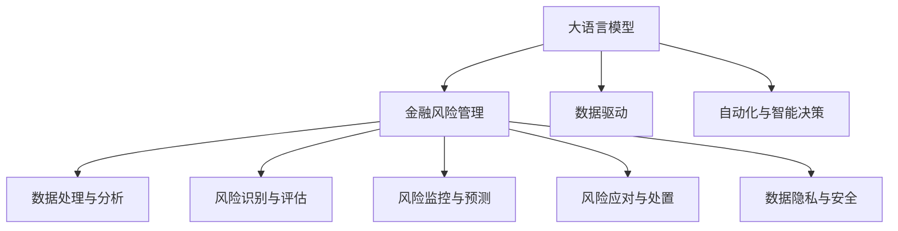

                 

# 风险管理专家：LLM 在金融领域的应用

## 1. 背景介绍

### 1.1 问题由来

随着金融市场的复杂性不断增加，金融机构对于风险管理的依赖性也越来越高。传统的金融风险管理方法主要依赖于历史数据分析和专家经验，但面对海量的金融数据和不断变化的市场环境，这些方法难以保证全面性和准确性。人工智能技术的引入为金融风险管理带来了新的可能性。

大语言模型（Large Language Model, LLM）作为目前人工智能领域最为先进的技术之一，其通过大规模无标签文本数据的预训练，学习到了丰富的语言知识，具备强大的文本处理和理解能力。在金融领域，通过将大语言模型应用于风险管理，可以更快速、准确地处理和分析海量金融数据，发现潜在的风险信号，从而提升风险管理的效率和准确性。

### 1.2 问题核心关键点

LLM在金融领域的应用主要涉及以下几个核心关键点：

- 数据处理与分析：通过LLM处理和分析金融数据，提取其中的风险信号。
- 风险识别与评估：利用LLM识别潜在风险事件，评估其对金融系统的影响。
- 风险监控与预测：基于LLM建立风险监控系统，实现实时风险预测和预警。
- 风险应对与处置：结合LLM的智能决策能力，设计灵活的风险应对策略。
- 数据隐私与安全：保障金融数据的隐私和安全，防止数据泄露和滥用。

## 2. 核心概念与联系

### 2.1 核心概念概述

为了更好地理解LLM在金融领域的应用，本文将介绍几个关键概念及其联系：

- 大语言模型：以Transformer架构为代表的预训练语言模型，通过大规模无标签文本数据的预训练，学习到通用的语言表示和语言理解能力。
- 金融风险管理：通过定性和定量的分析方法，识别、评估和控制金融系统中的潜在风险。
- 数据驱动：基于金融市场的大量数据，通过机器学习和人工智能技术，挖掘潜在的风险因素和趋势。
- 自动化与智能决策：借助LLM的强大文本处理能力，实现金融风险管理的自动化和智能化，提升决策效率和准确性。

这些概念之间的逻辑关系可以通过以下Mermaid流程图来展示：



这个流程图展示了大语言模型在金融风险管理中的核心作用和关键环节：

1. 大语言模型通过数据驱动的方式，处理和分析金融数据。
2. 在金融风险识别与评估环节，利用LLM提取和分析金融数据中的风险信号。
3. 结合风险监控与预测，通过LLM建立智能预警系统，实现实时风险预测。
4. 在风险应对与处置环节，利用LLM的智能决策能力，设计灵活的风险应对策略。
5. 最后，数据隐私与安全是金融风险管理中必须重视的环节，通过技术手段保障数据安全。

## 3. 核心算法原理 & 具体操作步骤

### 3.1 算法原理概述

基于LLM的金融风险管理，其核心原理是将金融数据转化为文本数据，通过预训练语言模型进行分析和处理。具体步骤如下：

1. **数据预处理**：将金融数据转化为文本格式，包括但不限于新闻、公告、财务报表、交易记录等。
2. **预训练模型初始化**：使用预训练的LLM模型，如GPT、BERT等，作为初始化参数。
3. **微调与优化**：在金融数据上微调预训练模型，使其能够准确识别和分析金融风险。
4. **风险评估**：通过微调后的模型，评估金融数据中的风险信号，识别潜在风险事件。
5. **风险预警**：基于风险评估结果，实时监控金融市场，预警潜在风险事件。
6. **风险应对**：结合LLM的智能决策能力，设计灵活的风险应对策略，采取有效措施降低风险。

### 3.2 算法步骤详解

1. **数据预处理**：
   - 将金融数据（如新闻、公告、财务报表、交易记录等）转化为文本格式。
   - 进行分词、去除停用词等文本清洗工作。
   - 对文本进行标准化处理，如统一编码、统一日期格式等。

2. **预训练模型初始化**：
   - 使用预训练的LLM模型，如GPT-3、BERT等，作为初始化参数。
   - 根据需要，对模型进行必要的结构调整，如删除不必要的层、增加特定的任务层等。

3. **微调与优化**：
   - 在金融数据上微调预训练模型，可以采用监督学习的方式，使用标注好的金融数据集进行训练。
   - 设置适当的学习率、批大小、迭代轮数等超参数，选择适合的优化算法，如Adam、SGD等。
   - 在训练过程中，使用交叉验证等方法进行模型评估和调参。

4. **风险评估**：
   - 使用微调后的模型，对新的金融数据进行风险评估。
   - 评估模型在识别潜在风险事件、评估风险影响等方面的性能。
   - 根据评估结果，制定相应的风险管理策略。

5. **风险预警**：
   - 建立实时监控系统，利用微调后的模型对金融数据进行实时分析。
   - 通过设定阈值、触发机制等，实现对潜在风险事件的及时预警。
   - 结合人工智能技术，建立智能预警系统，提高风险预测的准确性和及时性。

6. **风险应对**：
   - 根据风险预警结果，设计灵活的风险应对策略。
   - 使用LLM的智能决策能力，评估不同应对措施的效果。
   - 结合量化模型、专家经验等多种手段，综合制定风险应对方案。

### 3.3 算法优缺点

基于LLM的金融风险管理算法具有以下优点：

- **高效性**：LLM能够快速处理和分析大量金融数据，识别潜在风险事件，提升风险管理的效率。
- **准确性**：通过微调模型，可以提高风险评估的准确性，识别潜在风险的准确率更高。
- **灵活性**：结合LLM的智能决策能力，可以设计灵活的风险应对策略，满足不同的风险管理需求。

同时，该算法也存在一些缺点：

- **依赖数据质量**：金融数据的准确性和完备性直接影响风险评估的准确性，数据的噪声和缺失可能影响模型的性能。
- **模型复杂性**：预训练和微调过程较为复杂，需要较高的计算资源和时间成本。
- **解释性不足**：LLM的决策过程较为复杂，模型的输出结果较难解释，增加了风险管理的复杂性。

### 3.4 算法应用领域

基于LLM的金融风险管理算法已经在金融领域得到了广泛应用，主要包括以下几个方面：

- **信用风险管理**：通过分析借款人的财务数据、历史交易记录等，预测借款人的信用风险。
- **市场风险管理**：利用市场数据，预测股票、期货等金融产品的价格波动，评估市场风险。
- **操作风险管理**：通过对交易数据、操作记录等的分析，识别潜在的业务操作风险。
- **合规风险管理**：通过分析金融交易记录、合规文档等，评估合规风险，制定合规策略。
- **反洗钱风险管理**：通过对交易数据、客户信息等的分析，识别和防范洗钱等非法行为。

## 4. 数学模型和公式 & 详细讲解

### 4.1 数学模型构建

在金融风险管理中，可以使用LLM对金融数据进行风险评估。假设金融数据集为 $D=\{(x_i, y_i)\}_{i=1}^N$，其中 $x_i$ 为输入的金融数据， $y_i$ 为相应的风险评估结果（如0表示低风险，1表示高风险）。风险评估模型 $f(x_i; \theta)$ 的参数为 $\theta$，则风险评估的损失函数为：

$$
\mathcal{L}(\theta) = -\frac{1}{N}\sum_{i=1}^N \log f(x_i; \theta) \cdot y_i
$$

在实际应用中，可以采用交叉熵损失函数来计算模型输出与真实标签之间的差异。

### 4.2 公式推导过程

以信用风险评估为例，可以使用以下步骤进行公式推导：

1. **数据预处理**：将金融数据转化为文本格式，并进行分词、去除停用词等处理。
2. **模型训练**：在标注好的金融数据集上，使用监督学习的方式训练微调后的LLM模型。
3. **风险评估**：输入新的金融数据 $x$，通过微调后的模型 $f(x; \theta)$ 进行风险评估，得到风险概率 $p$。
4. **风险预测**：设定阈值 $\epsilon$，当 $p > \epsilon$ 时，认为存在高风险。

数学推导如下：

$$
p = f(x; \theta) = \frac{e^{W_1\cdot x_1 + W_2\cdot x_2 + ... + W_n\cdot x_n}}{\sum_{j=1}^n e^{W_j\cdot x_j}}
$$

其中 $W_i$ 为模型参数， $x_i$ 为输入特征。

### 4.3 案例分析与讲解

假设有一家银行需要进行信用风险管理。通过分析客户的历史交易数据、信用评分等，可以得到一份标注好的金融数据集。使用微调后的LLM模型，可以对新的客户进行风险评估。具体步骤如下：

1. **数据预处理**：将客户的财务数据、历史交易记录等转化为文本格式，并进行分词、去除停用词等处理。
2. **模型训练**：在标注好的金融数据集上，使用监督学习的方式训练微调后的LLM模型。
3. **风险评估**：输入客户的最新财务数据，通过微调后的模型进行风险评估，得到风险概率 $p$。
4. **风险预测**：设定阈值 $\epsilon$，当 $p > \epsilon$ 时，认为该客户存在高风险。

## 5. 项目实践：代码实例和详细解释说明

### 5.1 开发环境搭建

在进行LLM在金融领域的应用开发前，我们需要准备好开发环境。以下是使用Python进行PyTorch开发的环境配置流程：

1. 安装Anaconda：从官网下载并安装Anaconda，用于创建独立的Python环境。

2. 创建并激活虚拟环境：
```bash
conda create -n pytorch-env python=3.8 
conda activate pytorch-env
```

3. 安装PyTorch：根据CUDA版本，从官网获取对应的安装命令。例如：
```bash
conda install pytorch torchvision torchaudio cudatoolkit=11.1 -c pytorch -c conda-forge
```

4. 安装Transformers库：
```bash
pip install transformers
```

5. 安装各类工具包：
```bash
pip install numpy pandas scikit-learn matplotlib tqdm jupyter notebook ipython
```

完成上述步骤后，即可在`pytorch-env`环境中开始开发实践。

### 5.2 源代码详细实现

下面我们以信用风险评估任务为例，给出使用Transformers库对BERT模型进行微调的PyTorch代码实现。

首先，定义信用风险评估任务的数据处理函数：

```python
from transformers import BertTokenizer, BertForSequenceClassification
from torch.utils.data import Dataset
import torch

class CreditRiskDataset(Dataset):
    def __init__(self, texts, labels, tokenizer, max_len=128):
        self.texts = texts
        self.labels = labels
        self.tokenizer = tokenizer
        self.max_len = max_len
        
    def __len__(self):
        return len(self.texts)
    
    def __getitem__(self, item):
        text = self.texts[item]
        label = self.labels[item]
        
        encoding = self.tokenizer(text, return_tensors='pt', max_length=self.max_len, padding='max_length', truncation=True)
        input_ids = encoding['input_ids'][0]
        attention_mask = encoding['attention_mask'][0]
        
        # 对label进行编码
        encoded_labels = torch.tensor(label, dtype=torch.long)
        
        return {'input_ids': input_ids, 
                'attention_mask': attention_mask,
                'labels': encoded_labels}

# 标签与id的映射
label2id = {0: 0, 1: 1}
id2label = {v: k for k, v in label2id.items()}

# 创建dataset
tokenizer = BertTokenizer.from_pretrained('bert-base-cased')

train_dataset = CreditRiskDataset(train_texts, train_labels, tokenizer)
dev_dataset = CreditRiskDataset(dev_texts, dev_labels, tokenizer)
test_dataset = CreditRiskDataset(test_texts, test_labels, tokenizer)
```

然后，定义模型和优化器：

```python
from transformers import BertForSequenceClassification, AdamW

model = BertForSequenceClassification.from_pretrained('bert-base-cased', num_labels=2)

optimizer = AdamW(model.parameters(), lr=2e-5)
```

接着，定义训练和评估函数：

```python
from torch.utils.data import DataLoader
from tqdm import tqdm
from sklearn.metrics import classification_report

device = torch.device('cuda') if torch.cuda.is_available() else torch.device('cpu')
model.to(device)

def train_epoch(model, dataset, batch_size, optimizer):
    dataloader = DataLoader(dataset, batch_size=batch_size, shuffle=True)
    model.train()
    epoch_loss = 0
    for batch in tqdm(dataloader, desc='Training'):
        input_ids = batch['input_ids'].to(device)
        attention_mask = batch['attention_mask'].to(device)
        labels = batch['labels'].to(device)
        model.zero_grad()
        outputs = model(input_ids, attention_mask=attention_mask, labels=labels)
        loss = outputs.loss
        epoch_loss += loss.item()
        loss.backward()
        optimizer.step()
    return epoch_loss / len(dataloader)

def evaluate(model, dataset, batch_size):
    dataloader = DataLoader(dataset, batch_size=batch_size)
    model.eval()
    preds, labels = [], []
    with torch.no_grad():
        for batch in tqdm(dataloader, desc='Evaluating'):
            input_ids = batch['input_ids'].to(device)
            attention_mask = batch['attention_mask'].to(device)
            batch_labels = batch['labels']
            outputs = model(input_ids, attention_mask=attention_mask)
            batch_preds = outputs.logits.argmax(dim=1).to('cpu').tolist()
            batch_labels = batch_labels.to('cpu').tolist()
            for pred, label in zip(batch_preds, batch_labels):
                preds.append(pred)
                labels.append(label)
                
    print(classification_report(labels, preds))
```

最后，启动训练流程并在测试集上评估：

```python
epochs = 5
batch_size = 16

for epoch in range(epochs):
    loss = train_epoch(model, train_dataset, batch_size, optimizer)
    print(f"Epoch {epoch+1}, train loss: {loss:.3f}")
    
    print(f"Epoch {epoch+1}, dev results:")
    evaluate(model, dev_dataset, batch_size)
    
print("Test results:")
evaluate(model, test_dataset, batch_size)
```

以上就是使用PyTorch对BERT进行信用风险评估任务微调的完整代码实现。可以看到，得益于Transformers库的强大封装，我们可以用相对简洁的代码完成BERT模型的加载和微调。

### 5.3 代码解读与分析

让我们再详细解读一下关键代码的实现细节：

**CreditRiskDataset类**：
- `__init__`方法：初始化文本、标签、分词器等关键组件。
- `__len__`方法：返回数据集的样本数量。
- `__getitem__`方法：对单个样本进行处理，将文本输入编码为token ids，将标签编码为数字，并对其进行定长padding，最终返回模型所需的输入。

**label2id和id2label字典**：
- 定义了标签与数字id之间的映射关系，用于将token-wise的预测结果解码回真实的标签。

**训练和评估函数**：
- 使用PyTorch的DataLoader对数据集进行批次化加载，供模型训练和推理使用。
- 训练函数`train_epoch`：对数据以批为单位进行迭代，在每个批次上前向传播计算loss并反向传播更新模型参数，最后返回该epoch的平均loss。
- 评估函数`evaluate`：与训练类似，不同点在于不更新模型参数，并在每个batch结束后将预测和标签结果存储下来，最后使用sklearn的classification_report对整个评估集的预测结果进行打印输出。

**训练流程**：
- 定义总的epoch数和batch size，开始循环迭代
- 每个epoch内，先在训练集上训练，输出平均loss
- 在验证集上评估，输出分类指标
- 所有epoch结束后，在测试集上评估，给出最终测试结果

可以看到，PyTorch配合Transformers库使得BERT微调的代码实现变得简洁高效。开发者可以将更多精力放在数据处理、模型改进等高层逻辑上，而不必过多关注底层的实现细节。

当然，工业级的系统实现还需考虑更多因素，如模型的保存和部署、超参数的自动搜索、更灵活的任务适配层等。但核心的微调范式基本与此类似。

## 6. 实际应用场景

### 6.1 智能投融资

金融机构的投融资业务涉及大量复杂的数据分析，传统的基于规则和专家经验的方法难以满足快速变化的市场需求。基于LLM的风险管理技术可以显著提升投融资业务的风险评估和决策效率。

具体而言，金融机构可以使用微调后的LLM模型，对借款人的财务数据、历史交易记录、信用评分等进行风险评估，识别潜在的信用风险。同时，利用LLM的智能决策能力，结合量化模型、专家经验等多种手段，综合制定投融资决策方案，降低风险损失。

### 6.2 市场风险管理

金融市场风险管理是金融机构的重要业务之一。利用LLM的风险管理技术，可以实时监控金融市场，预测价格波动和风险事件。

具体而言，金融机构可以收集金融市场的大量数据，如股票价格、汇率、利率等，利用微调后的LLM模型，实时分析市场数据，识别潜在的市场风险。通过设定风险阈值和触发机制，及时预警市场风险事件，采取相应的风险应对措施。

### 6.3 反洗钱

反洗钱是金融机构的法定义务，涉及大量的交易数据和客户信息。传统的反洗钱方法依赖于规则和规则库，难以应对复杂的洗钱手段和交易模式。利用LLM的风险管理技术，可以显著提升反洗钱业务的效果和效率。

具体而言，金融机构可以使用微调后的LLM模型，对大量的交易数据进行实时监控和分析，识别潜在的洗钱行为。通过设定规则和模型相结合的方式，综合判断交易行为是否存在洗钱嫌疑，及时采取相应的应对措施。

## 7. 工具和资源推荐

### 7.1 学习资源推荐

为了帮助开发者系统掌握LLM在金融领域的应用，这里推荐一些优质的学习资源：

1. 《Transformer from Scratch》系列博文：由LLM技术专家撰写，深入浅出地介绍了Transformer原理、BERT模型、微调技术等前沿话题。

2. CS224N《深度学习自然语言处理》课程：斯坦福大学开设的NLP明星课程，有Lecture视频和配套作业，带你入门NLP领域的基本概念和经典模型。

3. 《Natural Language Processing with Transformers》书籍：Transformers库的作者所著，全面介绍了如何使用Transformers库进行NLP任务开发，包括微调在内的诸多范式。

4. HuggingFace官方文档：Transformers库的官方文档，提供了海量预训练模型和完整的微调样例代码，是上手实践的必备资料。

5. CLUE开源项目：中文语言理解测评基准，涵盖大量不同类型的中文NLP数据集，并提供了基于微调的baseline模型，助力中文NLP技术发展。

通过对这些资源的学习实践，相信你一定能够快速掌握LLM在金融领域的应用，并用于解决实际的金融风险管理问题。

### 7.2 开发工具推荐

高效的开发离不开优秀的工具支持。以下是几款用于LLM在金融领域应用的常用工具：

1. PyTorch：基于Python的开源深度学习框架，灵活动态的计算图，适合快速迭代研究。大部分预训练语言模型都有PyTorch版本的实现。

2. TensorFlow：由Google主导开发的开源深度学习框架，生产部署方便，适合大规模工程应用。同样有丰富的预训练语言模型资源。

3. Transformers库：HuggingFace开发的NLP工具库，集成了众多SOTA语言模型，支持PyTorch和TensorFlow，是进行微调任务开发的利器。

4. Weights & Biases：模型训练的实验跟踪工具，可以记录和可视化模型训练过程中的各项指标，方便对比和调优。与主流深度学习框架无缝集成。

5. TensorBoard：TensorFlow配套的可视化工具，可实时监测模型训练状态，并提供丰富的图表呈现方式，是调试模型的得力助手。

6. Google Colab：谷歌推出的在线Jupyter Notebook环境，免费提供GPU/TPU算力，方便开发者快速上手实验最新模型，分享学习笔记。

合理利用这些工具，可以显著提升LLM在金融领域应用的开发效率，加快创新迭代的步伐。

### 7.3 相关论文推荐

LLM在金融领域的应用源于学界的持续研究。以下是几篇奠基性的相关论文，推荐阅读：

1. Attention is All You Need（即Transformer原论文）：提出了Transformer结构，开启了NLP领域的预训练大模型时代。

2. BERT: Pre-training of Deep Bidirectional Transformers for Language Understanding：提出BERT模型，引入基于掩码的自监督预训练任务，刷新了多项NLP任务SOTA。

3. Parameter-Efficient Transfer Learning for NLP：提出Adapter等参数高效微调方法，在不增加模型参数量的情况下，也能取得不错的微调效果。

4. Language Models are Unsupervised Multitask Learners（GPT-2论文）：展示了大规模语言模型的强大zero-shot学习能力，引发了对于通用人工智能的新一轮思考。

5. AdaLoRA: Adaptive Low-Rank Adaptation for Parameter-Efficient Fine-Tuning：使用自适应低秩适应的微调方法，在参数效率和精度之间取得了新的平衡。

6. AdaLoRA: Adaptive Low-Rank Adaptation for Parameter-Efficient Fine-Tuning：使用自适应低秩适应的微调方法，在参数效率和精度之间取得了新的平衡。

这些论文代表了大语言模型在金融领域应用的研究方向，通过学习这些前沿成果，可以帮助研究者把握学科前进方向，激发更多的创新灵感。

## 8. 总结：未来发展趋势与挑战

### 8.1 总结

本文对基于LLM的金融风险管理方法进行了全面系统的介绍。首先阐述了LLM在金融领域的应用背景和意义，明确了微调在提升风险管理效率和效果方面的独特价值。其次，从原理到实践，详细讲解了微调的数学原理和关键步骤，给出了微调任务开发的完整代码实例。同时，本文还广泛探讨了LLM在金融领域的应用场景，展示了其在智能投融资、市场风险管理、反洗钱等方面的应用潜力。此外，本文精选了微调技术的各类学习资源，力求为读者提供全方位的技术指引。

通过本文的系统梳理，可以看到，基于LLM的金融风险管理方法正在成为金融领域的重要范式，极大地拓展了风险管理的智能程度，提升了决策的效率和准确性。未来，伴随LLM和微调技术的持续演进，风险管理将迈向更加智能化、自动化、可靠化的方向。

### 8.2 未来发展趋势

展望未来，LLM在金融领域的应用将呈现以下几个发展趋势：

1. **智能决策**：LLM的智能决策能力将更加成熟，结合量化模型、专家经验等多种手段，制定更加精准的风险管理方案。

2. **实时监控**：LLM将实现对金融数据的实时监控和分析，提高风险预警的及时性和准确性。

3. **多模态融合**：结合金融市场的多模态数据（如文本、图像、音频等），提升风险评估和预警的能力。

4. **跨领域应用**：LLM在金融领域的成功经验将逐渐推广到其他领域，提升各行各业的决策效率和风险管理水平。

5. **模型鲁棒性**：提高LLM模型的鲁棒性，增强其在面对异常数据和复杂环境下的稳定性。

6. **隐私保护**：保障金融数据的隐私和安全，防止数据泄露和滥用，建立完善的隐私保护机制。

以上趋势凸显了LLM在金融领域应用的广阔前景，这些方向的探索发展，必将进一步提升风险管理的智能程度，为金融系统带来更高的安全性和稳定性。

### 8.3 面临的挑战

尽管LLM在金融领域的应用取得了一定进展，但在迈向更加智能化、普适化应用的过程中，仍面临诸多挑战：

1. **数据质量与数据量**：金融数据的准确性和完备性直接影响LLM的性能，数据的噪声和缺失可能影响模型的预测能力。
2. **模型复杂度**：预训练和微调过程较为复杂，需要较高的计算资源和时间成本，如何平衡模型复杂度和性能是重要问题。
3. **模型解释性**：LLM的决策过程较为复杂，模型的输出结果较难解释，增加了风险管理的复杂性。
4. **技术门槛**：LLM在金融领域的应用需要较高的技术门槛，如何普及和推广，吸引更多的金融机构参与，是重要挑战。
5. **隐私保护**：金融数据的隐私和安全至关重要，如何保障数据隐私，防止数据泄露和滥用，是重要挑战。

### 8.4 研究展望

面对LLM在金融领域应用面临的挑战，未来的研究需要在以下几个方面寻求新的突破：

1. **提高数据质量与数据量**：通过数据清洗、数据增强等技术，提升金融数据的准确性和完备性，提高模型的预测能力。
2. **简化模型复杂度**：开发更加参数高效的微调方法，如 Adapter、Prefix等，在固定大部分预训练参数的情况下，只更新极少量的任务相关参数，减小过拟合风险。
3. **提升模型解释性**：结合因果分析、规则引擎等手段，增强模型的解释能力，提高风险管理的透明度和可信度。
4. **降低技术门槛**：通过开源工具、简化接口等方式，降低LLM在金融领域的应用门槛，吸引更多金融机构参与。
5. **强化隐私保护**：结合区块链、联邦学习等技术，建立完善的隐私保护机制，确保数据的安全性和隐私性。

这些研究方向的探索，必将引领LLM在金融领域的应用迈向更高的台阶，为构建智能、可靠、安全的金融系统铺平道路。面向未来，LLM和微调技术还需要与其他人工智能技术进行更深入的融合，如知识表示、因果推理、强化学习等，多路径协同发力，共同推动金融风险管理的进步。只有勇于创新、敢于突破，才能不断拓展LLM的边界，让智能技术更好地造福金融行业。

## 9. 附录：常见问题与解答

**Q1：基于LLM的金融风险管理是否适用于所有金融机构？**

A: 基于LLM的金融风险管理技术在大多数金融机构中都有广泛的应用前景。但需要注意的是，不同规模、不同业务类型的金融机构，其风险管理需求和数据情况存在差异，因此需要根据实际情况进行优化和调整。

**Q2：如何使用LLM进行信用风险评估？**

A: 使用LLM进行信用风险评估可以分为以下几个步骤：
1. **数据预处理**：将客户的财务数据、历史交易记录等转化为文本格式，并进行分词、去除停用词等处理。
2. **模型训练**：在标注好的金融数据集上，使用监督学习的方式训练微调后的LLM模型。
3. **风险评估**：输入客户的最新财务数据，通过微调后的模型进行风险评估，得到风险概率 $p$。
4. **风险预测**：设定阈值 $\epsilon$，当 $p > \epsilon$ 时，认为该客户存在高风险。

**Q3：基于LLM的金融风险管理有哪些优势？**

A: 基于LLM的金融风险管理具有以下优势：
1. **高效性**：LLM能够快速处理和分析大量金融数据，识别潜在风险事件，提升风险管理的效率。
2. **准确性**：通过微调模型，可以提高风险评估的准确性，识别潜在风险的准确率更高。
3. **灵活性**：结合LLM的智能决策能力，可以设计灵活的风险应对策略，满足不同的风险管理需求。

**Q4：如何缓解基于LLM的风险管理中的过拟合问题？**

A: 缓解基于LLM的风险管理中的过拟合问题，可以采取以下措施：
1. **数据增强**：通过回译、近义替换等方式扩充训练集。
2. **正则化**：使用L2正则、Dropout、Early Stopping等避免过拟合。
3. **对抗训练**：引入对抗样本，提高模型鲁棒性。
4. **参数高效微调**：只调整少量参数，减小过拟合风险。
5. **多模型集成**：训练多个微调模型，取平均输出，抑制过拟合。

这些策略往往需要根据具体任务和数据特点进行灵活组合。只有在数据、模型、训练、推理等各环节进行全面优化，才能最大限度地发挥LLM在金融风险管理中的威力。

**Q5：基于LLM的风险管理在金融领域有哪些应用场景？**

A: 基于LLM的风险管理在金融领域的应用场景包括：
1. **智能投融资**：利用LLM进行信用风险评估，制定投融资决策方案。
2. **市场风险管理**：实时监控金融市场，预测价格波动和风险事件。
3. **反洗钱**：对大量交易数据进行实时监控和分析，识别潜在的洗钱行为。
4. **智能客服**：利用LLM进行智能客服，提升客户咨询体验和问题解决效率。
5. **信贷风险管理**：对借款人的财务数据、历史交易记录等进行风险评估，识别潜在的信贷风险。

以上是基于LLM的风险管理在金融领域的主要应用场景，这些应用可以显著提升金融机构的决策效率和风险管理水平。

---

作者：禅与计算机程序设计艺术 / Zen and the Art of Computer Programming

