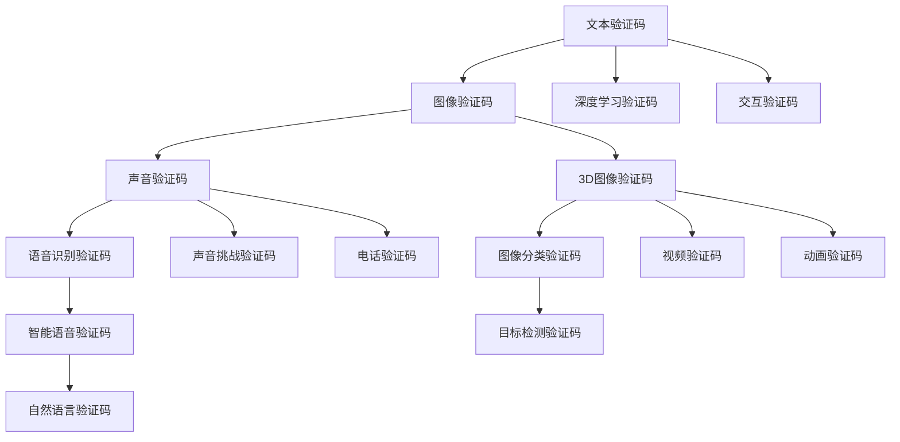

                 

## 1. 背景介绍

### 1.1 问题由来
在数字化的浪潮中，互联网应用逐渐成为人们生活中不可或缺的一部分。然而，随之而来的安全问题也日益凸显。如何有效防范自动化脚本的恶意攻击，保障用户数据安全，成为了一个亟待解决的问题。验证码（CAPTCHA）技术应运而生，作为一种简单有效的安全防护手段，广泛应用于登录、注册、评论、支付等场景，为人机交互中的博弈注入了智慧元素。

### 1.2 问题核心关键点
验证码的核心在于平衡用户体验与安全性。早期的验证码设计主要是通过增加识别难度，防止自动化脚本。然而，这种方式对正常用户也带来了不便，存在“反人类”的设计倾向。近年来，随着深度学习等技术的进步，越来越多的智慧型验证码被引入，如文本识别、图像识别、语音识别等，力求在不影响用户体验的前提下，提高安全防护能力。

## 2. 核心概念与联系

### 2.1 核心概念概述

为了更好地理解验证码的工作原理和优化方向，本节将介绍几个关键概念：

- **CAPTCHA**：全称Completely Automated Public Turing test to tell Computers and Humans Apart，即自动区分计算机和人类的测试。通过设置难以自动化的挑战，来区分人类和自动化脚本。

- **文本验证码**：通过在图像中嵌入扰动文字，使机器难以识别，但人类可以轻松阅读。经典的例子如4+1、自然语言等。

- **图像验证码**：通过在图像中加入噪点、变形、曲线等干扰，使得机器难以识别。如扭曲数字、拼图、迷宫等。

- **深度学习验证码**：利用深度学习模型，自动生成挑战图像，如手写数字识别、图片分类、图像旋转等。

- **交互验证码**：结合用户的操作行为，如鼠标轨迹、键盘操作等，增加互动难度，防止脚本攻击。

这些核心概念之间存在紧密联系，共同构成了一个多层次的验证码体系。通过理解这些概念，我们可以更全面地把握验证码技术的现状和趋势。

### 2.2 核心概念原理和架构的 Mermaid 流程图



这个流程图展示了验证码系统的核心概念和它们之间的联系。可以看出，验证码技术正朝着多维度、多模态的方向发展，力求在安全性和用户体验间找到更好的平衡。

## 3. 核心算法原理 & 具体操作步骤
### 3.1 算法原理概述

验证码的核心在于设计一个难以自动化的挑战，但易于人工解决。其原理通常包括以下几个方面：

- **可区分性**：确保挑战对机器来说难以解决，但对人类来说相对简单。

- **不可复制性**：防止自动化脚本通过暴力破解等手段攻破。

- **可扩展性**：适应不同的应用场景和需求。

- **安全性**：确保即使攻击者能够破解验证码，也不能轻易获取目标系统信息。

### 3.2 算法步骤详解

验证码的设计和实现通常包括以下几个步骤：

**Step 1: 生成挑战**
- 根据应用场景选择适当的挑战类型，如文本、图像、声音等。
- 使用随机算法生成挑战数据，如旋转角度、扭曲变形等。

**Step 2: 编码与输出**
- 将挑战数据编码为图像或音频，并输出到用户端。

**Step 3: 用户输入**
- 用户通过手动输入或点击、拖拽等方式解决挑战。
- 系统根据用户输入验证挑战是否正确。

**Step 4: 反馈与迭代**
- 如果挑战成功解决，系统允许用户继续操作。
- 如果挑战失败，系统提示用户重新输入。

**Step 5: 记录与分析**
- 记录用户解决挑战的时间、方式等数据。
- 对用户行为进行分析，评估验证码的安全性和用户体验。

### 3.3 算法优缺点

验证码技术作为一种安全防护手段，具有以下优点：

- **简单易用**：相比复杂的身份认证方法，验证码使用简单，易于集成到各类应用中。

- **效果显著**：能够在短时间内显著提升系统安全，防止自动化脚本攻击。

- **适应性强**：可以根据不同的应用场景进行灵活设计，适用于登录、注册、支付等各类场景。

- **成本低廉**：相较于复杂的身份认证系统，验证码的开发和维护成本较低。

然而，验证码技术也存在一些局限性：

- **用户体验差**：频繁的验证码输入会影响用户体验，存在“反人类”的设计倾向。

- **攻击手段多**：随着技术的发展，验证码对抗手段也在不断进化，如暴力破解、机器学习等。

- **安全性存疑**：在某些情况下，验证码容易被攻破，导致安全漏洞。

- **误判率高**：有时机器难以正确识别用户输入，导致验证码误判，影响用户体验。

### 3.4 算法应用领域

验证码技术广泛应用于各类网络应用中，以下是几个典型的应用场景：

- **网站登录与注册**：通过验证码防止自动化脚本恶意注册账号。
- **在线支付**：通过验证码保护用户支付信息安全。
- **评论与回复**：防止垃圾评论和恶意回复。
- **论坛与社交媒体**：防止自动化机器人灌水、发帖等。

此外，验证码技术还在游戏、广告、邮件验证等领域得到广泛应用，为网络安全提供了有力保障。

## 4. 数学模型和公式 & 详细讲解 & 举例说明

### 4.1 数学模型构建

假设验证码系统由生成挑战、用户输入、验证结果三部分组成，可以构建如下数学模型：

- 挑战生成器：$C = f_{C}(X)$，其中$X$为随机噪声。
- 用户输入验证器：$V(Y, C)$，其中$Y$为用户输入。
- 输出结果：$R = g_{R}(V(Y, C))$，其中$R \in \{0, 1\}$，表示验证结果，0表示验证失败，1表示验证成功。

### 4.2 公式推导过程

以文本验证码为例，挑战生成过程如下：

1. 选择一段长度为$n$的随机文本，记为$T$。
2. 将文本$T$中的字符进行随机扰动，生成扰动文本$T'$。
3. 将扰动文本$T'$嵌入到图像$I$中。
4. 输出图像$I$。

用户输入验证过程如下：

1. 用户从图像$I$中识别出扰动文本$T'$。
2. 将识别结果$Y$与原始文本$T$进行匹配，若匹配成功，则验证通过，否则验证失败。

### 4.3 案例分析与讲解

以Google reCAPTCHA为例，其生成过程如下：

1. 选择一段长度为$n$的随机文本，将其嵌入到特定规则的验证码中。
2. 对文本进行旋转、扭曲、噪声添加等扰动，生成挑战图像。
3. 输出挑战图像。

用户输入验证过程如下：

1. 用户通过手动输入识别验证码中的文字。
2. 系统将用户输入与原始文本进行比对，若匹配成功，则验证通过，否则验证失败。

通过Google reCAPTCHA的案例，可以看出验证码技术的复杂性和灵活性。其不仅在文字识别上进行了深入优化，还引入了多种扰动手段，确保了安全性和用户体验。

## 5. 项目实践：代码实例和详细解释说明
### 5.1 开发环境搭建

在进行验证码实践前，我们需要准备好开发环境。以下是使用Python进行验证码开发的常见环境配置流程：

1. 安装Python：从官网下载并安装Python，并设置环境变量。
2. 安装必要的第三方库：如Pillow用于图像处理、pytesseract用于文本识别、OpenCV用于图像生成等。
3. 搭建测试环境：创建虚拟环境，安装依赖库，搭建本地测试服务器。

完成上述步骤后，即可在开发环境中进行验证码的实践。

### 5.2 源代码详细实现

以下是一个基于Pillow和pytesseract库的文本验证码生成和识别示例代码：

```python
from PIL import Image, ImageDraw, ImageFont
import pytesseract
import random
import string

# 生成随机文本
def generate_text(length):
    letters = string.ascii_letters + string.digits
    return ''.join(random.choice(letters) for i in range(length))

# 生成验证码图像
def generate_captcha(text):
    width, height = 120, 40
    image = Image.new('RGB', (width, height), (255, 255, 255))
    draw = ImageDraw.Draw(image)
    font = ImageFont.truetype('arial.ttf', 36)
    draw.text((10, 10), text, font=font, fill=(0, 0, 0))
    noise = Image.new('RGB', image.size, (255, 255, 255))
    draw = ImageDraw.Draw(noise)
    for i in range(50):
        x = random.randint(0, width)
        y = random.randint(0, height)
        draw.rectangle((x, y, x+5, y+5), fill=(0, 0, 0))
    captcha = Image.alpha_composite(image, noise)
    captcha.save('captcha.png')

# 识别验证码文本
def recognize_captcha():
    captcha = Image.open('captcha.png')
    text = pytesseract.image_to_string(captcha)
    return text

# 测试代码
if __name__ == '__main__':
    text = generate_text(4)
    generate_captcha(text)
    recognized_text = recognize_captcha()
    print(f"Generated text: {text}")
    print(f"Recognized text: {recognized_text}")
```

### 5.3 代码解读与分析

让我们再详细解读一下关键代码的实现细节：

**generate_text函数**：
- 生成指定长度的随机文本，由字母和数字组成。

**generate_captcha函数**：
- 创建一张指定大小的白图像，用黑色绘制验证码文本。
- 创建噪声图像，并在验证码图像上叠加噪声点。
- 将验证码图像和噪声图像叠加，生成最终的验证码图像。

**recognize_captcha函数**：
- 打开验证码图像，使用pytesseract库进行文本识别。
- 返回识别出的文本。

**测试代码**：
- 生成随机文本并生成验证码图像。
- 读取验证码图像并识别文本。
- 输出生成和识别的文本。

通过以上代码实现，我们可以看到验证码系统的基本流程：生成随机文本，生成扰动验证码，识别用户输入并验证。

## 6. 实际应用场景
### 6.1 网站登录与注册

网站登录与注册是验证码应用最广泛的场景之一。用户在输入用户名和密码后，系统自动生成并展示验证码，要求用户解决验证码，以防止自动化脚本恶意注册或登录。

以Facebook为例，其注册和登录页面都使用了CAPTCHA技术，要求用户在输入用户名和密码后，解决验证码，才能完成注册或登录。这种设计可以有效防止自动化脚本攻击，保障用户账户安全。

### 6.2 在线支付

在线支付是另一个需要严格验证用户身份的场景。为了防止机器人恶意下单，系统会在支付过程中添加验证码，要求用户在输入支付信息后，解决验证码，才能完成支付操作。

例如，支付宝和微信支付在支付页面均使用了验证码技术，要求用户在输入支付金额和银行卡信息后，解决验证码，才能完成支付操作。这种设计可以有效防止自动化脚本攻击，保障用户财产安全。

### 6.3 评论与回复

评论与回复是社交媒体平台的重要功能之一。为了防止垃圾评论和恶意回复，系统会在评论页面添加验证码，要求用户在输入评论内容后，解决验证码，才能提交评论。

例如，Twitter和Instagram在评论和回复页面均使用了CAPTCHA技术，要求用户在输入评论内容后，解决验证码，才能完成评论操作。这种设计可以有效防止垃圾评论和恶意回复，保障社交媒体平台的用户体验。

### 6.4 论坛与社交媒体

论坛和社交媒体是用户交流的重要平台。为了防止自动化脚本灌水、发帖等行为，系统会在发帖和回复页面添加验证码，要求用户在输入帖子内容后，解决验证码，才能完成发帖操作。

例如，Reddit和知乎在发帖和回复页面均使用了CAPTCHA技术，要求用户在输入帖子内容后，解决验证码，才能完成发帖操作。这种设计可以有效防止自动化脚本攻击，保障论坛和社交媒体平台的用户体验。

## 7. 工具和资源推荐
### 7.1 学习资源推荐

为了帮助开发者系统掌握验证码技术的理论基础和实践技巧，这里推荐一些优质的学习资源：

1. **CAPTCHA: User Interface Controls for Interactive Robots**：IEEE计算机协会出版的经典书籍，系统介绍了CAPTCHA技术的历史、原理和实现方法。
2. **《验证码设计：理论与实践》**：网络安全专家著述的经典书籍，详细讲解了验证码技术的设计思路和实现细节。
3. **Google reCAPTCHA开发者文档**：Google官方提供的CAPTCHA技术文档，包括API使用、代码示例等。
4. **PyTesseract官方文档**：OCR识别库pytesseract的官方文档，提供了详细的安装和使用说明。
5. **Pillow官方文档**：Python图像处理库Pillow的官方文档，提供了丰富的API和示例代码。

通过对这些资源的学习实践，相信你一定能够快速掌握验证码技术的精髓，并用于解决实际的互联网安全问题。

### 7.2 开发工具推荐

高效的开发离不开优秀的工具支持。以下是几款用于验证码开发的常用工具：

1. **Python**：轻量级、易用性强的编程语言，支持丰富的第三方库，适合进行验证码开发。
2. **Pillow**：Python图像处理库，支持图像生成、处理和存储。
3. **pytesseract**：OCR识别库，支持从图像中提取文本。
4. **OpenCV**：开源计算机视觉库，支持图像处理、特征提取等。
5. **Google reCAPTCHA**：Google提供的验证码生成和识别服务，支持多种类型的验证码生成。

合理利用这些工具，可以显著提升验证码系统的开发效率，加快创新迭代的步伐。

### 7.3 相关论文推荐

验证码技术的发展源于学界的持续研究。以下是几篇奠基性的相关论文，推荐阅读：

1. **CAPTCHA: The Good, the Bad and the Ugly**：Google研究人员发表的综述论文，全面介绍了验证码技术的优缺点和未来发展方向。
2. **Interactive Proofs: A Survey**：著名密码学家Andrew W. Appel的综述论文，介绍了交互式证明的理论基础和实际应用。
3. **Practical Art of CAPTCHA**：网络安全专家Ross Turek的经典论文，详细讲解了验证码技术的设计思路和实现细节。
4. **Learning to recognize number plates**：Google研究人员发表的论文，提出了一种基于神经网络的验证码生成方法，可以有效提升验证码的安全性和鲁棒性。
5. **Practical yet principled CAPTCHA design**：清华大学计算机科学与技术系教授段海翔等人的论文，提出了一种基于隐私保护的验证码设计方法，可以有效保护用户隐私。

这些论文代表了大验证码技术的发展脉络。通过学习这些前沿成果，可以帮助研究者把握学科前进方向，激发更多的创新灵感。

## 8. 总结：未来发展趋势与挑战

### 8.1 总结

本文对验证码技术进行了全面系统的介绍。首先阐述了验证码技术的背景和意义，明确了其在人机交互中的重要作用。其次，从原理到实践，详细讲解了验证码的生成、识别和验证过程，给出了验证码系统开发的完整代码实例。同时，本文还广泛探讨了验证码技术在互联网安全、社交媒体、在线支付等诸多领域的应用前景，展示了验证码技术的广泛应用价值。此外，本文精选了验证码技术的各类学习资源，力求为读者提供全方位的技术指引。

通过本文的系统梳理，可以看出，验证码技术作为人机交互中的重要环节，不仅在安全性上发挥了重要作用，还为用户体验带来了显著改善。未来，伴随深度学习等技术的进一步发展，验证码技术必将迎来新的突破，为人机交互带来更多智慧元素。

### 8.2 未来发展趋势

展望未来，验证码技术将呈现以下几个发展趋势：

1. **多模态验证码**：未来的验证码技术将不局限于单一模态，如文本、图像、声音等，而是综合多种模态，提供更丰富、更全面的挑战。
2. **智能验证码**：通过引入机器学习、深度学习等技术，验证码系统将更加智能化，能够动态调整挑战难度，适应不同的用户群体。
3. **隐私保护**：未来的验证码系统将更加注重用户隐私保护，通过匿名化、差分隐私等技术，防止用户隐私泄露。
4. **泛化性和鲁棒性**：未来的验证码技术将更加注重泛化性和鲁棒性，能够抵御各种攻击手段，保护系统安全。
5. **跨平台兼容性**：未来的验证码技术将具备良好的跨平台兼容性，支持移动端、PC端等多种终端设备，提供一致的用户体验。
6. **自动化验证**：未来的验证码技术将更加自动化，通过与API结合，实现系统间的数据验证和交互，提高验证效率。

这些趋势凸显了验证码技术的前景和潜力，将为人机交互带来更多智慧元素，提升用户体验和系统安全性。

### 8.3 面临的挑战

尽管验证码技术已经取得了瞩目成就，但在迈向更加智能化、普适化应用的过程中，它仍面临着诸多挑战：

1. **用户体验差**：频繁的验证码输入会影响用户体验，存在“反人类”的设计倾向。如何优化验证码设计，在安全性与用户体验间找到平衡，是一大挑战。
2. **攻击手段多**：随着技术的发展，验证码对抗手段也在不断进化，如暴力破解、机器学习等。如何提升验证码系统的鲁棒性，防止被攻破，是未来的研究方向。
3. **安全性存疑**：在某些情况下，验证码容易被攻破，导致安全漏洞。如何设计更安全的验证码系统，保障用户隐私和系统安全，是重要的问题。
4. **误判率高**：有时机器难以正确识别用户输入，导致验证码误判，影响用户体验。如何提升验证码系统的准确率，减少误判，是急需解决的问题。
5. **隐私保护问题**：验证码系统需要收集用户输入，可能带来隐私泄露的风险。如何保护用户隐私，防止数据泄露，是未来的重要课题。
6. **跨平台兼容性差**：验证码系统在不同平台上的兼容性不足，可能影响用户体验。如何实现跨平台兼容，是未来的研究方向。

这些挑战凸显了验证码技术的应用瓶颈，需要开发者不断迭代和优化，才能满足用户需求。

### 8.4 未来突破

面对验证码技术所面临的种种挑战，未来的研究需要在以下几个方面寻求新的突破：

1. **引入机器学习技术**：通过引入机器学习、深度学习等技术，验证码系统将更加智能化，能够动态调整挑战难度，适应不同的用户群体。
2. **优化验证码设计**：通过改进验证码的设计思路，如引入语音验证码、图像验证码等，提升用户体验，减少“反人类”设计倾向。
3. **增强验证码安全性**：通过引入隐私保护、差分隐私等技术，验证码系统将更加安全可靠，能够抵御各种攻击手段。
4. **提高验证码准确率**：通过改进图像处理、OCR识别等技术，验证码系统将更加准确，减少误判，提高用户体验。
5. **实现跨平台兼容**：通过优化验证码系统的架构设计，实现跨平台兼容，支持移动端、PC端等多种终端设备。
6. **引入自动化验证**：通过与API结合，实现系统间的数据验证和交互，提高验证效率，提升用户体验。

这些研究方向将引领验证码技术迈向更高的台阶，为人机交互带来更多智慧元素，提升用户体验和系统安全性。

## 9. 附录：常见问题与解答

**Q1：验证码系统的安全性如何保障？**

A: 验证码系统的安全性主要通过以下几个方面保障：
1. 随机性：生成验证码时引入随机噪声，防止自动化脚本预测。
2. 扰动性：对验证码进行扰动处理，增加破解难度。
3. 复杂性：通过多维度、多模态的验证码设计，增加破解难度。
4. 验证机制：通过精确的验证机制，防止误判，提升系统安全性。

**Q2：验证码系统的用户体验如何优化？**

A: 验证码系统的用户体验可以通过以下几个方面优化：
1. 简洁性：设计简洁明了的验证码，减少用户输入。
2. 交互性：引入交互验证码，如鼠标轨迹、键盘操作等，提升用户体验。
3. 可见性：使用高对比度、清晰可见的验证码，减少视觉障碍。
4. 智能性：引入机器学习、深度学习等技术，动态调整验证码难度，适应不同的用户群体。

**Q3：验证码系统的误判率如何降低？**

A: 验证码系统的误判率可以通过以下几个方面降低：
1. 图像处理：提高图像处理和OCR识别的准确率。
2. 算法优化：优化验证码生成和识别的算法，减少误判。
3. 多轮验证：通过多轮验证机制，减少误判。
4. 用户反馈：引入用户反馈机制，收集用户反馈，优化验证码设计。

通过以上优化措施，可以有效降低验证码系统的误判率，提升用户体验和系统安全性。

**Q4：验证码系统如何实现跨平台兼容性？**

A: 验证码系统实现跨平台兼容性可以通过以下几个方面：
1. 响应式设计：采用响应式设计，适配不同设备的屏幕尺寸和分辨率。
2. 浏览器兼容性：支持多种主流浏览器，如Chrome、Firefox、Safari等。
3. 移动端兼容：支持移动端设备，如iOS、Android等。
4. 平台兼容性：支持PC端、Web端等多种平台，提供一致的用户体验。

通过以上措施，可以有效提升验证码系统的跨平台兼容性，支持多种设备和技术平台。

通过本文的系统梳理，可以看出，验证码技术作为人机交互中的重要环节，不仅在安全性上发挥了重要作用，还为用户体验带来了显著改善。未来，伴随深度学习等技术的进一步发展，验证码技术必将迎来新的突破，为人机交互带来更多智慧元素。

