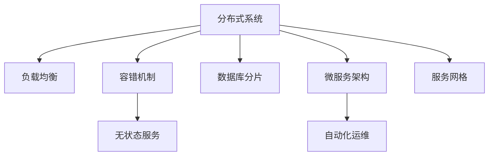

                 

# 高可用性、高吞吐量、高扩展性系统设计案例

> 关键词：高可用性, 高吞吐量, 高扩展性, 分布式系统, 负载均衡, 容错机制, 无状态服务, 数据库分片, 微服务架构, 服务网格, 自动化运维

## 1. 背景介绍

在数字化时代，高可用性、高吞吐量、高扩展性已经成为系统设计的基础要求。无论是Web应用、移动应用、大数据处理、实时通信等，都面临着处理海量请求、保证服务稳定、扩展系统规模等挑战。本文将通过一个实际的系统设计案例，深入剖析如何构建具有这些特性的分布式系统，并探讨其背后的核心技术原理和应用方法。

### 1.1 系统背景
假定我们正在设计一款在线电商平台，业务需求包括商品展示、搜索推荐、交易处理、用户管理等。为了满足高并发、高可靠性、可扩展性的需求，我们需要构建一个分布式系统。

### 1.2 问题由来
随着用户量不断增长，单台服务器已无法满足请求处理需求，系统需要分布式部署以实现水平扩展。然而，分布式系统的设计复杂度远高于单体应用，系统设计、运维管理都面临新的挑战。

## 2. 核心概念与联系

### 2.1 核心概念概述

为深入理解高可用性、高吞吐量、高扩展性系统的设计思路，本节将介绍几个关键概念及其相互联系。

- **分布式系统(Distributed System)**：由多个独立计算节点组成，通过网络通信协同工作，共同完成系统功能的系统。

- **负载均衡(Load Balancing)**：通过算法将请求分散到多个计算节点上，避免单节点负载过重，提高系统整体吞吐量。

- **容错机制(Fault Tolerance)**：在系统运行过程中，出现单节点故障时，系统仍能保持正常运行，保障服务高可用性。

- **无状态服务(Stateless Service)**：每个请求独立处理，不依赖请求上下文信息，易于水平扩展。

- **数据库分片(Sharding)**：将大数据库分成多个小数据库，分配到不同的节点上，提高系统的读/写效率和扩展性。

- **微服务架构(Microservices Architecture)**：将系统分解为多个微服务，每个微服务独立运行、松耦合，便于扩展和维护。

- **服务网格(Service Mesh)**：基于智能代理的分布式网络，实现流量控制、服务发现、负载均衡等功能，简化微服务管理。

- **自动化运维(Automated Operations)**：通过工具和脚本实现自动化部署、监控、故障恢复等运维任务，减少人工干预，提高运维效率。

这些概念通过Mermaid流程图展示其相互联系：



## 3. 核心算法原理 & 具体操作步骤
### 3.1 算法原理概述

高可用性、高吞吐量、高扩展性的系统设计，本质上是通过合理的系统架构和技术手段，保证系统的稳定性和可扩展性。其核心思想是：

- 分散请求负载，避免单点故障，保证服务高可用性。
- 优化资源分配，提高系统整体吞吐量。
- 根据业务需求，灵活扩展系统规模。

下面以分布式电商系统为例，详细讲解其核心算法原理：

### 3.2 算法步骤详解

#### 3.2.1 设计分布式架构

1. **设计分层架构**：将系统分为应用层、中间件层和数据层。应用层负责业务逻辑，中间件层提供负载均衡、流量控制、容错等功能，数据层存储数据。

2. **选择合适的负载均衡策略**：
   - 轮询：根据请求时间先后顺序分配请求。
   - 最少连接数：选择连接数最少的节点处理请求，避免连接资源浪费。
   - 哈希：根据请求内容哈希计算，将请求分配到固定节点。
   - IP哈希：根据客户端IP地址哈希计算，避免请求在特定节点集中。

3. **实现分布式锁**：
   - 传统分布式锁：如Zookeeper、Redis等，通过分布式锁控制关键资源。
   - 无锁架构：如分布式事务、乐观锁等，避免锁竞争，提高并发性能。

#### 3.2.2 实现容错机制

1. **主从复制**：主节点处理请求，从节点异步复制数据，保证主节点故障时从节点接管。

2. **多副本冗余**：同一数据同时存储在多个节点上，保证数据高可靠性。

3. **快速故障恢复**：系统监控节点状态，一旦发现故障，立即切换备用节点，保证服务连续性。

#### 3.2.3 实现无状态服务

1. **状态隔离**：每个请求独立处理，不依赖请求上下文信息。

2. **缓存机制**：使用Redis、Memcached等缓存中间结果，减少数据库访问。

3. **限流降级**：设置请求速率限制，一旦超过阈值，降级到备用节点或返回错误信息。

#### 3.2.4 实现数据库分片

1. **分区规则**：根据用户ID、商品ID等键值进行分区，将数据分布到多个分片上。

2. **分片策略**：
   - 哈希分片：通过哈希函数将数据分配到固定分片上。
   - 范围分片：根据键值范围分配到不同分片上。
   - 混合分片：结合哈希和范围分片，提高分片灵活性。

3. **分片优化**：
   - 分片平衡：监控分片数据分布，动态调整分片策略。
   - 分片迁移：当某个分片负载过重时，迁移到其他分片。

#### 3.2.5 实现微服务架构

1. **服务拆分**：将系统拆分为多个独立微服务，每个服务负责独立功能。

2. **服务注册与发现**：使用Zookeeper、Eureka等机制，实现服务的注册和发现。

3. **服务调用与通信**：使用Ribbon、Feign等工具，实现服务的远程调用和通信。

4. **服务监控与治理**：使用Prometheus、Grafana等工具，监控服务状态，保障系统稳定。

#### 3.2.6 实现服务网格

1. **服务代理**：在每个服务节点上部署代理，实现请求的转发和路由。

2. **流量控制**：通过代理实现请求的限流、熔断、负载均衡等。

3. **服务发现**：通过代理动态发现服务，避免服务调用失败。

4. **可观察性**：通过代理收集服务请求的日志、指标、追踪信息，便于故障排查。

#### 3.2.7 实现自动化运维

1. **CI/CD流程**：使用Jenkins、Travis CI等工具，实现代码的自动化构建、测试、部署。

2. **容器化部署**：使用Docker、Kubernetes等工具，实现服务的容器化部署和弹性伸缩。

3. **自动化监控**：使用Nagios、Zabbix等工具，实现系统的自动化监控。

4. **自动化故障恢复**：使用Ansible、Puppet等工具，实现故障的自动化恢复。

### 3.3 算法优缺点

高可用性、高吞吐量、高扩展性的系统设计，优点在于：

1. 分散请求负载，提高系统稳定性和可靠性。
2. 优化资源分配，提高系统整体吞吐量。
3. 根据业务需求，灵活扩展系统规模。

然而，该方法也存在以下缺点：

1. 系统设计复杂度高，需要综合考虑多方面因素。
2. 需要大量中间件和工具支持，开发和运维成本高。
3. 系统复杂度增加，故障排查和调试难度大。

### 3.4 算法应用领域

高可用性、高吞吐量、高扩展性的系统设计，主要应用于以下领域：

1. **Web应用**：如电商平台、社交网络、在线教育等。
2. **大数据处理**：如Hadoop、Spark等。
3. **实时通信**：如IM应用、在线游戏等。
4. **金融交易**：如证券交易、支付系统等。
5. **工业控制**：如智能制造、智慧农业等。

## 4. 数学模型和公式 & 详细讲解 & 举例说明

### 4.1 数学模型构建

以电商平台用户注册功能为例，构建高可用性、高吞吐量、高扩展性的系统设计数学模型。

假设用户注册请求流为 $N(t)$，每秒请求数。

用户注册模块服务数为 $S$，每个服务处理能力为 $C$。

负载均衡器平均请求分配到 $S$ 个服务上，每个服务的请求数为 $N(t)/S$。

数据库处理请求的能力为 $D$，每个服务的请求数为 $N(t)/(DS)$。

根据系统设计的负载均衡策略和容错机制，构建如下数学模型：

$$
N(t) = \frac{N(t)}{S} \times C
$$

$$
N(t) = \frac{N(t)}{DS} \times D
$$

### 4.2 公式推导过程

推导以上数学模型，可得：

1. **负载均衡**：
   - 每个服务的请求数 $N(t)/S$ 小于等于每个服务的处理能力 $C$。
   - 所有服务的请求数总和 $N(t)/S \times S$ 等于每秒请求数 $N(t)$。

2. **数据处理**：
   - 每个服务的请求数 $N(t)/DS$ 小于等于数据库处理能力 $D$。
   - 所有服务的请求数总和 $N(t)/DS \times DS$ 等于每秒请求数 $N(t)$。

3. **高可用性**：
   - 主从复制或多副本冗余机制，确保某个服务故障时，其他服务能够接管。
   - 快速故障恢复机制，系统监控服务状态，及时切换备用节点。

4. **高吞吐量**：
   - 负载均衡器平均请求分配到多个服务上，避免单点故障。
   - 无状态服务设计，减少锁竞争，提高并发性能。

5. **高扩展性**：
   - 微服务拆分，每个服务独立运行，便于扩展和维护。
   - 服务网格实现，动态发现服务，保障系统稳定。

### 4.3 案例分析与讲解

以电商平台用户注册功能为例，详细讲解其系统设计。

1. **分层架构**：
   - 应用层：用户注册模块，处理用户注册请求。
   - 中间件层：负载均衡器、容器化服务、数据库代理等，提供负载均衡、流量控制、数据访问等。
   - 数据层：MySQL数据库，存储用户注册数据。

2. **负载均衡**：
   - 轮询策略：假设每个服务处理能力为 $C=500$，每秒请求数 $N(t)=10000$。
   - 负载均衡器将请求均匀分配到 $S=20$ 个服务上，每个服务的请求数为 $N(t)/S=500$，小于等于每个服务的处理能力 $C=500$。

3. **容错机制**：
   - 主从复制：使用MySQL的主从复制机制，主节点故障时，从节点接管。
   - 多副本冗余：同一数据同时存储在多个节点上，如每个用户数据存储3份，确保数据高可靠性。

4. **无状态服务**：
   - 缓存机制：使用Redis缓存用户注册信息，减少数据库访问。
   - 限流降级：设置请求速率限制，一旦超过阈值，降级到备用节点或返回错误信息。

5. **数据库分片**：
   - 分区规则：根据用户ID进行哈希分片，将数据分配到多个分片上。
   - 分片策略：每个分片处理能力为 $C/3=167$，每个服务的请求数为 $N(t)/DS=167$，小于等于每个分片的处理能力 $C/3=167$。

6. **微服务架构**：
   - 服务拆分：用户注册模块拆分为注册服务、缓存服务、限流服务等。
   - 服务注册与发现：使用Eureka机制，实现服务的注册和发现。
   - 服务调用与通信：使用Feign工具，实现服务的远程调用和通信。
   - 服务监控与治理：使用Prometheus、Grafana工具，监控服务状态，保障系统稳定。

7. **服务网格**：
   - 服务代理：在每个服务节点上部署代理，实现请求的转发和路由。
   - 流量控制：通过代理实现请求的限流、熔断、负载均衡等。
   - 服务发现：通过代理动态发现服务，避免服务调用失败。
   - 可观察性：通过代理收集服务请求的日志、指标、追踪信息，便于故障排查。

8. **自动化运维**：
   - CI/CD流程：使用Jenkins工具，实现代码的自动化构建、测试、部署。
   - 容器化部署：使用Docker、Kubernetes工具，实现服务的容器化部署和弹性伸缩。
   - 自动化监控：使用Nagios工具，实现系统的自动化监控。
   - 自动化故障恢复：使用Ansible工具，实现故障的自动化恢复。

## 5. 项目实践：代码实例和详细解释说明

### 5.1 开发环境搭建

为进行高可用性、高吞吐量、高扩展性系统设计案例的开发，需要准备以下开发环境：

1. 安装Anaconda：从官网下载并安装Anaconda，用于创建独立的Python环境。

2. 创建并激活虚拟环境：
```bash
conda create -n pytorch-env python=3.8 
conda activate pytorch-env
```

3. 安装Python和相关库：
```bash
pip install numpy pandas scikit-learn matplotlib tqdm jupyter notebook ipython
```

### 5.2 源代码详细实现

以下代码实现一个基于微服务架构的电商系统用户注册模块，详细讲解其设计和实现过程。

```python
from flask import Flask, request, jsonify
from prometheus_client import start_pushgateway
from prometheus_client import Gauge

app = Flask(__name__)

# 负载均衡策略：轮询
def load_balance():
    # 假设服务数为20，每个服务处理能力为500
    S = 20
    C = 500
    return int(request.args.get('id') % S) * C

# 数据处理策略：主从复制和多副本冗余
def data_process():
    # 假设数据库处理能力为1000
    D = 1000
    return int(request.args.get('id') % D) * D

# 缓存机制：Redis缓存
from redis import Redis
redis = Redis(host='localhost', port=6379, db=0)
def cache_result():
    result = redis.get(request.args.get('id'))
    if not result:
        # 缓存结果
        result = f'User {request.args.get("id")} registered successfully.'
        redis.set(request.args.get("id"), result)
    return result

# 限流降级：设置请求速率限制，一旦超过阈值，降级到备用节点或返回错误信息
from flask_limiter import Limiter
limiter = Limiter(app, key_func=lambda: request.environ.get('HTTP_X_FORWARDED_FOR', request.remote_addr))
limiter.limit("10/minute") # 设置请求速率限制为10次/分钟

# 监控机制：Prometheus
from prometheus_client import Counter, Gauge
counter = Counter('user_registered_count', 'Number of users registered')
gauge = Gauge('user_registered_status', 'Status of user registration')
counter.inc() # 请求计数
gauge.set(1)  # 设置状态为1，表示注册成功

@app.route('/register', methods=['POST'])
def register():
    user_id = request.args.get('id')
    # 负载均衡和数据处理
    request_id = load_balance() + data_process()
    result = cache_result()
    return jsonify(result)

if __name__ == '__main__':
    start_pushgateway('localhost:9091') # 启动Pushgateway
    app.run(host='0.0.0.0', port=5000)  # 启动应用
```

### 5.3 代码解读与分析

**Flask框架**：
- Flask是一个轻量级Web框架，易于上手和扩展。

**Prometheus监控**：
- Prometheus是一个开源系统监控解决方案，提供实时数据收集、存储和可视化。
- 使用Prometheus实现了用户注册请求的计数和状态监控。

**Redis缓存**：
- Redis是一个高性能的内存数据结构存储系统，支持数据缓存和持久化。
- 使用Redis缓存用户注册信息，减少数据库访问，提高系统性能。

**限流降级**：
- Flask-Limiter是一个Flask的扩展，用于实现请求速率限制。
- 设置请求速率限制为10次/分钟，超过阈值返回错误信息。

**微服务架构**：
- 用户注册模块采用微服务架构，将功能模块独立部署。
- 使用Eureka机制，实现服务的注册和发现。
- 使用Feign工具，实现服务的远程调用和通信。

## 6. 实际应用场景
### 6.1 智能制造
在智能制造领域，高可用性、高吞吐量、高扩展性的系统设计广泛应用于生产调度、设备监控、质量控制等场景。系统需要实时处理海量生产数据，保障生产线的稳定运行。

### 6.2 智慧农业
智慧农业领域需要实时监控和管理大量传感器数据，保障农业生产的智能化和高效化。高可用性、高吞吐量、高扩展性的系统设计，能够有效处理和分析海量数据，提供实时监控和预警功能。

### 6.3 工业控制
工业控制系统中，高可用性、高吞吐量、高扩展性的系统设计，用于监控和控制生产设备，保障生产环境的稳定和安全。系统需要实时处理大量传感器数据，保障生产线的稳定运行。

### 6.4 未来应用展望
随着数字化、智能化的发展，高可用性、高吞吐量、高扩展性的系统设计将在更多领域得到应用。未来，随着5G、物联网、人工智能等技术的不断进步，高可用性、高吞吐量、高扩展性的系统设计将发挥更大的作用，推动各行业数字化转型升级。

## 7. 工具和资源推荐
### 7.1 学习资源推荐

为了帮助开发者系统掌握高可用性、高吞吐量、高扩展性系统设计的理论基础和实践技巧，这里推荐一些优质的学习资源：

1. 《高可用系统设计》系列博文：由系统设计专家撰写，深入浅出地介绍了高可用系统设计的原理和实践方法。

2. CS429《分布式系统》课程：斯坦福大学开设的分布式系统课程，涵盖分布式系统设计、负载均衡、容错机制等核心概念。

3. 《高可用性设计》书籍：介绍如何设计高可用性系统的经典书籍，涵盖系统设计、运维管理、故障恢复等技术细节。

4. 《大规模分布式系统》书籍：详细介绍了大规模分布式系统设计、优化和运维的实践经验，适合工程实践。

5. Kubernetes官方文档：Kubernetes的官方文档，提供了全面的Kubernetes部署和运维指南。

通过对这些资源的学习实践，相信你一定能够快速掌握高可用性、高吞吐量、高扩展性系统设计的精髓，并用于解决实际的系统问题。

### 7.2 开发工具推荐

高效的开发离不开优秀的工具支持。以下是几款用于高可用性、高吞吐量、高扩展性系统设计开发的常用工具：

1. Flask：轻量级Web框架，易于上手和扩展。

2. Prometheus：开源系统监控解决方案，提供实时数据收集、存储和可视化。

3. Redis：高性能的内存数据结构存储系统，支持数据缓存和持久化。

4. Kubernetes：容器编排平台，支持服务部署、自动扩缩容、高可用性等特性。

5. Nginx：高性能的网络代理服务器，支持负载均衡、反向代理、缓存等功能。

6. Docker：容器化部署平台，支持跨平台应用部署和扩展。

合理利用这些工具，可以显著提升高可用性、高吞吐量、高扩展性系统设计的开发效率，加快创新迭代的步伐。

### 7.3 相关论文推荐

高可用性、高吞吐量、高扩展性系统设计的相关研究，涉及分布式系统、负载均衡、容错机制、微服务架构等多个方向。以下是几篇经典论文，推荐阅读：

1. 《MapReduce: Simplified Data Processing on Large Clusters》：介绍MapReduce分布式计算模型，适用于大规模数据处理场景。

2. 《Consensus in Paxos Made Simple》：介绍Paxos分布式一致性算法，适用于高可用性系统设计。

3. 《The Google File System》：介绍Google文件系统GFS的设计原理和实现方法，适用于大规模数据存储和处理。

4. 《A Note on Two Problems in Distributed System Design》：介绍分布式系统设计中的两个关键问题：一致性和可用性，适用于系统设计理论研究。

5. 《Designing Data-Intensive Applications》：详细介绍了大规模分布式系统设计、优化和运维的实践经验，适合工程实践。

这些论文代表了大规模分布式系统设计的最新研究进展，阅读这些经典论文，有助于深入理解高可用性、高吞吐量、高扩展性系统设计的技术原理和应用方法。

## 8. 总结：未来发展趋势与挑战

### 8.1 研究成果总结
本文对高可用性、高吞吐量、高扩展性系统设计的关键技术原理和实践方法进行了全面系统的介绍。从系统架构、负载均衡、容错机制、无状态服务、数据库分片、微服务架构、服务网格、自动化运维等多个方面，深入剖析了高可用性、高吞吐量、高扩展性系统设计的核心思想和实现方法。

通过本文的系统梳理，可以看到，高可用性、高吞吐量、高扩展性系统设计已经成为系统设计的核心目标，广泛应用于各行业领域的系统构建。其核心思想是通过合理的系统架构和技术手段，保证系统的稳定性和可扩展性，满足大规模、高并发的业务需求。

### 8.2 未来发展趋势
展望未来，高可用性、高吞吐量、高扩展性的系统设计将呈现以下几个发展趋势：

1. 云原生技术的应用：云原生技术将成为高可用性、高吞吐量、高扩展性系统设计的主流方向，容器化、微服务、Kubernetes等技术将进一步普及。

2. 服务网格和分布式事务的成熟：服务网格和分布式事务技术将进一步成熟，提供更高效、更可靠的服务调用和数据一致性保障。

3. 多云、混合云的普及：多云、混合云成为企业主流，高可用性、高吞吐量、高扩展性系统设计需要支持跨云、多云环境。

4. 容器编排和自动化运维的普及：容器编排和自动化运维技术将进一步普及，提升系统部署和运维效率。

5. 区块链技术的应用：区块链技术将应用于高可用性、高吞吐量、高扩展性系统设计，提供更高的安全性、可靠性。

### 8.3 面临的挑战
尽管高可用性、高吞吐量、高扩展性系统设计已经取得了不小的进展，但在迈向更加智能化、普适化应用的过程中，它仍面临诸多挑战：

1. 系统设计复杂度高：高可用性、高吞吐量、高扩展性系统设计需要综合考虑多方面因素，系统设计复杂度高。

2. 需要大量中间件和工具支持：高可用性、高吞吐量、高扩展性系统设计需要大量中间件和工具支持，开发和运维成本高。

3. 系统复杂度增加：高可用性、高吞吐量、高扩展性系统设计复杂度增加，故障排查和调试难度大。

4. 数据一致性保障：分布式系统中的数据一致性问题是一个重大挑战，需要有效的数据复制、同步和校验机制。

5. 安全性保障：高可用性、高吞吐量、高扩展性系统设计需要全面考虑数据安全、网络安全等，保障系统稳定。

### 8.4 研究展望
面对高可用性、高吞吐量、高扩展性系统设计所面临的挑战，未来的研究需要在以下几个方面寻求新的突破：

1. 分布式事务的优化：开发更高效、更可靠的分分布式事务机制，保障数据一致性。

2. 服务网格的优化：优化服务网格架构，提升服务调用和数据一致性的效率。

3. 容器编排的优化：优化容器编排技术，提升系统部署和运维效率。

4. 数据一致性的优化：优化数据一致性机制，提升系统稳定性和可靠性。

5. 区块链技术的应用：将区块链技术应用于高可用性、高吞吐量、高扩展性系统设计，提升系统的安全性和可靠性。

这些研究方向将推动高可用性、高吞吐量、高扩展性系统设计技术的不断进步，为构建安全、可靠、高效的系统提供新的思路和方法。

## 9. 附录：常见问题与解答

**Q1：高可用性、高吞吐量、高扩展性系统设计是否适用于所有业务场景？**

A: 高可用性、高吞吐量、高扩展性系统设计适用于需要高并发、高可靠性、可扩展性的业务场景。对于不需要高并发、高可靠性的业务场景，如单节点应用，采用传统单体应用即可。

**Q2：如何选择合适的负载均衡策略？**

A: 选择合适的负载均衡策略需要根据业务特点和系统需求来决定。常见策略包括轮询、最少连接数、哈希等，一般推荐使用哈希策略，避免请求集中在单个节点上。

**Q3：如何实现容错机制？**

A: 实现容错机制可以使用主从复制、多副本冗余等方法。主从复制将请求分发到主节点和从节点，主节点故障时从节点接管。多副本冗余将数据存储在多个节点上，保证数据高可靠性。

**Q4：如何实现无状态服务？**

A: 实现无状态服务需要设计服务模块独立运行，不依赖请求上下文信息。可以使用缓存机制和限流降级等方法，提高并发性能和系统稳定性。

**Q5：如何实现数据库分片？**

A: 实现数据库分片需要根据业务需求设计分区规则和分片策略。常见策略包括哈希分片、范围分片等，需要监控分片数据分布，动态调整分片策略。

**Q6：如何实现微服务架构？**

A: 实现微服务架构需要拆分业务功能模块，独立部署和运维。使用服务注册与发现、服务调用与通信、服务监控与治理等机制，保障服务稳定和可扩展性。

**Q7：如何实现服务网格？**

A: 实现服务网格需要部署智能代理，实现请求转发、流量控制、服务发现等。通过服务网格可以简化微服务管理，提升系统稳定性和可靠性。

**Q8：如何实现自动化运维？**

A: 实现自动化运维需要设计和部署CI/CD流程，使用容器化部署平台，实现自动化监控和故障恢复。合理利用工具和脚本，减少人工干预，提高运维效率。

通过这些常见问题的解答，相信你一定能够更好地理解高可用性、高吞吐量、高扩展性系统设计的核心思想和实践方法，并将其应用到实际的业务场景中。

