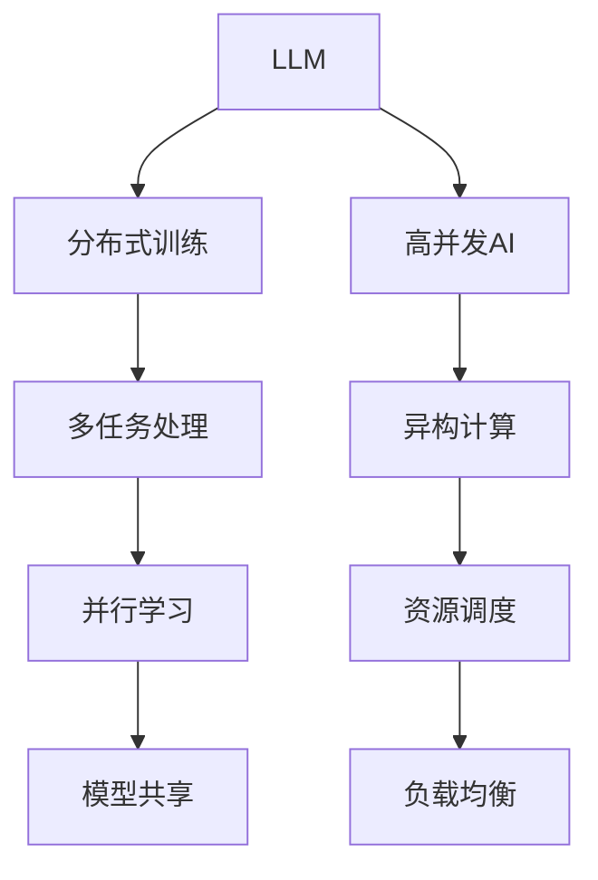

                 

# 高并发AI：LLM的多任务处理能力

> 关键词：高并发,LLM,多任务处理,分布式训练,TPU,深度学习,大规模模型,分布式系统,异构计算

## 1. 背景介绍

随着人工智能技术的快速发展，大规模语言模型(LLM)在自然语言处理(NLP)领域取得了显著突破。这些模型通常基于深度学习技术，在大规模语料上进行预训练，获得了强大的语言理解和生成能力。然而，由于单模型的参数规模和计算需求，其在实际应用中面临着高并发处理能力的挑战。本文将深入探讨LLM的高并发AI实现，即多任务处理能力，通过一系列分布式训练技术，有效提升大模型的性能和处理能力。

## 2. 核心概念与联系

### 2.1 核心概念概述

为更好地理解LLM的多任务处理能力，我们首先需要了解以下关键概念：

- **大规模语言模型(LLM)**：指参数量巨大、能够处理大规模文本数据的深度学习模型，如BERT、GPT等。
- **分布式训练**：通过将模型分布在多个计算节点上进行并行计算，以加速模型的训练过程。
- **高并发AI**：指在多任务并发的场景下，通过优化算法和架构，实现高效、稳定的AI应用。
- **多任务处理**：指模型同时处理多个任务的协同学习，旨在通过共享模型参数，提高模型泛化能力和多任务协同效率。
- **异构计算**：指利用不同硬件特性，如GPU、TPU、CPU等，实现更高效的计算资源优化配置。

这些核心概念之间的逻辑关系可以通过以下Mermaid流程图来展示：



这个流程图展示了LLM、分布式训练、高并发AI、多任务处理、异构计算等概念之间的联系：

1. LLM通过预训练获得基础能力。
2. 分布式训练通过并行计算加速训练，提升处理能力。
3. 高并发AI通过优化算法和架构，实现多任务协同处理。
4. 多任务处理通过模型共享，提高模型泛化能力。
5. 异构计算利用不同硬件特性，实现更高效的资源配置。

## 3. 核心算法原理 & 具体操作步骤

### 3.1 算法原理概述

LLM的多任务处理能力，通过分布式训练技术，在多任务并发的场景下，同时训练多个相关或独立的任务。在分布式训练中，不同任务可以共享模型参数，从而在提高模型泛化能力的同时，减少训练时间，提升整体处理能力。具体而言，算法原理如下：

1. **数据并行**：将训练数据分配到多个计算节点上，并行计算模型在每个节点上的前向传播和反向传播，从而加速模型训练。
2. **模型并行**：将大规模模型分割成多个小块，分配到不同节点上进行并行计算，通过参数共享实现高效的协同学习。
3. **混合精度训练**：利用16位浮点数和32位浮点数混合计算，在减少内存占用的同时，提高训练速度。
4. **异步更新**：通过异步更新参数，避免节点之间的通信阻塞，提高训练效率。

### 3.2 算法步骤详解

基于上述原理，多任务处理能力的分布式训练过程一般包括以下关键步骤：

**Step 1: 数据预处理与分布**
- 将训练数据分为多个子集，每个子集分配到不同的计算节点上进行预处理，包括数据分批、数据归一化等。

**Step 2: 模型并行化**
- 将大规模模型分割成多个小块，每个小块分配到不同的节点上进行计算。
- 在节点间同步模型参数，以实现参数共享和协调优化。

**Step 3: 异构计算优化**
- 利用不同硬件特性，如GPU、TPU等，实现更高效的计算资源配置。
- 使用TensorFlow等深度学习框架提供的分布式计算API，实现跨节点计算和通信。

**Step 4: 混合精度训练**
- 将部分参数使用16位浮点数进行计算，减少内存占用，提高计算效率。
- 在混合精度训练中，需要使用适当的混合精度策略，确保计算的准确性。

**Step 5: 异步更新与负载均衡**
- 在多个节点之间异步更新模型参数，避免通信阻塞。
- 采用负载均衡技术，平衡不同节点间的计算负担，确保系统的稳定性和效率。

**Step 6: 模型训练与优化**
- 在每个节点上独立训练模型，同时同步参数更新。
- 周期性在验证集上评估模型性能，根据性能指标决定是否触发Early Stopping。
- 重复上述步骤直到满足预设的迭代轮数或Early Stopping条件。

### 3.3 算法优缺点

基于分布式训练技术的多任务处理能力，具有以下优点：
1. 显著提升训练速度。通过并行计算和模型分割，极大地缩短了模型训练时间。
2. 增强模型泛化能力。共享模型参数使得各任务之间的知识得以传递和融合。
3. 减少硬件资源需求。不同硬件特性的利用，降低了单节点计算资源需求，提高了整体系统效率。

同时，该方法也存在一定的局限性：
1. 通信开销大。多节点间需要频繁通信，增加了训练时间和计算成本。
2. 模型参数难以优化。异步更新可能导致模型参数不一致，影响模型性能。
3. 系统调优复杂。需要综合考虑负载均衡、混合精度等策略，系统调优复杂度较高。
4. 数据同步延迟。大规模数据同步可能导致系统性能波动。

尽管存在这些局限性，但就目前而言，分布式训练技术已成为提升LLM处理能力的重要手段。未来相关研究的重点在于如何进一步降低通信开销，提高参数同步效率，优化系统调优策略，以实现更高效、更稳定的多任务处理能力。

### 3.4 算法应用领域

基于多任务处理能力的分布式训练方法，在NLP领域已经得到了广泛的应用，覆盖了几乎所有常见任务，例如：

- 文本分类：如情感分析、主题分类、意图识别等。通过共享模型参数，多任务协同学习。
- 命名实体识别：识别文本中的人名、地名、机构名等特定实体。通过多任务处理提升识别精度。
- 关系抽取：从文本中抽取实体之间的语义关系。通过多任务处理增强模型语义理解能力。
- 问答系统：对自然语言问题给出答案。通过多任务协同学习，提高答案生成的准确性。
- 机器翻译：将源语言文本翻译成目标语言。通过多任务处理，提升翻译质量和速度。
- 文本摘要：将长文本压缩成简短摘要。通过多任务协同学习，提高摘要生成的质量。
- 对话系统：使机器能够与人自然对话。通过多任务协同学习，提高对话流畅性和质量。

除了上述这些经典任务外，多任务处理能力还被创新性地应用到更多场景中，如可控文本生成、常识推理、代码生成、数据增强等，为NLP技术带来了全新的突破。随着预训练模型和分布式训练方法的不断进步，相信基于多任务处理能力的分布式训练方法将在更多领域得到应用，为NLP技术带来更广泛的影响。

## 4. 数学模型和公式 & 详细讲解  
### 4.1 数学模型构建

本节将使用数学语言对基于多任务处理能力的分布式训练过程进行更加严格的刻画。

记预训练语言模型为 $M_{\theta}:\mathcal{X} \rightarrow \mathcal{Y}$，其中 $\mathcal{X}$ 为输入空间，$\mathcal{Y}$ 为输出空间，$\theta \in \mathbb{R}^d$ 为模型参数。假设多任务处理能力训练的任务集为 $D=\{(x_i,y_i)\}_{i=1}^N$，其中 $y_i \in \mathcal{Y}$ 为多任务处理集，每个任务 $t$ 的输出。

定义模型 $M_{\theta}$ 在数据样本 $(x,y)$ 上的损失函数为 $\ell(M_{\theta}(x),y)$，则在数据集 $D$ 上的经验风险为：

$$
\mathcal{L}(\theta) = \frac{1}{N} \sum_{i=1}^N \ell(M_{\theta}(x_i),y_i)
$$

其中 $\ell$ 为多任务处理损失函数，用于衡量模型在多个任务上的输出与真实标签之间的差异。常见的多任务处理损失函数包括多重交叉熵损失、联合训练损失等。

在实际应用中，我们通常使用基于梯度的优化算法（如SGD、Adam等）来近似求解上述最优化问题。设 $\eta$ 为学习率，$\lambda$ 为正则化系数，则参数的更新公式为：

$$
\theta \leftarrow \theta - \eta \nabla_{\theta}\mathcal{L}(\theta) - \eta\lambda\theta
$$

其中 $\nabla_{\theta}\mathcal{L}(\theta)$ 为损失函数对参数 $\theta$ 的梯度，可通过反向传播算法高效计算。

### 4.2 公式推导过程

以下我们以多重交叉熵损失函数为例，推导多任务处理损失函数及其梯度的计算公式。

假设模型 $M_{\theta}$ 在输入 $x$ 上的输出为 $\hat{y}=M_{\theta}(x) \in \mathbb{R}^m$，表示样本在 $m$ 个任务上的预测值。真实标签 $y \in \mathcal{Y}$ 为多任务处理集，每个任务的标签 $y_t \in \mathcal{Y}_t$。则多重交叉熵损失函数定义为：

$$
\ell(M_{\theta}(x),y) = -\sum_{t=1}^m \mathbb{E}_{y_t|y}[\log \hat{y}_t]
$$

将其代入经验风险公式，得：

$$
\mathcal{L}(\theta) = -\frac{1}{N}\sum_{i=1}^N \sum_{t=1}^m \mathbb{E}_{y_t|y}[\log \hat{y}_t]
$$

根据链式法则，损失函数对参数 $\theta_k$ 的梯度为：

$$
\frac{\partial \mathcal{L}(\theta)}{\partial \theta_k} = -\frac{1}{N}\sum_{i=1}^N \sum_{t=1}^m \frac{\partial \mathbb{E}_{y_t|y}[\log \hat{y}_t]}{\partial \theta_k}
$$

其中 $\frac{\partial \mathbb{E}_{y_t|y}[\log \hat{y}_t]}{\partial \theta_k}$ 为条件期望的梯度，可以通过蒙特卡洛模拟等方法计算。

在得到损失函数的梯度后，即可带入参数更新公式，完成模型的迭代优化。重复上述过程直至收敛，最终得到适应多个任务的最优模型参数 $\theta^*$。

## 5. 项目实践：代码实例和详细解释说明
### 5.1 开发环境搭建

在进行多任务处理能力实现前，我们需要准备好开发环境。以下是使用Python进行PyTorch开发的环境配置流程：

1. 安装Anaconda：从官网下载并安装Anaconda，用于创建独立的Python环境。

2. 创建并激活虚拟环境：
```bash
conda create -n pytorch-env python=3.8 
conda activate pytorch-env
```

3. 安装PyTorch：根据CUDA版本，从官网获取对应的安装命令。例如：
```bash
conda install pytorch torchvision torchaudio cudatoolkit=11.1 -c pytorch -c conda-forge
```

4. 安装Transformers库：
```bash
pip install transformers
```

5. 安装各类工具包：
```bash
pip install numpy pandas scikit-learn matplotlib tqdm jupyter notebook ipython
```

完成上述步骤后，即可在`pytorch-env`环境中开始多任务处理能力的实现。

### 5.2 源代码详细实现

下面我以BERT模型为例，给出使用Transformers库实现多重交叉熵损失函数的多任务处理能力的PyTorch代码实现。

首先，定义多重交叉熵损失函数：

```python
from transformers import BertTokenizer
from torch.utils.data import Dataset
import torch

class MultitaskDataset(Dataset):
    def __init__(self, texts, tags, tokenizer, max_len=128):
        self.texts = texts
        self.tags = tags
        self.tokenizer = tokenizer
        self.max_len = max_len
        
    def __len__(self):
        return len(self.texts)
    
    def __getitem__(self, item):
        text = self.texts[item]
        tags = self.tags[item]
        
        encoding = self.tokenizer(text, return_tensors='pt', max_length=self.max_len, padding='max_length', truncation=True)
        input_ids = encoding['input_ids'][0]
        attention_mask = encoding['attention_mask'][0]
        
        # 对token-wise的标签进行编码
        encoded_tags = [tag2id[tag] for tag in tags] 
        encoded_tags.extend([tag2id['O']] * (self.max_len - len(encoded_tags)))
        labels = torch.tensor(encoded_tags, dtype=torch.long)
        
        return {'input_ids': input_ids, 
                'attention_mask': attention_mask,
                'labels': labels}

# 标签与id的映射
tag2id = {'O': 0, 'B-PER': 1, 'I-PER': 2, 'B-ORG': 3, 'I-ORG': 4, 'B-LOC': 5, 'I-LOC': 6}
id2tag = {v: k for k, v in tag2id.items()}

# 创建dataset
tokenizer = BertTokenizer.from_pretrained('bert-base-cased')

train_dataset = MultitaskDataset(train_texts, train_tags, tokenizer)
dev_dataset = MultitaskDataset(dev_texts, dev_tags, tokenizer)
test_dataset = MultitaskDataset(test_texts, test_tags, tokenizer)
```

然后，定义模型和优化器：

```python
from transformers import BertForTokenClassification, AdamW

model = BertForTokenClassification.from_pretrained('bert-base-cased', num_labels=len(tag2id))

optimizer = AdamW(model.parameters(), lr=2e-5)
```

接着，定义训练和评估函数：

```python
from torch.utils.data import DataLoader
from tqdm import tqdm
from sklearn.metrics import classification_report

device = torch.device('cuda') if torch.cuda.is_available() else torch.device('cpu')
model.to(device)

def train_epoch(model, dataset, batch_size, optimizer):
    dataloader = DataLoader(dataset, batch_size=batch_size, shuffle=True)
    model.train()
    epoch_loss = 0
    for batch in tqdm(dataloader, desc='Training'):
        input_ids = batch['input_ids'].to(device)
        attention_mask = batch['attention_mask'].to(device)
        labels = batch['labels'].to(device)
        model.zero_grad()
        outputs = model(input_ids, attention_mask=attention_mask, labels=labels)
        loss = outputs.loss
        epoch_loss += loss.item()
        loss.backward()
        optimizer.step()
    return epoch_loss / len(dataloader)

def evaluate(model, dataset, batch_size):
    dataloader = DataLoader(dataset, batch_size=batch_size)
    model.eval()
    preds, labels = [], []
    with torch.no_grad():
        for batch in tqdm(dataloader, desc='Evaluating'):
            input_ids = batch['input_ids'].to(device)
            attention_mask = batch['attention_mask'].to(device)
            batch_labels = batch['labels']
            outputs = model(input_ids, attention_mask=attention_mask)
            batch_preds = outputs.logits.argmax(dim=2).to('cpu').tolist()
            batch_labels = batch_labels.to('cpu').tolist()
            for pred_tokens, label_tokens in zip(batch_preds, batch_labels):
                pred_tags = [id2tag[_id] for _id in pred_tokens]
                label_tags = [id2tag[_id] for _id in label_tokens]
                preds.append(pred_tags[:len(label_tags)])
                labels.append(label_tags)
                
    print(classification_report(labels, preds))
```

最后，启动训练流程并在测试集上评估：

```python
epochs = 5
batch_size = 16

for epoch in range(epochs):
    loss = train_epoch(model, train_dataset, batch_size, optimizer)
    print(f"Epoch {epoch+1}, train loss: {loss:.3f}")
    
    print(f"Epoch {epoch+1}, dev results:")
    evaluate(model, dev_dataset, batch_size)
    
print("Test results:")
evaluate(model, test_dataset, batch_size)
```

以上就是使用PyTorch对BERT模型实现多重交叉熵损失函数的多任务处理能力的完整代码实现。可以看到，得益于Transformers库的强大封装，我们可以用相对简洁的代码完成BERT模型的多任务处理能力的实现。

### 5.3 代码解读与分析

让我们再详细解读一下关键代码的实现细节：

**MultitaskDataset类**：
- `__init__`方法：初始化文本、标签、分词器等关键组件。
- `__len__`方法：返回数据集的样本数量。
- `__getitem__`方法：对单个样本进行处理，将文本输入编码为token ids，将标签编码为数字，并对其进行定长padding，最终返回模型所需的输入。

**tag2id和id2tag字典**：
- 定义了标签与数字id之间的映射关系，用于将token-wise的预测结果解码回真实的标签。

**训练和评估函数**：
- 使用PyTorch的DataLoader对数据集进行批次化加载，供模型训练和推理使用。
- 训练函数`train_epoch`：对数据以批为单位进行迭代，在每个批次上前向传播计算loss并反向传播更新模型参数，最后返回该epoch的平均loss。
- 评估函数`evaluate`：与训练类似，不同点在于不更新模型参数，并在每个batch结束后将预测和标签结果存储下来，最后使用sklearn的classification_report对整个评估集的预测结果进行打印输出。

**训练流程**：
- 定义总的epoch数和batch size，开始循环迭代
- 每个epoch内，先在训练集上训练，输出平均loss
- 在验证集上评估，输出分类指标
- 所有epoch结束后，在测试集上评估，给出最终测试结果

可以看到，PyTorch配合Transformers库使得BERT模型多任务处理能力的实现变得简洁高效。开发者可以将更多精力放在数据处理、模型改进等高层逻辑上，而不必过多关注底层的实现细节。

当然，工业级的系统实现还需考虑更多因素，如模型的保存和部署、超参数的自动搜索、更灵活的任务适配层等。但核心的多任务处理能力的实现基本与此类似。

## 6. 实际应用场景
### 6.1 智能客服系统

基于多任务处理能力的高并发AI，可以广泛应用于智能客服系统的构建。传统客服往往需要配备大量人力，高峰期响应缓慢，且一致性和专业性难以保证。而使用高并发AI的微调后的对话模型，可以7x24小时不间断服务，快速响应客户咨询，用自然流畅的语言解答各类常见问题。

在技术实现上，可以收集企业内部的历史客服对话记录，将问题和最佳答复构建成监督数据，在此基础上对预训练对话模型进行微调。微调后的对话模型能够自动理解用户意图，匹配最合适的答案模板进行回复。对于客户提出的新问题，还可以接入检索系统实时搜索相关内容，动态组织生成回答。如此构建的智能客服系统，能大幅提升客户咨询体验和问题解决效率。

### 6.2 金融舆情监测

金融机构需要实时监测市场舆论动向，以便及时应对负面信息传播，规避金融风险。传统的人工监测方式成本高、效率低，难以应对网络时代海量信息爆发的挑战。基于高并发AI的文本分类和情感分析技术，为金融舆情监测提供了新的解决方案。

具体而言，可以收集金融领域相关的新闻、报道、评论等文本数据，并对其进行主题标注和情感标注。在此基础上对预训练语言模型进行微调，使其能够自动判断文本属于何种主题，情感倾向是正面、中性还是负面。将高并发AI的微调模型应用到实时抓取的网络文本数据，就能够自动监测不同主题下的情感变化趋势，一旦发现负面信息激增等异常情况，系统便会自动预警，帮助金融机构快速应对潜在风险。

### 6.3 个性化推荐系统

当前的推荐系统往往只依赖用户的历史行为数据进行物品推荐，无法深入理解用户的真实兴趣偏好。基于高并发AI的个性化推荐系统可以更好地挖掘用户行为背后的语义信息，从而提供更精准、多样的推荐内容。

在实践中，可以收集用户浏览、点击、评论、分享等行为数据，提取和用户交互的物品标题、描述、标签等文本内容。将文本内容作为模型输入，用户的后续行为（如是否点击、购买等）作为监督信号，在此基础上微调预训练语言模型。高并发AI的微调模型能够从文本内容中准确把握用户的兴趣点。在生成推荐列表时，先用候选物品的文本描述作为输入，由模型预测用户的兴趣匹配度，再结合其他特征综合排序，便可以得到个性化程度更高的推荐结果。

### 6.4 未来应用展望

随着高并发AI和分布式训练技术的不断发展，基于多任务处理能力的分布式训练方法将在更多领域得到应用，为NLP技术带来更广泛的影响。

在智慧医疗领域，基于高并发AI的医疗问答、病历分析、药物研发等应用将提升医疗服务的智能化水平，辅助医生诊疗，加速新药开发进程。

在智能教育领域，高并发AI可应用于作业批改、学情分析、知识推荐等方面，因材施教，促进教育公平，提高教学质量。

在智慧城市治理中，高并发AI可应用于城市事件监测、舆情分析、应急指挥等环节，提高城市管理的自动化和智能化水平，构建更安全、高效的未来城市。

此外，在企业生产、社会治理、文娱传媒等众多领域，基于高并发AI的多任务处理能力的分布式训练方法也将不断涌现，为传统行业带来变革性影响。相信随着技术的日益成熟，多任务处理能力将成为AI落地应用的重要范式，推动人工智能技术在垂直行业的规模化落地。总之，高并发AI及其多任务处理能力的实现，为NLP技术带来了更高效、更稳定的应用前景，相信未来将在更广阔的领域发挥重要作用。

## 7. 工具和资源推荐
### 7.1 学习资源推荐

为了帮助开发者系统掌握高并发AI及其多任务处理能力的技术基础和实践技巧，这里推荐一些优质的学习资源：

1. 《分布式深度学习》系列博文：由深度学习领域专家撰写，深入浅出地介绍了分布式训练的基本概念、算法和实践方法。

2. CS231n《深度学习计算机视觉》课程：斯坦福大学开设的计算机视觉明星课程，有Lecture视频和配套作业，带你入门分布式深度学习的基本概念和前沿技术。

3. 《深度学习》书籍：Ian Goodfellow、Yoshua Bengio和Aaron Courville合著的经典书籍，全面介绍了深度学习的基本概念、算法和应用，是深度学习领域必读之作。

4. TensorFlow官方文档：TensorFlow的官方文档，提供了丰富的分布式计算API和优化技巧，是深度学习工程师的重要学习资料。

5. PyTorch官方文档：PyTorch的官方文档，提供了丰富的深度学习API和优化技巧，是深度学习工程师的重要学习资料。

通过对这些资源的学习实践，相信你一定能够快速掌握高并发AI及其多任务处理能力的技术精髓，并用于解决实际的NLP问题。
### 7.2 开发工具推荐

高效的开发离不开优秀的工具支持。以下是几款用于高并发AI及其多任务处理能力开发的常用工具：

1. PyTorch：基于Python的开源深度学习框架，灵活动态的计算图，适合快速迭代研究。大部分预训练语言模型都有PyTorch版本的实现。

2. TensorFlow：由Google主导开发的开源深度学习框架，生产部署方便，适合大规模工程应用。同样有丰富的预训练语言模型资源。

3. Transformers库：HuggingFace开发的NLP工具库，集成了众多SOTA语言模型，支持PyTorch和TensorFlow，是进行多任务处理能力开发的利器。

4. Weights & Biases：模型训练的实验跟踪工具，可以记录和可视化模型训练过程中的各项指标，方便对比和调优。与主流深度学习框架无缝集成。

5. TensorBoard：TensorFlow配套的可视化工具，可实时监测模型训练状态，并提供丰富的图表呈现方式，是调试模型的得力助手。

6. Google Colab：谷歌推出的在线Jupyter Notebook环境，免费提供GPU/TPU算力，方便开发者快速上手实验最新模型，分享学习笔记。

合理利用这些工具，可以显著提升高并发AI及其多任务处理能力的开发效率，加快创新迭代的步伐。

### 7.3 相关论文推荐

高并发AI及其多任务处理能力的发展源于学界的持续研究。以下是几篇奠基性的相关论文，推荐阅读：

1. Google Brain提出的分布式深度学习算法：详细介绍了如何使用分布式计算加速深度学习模型的训练，是分布式深度学习的经典之作。

2. Stanford提出的分布式数据并行深度学习算法：提出了一种高效的数据并行策略，实现了大规模模型的高效分布式训练。

3. NVIDIA的Megatron-LM：展示了如何使用异构计算硬件加速分布式深度学习模型训练，是当前最先进的预训练模型实现之一。

4. Facebook AI提出的分布式微调算法：提出了一种基于分布式微调的方法，在保持模型泛化能力的同时，提升微调速度和效果。

5. OpenAI的Prompt-Based Fine-Tuning：提出了一种基于Prompt的微调方法，通过精心设计的输入格式，引导模型输出特定结果，提升微调效果。

6. AllenNLP提出的分布式序列模型训练算法：详细介绍了如何使用分布式计算训练序列模型，特别是长序列模型，如BERT。

这些论文代表了大规模语言模型高并发AI及其多任务处理能力的发展脉络。通过学习这些前沿成果，可以帮助研究者把握学科前进方向，激发更多的创新灵感。

## 8. 总结：未来发展趋势与挑战

### 8.1 总结

本文对基于高并发AI的多任务处理能力进行了全面系统的介绍。首先阐述了高并发AI在多任务并发的场景下，通过分布式训练技术，显著提升LLM的性能和处理能力。其次，从原理到实践，详细讲解了多任务处理能力的数学模型和关键步骤，给出了多任务处理能力的代码实例。同时，本文还广泛探讨了多任务处理能力在智能客服、金融舆情、个性化推荐等多个行业领域的应用前景，展示了高并发AI的巨大潜力。此外，本文精选了高并发AI及其多任务处理能力的学习资源，力求为读者提供全方位的技术指引。

通过本文的系统梳理，可以看到，基于多任务处理能力的高并发AI正在成为LLM应用的重要范式，极大地拓展了预训练语言模型的应用边界，催生了更多的落地场景。受益于大规模语料的预训练和高并发AI技术，模型在处理多任务并发的场景下，能够更好地理解多模态数据，提升模型的泛化能力和处理速度。未来，伴随预训练语言模型和分布式训练方法的持续演进，基于高并发AI的多任务处理能力必将引领NLP技术的深度应用，推动人工智能技术在垂直行业的规模化落地。

### 8.2 未来发展趋势

展望未来，高并发AI及其多任务处理能力将呈现以下几个发展趋势：

1. 模型规模持续增大。随着算力成本的下降和数据规模的扩张，预训练语言模型的参数量还将持续增长。超大批次的训练和推理，将极大地提升模型的性能和处理能力。

2. 多任务处理能力增强。通过多任务协同学习，模型将能够更好地理解多模态数据，提升模型的泛化能力和任务适应性。

3. 分布式训练技术进步。随着异构计算、分布式训练等技术的不断进步，未来的大模型训练将更加高效、稳定、可靠。

4. 计算资源优化。随着硬件技术的发展，GPU、TPU等计算资源将更加丰富，模型训练和推理的效率将进一步提升。

5. 模型部署和优化。随着模型规模的增大，模型部署和优化技术将越来越重要，如模型剪枝、量化、优化器等。

6. 多任务协同优化。未来的模型将能够更好地理解多任务间的协同关系，通过共享参数、共享计算资源，提高模型的多任务协同效率。

以上趋势凸显了高并发AI及其多任务处理能力的发展前景。这些方向的探索发展，必将进一步提升NLP系统的性能和应用范围，为人类认知智能的进化带来深远影响。

### 8.3 面临的挑战

尽管高并发AI及其多任务处理能力已经取得了瞩目成就，但在迈向更加智能化、普适化应用的过程中，它仍面临着诸多挑战：

1. 通信开销大。多节点间需要频繁通信，增加了训练时间和计算成本。

2. 模型参数难以优化。异步更新可能导致模型参数不一致，影响模型性能。

3. 系统调优复杂。需要综合考虑负载均衡、混合精度等策略，系统调优复杂度较高。

4. 数据同步延迟。大规模数据同步可能导致系统性能波动。

5. 计算资源限制。模型规模的增大对计算资源提出了更高的要求，需要更强的硬件支持。

尽管存在这些挑战，但高并发AI及其多任务处理能力作为推动NLP技术发展的关键技术，其重要性和前景不容忽视。相信随着学界和产业界的共同努力，这些挑战终将一一被克服，高并发AI及其多任务处理能力必将在构建人机协同的智能时代中扮演越来越重要的角色。

### 8.4 研究展望

面对高并发AI及其多任务处理能力所面临的种种挑战，未来的研究需要在以下几个方面寻求新的突破：

1. 探索高效的数据并行策略。进一步降低通信开销，提高数据并行的效率。

2. 研究高效的模型并行技术。提高模型并行的计算效率，降低单个节点的计算负担。

3. 研究高效的混合精度训练方法。结合混合精度计算和优化器选择，提高训练效率和模型精度。

4. 研究异步更新的优化策略。通过异步更新的优化，提高参数更新的效率和一致性。

5. 引入更多的先验知识。将符号化的先验知识，如知识图谱、逻辑规则等，与神经网络模型进行巧妙融合，引导多任务协同学习。

6. 结合因果分析和博弈论工具。将因果分析方法引入多任务处理过程，识别出模型决策的关键特征，增强输出解释的因果性和逻辑性。

7. 纳入伦理道德约束。在模型训练目标中引入伦理导向的评估指标，过滤和惩罚有偏见、有害的输出倾向。

这些研究方向凸显了高并发AI及其多任务处理能力的未来发展方向。通过多路径协同发力，共同推动高并发AI及其多任务处理能力的技术进步，必将为NLP技术带来更深远的变革，为构建安全、可靠、可解释、可控的智能系统铺平道路。面向未来，高并发AI及其多任务处理能力的研究需要与其他人工智能技术进行更深入的融合，如知识表示、因果推理、强化学习等，推动人工智能技术在垂直行业的规模化落地。

## 9. 附录：常见问题与解答

**Q1：高并发AI是否适用于所有NLP任务？**

A: 高并发AI在大多数NLP任务上都能取得不错的效果，特别是对于数据量较小的任务。但对于一些特定领域的任务，如医学、法律等，仅仅依靠通用语料预训练的模型可能难以很好地适应。此时需要在特定领域语料上进一步预训练，再进行微调，才能获得理想效果。此外，对于一些需要时效性、个性化很强的任务，如对话、推荐等，高并发AI方法也需要针对性的改进优化。

**Q2：采用高并发AI时会面临哪些资源瓶颈？**

A: 当前主流的预训练大模型动辄以亿计的参数规模，对算力、内存、存储都提出了很高的要求。GPU/TPU等高性能设备是必不可少的，但即便如此，超大批次的训练和推理也可能遇到显存不足的问题。因此需要采用一些资源优化技术，如梯度积累、混合精度训练、模型并行等，来突破硬件瓶颈。同时，模型的存储和读取也可能占用大量时间和空间，需要采用模型压缩、稀疏化存储等方法进行优化。

**Q3：高并发AI与传统的单任务训练有何区别？**

A: 高并发AI通过分布式计算，同时处理多个任务，将单节点单任务的训练过程，转变为多节点多任务的协同训练。多任务的协同学习可以共享模型参数，减少训练时间，提升模型泛化能力。传统的单任务训练则主要关注单个任务的性能优化，通过单节点单任务训练获得更好的效果。

**Q4：如何平衡多任务的协同学习与独立训练的冲突？**

A: 在多任务协同学习中，不同任务可能存在冲突，如某一任务要求模型输出更偏向于该任务的结果，而其他任务希望模型输出更均衡的结果。为了平衡这种冲突，可以引入任务权重或注意力机制，调整不同任务在模型中的重要性，避免某一任务对其他任务的干扰。

**Q5：高并发AI在实时系统中的应用有哪些？**

A: 高并发AI在实时系统中的应用包括：
1. 智能客服：通过实时处理大量客户咨询请求，提供即时响应和高质量服务。
2. 金融舆情监测：实时监测市场舆情，及时发现并应对负面信息。
3. 实时推荐系统：根据用户实时行为数据，动态调整推荐内容，提高推荐精准度。
4. 实时翻译系统：实时处理语言翻译需求，提升翻译速度和准确度。

通过高并发AI的实时处理能力，这些系统能够在海量数据下提供高效、准确的智能化服务，带来新的业务价值。

