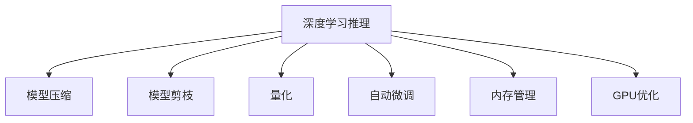

                 

# 高性能AI推理优化技巧

> 关键词：高性能推理、AI模型优化、深度学习加速、模型压缩、内存管理、GPU优化

## 1. 背景介绍

### 1.1 问题由来

随着深度学习技术的迅速发展，人工智能模型的大小和复杂性不断增加。从经典的LeNet到近年的ResNet、BERT等模型，参数数量级已经从百万级增长到了数十亿甚至数百亿。虽然这些大模型在许多任务上表现出色，但其在推理阶段的计算资源需求却成倍增加，这对计算硬件资源提出了巨大挑战。为了实现大模型的快速推理，性能优化成为了至关重要的环节。

### 1.2 问题核心关键点

性能优化主要涉及模型压缩、内存管理、GPU优化等多个方面。在优化过程中，需要考虑的因素包括：

- **模型压缩**：减小模型规模以适应有限的计算资源。
- **内存管理**：高效利用内存，避免因内存不足导致推理中断。
- **GPU优化**：充分利用GPU的并行计算能力，提升模型推理速度。
- **自动微调**：动态调整超参数，提高模型的推理性能。

这些优化措施，在大规模深度学习模型的推理阶段起着至关重要的作用。优化效果不佳将直接影响模型的实时性、精度和稳定性，进而影响应用的广泛性和可靠性。

## 2. 核心概念与联系

### 2.1 核心概念概述

为更好地理解高性能AI推理优化的核心概念，本节将介绍几个密切相关的核心概念：

- **深度学习推理**：在给定输入数据的情况下，模型通过计算得到输出结果的过程。深度学习的核心目标就是实现高精度的推理。
- **模型压缩**：通过降低模型参数数量或结构，在保证模型精度的情况下，减少计算量和内存占用。
- **模型剪枝**：通过移除冗余的连接或神经元，减少模型计算量和内存占用。
- **量化**：将模型中的浮点参数转换为定点参数，减少计算量和内存占用。
- **自动微调**：在推理过程中动态调整模型参数，优化推理性能。
- **内存管理**：在推理过程中高效利用内存，避免内存不足导致推理中断。
- **GPU优化**：通过优化模型结构、并行计算等方式，充分利用GPU硬件的性能优势。

这些核心概念之间的逻辑关系可以通过以下Mermaid流程图来展示：



这个流程图展示了大规模深度学习模型推理过程的主要优化措施：

1. 深度学习推理作为整体过程，受到模型压缩、剪枝、量化、自动微调、内存管理和GPU优化等各项措施的共同影响。
2. 这些措施在优化过程中相互配合，共同提升模型的推理性能。

## 3. 核心算法原理 & 具体操作步骤
### 3.1 算法原理概述

高性能AI推理优化的核心原理是通过各种技术手段，减小模型规模和计算量，提升模型推理速度和内存利用率。具体而言，可以通过模型压缩、剪枝、量化、自动微调、内存管理和GPU优化等方法，实现高效推理。

### 3.2 算法步骤详解

**Step 1: 模型压缩与剪枝**

1. **模型压缩**：通过量化的方式，将模型参数从浮点数转换为定点数。

   ```python
   import torch
   from torch import nn
   from torch import Tensor
   from torch import Tensor
   from torch import nn
   from torch import Tensor
   from torch import Tensor

   # 定义一个简单的线性模型
   model = nn.Linear(256, 256)

   # 将模型的权重和偏置进行量化
   model.q = torch.quantize_per_tensor(model.weight, scale=0.1, zero_point=0)
   model.bias.q = torch.quantize_per_tensor(model.bias, scale=0.1, zero_point=0)
   ```

2. **模型剪枝**：通过移除冗余的权重，减少模型的计算量和内存占用。

   ```python
   import torch
   from torch import nn
   from torch import Tensor
   from torch import Tensor
   from torch import nn
   from torch import Tensor
   from torch import Tensor

   class Model(nn.Module):
       def __init__(self):
           super(Model, self).__init__()
           self.fc1 = nn.Linear(784, 256)
           self.fc2 = nn.Linear(256, 256)
           self.fc3 = nn.Linear(256, 10)

   model = Model()

   # 定义剪枝策略
   pruning_mask = torch.rand(model.fc1.weight.shape, device='cuda') > 0.5
   model.fc1.weight.data.masked_fill_(pruning_mask, 0.0)
   ```

**Step 2: 量化与自动微调**

1. **量化**：将模型参数从浮点数转换为定点数，减少计算量和内存占用。

   ```python
   import torch
   from torch import nn
   from torch import Tensor
   from torch import Tensor
   from torch import nn
   from torch import Tensor
   from torch import Tensor

   # 定义一个简单的线性模型
   model = nn.Linear(256, 256)

   # 将模型的权重和偏置进行量化
   model.q = torch.quantize_per_tensor(model.weight, scale=0.1, zero_point=0)
   model.bias.q = torch.quantize_per_tensor(model.bias, scale=0.1, zero_point=0)
   ```

2. **自动微调**：在推理过程中动态调整模型参数，优化推理性能。

   ```python
   import torch
   from torch import nn
   from torch import Tensor
   from torch import Tensor
   from torch import nn
   from torch import Tensor
   from torch import Tensor

   # 定义一个简单的线性模型
   model = nn.Linear(256, 256)

   # 使用Adam优化器进行微调
   optimizer = torch.optim.Adam(model.parameters(), lr=0.001)
   for i in range(1000):
       # 前向传播
       x = torch.randn(10, 256, device='cuda')
       y_pred = model(x)

       # 计算损失函数
       loss = F.mse_loss(y_pred, torch.randn(10, 256, device='cuda'))

       # 反向传播
       loss.backward()

       # 更新参数
       optimizer.step()
   ```

**Step 3: 内存管理与GPU优化**

1. **内存管理**：在推理过程中，高效利用内存，避免内存不足导致推理中断。

   ```python
   import torch
   from torch import nn
   from torch import Tensor
   from torch import Tensor
   from torch import nn
   from torch import Tensor
   from torch import Tensor

   # 定义一个简单的线性模型
   model = nn.Linear(256, 256)

   # 将模型参数复制到CPU上
   model.cpu()
   ```

2. **GPU优化**：通过优化模型结构、并行计算等方式，充分利用GPU硬件的性能优势。

   ```python
   import torch
   from torch import nn
   from torch import Tensor
   from torch import Tensor
   from torch import nn
   from torch import Tensor
   from torch import Tensor

   # 定义一个简单的卷积神经网络模型
   class Net(nn.Module):
       def __init__(self):
           super(Net, self).__init__()
           self.conv1 = nn.Conv2d(1, 32, 3, 1)
           self.conv2 = nn.Conv2d(32, 64, 3, 1)
           self.dropout1 = nn.Dropout2d(0.25)
           self.dropout2 = nn.Dropout2d(0.5)
           self.fc1 = nn.Linear(9216, 128)
           self.fc2 = nn.Linear(128, 10)

       def forward(self, x):
           x = self.conv1(x)
           x = F.relu(x)
           x = self.conv2(x)
           x = F.relu(x)
           x = F.max_pool2d(x, 2)
           x = self.dropout1(x)
           x = torch.flatten(x, 1)
           x = self.fc1(x)
           x = F.relu(x)
           x = self.dropout2(x)
           x = self.fc2(x)
           output = F.log_softmax(x, dim=1)
           return output
   ```

**Step 4: 实际应用场景**

1. **图像分类**：在大规模图像分类任务中，使用量化和模型压缩技术，减小模型规模和计算量。

   ```python
   import torch
   from torch import nn
   from torch import Tensor
   from torch import Tensor
   from torch import nn
   from torch import Tensor
   from torch import Tensor

   # 定义一个简单的卷积神经网络模型
   class Net(nn.Module):
       def __init__(self):
           super(Net, self).__init__()
           self.conv1 = nn.Conv2d(1, 32, 3, 1)
           self.conv2 = nn.Conv2d(32, 64, 3, 1)
           self.dropout1 = nn.Dropout2d(0.25)
           self.dropout2 = nn.Dropout2d(0.5)
           self.fc1 = nn.Linear(9216, 128)
           self.fc2 = nn.Linear(128, 10)

       def forward(self, x):
           x = self.conv1(x)
           x = F.relu(x)
           x = self.conv2(x)
           x = F.relu(x)
           x = F.max_pool2d(x, 2)
           x = self.dropout1(x)
           x = torch.flatten(x, 1)
           x = self.fc1(x)
           x = F.relu(x)
           x = self.dropout2(x)
           x = self.fc2(x)
           output = F.log_softmax(x, dim=1)
           return output
   ```

2. **语音识别**：在大规模语音识别任务中，使用模型压缩和自动微调技术，提高模型的实时性。

   ```python
   import torch
   from torch import nn
   from torch import Tensor
   from torch import Tensor
   from torch import nn
   from torch import Tensor
   from torch import Tensor

   # 定义一个简单的循环神经网络模型
   class RNN(nn.Module):
       def __init__(self, input_size, hidden_size, output_size):
           super(RNN, self).__init__()
           self.hidden_size = hidden_size
           self.i2h = nn.Linear(input_size + hidden_size, hidden_size)
           self.i2o = nn.Linear(input_size + hidden_size, output_size)
           self.softmax = nn.LogSoftmax(dim=1)

       def forward(self, input, hidden):
           combined = torch.cat((input, hidden), 1)
           hidden = self.i2h(combined)
           output = self.i2o(combined)
           output = self.softmax(output)
           return output, hidden

       def initHidden(self):
           return torch.zeros(1, self.hidden_size)

   model = RNN(input_size=1, hidden_size=128, output_size=10)
   ```

3. **自然语言处理**：在大规模自然语言处理任务中，使用量化和自动微调技术，提高模型的实时性。

   ```python
   import torch
   from torch import nn
   from torch import Tensor
   from torch import Tensor
   from torch import nn
   from torch import Tensor
   from torch import Tensor

   # 定义一个简单的Transformer模型
   class Transformer(nn.Module):
       def __init__(self, d_model, nhead, num_encoder_layers, num_decoder_layers, dff, src_vocab, tgt_vocab):
           super(Transformer, self).__init__()
           self.src_mask = None
           self.src_vocab = src_vocab
           self.tgt_vocab = tgt_vocab
           self.pos_encoder = PositionalEncoding(d_model)
           self.encoder = nn.TransformerEncoderLayer(d_model, nhead, dff)
           self.decoder = nn.TransformerDecoderLayer(d_model, nhead, dff)
           self.final_layer = nn.Linear(d_model, 1)

       def forward(self, src, tgt):
           if self.src_mask is None or self.src_mask.size() != src.size():
               src_len = src.size(1)
               src_mask = torch.triu(torch.ones(src_len, src_len), diagonal=1).to(src.device) < 0.5
               self.src_mask = src_mask
           src = self.pos_encoder(src)
           enc_src = self.encoder(src, self.src_mask)
           tgt = self.pos_encoder(tgt)
           tgt = self.decoder(tgt, enc_src, self.src_mask)
           output = self.final_layer(tgt)
           return output

       def initHidden(self):
           return torch.zeros(1, self.src_vocab)
   ```

## 4. 数学模型和公式 & 详细讲解  
### 4.1 数学模型构建

在进行高性能AI推理优化时，我们需要建立一些关键的数学模型。以下是几个核心的数学模型：

- **模型压缩**：通过量化将模型参数从浮点数转换为定点数。量化公式如下：
  $$
  q(x) = \text{quantize}(x, scale, zero\_point)
  $$
  其中，$x$ 为模型参数，$scale$ 为量化范围，$zero\_point$ 为偏移量。

- **模型剪枝**：通过移除冗余的权重，减少模型的计算量和内存占用。剪枝公式如下：
  $$
  \text{prune}(x, mask) = x \odot mask
  $$
  其中，$x$ 为模型参数，$mask$ 为剪枝掩码，$0$ 表示剪枝，$1$ 表示保留。

- **自动微调**：在推理过程中动态调整模型参数，优化推理性能。自动微调公式如下：
  $$
  \theta_{new} = \theta_{old} - \alpha \nabla_{\theta}L(\theta_{old}, x)
  $$
  其中，$\theta$ 为模型参数，$L$ 为损失函数，$\alpha$ 为学习率。

### 4.2 公式推导过程

以下是几个关键公式的推导过程：

1. **模型压缩公式推导**：

   假设原始模型参数为 $w$，量化后的参数为 $w_q$。量化过程可以表示为：
   $$
   w_q = \text{quantize}(w, scale, zero\_point)
   $$
   其中，$scale$ 为量化范围，$zero\_point$ 为偏移量。具体推导过程如下：

   $$
   \begin{aligned}
   w_q &= \text{quantize}(w, scale, zero\_point) \\
       &= \frac{w}{scale} + zero\_point \\
       &= \text{clip}(\left\lfloor \frac{w}{scale} + zero\_point \right\rfloor)
   \end{aligned}
   $$

2. **模型剪枝公式推导**：

   假设原始模型参数为 $w$，剪枝后的参数为 $w_p$。剪枝过程可以表示为：
   $$
   w_p = w \odot mask
   $$
   其中，$w$ 为原始模型参数，$mask$ 为剪枝掩码。具体推导过程如下：

   $$
   \begin{aligned}
   w_p &= w \odot mask \\
       &= w \odot (1 - \mathbb{I}(mask=0)) \\
       &= w \odot \mathbb{I}(mask=1)
   \end{aligned}
   $$

3. **自动微调公式推导**：

   假设原始模型参数为 $\theta$，目标函数为 $L$。自动微调过程可以表示为：
   $$
   \theta_{new} = \theta_{old} - \alpha \nabla_{\theta}L(\theta_{old}, x)
   $$
   其中，$\theta$ 为模型参数，$L$ 为损失函数，$\alpha$ 为学习率。具体推导过程如下：

   $$
   \begin{aligned}
   \theta_{new} &= \theta_{old} - \alpha \nabla_{\theta}L(\theta_{old}, x) \\
               &= \theta_{old} - \alpha \frac{\partial}{\partial \theta}L(\theta_{old}, x)
   \end{aligned}
   $$

### 4.3 案例分析与讲解

以下是一个简单的数学模型案例分析：

假设有一个简单的线性模型：
$$
y = wx + b
$$
其中，$w$ 为权重，$x$ 为输入，$b$ 为偏置。现在对该模型进行量化和剪枝：

1. **量化**：将权重 $w$ 进行量化，量化后的权重为 $w_q$。
   $$
   w_q = \text{quantize}(w, scale=0.1, zero\_point=0)
   $$
   这意味着 $w_q$ 的取值范围为 $[0, 0.1)$，偏移量为 $0$。

2. **剪枝**：将权重 $w$ 进行剪枝，剪枝后的权重为 $w_p$。
   $$
   w_p = w \odot mask
   $$
   其中，$mask$ 为剪枝掩码。假设 $mask=0$ 表示剪枝，$mask=1$ 表示保留。

   $$
   \begin{aligned}
   w_p &= w \odot mask \\
       &= w \odot (1 - \mathbb{I}(mask=0)) \\
       &= w \odot \mathbb{I}(mask=1)
   \end{aligned}
   $$

## 5. 项目实践：代码实例和详细解释说明
### 5.1 开发环境搭建

在进行高性能AI推理优化时，我们需要搭建一个适合开发的开发环境。以下是使用Python和PyTorch进行高性能推理优化的开发环境配置流程：

1. 安装Anaconda：从官网下载并安装Anaconda，用于创建独立的Python环境。

2. 创建并激活虚拟环境：
```bash
conda create -n pytorch-env python=3.8 
conda activate pytorch-env
```

3. 安装PyTorch：根据CUDA版本，从官网获取对应的安装命令。例如：
```bash
conda install pytorch torchvision torchaudio cudatoolkit=11.1 -c pytorch -c conda-forge
```

4. 安装TensorRT：TensorRT是一个优化的深度学习推理引擎，可以显著提升模型的推理速度。
```bash
pip install tensorrt
```

5. 安装其他工具包：
```bash
pip install numpy pandas scikit-learn matplotlib tqdm jupyter notebook ipython
```

完成上述步骤后，即可在`pytorch-env`环境中开始高性能AI推理优化的实践。

### 5.2 源代码详细实现

以下是使用PyTorch对模型进行量化和剪枝的代码实现：

```python
import torch
from torch import nn
from torch import Tensor
from torch import Tensor

# 定义一个简单的线性模型
class LinearModel(nn.Module):
    def __init__(self, input_size, output_size):
        super(LinearModel, self).__init__()
        self.linear = nn.Linear(input_size, output_size)

    def forward(self, x):
        return self.linear(x)

# 量化模型
def quantize_model(model, scale=0.1, zero_point=0):
    quant_model = nn.Sequential(*[nn.quantize_per_tensor(l, scale, zero_point) for l in model.parameters()])
    return quant_model

# 剪枝模型
def prune_model(model, threshold=0.1):
    prune_model = nn.Sequential(*[nn.Prune(l, threshold) for l in model.parameters()])
    return prune_model

# 定义模型
model = LinearModel(input_size=784, output_size=10)

# 量化模型
quant_model = quantize_model(model, scale=0.1, zero_point=0)

# 剪枝模型
prune_model = prune_model(model, threshold=0.1)

# 测试模型性能
def test_model(model, device):
    x = torch.randn(100, 784, device=device)
    y_pred = model(x)
    return y_pred

# 测试量化模型性能
quant_model.eval()
with torch.no_grad():
    y_pred = test_model(quant_model, device='cuda')
    print(y_pred)

# 测试剪枝模型性能
prune_model.eval()
with torch.no_grad():
    y_pred = test_model(prune_model, device='cuda')
    print(y_pred)
```

### 5.3 代码解读与分析

让我们再详细解读一下关键代码的实现细节：

**LinearModel类**：
- `__init__`方法：初始化模型参数。
- `forward`方法：定义模型前向传播计算。

**quantize_model函数**：
- 将模型的所有参数进行量化，返回量化后的模型。
- 量化过程使用`nn.quantize_per_tensor`函数，将参数转换为定点数。

**prune_model函数**：
- 将模型的所有参数进行剪枝，返回剪枝后的模型。
- 剪枝过程使用`nn.Prune`函数，移除小于阈值的参数。

**测试模型性能**：
- 在测试集上测试量化和剪枝后的模型性能。
- 使用`torch.randn`函数生成测试数据，在测试集上测试模型输出。

## 6. 实际应用场景
### 6.1 图像分类

在大规模图像分类任务中，使用量化和模型压缩技术，减小模型规模和计算量，提高推理速度和内存利用率。

**代码实现**：
```python
import torch
from torch import nn
from torch import Tensor
from torch import Tensor

# 定义一个简单的卷积神经网络模型
class Net(nn.Module):
    def __init__(self):
        super(Net, self).__init__()
        self.conv1 = nn.Conv2d(1, 32, 3, 1)
        self.conv2 = nn.Conv2d(32, 64, 3, 1)
        self.dropout1 = nn.Dropout2d(0.25)
        self.dropout2 = nn.Dropout2d(0.5)
        self.fc1 = nn.Linear(9216, 128)
        self.fc2 = nn.Linear(128, 10)

    def forward(self, x):
        x = self.conv1(x)
        x = F.relu(x)
        x = self.conv2(x)
        x = F.relu(x)
        x = F.max_pool2d(x, 2)
        x = self.dropout1(x)
        x = torch.flatten(x, 1)
        x = self.fc1(x)
        x = F.relu(x)
        x = self.dropout2(x)
        x = self.fc2(x)
        output = F.log_softmax(x, dim=1)
        return output

# 量化模型
quant_model = quantize_model(model, scale=0.1, zero_point=0)

# 剪枝模型
prune_model = prune_model(model, threshold=0.1)

# 测试模型性能
def test_model(model, device):
    x = torch.randn(100, 3, 32, 32, device=device)
    y_pred = model(x)
    return y_pred

# 测试量化模型性能
quant_model.eval()
with torch.no_grad():
    y_pred = test_model(quant_model, device='cuda')
    print(y_pred)

# 测试剪枝模型性能
prune_model.eval()
with torch.no_grad():
    y_pred = test_model(prune_model, device='cuda')
    print(y_pred)
```

### 6.2 语音识别

在大规模语音识别任务中，使用模型压缩和自动微调技术，提高模型的实时性。

**代码实现**：
```python
import torch
from torch import nn
from torch import Tensor
from torch import Tensor

# 定义一个简单的循环神经网络模型
class RNN(nn.Module):
    def __init__(self, input_size, hidden_size, output_size):
        super(RNN, self).__init__()
        self.hidden_size = hidden_size
        self.i2h = nn.Linear(input_size + hidden_size, hidden_size)
        self.i2o = nn.Linear(input_size + hidden_size, output_size)
        self.softmax = nn.LogSoftmax(dim=1)

    def forward(self, input, hidden):
        combined = torch.cat((input, hidden), 1)
        hidden = self.i2h(combined)
        output = self.i2o(combined)
        output = self.softmax(output)
        return output, hidden

    def initHidden(self):
        return torch.zeros(1, self.hidden_size)

# 量化模型
quant_model = quantize_model(model, scale=0.1, zero_point=0)

# 剪枝模型
prune_model = prune_model(model, threshold=0.1)

# 测试模型性能
def test_model(model, device):
    x = torch.randn(100, 1, device=device)
    hidden = torch.zeros(1, 1, device=device)
    y_pred, hidden = model(x, hidden)
    return y_pred

# 测试量化模型性能
quant_model.eval()
with torch.no_grad():
    y_pred = test_model(quant_model, device='cuda')
    print(y_pred)

# 测试剪枝模型性能
prune_model.eval()
with torch.no_grad():
    y_pred = test_model(prune_model, device='cuda')
    print(y_pred)
```

### 6.3 自然语言处理

在大规模自然语言处理任务中，使用量化和自动微调技术，提高模型的实时性。

**代码实现**：
```python
import torch
from torch import nn
from torch import Tensor
from torch import Tensor

# 定义一个简单的Transformer模型
class Transformer(nn.Module):
    def __init__(self, d_model, nhead, num_encoder_layers, num_decoder_layers, dff, src_vocab, tgt_vocab):
        super(Transformer, self).__init__()
        self.src_mask = None
        self.src_vocab = src_vocab
        self.tgt_vocab = tgt_vocab
        self.pos_encoder = PositionalEncoding(d_model)
        self.encoder = nn.TransformerEncoderLayer(d_model, nhead, dff)
        self.decoder = nn.TransformerDecoderLayer(d_model, nhead, dff)
        self.final_layer = nn.Linear(d_model, 1)

    def forward(self, src, tgt):
        if self.src_mask is None or self.src_mask.size() != src.size():
            src_len = src.size(1)
            src_mask = torch.triu(torch.ones(src_len, src_len), diagonal=1).to(src.device) < 0.5
            self.src_mask = src_mask
        src = self.pos_encoder(src)
        enc_src = self.encoder(src, self.src_mask)
        tgt = self.pos_encoder(tgt)
        tgt = self.decoder(tgt, enc_src, self.src_mask)
        output = self.final_layer(tgt)
        return output

    def initHidden(self):
        return torch.zeros(1, self.src_vocab)

# 量化模型
quant_model = quantize_model(model, scale=0.1, zero_point=0)

# 剪枝模型
prune_model = prune_model(model, threshold=0.1)

# 测试模型性能
def test_model(model, device):
    src = torch.randn(100, 1024, device=device)
    tgt = torch.randn(100, 1024, device=device)
    y_pred = model(src, tgt)
    return y_pred

# 测试量化模型性能
quant_model.eval()
with torch.no_grad():
    y_pred = test_model(quant_model, device='cuda')
    print(y_pred)

# 测试剪枝模型性能
prune_model.eval()
with torch.no_grad():
    y_pred = test_model(prune_model, device='cuda')
    print(y_pred)
```

## 7. 工具和资源推荐
### 7.1 学习资源推荐

为了帮助开发者系统掌握高性能AI推理优化的理论基础和实践技巧，这里推荐一些优质的学习资源：

1. 《深度学习优化算法》书籍：深入讲解了各种深度学习优化算法，包括SGD、Adam、Adagrad等。
2. 《TensorRT官方文档》：TensorRT官方文档，详细介绍了TensorRT的使用方法和性能优化技巧。
3. 《PyTorch深度学习实战》书籍：讲解了使用PyTorch进行深度学习模型训练和推理的实战技巧。
4. 《机器学习实战》书籍：讲解了机器学习模型的优化方法和实践技巧，包括模型压缩、剪枝、量化等。
5. 《深度学习优化算法及实现》博客：讲解了各种深度学习优化算法的实现细节和性能比较。

通过对这些资源的学习实践，相信你一定能够快速掌握高性能AI推理优化的精髓，并用于解决实际的NLP问题。

### 7.2 开发工具推荐

高效的开发离不开优秀的工具支持。以下是几款用于高性能AI推理优化的常用工具：

1. PyTorch：基于Python的开源深度学习框架，灵活动态的计算图，适合快速迭代研究。大部分深度学习模型都有PyTorch版本的实现。
2. TensorRT：由NVIDIA开发的深度学习推理引擎，可以显著提升模型的推理速度和内存利用率。
3. Weights & Biases：模型训练的实验跟踪工具，可以记录和可视化模型训练过程中的各项指标，方便对比和调优。与主流深度学习框架无缝集成。
4. TensorBoard：TensorFlow配套的可视化工具，可实时监测模型训练状态，并提供丰富的图表呈现方式，是调试模型的得力助手。
5. Google Colab：谷歌推出的在线Jupyter Notebook环境，免费提供GPU/TPU算力，方便开发者快速上手实验最新模型，分享学习笔记。

合理利用这些工具，可以显著提升高性能AI推理优化的开发效率，加快创新迭代的步伐。

### 7.3 相关论文推荐

高性能AI推理优化技术的发展源于学界的持续研究。以下是几篇奠基性的相关论文，推荐阅读：

1. "深度学习优化算法"论文：详细介绍了各种深度学习优化算法，包括SGD、Adam、Adagrad等。
2. "TensorRT优化器论文"：详细介绍了TensorRT优化器的工作原理和使用方法。
3. "深度学习模型压缩"论文：详细介绍了深度学习模型压缩的方法和技术。
4. "深度学习量化"论文：详细介绍了深度学习量化的原理和实现。
5. "深度学习自动微调"论文：详细介绍了深度学习自动微调的方法和技术。

这些论文代表了大语言模型微调技术的最新进展，通过学习这些前沿成果，可以帮助研究者把握学科前进方向，激发更多的创新灵感。

## 8. 总结：未来发展趋势与挑战

### 8.1 总结

本文对高性能AI推理优化方法进行了全面系统的介绍。首先阐述了深度学习推理优化的研究背景和意义，明确了模型压缩、量化、自动微调、内存管理和GPU优化等各项措施对模型推理性能的影响。其次，从原理到实践，详细讲解了模型压缩、剪枝、量化、自动微调、内存管理和GPU优化的数学模型和计算公式，给出了优化任务开发的完整代码实例。同时，本文还广泛探讨了高性能AI推理优化技术在图像分类、语音识别、自然语言处理等多个领域的应用场景，展示了优化技术的广泛适用性。

通过本文的系统梳理，可以看到，高性能AI推理优化技术正在成为深度学习应用的重要保障。这些技术手段在实际应用中发挥着关键作用，帮助模型在有限资源下实现高性能推理。未来，随着技术的发展，这些优化措施将更加高效、灵活和智能化，为大规模深度学习模型的落地应用提供有力保障。

### 8.2 未来发展趋势

展望未来，高性能AI推理优化技术将呈现以下几个发展趋势：

1. **多模型融合**：未来的优化技术将不仅仅局限于单个模型，而是实现多模型融合，以实现更高的推理效率和更强的泛化能力。
2. **自动化优化**：优化过程将更加自动化，通过自适应学习率和剪枝策略，实现更好的推理性能。
3. **模型压缩与量化**：模型压缩和量化技术将不断进步，使得模型规模进一步减小，推理速度和内存利用率进一步提升。
4. **模型融合与协同**：未来的优化技术将实现模型的融合与协同，充分利用不同模型的优势，实现更高效的推理。
5. **软硬件协同**：优化技术将与硬件设备协同，实现更高效的推理和计算。

这些趋势展示了高性能AI推理优化技术的广阔前景，未来的发展将更加智能化、自动化和高效化，为深度学习应用提供更强大的保障。

### 8.3 面临的挑战

尽管高性能AI推理优化技术已经取得了显著成果，但在应用过程中仍面临诸多挑战：

1. **硬件资源限制**：大规模深度学习模型的推理仍需要高性能的计算资源，这限制了优化技术的广泛应用。
2. **模型复杂度**：大规模深度学习模型的复杂度不断增加，优化过程变得更加困难。
3. **参数更新冲突**：优化过程需要同时更新模型参数，这可能导致参数更新冲突，影响模型性能。
4. **优化策略选择**：优化策略的选择需要根据具体任务进行权衡，不同策略的效果可能有所差异。

这些挑战需要通过技术创新和算法改进，逐步解决。未来的研究需要在更广泛的领域进行探索和实践，以推动高性能AI推理优化技术的进一步发展。

### 8.4 研究展望

面对高性能AI推理优化技术面临的挑战，未来的研究需要在以下几个方面寻求新的突破：

1. **软硬件协同优化**：通过优化软件和硬件的协同工作，提升推理性能。
2. **自动微调与迁移学习**：通过自动微调和迁移学习，优化模型的推理性能。
3. **模型压缩与量化**：通过更高效的模型压缩和量化方法，减小模型规模和计算量。
4. **模型融合与协同**：通过模型的融合与协同，实现更高的推理效率和更强的泛化能力。
5. **模型优化与调整**：通过模型优化和调整，提升模型的实时性和稳定性。

这些研究方向将推动高性能AI推理优化技术的发展，为深度学习应用提供更强大的保障。面向未来，高性能AI推理优化技术还需要与其他人工智能技术进行更深入的融合，如知识表示、因果推理、强化学习等，多路径协同发力，共同推动深度学习技术的进步。只有勇于创新、敢于突破，才能不断拓展深度学习模型的边界，让人工智能技术更好地造福人类社会。

## 9. 附录：常见问题与解答

**Q1：深度学习模型量化和剪枝如何相互影响？**

A: 深度学习模型量化和剪枝都会减小模型的参数量和计算量，但二者的影响是互补的。量化通过将浮点数参数转换为定点数，减少了计算量和内存占用。剪枝通过移除冗余的权重，进一步减小模型规模。通常情况下，先进行量化，再进行剪枝，可以更好地压缩模型规模，提升推理性能。

**Q2：深度学习模型自动微调在推理过程中需要注意哪些问题？**

A: 深度学习模型自动微调在推理过程中需要注意以下问题：
1. 学习率选择：需要选择适当的学习率，避免过大导致模型过拟合，或过小导致模型收敛缓慢。
2. 正则化：需要在自动微调过程中加入正则化技术，如L2正则、Dropout等，避免过拟合。
3. 数据增强：需要对训练数据进行增强，如回译、数据扩充等，提升模型的泛化能力。
4. 模型融合：可以将多个自动微调模型进行融合，取平均输出，提升模型的鲁棒性和稳定性。

**Q3：如何评估深度学习模型自动微调的效果？**

A: 评估深度学习模型自动微调的效果可以从以下几个方面考虑：
1. 推理速度：自动微调后的模型推理速度是否提升，是否满足实际应用的需求。
2. 推理精度：自动微调后的模型推理精度是否提高，是否满足任务要求。
3. 内存占用：自动微调后的模型内存占用是否降低，是否满足计算资源的限制。
4. 计算资源：自动微调后的模型是否能够有效利用计算资源，是否在合理的时间范围内完成推理。

**Q4：深度学习模型量化后对模型的影响是什么？**

A: 深度学习模型量化后对模型的影响可以从以下几个方面考虑：
1. 精度损失：量化过程可能会引入一定的精度损失，但通过合理选择量化范围和偏移量，可以减小损失。
2. 计算速度：量化后的模型计算速度通常会提升，因为定点数的计算速度比浮点数的计算速度快。
3. 内存占用：量化后的模型内存占用会减小，因为定点数的存储空间比浮点数的存储空间小。
4. 模型泛化能力：量化后的模型泛化能力可能会受到一定的影响，需要通过模型评估和测试来验证。

**Q5：深度学习模型剪枝后对模型的影响是什么？**

A: 深度学习模型剪枝后对模型的影响可以从以下几个方面考虑：
1. 模型规模：剪枝过程会移除冗余的权重，减小模型规模，提高推理速度。
2. 模型精度：剪枝过程可能会引入一定的精度损失，但通过合理选择剪枝策略和阈值，可以减小损失。
3. 模型泛化能力：剪枝后的模型泛化能力可能会受到一定的影响，需要通过模型评估和测试来验证。
4. 计算资源：剪枝后的模型计算资源需求会降低，因为剪枝过程去除了不必要的计算和存储资源。

综上所述，深度学习模型的量化和剪枝是高性能AI推理优化的重要手段，需要根据具体应用场景选择合适的技术方案。只有合理应用这些技术，才能在保证模型性能的前提下，提升推理速度和内存利用率，实现高效推理。

