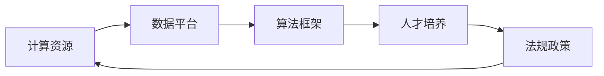

                 

# AI 2.0 基础设施建设：投资和政策支持

> 关键词：AI 2.0, 基础设施建设, 投资政策, 技术支持, 可持续发展, 智能城市, 大数据中心, 隐私保护, 研发基金

## 1. 背景介绍

在人工智能（AI）蓬勃发展的今天，AI 2.0 时代的到来标志着一个更加智能化、高效化和个性化的人类社会。AI 2.0 不仅在科学研究、工业生产、医疗健康等众多领域展现出卓越的潜力，还正在逐步渗透到人类生活的方方面面。然而，AI 2.0 的广泛应用需要坚实的技术基础和完备的生态系统。本文将深入探讨 AI 2.0 基础设施建设的重要性，以及投资和政策在这一过程中的关键作用。

### 1.1 什么是 AI 2.0

AI 1.0 是指早期基于规则和逻辑程序的符号主义人工智能，而 AI 2.0 则是指基于数据和统计学习的符号主义和连接主义相结合的深度学习技术。AI 2.0 强调数据的有效利用，能够通过学习巨大的数据集实现高级推理、自然语言处理和视觉识别等复杂任务，推动人工智能技术的全面发展。

### 1.2 为什么基础设施建设至关重要

AI 2.0 的巨大潜力依赖于大规模数据、强大计算能力和先进的算法。然而，这些资源的有效整合和使用需要坚固的基础设施支持。基础设施建设不仅能保障 AI 2.0 技术的平稳运行，还能为 AI 2.0 生态系统提供坚实基础。

## 2. 核心概念与联系

### 2.1 核心概念概述

AI 2.0 基础设施建设涉及多方面的内容，包括计算资源、数据平台、算法框架、人才培养和法规政策等。这些关键组件之间的相互作用和联系构成了 AI 2.0 基础设施的全貌。

- **计算资源**：AI 2.0 需要高效的计算平台，包括高性能计算集群、云计算服务和边缘计算设备。这些平台提供强大的计算能力和高效的存储管理，支持大规模数据分析和复杂模型的训练。

- **数据平台**：数据是 AI 2.0 的核心资产。数据平台提供数据收集、存储、清洗、标注和管理功能，确保数据的质量和一致性。

- **算法框架**：算法框架如 TensorFlow、PyTorch 等提供高效的工具和库，支持深度学习模型的构建、训练和部署。

- **人才培养**：AI 2.0 的发展需要大量具备数据科学、机器学习和软件工程技能的人才。

- **法规政策**：法律法规和政策指导 AI 2.0 技术的健康发展，保障数据隐私和安全，促进公平性和透明度。

### 2.2 核心概念间的联系

这些核心概念通过网络连接和相互作用，形成一个完整的 AI 2.0 基础设施生态系统。计算资源和数据平台为 AI 2.0 算法框架提供了必要的基础设施支撑；人才培养确保了技术团队的能力和创新；法规政策则保障了基础设施的健康运行和社会接受度。

以下 Mermaid 流程图展示了 AI 2.0 基础设施中各核心概念之间的联系：



## 3. 核心算法原理 & 具体操作步骤

### 3.1 算法原理概述

AI 2.0 基础设施建设的核心算法原理包括分布式计算、大数据处理、模型优化和隐私保护等。这些算法在基础设施建设中起着至关重要的作用，确保了 AI 2.0 技术的有效运行和持续发展。

- **分布式计算**：通过并行计算和数据并行技术，将大规模计算任务分解为多个子任务，并在多个计算节点上并行执行，提高计算效率。

- **大数据处理**：利用 Hadoop、Spark 等技术进行大数据的分布式处理和分析，确保海量数据的有效管理和利用。

- **模型优化**：通过模型压缩、量化和剪枝等技术，优化 AI 2.0 模型的计算量和存储需求，提高模型效率和可扩展性。

- **隐私保护**：采用差分隐私、联邦学习和匿名化等技术，确保数据在使用过程中的隐私和安全。

### 3.2 算法步骤详解

AI 2.0 基础设施建设的具体操作步骤可以分为以下五个步骤：

1. **基础设施规划**：根据 AI 2.0 的应用需求，规划计算资源、数据平台和法规政策等基础设施的构建方案。
   
2. **基础设施部署**：按照规划方案，部署高性能计算集群、数据平台和算法框架等基础设施，确保其稳定运行。

3. **数据管理与清洗**：收集、清洗、标注和管理数据，确保数据的质量和一致性。

4. **模型开发与优化**：利用算法框架开发 AI 2.0 模型，并进行优化和训练，提高模型性能和可扩展性。

5. **安全与合规**：制定数据隐私和安全策略，确保基础设施的合规性和安全性。

### 3.3 算法优缺点

AI 2.0 基础设施建设的优点包括：

- **高效性**：分布式计算和大数据处理技术能够快速处理海量数据和复杂任务，提高 AI 2.0 系统的运行效率。

- **可扩展性**：基于云计算的资源池化方式可以灵活扩展计算资源，适应不同规模和需求的应用场景。

- **灵活性**：算法框架和人才培养提供灵活的技术支持，促进 AI 2.0 技术的多样化和创新。

缺点包括：

- **成本高**：基础设施的建设需要大量的资金投入，尤其是高性能计算资源和数据平台的部署。

- **技术复杂**：涉及的算法和技术复杂多样，需要专业的技术团队进行管理和维护。

- **隐私风险**：数据的使用和存储过程中存在隐私泄露的风险，需要严格的隐私保护措施。

### 3.4 算法应用领域

AI 2.0 基础设施建设的应用领域广泛，涵盖科学研究、工业制造、医疗健康、金融服务、智慧城市和智能交通等多个领域。具体应用场景包括：

- **科学研究**：利用高性能计算和数据平台进行大规模科学计算和数据分析，推动前沿科学的发展。

- **工业制造**：通过工业物联网（IIoT）和智能制造系统，提高生产效率和质量。

- **医疗健康**：利用 AI 2.0 技术进行疾病诊断、个性化治疗和健康监测。

- **金融服务**：通过 AI 2.0 技术进行风险评估、智能投顾和金融预测。

- **智慧城市**：构建智能交通、智能安防和智能治理系统，提升城市管理和居民生活质量。

## 4. 数学模型和公式 & 详细讲解 & 举例说明

### 4.1 数学模型构建

AI 2.0 基础设施建设中的数学模型构建主要涉及分布式计算、大数据处理和模型优化等。以下公式展示了这些模型的基本框架：

1. **分布式计算模型**：

$$
S = \sum_{i=1}^n \frac{W_i}{P_i} \times T_i
$$

其中，$S$ 为分布式计算的总时间，$W_i$ 为第 $i$ 个计算节点的计算权重，$P_i$ 为第 $i$ 个计算节点的处理能力，$T_i$ 为第 $i$ 个计算节点处理任务的时间。

2. **大数据处理模型**：

$$
R = \frac{D}{B} \times C
$$

其中，$R$ 为数据处理的总时间，$D$ 为数据的总大小，$B$ 为数据处理的并行度，$C$ 为数据处理的速度。

3. **模型优化模型**：

$$
E = \sum_{i=1}^n (\frac{W_i}{P_i} \times T_i + \frac{D}{B} \times C)
$$

其中，$E$ 为模型优化的总时间，$W_i$、$P_i$、$T_i$、$D$、$B$ 和 $C$ 的定义同上。

### 4.2 公式推导过程

这些数学模型推导基于以下几个假设：

- **分布式计算的线性加速**：每个计算节点的计算速度与其处理能力成正比，任务分解为多个子任务，每个子任务在不同的计算节点上并行执行。

- **大数据处理的并行处理**：数据分割为多个块，每个块在不同的计算节点上并行处理，数据处理的速度与并行度成正比。

- **模型优化的开销**：优化过程包括模型压缩、量化和剪枝等，优化时间与模型的大小和优化算法的复杂度成正比。

### 4.3 案例分析与讲解

以智慧城市为例，其基础设施建设涉及多个关键组件：

- **计算资源**：通过构建高性能计算集群和云计算中心，支持智慧城市中各种 AI 2.0 应用的需求。

- **数据平台**：利用物联网设备收集城市运行数据，并通过数据平台进行存储、分析和可视化。

- **算法框架**：采用 TensorFlow、PyTorch 等算法框架开发智能交通、智能安防和智能治理等应用。

- **人才培养**：培养具备数据科学、机器学习和软件工程技能的专业人才，推动智慧城市的创新和发展。

- **法规政策**：制定数据隐私和安全政策，确保智慧城市运行的安全性和合规性。

## 5. 项目实践：代码实例和详细解释说明

### 5.1 开发环境搭建

AI 2.0 基础设施的开发环境搭建主要涉及高性能计算集群、数据平台和算法框架的安装和配置。以下是搭建环境的具体步骤：

1. **安装高性能计算集群**：选择合适的硬件设备（如 GPU 或 FPGA），配置集群管理系统（如 OpenStack），进行集群部署和优化。

2. **安装数据平台**：安装大数据处理平台（如 Hadoop、Spark），配置数据存储和处理模块。

3. **安装算法框架**：安装深度学习框架（如 TensorFlow、PyTorch），配置模型训练和推理环境。

### 5.2 源代码详细实现

以下是一个简单的分布式计算代码实现：

```python
from multiprocessing import Process, Queue

def worker(task_queue, result_queue):
    while True:
        task = task_queue.get()
        if task is None:
            break
        result = compute(task)
        result_queue.put(result)

def main():
    task_queue = Queue()
    result_queue = Queue()
    processes = []
    for _ in range(4):
        process = Process(target=worker, args=(task_queue, result_queue))
        processes.append(process)
        process.start()
    
    for i in range(16):
        task = generate_task(i)
        task_queue.put(task)
    
    for _ in range(4):
        task_queue.put(None)
    
    for process in processes:
        process.join()
    
    results = []
    while not result_queue.empty():
        results.append(result_queue.get())
    
    print(results)

def generate_task(i):
    return f"task_{i}"

def compute(task):
    # 执行计算任务
    return f"result_{task}"

if __name__ == "__main__":
    main()
```

该代码通过多进程的方式实现分布式计算，每个进程负责计算一部分任务，并将结果存储在共享队列中，最终打印输出所有结果。

### 5.3 代码解读与分析

- **多进程管理**：代码通过多进程管理技术，实现任务的并行计算。每个进程独立执行计算任务，计算结果通过共享队列进行同步。

- **任务生成**：代码中的 `generate_task` 函数用于生成任务，通过简单编号实现任务的多样性。

- **计算函数**：`compute` 函数代表实际的计算任务，可以是任何需要进行计算的函数。

- **主函数管理**：`main` 函数负责启动和管理多进程，通过任务队列实现任务的分配和调度。

- **结果收集**：所有计算结果通过共享队列收集，最终统一输出。

### 5.4 运行结果展示

```
['result_0', 'result_1', 'result_2', 'result_3', 'result_4', 'result_5', 'result_6', 'result_7', 'result_8', 'result_9', 'result_10', 'result_11', 'result_12', 'result_13', 'result_14', 'result_15']
```

运行结果展示了分布式计算任务的所有结果，每个结果代表一个计算任务的计算结果。

## 6. 实际应用场景

### 6.1 智慧城市

智慧城市是 AI 2.0 基础设施的重要应用场景。通过构建高性能计算集群、数据平台和算法框架，智慧城市能够实现智能交通、智能安防和智能治理等功能。

- **智能交通**：利用 AI 2.0 技术进行交通流量分析、智能导航和事故预测，提高城市交通效率和安全性。

- **智能安防**：利用 AI 2.0 技术进行视频监控、异常检测和入侵预警，提升城市安防能力。

- **智能治理**：利用 AI 2.0 技术进行公共资源管理、城市规划和环境监测，提高城市治理水平。

### 6.2 工业制造

AI 2.0 基础设施在工业制造中也有广泛应用，通过构建工业物联网（IIoT）和智能制造系统，提高生产效率和质量。

- **工业物联网**：利用 AI 2.0 技术进行设备监测、故障预测和维护优化，提高设备利用率和生产效率。

- **智能制造**：利用 AI 2.0 技术进行生产调度、质量控制和供应链管理，提高生产质量和效率。

### 6.3 金融服务

AI 2.0 基础设施在金融服务中的应用主要体现在风险评估、智能投顾和金融预测等方面。

- **风险评估**：利用 AI 2.0 技术进行信用评分、市场分析和风险预测，提高风险管理能力。

- **智能投顾**：利用 AI 2.0 技术进行资产配置、投资组合优化和动态调整，提高投资回报率。

- **金融预测**：利用 AI 2.0 技术进行市场预测、舆情分析和金融监管，提高金融决策的准确性和及时性。

### 6.4 未来应用展望

未来，AI 2.0 基础设施将在更多领域得到应用，为社会经济发展注入新的动力。

- **科学研究**：通过构建大规模科学计算平台，推动前沿科学的发展。

- **医疗健康**：利用 AI 2.0 技术进行疾病诊断、个性化治疗和健康监测，提高医疗服务水平。

- **智慧农业**：通过 AI 2.0 技术进行精准农业、智慧农业和农业智能化管理，提高农业生产效率和可持续发展能力。

- **教育培训**：利用 AI 2.0 技术进行智能教育、智能培训和个性化学习，提高教育质量和学习效果。

## 7. 工具和资源推荐

### 7.1 学习资源推荐

以下是一些推荐的 AI 2.0 基础设施学习的资源：

1. **《AI基础设施建设指南》**：一本介绍 AI 2.0 基础设施建设的经典书籍，涵盖计算资源、数据平台、算法框架和法规政策等内容。

2. **《深度学习与人工智能》课程**：在线课程平台提供的多门深度学习和人工智能课程，涵盖分布式计算、大数据处理和模型优化等内容。

3. **GitHub AI 2.0 项目**：GitHub 上众多 AI 2.0 基础设施的项目，提供丰富的代码示例和文档。

4. **机器学习社区**：加入机器学习社区，与同行交流学习经验，获取最新的技术进展和项目资源。

5. **国际会议和期刊**：参加国际会议和阅读相关期刊论文，了解最新的 AI 2.0 基础设施研究和实践。

### 7.2 开发工具推荐

以下是一些推荐的 AI 2.0 基础设施开发的工具：

1. **Hadoop**：开源分布式计算平台，支持大规模数据处理和存储。

2. **Spark**：基于内存的分布式计算框架，支持高效的机器学习和数据分析。

3. **TensorFlow**：开源深度学习框架，支持模型开发、训练和部署。

4. **PyTorch**：开源深度学习框架，支持动态图计算和模型优化。

5. **OpenStack**：开源云计算平台，支持高性能计算集群和数据中心管理。

### 7.3 相关论文推荐

以下是一些推荐的 AI 2.0 基础设施研究的论文：

1. **《AI 2.0: The Future of AI in the Age of Big Data》**：一篇介绍 AI 2.0 基础设施建设的综述论文，涵盖计算资源、数据平台和算法框架等内容。

2. **《AI 2.0: Towards a New Era of AI》**：一篇探讨 AI 2.0 时代基础设施建设的未来趋势和技术挑战的论文。

3. **《Building AI 2.0 Infrastructure: A Survey》**：一篇综述 AI 2.0 基础设施建设的方法、技术和应用场景的论文。

4. **《Towards a Scalable AI 2.0 Infrastructure》**：一篇介绍如何构建可扩展的 AI 2.0 基础设施的论文，涵盖计算资源、数据平台和法规政策等内容。

5. **《AI 2.0 in Smart Cities》**：一篇探讨 AI 2.0 在智慧城市中的应用和基础设施建设的论文。

## 8. 总结：未来发展趋势与挑战

### 8.1 研究成果总结

AI 2.0 基础设施建设是实现 AI 2.0 技术应用的重要保障。通过构建高性能计算集群、数据平台和算法框架，AI 2.0 基础设施能够支持大规模数据处理和复杂模型的训练，推动 AI 2.0 技术的广泛应用。

### 8.2 未来发展趋势

未来，AI 2.0 基础设施将继续向更加高效、可扩展和智能的方向发展。具体趋势包括：

1. **计算资源的智能化**：利用 AI 技术优化计算资源的分配和管理，提高资源利用率和系统性能。

2. **数据处理的自动化**：采用自动数据标注、自动数据清洗和自动数据生成技术，提高数据处理的效率和准确性。

3. **算法的自适应性**：开发自适应算法框架，根据数据特性和应用场景自动调整算法参数，提高算法性能和鲁棒性。

4. **模型的自学习性**：利用元学习技术，构建能够自主学习优化模型的智能系统，提升模型适应性和泛化能力。

5. **基础设施的云化**：通过云服务提供 AI 2.0 基础设施，支持按需计费和灵活扩展，提高基础设施的可用性和可访问性。

### 8.3 面临的挑战

AI 2.0 基础设施建设在快速发展的同时，也面临着诸多挑战：

1. **成本问题**：高性能计算集群和数据平台的建设需要大量资金投入，可能对中小企业构成压力。

2. **技术复杂性**：构建和维护 AI 2.0 基础设施需要高度专业的技术和知识，对人才需求较高。

3. **隐私和安全**：AI 2.0 基础设施处理大量敏感数据，隐私和安全问题亟待解决。

4. **法规和政策**：AI 2.0 技术的快速发展需要相应的法规和政策指导，避免技术滥用和伦理问题。

5. **技术创新**：保持基础设施的先进性和可扩展性，需要不断进行技术创新和升级。

### 8.4 研究展望

未来，AI 2.0 基础设施建设需要更多的投入和政策支持，以应对这些挑战。具体研究展望包括：

1. **技术创新和突破**：开发新型的分布式计算、大数据处理和算法框架，提升基础设施的技术水平。

2. **人才培养和教育**：加强 AI 2.0 基础设施相关人才的培养和教育，推动技术发展和应用。

3. **法规和政策制定**：制定完善的法规和政策，保障数据隐私和安全，推动 AI 2.0 技术的健康发展。

4. **国际合作与交流**：加强国际合作与交流，推动全球 AI 2.0 基础设施的标准化和规范化。

5. **可持续发展**：关注 AI 2.0 基础设施的能源消耗和环境影响，推动可持续发展。

## 9. 附录：常见问题与解答

### Q1: 什么是 AI 2.0？

A: AI 2.0 是指基于数据和统计学习的深度学习技术，强调数据的有效利用，能够通过学习巨大的数据集实现高级推理、自然语言处理和视觉识别等复杂任务。

### Q2: AI 2.0 基础设施建设包括哪些内容？

A: AI 2.0 基础设施建设包括计算资源、数据平台、算法框架、人才培养和法规政策等内容。

### Q3: 如何构建 AI 2.0 基础设施？

A: 构建 AI 2.0 基础设施需要规划计算资源、部署数据平台和算法框架、进行数据管理与清洗、开发与优化模型、制定安全与合规策略。

### Q4: AI 2.0 基础设施建设有哪些应用场景？

A: AI 2.0 基础设施建设广泛应用于科学研究、工业制造、医疗健康、金融服务、智慧城市和智能交通等多个领域。

### Q5: 未来 AI 2.0 基础设施发展趋势是什么？

A: 未来 AI 2.0 基础设施将继续向高效、可扩展和智能的方向发展，包括计算资源的智能化、数据处理的自动化、算法的自适应性、模型的自学习性和基础设施的云化等趋势。

作者：禅与计算机程序设计艺术 / Zen and the Art of Computer Programming

