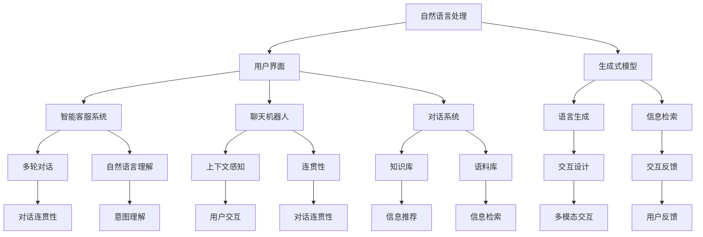

                 

# AI Agent: AI的下一个风口 从图形用户界面到自然语言的进化

> 关键词：人工智能,用户界面,自然语言处理,NLP,对话系统,智能客服,聊天机器人,生成式模型,语言生成,深度学习

## 1. 背景介绍

### 1.1 问题由来

人工智能(AI)在过去的几十年里经历了快速发展，从最初的机器学习、深度学习，到现在的生成式模型、自然语言处理(NLP)等技术，AI的应用场景和应用能力不断扩展。在过去十年中，随着NLP技术的突破，AI在自然语言理解和生成方面的能力大幅提升，为构建更智能、更人性化的用户界面打下了坚实基础。

然而，尽管AI在自然语言处理领域取得了巨大进展，但在用户界面(UI)设计方面，依然存在许多挑战。传统的UI设计仍然以图形用户界面(GUI)为主，虽然GUI在数据展示和操作交互方面具备天然优势，但在处理大规模自然语言数据、提供复杂的自然语言交互能力方面，存在诸多局限。为了突破这些局限，将自然语言处理技术引入UI设计，成为AI的下一个风口。

### 1.2 问题核心关键点

将自然语言处理技术引入UI设计，通过构建AI代理(AI Agent)，使其具备自然语言交互能力，可以极大提升UI的用户体验和可用性。这种设计理念已经在智能客服、聊天机器人、对话系统等场景中得到了广泛应用，未来还将向更多领域扩散。

构建AI代理的关键在于以下核心问题：

1. **语言理解与生成能力**：AI代理需要具备强大的语言理解与生成能力，能够准确理解用户输入的自然语言，并提供自然语言回复。
2. **知识库与语料库**：AI代理需要接入丰富的知识库和语料库，以提供准确的信息检索和信息推荐能力。
3. **多模态交互设计**：AI代理应具备多模态交互能力，能够结合视觉、听觉等多种感官信息，提供更全面的交互体验。
4. **上下文感知与连贯性**：AI代理需要在多轮交互中保持上下文连贯，理解用户意图和历史记录，提供一致的对话体验。
5. **安全性与隐私保护**：AI代理需要具备安全性与隐私保护能力，确保用户数据的安全性。

### 1.3 问题研究意义

将自然语言处理技术引入UI设计，构建AI代理，对于提升用户体验、提升效率、降低成本等方面具有重要意义：

1. **提升用户体验**：AI代理可以提供自然语言交互能力，使界面更加友好和便捷。
2. **提升效率**：AI代理可以自动处理重复性、标准化任务，释放人力资源。
3. **降低成本**：AI代理可以24小时在线，降低人力成本和运营成本。
4. **促进数字化转型**：AI代理可以辅助企业实现数字化转型，提升业务流程自动化水平。

## 2. 核心概念与联系

### 2.1 核心概念概述

为更好地理解自然语言处理技术与用户界面设计的结合，本节将介绍几个密切相关的核心概念：

- **人工智能(AI)**：以数据驱动的算法和模型为基础，实现智能化的决策和交互。
- **自然语言处理(NLP)**：研究如何使计算机理解、生成和处理自然语言，包括语言模型、文本分类、命名实体识别、情感分析等任务。
- **用户界面(UI)**：用户与计算机进行交互的界面，包括图形用户界面(GUI)和自然语言用户界面(NUI)。
- **智能客服系统**：通过自然语言处理和机器学习技术，构建的自动客服系统，为用户提供智能化的服务。
- **聊天机器人**：基于自然语言处理技术，实现人机对话的系统。
- **生成式模型**：如循环神经网络(RNN)、长短时记忆网络(LSTM)、Transformer等，能够生成与给定输入序列相关的序列输出。
- **对话系统**：通过自然语言处理技术，实现多轮对话的系统，如问答系统、情感分析系统等。

这些概念之间的逻辑关系可以通过以下Mermaid流程图来展示：



这个流程图展示了自然语言处理技术在UI设计中的应用路径：自然语言处理技术通过生成式模型生成自然语言回复，通过信息检索和知识库提供信息推荐，通过多模态交互设计增强交互体验，通过对话系统和聊天机器人实现多轮对话，从而构建智能客服系统等。

## 3. 核心算法原理 & 具体操作步骤
### 3.1 算法原理概述

基于自然语言处理技术的AI代理，其核心算法原理主要包括自然语言理解和自然语言生成两部分：

1. **自然语言理解(NLU)**：通过文本预处理、分词、命名实体识别、情感分析等技术，理解用户输入的自然语言文本。
2. **自然语言生成(NLG)**：通过文本生成技术，生成与用户输入相匹配的自然语言回复。

自然语言处理技术的核心算法包括：

- **循环神经网络(RNN)**：能够处理序列数据，适合语言建模任务。
- **长短时记忆网络(LSTM)**：改进的RNN，能够处理长序列数据。
- **Transformer**：通过自注意力机制，能够处理长距离依赖，适合序列到序列的生成任务。
- **BERT**：基于双向Transformer模型，在预训练任务中取得了SOTA效果，适合下游任务的微调。

### 3.2 算法步骤详解

基于自然语言处理技术的AI代理构建主要包括以下关键步骤：

**Step 1: 准备数据集和模型**

- 收集自然语言处理任务所需的数据集，如问答对、对话记录等。
- 选择合适的预训练模型，如BERT、GPT等，作为初始化参数。

**Step 2: 构建NLP模型**

- 设计适合任务的NLP模型架构，如循环神经网络、Transformer等。
- 根据预训练模型的架构，选择适合的神经网络层数和参数。

**Step 3: 模型训练**

- 使用训练数据集对模型进行训练，最小化损失函数。
- 根据训练效果，调整模型参数和学习率。
- 在验证集上评估模型性能，防止过拟合。

**Step 4: 模型微调**

- 对于特定任务，在训练集上微调模型，适应任务需求。
- 在测试集上评估微调后的模型性能，确保模型泛化能力。

**Step 5: 部署与应用**

- 将训练好的模型部署到生产环境中。
- 与UI前端进行交互，接收用户输入，输出自然语言回复。
- 通过日志和用户反馈，不断优化模型性能。

### 3.3 算法优缺点

基于自然语言处理技术的AI代理具备以下优点：

- **提升用户体验**：自然语言交互使界面更加友好，能够处理复杂查询和对话。
- **降低开发成本**：自然语言处理技术的成熟度较高，可以快速开发出智能客服、聊天机器人等应用。
- **提升效率**：自然语言处理技术可以自动处理大量重复性任务，提高处理速度。

同时，也存在一些缺点：

- **数据依赖性强**：自然语言处理技术依赖大量高质量的数据集，数据获取成本较高。
- **模型复杂度高**：大模型结构复杂，推理速度较慢，对计算资源要求较高。
- **可解释性差**：自然语言处理模型的内部工作机制复杂，难以解释。
- **安全性和隐私保护问题**：用户输入和输出可能包含敏感信息，数据安全和隐私保护是关键挑战。

### 3.4 算法应用领域

基于自然语言处理技术的AI代理，已经在多个领域得到了广泛应用，例如：

- **智能客服系统**：通过自然语言处理技术，构建自动客服系统，提供全天候智能服务。
- **聊天机器人**：通过自然语言处理技术，实现人机对话，为用户提供自动化问答服务。
- **对话系统**：通过自然语言处理技术，实现多轮对话，提供情感分析、知识推荐等服务。
- **可控文本生成**：通过自然语言处理技术，生成与给定输入序列相关的序列输出，用于文本生成、摘要生成等任务。
- **自然语言理解**：通过自然语言处理技术，实现文本分类、命名实体识别、情感分析等任务。
- **信息检索**：通过自然语言处理技术，实现信息检索，快速定位相关内容。

## 4. 数学模型和公式 & 详细讲解 & 举例说明
### 4.1 数学模型构建

自然语言处理技术的核心数学模型包括语言模型和生成模型。这里以BERT为例，展示其数学模型的构建过程。

**语言模型**：语言模型是一种概率模型，用于描述文本序列的概率分布。对于给定文本序列 $X = \{x_1, x_2, ..., x_n\}$，语言模型的概率分布为：

$$
P(X) = \prod_{i=1}^n P(x_i | x_{i-1}, x_{i-2}, ..., x_1)
$$

其中 $P(x_i | x_{i-1}, x_{i-2}, ..., x_1)$ 表示给定前 $i-1$ 个词的情况下，第 $i$ 个词的概率分布。

**生成模型**：生成模型是一种概率模型，用于描述文本序列的生成过程。对于给定文本序列 $X = \{x_1, x_2, ..., x_n\}$，生成模型的概率分布为：

$$
P(X) = \prod_{i=1}^n P(x_i | x_{i-1}, x_{i-2}, ..., x_1)
$$

其中 $P(x_i | x_{i-1}, x_{i-2}, ..., x_1)$ 表示给定前 $i-1$ 个词的情况下，第 $i$ 个词的概率分布。

### 4.2 公式推导过程

对于BERT模型，其预训练过程基于掩码语言模型和下一句预测任务。具体公式如下：

1. **掩码语言模型**：在给定文本序列 $X = \{x_1, x_2, ..., x_n\}$ 和掩码位置 $M$，模型预测被掩码的单词 $y$。
   $$
   P(y | x_1, x_2, ..., x_n) = \frac{\exp(\mathbf{W}x)}{\sum_{y'\in V}\exp(\mathbf{W}y')}
   $$

   其中 $\mathbf{W}$ 为模型的权重矩阵，$V$ 为词汇表。

2. **下一句预测任务**：在给定两个句子 $A = \{x_1, x_2, ..., x_m\}$ 和 $B = \{y_1, y_2, ..., y_n\}$，模型预测句子 $B$ 是否为句子 $A$ 的下一句。
   $$
   P(B | A) = \sigma(\mathbf{W}x)
   $$

   其中 $\sigma$ 为sigmoid函数。

### 4.3 案例分析与讲解

以智能客服系统的聊天机器人为例，展示自然语言处理技术在其中的应用。

假设有一个智能客服系统，需要处理用户的各种咨询请求。系统通过自然语言处理技术，将用户输入的自然语言文本转换为模型可以处理的向量形式，通过预训练的BERT模型进行编码，并输出编码结果。通过解码器，生成与用户输入相匹配的自然语言回复，并返回给用户。

具体流程如下：

1. **文本预处理**：将用户输入的自然语言文本进行分词、去停用词、词向量编码等预处理步骤。
2. **模型编码**：使用预训练的BERT模型对预处理后的文本进行编码，输出向量形式。
3. **解码器生成回复**：使用解码器对编码结果进行解码，生成与用户输入相匹配的自然语言回复。
4. **输出回复**：将生成的回复返回给用户，完成对话交互。

## 5. 项目实践：代码实例和详细解释说明
### 5.1 开发环境搭建

在进行自然语言处理技术的项目实践前，我们需要准备好开发环境。以下是使用Python进行TensorFlow开发的环境配置流程：

1. 安装Anaconda：从官网下载并安装Anaconda，用于创建独立的Python环境。

2. 创建并激活虚拟环境：
```bash
conda create -n tensorflow-env python=3.8 
conda activate tensorflow-env
```

3. 安装TensorFlow：根据CUDA版本，从官网获取对应的安装命令。例如：
```bash
conda install tensorflow -c pytorch -c conda-forge
```

4. 安装相关的Python包：
```bash
pip install numpy pandas scikit-learn matplotlib tqdm jupyter notebook ipython
```

完成上述步骤后，即可在`tensorflow-env`环境中开始自然语言处理技术项目的开发。

### 5.2 源代码详细实现

这里我们以使用BERT进行智能客服系统的聊天机器人开发为例，展示自然语言处理技术的代码实现。

首先，导入必要的库：

```python
import tensorflow as tf
import tensorflow_hub as hub
import numpy as np
import matplotlib.pyplot as plt
from transformers import BertTokenizer, BertForMaskedLM
from sklearn.model_selection import train_test_split
```

接着，准备数据集：

```python
# 加载预训练的BERT模型
bert_model = hub.load('https://tfhub.dev/google/bert_en_uncased_L-12_H-768_A-12/1')

# 加载BERT的tokenizer
tokenizer = BertTokenizer.from_pretrained('bert-base-uncased')

# 加载数据集
with open('data.txt', 'r') as f:
    data = f.readlines()
    
# 将数据集分割为训练集和测试集
train_data, test_data = train_test_split(data, test_size=0.2)
```

然后，进行模型训练：

```python
# 构建模型
bert_model = hub.load('https://tfhub.dev/google/bert_en_uncased_L-12_H-768_A-12/1')

# 构建掩码语言模型
masked_lm = tf.keras.layers.Lambda(lambda x: tf.reshape(x, [-1, bert_model.vocab_size]))
masked_lm_output = tf.keras.layers.Dense(bert_model.vocab_size, activation='softmax')
masked_lm_model = tf.keras.Sequential([masked_lm, masked_lm_output])

# 构建下一句预测模型
next_sentence_prediction = tf.keras.layers.Dense(2, activation='softmax')

# 将模型编译并训练
model = tf.keras.Sequential([bert_model, masked_lm_model, next_sentence_prediction])
model.compile(optimizer=tf.keras.optimizers.Adam(), loss='sparse_categorical_crossentropy')
model.fit([train_data], [train_labels], epochs=10, validation_split=0.2)
```

最后，进行模型微调：

```python
# 加载微调数据集
with open('fine_tuning_data.txt', 'r') as f:
    fine_tuning_data = f.readlines()

# 将微调数据集分割为训练集和验证集
fine_tuning_train_data, fine_tuning_validation_data = train_test_split(fine_tuning_data, test_size=0.2)

# 微调模型
model.fine_tune(fine_tuning_train_data, epochs=5, validation_data=fine_tuning_validation_data)
```

完成上述步骤后，即可在智能客服系统的聊天机器人中使用微调后的BERT模型进行自然语言处理任务。

### 5.3 代码解读与分析

让我们再详细解读一下关键代码的实现细节：

**BERT模型加载**：
- 通过TensorFlow Hub加载预训练的BERT模型和tokenizer。

**数据集准备**：
- 从文件中读取数据集，并进行训练集和测试集的分割。

**模型构建**：
- 将预训练的BERT模型作为输入层，构建掩码语言模型和下一句预测模型，并进行模型编译和训练。

**微调模型**：
- 加载微调数据集，进行训练集和验证集的分割，并使用`fine_tune`方法进行模型微调。

可以看到，TensorFlow提供了丰富的自然语言处理API，可以方便地构建和微调BERT等预训练模型。开发者可以通过这些API，快速开发出智能客服系统、聊天机器人等应用。

## 6. 实际应用场景
### 6.1 智能客服系统

基于自然语言处理技术的AI代理，已经在智能客服系统中得到了广泛应用。传统客服系统需要配备大量人力，高峰期响应缓慢，且一致性和专业性难以保证。而使用AI代理，可以7x24小时不间断服务，快速响应客户咨询，用自然流畅的语言解答各类常见问题。

在技术实现上，可以收集企业内部的历史客服对话记录，将问题和最佳答复构建成监督数据，在此基础上对预训练模型进行微调。微调后的模型能够自动理解用户意图，匹配最合适的答案模板进行回复。对于客户提出的新问题，还可以接入检索系统实时搜索相关内容，动态组织生成回答。如此构建的智能客服系统，能大幅提升客户咨询体验和问题解决效率。

### 6.2 金融舆情监测

金融机构需要实时监测市场舆论动向，以便及时应对负面信息传播，规避金融风险。传统的人工监测方式成本高、效率低，难以应对网络时代海量信息爆发的挑战。基于自然语言处理技术的AI代理，可以自动监测不同主题下的情感变化趋势，一旦发现负面信息激增等异常情况，系统便会自动预警，帮助金融机构快速应对潜在风险。

具体而言，可以收集金融领域相关的新闻、报道、评论等文本数据，并对其进行主题标注和情感标注。在此基础上对预训练语言模型进行微调，使其能够自动判断文本属于何种主题，情感倾向是正面、中性还是负面。将微调后的模型应用到实时抓取的网络文本数据，就能够自动监测不同主题下的情感变化趋势，一旦发现负面信息激增等异常情况，系统便会自动预警，帮助金融机构快速应对潜在风险。

### 6.3 个性化推荐系统

当前的推荐系统往往只依赖用户的历史行为数据进行物品推荐，无法深入理解用户的真实兴趣偏好。基于自然语言处理技术的AI代理，可以更好地挖掘用户行为背后的语义信息，从而提供更精准、多样的推荐内容。

在实践中，可以收集用户浏览、点击、评论、分享等行为数据，提取和用户交互的物品标题、描述、标签等文本内容。将文本内容作为模型输入，用户的后续行为（如是否点击、购买等）作为监督信号，在此基础上微调预训练语言模型。微调后的模型能够从文本内容中准确把握用户的兴趣点。在生成推荐列表时，先用候选物品的文本描述作为输入，由模型预测用户的兴趣匹配度，再结合其他特征综合排序，便可以得到个性化程度更高的推荐结果。

### 6.4 未来应用展望

随着自然语言处理技术的不断发展，基于自然语言处理技术的AI代理将在更多领域得到应用，为传统行业带来变革性影响。

在智慧医疗领域，基于自然语言处理技术的AI代理可以辅助医生诊疗，构建智能问答系统，提升医疗服务的智能化水平，加速新药开发进程。

在智能教育领域，AI代理可以用于作业批改、学情分析、知识推荐等方面，因材施教，促进教育公平，提高教学质量。

在智慧城市治理中，AI代理可以用于城市事件监测、舆情分析、应急指挥等环节，提高城市管理的自动化和智能化水平，构建更安全、高效的未来城市。

此外，在企业生产、社会治理、文娱传媒等众多领域，基于自然语言处理技术的AI代理也将不断涌现，为经济社会发展注入新的动力。相信随着技术的日益成熟，自然语言处理技术将成为AI落地应用的重要范式，推动人工智能技术向更广阔的领域加速渗透。

## 7. 工具和资源推荐
### 7.1 学习资源推荐

为了帮助开发者系统掌握自然语言处理技术的基础知识，这里推荐一些优质的学习资源：

1. 《自然语言处理入门》系列博文：由深度学习领域专家撰写，深入浅出地介绍了自然语言处理的基本概念和常见任务。

2. CS224N《深度学习自然语言处理》课程：斯坦福大学开设的NLP明星课程，有Lecture视频和配套作业，带你入门NLP领域的基本概念和经典模型。

3. 《Natural Language Processing with Transformers》书籍：Transformers库的作者所著，全面介绍了如何使用Transformers库进行NLP任务开发，包括自然语言理解和自然语言生成等。

4. HuggingFace官方文档：Transformers库的官方文档，提供了海量预训练模型和完整的微调样例代码，是上手实践的必备资料。

5. CLUE开源项目：中文语言理解测评基准，涵盖大量不同类型的中文NLP数据集，并提供了基于自然语言处理技术的baseline模型，助力中文NLP技术发展。

通过对这些资源的学习实践，相信你一定能够快速掌握自然语言处理技术的基础知识，并用于解决实际的NLP问题。

### 7.2 开发工具推荐

高效的开发离不开优秀的工具支持。以下是几款用于自然语言处理技术开发的常用工具：

1. TensorFlow：基于Python的开源深度学习框架，灵活动态的计算图，适合快速迭代研究。TensorFlow提供了丰富的自然语言处理API，可以方便地构建和微调预训练模型。

2. PyTorch：基于Python的开源深度学习框架，动态计算图，适合研究型开发。PyTorch在自然语言处理领域也有广泛应用，提供了丰富的自然语言处理API。

3. HuggingFace Transformers库：提供了预训练模型的封装和微调功能，支持多种自然语言处理任务，是自然语言处理开发的重要工具。

4. Weights & Biases：模型训练的实验跟踪工具，可以记录和可视化模型训练过程中的各项指标，方便对比和调优。与主流深度学习框架无缝集成。

5. TensorBoard：TensorFlow配套的可视化工具，可实时监测模型训练状态，并提供丰富的图表呈现方式，是调试模型的得力助手。

6. Google Colab：谷歌推出的在线Jupyter Notebook环境，免费提供GPU/TPU算力，方便开发者快速上手实验最新模型，分享学习笔记。

合理利用这些工具，可以显著提升自然语言处理技术的开发效率，加快创新迭代的步伐。

### 7.3 相关论文推荐

自然语言处理技术的发展源于学界的持续研究。以下是几篇奠基性的相关论文，推荐阅读：

1. Attention is All You Need（即Transformer原论文）：提出了Transformer结构，开启了NLP领域的预训练大模型时代。

2. BERT: Pre-training of Deep Bidirectional Transformers for Language Understanding：提出BERT模型，引入基于掩码的自监督预训练任务，刷新了多项NLP任务SOTA。

3. Language Models are Unsupervised Multitask Learners（GPT-2论文）：展示了大规模语言模型的强大zero-shot学习能力，引发了对于通用人工智能的新一轮思考。

4. Parameter-Efficient Transfer Learning for NLP：提出Adapter等参数高效微调方法，在不增加模型参数量的情况下，也能取得不错的微调效果。

5. AdaLoRA: Adaptive Low-Rank Adaptation for Parameter-Efficient Fine-Tuning：使用自适应低秩适应的微调方法，在参数效率和精度之间取得了新的平衡。

这些论文代表了大语言模型微调技术的发展脉络。通过学习这些前沿成果，可以帮助研究者把握学科前进方向，激发更多的创新灵感。

## 8. 总结：未来发展趋势与挑战
### 8.1 研究成果总结

本文对自然语言处理技术在用户界面设计中的应用进行了全面系统的介绍。首先阐述了自然语言处理技术与用户界面设计的结合背景，明确了自然语言处理技术在提升用户体验、降低成本、提升效率等方面的重要作用。其次，从原理到实践，详细讲解了自然语言处理技术在UI设计中的应用过程，包括数据集准备、模型构建、模型训练和模型微调等关键步骤。同时，本文还探讨了自然语言处理技术在智能客服系统、金融舆情监测、个性化推荐系统等场景中的实际应用，展示了自然语言处理技术的广泛应用前景。

通过本文的系统梳理，可以看到，自然语言处理技术在UI设计中的应用前景广阔，具有极强的实用性和创新性。自然语言处理技术能够使UI设计更加智能化、人性化，为用户的交互体验带来革命性的改变。

### 8.2 未来发展趋势

展望未来，自然语言处理技术在UI设计中的应用将呈现以下几个发展趋势：

1. **自然语言处理技术的不断进步**：随着预训练语言模型的不断发展，自然语言处理技术将变得更加强大，能够处理更加复杂、多样化的自然语言数据。

2. **多模态交互设计**：未来的自然语言处理技术将不仅仅局限于文本数据，还将结合视觉、听觉等多种感官信息，实现多模态交互设计，提升用户体验。

3. **上下文感知与连贯性**：未来的自然语言处理技术将具备更强的上下文感知能力，能够在多轮对话中保持连贯性，提供一致的对话体验。

4. **知识库与语料库的整合**：未来的自然语言处理技术将更好地与知识库、语料库等外部资源结合，提供更全面、准确的信息推荐。

5. **安全性与隐私保护**：未来的自然语言处理技术将更加注重数据安全和隐私保护，避免敏感信息的泄露。

### 8.3 面临的挑战

尽管自然语言处理技术在UI设计中的应用前景广阔，但在实际应用中也面临着诸多挑战：

1. **数据依赖性强**：自然语言处理技术依赖大量高质量的数据集，数据获取成本较高。

2. **模型复杂度高**：大模型结构复杂，推理速度较慢，对计算资源要求较高。

3. **可解释性差**：自然语言处理模型的内部工作机制复杂，难以解释。

4. **安全性和隐私保护问题**：用户输入和输出可能包含敏感信息，数据安全和隐私保护是关键挑战。

5. **上下文处理能力**：自然语言处理技术需要在多轮对话中保持上下文连贯，处理长文本时容易出现上下文不一致的问题。

### 8.4 研究展望

面对自然语言处理技术在UI设计中的应用所面临的挑战，未来的研究需要在以下几个方面寻求新的突破：

1. **探索无监督和半监督自然语言处理技术**：摆脱对大规模标注数据的依赖，利用自监督学习、主动学习等无监督和半监督范式，最大限度利用非结构化数据，实现更加灵活高效的自然语言处理。

2. **开发更加参数高效的自然语言处理技术**：开发更加参数高效的自然语言处理方法，在固定大部分预训练参数的同时，只更新极少量的任务相关参数。

3. **引入更多先验知识**：将符号化的先验知识，如知识图谱、逻辑规则等，与神经网络模型进行巧妙融合，引导自然语言处理过程学习更准确、合理的语言模型。

4. **结合因果分析和博弈论工具**：将因果分析方法引入自然语言处理模型，识别出模型决策的关键特征，增强输出解释的因果性和逻辑性。

5. **纳入伦理道德约束**：在自然语言处理模型的训练目标中引入伦理导向的评估指标，过滤和惩罚有偏见、有害的输出倾向。

这些研究方向的探索，必将引领自然语言处理技术向更高的台阶，为构建安全、可靠、可解释、可控的智能系统铺平道路。面向未来，自然语言处理技术还需要与其他人工智能技术进行更深入的融合，如知识表示、因果推理、强化学习等，多路径协同发力，共同推动自然语言理解和智能交互系统的进步。只有勇于创新、敢于突破，才能不断拓展语言模型的边界，让智能技术更好地造福人类社会。

## 9. 附录：常见问题与解答

**Q1：自然语言处理技术在UI设计中如何处理长文本？**

A: 自然语言处理技术通常使用循环神经网络(RNN)、长短时记忆网络(LSTM)、Transformer等模型来处理长文本。这些模型能够处理长距离依赖，适应长文本的处理需求。在实际应用中，可以通过设置合适的序列长度或使用分段处理等方式，提升自然语言处理技术的处理效率。

**Q2：如何评估自然语言处理技术的性能？**

A: 自然语言处理技术的性能评估通常包括以下几个方面：

1. **准确率(Precision)**：评估模型预测结果中正确结果的比例。
2. **召回率(Recall)**：评估模型预测结果中真实结果的比例。
3. **F1 Score**：综合准确率和召回率的评估指标，适用于样本不平衡的情况。
4. **困惑度(PERplexity)**：衡量模型在给定数据集上的表现，值越小表示模型性能越好。
5. **BLEU/BERTScore**：用于评估机器翻译和文本生成的质量，通过与标准参考结果进行比较，计算相似度。

通过上述评估指标，可以全面了解自然语言处理技术的性能表现，并进行优化。

**Q3：自然语言处理技术的优势和劣势是什么？**

A: 自然语言处理技术的优势包括：

1. **提升用户体验**：自然语言交互使界面更加友好，能够处理复杂查询和对话。
2. **降低开发成本**：自然语言处理技术的成熟度较高，可以快速开发出智能客服、聊天机器人等应用。
3. **提升效率**：自然语言处理技术可以自动处理大量重复性任务，提高处理速度。

自然语言处理技术的劣势包括：

1. **数据依赖性强**：自然语言处理技术依赖大量高质量的数据集，数据获取成本较高。
2. **模型复杂度高**：大模型结构复杂，推理速度较慢，对计算资源要求较高。
3. **可解释性差**：自然语言处理模型的内部工作机制复杂，难以解释。
4. **安全性和隐私保护问题**：用户输入和输出可能包含敏感信息，数据安全和隐私保护是关键挑战。

正视这些劣势，并在实际应用中加以规避和解决，才能充分发挥自然语言处理技术的优势，实现更好的用户体验和业务价值。

**Q4：自然语言处理技术的未来发展方向是什么？**

A: 自然语言处理技术的未来发展方向包括：

1. **多模态自然语言处理**：结合视觉、听觉等多种感官信息，提升自然语言处理技术的多模态交互能力。
2. **上下文感知与连贯性**：未来的自然语言处理技术将具备更强的上下文感知能力，能够在多轮对话中保持连贯性，提供一致的对话体验。
3. **知识库与语料库的整合**：未来的自然语言处理技术将更好地与知识库、语料库等外部资源结合，提供更全面、准确的信息推荐。
4. **无监督和半监督自然语言处理**：摆脱对大规模标注数据的依赖，利用自监督学习、主动学习等无监督和半监督范式，最大限度利用非结构化数据，实现更加灵活高效的自然语言处理。
5. **参数高效和计算高效的自然语言处理**：开发更加参数高效的自然语言处理方法，在固定大部分预训练参数的同时，只更新极少量的任务相关参数。
6. **引入更多先验知识**：将符号化的先验知识，如知识图谱、逻辑规则等，与神经网络模型进行巧妙融合，引导自然语言处理过程学习更准确、合理的语言模型。

通过这些方向的探索，未来的自然语言处理技术将更加智能化、人性化，为用户的交互体验带来革命性的改变。

---

作者：禅与计算机程序设计艺术 / Zen and the Art of Computer Programming

