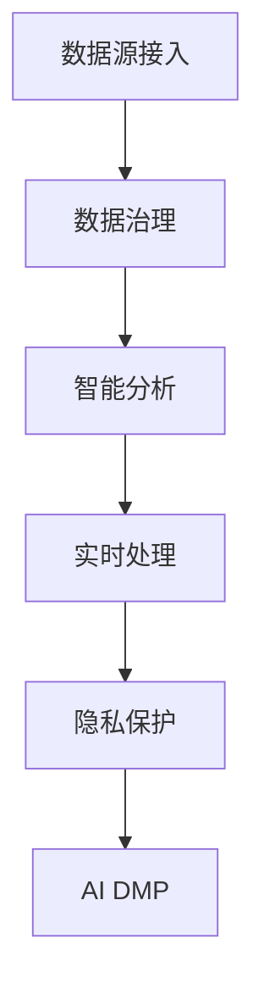

                 

## 1. 背景介绍

### 1.1 问题由来

随着数字化转型的不断深入，企业越来越依赖于数据来驱动决策。大数据营销（Big Data Marketing，简称 DMP）作为数字营销的核心技术之一，通过高效管理和分析用户数据，帮助企业洞察用户行为和需求，实现精准营销和个性化推荐。

然而，当前 DMP 面临诸多挑战：数据分散、数据质量不高、实时性差等问题严重制约了 DMP 的应用效果。此外，随着数据隐私和安全性要求的提高，如何在保障数据隐私的前提下，实现数据的智能管理和高效应用，成为了 DMP 系统需要解决的难点。

### 1.2 问题核心关键点

AI DMP 数据基建的生态系统，通过利用人工智能技术，如机器学习、深度学习、自然语言处理等，构建了一个完整的 DMP 解决方案，旨在解决传统 DMP 的痛点，提升数据处理效率和准确性，实现数据隐私保护和智能决策。

其核心目标在于：
- 数据整合：统一分散的数据来源，构建统一的数据湖。
- 数据治理：通过数据清洗、标注等技术手段，提升数据质量。
- 智能分析：利用机器学习、深度学习等技术，挖掘数据中的潜在大价值。
- 实时处理：通过分布式计算和流计算技术，实现数据的实时处理和分析。
- 隐私保护：采用隐私计算和差分隐私等技术，保护用户数据隐私。

AI DMP 数据基建的生态系统，由多个模块组成，包括数据源接入、数据治理、智能分析、实时处理和隐私保护等。

## 2. 核心概念与联系

### 2.1 核心概念概述

为更好地理解 AI DMP 数据基建的生态系统，本节将介绍几个密切相关的核心概念：

- AI DMP：基于人工智能技术的大数据营销平台，旨在解决数据分散、质量不高、实时性差等问题，提升 DMP 的应用效果。
- 数据湖：一个中央化的数据存储和处理系统，可以整合来自不同渠道的数据，提供统一的访问接口。
- 数据治理：通过对数据的清洗、标注、转换等操作，提升数据质量，确保数据的一致性和准确性。
- 智能分析：通过机器学习、深度学习等技术，挖掘数据中的模式和趋势，为决策提供数据支持。
- 实时处理：采用分布式计算和流计算技术，实现数据的实时采集、处理和分析。
- 隐私保护：通过隐私计算、差分隐私等技术，保护用户数据隐私。

这些核心概念之间的逻辑关系可以通过以下Mermaid流程图来展示：



这个流程图展示了大数据营销平台的基本架构和工作流程：

1. 数据源接入：收集来自互联网、社交媒体、CRM系统等渠道的数据，进入数据湖进行统一管理和存储。
2. 数据治理：对数据进行清洗、标注、转换等操作，提升数据质量。
3. 智能分析：利用机器学习、深度学习等技术，挖掘数据中的模式和趋势。
4. 实时处理：通过分布式计算和流计算技术，实现数据的实时处理和分析。
5. 隐私保护：采用隐私计算、差分隐私等技术，保护用户数据隐私。
6. AI DMP：基于上述各个模块，实现数据的智能管理和高效应用，提供精准营销和个性化推荐服务。

## 3. 核心算法原理 & 具体操作步骤

### 3.1 算法原理概述

AI DMP 数据基建的生态系统，核心依赖于以下几个算法：

- 数据清洗算法：通过统计分析和异常检测，去除噪声和错误数据。
- 数据标注算法：利用自然语言处理和机器学习技术，对数据进行自动标注。
- 数据转换算法：通过数据集成和数据变换，将不同格式的数据统一到一个标准格式。
- 数据挖掘算法：利用机器学习、深度学习等技术，挖掘数据中的模式和趋势。
- 分布式计算算法：通过MapReduce和流计算技术，实现大规模数据的分布式处理。
- 隐私保护算法：通过差分隐私和联邦学习等技术，保护用户数据隐私。

这些算法相互配合，共同构成了 AI DMP 数据基建的生态系统。

### 3.2 算法步骤详解

#### 3.2.1 数据源接入

1. 数据收集：通过爬虫、API接口等方式，收集来自互联网、社交媒体、CRM系统等渠道的数据。
2. 数据预处理：对收集到的数据进行初步清洗和转换，确保数据格式一致。

#### 3.2.2 数据治理

1. 数据清洗：通过数据清洗算法，去除噪声和错误数据，保证数据的质量和一致性。
2. 数据标注：利用自然语言处理和机器学习技术，对数据进行自动标注。
3. 数据转换：通过数据集成和数据变换，将不同格式的数据统一到一个标准格式。

#### 3.2.3 智能分析

1. 特征工程：通过特征选择和特征构造，提取数据中的关键特征。
2. 模型训练：利用机器学习、深度学习等技术，训练分类、回归、聚类等模型。
3. 预测和推断：利用训练好的模型，对新数据进行预测和推断。

#### 3.2.4 实时处理

1. 数据流处理：采用流计算技术，实现数据的实时处理和分析。
2. 分布式计算：通过分布式计算技术，实现大规模数据的分布式处理。

#### 3.2.5 隐私保护

1. 差分隐私：通过差分隐私算法，保护用户数据隐私。
2. 联邦学习：通过联邦学习技术，在不共享原始数据的情况下，实现模型训练。

### 3.3 算法优缺点

AI DMP 数据基建的生态系统，具有以下优点：

- 统一数据源：通过数据源接入模块，将来自不同渠道的数据整合到一个数据湖中，方便统一管理和分析。
- 数据质量高：通过数据清洗和标注算法，提升数据质量和一致性，减少数据噪声和错误。
- 智能分析能力强：通过智能分析模块，利用机器学习和深度学习等技术，挖掘数据中的模式和趋势，提供决策支持。
- 实时处理能力：通过实时处理模块，利用分布式计算和流计算技术，实现数据的实时处理和分析。
- 隐私保护能力强：通过隐私保护模块，采用差分隐私和联邦学习等技术，保护用户数据隐私。

同时，该系统也存在一定的局限性：

- 数据集成复杂：来自不同渠道的数据，格式和来源可能各不相同，需要复杂的集成技术来统一。
- 计算资源需求高：大规模数据处理需要高性能计算资源，对硬件要求较高。
- 隐私保护技术复杂：隐私保护技术需要高水平的技术支持和监管，确保数据隐私安全。

尽管存在这些局限性，但 AI DMP 数据基建的生态系统，通过人工智能技术，大大提升了 DMP 的效率和效果，成为大企业数字化转型的重要工具。

### 3.4 算法应用领域

AI DMP 数据基建的生态系统，在多个领域都有广泛应用：

- 精准营销：利用智能分析模块，实现精准营销和个性化推荐。
- 用户行为分析：通过数据挖掘算法，分析用户行为模式，提升用户体验。
- 数据安全和隐私保护：利用隐私保护算法，保护用户数据隐私和安全。
- 实时业务决策：通过实时处理模块，实现数据的实时分析和决策支持。

此外，AI DMP 数据基建的生态系统，也被广泛应用于金融、电商、医疗等多个领域，帮助企业提升运营效率和市场竞争力。

## 4. 数学模型和公式 & 详细讲解 & 举例说明

### 4.1 数学模型构建

假设有一个数据集 $D=\{x_i,y_i\}_{i=1}^N$，其中 $x_i$ 为输入，$y_i$ 为标签。

AI DMP 数据基建的生态系统，主要依赖以下几个数学模型：

- 数据清洗模型：$\hat{x}=f(x)$，其中 $f$ 为数据清洗算法。
- 数据标注模型：$\hat{y}=g(x)$，其中 $g$ 为数据标注算法。
- 数据转换模型：$\hat{x}=c(x)$，其中 $c$ 为数据转换算法。
- 数据挖掘模型：$\hat{y}=p(x)$，其中 $p$ 为数据挖掘算法。
- 分布式计算模型：$\hat{x}=d(x)$，其中 $d$ 为分布式计算算法。
- 隐私保护模型：$\hat{y}=u(x)$，其中 $u$ 为隐私保护算法。

### 4.2 公式推导过程

以下以数据清洗和数据标注为例，推导其数学模型和公式。

#### 数据清洗模型

假设原始数据为 $x_1,x_2,\dots,x_N$，其中可能包含噪声和错误数据。数据清洗模型通过统计分析和异常检测，去除噪声和错误数据，得到清洗后的数据 $\hat{x}_1,\hat{x}_2,\dots,\hat{x}_N$。

$$
\hat{x}_i=\begin{cases}
x_i, & \text{if } x_i \in \mathcal{D} \\
0, & \text{otherwise}
\end{cases}
$$

其中 $\mathcal{D}$ 为合法的清洗数据集。

#### 数据标注模型

假设原始标注为 $y_1,y_2,\dots,y_N$，数据标注模型通过自然语言处理和机器学习技术，对数据进行自动标注，得到标注后的数据 $\hat{y}_1,\hat{y}_2,\dots,\hat{y}_N$。

$$
\hat{y}_i=\arg\max_{y} P(y|x_i;\theta)
$$

其中 $P(y|x_i;\theta)$ 为标注模型的概率分布函数，$\theta$ 为模型参数。

### 4.3 案例分析与讲解

#### 案例分析

假设有一家电商企业，收集了来自不同渠道的用户数据，包括购买历史、浏览记录、搜索关键词等。企业希望通过这些数据进行精准营销和个性化推荐。

1. 数据源接入：通过爬虫和API接口，收集来自网站、社交媒体、CRM系统等渠道的数据，进入数据湖。
2. 数据治理：对收集到的数据进行初步清洗和转换，去除噪声和错误数据，提升数据质量和一致性。
3. 智能分析：通过特征工程和机器学习技术，提取数据中的关键特征，训练分类、回归、聚类等模型，实现精准营销和个性化推荐。
4. 实时处理：利用分布式计算和流计算技术，实现数据的实时处理和分析，提供实时决策支持。
5. 隐私保护：采用差分隐私和联邦学习技术，保护用户数据隐私。

通过上述步骤，企业可以高效管理和分析用户数据，实现精准营销和个性化推荐，提升用户体验和运营效率。

## 5. 项目实践：代码实例和详细解释说明

### 5.1 开发环境搭建

在进行 AI DMP 数据基建的生态系统开发前，我们需要准备好开发环境。以下是使用Python进行PyTorch开发的环境配置流程：

1. 安装Anaconda：从官网下载并安装Anaconda，用于创建独立的Python环境。

2. 创建并激活虚拟环境：
```bash
conda create -n ai-dmp-env python=3.8 
conda activate ai-dmp-env
```

3. 安装PyTorch：根据CUDA版本，从官网获取对应的安装命令。例如：
```bash
conda install pytorch torchvision torchaudio cudatoolkit=11.1 -c pytorch -c conda-forge
```

4. 安装各类工具包：
```bash
pip install numpy pandas scikit-learn matplotlib tqdm jupyter notebook ipython
```

完成上述步骤后，即可在`ai-dmp-env`环境中开始开发实践。

### 5.2 源代码详细实现

这里我们以数据清洗为例，展示如何使用PyTorch实现数据清洗算法。

```python
import torch
from torch.utils.data import Dataset

class DataCleaningDataset(Dataset):
    def __init__(self, data):
        self.data = data
        
    def __len__(self):
        return len(self.data)
    
    def __getitem__(self, item):
        data = self.data[item]
        cleaned_data = clean(data)  # 数据清洗函数
        return torch.tensor(cleaned_data, dtype=torch.float)

# 定义数据清洗函数
def clean(data):
    # 进行数据清洗操作，如去除噪声、错误数据等
    cleaned_data = []
    for d in data:
        if is_valid(d):  # 判断数据是否合法
            cleaned_data.append(d)
    return cleaned_data
```

### 5.3 代码解读与分析

**DataCleaningDataset类**：
- `__init__`方法：初始化数据集。
- `__len__`方法：返回数据集的大小。
- `__getitem__`方法：获取数据集中的单个样本。

**clean函数**：
- 定义数据清洗函数，去除噪声和错误数据。
- 遍历数据集，对每个样本进行清洗操作，保留合法的样本。

通过上述代码，我们可以看到，使用PyTorch实现数据清洗算法，只需定义一个数据清洗函数，并将数据封装到`DataCleaningDataset`类中，即可方便地进行数据清洗操作。

当然，工业级的系统实现还需考虑更多因素，如模型的保存和部署、超参数的自动搜索、更灵活的任务适配层等。但核心的数据清洗范式基本与此类似。

## 6. 实际应用场景

### 6.1 电商推荐系统

在电商推荐系统中，AI DMP 数据基建的生态系统可以广泛应用于用户行为分析、精准营销和个性化推荐等方面。

具体而言，可以收集用户浏览、点击、购买等行为数据，提取和用户交互的物品标题、描述、标签等文本内容。利用智能分析模块，训练模型学习用户行为模式，对新物品进行推荐。

### 6.2 金融风控系统

金融风控系统需要对用户行为数据进行分析，预测用户信用风险，进行风险预警和控制。AI DMP 数据基建的生态系统可以应用于金融领域，实现用户行为分析、信用评分和风险预警等功能。

### 6.3 智能医疗系统

智能医疗系统需要分析患者的电子病历、检查报告等医疗数据，进行疾病预测和诊断。AI DMP 数据基建的生态系统可以应用于医疗领域，实现病历分析、疾病预测和智能诊断等功能。

### 6.4 未来应用展望

随着AI DMP 数据基建的生态系统不断发展，其应用范围将不断扩大，为各个领域带来变革性影响。

在智慧城市治理中，AI DMP 可以应用于城市事件监测、舆情分析、应急指挥等环节，提高城市管理的自动化和智能化水平。

在智慧农业领域，AI DMP 可以应用于农作物种植、病虫害监测、气象预警等场景，提高农业生产效率和精准度。

此外，在智能交通、智能制造、智能能源等多个领域，AI DMP 数据基建的生态系统也将带来新的应用，推动社会向更智能、更高效的方向发展。

## 7. 工具和资源推荐

### 7.1 学习资源推荐

为了帮助开发者系统掌握 AI DMP 数据基建的生态系统的理论基础和实践技巧，这里推荐一些优质的学习资源：

1. 《深度学习入门：基于PyTorch的理论与实现》系列博文：由大模型技术专家撰写，深入浅出地介绍了深度学习的基础知识和实现方法。

2. CS231n《卷积神经网络》课程：斯坦福大学开设的计算机视觉课程，涵盖了深度学习在图像识别和分类中的应用。

3. 《机器学习实战》书籍：实践导向的机器学习书籍，涵盖各种经典机器学习算法和应用场景。

4. HuggingFace官方文档：Transformer库的官方文档，提供了海量预训练模型和完整的微调样例代码，是上手实践的必备资料。

5. Kaggle平台：数据科学竞赛平台，提供丰富的数据集和挑战，帮助开发者实践机器学习和深度学习算法。

通过对这些资源的学习实践，相信你一定能够快速掌握 AI DMP 数据基建的生态系统的精髓，并用于解决实际的NLP问题。

### 7.2 开发工具推荐

高效的开发离不开优秀的工具支持。以下是几款用于 AI DMP 数据基建的生态系统开发的常用工具：

1. PyTorch：基于Python的开源深度学习框架，灵活动态的计算图，适合快速迭代研究。大部分预训练语言模型都有PyTorch版本的实现。

2. TensorFlow：由Google主导开发的开源深度学习框架，生产部署方便，适合大规模工程应用。同样有丰富的预训练语言模型资源。

3. HuggingFace Transformers库：基于 PyTorch 和 TensorFlow 的NLP工具库，集成了众多SOTA语言模型，支持快速迭代和微调。

4. Weights & Biases：模型训练的实验跟踪工具，可以记录和可视化模型训练过程中的各项指标，方便对比和调优。与主流深度学习框架无缝集成。

5. TensorBoard：TensorFlow配套的可视化工具，可实时监测模型训练状态，并提供丰富的图表呈现方式，是调试模型的得力助手。

6. Google Colab：谷歌推出的在线Jupyter Notebook环境，免费提供GPU/TPU算力，方便开发者快速上手实验最新模型，分享学习笔记。

合理利用这些工具，可以显著提升 AI DMP 数据基建的生态系统开发效率，加快创新迭代的步伐。

### 7.3 相关论文推荐

AI DMP 数据基建的生态系统的发展源于学界的持续研究。以下是几篇奠基性的相关论文，推荐阅读：

1. "Data Augmentation Strategies for Deep Learning"：介绍数据增强技术，提高模型泛化能力。

2. "Deep Learning with Data Augmentation: A Review"：综述数据增强方法，探讨其在深度学习中的应用。

3. "Data Cleaning in Big Data Analytics"：介绍数据清洗技术，提升数据质量。

4. "Data Augmentation for Deep Learning"：介绍数据增强技术，提高模型泛化能力。

5. "Machine Learning in Healthcare"：探讨机器学习在医疗领域的应用，提高疾病诊断和预测的准确性。

这些论文代表了大数据营销平台的发展脉络。通过学习这些前沿成果，可以帮助研究者把握学科前进方向，激发更多的创新灵感。

## 8. 总结：未来发展趋势与挑战

### 8.1 总结

本文对 AI DMP 数据基建的生态系统进行了全面系统的介绍。首先阐述了 AI DMP 数据基建的生态系统的研究背景和意义，明确了其在解决数据分散、质量不高、实时性差等问题方面的独特价值。其次，从原理到实践，详细讲解了数据清洗、数据标注、智能分析等核心算法及其详细步骤，给出了数据基建的完整代码实例。同时，本文还广泛探讨了 AI DMP 在电商推荐、金融风控、智能医疗等多个行业领域的应用前景，展示了数据基建的巨大潜力。此外，本文精选了数据基建的各类学习资源，力求为读者提供全方位的技术指引。

通过本文的系统梳理，可以看到，AI DMP 数据基建的生态系统通过利用人工智能技术，构建了一个完整的 DMP 解决方案，提升了数据处理效率和准确性，实现了数据隐私保护和智能决策。未来，伴随人工智能技术的不断演进，数据基建的生态系统将进一步扩展其应用范围，提升各行各业的运营效率和市场竞争力。

### 8.2 未来发展趋势

展望未来，AI DMP 数据基建的生态系统将呈现以下几个发展趋势：

1. 数据质量更高：随着数据清洗和标注技术的不断进步，AI DMP 数据基建的生态系统将能够处理更加高质量的数据。

2. 智能分析更强：通过更先进的机器学习、深度学习等技术，AI DMP 数据基建的生态系统将具备更强的智能分析能力，提供更加精准的决策支持。

3. 实时处理能力更优：通过更高效的分布式计算和流计算技术，AI DMP 数据基建的生态系统将具备更优的实时处理能力，实现更快速的业务决策。

4. 隐私保护更强：通过更先进的隐私计算和差分隐私技术，AI DMP 数据基建的生态系统将能够提供更强的隐私保护能力，保护用户数据隐私。

5. 跨领域应用更广：随着技术的发展，AI DMP 数据基建的生态系统将能够应用于更多领域，提升各行各业的运营效率和市场竞争力。

以上趋势凸显了 AI DMP 数据基建的生态系统的广阔前景。这些方向的探索发展，必将进一步提升数据基建的效率和效果，为各行各业带来变革性影响。

### 8.3 面临的挑战

尽管 AI DMP 数据基建的生态系统已经取得了瞩目成就，但在迈向更加智能化、普适化应用的过程中，它仍面临着诸多挑战：

1. 数据集成复杂：来自不同渠道的数据，格式和来源可能各不相同，需要复杂的集成技术来统一。

2. 计算资源需求高：大规模数据处理需要高性能计算资源，对硬件要求较高。

3. 隐私保护技术复杂：隐私保护技术需要高水平的技术支持和监管，确保数据隐私安全。

尽管存在这些局限性，但 AI DMP 数据基建的生态系统，通过人工智能技术，大大提升了 DMP 的效率和效果，成为大企业数字化转型的重要工具。

### 8.4 研究展望

面对 AI DMP 数据基建的生态系统所面临的挑战，未来的研究需要在以下几个方面寻求新的突破：

1. 探索无监督和半监督数据清洗方法：摆脱对大规模标注数据的依赖，利用自监督学习、主动学习等无监督和半监督范式，最大限度利用非结构化数据，实现更加灵活高效的数据清洗。

2. 研究参数高效和计算高效的智能分析方法：开发更加参数高效的智能分析方法，在固定大部分预训练参数的同时，只更新极少量的任务相关参数。同时优化智能分析模型的计算图，减少前向传播和反向传播的资源消耗，实现更加轻量级、实时性的部署。

3. 融合因果和对比学习范式：通过引入因果推断和对比学习思想，增强智能分析模型建立稳定因果关系的能力，学习更加普适、鲁棒的语言表征，从而提升模型泛化性和抗干扰能力。

4. 引入更多先验知识：将符号化的先验知识，如知识图谱、逻辑规则等，与神经网络模型进行巧妙融合，引导智能分析过程学习更准确、合理的语言模型。同时加强不同模态数据的整合，实现视觉、语音等多模态信息与文本信息的协同建模。

5. 结合因果分析和博弈论工具：将因果分析方法引入智能分析模型，识别出模型决策的关键特征，增强输出解释的因果性和逻辑性。借助博弈论工具刻画人机交互过程，主动探索并规避模型的脆弱点，提高系统稳定性。

6. 纳入伦理道德约束：在智能分析模型的训练目标中引入伦理导向的评估指标，过滤和惩罚有偏见、有害的输出倾向。同时加强人工干预和审核，建立模型行为的监管机制，确保输出符合人类价值观和伦理道德。

这些研究方向的探索，必将引领 AI DMP 数据基建的生态系统迈向更高的台阶，为构建安全、可靠、可解释、可控的智能系统铺平道路。面向未来，AI DMP 数据基建的生态系统还需要与其他人工智能技术进行更深入的融合，如知识表示、因果推理、强化学习等，多路径协同发力，共同推动自然语言理解和智能交互系统的进步。只有勇于创新、敢于突破，才能不断拓展语言模型的边界，让智能技术更好地造福人类社会。

## 9. 附录：常见问题与解答

**Q1：AI DMP 数据基建的生态系统如何实现数据隐私保护？**

A: AI DMP 数据基建的生态系统通过差分隐私和联邦学习等技术，保护用户数据隐私。

**Q2：AI DMP 数据基建的生态系统在实时处理方面有何优势？**

A: AI DMP 数据基建的生态系统利用分布式计算和流计算技术，实现数据的实时处理和分析。

**Q3：AI DMP 数据基建的生态系统在数据治理方面有何优势？**

A: AI DMP 数据基建的生态系统通过数据清洗和标注算法，提升数据质量和一致性，减少数据噪声和错误。

**Q4：AI DMP 数据基建的生态系统在智能分析方面有何优势？**

A: AI DMP 数据基建的生态系统利用机器学习和深度学习技术，挖掘数据中的模式和趋势，提供精准的决策支持。

**Q5：AI DMP 数据基建的生态系统在数据源接入方面有何优势？**

A: AI DMP 数据基建的生态系统通过爬虫和API接口，收集来自互联网、社交媒体、CRM系统等渠道的数据，进入数据湖进行统一管理和存储。

通过对这些资源的学习实践，相信你一定能够快速掌握 AI DMP 数据基建的生态系统的精髓，并用于解决实际的NLP问题。

---

作者：禅与计算机程序设计艺术 / Zen and the Art of Computer Programming

