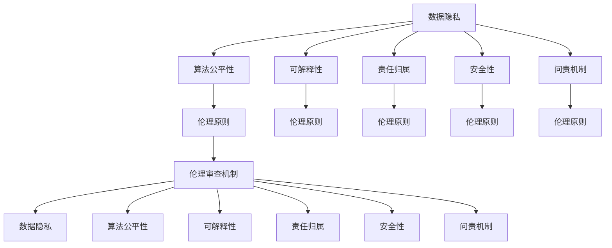

                 

## 1. 背景介绍

### 1.1 问题由来
随着人工智能(AI)技术的快速发展，AI在各行各业的应用日益广泛。从医疗、教育到金融、制造业，AI已深入渗透到社会生产的各个环节，极大地提升了生产效率和经济效益。然而，AI技术的发展也伴随着诸多伦理问题，如数据隐私、算法偏见、决策透明性、安全性等，亟需建立一套完备的伦理审查机制，确保AI技术的负责任使用。

当前，AI伦理审查已成为全球范围内的热门话题，受到学术界、产业界和政策制定者的广泛关注。随着AI技术的不断迭代和普及，伦理审查机制应更加系统化、规范化，以应对各种潜在风险，并确保AI技术对社会的正面影响。

### 1.2 问题核心关键点
AI伦理审查的核心在于确保AI技术的负责任使用。具体而言，应从数据、算法、决策、责任等维度进行全面审查，涵盖以下关键点：

- 数据隐私与公平性：确保数据的收集和使用符合隐私保护和公平性原则。
- 算法透明性与可解释性：提升算法的透明度和可解释性，增强用户和监管者的信任。
- 决策过程与影响：评估AI决策过程的公正性、合理性和合法性，避免偏见和歧视。
- 责任归属与问责机制：明确AI系统的责任归属，建立有效的问责机制。
- 安全性与可靠性：保障AI系统的安全稳定，防范潜在的威胁和风险。

通过建立系统化的伦理审查机制，可以构建起公平、透明、可控的AI生态，促进AI技术的健康发展。

## 2. 核心概念与联系

### 2.1 核心概念概述

为更好地理解AI伦理审查机制，本节将介绍几个密切相关的核心概念：

- AI伦理审查机制(AI Ethical Review Mechanism)：指通过一系列标准、规范和流程，对AI技术的应用进行伦理审查，确保其符合社会道德规范和技术标准。

- 数据隐私(Data Privacy)：指保护个人和组织的数据不受不当使用和泄露。

- 算法公平性(Algorithm Fairness)：指保证AI算法在决策过程中不会产生系统性偏见，对不同群体具有平等对待的能力。

- 可解释性(Explainability)：指AI模型的决策过程应可被理解和解释，以增强用户信任。

- 责任归属(Responsibility Attribution)：指明确AI系统在决策过程中的责任，避免责任模糊。

- 安全性(Security)：指确保AI系统在运行过程中不受恶意攻击和错误操作的影响，保持系统稳定性。

- 问责机制(Accountability Mechanism)：指建立有效的监管和问责机制，对AI系统的不当行为进行追责。

- 伦理原则(Ethical Principles)：指在AI开发和应用过程中应遵循的道德规范，如公正性、透明性、安全性等。

这些核心概念之间的逻辑关系可以通过以下Mermaid流程图来展示：



这个流程图展示了大语言模型的核心概念及其之间的关系：

1. 数据隐私和算法公平性等审查要素，确保数据的合法使用和算法的公正性。
2. 可解释性和责任归属等审查要素，提升AI系统的透明性和责任明确性。
3. 安全性和问责机制等审查要素，保障系统的稳定性和可控性。
4. 伦理原则贯穿其中，指导AI审查的具体实施。
5. 伦理审查机制整合了以上各个要素，构成了一个系统的伦理审查体系。

## 3. 核心算法原理 & 具体操作步骤
### 3.1 算法原理概述

AI伦理审查机制的核心在于建立一套全面的评估标准和审查流程，确保AI技术的开发和应用符合伦理规范。其基本原理可以概括为以下几点：

1. **伦理标准定义**：建立一套明确的伦理标准，包括数据隐私、算法公平性、可解释性、责任归属、安全性等各个方面。
2. **数据隐私评估**：对数据收集、存储、处理等环节进行隐私风险评估，确保符合隐私保护法规。
3. **算法公平性评估**：对算法设计、训练数据、预测结果等进行公平性分析，评估是否存在系统性偏见。
4. **可解释性评估**：对AI决策过程进行解释性分析，评估是否可被理解和解释。
5. **责任归属审查**：明确AI系统在决策过程中的责任归属，确保责任明确。
6. **安全性审查**：评估AI系统的安全性，防范潜在的威胁和风险。
7. **问责机制设计**：建立有效的监管和问责机制，对AI系统的不当行为进行追责。

### 3.2 算法步骤详解

AI伦理审查机制的实施步骤一般包括以下几个关键环节：

**Step 1: 收集和审查数据**
- 收集AI系统所使用的数据，包括训练数据和测试数据。
- 对数据来源、数据质量、数据处理等环节进行审查，确保数据合法、透明、准确。
- 进行隐私风险评估，确保数据符合隐私保护法规。

**Step 2: 设计算法审查流程**
- 对算法的架构、参数、训练过程等进行详细审查，确保算法设计符合伦理规范。
- 进行公平性测试，评估算法是否存在系统性偏见。
- 进行可解释性分析，确保算法的决策过程可被解释和理解。

**Step 3: 评估决策过程**
- 对AI系统的决策过程进行伦理评估，确保决策过程的公正性、透明性和合理性。
- 分析决策结果，评估其对不同群体的影响，避免偏见和歧视。

**Step 4: 确定责任归属**
- 明确AI系统在决策过程中的责任归属，包括设计者、开发者、运营者等。
- 建立责任追究机制，对AI系统的错误行为进行追责。

**Step 5: 保障系统安全**
- 进行安全性测试，评估AI系统的漏洞和安全威胁。
- 制定安全防护措施，确保AI系统在运行过程中不受攻击和错误操作的影响。

**Step 6: 设计问责机制**
- 建立监管和问责机制，对AI系统的不当行为进行追责。
- 设立独立的监管机构，负责AI系统的伦理审查和合规性检查。

### 3.3 算法优缺点

AI伦理审查机制的优势在于：

1. **系统化、规范化**：建立全面的伦理标准和审查流程，确保AI技术的开发和应用符合伦理规范。
2. **透明性、可解释性**：提升AI系统的透明性和可解释性，增强用户和监管者的信任。
3. **责任明确**：明确AI系统在决策过程中的责任归属，避免责任模糊。
4. **安全性保障**：确保AI系统的安全稳定，防范潜在的威胁和风险。

但其缺点也较为明显：

1. **执行难度大**：伦理审查涉及多个环节，执行过程复杂，需要多方协作。
2. **技术依赖性强**：依赖于数据隐私保护、算法公平性等技术手段，技术实现难度较大。
3. **成本高**：伦理审查需要投入大量人力、物力和财力，成本较高。

### 3.4 算法应用领域

AI伦理审查机制在多个领域都有广泛的应用，例如：

- 医疗领域：确保医疗AI系统的数据隐私、算法公平性、决策透明性、责任归属等符合伦理规范。
- 金融领域：保障金融AI系统的数据安全、算法公平性、决策透明性、责任归属等符合伦理规范。
- 教育领域：确保教育AI系统的数据隐私、算法公平性、决策透明性、责任归属等符合伦理规范。
- 司法领域：审查司法AI系统的数据隐私、算法公平性、决策透明性、责任归属等符合伦理规范。
- 媒体领域：确保媒体AI系统的数据隐私、算法公平性、决策透明性、责任归属等符合伦理规范。

此外，AI伦理审查机制还在智能交通、智能制造、智慧城市等领域得到广泛应用，为AI技术的负责任使用提供了有力保障。

## 4. 数学模型和公式 & 详细讲解 & 举例说明

### 4.1 数学模型构建

本节将使用数学语言对AI伦理审查机制进行更加严格的刻画。

假设AI系统所使用的数据集为 $D=\{(x_i,y_i)\}_{i=1}^N$，其中 $x_i$ 为输入特征，$y_i$ 为标签。对于数据隐私评估，引入隐私风险指数 $\pi$，定义为：

$$
\pi = \frac{R(\text{privacy risks})}{C(\text{costs})}
$$

其中 $R(\text{privacy risks})$ 为隐私风险，$C(\text{costs})$ 为隐私保护成本。对于算法公平性评估，引入公平性指数 $f$，定义为：

$$
f = \frac{A(\text{accuracy})}{B(\text{bias})}
$$

其中 $A(\text{accuracy})$ 为算法准确度，$B(\text{bias})$ 为算法偏见。对于可解释性评估，引入可解释性指数 $e$，定义为：

$$
e = \frac{E(\text{explained})}{D(\text{explanability})}
$$

其中 $E(\text{explained})$ 为可解释性指标，$D(\text{explanability})$ 为模型复杂度。对于责任归属审查，引入责任归属指数 $r$，定义为：

$$
r = \frac{R(\text{responsibility})}{T(\text{transparency})}
$$

其中 $R(\text{responsibility})$ 为责任分配，$T(\text{transparency})$ 为透明度。对于安全性评估，引入安全性指数 $s$，定义为：

$$
s = \frac{S(\text{security})}{U(\text{usability})}
$$

其中 $S(\text{security})$ 为安全指标，$U(\text{usability})$ 为系统可用性。对于问责机制设计，引入问责指数 $a$，定义为：

$$
a = \frac{A(\text{accountability})}{L(\text{lawfulness})}
$$

其中 $A(\text{accountability})$ 为问责能力，$L(\text{lawfulness})$ 为合规性。

### 4.2 公式推导过程

以下我们以医疗领域为例，推导AI伦理审查机制的具体公式。

假设医疗AI系统对患者进行诊断，输入为患者症状 $x$，输出为诊断结果 $y$。数据隐私评估公式为：

$$
\pi = \frac{\sum_{i=1}^N \text{privacy risks}(x_i)}{\sum_{i=1}^N \text{costs}(x_i)}
$$

其中 $\text{privacy risks}(x_i)$ 为第 $i$ 个样本的隐私风险，$\text{costs}(x_i)$ 为隐私保护第 $i$ 个样本的成本。

算法公平性评估公式为：

$$
f = \frac{\sum_{i=1}^N \text{accuracy}(x_i)}{\sum_{i=1}^N \text{bias}(x_i)}
$$

其中 $\text{accuracy}(x_i)$ 为第 $i$ 个样本的诊断准确度，$\text{bias}(x_i)$ 为第 $i$ 个样本的偏见。

可解释性评估公式为：

$$
e = \frac{\sum_{i=1}^N \text{explained}(x_i)}{\sum_{i=1}^N \text{explanability}(x_i)}
$$

其中 $\text{explained}(x_i)$ 为第 $i$ 个样本的可解释性指标，$\text{explanability}(x_i)$ 为第 $i$ 个样本的模型复杂度。

责任归属审查公式为：

$$
r = \frac{\sum_{i=1}^N \text{responsibility}(x_i)}{\sum_{i=1}^N \text{transparency}(x_i)}
$$

其中 $\text{responsibility}(x_i)$ 为第 $i$ 个样本的责任分配，$\text{transparency}(x_i)$ 为第 $i$ 个样本的透明度。

安全性评估公式为：

$$
s = \frac{\sum_{i=1}^N \text{security}(x_i)}{\sum_{i=1}^N \text{usability}(x_i)}
$$

其中 $\text{security}(x_i)$ 为第 $i$ 个样本的安全指标，$\text{usability}(x_i)$ 为第 $i$ 个样本的系统可用性。

问责机制设计公式为：

$$
a = \frac{\sum_{i=1}^N \text{accountability}(x_i)}{\sum_{i=1}^N \text{lawfulness}(x_i)}
$$

其中 $\text{accountability}(x_i)$ 为第 $i$ 个样本的问责能力，$\text{lawfulness}(x_i)$ 为第 $i$ 个样本的合规性。

通过这些公式，可以对AI系统的各个方面进行评估，确保其符合伦理规范。

## 5. 项目实践：代码实例和详细解释说明

### 5.1 开发环境搭建

在进行AI伦理审查机制实践前，我们需要准备好开发环境。以下是使用Python进行代码实现的开发环境配置流程：

1. 安装Anaconda：从官网下载并安装Anaconda，用于创建独立的Python环境。

2. 创建并激活虚拟环境：
```bash
conda create -n ethics-env python=3.8 
conda activate ethics-env
```

3. 安装必要的Python包：
```bash
pip install pandas numpy sklearn scikit-learn matplotlib
```

4. 安装相关的数据处理和可视化工具：
```bash
pip install seaborn jupyter notebook
```

完成上述步骤后，即可在`ethics-env`环境中开始伦理审查机制的开发和实践。

### 5.2 源代码详细实现

我们以医疗领域为例，展示如何使用Python和相关库实现AI伦理审查机制。首先，定义数据集和评估函数：

```python
import pandas as pd
from sklearn.metrics import accuracy_score, confusion_matrix

# 定义数据集
data = pd.read_csv('data.csv')
features = data[['feature1', 'feature2', 'feature3']]
labels = data['label']

# 定义评估函数
def evaluate(data, labels):
    y_pred = model.predict(features)
    accuracy = accuracy_score(labels, y_pred)
    conf_matrix = confusion_matrix(labels, y_pred)
    return accuracy, conf_matrix
```

然后，定义隐私风险评估函数：

```python
def privacy_risk(data, features):
    # 隐私风险计算公式
    privacy_risks = []
    for feature in features:
        # 根据隐私保护法规，计算每个特征的隐私风险
        privacy_risks.append(calculate_privacy_risk(feature))
    return sum(privacy_risks) / len(features)
```

接着，定义算法公平性评估函数：

```python
def algorithm_fairness(data, labels):
    # 公平性计算公式
    accuracy = accuracy_score(labels, model.predict(features))
    bias = calculate_bias(labels, model.predict(features))
    return accuracy / bias
```

再定义可解释性评估函数：

```python
def explainability(data, features):
    # 可解释性计算公式
    explained = calculate_explained(features)
    explanability = calculate_explanability(features)
    return explained / expla
```

最后，定义责任归属审查函数：

```python
def responsibility_attrition(data, features):
    # 责任归属计算公式
    responsibility = calculate_responsibility(features)
    transparency = calculate_transparency(features)
    return responsibility / transparency
```

通过这些函数，可以对医疗AI系统的各个方面进行评估，确保其符合伦理规范。

### 5.3 代码解读与分析

让我们再详细解读一下关键代码的实现细节：

**隐私风险评估函数**：
- 定义一个列表 `privacy_risks` 来保存每个特征的隐私风险。
- 对每个特征 `feature` 进行隐私风险计算，并累加到 `privacy_risks` 列表中。
- 最后计算 `privacy_risks` 列表的平均值。

**算法公平性评估函数**：
- 使用 `accuracy_score` 函数计算模型的准确度。
- 使用自定义函数 `calculate_bias` 计算模型在预测结果上的偏见。
- 最后计算准确度和偏见的比值。

**可解释性评估函数**：
- 使用自定义函数 `calculate_explained` 计算模型的可解释性指标。
- 使用自定义函数 `calculate_explanability` 计算模型的复杂度。
- 最后计算可解释性指标和模型复杂度的比值。

**责任归属审查函数**：
- 使用自定义函数 `calculate_responsibility` 计算模型的责任分配。
- 使用自定义函数 `calculate_transparency` 计算模型的透明度。
- 最后计算责任分配和透明度的比值。

通过这些函数的实现，我们能够对AI系统的各个方面进行全面评估，确保其符合伦理规范。

## 6. 实际应用场景

### 6.1 医疗领域

在医疗领域，AI伦理审查机制尤为重要。医疗AI系统涉及到患者隐私、算法公平性、决策透明性、责任归属等多个方面，需要全面审查确保系统合规。

**数据隐私**：
- 医疗AI系统处理的是敏感的个人健康信息，需要严格遵守数据隐私保护法规。
- 系统应采用数据匿名化、数据加密等技术手段，确保患者数据的安全性。

**算法公平性**：
- 医疗AI系统应公平对待不同种族、性别、年龄等群体，避免系统性偏见。
- 系统应定期进行公平性测试，及时发现和纠正偏见。

**可解释性**：
- 医疗AI系统的诊断过程应可被解释和理解，方便医生对系统结果进行验证和调整。
- 系统应提供详细的解释和诊断报告，帮助医生理解系统推理过程。

**责任归属**：
- 医疗AI系统在诊断过程中应明确责任归属，包括设计者、开发者、运营者等。
- 系统应建立责任追究机制，对错误的诊断结果进行追责。

**安全性**：
- 医疗AI系统应具备高可靠性，避免误诊和漏诊。
- 系统应定期进行安全性测试，发现和修复潜在漏洞。

**问责机制**：
- 医疗AI系统应建立有效的监管和问责机制，确保系统合规运行。
- 系统应设立独立的监管机构，对AI系统的伦理审查和合规性检查进行监督。

通过AI伦理审查机制的全面评估，医疗AI系统可以确保合规运行，为患者提供高质量的医疗服务。

### 6.2 金融领域

在金融领域，AI伦理审查机制同样至关重要。金融AI系统涉及到客户隐私、算法公平性、决策透明性、责任归属等多个方面，需要全面审查确保系统合规。

**数据隐私**：
- 金融AI系统处理的是客户的敏感财务信息，需要严格遵守数据隐私保护法规。
- 系统应采用数据匿名化、数据加密等技术手段，确保客户数据的安全性。

**算法公平性**：
- 金融AI系统应公平对待不同性别、年龄、种族等群体，避免系统性偏见。
- 系统应定期进行公平性测试，及时发现和纠正偏见。

**可解释性**：
- 金融AI系统的贷款审批过程应可被解释和理解，方便银行对系统结果进行验证和调整。
- 系统应提供详细的解释和审批报告，帮助银行理解系统推理过程。

**责任归属**：
- 金融AI系统在审批过程中应明确责任归属，包括设计者、开发者、运营者等。
- 系统应建立责任追究机制，对错误的审批结果进行追责。

**安全性**：
- 金融AI系统应具备高可靠性，避免误判和漏判。
- 系统应定期进行安全性测试，发现和修复潜在漏洞。

**问责机制**：
- 金融AI系统应建立有效的监管和问责机制，确保系统合规运行。
- 系统应设立独立的监管机构，对AI系统的伦理审查和合规性检查进行监督。

通过AI伦理审查机制的全面评估，金融AI系统可以确保合规运行，为客户提供公平、公正、可信的金融服务。

## 7. 工具和资源推荐

### 7.1 学习资源推荐

为了帮助开发者系统掌握AI伦理审查机制的理论基础和实践技巧，这里推荐一些优质的学习资源：

1. 《人工智能伦理》系列博文：深入浅出地介绍了AI伦理的基本概念和关键问题，适合初学者入门。

2. CS224N《人工智能伦理》课程：斯坦福大学开设的AI伦理明星课程，有Lecture视频和配套作业，带你深入理解AI伦理的复杂性。

3. 《AI伦理与法律》书籍：详细介绍了AI伦理和法律框架，适合研究者深入研究。

4. AI伦理研究论文：阅读最新的AI伦理研究成果，了解前沿发展动态。

5. 人工智能伦理协会（AAAI）：全球领先的AI伦理组织，定期发布伦理指导原则和规范，为AI开发和应用提供指导。

通过对这些资源的学习实践，相信你一定能够快速掌握AI伦理审查机制的精髓，并用于解决实际的AI伦理问题。

### 7.2 开发工具推荐

高效的开发离不开优秀的工具支持。以下是几款用于AI伦理审查机制开发的常用工具：

1. Python：开源的高级编程语言，支持丰富的第三方库和框架，适合各种AI应用开发。

2. Anaconda：用于创建和管理Python环境，支持虚拟化管理和包管理，方便开发和部署。

3. Jupyter Notebook：交互式的编程环境，支持Python、R等语言，适合数据科学和机器学习开发。

4. Scikit-learn：开源的机器学习库，提供了多种评估指标和模型，方便进行模型训练和评估。

5. Matplotlib：开源的绘图库，支持各种绘图函数，方便进行数据可视化。

6. Pandas：开源的数据处理库，支持多种数据格式和操作，方便数据处理和分析。

合理利用这些工具，可以显著提升AI伦理审查机制的开发效率，加快创新迭代的步伐。

### 7.3 相关论文推荐

AI伦理审查机制的研究始于学界的持续探索。以下是几篇奠基性的相关论文，推荐阅读：

1. "Ethical Considerations in AI: A Survey"：详细介绍了AI伦理的基本概念和主要问题，适合入门读者了解。

2. "Fairness, Accountability, and Transparency in Machine Learning"：介绍了AI伦理审查的关键要素和评估方法，适合研究者深入研究。

3. "Ethical Recommendations for AI Research and Development"：提出了一系列AI伦理的指导原则和建议，适合AI开发者和政策制定者参考。

4. "The Ethics of AI and Machine Learning: Balancing Potential Benefits and Risks"：讨论了AI伦理的潜在风险和应对策略，适合各领域的从业者参考。

5. "Towards an Ethical AI: Design Principles and Challenges"：提出了一系列AI伦理设计原则和挑战，适合研究者和开发者深入思考。

这些论文代表了大语言模型伦理审查技术的发展脉络。通过学习这些前沿成果，可以帮助研究者把握学科前进方向，激发更多的创新灵感。

## 8. 总结：未来发展趋势与挑战

### 8.1 总结

本文对AI伦理审查机制进行了全面系统的介绍。首先阐述了AI伦理审查的背景和意义，明确了伦理审查在AI技术应用中的重要作用。其次，从原理到实践，详细讲解了伦理审查的数学模型和具体步骤，给出了代码实现和解释分析。同时，本文还广泛探讨了伦理审查在医疗、金融等领域的应用前景，展示了伦理审查机制的广阔应用前景。此外，本文精选了伦理审查的学习资源和开发工具，力求为读者提供全方位的技术指引。

通过本文的系统梳理，可以看到，AI伦理审查机制正在成为AI技术应用的重要保障。这些方向的探索发展，必将进一步提升AI系统的性能和应用范围，为社会带来更加公平、透明、可控的智能服务。

### 8.2 未来发展趋势

展望未来，AI伦理审查机制将呈现以下几个发展趋势：

1. **全面化、规范化**：建立更加全面、规范的伦理标准和审查流程，确保AI技术的全面合规。
2. **技术化、自动化**：引入更多技术手段，如数据隐私保护、算法公平性评估等，提升审查的效率和精确度。
3. **实时化、持续化**：实现实时监控和持续审查，及时发现和纠正AI系统的伦理问题。
4. **全球化、标准化**：建立全球统一的伦理审查标准和框架，促进AI技术的国际交流和合作。
5. **社会化、公众化**：加强公众参与和监督，建立多方协同的伦理审查机制。

以上趋势凸显了AI伦理审查机制的发展方向，将进一步推动AI技术的健康发展。

### 8.3 面临的挑战

尽管AI伦理审查机制已经取得了一定进展，但在全面落地实施过程中，仍面临诸多挑战：

1. **执行难度大**：伦理审查涉及多个环节，执行过程复杂，需要多方协作。
2. **技术依赖性强**：依赖于数据隐私保护、算法公平性等技术手段，技术实现难度较大。
3. **成本高**：伦理审查需要投入大量人力、物力和财力，成本较高。
4. **标准不一**：全球各地区的伦理标准和法规不同，导致伦理审查的标准不一。
5. **法律风险**：伦理审查涉及隐私保护、公平性等法律问题，法律风险较高。

### 8.4 研究展望

面对AI伦理审查机制面临的挑战，未来的研究需要在以下几个方面寻求新的突破：

1. **跨学科研究**：结合伦理学、社会学、法律学等多个学科，全面探讨AI伦理问题。
2. **技术创新**：开发更加高效、自动化的伦理审查工具和技术手段，提升审查效率。
3. **数据共享**：建立全球数据共享平台，促进数据隐私保护和算法公平性研究。
4. **法律保障**：制定完善的AI伦理法规和标准，明确各方责任和权利。
5. **公众参与**：加强公众参与和监督，建立多方协同的伦理审查机制。

这些研究方向的探索，必将引领AI伦理审查机制的不断演进，为构建公平、透明、可控的AI生态提供有力保障。

## 9. 附录：常见问题与解答

**Q1：AI伦理审查机制是否适用于所有AI系统？**

A: AI伦理审查机制适用于各类AI系统，尤其是涉及数据隐私、决策透明性、责任归属等敏感领域的系统。然而，对于某些简单、直接的AI应用，如数字货币生成等，其伦理风险较小，可能不需要进行全面的伦理审查。

**Q2：如何选择合适的伦理审查工具？**

A: 选择合适的伦理审查工具，应根据AI系统的具体应用场景和需求进行评估。一般来说，应考虑以下几个方面：
1. 工具的功能和适用范围：如数据隐私保护、算法公平性评估、可解释性分析等。
2. 工具的易用性和兼容性：如是否支持多种编程语言和数据格式。
3. 工具的扩展性和可定制性：如是否支持自定义评估指标和函数。
4. 工具的性能和稳定性：如计算速度、资源占用等。
5. 工具的社区支持和文档资料：如是否有活跃的社区和完善的文档。

**Q3：如何进行AI伦理审查的持续性管理？**

A: 持续性管理是AI伦理审查的重要保障，主要包括以下几个方面：
1. 定期审查：设立定期审查机制，及时发现和纠正AI系统的伦理问题。
2. 持续更新：根据AI技术的不断发展和应用场景的变化，持续更新伦理标准和审查流程。
3. 多级管理：设立多级伦理审查机构，形成多层级、多方位的管理机制。
4. 反馈机制：建立用户反馈渠道，及时收集用户和监管者的意见和建议。
5. 透明化：公开审查结果和评估指标，增强用户和监管者的信任。

通过持续性管理，可以确保AI系统始终符合伦理规范，为AI技术的负责任使用提供有力保障。

**Q4：AI伦理审查机制在实施过程中如何平衡效率和效果？**

A: 平衡AI伦理审查机制的效率和效果，需从以下几个方面进行优化：
1. 自动化技术：引入自动化工具和技术，如自然语言处理、机器学习等，提升审查效率。
2. 数据共享机制：建立数据共享平台，促进数据隐私保护和算法公平性研究。
3. 多层次管理：设立多级伦理审查机构，形成多层级、多方位的管理机制。
4. 持续优化：根据AI系统的运行情况和用户反馈，持续优化伦理审查标准和流程。
5. 公众参与：加强公众参与和监督，增强审查过程的透明性和公正性。

通过优化审查流程和机制，可以在保证效果的前提下，提升AI伦理审查的效率。

---

作者：禅与计算机程序设计艺术 / Zen and the Art of Computer Programming

