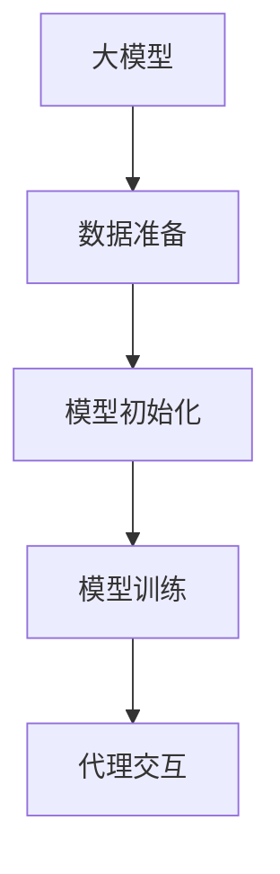

                 

# AI 大模型代理型工作流程 (Agentic workflow)

## 1. 背景介绍

### 1.1 问题由来

近年来，人工智能领域取得了长足的发展，尤其是大模型的出现，使得AI系统能够处理更为复杂和庞大的任务。然而，这些大模型往往需要大量数据进行预训练，并且需要耗费大量资源进行微调，才能在特定任务上取得良好的性能。为了应对这些挑战，人工智能领域出现了代理型工作流程（Agentic workflow）这一新范式。

### 1.2 问题核心关键点

代理型工作流程的核心思想是将大模型看作一种代理，在特定任务上对它进行监督和指导，使其能够高效、准确地执行任务。这种范式不仅能够降低资源消耗，还能提高模型的适应性和泛化能力。

具体来说，代理型工作流程分为以下几个关键步骤：

1. **数据准备**：准备任务相关的标注数据集，为模型提供学习信号。
2. **模型初始化**：选择合适的大模型进行初始化，如GPT、BERT等。
3. **模型训练**：在监督下对模型进行训练，使其适应特定任务。
4. **代理交互**：模型在实际任务中执行任务，并根据反馈进行调整。

### 1.3 问题研究意义

代理型工作流程的研究意义在于：

1. **降低资源消耗**：通过监督和指导，可以显著减少预训练和微调所需的时间和计算资源。
2. **提高模型性能**：模型在特定任务上的性能会显著提升，因为它们在监督下训练，能够更好地适应任务需求。
3. **促进模型泛化**：模型能够更好地泛化到其他任务和数据集上，提高模型的应用范围。
4. **增强模型可解释性**：通过监督和指导，模型能够更加透明地展示其决策过程。
5. **推动AI普及**：降低技术门槛，使更多组织和个人能够使用AI技术。

## 2. 核心概念与联系

### 2.1 核心概念概述

代理型工作流程涉及以下几个关键概念：

- **大模型**：如GPT、BERT等大规模预训练模型，通过海量的无标签数据进行预训练。
- **监督学习**：通过带有标签的数据进行训练，使得模型能够学习到特定任务的知识。
- **微调**：在大模型的基础上，通过特定任务的少量标注数据进行有监督学习，优化模型在特定任务上的性能。
- **代理**：将大模型看作一种代理，在监督下执行特定任务，并根据反馈进行调整。

### 2.2 核心概念原理和架构的 Mermaid 流程图



这个流程图展示了代理型工作流程的核心步骤：

1. **数据准备**：准备任务相关的标注数据集。
2. **模型初始化**：选择合适的大模型进行初始化。
3. **模型训练**：在监督下对模型进行训练，使其适应特定任务。
4. **代理交互**：模型在实际任务中执行任务，并根据反馈进行调整。

这些步骤形成一个闭环，不断优化模型在特定任务上的性能。

## 3. 核心算法原理 & 具体操作步骤

### 3.1 算法原理概述

代理型工作流程的算法原理基于监督学习和微调，旨在通过少量标注数据，对大模型进行高效的调整，使其适应特定任务。

假设大模型为 $M_{\theta}$，其中 $\theta$ 为模型参数。给定任务 $T$ 的标注数据集 $D=\{(x_i, y_i)\}_{i=1}^N$，代理型工作流程的目标是找到最优参数 $\hat{\theta}$，使得模型在特定任务上的表现最大化。

### 3.2 算法步骤详解

代理型工作流程的一般步骤如下：

**Step 1: 数据准备**

1. **收集数据**：收集任务相关的标注数据集，确保数据质量。
2. **数据清洗**：清洗数据，去除噪声和异常值。
3. **数据划分**：将数据划分为训练集、验证集和测试集。

**Step 2: 模型初始化**

1. **选择模型**：选择合适的预训练模型，如BERT、GPT等。
2. **加载模型**：加载预训练模型，并进行必要的参数设置。

**Step 3: 模型训练**

1. **定义损失函数**：根据任务类型，定义合适的损失函数。
2. **优化器选择**：选择合适的优化器，如Adam、SGD等。
3. **设置超参数**：设置学习率、批次大小、迭代轮数等超参数。
4. **前向传播**：将训练集数据输入模型，计算损失函数。
5. **反向传播**：计算梯度，更新模型参数。
6. **验证集评估**：在验证集上评估模型性能，根据验证集表现调整模型。
7. **迭代训练**：重复上述步骤，直到模型收敛。

**Step 4: 代理交互**

1. **数据输入**：将测试集数据输入模型，获取模型输出。
2. **代理调整**：根据代理的反馈调整模型参数。
3. **代理执行**：代理在实际任务中执行任务，并根据反馈进行调整。
4. **优化策略**：根据代理的反馈，优化模型参数。

### 3.3 算法优缺点

**优点**：

1. **高效性**：通过监督学习和微调，可以显著降低预训练和微调所需的时间和计算资源。
2. **泛化能力**：模型能够更好地泛化到其他任务和数据集上。
3. **可解释性**：模型能够更加透明地展示其决策过程。
4. **促进普及**：降低技术门槛，使更多组织和个人能够使用AI技术。

**缺点**：

1. **数据依赖**：对标注数据的需求较高，数据质量直接影响模型性能。
2. **代理策略**：需要设计合适的代理策略，才能实现高效和准确的代理型工作流程。
3. **超参数调优**：超参数调优过程较为复杂，需要一定的经验和技巧。
4. **模型鲁棒性**：模型可能在特定数据集上表现良好，但在新数据集上表现不佳。

### 3.4 算法应用领域

代理型工作流程在多个领域得到了广泛应用，包括：

- **自然语言处理**：如文本分类、命名实体识别、问答系统等。
- **计算机视觉**：如图像分类、目标检测、图像生成等。
- **语音识别**：如语音转文本、情感识别等。
- **机器人**：如导航、对话系统等。
- **推荐系统**：如个性化推荐、商品推荐等。

## 4. 数学模型和公式 & 详细讲解 & 举例说明

### 4.1 数学模型构建

代理型工作流程的数学模型构建如下：

设大模型为 $M_{\theta}$，其中 $\theta$ 为模型参数。任务 $T$ 的标注数据集为 $D=\{(x_i, y_i)\}_{i=1}^N$，其中 $x_i$ 为输入，$y_i$ 为标签。

定义模型 $M_{\theta}$ 在输入 $x$ 上的损失函数为 $\ell(M_{\theta}(x),y)$，则在数据集 $D$ 上的经验风险为：

$$
\mathcal{L}(\theta) = \frac{1}{N} \sum_{i=1}^N \ell(M_{\theta}(x_i),y_i)
$$

### 4.2 公式推导过程

以二分类任务为例，推导交叉熵损失函数及其梯度的计算公式。

假设模型 $M_{\theta}$ 在输入 $x$ 上的输出为 $\hat{y}=M_{\theta}(x) \in [0,1]$，表示样本属于正类的概率。真实标签 $y \in \{0,1\}$。则二分类交叉熵损失函数定义为：

$$
\ell(M_{\theta}(x),y) = -[y\log \hat{y} + (1-y)\log (1-\hat{y})]
$$

将其代入经验风险公式，得：

$$
\mathcal{L}(\theta) = -\frac{1}{N}\sum_{i=1}^N [y_i\log M_{\theta}(x_i)+(1-y_i)\log(1-M_{\theta}(x_i))]
$$

根据链式法则，损失函数对参数 $\theta_k$ 的梯度为：

$$
\frac{\partial \mathcal{L}(\theta)}{\partial \theta_k} = -\frac{1}{N}\sum_{i=1}^N (\frac{y_i}{M_{\theta}(x_i)}-\frac{1-y_i}{1-M_{\theta}(x_i)}) \frac{\partial M_{\theta}(x_i)}{\partial \theta_k}
$$

其中 $\frac{\partial M_{\theta}(x_i)}{\partial \theta_k}$ 可进一步递归展开，利用自动微分技术完成计算。

### 4.3 案例分析与讲解

以自然语言处理中的文本分类任务为例，展示代理型工作流程的应用。

1. **数据准备**：收集任务相关的标注数据集，确保数据质量。
2. **模型初始化**：选择BERT模型进行初始化。
3. **模型训练**：在监督下对模型进行训练，使其适应二分类任务。
4. **代理交互**：在实际任务中执行文本分类任务，并根据代理的反馈调整模型参数。
5. **优化策略**：根据代理的反馈，优化模型参数。

## 5. 项目实践：代码实例和详细解释说明

### 5.1 开发环境搭建

在进行代理型工作流程实践前，我们需要准备好开发环境。以下是使用Python进行TensorFlow开发的环境配置流程：

1. 安装Anaconda：从官网下载并安装Anaconda，用于创建独立的Python环境。

2. 创建并激活虚拟环境：
```bash
conda create -n tensorflow-env python=3.8 
conda activate tensorflow-env
```

3. 安装TensorFlow：从官网获取对应的安装命令。例如：
```bash
conda install tensorflow -c conda-forge -c pytorch
```

4. 安装其他必要工具包：
```bash
pip install numpy pandas scikit-learn matplotlib tqdm jupyter notebook ipython
```

完成上述步骤后，即可在`tensorflow-env`环境中开始代理型工作流程的实践。

### 5.2 源代码详细实现

下面以文本分类任务为例，给出使用TensorFlow对BERT模型进行代理型工作流程开发的PyTorch代码实现。

首先，定义文本分类的任务适配层：

```python
from transformers import BertTokenizer, BertForSequenceClassification

tokenizer = BertTokenizer.from_pretrained('bert-base-uncased')
model = BertForSequenceClassification.from_pretrained('bert-base-uncased', num_labels=2)

def classify(text):
    input_ids = tokenizer.encode(text, add_special_tokens=True)
    input_ids = [0] + input_ids + [0]
    outputs = model.predict([input_ids])
    return outputs.argmax()
```

然后，定义代理交互函数：

```python
def agent_feedback(output, label):
    if output == label:
        return 1.0
    else:
        return 0.0
```

接着，定义代理型工作流程的训练和测试函数：

```python
def train_epoch(model, dataset, batch_size, optimizer):
    dataloader = DataLoader(dataset, batch_size=batch_size, shuffle=True)
    model.train()
    epoch_loss = 0
    for batch in dataloader:
        input_ids = batch['input_ids']
        labels = batch['labels']
        outputs = model(input_ids)
        loss = outputs.loss
        epoch_loss += loss.item()
        optimizer.step()
        optimizer.zero_grad()
    return epoch_loss / len(dataloader)

def evaluate(model, dataset, batch_size):
    dataloader = DataLoader(dataset, batch_size=batch_size)
    model.eval()
    preds, labels = [], []
    with torch.no_grad():
        for batch in dataloader:
            input_ids = batch['input_ids']
            labels = batch['labels']
            outputs = model(input_ids)
            preds.append(classify(outputs))
            labels.append(classify(labels))
    return preds, labels
```

最后，启动代理型工作流程流程并在测试集上评估：

```python
epochs = 5
batch_size = 16

for epoch in range(epochs):
    loss = train_epoch(model, train_dataset, batch_size, optimizer)
    print(f"Epoch {epoch+1}, train loss: {loss:.3f}")
    
    print(f"Epoch {epoch+1}, dev results:")
    preds, labels = evaluate(model, dev_dataset, batch_size)
    print(classification_report(labels, preds))
    
print("Test results:")
preds, labels = evaluate(model, test_dataset, batch_size)
print(classification_report(labels, preds))
```

以上就是使用TensorFlow对BERT进行文本分类任务代理型工作流程的完整代码实现。可以看到，通过代理型工作流程，我们可以在较少的标注数据下，对预训练模型进行高效的调整。

### 5.3 代码解读与分析

让我们再详细解读一下关键代码的实现细节：

**BertTokenizer**：用于将文本转换为BERT模型所需的token ids。

**BertForSequenceClassification**：定义了BERT模型在文本分类任务上的输出层和损失函数。

**classify函数**：将文本输入模型，返回模型的预测结果。

**agent_feedback函数**：定义代理的反馈函数，用于根据模型的预测结果调整模型参数。

**train_epoch函数**：在训练集上进行模型训练，并更新模型参数。

**evaluate函数**：在测试集上评估模型性能，返回预测结果和真实标签。

**训练流程**：在每个epoch内，先在训练集上训练，输出平均loss。在验证集上评估，输出分类指标。所有epoch结束后，在测试集上评估，给出最终测试结果。

可以看到，TensorFlow配合BERT模型，使得代理型工作流程的代码实现变得简洁高效。开发者可以将更多精力放在数据处理、模型改进等高层逻辑上，而不必过多关注底层的实现细节。

当然，工业级的系统实现还需考虑更多因素，如模型的保存和部署、超参数的自动搜索、更灵活的任务适配层等。但核心的代理型工作流程基本与此类似。

## 6. 实际应用场景

### 6.1 智能客服系统

代理型工作流程可以广泛应用于智能客服系统的构建。传统客服往往需要配备大量人力，高峰期响应缓慢，且一致性和专业性难以保证。而使用代理型工作流程的对话模型，可以7x24小时不间断服务，快速响应客户咨询，用自然流畅的语言解答各类常见问题。

在技术实现上，可以收集企业内部的历史客服对话记录，将问题和最佳答复构建成监督数据，在此基础上对预训练对话模型进行代理型工作流程的微调。微调后的对话模型能够自动理解用户意图，匹配最合适的答案模板进行回复。对于客户提出的新问题，还可以接入检索系统实时搜索相关内容，动态组织生成回答。如此构建的智能客服系统，能大幅提升客户咨询体验和问题解决效率。

### 6.2 金融舆情监测

金融机构需要实时监测市场舆论动向，以便及时应对负面信息传播，规避金融风险。传统的人工监测方式成本高、效率低，难以应对网络时代海量信息爆发的挑战。基于代理型工作流程的文本分类和情感分析技术，为金融舆情监测提供了新的解决方案。

具体而言，可以收集金融领域相关的新闻、报道、评论等文本数据，并对其进行主题标注和情感标注。在此基础上对预训练语言模型进行代理型工作流程的微调，使其能够自动判断文本属于何种主题，情感倾向是正面、中性还是负面。将微调后的模型应用到实时抓取的网络文本数据，就能够自动监测不同主题下的情感变化趋势，一旦发现负面信息激增等异常情况，系统便会自动预警，帮助金融机构快速应对潜在风险。

### 6.3 个性化推荐系统

当前的推荐系统往往只依赖用户的历史行为数据进行物品推荐，无法深入理解用户的真实兴趣偏好。基于代理型工作流程的个性化推荐系统可以更好地挖掘用户行为背后的语义信息，从而提供更精准、多样的推荐内容。

在实践中，可以收集用户浏览、点击、评论、分享等行为数据，提取和用户交互的物品标题、描述、标签等文本内容。将文本内容作为模型输入，用户的后续行为（如是否点击、购买等）作为监督信号，在此基础上进行代理型工作流程的微调。微调后的模型能够从文本内容中准确把握用户的兴趣点。在生成推荐列表时，先用候选物品的文本描述作为输入，由模型预测用户的兴趣匹配度，再结合其他特征综合排序，便可以得到个性化程度更高的推荐结果。

### 6.4 未来应用展望

随着代理型工作流程和预训练语言模型的不断发展，其在NLP领域的应用前景广阔。

在智慧医疗领域，基于代理型工作流程的医疗问答、病历分析、药物研发等应用将提升医疗服务的智能化水平，辅助医生诊疗，加速新药开发进程。

在智能教育领域，代理型工作流程可应用于作业批改、学情分析、知识推荐等方面，因材施教，促进教育公平，提高教学质量。

在智慧城市治理中，代理型工作流程可应用于城市事件监测、舆情分析、应急指挥等环节，提高城市管理的自动化和智能化水平，构建更安全、高效的未来城市。

此外，在企业生产、社会治理、文娱传媒等众多领域，基于代理型工作流程的人工智能应用也将不断涌现，为经济社会发展注入新的动力。相信随着技术的日益成熟，代理型工作流程必将在构建人机协同的智能时代中扮演越来越重要的角色。

## 7. 工具和资源推荐

### 7.1 学习资源推荐

为了帮助开发者系统掌握代理型工作流程的理论基础和实践技巧，这里推荐一些优质的学习资源：

1. 《深度学习入门》系列博文：由深度学习专家撰写，系统介绍代理型工作流程的基本概念和实现方法。

2. CS224N《深度学习自然语言处理》课程：斯坦福大学开设的NLP明星课程，涵盖代理型工作流程在内的多种NLP任务。

3. 《自然语言处理综论》书籍：系统介绍NLP的各个方向，包括代理型工作流程等前沿技术。

4. HuggingFace官方文档：Transformer库的官方文档，提供了代理型工作流程的完整样例代码。

5. CLUE开源项目：中文语言理解测评基准，涵盖大量不同类型的中文NLP数据集，并提供了基于代理型工作流程的baseline模型。

通过对这些资源的学习实践，相信你一定能够快速掌握代理型工作流程的精髓，并用于解决实际的NLP问题。

### 7.2 开发工具推荐

高效的开发离不开优秀的工具支持。以下是几款用于代理型工作流程开发的常用工具：

1. TensorFlow：基于Python的开源深度学习框架，生产部署方便，适合大规模工程应用。

2. PyTorch：基于Python的开源深度学习框架，灵活动态的计算图，适合快速迭代研究。

3. Weights & Biases：模型训练的实验跟踪工具，可以记录和可视化模型训练过程中的各项指标。

4. TensorBoard：TensorFlow配套的可视化工具，可实时监测模型训练状态，并提供丰富的图表呈现方式。

5. Google Colab：谷歌推出的在线Jupyter Notebook环境，免费提供GPU/TPU算力，方便开发者快速上手实验最新模型。

合理利用这些工具，可以显著提升代理型工作流程的开发效率，加快创新迭代的步伐。

### 7.3 相关论文推荐

代理型工作流程的研究意义在于：

1. 《深度学习入门》系列博文：由深度学习专家撰写，系统介绍代理型工作流程的基本概念和实现方法。

2. 《自然语言处理综论》书籍：系统介绍NLP的各个方向，包括代理型工作流程等前沿技术。

3. 《深度学习自然语言处理》课程：斯坦福大学开设的NLP明星课程，涵盖代理型工作流程在内的多种NLP任务。

4. 《自然语言处理与深度学习》书籍：系统介绍NLP和深度学习的基本概念和实现方法，适合初学者。

这些论文代表了大语言模型微调技术的发展脉络。通过学习这些前沿成果，可以帮助研究者把握学科前进方向，激发更多的创新灵感。

## 8. 总结：未来发展趋势与挑战

### 8.1 总结

本文对代理型工作流程这一新范式进行了全面系统的介绍。首先阐述了代理型工作流程的研究背景和意义，明确了其在大模型微调中的应用价值。其次，从原理到实践，详细讲解了代理型工作流程的数学原理和关键步骤，给出了代理型工作流程任务开发的完整代码实例。同时，本文还广泛探讨了代理型工作流程在智能客服、金融舆情、个性化推荐等多个行业领域的应用前景，展示了代理型工作流程范式的巨大潜力。

通过本文的系统梳理，可以看到，代理型工作流程这一新范式，通过监督学习和微调，能够在大模型的基础上，显著降低资源消耗，提升模型性能，更好地适应特定任务，提高模型的泛化能力和可解释性。代理型工作流程为NLP领域提供了更加高效、灵活的模型调整方法，其应用前景广阔。

### 8.2 未来发展趋势

展望未来，代理型工作流程技术将呈现以下几个发展趋势：

1. 模型规模持续增大。随着算力成本的下降和数据规模的扩张，预训练语言模型的参数量还将持续增长。超大规模语言模型蕴含的丰富语言知识，有望支撑更加复杂多变的下游任务。

2. 代理策略日趋多样。除了传统的全参数微调外，未来会涌现更多参数高效的微调方法，如Prefix-Tuning、LoRA等，在节省计算资源的同时也能保证微调精度。

3. 持续学习成为常态。随着数据分布的不断变化，代理型工作流程模型也需要持续学习新知识以保持性能。如何在不遗忘原有知识的同时，高效吸收新样本信息，将成为重要的研究课题。

4. 标注样本需求降低。受启发于提示学习(Prompt-based Learning)的思路，未来的代理型工作流程方法将更好地利用大模型的语言理解能力，通过更加巧妙的任务描述，在更少的标注样本上也能实现理想的代理型工作流程效果。

5. 多模态微调崛起。当前的代理型工作流程主要聚焦于纯文本数据，未来会进一步拓展到图像、视频、语音等多模态数据微调。多模态信息的融合，将显著提升语言模型对现实世界的理解和建模能力。

6. 模型通用性增强。经过海量数据的预训练和多领域任务的代理型工作流程微调，未来的语言模型将具备更强大的常识推理和跨领域迁移能力，逐步迈向通用人工智能(AGI)的目标。

以上趋势凸显了代理型工作流程技术的广阔前景。这些方向的探索发展，必将进一步提升NLP系统的性能和应用范围，为人类认知智能的进化带来深远影响。

### 8.3 面临的挑战

尽管代理型工作流程技术已经取得了瞩目成就，但在迈向更加智能化、普适化应用的过程中，它仍面临着诸多挑战：

1. 标注成本瓶颈。虽然代理型工作流程大大降低了预训练和微调所需的时间和计算资源，但对于长尾应用场景，难以获得充足的高质量标注数据，成为制约代理型工作流程性能的瓶颈。如何进一步降低代理型工作流程对标注样本的依赖，将是一大难题。

2. 模型鲁棒性不足。代理型工作流程模型面对域外数据时，泛化性能往往大打折扣。对于测试样本的微小扰动，代理型工作流程模型也容易发生波动。如何提高代理型工作流程模型的鲁棒性，避免灾难性遗忘，还需要更多理论和实践的积累。

3. 推理效率有待提高。大规模语言模型虽然精度高，但在实际部署时往往面临推理速度慢、内存占用大等效率问题。如何在保证性能的同时，简化模型结构，提升推理速度，优化资源占用，将是重要的优化方向。

4. 可解释性亟需加强。当前代理型工作流程模型更像是"黑盒"系统，难以解释其内部工作机制和决策逻辑。对于医疗、金融等高风险应用，算法的可解释性和可审计性尤为重要。如何赋予代理型工作流程模型更强的可解释性，将是亟待攻克的难题。

5. 安全性有待保障。代理型工作流程模型难免会学习到有偏见、有害的信息，通过微调传递到下游任务，产生误导性、歧视性的输出，给实际应用带来安全隐患。如何从数据和算法层面消除模型偏见，避免恶意用途，确保输出的安全性，也将是重要的研究课题。

6. 知识整合能力不足。现有的代理型工作流程模型往往局限于任务内数据，难以灵活吸收和运用更广泛的先验知识。如何让代理型工作流程过程更好地与外部知识库、规则库等专家知识结合，形成更加全面、准确的信息整合能力，还有很大的想象空间。

正视代理型工作流程面临的这些挑战，积极应对并寻求突破，将是大语言模型代理型工作流程走向成熟的必由之路。相信随着学界和产业界的共同努力，这些挑战终将一一被克服，代理型工作流程技术必将在大模型微调领域中扮演越来越重要的角色。

### 8.4 研究展望

面对代理型工作流程所面临的种种挑战，未来的研究需要在以下几个方面寻求新的突破：

1. 探索无监督和半监督代理型工作流程方法。摆脱对大规模标注数据的依赖，利用自监督学习、主动学习等无监督和半监督范式，最大限度利用非结构化数据，实现更加灵活高效的代理型工作流程。

2. 研究参数高效和计算高效的代理型工作流程范式。开发更加参数高效的代理型工作流程方法，在固定大部分预训练参数的同时，只更新极少量的任务相关参数。同时优化代理型工作流程模型的计算图，减少前向传播和反向传播的资源消耗，实现更加轻量级、实时性的部署。

3. 融合因果和对比学习范式。通过引入因果推断和对比学习思想，增强代理型工作流程模型建立稳定因果关系的能力，学习更加普适、鲁棒的语言表征，从而提升模型泛化性和抗干扰能力。

4. 引入更多先验知识。将符号化的先验知识，如知识图谱、逻辑规则等，与神经网络模型进行巧妙融合，引导代理型工作流程过程学习更准确、合理的语言模型。同时加强不同模态数据的整合，实现视觉、语音等多模态信息与文本信息的协同建模。

5. 结合因果分析和博弈论工具。将因果分析方法引入代理型工作流程模型，识别出模型决策的关键特征，增强输出解释的因果性和逻辑性。借助博弈论工具刻画人机交互过程，主动探索并规避模型的脆弱点，提高系统稳定性。

6. 纳入伦理道德约束。在代理型工作流程训练目标中引入伦理导向的评估指标，过滤和惩罚有偏见、有害的输出倾向。同时加强人工干预和审核，建立模型行为的监管机制，确保输出符合人类价值观和伦理道德。

这些研究方向的探索，必将引领代理型工作流程技术迈向更高的台阶，为构建安全、可靠、可解释、可控的智能系统铺平道路。面向未来，代理型工作流程技术还需要与其他人工智能技术进行更深入的融合，如知识表示、因果推理、强化学习等，多路径协同发力，共同推动自然语言理解和智能交互系统的进步。只有勇于创新、敢于突破，才能不断拓展语言模型的边界，让智能技术更好地造福人类社会。

## 9. 附录：常见问题与解答

**Q1：代理型工作流程是否适用于所有NLP任务？**

A: 代理型工作流程在大多数NLP任务上都能取得不错的效果，特别是对于数据量较小的任务。但对于一些特定领域的任务，如医学、法律等，仅仅依靠通用语料预训练的模型可能难以很好地适应。此时需要在特定领域语料上进一步预训练，再进行代理型工作流程的微调，才能获得理想效果。此外，对于一些需要时效性、个性化很强的任务，如对话、推荐等，代理型工作流程方法也需要针对性的改进优化。

**Q2：如何选择合适的代理策略？**

A: 选择合适的代理策略是代理型工作流程成功的关键。一般来说，代理策略应具备以下特点：

1. **简单明了**：代理策略应尽可能简单，易于理解和实现。
2. **效果显著**：代理策略应能显著提升模型的性能。
3. **可扩展性**：代理策略应能适应不同任务和数据集，具有较好的泛化能力。
4. **实时性**：代理策略应能快速响应用户输入，保证系统的高效性。

常见的代理策略包括基于规则的代理、基于模型的代理、基于反馈的代理等。

**Q3：代理型工作流程的超参数调优方法有哪些？**

A: 代理型工作流程的超参数调优方法包括：

1. **网格搜索**：在预定义的超参数空间中，通过枚举所有可能的组合，寻找最优的超参数。
2. **随机搜索**：在超参数空间中随机选择一组超参数进行试验，通过多次迭代寻找最优的超参数。
3. **贝叶斯优化**：通过构建代理模型，利用贝叶斯方法优化超参数的选择。
4. **梯度优化**：通过梯度下降等优化算法，优化超参数的选择。

这些方法可以结合使用，提高超参数调优的效率和效果。

**Q4：代理型工作流程的代理交互策略有哪些？**

A: 代理型工作流程的代理交互策略包括：

1. **反馈调整**：根据代理的反馈调整模型参数，增强模型的泛化能力。
2. **主动学习**：根据代理的反馈，主动学习新知识，提高模型的知识整合能力。
3. **对抗训练**：引入对抗样本，提高模型的鲁棒性。
4. **多代理协作**：利用多个代理，提高模型的性能和稳定性。

这些策略可以结合使用，提高代理型工作流程的效果和泛化能力。

**Q5：代理型工作流程的代理交互过程有哪些细节需要注意？**

A: 代理型工作流程的代理交互过程需要注意以下细节：

1. **数据处理**：对代理的输入进行预处理，去除噪声和无关信息。
2. **代理响应**：代理应及时响应代理的请求，并返回合适的输出。
3. **反馈机制**：建立有效的反馈机制，根据代理的反馈调整模型参数。
4. **模型评估**：定期评估代理型工作流程模型的性能，并进行优化。

这些细节的注意，可以保证代理型工作流程的高效性和准确性。

**Q6：代理型工作流程的模型保存和部署需要注意哪些问题？**

A: 代理型工作流程的模型保存和部署需要注意以下问题：

1. **模型压缩**：对模型进行压缩，减小模型大小，提高推理速度。
2. **模型量化**：将浮点模型转为定点模型，压缩存储空间，提高计算效率。
3. **模型优化**：对模型进行优化，提高推理速度和内存占用。
4. **模型部署**：选择合适的部署平台，如云平台、本地服务器等，确保模型的高效性和稳定性。

这些问题的注意，可以保证代理型工作流程模型的保存和部署效果。

**Q7：代理型工作流程的代理策略和反馈机制如何设计？**

A: 代理型工作流程的代理策略和反馈机制设计应考虑以下几个方面：

1. **代理策略**：根据任务类型和数据特点，选择合适的代理策略，如基于规则的代理、基于模型的代理等。
2. **反馈机制**：建立有效的反馈机制，根据代理的反馈调整模型参数。
3. **监督机制**：对代理的反馈进行监督，确保反馈的准确性和有效性。
4. **学习机制**：利用反馈信息，提高模型的学习能力和泛化能力。

这些方面的注意，可以设计出高效、准确的代理策略和反馈机制，提升代理型工作流程的效果。

---

作者：禅与计算机程序设计艺术 / Zen and the Art of Computer Programming

