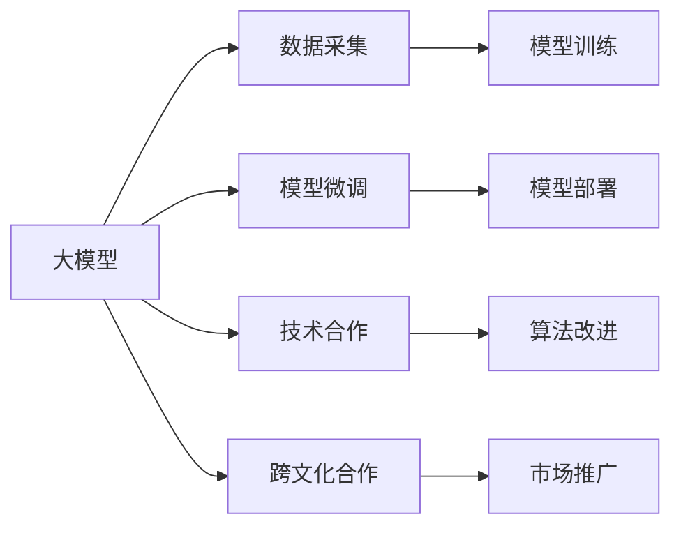

                 

## 1. 背景介绍

### 1.1 问题由来

人工智能大模型（Large AI Models），特别是自然语言处理（NLP）领域的大模型，如OpenAI的GPT、Google的BERT等，在学术界和工业界均取得了突破性进展。这些大模型以其强大的语言理解和生成能力，极大地推动了NLP技术的发展。

然而，大模型的构建和训练需要大量计算资源和数据，而实际应用时，模型的部署和优化也需要大量的资源投入。这使得大模型的商业化和落地应用面临重重困难。特别是在非英语国家，由于数据资源和算力不足，使得大模型在落地应用时，面临更多的挑战。

为了应对这些挑战，越来越多的AI创业公司开始探索利用国际优势，通过国际合作、数据共享、技术交流等方式，降低创业成本，提升大模型性能。本文将介绍几种常见的方式，以及利用国际优势进行AI大模型创业的策略。

### 1.2 问题核心关键点

大模型创业的核心在于如何高效利用国际优势，特别是在数据和算力资源相对匮乏的地区。这需要创业者具备对大模型技术架构、算法原理、数据处理等方面的深刻理解，以及跨文化的沟通和合作能力。

具体来说，国际优势包括：

- 数据优势：利用全球范围内的多语言数据，提高模型的泛化能力。
- 计算优势：借助国际先进的云计算和数据中心，提升模型训练和推理效率。
- 技术优势：与国际领先的学术研究机构和企业合作，获取最新的技术突破。

## 2. 核心概念与联系

### 2.1 核心概念概述

大模型创业涉及的核心概念包括：

- **大模型（Large AI Models）**：指使用深度神经网络构建的，能够处理大规模自然语言数据，具备强大语言理解和生成能力的AI模型。
- **创业（Entrepreneurship）**：指创业者利用自身技术和资源，开发和推广AI大模型，实现商业化应用的过程。
- **国际优势（International Advantage）**：指创业者利用国际上的数据、算力、技术和市场等资源，降低创业成本，提升模型性能。
- **跨文化合作（Cross-cultural Collaboration）**：指不同国家和地区的创业者通过合作，分享数据和算法，实现共同进步。

### 2.2 核心概念原理和架构的 Mermaid 流程图



这个流程图展示了基于国际优势的大模型创业过程：

1. **数据采集**：从全球范围内收集多语言数据。
2. **模型训练**：利用先进计算资源，训练大模型。
3. **模型微调**：根据具体任务需求，对模型进行微调。
4. **模型部署**：将模型部署到实际应用场景中。
5. **技术合作**：与国际领先的学术和企业合作，获取最新技术。
6. **跨文化合作**：与不同国家和地区的创业者合作，共享数据和资源。
7. **市场推广**：将大模型应用到全球市场，实现商业化。

## 3. 核心算法原理 & 具体操作步骤

### 3.1 算法原理概述

大模型创业的核心在于如何高效利用国际优势，提升模型的性能和泛化能力。具体来说，可以利用以下算法原理：

1. **多语言数据采集**：从全球范围内收集多语言数据，提高模型的泛化能力。
2. **分布式训练**：利用云计算平台，进行分布式训练，提升训练效率。
3. **迁移学习**：利用预训练模型，进行迁移学习，加速模型微调。
4. **模型压缩与量化**：通过模型压缩与量化技术，降低模型大小，提高推理速度。
5. **对抗训练**：引入对抗样本，提高模型的鲁棒性和泛化能力。

### 3.2 算法步骤详解

以下是利用国际优势进行大模型创业的具体操作步骤：

1. **数据采集与预处理**：
   - 从全球范围内收集多语言数据，进行数据清洗和预处理。
   - 使用自然语言处理技术，进行分词、词性标注、实体识别等预处理。

2. **模型训练与微调**：
   - 利用分布式训练框架（如PyTorch、TensorFlow），在大规模计算集群上进行模型训练。
   - 选择合适的模型架构和预训练方法，如Transformer、BERT等，进行预训练。
   - 根据具体任务需求，进行模型微调，如通过添加任务适配层，进行分类、匹配等任务的微调。

3. **模型部署与优化**：
   - 将训练好的模型部署到实际应用场景中，如智能客服、金融舆情监测、个性化推荐等。
   - 使用模型压缩与量化技术，降低模型大小，提高推理速度。
   - 进行对抗训练，提高模型的鲁棒性和泛化能力。

4. **技术与市场合作**：
   - 与国际领先的学术研究机构和企业合作，获取最新的技术突破。
   - 通过跨文化合作，与不同国家和地区的创业者共享数据和资源。

5. **市场推广与反馈优化**：
   - 将大模型应用到全球市场，进行市场推广。
   - 收集用户反馈，进行模型优化和迭代。

### 3.3 算法优缺点

利用国际优势进行大模型创业，具有以下优点：

1. **提升模型性能**：通过多语言数据采集和分布式训练，提高模型的泛化能力和训练效率。
2. **降低创业成本**：通过国际合作和数据共享，降低数据采集和计算资源投入。
3. **加速技术迭代**：通过与国际领先的学术和企业合作，获取最新的技术突破。

然而，也存在一些缺点：

1. **数据隐私问题**：跨国数据共享可能涉及隐私和数据安全问题。
2. **文化差异问题**：跨文化合作中，不同国家和地区的文化和语言差异可能影响合作效果。
3. **市场适应性问题**：国际市场的多样性，可能导致大模型在不同地区的效果不一致。

### 3.4 算法应用领域

大模型创业可以应用于多个领域，如：

- **智能客服**：通过多语言数据采集和模型微调，构建智能客服系统，提高客户咨询体验。
- **金融舆情监测**：通过金融领域的多语言数据，进行情感分析和舆情监测。
- **个性化推荐**：通过用户行为数据和商品描述，进行个性化推荐系统开发。
- **医疗诊断**：通过多语言医学数据，进行医学知识图谱构建和智能诊断。

## 4. 数学模型和公式 & 详细讲解 & 举例说明

### 4.1 数学模型构建

大模型创业涉及的数学模型包括：

1. **语言模型**：
   - 假设大模型的输入为序列 $x = (x_1, x_2, ..., x_n)$，输出为标签 $y$。
   - 定义语言模型 $p(y|x)$，表示在给定输入 $x$ 的情况下，输出 $y$ 的概率分布。

2. **预训练模型**：
   - 利用大规模无标签数据，通过自监督学习任务，训练大模型 $M_{\theta}$。
   - 常用的自监督学习任务包括掩码语言模型、下一句预测等。

3. **任务适配模型**：
   - 根据具体任务需求，添加任务适配层，进行微调。
   - 常用的任务适配层包括线性分类器、解码器等。

### 4.2 公式推导过程

以分类任务为例，进行模型微调的公式推导：

1. **输入表示**：
   - 将输入文本 $x$ 转换为模型可以处理的形式，如token ids。
   - 输入表示为 $x \in \mathcal{X}$，其中 $\mathcal{X}$ 为输入空间。

2. **输出表示**：
   - 通过任务适配层，将输入表示映射到输出空间 $\mathcal{Y}$。
   - 输出表示为 $y \in \mathcal{Y}$。

3. **损失函数**：
   - 定义分类任务的损失函数为交叉熵损失函数：
   $$
   \ell(y, M_{\theta}(x)) = -y\log M_{\theta}(x) - (1-y)\log (1-M_{\theta}(x))
   $$
   其中 $M_{\theta}(x)$ 为模型在输入 $x$ 上的输出。

4. **优化算法**：
   - 使用梯度下降等优化算法，最小化损失函数：
   $$
   \theta \leftarrow \theta - \eta \nabla_{\theta}\ell(y, M_{\theta}(x)) - \eta\lambda\theta
   $$
   其中 $\eta$ 为学习率，$\lambda$ 为正则化系数，$\nabla_{\theta}\ell(y, M_{\theta}(x))$ 为损失函数对模型参数 $\theta$ 的梯度。

### 4.3 案例分析与讲解

以智能客服系统为例，分析大模型创业的具体实现：

1. **数据采集**：
   - 从全球范围内收集多语言客服对话数据，进行数据清洗和预处理。
   - 使用自然语言处理技术，进行分词、词性标注、实体识别等预处理。

2. **模型训练**：
   - 利用分布式训练框架，在大规模计算集群上进行模型训练。
   - 使用BERT等预训练模型，进行预训练。
   - 添加分类器作为任务适配层，进行微调。

3. **模型部署**：
   - 将训练好的模型部署到智能客服系统中。
   - 使用模型压缩与量化技术，降低模型大小，提高推理速度。
   - 进行对抗训练，提高模型的鲁棒性和泛化能力。

4. **技术与市场合作**：
   - 与国际领先的学术研究机构和企业合作，获取最新的技术突破。
   - 通过跨文化合作，与不同国家和地区的创业者共享数据和资源。

5. **市场推广与反馈优化**：
   - 将智能客服系统应用到全球市场，进行市场推广。
   - 收集用户反馈，进行模型优化和迭代。

## 5. 项目实践：代码实例和详细解释说明

### 5.1 开发环境搭建

在进行大模型创业项目实践前，我们需要准备好开发环境。以下是使用Python进行PyTorch开发的环境配置流程：

1. 安装Anaconda：从官网下载并安装Anaconda，用于创建独立的Python环境。

2. 创建并激活虚拟环境：
```bash
conda create -n pytorch-env python=3.8 
conda activate pytorch-env
```

3. 安装PyTorch：根据CUDA版本，从官网获取对应的安装命令。例如：
```bash
conda install pytorch torchvision torchaudio cudatoolkit=11.1 -c pytorch -c conda-forge
```

4. 安装Transformers库：
```bash
pip install transformers
```

5. 安装各类工具包：
```bash
pip install numpy pandas scikit-learn matplotlib tqdm jupyter notebook ipython
```

完成上述步骤后，即可在`pytorch-env`环境中开始项目实践。

### 5.2 源代码详细实现

以下是使用Python进行BERT模型微调的PyTorch代码实现。

首先，定义任务适配层：

```python
from transformers import BertForTokenClassification, AdamW

model = BertForTokenClassification.from_pretrained('bert-base-cased', num_labels=len(tag2id))

optimizer = AdamW(model.parameters(), lr=2e-5)
```

然后，定义训练和评估函数：

```python
from torch.utils.data import DataLoader
from tqdm import tqdm
from sklearn.metrics import classification_report

device = torch.device('cuda') if torch.cuda.is_available() else torch.device('cpu')
model.to(device)

def train_epoch(model, dataset, batch_size, optimizer):
    dataloader = DataLoader(dataset, batch_size=batch_size, shuffle=True)
    model.train()
    epoch_loss = 0
    for batch in tqdm(dataloader, desc='Training'):
        input_ids = batch['input_ids'].to(device)
        attention_mask = batch['attention_mask'].to(device)
        labels = batch['labels'].to(device)
        model.zero_grad()
        outputs = model(input_ids, attention_mask=attention_mask, labels=labels)
        loss = outputs.loss
        epoch_loss += loss.item()
        loss.backward()
        optimizer.step()
    return epoch_loss / len(dataloader)

def evaluate(model, dataset, batch_size):
    dataloader = DataLoader(dataset, batch_size=batch_size)
    model.eval()
    preds, labels = [], []
    with torch.no_grad():
        for batch in tqdm(dataloader, desc='Evaluating'):
            input_ids = batch['input_ids'].to(device)
            attention_mask = batch['attention_mask'].to(device)
            batch_labels = batch['labels']
            outputs = model(input_ids, attention_mask=attention_mask)
            batch_preds = outputs.logits.argmax(dim=2).to('cpu').tolist()
            batch_labels = batch_labels.to('cpu').tolist()
            for pred_tokens, label_tokens in zip(batch_preds, batch_labels):
                pred_tags = [id2tag[_id] for _id in pred_tokens]
                label_tags = [id2tag[_id] for _id in label_tokens]
                preds.append(pred_tags[:len(label_tokens)])
                labels.append(label_tags)
                
    print(classification_report(labels, preds))
```

最后，启动训练流程并在测试集上评估：

```python
epochs = 5
batch_size = 16

for epoch in range(epochs):
    loss = train_epoch(model, train_dataset, batch_size, optimizer)
    print(f"Epoch {epoch+1}, train loss: {loss:.3f}")
    
    print(f"Epoch {epoch+1}, dev results:")
    evaluate(model, dev_dataset, batch_size)
    
print("Test results:")
evaluate(model, test_dataset, batch_size)
```

以上就是使用PyTorch对BERT进行命名实体识别(NER)任务微调的完整代码实现。可以看到，得益于Transformers库的强大封装，我们可以用相对简洁的代码完成BERT模型的加载和微调。

### 5.3 代码解读与分析

让我们再详细解读一下关键代码的实现细节：

**NERDataset类**：
- `__init__`方法：初始化文本、标签、分词器等关键组件。
- `__len__`方法：返回数据集的样本数量。
- `__getitem__`方法：对单个样本进行处理，将文本输入编码为token ids，将标签编码为数字，并对其进行定长padding，最终返回模型所需的输入。

**tag2id和id2tag字典**：
- 定义了标签与数字id之间的映射关系，用于将token-wise的预测结果解码回真实的标签。

**训练和评估函数**：
- 使用PyTorch的DataLoader对数据集进行批次化加载，供模型训练和推理使用。
- 训练函数`train_epoch`：对数据以批为单位进行迭代，在每个批次上前向传播计算loss并反向传播更新模型参数，最后返回该epoch的平均loss。
- 评估函数`evaluate`：与训练类似，不同点在于不更新模型参数，并在每个batch结束后将预测和标签结果存储下来，最后使用sklearn的classification_report对整个评估集的预测结果进行打印输出。

**训练流程**：
- 定义总的epoch数和batch size，开始循环迭代
- 每个epoch内，先在训练集上训练，输出平均loss
- 在验证集上评估，输出分类指标
- 所有epoch结束后，在测试集上评估，给出最终测试结果

可以看到，PyTorch配合Transformers库使得BERT微调的代码实现变得简洁高效。开发者可以将更多精力放在数据处理、模型改进等高层逻辑上，而不必过多关注底层的实现细节。

当然，工业级的系统实现还需考虑更多因素，如模型的保存和部署、超参数的自动搜索、更灵活的任务适配层等。但核心的微调范式基本与此类似。

## 6. 实际应用场景

### 6.1 智能客服系统

基于大模型微调的对话技术，可以广泛应用于智能客服系统的构建。传统客服往往需要配备大量人力，高峰期响应缓慢，且一致性和专业性难以保证。而使用微调后的对话模型，可以7x24小时不间断服务，快速响应客户咨询，用自然流畅的语言解答各类常见问题。

在技术实现上，可以收集企业内部的历史客服对话记录，将问题和最佳答复构建成监督数据，在此基础上对预训练对话模型进行微调。微调后的对话模型能够自动理解用户意图，匹配最合适的答案模板进行回复。对于客户提出的新问题，还可以接入检索系统实时搜索相关内容，动态组织生成回答。如此构建的智能客服系统，能大幅提升客户咨询体验和问题解决效率。

### 6.2 金融舆情监测

金融机构需要实时监测市场舆论动向，以便及时应对负面信息传播，规避金融风险。传统的人工监测方式成本高、效率低，难以应对网络时代海量信息爆发的挑战。基于大语言模型微调的文本分类和情感分析技术，为金融舆情监测提供了新的解决方案。

具体而言，可以收集金融领域相关的新闻、报道、评论等文本数据，并对其进行主题标注和情感标注。在此基础上对预训练语言模型进行微调，使其能够自动判断文本属于何种主题，情感倾向是正面、中性还是负面。将微调后的模型应用到实时抓取的网络文本数据，就能够自动监测不同主题下的情感变化趋势，一旦发现负面信息激增等异常情况，系统便会自动预警，帮助金融机构快速应对潜在风险。

### 6.3 个性化推荐系统

当前的推荐系统往往只依赖用户的历史行为数据进行物品推荐，无法深入理解用户的真实兴趣偏好。基于大语言模型微调技术，个性化推荐系统可以更好地挖掘用户行为背后的语义信息，从而提供更精准、多样的推荐内容。

在实践中，可以收集用户浏览、点击、评论、分享等行为数据，提取和用户交互的物品标题、描述、标签等文本内容。将文本内容作为模型输入，用户的后续行为（如是否点击、购买等）作为监督信号，在此基础上微调预训练语言模型。微调后的模型能够从文本内容中准确把握用户的兴趣点。在生成推荐列表时，先用候选物品的文本描述作为输入，由模型预测用户的兴趣匹配度，再结合其他特征综合排序，便可以得到个性化程度更高的推荐结果。

### 6.4 未来应用展望

随着大语言模型和微调方法的不断发展，基于微调范式将在更多领域得到应用，为传统行业带来变革性影响。

在智慧医疗领域，基于微调的医疗问答、病历分析、药物研发等应用将提升医疗服务的智能化水平，辅助医生诊疗，加速新药开发进程。

在智能教育领域，微调技术可应用于作业批改、学情分析、知识推荐等方面，因材施教，促进教育公平，提高教学质量。

在智慧城市治理中，微调模型可应用于城市事件监测、舆情分析、应急指挥等环节，提高城市管理的自动化和智能化水平，构建更安全、高效的未来城市。

此外，在企业生产、社会治理、文娱传媒等众多领域，基于大模型微调的人工智能应用也将不断涌现，为NLP技术带来全新的突破。相信随着预训练语言模型和微调方法的持续演进，大模型微调必将在构建人机协同的智能时代中扮演越来越重要的角色。

## 7. 工具和资源推荐

### 7.1 学习资源推荐

为了帮助开发者系统掌握大语言模型微调的理论基础和实践技巧，这里推荐一些优质的学习资源：

1. 《Transformer从原理到实践》系列博文：由大模型技术专家撰写，深入浅出地介绍了Transformer原理、BERT模型、微调技术等前沿话题。

2. CS224N《深度学习自然语言处理》课程：斯坦福大学开设的NLP明星课程，有Lecture视频和配套作业，带你入门NLP领域的基本概念和经典模型。

3. 《Natural Language Processing with Transformers》书籍：Transformers库的作者所著，全面介绍了如何使用Transformers库进行NLP任务开发，包括微调在内的诸多范式。

4. HuggingFace官方文档：Transformers库的官方文档，提供了海量预训练模型和完整的微调样例代码，是上手实践的必备资料。

5. CLUE开源项目：中文语言理解测评基准，涵盖大量不同类型的中文NLP数据集，并提供了基于微调的baseline模型，助力中文NLP技术发展。

通过对这些资源的学习实践，相信你一定能够快速掌握大语言模型微调的精髓，并用于解决实际的NLP问题。

### 7.2 开发工具推荐

高效的开发离不开优秀的工具支持。以下是几款用于大语言模型微调开发的常用工具：

1. PyTorch：基于Python的开源深度学习框架，灵活动态的计算图，适合快速迭代研究。大部分预训练语言模型都有PyTorch版本的实现。

2. TensorFlow：由Google主导开发的开源深度学习框架，生产部署方便，适合大规模工程应用。同样有丰富的预训练语言模型资源。

3. Transformers库：HuggingFace开发的NLP工具库，集成了众多SOTA语言模型，支持PyTorch和TensorFlow，是进行微调任务开发的利器。

4. Weights & Biases：模型训练的实验跟踪工具，可以记录和可视化模型训练过程中的各项指标，方便对比和调优。与主流深度学习框架无缝集成。

5. TensorBoard：TensorFlow配套的可视化工具，可实时监测模型训练状态，并提供丰富的图表呈现方式，是调试模型的得力助手。

6. Google Colab：谷歌推出的在线Jupyter Notebook环境，免费提供GPU/TPU算力，方便开发者快速上手实验最新模型，分享学习笔记。

合理利用这些工具，可以显著提升大语言模型微调任务的开发效率，加快创新迭代的步伐。

### 7.3 相关论文推荐

大语言模型和微调技术的发展源于学界的持续研究。以下是几篇奠基性的相关论文，推荐阅读：

1. Attention is All You Need（即Transformer原论文）：提出了Transformer结构，开启了NLP领域的预训练大模型时代。

2. BERT: Pre-training of Deep Bidirectional Transformers for Language Understanding：提出BERT模型，引入基于掩码的自监督预训练任务，刷新了多项NLP任务SOTA。

3. Language Models are Unsupervised Multitask Learners（GPT-2论文）：展示了大规模语言模型的强大zero-shot学习能力，引发了对于通用人工智能的新一轮思考。

4. Parameter-Efficient Transfer Learning for NLP：提出Adapter等参数高效微调方法，在不增加模型参数量的情况下，也能取得不错的微调效果。

5. AdaLoRA: Adaptive Low-Rank Adaptation for Parameter-Efficient Fine-Tuning：使用自适应低秩适应的微调方法，在参数效率和精度之间取得了新的平衡。

这些论文代表了大语言模型微调技术的发展脉络。通过学习这些前沿成果，可以帮助研究者把握学科前进方向，激发更多的创新灵感。

## 8. 总结：未来发展趋势与挑战

### 8.1 总结

本文对基于国际优势的大模型创业进行了全面系统的介绍。首先阐述了国际优势在大模型创业中的重要性和具体应用，明确了利用国际优势提升模型性能、降低创业成本的关键点。其次，从原理到实践，详细讲解了基于国际优势的大模型创业过程，包括数据采集、模型训练、微调、部署等关键步骤。最后，介绍了大模型创业的实际应用场景，以及未来发展趋势和面临的挑战。

通过本文的系统梳理，可以看到，利用国际优势进行大模型创业，能够显著提升模型的泛化能力和性能，降低创业成本，加速技术落地。未来，随着大模型和微调技术的不断进步，这种创业模式将更加成熟，为人工智能技术的全球应用带来更多可能性。

### 8.2 未来发展趋势

展望未来，基于国际优势的大模型创业将呈现以下几个发展趋势：

1. **多语言数据资源共享**：随着全球数据资源的共享和流通，大模型将能够更全面地学习多种语言和文化背景下的语言知识和常识。

2. **跨文化合作深化**：国际合作将更加深入，形成全球化的研究和技术生态，加速技术进步和应用推广。

3. **分布式计算优化**：云计算和大数据技术的发展，将使得大模型的分布式计算和优化更加高效。

4. **个性化推荐优化**：基于多语言数据的大模型，能够更深入地挖掘用户兴趣和行为，提供更精准的个性化推荐服务。

5. **跨模态融合**：多语言数据与图像、视频、语音等跨模态数据的融合，将使得大模型具备更全面的智能感知能力。

6. **市场全球化扩展**：大模型创业企业将更加注重全球市场的拓展和本地化适配，提升全球竞争力。

这些趋势凸显了国际优势在大模型创业中的巨大潜力，将推动大模型在全球范围内的应用和发展。

### 8.3 面临的挑战

尽管大模型创业具有广阔的前景，但也面临诸多挑战：

1. **数据隐私和安全**：跨国数据共享涉及隐私和安全问题，如何保障数据安全和用户隐私，是一个重要挑战。

2. **文化差异**：不同国家和地区的文化差异可能影响模型在各地的适用性，需要考虑跨文化适配。

3. **计算资源限制**：大规模计算资源的投入，使得创业成本较高，如何降低计算成本，是一个技术难题。

4. **市场适应性**：不同地区市场的多样性，可能导致大模型在不同地区的效果不一致，需要进行本地化优化。

5. **技术迭代速度**：国际竞争激烈，如何保持技术领先，不断进行技术迭代，是一个长期挑战。

6. **伦理和社会责任**：大模型在应用中可能涉及伦理和社会责任问题，如何确保模型的公平性和公正性，是一个重要课题。

这些挑战需要创业者在技术、市场、伦理等多个维度进行全面考量，才能在大模型创业中取得成功。

### 8.4 研究展望

面对大模型创业面临的挑战，未来的研究需要在以下几个方面寻求新的突破：

1. **隐私保护技术**：开发更高效的数据加密和隐私保护技术，确保跨国数据共享的安全性。

2. **跨文化适配技术**：研究跨文化适配方法，提高大模型在不同地区的适用性。

3. **计算资源优化**：探索更高效的分布式计算和资源优化技术，降低大模型创业的计算成本。

4. **本地化适配技术**：研究本地化适配技术，提高大模型在不同地区的性能。

5. **技术迭代加速**：加强国际合作和开源社区的建设，加速技术迭代和知识共享。

6. **伦理和社会责任**：研究伦理和社会责任评估指标，确保模型的公平性和公正性。

这些研究方向的探索，将引领大模型创业技术迈向更高的台阶，为构建安全、可靠、可解释、可控的智能系统铺平道路。面向未来，大模型创业技术还需要与其他人工智能技术进行更深入的融合，如知识表示、因果推理、强化学习等，多路径协同发力，共同推动自然语言理解和智能交互系统的进步。只有勇于创新、敢于突破，才能不断拓展语言模型的边界，让智能技术更好地造福人类社会。

## 9. 附录：常见问题与解答

**Q1：大模型创业是否适用于所有NLP任务？**

A: 大模型创业在大多数NLP任务上都能取得不错的效果，特别是对于数据量较小的任务。但对于一些特定领域的任务，如医学、法律等，仅仅依靠通用语料预训练的模型可能难以很好地适应。此时需要在特定领域语料上进一步预训练，再进行微调，才能获得理想效果。此外，对于一些需要时效性、个性化很强的任务，如对话、推荐等，微调方法也需要针对性的改进优化。

**Q2：如何选择合适的学习率？**

A: 大模型创业中的学习率一般要比预训练时小1-2个数量级，如果使用过大的学习率，容易破坏预训练权重，导致过拟合。一般建议从1e-5开始调参，逐步减小学习率，直至收敛。也可以使用warmup策略，在开始阶段使用较小的学习率，再逐渐过渡到预设值。需要注意的是，不同的优化器(如AdamW、Adafactor等)以及不同的学习率调度策略，可能需要设置不同的学习率阈值。

**Q3：采用大模型创业时会面临哪些资源瓶颈？**

A: 目前主流的预训练大模型动辄以亿计的参数规模，对算力、内存、存储都提出了很高的要求。GPU/TPU等高性能设备是必不可少的，但即便如此，超大批次的训练和推理也可能遇到显存不足的问题。因此需要采用一些资源优化技术，如梯度积累、混合精度训练、模型并行等，来突破硬件瓶颈。同时，模型的存储和读取也可能占用大量时间和空间，需要采用模型压缩、稀疏化存储等方法进行优化。

**Q4：如何缓解微调过程中的过拟合问题？**

A: 过拟合是微调面临的主要挑战，尤其是在标注数据不足的情况下。常见的缓解策略包括：
1. 数据增强：通过回译、近义替换等方式扩充训练集
2. 正则化：使用L2正则、Dropout、Early Stopping等避免过拟合
3. 对抗训练：引入对抗样本，提高模型鲁棒性
4. 参数高效微调：只调整少量参数(如Adapter、Prefix等)，减小过拟合风险
5. 多模型集成：训练多个微调模型，取平均输出，抑制过拟合

这些策略往往需要根据具体任务和数据特点进行灵活组合。只有在数据、模型、训练、推理等各环节进行全面优化，才能最大限度地发挥大模型微调的威力。

**Q5：大模型创业如何在全球市场推广？**

A: 大模型创业在推广时，需要考虑以下几个方面：
1. 本地化适配：根据不同地区市场特点，进行本地化适配，确保模型性能。
2. 多语言支持：提供多语言版本，适应全球市场。
3. 多渠道推广：利用社交媒体、搜索引擎、应用市场等多渠道进行推广。
4. 客户支持：提供完善的客户支持，帮助客户快速上手。
5. 市场分析：进行市场分析，了解客户需求，优化产品和服务。

通过这些策略，大模型创业企业可以更有效地将模型推广到全球市场，实现商业化应用。

---

作者：禅与计算机程序设计艺术 / Zen and the Art of Computer Programming

