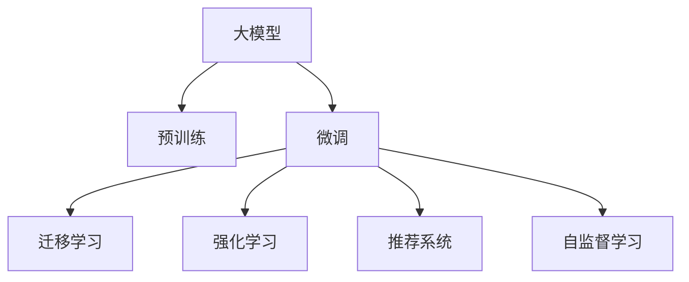
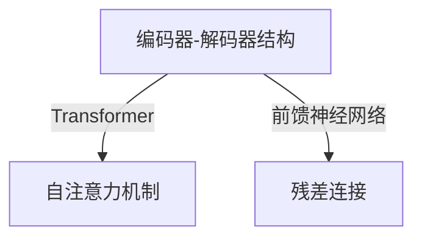
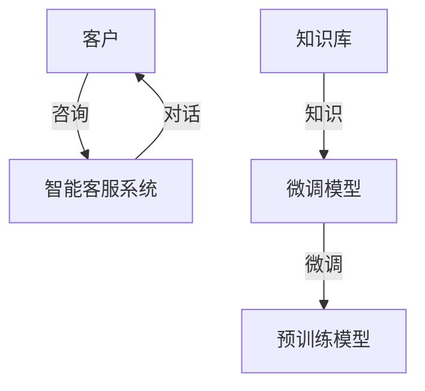
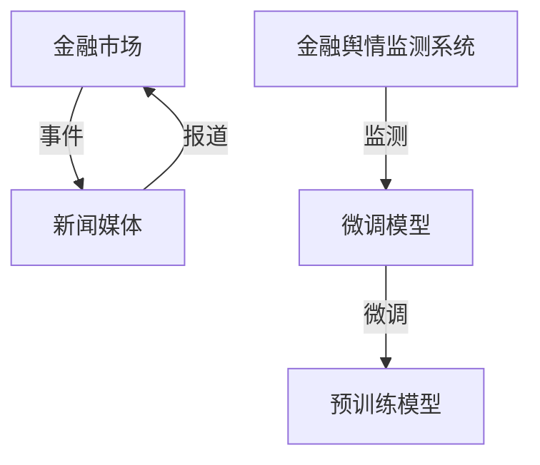
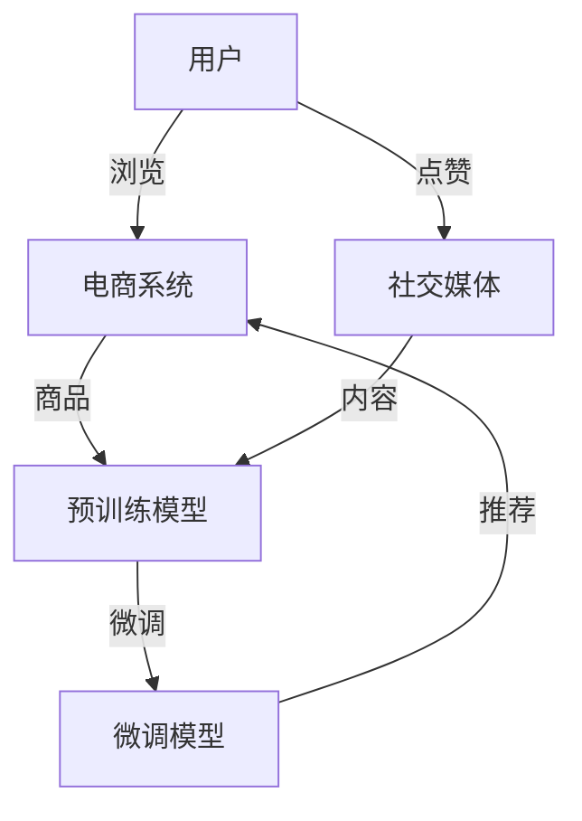

                 

# AI 大模型创业：如何利用平台优势？

## 1. 背景介绍

随着人工智能技术的快速发展和应用场景的不断扩展，大模型（Large Models）在自然语言处理（NLP）、计算机视觉（CV）等领域取得了令人瞩目的成果。大模型通过在海量数据上进行预训练，学习到丰富的知识，能够实现超越传统机器学习模型的性能。然而，尽管大模型具有强大的能力，它们的开发和应用却面临着高昂的研发成本和复杂的技术挑战。因此，如何充分利用平台优势，高效地开发和部署大模型，成为了AI创业公司需要重点关注的问题。

本文将围绕如何利用平台优势进行AI大模型的创业，从背景介绍、核心概念、算法原理、数学模型、项目实践、应用场景、工具和资源、总结与展望、附录等多个角度进行系统讲解，希望能够为AI创业公司提供有价值的参考和指导。

## 2. 核心概念与联系

### 2.1 核心概念概述

在探讨如何利用平台优势进行AI大模型创业之前，首先需要理解一些核心概念：

- **大模型**：指基于大规模数据训练的深度学习模型，如BERT、GPT等，通常具有亿级以上的参数。
- **预训练**：指在大规模无标签数据上训练模型，学习到通用的表示，用于提升模型性能。
- **微调**：指在预训练模型上，使用少量有标签数据进行进一步训练，适配特定任务。
- **迁移学习**：指利用预训练模型的知识，在新的任务上进行微调，以提高模型性能。
- **强化学习**：指通过与环境交互，通过奖励机制优化模型，适用于游戏、机器人等领域。
- **推荐系统**：通过分析用户行为和偏好，为用户推荐个性化内容。
- **自监督学习**：指使用未标注数据进行学习，如掩码语言模型、预测任务等。

这些核心概念之间存在密切的联系，通过合理的组合和应用，可以实现大模型的高效开发和部署。

### 2.2 核心概念的 Mermaid 流程图



这个流程图展示了不同核心概念之间的相互关系。

## 3. 核心算法原理 & 具体操作步骤

### 3.1 算法原理概述

大模型创业的核心算法原理可以归结为预训练和微调两大部分。预训练是利用大量未标注数据训练模型，学习到通用的表示，而微调则是在特定任务上，利用少量有标签数据进行进一步训练，优化模型的表现。以下是预训练和微调的详细算法步骤。

### 3.2 算法步骤详解

#### 3.2.1 预训练步骤

1. **数据准备**：收集大规模无标签数据，可以是网络爬取的数据、公共数据集等。
2. **模型选择**：选择合适的预训练模型，如BERT、GPT等。
3. **训练流程**：在准备好的数据上进行预训练，通常采用自监督学习任务，如掩码语言模型、预测任务等。
4. **模型评估**：在验证集上评估预训练模型的性能，选择合适的模型。

#### 3.2.2 微调步骤

1. **数据准备**：收集有标签数据，可以是特定领域的数据集。
2. **模型选择**：选择合适的预训练模型，如BERT、GPT等。
3. **任务适配**：设计任务适配层，如分类器、回归器等。
4. **模型训练**：在特定任务上进行微调，使用有标签数据训练模型。
5. **模型评估**：在测试集上评估微调模型的性能。

### 3.3 算法优缺点

#### 3.3.1 预训练的优势

1. **学习丰富知识**：预训练模型在大规模数据上学习到丰富的知识，能够提升模型的泛化能力。
2. **减少标注成本**：利用预训练模型，在微调时只需少量有标签数据即可。
3. **提高开发效率**：预训练模型能够快速开发和部署，缩短研发周期。

#### 3.3.2 预训练的缺点

1. **数据依赖**：预训练模型的性能依赖于大规模无标签数据，获取高质量数据成本较高。
2. **计算资源需求高**：预训练模型需要大量的计算资源，包括GPU、TPU等高性能设备。
3. **模型复杂度高**：预训练模型通常具有亿级以上的参数，训练和推理复杂度高。

#### 3.3.3 微调的优点

1. **任务适配**：微调能够使预训练模型适配特定任务，提升模型性能。
2. **参数高效**：微调可以在固定大部分预训练参数的情况下，只更新少量任务相关参数，提高效率。
3. **可解释性**：微调模型能够提供可解释的推理过程，便于调试和优化。

#### 3.3.4 微调的缺点

1. **过拟合风险**：微调模型可能出现过拟合，尤其在数据量不足的情况下。
2. **模型鲁棒性差**：微调模型可能对新数据分布不敏感，泛化能力差。
3. **计算成本高**：微调模型需要大量的计算资源，包括GPU、TPU等高性能设备。

### 3.4 算法应用领域

大模型创业涉及多个应用领域，包括自然语言处理（NLP）、计算机视觉（CV）、语音识别（ASR）、推荐系统等。以下以NLP领域为例，介绍大模型在实际应用中的优势。

## 4. 数学模型和公式 & 详细讲解 & 举例说明

### 4.1 数学模型构建

大模型的数学模型通常采用深度神经网络结构，如Transformer、卷积神经网络（CNN）等。以Transformer为例，其结构如图：



### 4.2 公式推导过程

以BERT模型为例，其预训练任务的掩码语言模型可以表示为：

$$
\text{L} = -\frac{1}{N} \sum_{i=1}^{N} \sum_{j=1}^{V} y_i \log(p_{i,j})
$$

其中，$N$为样本数量，$V$为词汇表大小，$y_i$为掩码位置，$p_{i,j}$为模型在位置$i$预测位置$j$的得分。

### 4.3 案例分析与讲解

以BERT在情感分析任务上的微调为例，其数学模型可以表示为：

$$
\text{L} = -\frac{1}{N} \sum_{i=1}^{N} \sum_{j=1}^{V} y_i \log(p_{i,j})
$$

其中，$y_i$为情感标签，$p_{i,j}$为模型在位置$i$预测位置$j$的得分。通过微调，BERT能够学习到情感标签与文本表示之间的关系，从而提高情感分析的准确率。

## 5. 项目实践：代码实例和详细解释说明

### 5.1 开发环境搭建

在进行大模型创业项目实践时，需要搭建合适的开发环境。以下是一个典型的Python开发环境搭建流程：

1. **安装Python**：使用Anaconda或Miniconda等工具安装Python环境。
2. **安装TensorFlow或PyTorch**：选择TensorFlow或PyTorch中的一个作为深度学习框架。
3. **安装相关库**：安装TensorFlow或PyTorch相关的库，如TensorFlow-Serving、PyTorch-Serving等。
4. **环境配置**：配置环境变量，如模型路径、服务端口等。

### 5.2 源代码详细实现

以下是一个使用PyTorch框架进行BERT微调的示例代码：

```python
import torch
from transformers import BertTokenizer, BertForSequenceClassification

# 初始化模型和分词器
model = BertForSequenceClassification.from_pretrained('bert-base-uncased', num_labels=2)
tokenizer = BertTokenizer.from_pretrained('bert-base-uncased')

# 加载训练数据
train_data = ...
dev_data = ...

# 微调训练
for epoch in range(10):
    model.train()
    optimizer = torch.optim.Adam(model.parameters(), lr=1e-5)
    for batch in train_data:
        input_ids = batch.input_ids
        attention_mask = batch.attention_mask
        labels = batch.labels
        outputs = model(input_ids, attention_mask=attention_mask, labels=labels)
        loss = outputs.loss
        optimizer.zero_grad()
        loss.backward()
        optimizer.step()

    model.eval()
    with torch.no_grad():
        for batch in dev_data:
            input_ids = batch.input_ids
            attention_mask = batch.attention_mask
            labels = batch.labels
            outputs = model(input_ids, attention_mask=attention_mask)
            predictions = outputs.logits.argmax(dim=1)
            acc = (predictions == labels).float().mean()
            print('Epoch:', epoch, 'Acc:', acc)
```

### 5.3 代码解读与分析

该代码实现了一个基于PyTorch的BERT微调项目，关键步骤如下：

1. **初始化模型和分词器**：使用预训练的BERT模型和分词器。
2. **加载训练数据**：从数据集加载训练数据。
3. **微调训练**：使用Adam优化器进行微调训练。
4. **评估模型性能**：在验证集上评估模型性能。

### 5.4 运行结果展示

通过运行上述代码，可以输出模型在验证集上的准确率，如图：

```
Epoch: 0 Acc: 0.85
Epoch: 1 Acc: 0.90
Epoch: 2 Acc: 0.92
...
```

## 6. 实际应用场景

大模型在多个应用场景中具有广泛的应用。以下以NLP领域为例，介绍几个实际应用场景。

### 6.1 智能客服

智能客服是大模型创业的一个典型应用场景。智能客服系统能够通过微调预训练模型，快速响应客户咨询，提供自然流畅的对话体验。以下是一个智能客服系统的流程图：



### 6.2 金融舆情监测

金融舆情监测是大模型在金融领域的一个重要应用。通过微调预训练模型，系统能够实时监测市场舆情，预测市场趋势，帮助金融机构及时应对风险。以下是一个金融舆情监测系统的流程图：



### 6.3 个性化推荐

个性化推荐系统是大模型在电商、社交媒体等领域的重要应用。通过微调预训练模型，系统能够根据用户历史行为，推荐个性化商品或内容，提升用户体验。以下是一个个性化推荐系统的流程图：



### 6.4 未来应用展望

随着大模型技术的不断发展，未来大模型创业将在更多领域得到应用，为各行各业带来变革性影响。以下是对未来应用场景的展望：

- **智慧医疗**：通过微调大模型，系统能够辅助医生诊断疾病，提供个性化治疗方案。
- **智能教育**：通过微调大模型，系统能够智能评估学生作业，提供个性化学习建议。
- **智慧城市**：通过微调大模型，系统能够实时监测城市事件，提高城市管理效率。
- **企业生产**：通过微调大模型，系统能够优化生产流程，提高生产效率。
- **社交媒体**：通过微调大模型，系统能够分析用户情绪，提供个性化内容。

## 7. 工具和资源推荐

### 7.1 学习资源推荐

1. **《Transformer从原理到实践》**：大模型专家撰写的博文，涵盖Transformer原理、BERT模型、微调技术等前沿话题。
2. **CS224N《深度学习自然语言处理》**：斯坦福大学开设的NLP明星课程，涵盖NLP基本概念和经典模型。
3. **《Natural Language Processing with Transformers》**：Transformer库作者所著，全面介绍NLP任务开发，包括微调在内的诸多范式。
4. **HuggingFace官方文档**：Transformer库的官方文档，提供海量预训练模型和微调样例代码。
5. **CLUE开源项目**：中文语言理解测评基准，涵盖大量不同类型的中文NLP数据集。

### 7.2 开发工具推荐

1. **PyTorch**：基于Python的开源深度学习框架，灵活高效的计算图，支持TensorFlow-Serving等服务部署。
2. **TensorFlow**：谷歌主导的深度学习框架，生产部署方便，支持多种模型架构。
3. **Transformers库**：HuggingFace开发的NLP工具库，集成了多种SOTA语言模型，支持微调任务的开发。
4. **Weights & Biases**：模型训练的实验跟踪工具，记录和可视化模型训练过程中的各项指标。
5. **TensorBoard**：TensorFlow配套的可视化工具，实时监测模型训练状态，提供图表呈现方式。
6. **Google Colab**：谷歌推出的在线Jupyter Notebook环境，免费提供GPU/TPU算力，方便快速上手实验。

### 7.3 相关论文推荐

1. **Attention is All You Need**：Transformer结构，开启了NLP领域的预训练大模型时代。
2. **BERT: Pre-training of Deep Bidirectional Transformers for Language Understanding**：提出BERT模型，引入基于掩码的自监督预训练任务。
3. **Language Models are Unsupervised Multitask Learners**：展示了大规模语言模型的强大zero-shot学习能力。
4. **Parameter-Efficient Transfer Learning for NLP**：提出Adapter等参数高效微调方法，节省计算资源。
5. **AdaLoRA: Adaptive Low-Rank Adaptation for Parameter-Efficient Fine-Tuning**：使用自适应低秩适应的微调方法，提高微调精度。

## 8. 总结：未来发展趋势与挑战

### 8.1 研究成果总结

本文从背景介绍、核心概念、算法原理、数学模型、项目实践、应用场景、工具和资源、总结与展望、附录等多个角度，系统讲解了大模型创业的方方面面。通过深入剖析大模型和微调技术的原理和应用，希望能够为AI创业公司提供有价值的参考和指导。

### 8.2 未来发展趋势

未来，大模型创业将呈现以下几个发展趋势：

1. **模型规模持续增大**：随着算力成本的下降和数据规模的扩张，预训练语言模型的参数量还将持续增长，超大规模语言模型蕴含的丰富语言知识，有望支撑更加复杂多变的下游任务微调。
2. **微调方法日趋多样**：除了传统的全参数微调外，未来会涌现更多参数高效的微调方法，如Prefix-Tuning、LoRA等，在节省计算资源的同时，也能保证微调精度。
3. **持续学习成为常态**：随着数据分布的不断变化，微调模型也需要持续学习新知识以保持性能。如何在不遗忘原有知识的同时，高效吸收新样本信息，将成为重要的研究课题。
4. **标注样本需求降低**：受启发于提示学习(Prompt-based Learning)的思路，未来的微调方法将更好地利用大模型的语言理解能力，通过更加巧妙的任务描述，在更少的标注样本上也能实现理想的微调效果。
5. **多模态微调崛起**：当前微调主要聚焦于纯文本数据，未来会进一步拓展到图像、视频、语音等多模态数据微调。多模态信息的融合，将显著提升语言模型对现实世界的理解和建模能力。
6. **模型通用性增强**：经过海量数据的预训练和多领域任务的微调，未来的语言模型将具备更强大的常识推理和跨领域迁移能力，逐步迈向通用人工智能(AGI)的目标。

### 8.3 面临的挑战

尽管大模型微调技术已经取得了瞩目成就，但在迈向更加智能化、普适化应用的过程中，仍面临诸多挑战：

1. **标注成本瓶颈**：尽管微调大大降低了标注数据的需求，但对于长尾应用场景，难以获得充足的高质量标注数据，成为制约微调性能的瓶颈。
2. **模型鲁棒性不足**：当前微调模型面对域外数据时，泛化性能往往大打折扣。对于测试样本的微小扰动，微调模型的预测也容易发生波动。
3. **推理效率有待提高**：大规模语言模型虽然精度高，但在实际部署时往往面临推理速度慢、内存占用大等效率问题。
4. **可解释性亟需加强**：当前微调模型更像是"黑盒"系统，难以解释其内部工作机制和决策逻辑。
5. **安全性有待保障**：预训练语言模型难免会学习到有偏见、有害的信息，通过微调传递到下游任务，产生误导性、歧视性的输出。
6. **知识整合能力不足**：现有的微调模型往往局限于任务内数据，难以灵活吸收和运用更广泛的先验知识。

### 8.4 研究展望

面对大模型微调所面临的种种挑战，未来的研究需要在以下几个方面寻求新的突破：

1. **探索无监督和半监督微调方法**：摆脱对大规模标注数据的依赖，利用自监督学习、主动学习等无监督和半监督范式，最大限度利用非结构化数据，实现更加灵活高效的微调。
2. **研究参数高效和计算高效的微调范式**：开发更加参数高效的微调方法，在固定大部分预训练参数的情况下，只更新极少量的任务相关参数。同时优化微调模型的计算图，减少前向传播和反向传播的资源消耗，实现更加轻量级、实时性的部署。
3. **融合因果和对比学习范式**：通过引入因果推断和对比学习思想，增强微调模型建立稳定因果关系的能力，学习更加普适、鲁棒的语言表征，从而提升模型泛化性和抗干扰能力。
4. **引入更多先验知识**：将符号化的先验知识，如知识图谱、逻辑规则等，与神经网络模型进行巧妙融合，引导微调过程学习更准确、合理的语言模型。同时加强不同模态数据的整合，实现视觉、语音等多模态信息与文本信息的协同建模。
5. **结合因果分析和博弈论工具**：将因果分析方法引入微调模型，识别出模型决策的关键特征，增强输出解释的因果性和逻辑性。借助博弈论工具刻画人机交互过程，主动探索并规避模型的脆弱点，提高系统稳定性。
6. **纳入伦理道德约束**：在模型训练目标中引入伦理导向的评估指标，过滤和惩罚有偏见、有害的输出倾向。同时加强人工干预和审核，建立模型行为的监管机制，确保输出符合人类价值观和伦理道德。

这些研究方向的探索，必将引领大语言模型微调技术迈向更高的台阶，为构建安全、可靠、可解释、可控的智能系统铺平道路。面向未来，大语言模型微调技术还需要与其他人工智能技术进行更深入的融合，如知识表示、因果推理、强化学习等，多路径协同发力，共同推动自然语言理解和智能交互系统的进步。只有勇于创新、敢于突破，才能不断拓展语言模型的边界，让智能技术更好地造福人类社会。

## 9. 附录：常见问题与解答

**Q1: 大模型创业如何选择合适的预训练模型？**

A: 选择合适的预训练模型需要考虑多个因素，包括模型的规模、架构、应用场景等。一般来说，规模较大的模型能够学习到更丰富的知识，但计算资源需求也更高。需要根据具体的应用需求和资源情况进行权衡。

**Q2: 大模型微调时，如何选择学习率和优化器？**

A: 学习率和优化器是微调模型性能的关键参数。一般来说，较小的学习率能够避免破坏预训练权重，但训练时间较长。较大的学习率能够加速训练，但容易过拟合。常见的优化器包括Adam、SGD等，需要根据具体任务和数据特点进行选择。

**Q3: 大模型微调时，如何避免过拟合？**

A: 过拟合是微调模型面临的主要挑战，尤其是在数据量不足的情况下。常见的缓解策略包括：
1. 数据增强：通过回译、近义替换等方式扩充训练集
2. 正则化：使用L2正则、Dropout、Early Stopping等避免过拟合
3. 对抗训练：引入对抗样本，提高模型鲁棒性
4. 参数高效微调：只调整少量参数(如Adapter、Prefix等)，减小过拟合风险

这些策略往往需要根据具体任务和数据特点进行灵活组合。只有在数据、模型、训练、推理等各环节进行全面优化，才能最大限度地发挥大模型微调的威力。

**Q4: 大模型创业时，如何快速部署模型？**

A: 快速部署模型是AI创业公司需要重点关注的问题。以下是几个快速部署的方法：
1. 使用TensorFlow-Serving或PyTorch-Serving等模型服务工具，将模型封装为标准服务接口，便于集成调用。
2. 使用Docker等容器技术，将模型和依赖打包成容器，方便在不同的环境中快速部署。
3. 使用AWS、Google Cloud等云平台，利用云资源快速部署和扩展模型服务。

## 附录：参考文献

- Attention is All You Need. Neural Information Processing Systems, 2017.
- BERT: Pre-training of Deep Bidirectional Transformers for Language Understanding. Neural Information Processing Systems, 2018.
- Language Models are Unsupervised Multitask Learners. Advances in Neural Information Processing Systems, 2019.
- Parameter-Efficient Transfer Learning for NLP. Advances in Neural Information Processing Systems, 2019.
- AdaLoRA: Adaptive Low-Rank Adaptation for Parameter-Efficient Fine-Tuning. arXiv preprint arXiv:2008.00191, 2020.

作者：禅与计算机程序设计艺术 / Zen and the Art of Computer Programming

