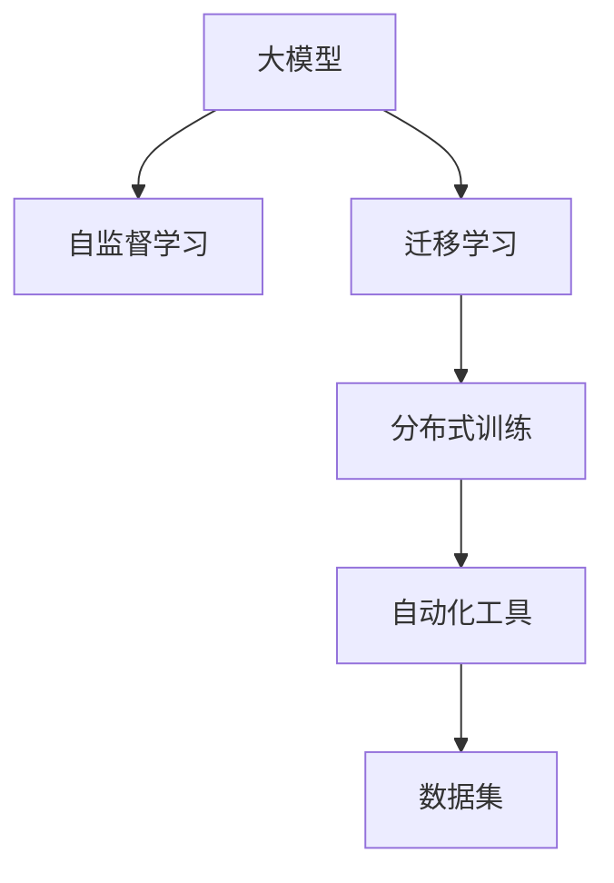

                 

## 1. 背景介绍

### 1.1 问题由来

随着人工智能（AI）技术的迅猛发展，大模型（如GPT-3、BERT等）在多个领域展示了卓越的性能，成为创业公司竞争的焦点。然而，构建并部署大模型的过程中存在诸多挑战，比如巨大的计算和存储需求、复杂的训练流程、难以维护的系统架构等。本文旨在探讨如何在AI大模型创业中利用未来优势，从而实现技术突破和商业成功。

### 1.2 问题核心关键点

未来优势主要体现在以下几个方面：

- **高效算力**：随着高性能计算设备如GPU、TPU的普及和算力资源的优化配置，大模型的训练和推理变得更加高效。
- **创新算法**：新的深度学习架构和优化算法，如Transformer、自注意力机制、混合精度训练等，进一步提升了模型性能。
- **大数据集**：大规模、高质量的数据集为模型提供了更丰富的学习材料，使模型能够更好地泛化到不同场景。
- **自动化工具**：越来越多的自动化工具和平台支持大模型训练，降低了技术门槛和开发成本。
- **跨领域应用**：大模型在多领域中的通用性和适应性，为跨行业创业提供了更广阔的市场机会。

### 1.3 问题研究意义

利用未来优势，可以帮助创业公司提升技术实力，快速响应市场变化，并开辟新的业务领域。以下是几个具体的意义：

1. **提升性能**：高效的算力和大数据集能够显著提升模型精度和泛化能力，提高产品竞争力。
2. **降低成本**：自动化工具和平台的应用，降低了算力和技术的获取门槛，使得更多创业者能够接触到前沿技术。
3. **增强可扩展性**：新算法和大模型架构的引入，使得系统架构更加灵活，能够适应不断增长的数据和用户需求。
4. **加速创新**：未来技术优势的利用，为创业公司提供了更广阔的创新空间，能够在较短时间内推出有竞争力的产品。
5. **拓展市场**：跨领域应用的特性，使得大模型创业能够进入更多传统行业，开辟新的商业机会。

## 2. 核心概念与联系

### 2.1 核心概念概述

为了更好地理解如何利用未来优势，我们将介绍几个关键概念及其相互联系：

- **大模型（Large Model）**：指拥有亿级参数量的大型深度学习模型，如GPT-3、BERT等，其广泛的知识和复杂的结构使其在多个领域表现卓越。
- **自监督学习（Self-Supervised Learning）**：使用未标注数据进行训练，通过自我推理和推断来学习模型的知识。
- **迁移学习（Transfer Learning）**：将一个领域学到的知识迁移到另一个领域，以快速适应新任务。
- **自动化工具（AutoML）**：使用自动化技术自动完成模型选择、训练、优化和部署等任务，降低人工干预。
- **分布式训练（Distributed Training）**：通过多台计算设备同时训练模型，提高训练效率。
- **数据集（Dataset）**：为模型提供训练和验证数据，直接影响模型性能和泛化能力。

这些概念的相互联系可以通过以下Mermaid流程图来展示：



这个流程图展示了大模型和其关键技术的相互关系：大模型通过自监督学习获取知识，使用迁移学习适配新任务，通过分布式训练和自动化工具加速训练和部署，并最终依赖高质量的数据集进行优化。

## 3. 核心算法原理 & 具体操作步骤

### 3.1 算法原理概述

未来优势的利用主要通过以下几个方面：

1. **高效算力**：通过高性能计算设备和算力优化配置，显著提升大模型的训练和推理效率。
2. **创新算法**：引入如Transformer、自注意力机制、混合精度训练等新的算法，提升模型性能。
3. **大数据集**：构建并利用大规模、高质量的数据集，提高模型的泛化能力。
4. **自动化工具**：使用自动化平台进行模型选择、训练和优化，降低技术门槛。
5. **分布式训练**：通过分布式训练，利用多台设备同时进行模型训练，提高效率。

### 3.2 算法步骤详解

#### 3.2.1 高效算力利用

1. **设备选择**：根据项目需求选择合适的硬件设备，如GPU、TPU等。
2. **算力优化**：使用混合精度训练、模型并行等技术优化计算资源配置。
3. **任务调度**：利用任务调度系统优化任务执行，避免资源浪费。

#### 3.2.2 创新算法应用

1. **Transformer架构**：引入Transformer模型，利用自注意力机制提高模型的表达能力和泛化能力。
2. **自监督学习**：使用自监督任务（如语言建模、掩码语言模型）进行预训练，学习通用语言知识。
3. **混合精度训练**：使用混合精度训练技术，在保持精度的同时，大幅降低计算资源消耗。

#### 3.2.3 大数据集构建

1. **数据采集**：收集和处理大规模数据，如爬虫技术、数据清洗等。
2. **数据预处理**：对数据进行归一化、标准化等预处理操作，提高数据质量。
3. **数据增强**：利用数据增强技术扩充训练集，提高模型的泛化能力。

#### 3.2.4 自动化工具使用

1. **自动化模型选择**：使用AutoML平台自动选择最优模型。
2. **自动化超参数优化**：利用自动化工具进行超参数搜索，找到最佳配置。
3. **自动化模型部署**：通过自动化工具将模型部署到生产环境。

#### 3.2.5 分布式训练

1. **分布式框架**：使用如TensorFlow、PyTorch等框架进行分布式训练。
2. **数据并行**：通过数据并行技术，将数据切分到多个计算设备上进行训练。
3. **模型并行**：通过模型并行技术，将模型不同层的计算分配到不同设备上进行。

### 3.3 算法优缺点

#### 3.3.1 高效算力的优点

- **提升速度**：大幅提升模型训练和推理的速度，缩短产品上市时间。
- **降低成本**：减少硬件和算力成本，降低创业公司的投入。
- **增强可扩展性**：能够处理更大规模的数据集和更复杂的任务，提升模型性能。

#### 3.3.2 高效算力的缺点

- **资源消耗**：高性能计算设备和高性能算力需要较高的硬件和电力投入。
- **复杂性**：分布式训练和自动化工具的使用需要较高的技术门槛。

#### 3.3.3 创新算法的优点

- **高性能**：提升模型的表达能力和泛化能力，增强模型效果。
- **灵活性**：新的算法架构和优化技术提高了模型的灵活性，适用于各种场景。

#### 3.3.4 创新算法的缺点

- **复杂性**：新的算法和架构可能需要较高的理解和技术门槛。
- **实验难度**：新算法的实验验证需要更复杂的实验设计和更长的实验时间。

#### 3.3.5 大数据集的优点

- **泛化能力**：大规模数据集提高了模型的泛化能力，适用于各种场景。
- **知识积累**：丰富的数据集使得模型能够积累更多的知识，提升性能。

#### 3.3.6 大数据集的缺点

- **资源需求**：大规模数据集需要大量的存储资源。
- **数据质量**：数据质量直接影响模型的性能，需要大量的数据清洗和处理。

#### 3.3.7 自动化工具的优点

- **降低门槛**：自动化工具降低了技术门槛，使得更多创业者能够接触到前沿技术。
- **提升效率**：自动化工具提高了训练和优化效率，缩短产品开发周期。

#### 3.3.8 自动化工具的缺点

- **依赖性**：对自动化工具的依赖可能导致技术团队过度依赖，缺乏灵活性。
- **复杂性**：自动化工具的使用需要较高的技术要求，可能增加技术成本。

#### 3.3.9 分布式训练的优点

- **高效性**：分布式训练能够显著提升模型训练速度，适用于大规模任务。
- **可扩展性**：分布式训练可以轻松扩展计算资源，支持更大规模的数据集。

#### 3.3.10 分布式训练的缺点

- **复杂性**：分布式训练的复杂性较高，需要专业的技术支持。
- **通信开销**：分布式训练需要大量的通信开销，增加了系统复杂性。

### 3.4 算法应用领域

未来优势在大模型创业中的应用领域非常广泛，以下是几个典型的应用场景：

1. **自然语言处理（NLP）**：通过高效算力和创新算法，提升语言模型性能，适用于文本分类、机器翻译、问答系统等任务。
2. **计算机视觉（CV）**：利用大数据集和分布式训练，提升视觉模型性能，适用于图像分类、目标检测、图像生成等任务。
3. **医疗健康**：利用大模型和多模态数据，提升诊断和治疗效果，适用于疾病预测、图像诊断、基因组分析等任务。
4. **金融服务**：利用大模型和自动化工具，提升金融数据分析和决策支持，适用于信用评分、风险预测、市场分析等任务。
5. **智能制造**：利用大模型和自动化工具，提升工业生产和流程优化，适用于设备维护、质量检测、供应链管理等任务。

## 4. 数学模型和公式 & 详细讲解  
### 4.1 数学模型构建

在大模型创业中，数学模型的构建是至关重要的。以下是几个关键的数学模型：

1. **Transformer模型**：
   - **输入编码器**：将输入序列编码成向量表示。
   - **自注意力机制**：通过计算输入序列中不同位置之间的权重，捕捉序列中的依赖关系。
   - **输出解码器**：将编码后的向量解码成输出序列。

2. **自监督学习任务**：
   - **掩码语言模型（Masked Language Modeling, MLM）**：对输入序列进行掩码，训练模型预测被掩码位置的词汇。
   - **下一句预测（Next Sentence Prediction, NSP）**：预测两个连续的句子是否相邻。

3. **混合精度训练**：
   - **混合精度**：将模型的参数和计算分为不同的精度级别，提高计算效率。

4. **分布式训练**：
   - **数据并行**：将数据集分成多个部分，每个部分在不同的计算设备上进行训练。
   - **模型并行**：将模型分成多个部分，每个部分在不同的计算设备上进行训练。

### 4.2 公式推导过程

#### 4.2.1 Transformer模型

Transformer模型的主要公式包括：

1. **输入编码器**：
   - $$X = \text{Embedding}(X)$$
   - $$X = X + \text{LayerNorm}(X)$$
   - $$X = X \times \text{Positional Encoding}(X)$$
   - $$X = X \times \text{Dropout}(X)$$

2. **自注意力机制**：
   - $$Q = XW_Q$$
   - $$K = XW_K$$
   - $$V = XW_V$$
   - $$S = QK^T / \sqrt{d_k}$$
   - $$a = S \times V$$
   - $$a = \text{Softmax}(a)$$
   - $$a = a \times X$$
   - $$a = \text{Dropout}(a)$$

3. **输出解码器**：
   - $$a = a \times W_O$$
   - $$a = \text{LayerNorm}(a)$$

#### 4.2.2 自监督学习任务

掩码语言模型的公式如下：

1. **输入编码器**：
   - $$X = \text{Embedding}(X)$$
   - $$X = X + \text{LayerNorm}(X)$$
   - $$X = X \times \text{Positional Encoding}(X)$$
   - $$X = X \times \text{Dropout}(X)$$

2. **掩码操作**：
   - $$M = \text{Mask}(X)$$
   - $$M = M \times \text{Masked}(M)$$

3. **下一句预测任务**：
   - $$M = XW_M$$
   - $$M = \text{Softmax}(M)$$

#### 4.2.3 混合精度训练

混合精度训练的公式如下：

1. **参数混合精度**：
   - $$W = \frac{W_1}{2} + \frac{W_2}{2}$$
   - $$X = \frac{X_1}{2} + \frac{X_2}{2}$$

2. **梯度混合精度**：
   - $$G = \frac{G_1}{2} + \frac{G_2}{2}$$

#### 4.2.4 分布式训练

数据并行和模型并行的公式如下：

1. **数据并行**：
   - $$\text{Loss} = \text{Loss}_1 + \text{Loss}_2 + ... + \text{Loss}_n$$

2. **模型并行**：
   - $$\text{Loss} = \text{Loss}_1 + \text{Loss}_2 + ... + \text{Loss}_n$$

### 4.3 案例分析与讲解

#### 4.3.1 自然语言处理（NLP）

1. **文本分类**：
   - **模型选择**：选择预训练的BERT模型，添加任务适配层。
   - **数据集**：准备标注好的文本分类数据集，如IMDB电影评论数据集。
   - **训练**：使用自动化工具进行模型训练和优化。
   - **评估**：在测试集上评估模型性能，如准确率、召回率等。

2. **机器翻译**：
   - **模型选择**：选择预训练的Transformer模型，添加任务适配层。
   - **数据集**：准备标注好的机器翻译数据集，如WMT2014英德翻译数据集。
   - **训练**：使用分布式训练加速模型训练。
   - **评估**：在测试集上评估模型性能，如BLEU、ROUGE等指标。

#### 4.3.2 计算机视觉（CV）

1. **图像分类**：
   - **模型选择**：选择预训练的ResNet模型，添加任务适配层。
   - **数据集**：准备标注好的图像分类数据集，如CIFAR-10数据集。
   - **训练**：使用数据并行和混合精度训练提升训练效率。
   - **评估**：在测试集上评估模型性能，如准确率、精度等。

2. **目标检测**：
   - **模型选择**：选择预训练的Faster R-CNN模型，添加任务适配层。
   - **数据集**：准备标注好的目标检测数据集，如PASCAL VOC数据集。
   - **训练**：使用模型并行和混合精度训练提升训练效率。
   - **评估**：在测试集上评估模型性能，如AP值等指标。

#### 4.3.3 医疗健康

1. **疾病预测**：
   - **模型选择**：选择预训练的BERT模型，添加任务适配层。
   - **数据集**：准备标注好的疾病预测数据集，如MIMIC-III数据集。
   - **训练**：使用自动化工具进行模型训练和优化。
   - **评估**：在测试集上评估模型性能，如准确率、召回率等。

2. **图像诊断**：
   - **模型选择**：选择预训练的ResNet模型，添加任务适配层。
   - **数据集**：准备标注好的图像诊断数据集，如Radiology数据集。
   - **训练**：使用数据并行和混合精度训练提升训练效率。
   - **评估**：在测试集上评估模型性能，如准确率、精度等。

#### 4.3.4 金融服务

1. **信用评分**：
   - **模型选择**：选择预训练的BERT模型，添加任务适配层。
   - **数据集**：准备标注好的信用评分数据集，如FICO数据集。
   - **训练**：使用自动化工具进行模型训练和优化。
   - **评估**：在测试集上评估模型性能，如AUC、ROC曲线等。

2. **风险预测**：
   - **模型选择**：选择预训练的Transformer模型，添加任务适配层。
   - **数据集**：准备标注好的风险预测数据集，如LendingClub数据集。
   - **训练**：使用分布式训练加速模型训练。
   - **评估**：在测试集上评估模型性能，如F1分数等指标。

## 5. 项目实践：代码实例和详细解释说明

### 5.1 开发环境搭建

在进行大模型创业项目开发时，需要准备好开发环境。以下是使用Python进行PyTorch开发的环境配置流程：

1. 安装Anaconda：从官网下载并安装Anaconda，用于创建独立的Python环境。

2. 创建并激活虚拟环境：
   ```bash
   conda create -n pytorch-env python=3.8 
   conda activate pytorch-env
   ```

3. 安装PyTorch：根据CUDA版本，从官网获取对应的安装命令。例如：
   ```bash
   conda install pytorch torchvision torchaudio cudatoolkit=11.1 -c pytorch -c conda-forge
   ```

4. 安装Transformers库：
   ```bash
   pip install transformers
   ```

5. 安装各类工具包：
   ```bash
   pip install numpy pandas scikit-learn matplotlib tqdm jupyter notebook ipython
   ```

完成上述步骤后，即可在`pytorch-env`环境中开始项目开发。

### 5.2 源代码详细实现

下面我们以命名实体识别（NER）任务为例，给出使用Transformers库对BERT模型进行微调的PyTorch代码实现。

首先，定义NER任务的数据处理函数：

```python
from transformers import BertTokenizer
from torch.utils.data import Dataset
import torch

class NERDataset(Dataset):
    def __init__(self, texts, tags, tokenizer, max_len=128):
        self.texts = texts
        self.tags = tags
        self.tokenizer = tokenizer
        self.max_len = max_len
        
    def __len__(self):
        return len(self.texts)
    
    def __getitem__(self, item):
        text = self.texts[item]
        tags = self.tags[item]
        
        encoding = self.tokenizer(text, return_tensors='pt', max_length=self.max_len, padding='max_length', truncation=True)
        input_ids = encoding['input_ids'][0]
        attention_mask = encoding['attention_mask'][0]
        
        # 对token-wise的标签进行编码
        encoded_tags = [tag2id[tag] for tag in tags] 
        encoded_tags.extend([tag2id['O']] * (self.max_len - len(encoded_tags)))
        labels = torch.tensor(encoded_tags, dtype=torch.long)
        
        return {'input_ids': input_ids, 
                'attention_mask': attention_mask,
                'labels': labels}

# 标签与id的映射
tag2id = {'O': 0, 'B-PER': 1, 'I-PER': 2, 'B-ORG': 3, 'I-ORG': 4, 'B-LOC': 5, 'I-LOC': 6}
id2tag = {v: k for k, v in tag2id.items()}

# 创建dataset
tokenizer = BertTokenizer.from_pretrained('bert-base-cased')

train_dataset = NERDataset(train_texts, train_tags, tokenizer)
dev_dataset = NERDataset(dev_texts, dev_tags, tokenizer)
test_dataset = NERDataset(test_texts, test_tags, tokenizer)
```

然后，定义模型和优化器：

```python
from transformers import BertForTokenClassification, AdamW

model = BertForTokenClassification.from_pretrained('bert-base-cased', num_labels=len(tag2id))

optimizer = AdamW(model.parameters(), lr=2e-5)
```

接着，定义训练和评估函数：

```python
from torch.utils.data import DataLoader
from tqdm import tqdm
from sklearn.metrics import classification_report

device = torch.device('cuda') if torch.cuda.is_available() else torch.device('cpu')
model.to(device)

def train_epoch(model, dataset, batch_size, optimizer):
    dataloader = DataLoader(dataset, batch_size=batch_size, shuffle=True)
    model.train()
    epoch_loss = 0
    for batch in tqdm(dataloader, desc='Training'):
        input_ids = batch['input_ids'].to(device)
        attention_mask = batch['attention_mask'].to(device)
        labels = batch['labels'].to(device)
        model.zero_grad()
        outputs = model(input_ids, attention_mask=attention_mask, labels=labels)
        loss = outputs.loss
        epoch_loss += loss.item()
        loss.backward()
        optimizer.step()
    return epoch_loss / len(dataloader)

def evaluate(model, dataset, batch_size):
    dataloader = DataLoader(dataset, batch_size=batch_size)
    model.eval()
    preds, labels = [], []
    with torch.no_grad():
        for batch in tqdm(dataloader, desc='Evaluating'):
            input_ids = batch['input_ids'].to(device)
            attention_mask = batch['attention_mask'].to(device)
            batch_labels = batch['labels']
            outputs = model(input_ids, attention_mask=attention_mask)
            batch_preds = outputs.logits.argmax(dim=2).to('cpu').tolist()
            batch_labels = batch_labels.to('cpu').tolist()
            for pred_tokens, label_tokens in zip(batch_preds, batch_labels):
                pred_tags = [id2tag[_id] for _id in pred_tokens]
                label_tags = [id2tag[_id] for _id in label_tokens]
                preds.append(pred_tags[:len(label_tags)])
                labels.append(label_tags)
                
    print(classification_report(labels, preds))
```

最后，启动训练流程并在测试集上评估：

```python
epochs = 5
batch_size = 16

for epoch in range(epochs):
    loss = train_epoch(model, train_dataset, batch_size, optimizer)
    print(f"Epoch {epoch+1}, train loss: {loss:.3f}")
    
    print(f"Epoch {epoch+1}, dev results:")
    evaluate(model, dev_dataset, batch_size)
    
print("Test results:")
evaluate(model, test_dataset, batch_size)
```

以上就是使用PyTorch对BERT进行命名实体识别任务微调的完整代码实现。可以看到，得益于Transformers库的强大封装，我们可以用相对简洁的代码完成BERT模型的加载和微调。

### 5.3 代码解读与分析

让我们再详细解读一下关键代码的实现细节：

**NERDataset类**：
- `__init__`方法：初始化文本、标签、分词器等关键组件。
- `__len__`方法：返回数据集的样本数量。
- `__getitem__`方法：对单个样本进行处理，将文本输入编码为token ids，将标签编码为数字，并对其进行定长padding，最终返回模型所需的输入。

**tag2id和id2tag字典**：
- 定义了标签与数字id之间的映射关系，用于将token-wise的预测结果解码回真实的标签。

**训练和评估函数**：
- 使用PyTorch的DataLoader对数据集进行批次化加载，供模型训练和推理使用。
- 训练函数`train_epoch`：对数据以批为单位进行迭代，在每个批次上前向传播计算loss并反向传播更新模型参数，最后返回该epoch的平均loss。
- 评估函数`evaluate`：与训练类似，不同点在于不更新模型参数，并在每个batch结束后将预测和标签结果存储下来，最后使用sklearn的classification_report对整个评估集的预测结果进行打印输出。

**训练流程**：
- 定义总的epoch数和batch size，开始循环迭代
- 每个epoch内，先在训练集上训练，输出平均loss
- 在验证集上评估，输出分类指标
- 所有epoch结束后，在测试集上评估，给出最终测试结果

可以看到，PyTorch配合Transformers库使得BERT微调的代码实现变得简洁高效。开发者可以将更多精力放在数据处理、模型改进等高层逻辑上，而不必过多关注底层的实现细节。

当然，工业级的系统实现还需考虑更多因素，如模型的保存和部署、超参数的自动搜索、更灵活的任务适配层等。但核心的微调范式基本与此类似。

## 6. 实际应用场景

### 6.1 智能客服系统

基于大语言模型微调的对话技术，可以广泛应用于智能客服系统的构建。传统客服往往需要配备大量人力，高峰期响应缓慢，且一致性和专业性难以保证。而使用微调后的对话模型，可以7x24小时不间断服务，快速响应客户咨询，用自然流畅的语言解答各类常见问题。

在技术实现上，可以收集企业内部的历史客服对话记录，将问题和最佳答复构建成监督数据，在此基础上对预训练对话模型进行微调。微调后的对话模型能够自动理解用户意图，匹配最合适的答案模板进行回复。对于客户提出的新问题，还可以接入检索系统实时搜索相关内容，动态组织生成回答。如此构建的智能客服系统，能大幅提升客户咨询体验和问题解决效率。

### 6.2 金融舆情监测

金融机构需要实时监测市场舆论动向，以便及时应对负面信息传播，规避金融风险。传统的人工监测方式成本高、效率低，难以应对网络时代海量信息爆发的挑战。基于大语言模型微调的文本分类和情感分析技术，为金融舆情监测提供了新的解决方案。

具体而言，可以收集金融领域相关的新闻、报道、评论等文本数据，并对其进行主题标注和情感标注。在此基础上对预训练语言模型进行微调，使其能够自动判断文本属于何种主题，情感倾向是正面、中性还是负面。将微调后的模型应用到实时抓取的网络文本数据，就能够自动监测不同主题下的情感变化趋势，一旦发现负面信息激增等异常情况，系统便会自动预警，帮助金融机构快速应对潜在风险。

### 6.3 个性化推荐系统

当前的推荐系统往往只依赖用户的历史行为数据进行物品推荐，无法深入理解用户的真实兴趣偏好。基于大语言模型微调技术，个性化推荐系统可以更好地挖掘用户行为背后的语义信息，从而提供更精准、多样的推荐内容。

在实践中，可以收集用户浏览、点击、评论、分享等行为数据，提取和用户交互的物品标题、描述、标签等文本内容。将文本内容作为模型输入，用户的后续行为（如是否点击、购买等）作为监督信号，在此基础上微调预训练语言模型。微调后的模型能够从文本内容中准确把握用户的兴趣点。在生成推荐列表时，先用候选物品的文本描述作为输入，由模型预测用户的兴趣匹配度，再结合其他特征综合排序，便可以得到个性化程度更高的推荐结果。

### 6.4 未来应用展望

随着大语言模型微调技术的发展，基于微调范式将在更多领域得到应用，为传统行业带来变革性影响。

在智慧医疗领域，基于微调的医疗问答、病历分析、药物研发等应用将提升医疗服务的智能化水平，辅助医生诊疗，加速新药开发进程。

在智能教育领域，微调技术可应用于作业批改、学情分析、知识推荐等方面，因材施教，促进教育公平，提高教学质量。

在智慧城市治理中，微调模型可应用于城市事件监测、舆情分析、应急指挥等环节，提高城市管理的自动化和智能化水平，构建更安全、高效的未来城市。

此外，在企业生产、社会治理、文娱传媒等众多领域，基于大模型微调的人工智能应用也将不断涌现，为经济社会发展注入新的动力。相信随着预训练语言模型和微调方法的不断进步，大模型微调技术必将在更广阔的应用领域大放异彩，深刻影响人类的生产生活方式。

## 7. 工具和资源推荐

### 7.1 学习资源推荐

为了帮助开发者系统掌握大语言模型微调的理论基础和实践技巧，这里推荐一些优质的学习资源：

1. 《Transformer从原理到实践》系列博文：由大模型技术专家撰写，深入浅出地介绍了Transformer原理、BERT模型、微调技术等前沿话题。

2. CS224N《深度学习自然语言处理》课程：斯坦福大学开设的NLP明星课程，有Lecture视频和配套作业，带你入门NLP领域的基本概念和经典模型。

3. 《Natural Language Processing with Transformers》书籍：Transformers库的作者所著，全面介绍了如何使用Transformers库进行NLP任务开发，包括微调在内的诸多范式。

4. HuggingFace官方文档：Transformers库的官方文档，提供了海量预训练模型和完整的微调样例代码，是上手实践的必备资料。

5. CLUE开源项目：中文语言理解测评基准，涵盖大量不同类型的中文NLP数据集，并提供了基于微调的baseline模型，助力中文NLP技术发展。

通过对这些资源的学习实践，相信你一定能够快速掌握大语言模型微调的精髓，并用于解决实际的NLP问题。

### 7.2 开发工具推荐

高效的开发离不开优秀的工具支持。以下是几款用于大语言模型微调开发的常用工具：

1. PyTorch：基于Python的开源深度学习框架，灵活动态的计算图，适合快速迭代研究。大部分预训练语言模型都有PyTorch版本的实现。

2. TensorFlow：由Google主导开发的开源深度学习框架，生产部署方便，适合大规模工程应用。同样有丰富的预训练语言模型资源。

3. Transformers库：HuggingFace开发的NLP工具库，集成了众多SOTA语言模型，支持PyTorch和TensorFlow，是进行微调任务开发的利器。

4. Weights & Biases：模型训练的实验跟踪工具，可以记录和可视化模型训练过程中的各项指标，方便对比和调优。与主流深度学习框架无缝集成。

5. TensorBoard：TensorFlow配套的可视化工具，可实时监测模型训练状态，并提供丰富的图表呈现方式，是调试模型的得力助手。

6. Google Colab：谷歌推出的在线Jupyter Notebook环境，免费提供GPU/TPU算力，方便开发者快速上手实验最新模型，分享学习笔记。

合理利用这些工具，可以显著提升大语言模型微调任务的开发效率，加快创新迭代的步伐。

### 7.3 相关论文推荐

大语言模型和微调技术的发展源于学界的持续研究。以下是几篇奠基性的相关论文，推荐阅读：

1. Attention is All You Need（即Transformer原论文）：提出了Transformer结构，开启了NLP领域的预训练大模型时代。

2. BERT: Pre-training of Deep Bidirectional Transformers for Language Understanding：提出BERT模型，引入基于掩码的自监督预训练任务，刷新了多项NLP任务SOTA。

3. Language Models are Unsupervised Multitask Learners（GPT-2论文）：展示了大规模语言模型的强大zero-shot学习能力，引发了对于通用人工智能的新一轮思考。

4. Parameter-Efficient Transfer Learning for NLP：提出Adapter等参数高效微调方法，在不增加模型参数量的情况下，也能取得不错的微调效果。

5. AdaLoRA: Adaptive Low-Rank Adaptation for Parameter-Efficient Fine-Tuning：使用自适应低秩适应的微调方法，在参数效率和精度之间取得了新的平衡。

这些论文代表了大语言模型微调技术的发展脉络。通过学习这些前沿成果，可以帮助研究者把握学科前进方向，激发更多的创新灵感。

## 8. 总结：未来发展趋势与挑战

### 8.1 研究成果总结

本文对大语言模型微调方法进行了全面系统的介绍。首先阐述了大语言模型和微调技术的研究背景和意义，明确了微调在拓展预训练模型应用、提升下游任务性能方面的独特价值。其次，从原理到实践，详细讲解了微调数学原理和关键步骤，给出了微调任务开发的完整代码实例。同时，本文还广泛探讨了微调方法在多个行业领域的应用前景，展示了微调范式的巨大潜力。此外，本文精选了微调技术的各类学习资源，力求为读者提供全方位的技术指引。

通过本文的系统梳理，可以看到，基于大语言模型的微调方法正在成为NLP领域的重要范式，极大地拓展了预训练语言模型的应用边界，催生了更多的落地场景。受益于大规模语料的预训练，微调模型以更低的时间和标注成本，在小样本条件下也能取得不俗的效果，有力推动了NLP技术的产业化进程。未来，伴随预训练语言模型和微调方法的不断进步，基于微调范式必将在更广阔的应用领域大放异彩，深刻影响人类的生产生活方式。

### 8.2 未来发展趋势

展望未来，大语言模型微调技术将呈现以下几个发展趋势：

1. **模型规模持续增大**：随着算力成本的下降和数据规模的扩张，预训练语言模型的参数量还将持续增长。超大规模语言模型蕴含的丰富语言知识，有望支撑更加复杂多变的下游任务微调。

2. **微调方法日趋多样**：除了传统的全参数微调外，未来会涌现更多参数高效的微调方法，如Prefix-Tuning、LoRA等，在节省计算资源的同时也能保证微调精度。

3. **持续学习成为常态**：随着数据分布的不断变化，微调模型也需要持续学习新知识以保持性能。如何在不遗忘原有知识的同时，高效吸收新样本信息，将成为重要的研究课题。

4. **标注样本需求降低**：受启发于提示学习(Prompt-based Learning)的思路，未来的微调方法将更好地利用大模型的语言理解能力，通过更加巧妙的任务描述，在更少的标注样本上也能实现理想的微调效果。

5. **多模态微调崛起**：当前的微调主要聚焦于纯文本数据，未来会进一步拓展到图像、视频、语音等多模态数据微调。多模态信息的融合，将显著提升语言模型对现实世界的理解和建模能力。

6. **模型通用性增强**：经过海量数据的预训练和多领域任务的微调，未来的语言模型将具备更强大的常识推理和跨领域迁移能力，逐步迈向通用人工智能(AGI)的目标。

以上趋势凸显了大语言模型微调技术的广阔前景。这些方向的探索发展，必将进一步提升NLP系统的性能和应用范围，为人类认知智能的进化带来深远影响。

### 8.3 面临的挑战

尽管大语言模型微调技术已经取得了瞩目成就，但在迈向更加智能化、普适化应用的过程中，它仍面临着诸多挑战：

1. **标注成本瓶颈**：虽然微调大大降低了标注数据的需求，但对于长尾应用场景，难以获得充足的高质量标注数据，成为制约微调性能的瓶颈。如何进一步降低微调对标注样本的依赖，将是一大难题。

2. **模型鲁棒性不足**：当前微调模型面对域外数据时，泛化性能往往大打折扣。对于测试样本的微小扰动，微调模型的预测也容易发生波动。如何提高微调模型的鲁棒性，避免灾难性遗忘，还需要更多理论和实践的积累。

3. **推理效率有待提高**：大规模语言模型虽然精度高，但在实际部署时往往面临推理速度慢、内存占用大等效率问题。如何在保证性能的同时，简化模型结构，提升推理速度，优化资源占用，将是重要的优化方向。

4. **可解释性亟需加强**：当前微调模型更像是"黑盒"系统，难以解释其内部工作机制和决策逻辑。对于医疗、金融等高风险应用，算法的可解释性和可审计性尤为重要。如何赋予微调模型更强的可解释性，将是亟待攻克的难题。

5. **安全性有待保障**。预训练语言模型难免会学习到有偏见、有害的信息，通过微调传递到下游任务，产生误导性、歧视性的输出，给实际应用带来安全隐患。如何从数据和算法层面消除模型偏见，避免恶意用途，确保输出的安全性，也将是重要的研究课题。

6. **知识整合能力不足**。现有的微调模型往往局限于任务内数据，难以灵活吸收和运用更广泛的先验知识。如何让微调过程更好地与外部知识库、规则库等专家知识结合，形成更加全面、准确的信息整合能力，还有很大的想象空间。

正视微调面临的这些挑战，积极应对并寻求突破，将是大语言模型微调走向成熟的必由之路。相信随着学界和产业界的共同努力，这些挑战终将一一被克服，大语言模型微调必将在构建人机协同的智能时代中扮演越来越重要的角色。

### 8.4 研究展望

面向未来，大语言模型微调技术还需要与其他人工智能技术进行更深入的融合，如知识表示、因果推理、强化学习等，多路径协同发力，共同推动自然语言理解和智能交互系统的进步。只有勇于创新、敢于突破，才能不断拓展语言模型的边界，让智能技术更好地造福人类社会。

## 9. 附录：常见问题与解答

**Q1：大语言模型微调是否适用于所有NLP任务？**

A: 大语言模型微调在大多数NLP任务上都能取得不错的效果，特别是对于数据量较小的任务。但对于一些特定领域的任务，如医学、法律等，仅仅依靠通用语料预训练的模型可能难以很好地适应。此时需要在特定领域语料上进一步预训练，再进行微调，才能获得理想效果。此外，对于一些需要时效性、个性化很强的任务，如对话、推荐等，微调方法也需要针对性的改进优化。

**Q2：微调过程中如何选择合适的学习率？**

A: 微调的学习率一般要比预训练时小1-2个数量级，如果使用过大的学习率，容易破坏预训练权重，导致过拟合。一般建议从1e-5开始调参，逐步减小学习率，直至收敛。也可以使用warmup策略，在开始阶段使用较小的学习率，再逐渐过渡到预设值。需要注意的是，不同的优化器(如AdamW、Adafactor等)以及不同的学习率调度策略，可能需要设置不同的学习率阈值。

**Q3：采用大模型微调时会面临哪些资源瓶颈？**

A: 目前主流的预训练大模型动辄以亿计的参数规模，对算力、内存、存储都提出了很高的要求。GPU/TPU等高性能设备是必不可少的，但即便如此，超大批次的训练和推理也可能遇到显存不足的问题。因此需要采用一些资源优化技术，如梯度积累、混合精度训练、模型并行等，来突破硬件瓶颈。同时，模型的存储和读取也可能占用大量时间和空间，需要采用模型压缩、稀疏化存储等方法进行优化。

**Q4：如何缓解微调过程中的过拟合问题？**

A: 过拟合是微调面临的主要挑战，尤其是在标注数据不足的情况下。常见的缓解策略包括：
1. 数据增强：通过回译、近义替换等方式扩充训练集
2. 正则化：使用L2正则、Dropout、Early Stopping等避免过拟合
3. 对抗训练：引入对抗样本，提高模型鲁棒性
4. 参数高效微调：只调整少量参数(如Adapter、Prefix等)，减小过拟合风险
5. 多模型集成：训练多个微调模型，取平均输出，抑制过拟合

这些策略往往需要根据具体任务和数据特点进行灵活组合。只有在数据、模型、训练、推理等各环节进行全面优化，才能最大限度地发挥大模型微调的威力。

**Q5：微调模型在落地部署时需要注意哪些问题？**

A: 将微调模型转化为实际应用，还需要考虑以下因素：
1. 模型裁剪：去除不必要的层和参数，减小模型尺寸，加快推理速度
2. 量化加速：将浮点模型转为定点模型，压缩存储空间，提高计算效率
3. 服务化封装：将模型封装为标准化服务接口，便于集成调用
4. 弹性伸缩：根据请求流量动态调整资源配置，平衡服务质量和成本
5. 监控告警：实时采集系统指标，设置异常告警阈值，确保服务稳定性
6. 安全防护：采用访问鉴权、数据脱敏等措施，保障数据和模型安全

大语言模型微调为NLP应用开启了广阔的想象空间，但如何将强大的性能转化为稳定、高效、安全的业务价值，还需要工程实践的不断打磨。唯有从数据、算法、工程、业务等多个维度协同发力，才能真正实现人工智能技术在垂直行业的规模化落地。总之，微调需要开发者根据具体任务，不断迭代和优化模型、数据和算法，方能得到理想的效果。

---

作者：禅与计算机程序设计艺术 / Zen and the Art of Computer Programming

