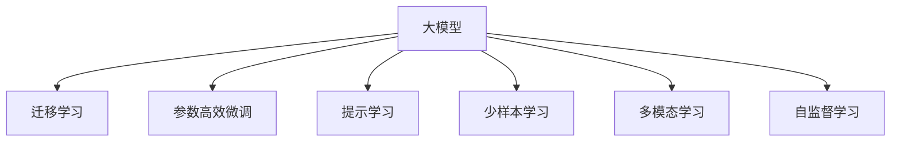

                 

# AI 大模型创业：如何利用社会优势？

在人工智能(AI)和机器学习模型蓬勃发展的今天，大模型正成为推动技术进步和经济增长的重要力量。无论是学术界还是工业界，都在积极探索和利用大模型的各种优势，以期在商业和社会领域取得突破。本博客将详细探讨如何利用社会优势，推动大模型的应用和创业成功。

## 1. 背景介绍

### 1.1 大模型概览

在过去几年中，大模型，特别是基于神经网络的语言模型，如BERT、GPT-3、T5等，因其在各种NLP任务上所展现出的卓越性能，而受到了广泛的关注。这些大模型通过大规模无标签数据进行预训练，学习到了丰富的语言知识和常识，具备强大的语言理解和生成能力。

### 1.2 创业机会

大模型的涌现为创业提供了新的方向，以下是几个主要的应用场景：

1. **自然语言处理(NLP)**：语音识别、文本翻译、情感分析、聊天机器人等。
2. **计算机视觉(CV)**：图像分类、目标检测、人脸识别等。
3. **推荐系统**：商品推荐、内容推荐等。
4. **金融科技(Fintech)**：信用评分、欺诈检测、投资分析等。
5. **医疗健康**：医学影像分析、基因序列分析等。

这些领域是大模型创业的主要战场，利用大模型的优势，可以有效提升产品性能和用户体验。

## 2. 核心概念与联系

### 2.1 核心概念概述

- **大模型**：大规模预训练语言模型，如BERT、GPT-3等，通过大规模无标签数据预训练，学习通用语言表示，具备强大的语言理解和生成能力。
- **迁移学习**：利用预训练模型的通用知识，通过微调适应新任务，提高模型性能。
- **参数高效微调**：仅更新少量参数，固定大部分预训练参数，提升微调效率。
- **提示学习**：通过精心设计输入格式，引导模型进行特定任务推理，减少微调参数。
- **少样本学习**：利用预训练模型的强大零样本学习能力，在少量样本下进行推理。
- **多模态学习**：结合视觉、听觉、文本等多种模态数据，提升模型的综合能力。
- **自监督学习**：利用无标签数据进行自监督训练，提高模型泛化能力。

### 2.2 Mermaid流程图



## 3. 核心算法原理 & 具体操作步骤

### 3.1 算法原理概述

大模型的创业机会在于其强大的语言和任务适应能力。通过迁移学习，利用预训练模型的通用知识，针对新任务进行微调，可以在较少标注数据的情况下取得良好性能。参数高效微调进一步优化了微调过程，提高了效率和性能。提示学习通过优化输入格式，进一步减少了微调参数需求，使得微调过程更加灵活和高效。

### 3.2 算法步骤详解

1. **数据准备**：收集和处理新任务的标注数据，划分为训练集、验证集和测试集。
2. **模型选择**：选择合适的预训练模型，如BERT、GPT-3等。
3. **任务适配**：在预训练模型基础上，添加新任务的适配层，如线性分类器或解码器。
4. **微调超参数设置**：选择合适的优化器、学习率、批大小等。
5. **训练与评估**：使用训练集进行微调，并在验证集上评估模型性能，调整超参数。
6. **测试与部署**：在测试集上评估模型性能，部署到实际应用中。

### 3.3 算法优缺点

**优点**：
- **高效性**：微调过程快速高效，可以在较少标注数据下取得良好性能。
- **灵活性**：适用于各种NLP和CV任务，适配层设计灵活。
- **效果显著**：显著提升模型在特定任务上的性能。

**缺点**：
- **依赖标注数据**：微调效果取决于标注数据的质量和数量。
- **迁移能力有限**：当目标任务与预训练数据分布差异较大时，微调效果可能不佳。
- **负面效果传递**：预训练模型的固有偏见和有害信息可能传递到下游任务。
- **可解释性不足**：微调模型缺乏可解释性，难以调试和优化。

### 3.4 算法应用领域

大模型已经在多个领域取得了应用，包括自然语言处理、计算机视觉、推荐系统、金融科技、医疗健康等。通过微调，这些大模型被用于解决实际问题，提升了产品的性能和用户体验。

## 4. 数学模型和公式 & 详细讲解 & 举例说明

### 4.1 数学模型构建

假设预训练模型为$M_{\theta}$，下游任务为$T$，标注数据集为$D=\{(x_i, y_i)\}_{i=1}^N$。微调的目标是最小化损失函数$\mathcal{L}(\theta)$，其中$\theta$为模型参数。

### 4.2 公式推导过程

以二分类任务为例，假设模型输出为$\hat{y}=M_{\theta}(x)$，真实标签为$y \in \{0, 1\}$。交叉熵损失函数为：

$$\ell(M_{\theta}(x),y) = -[y\log \hat{y} + (1-y)\log(1-\hat{y})]$$

其梯度为：

$$\frac{\partial \mathcal{L}(\theta)}{\partial \theta_k} = -\frac{1}{N}\sum_{i=1}^N (\frac{y_i}{\hat{y}}-\frac{1-y_i}{1-\hat{y}}) \frac{\partial M_{\theta}(x_i)}{\partial \theta_k}$$

其中$\frac{\partial M_{\theta}(x_i)}{\partial \theta_k}$通过反向传播计算得到。

### 4.3 案例分析与讲解

以BERT为例，假设其预训练模型输出层为线性层，输入为$x$，输出为$\hat{y}$。微调任务为情感分析，标注数据集为$D=\{(x_i, y_i)\}_{i=1}^N$。则微调过程如下：

1. 收集情感分析数据集$D$，划分为训练集、验证集和测试集。
2. 加载预训练BERT模型，并添加线性分类器。
3. 设置优化器为AdamW，学习率为2e-5，批大小为16。
4. 使用训练集进行微调，在验证集上评估模型性能，调整学习率。
5. 在测试集上评估模型性能。

## 5. 项目实践：代码实例和详细解释说明

### 5.1 开发环境搭建

1. 安装Anaconda和PyTorch。
2. 使用conda激活虚拟环境。
3. 安装Transformers库和相关依赖包。

### 5.2 源代码详细实现

```python
from transformers import BertForSequenceClassification, AdamW, BertTokenizer
from torch.utils.data import Dataset, DataLoader
import torch

# 定义数据集类
class SentimentDataset(Dataset):
    def __init__(self, texts, labels):
        self.texts = texts
        self.labels = labels
        self.tokenizer = BertTokenizer.from_pretrained('bert-base-uncased')
        
    def __len__(self):
        return len(self.texts)
    
    def __getitem__(self, item):
        text = self.texts[item]
        label = self.labels[item]
        encoding = self.tokenizer(text, truncation=True, padding='max_length', max_length=128)
        input_ids = encoding['input_ids']
        attention_mask = encoding['attention_mask']
        label = torch.tensor([label])
        return {'input_ids': input_ids, 
                'attention_mask': attention_mask,
                'labels': label}

# 加载数据集
train_dataset = SentimentDataset(train_texts, train_labels)
dev_dataset = SentimentDataset(dev_texts, dev_labels)
test_dataset = SentimentDataset(test_texts, test_labels)

# 加载模型和优化器
model = BertForSequenceClassification.from_pretrained('bert-base-uncased', num_labels=2)
optimizer = AdamW(model.parameters(), lr=2e-5)

# 训练模型
device = torch.device('cuda' if torch.cuda.is_available() else 'cpu')
model.to(device)
for epoch in range(3):
    model.train()
    for batch in DataLoader(train_dataset, batch_size=16):
        inputs = {k: v.to(device) for k, v in batch.items()}
        outputs = model(**inputs)
        loss = outputs.loss
        loss.backward()
        optimizer.step()

    model.eval()
    with torch.no_grad():
        correct = 0
        total = 0
        for batch in DataLoader(dev_dataset, batch_size=16):
            inputs = {k: v.to(device) for k, v in batch.items()}
            outputs = model(**inputs)
            _, preds = torch.max(outputs, dim=1)
            total += len(batch)
            correct += (preds == inputs['labels']).float().sum().item()
        print(f'Epoch {epoch+1}, dev acc: {100*correct/total:.2f}%')
    
# 测试模型
with torch.no_grad():
    correct = 0
    total = 0
    for batch in DataLoader(test_dataset, batch_size=16):
        inputs = {k: v.to(device) for k, v in batch.items()}
        outputs = model(**inputs)
        _, preds = torch.max(outputs, dim=1)
        total += len(batch)
        correct += (preds == inputs['labels']).float().sum().item()
    print(f'Test acc: {100*correct/total:.2f}%')
```

### 5.3 代码解读与分析

1. 数据集类`SentimentDataset`定义了数据集的操作，包括数据的加载、分批次处理、编码和标签处理。
2. 加载预训练BERT模型，并添加线性分类器。
3. 使用AdamW优化器进行微调，学习率为2e-5，批大小为16。
4. 训练过程中，使用GPU进行加速。
5. 在验证集和测试集上评估模型性能。

## 6. 实际应用场景

### 6.1 金融风控

大模型在金融领域可以用于风险评估和欺诈检测。通过微调，可以在少量的标注数据下，快速训练出高精度的模型，提升风控系统的准确性和鲁棒性。

### 6.2 医疗诊断

在医疗领域，大模型可以用于医学影像分析和基因序列分析。通过微调，可以在较小的数据集上进行精准训练，辅助医生进行诊断和治疗。

### 6.3 智能客服

智能客服系统可以通过大模型进行微调，提升服务质量和用户体验。通过少样本学习和提示学习，可以在较少标注数据下，快速训练出高性能的聊天机器人。

### 6.4 未来应用展望

未来，大模型将进一步扩展其应用领域，涵盖更多复杂、多样化的任务。大模型与多模态学习、自监督学习等技术的结合，将推动其在更多领域的应用和创新。

## 7. 工具和资源推荐

### 7.1 学习资源推荐

1. 《Transformer from Scratch》系列博文。
2. CS224N《Deep Learning for Natural Language Processing》课程。
3. 《Natural Language Processing with Transformers》书籍。
4. HuggingFace官方文档。
5. CLUE开源项目。

### 7.2 开发工具推荐

1. PyTorch。
2. TensorFlow。
3. Transformers库。
4. Weights & Biases。
5. TensorBoard。

### 7.3 相关论文推荐

1. Attention is All You Need。
2. BERT: Pre-training of Deep Bidirectional Transformers for Language Understanding。
3. Parameter-Efficient Transfer Learning for NLP。
4. Prefix-Tuning: Optimizing Continuous Prompts for Generation。
5. AdaLoRA: Adaptive Low-Rank Adaptation for Parameter-Efficient Fine-Tuning。

## 8. 总结：未来发展趋势与挑战

### 8.1 研究成果总结

大模型的创业机会在于其强大的语言和任务适应能力。通过迁移学习、参数高效微调和提示学习等技术，可以在较少标注数据下，快速训练出高性能的模型。

### 8.2 未来发展趋势

1. 模型规模持续增大。
2. 微调方法日趋多样。
3. 持续学习成为常态。
4. 标注样本需求降低。
5. 多模态微调崛起。
6. 模型通用性增强。

### 8.3 面临的挑战

1. 标注成本瓶颈。
2. 模型鲁棒性不足。
3. 推理效率有待提高。
4. 可解释性亟需加强。
5. 安全性有待保障。
6. 知识整合能力不足。

### 8.4 研究展望

未来，大模型将进一步拓展其应用领域，涵盖更多复杂、多样化的任务。大模型与多模态学习、自监督学习等技术的结合，将推动其在更多领域的应用和创新。同时，研究者需要关注标注成本、模型鲁棒性、推理效率、可解释性、安全性等问题，以推动大模型的进一步发展和应用。

## 9. 附录：常见问题与解答

**Q1: 大模型微调是否适用于所有NLP任务？**

A: 大模型微调在大多数NLP任务上都能取得不错的效果，特别是对于数据量较小的任务。但对于一些特定领域的任务，如医学、法律等，仅仅依靠通用语料预训练的模型可能难以很好地适应。此时需要在特定领域语料上进一步预训练，再进行微调，才能获得理想效果。

**Q2: 微调过程中如何选择合适的学习率？**

A: 微调的学习率一般要比预训练时小1-2个数量级，如果使用过大的学习率，容易破坏预训练权重，导致过拟合。一般建议从1e-5开始调参，逐步减小学习率，直至收敛。也可以使用warmup策略，在开始阶段使用较小的学习率，再逐渐过渡到预设值。需要注意的是，不同的优化器(如AdamW、Adafactor等)以及不同的学习率调度策略，可能需要设置不同的学习率阈值。

**Q3: 采用大模型微调时会面临哪些资源瓶颈？**

A: 目前主流的预训练大模型动辄以亿计的参数规模，对算力、内存、存储都提出了很高的要求。GPU/TPU等高性能设备是必不可少的，但即便如此，超大批次的训练和推理也可能遇到显存不足的问题。因此需要采用一些资源优化技术，如梯度积累、混合精度训练、模型并行等，来突破硬件瓶颈。同时，模型的存储和读取也可能占用大量时间和空间，需要采用模型压缩、稀疏化存储等方法进行优化。

**Q4: 如何缓解微调过程中的过拟合问题？**

A: 过拟合是微调面临的主要挑战，尤其是在标注数据不足的情况下。常见的缓解策略包括：
1. 数据增强：通过回译、近义替换等方式扩充训练集。
2. 正则化：使用L2正则、Dropout、Early Stopping等避免过拟合。
3. 对抗训练：引入对抗样本，提高模型鲁棒性。
4. 参数高效微调：只调整少量参数(如Adapter、Prefix等)，减小过拟合风险。
5. 多模型集成：训练多个微调模型，取平均输出，抑制过拟合。

这些策略往往需要根据具体任务和数据特点进行灵活组合。只有在数据、模型、训练、推理等各环节进行全面优化，才能最大限度地发挥大模型微调的威力。

**Q5: 微调模型在落地部署时需要注意哪些问题？**

A: 将微调模型转化为实际应用，还需要考虑以下因素：
1. 模型裁剪：去除不必要的层和参数，减小模型尺寸，加快推理速度。
2. 量化加速：将浮点模型转为定点模型，压缩存储空间，提高计算效率。
3. 服务化封装：将模型封装为标准化服务接口，便于集成调用。
4. 弹性伸缩：根据请求流量动态调整资源配置，平衡服务质量和成本。
5. 监控告警：实时采集系统指标，设置异常告警阈值，确保服务稳定性。
6. 安全防护：采用访问鉴权、数据脱敏等措施，保障数据和模型安全。

大模型微调为NLP应用开启了广阔的想象空间，但如何将强大的性能转化为稳定、高效、安全的业务价值，还需要工程实践的不断打磨。唯有从数据、算法、工程、业务等多个维度协同发力，才能真正实现人工智能技术在垂直行业的规模化落地。总之，微调需要开发者根据具体任务，不断迭代和优化模型、数据和算法，方能得到理想的效果。

---

作者：禅与计算机程序设计艺术 / Zen and the Art of Computer Programming

