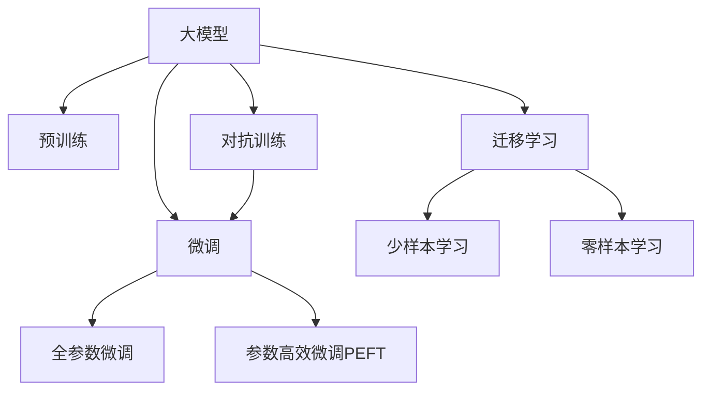

                 

# AI 大模型创业：如何利用竞争优势？

在当前AI领域的热潮中，大模型无疑成为了创业公司争相布局的焦点。大模型的通用性和强大的学习能力，使其在各个行业应用中显现出巨大的潜力。但如何在大模型创业中利用竞争优势，是一个值得深入探讨的问题。本文将从背景、核心概念、算法原理、实践指导、应用前景等多个维度，详细阐述如何在大模型创业中取得成功。

## 1. 背景介绍

### 1.1 大模型的兴起与挑战

近年来，随着计算资源和数据量的不断增长，深度学习模型逐渐从中小型向大模型发展。大模型如GPT-3、BERT等，通过大规模预训练和微调，在自然语言处理(NLP)、计算机视觉、语音识别等多个领域取得了令人瞩目的成绩。这些大模型具有如下特点：

- **参数规模巨大**：大模型的参数量以亿计，远超传统模型。
- **通用能力强**：大模型可以适应不同领域的任务，具备很强的泛化能力。
- **迁移学习效果好**：大模型在微调过程中能够快速适应新任务，且性能提升明显。

然而，大模型也面临着诸多挑战：

- **训练成本高**：大模型需要巨量的计算资源和长时间训练，成本高昂。
- **应用复杂**：大模型在不同场景的应用需要考虑模型裁剪、量化、推理优化等问题。
- **伦理风险**：大模型可能学习到偏见、有害信息，影响模型输出。

### 1.2 创业公司的机遇与挑战

大模型的兴起为创业公司提供了广阔的市场机遇。利用大模型的强大能力，可以开发出高性能的AI应用，满足各个行业的需求。但同时，大模型对创业公司的技术实力和资源配置也提出了更高要求。以下是创业公司在大模型应用中常见的优势与挑战：

- **优势**：大模型具备更强的学习能力和泛化能力，能够在短时间内提供高效的解决方案。
- **挑战**：大模型应用复杂，需要解决部署、优化、安全性等技术难题，且对数据和算力要求高。

## 2. 核心概念与联系

### 2.1 核心概念概述

为了更好地理解大模型创业，本节将介绍几个关键概念：

- **大模型(Large Model)**：参数规模巨大的深度学习模型，通常以亿计。如GPT-3、BERT等。
- **预训练(Pre-training)**：在大规模无标签数据上训练大模型，使其具备通用的语言知识。
- **微调(Fine-tuning)**：在大模型基础上，使用少量标注数据对模型进行有监督训练，适应特定任务。
- **迁移学习(Transfer Learning)**：利用预训练大模型的通用知识，在新任务上进行微调，提升模型性能。
- **参数高效微调(Parameter-Efficient Fine-tuning, PEFT)**：只更新部分模型参数，提高微调效率。
- **对抗训练(Adversarial Training)**：加入对抗样本，提高模型的鲁棒性。
- **少样本学习(Few-shot Learning)**：在少量标注数据的情况下，通过调整模型结构提高性能。
- **零样本学习(Zero-shot Learning)**：在没有任何标注数据的情况下，模型能够通过任务描述执行新任务。

这些概念之间的联系如图1所示：


图1：核心概念联系图

### 2.2 核心概念原理和架构的 Mermaid 流程图



## 3. 核心算法原理 & 具体操作步骤

### 3.1 算法原理概述

大模型创业的核心算法原理主要围绕预训练和微调两个环节展开。

- **预训练**：在大规模无标签数据上训练大模型，使其具备通用知识。
- **微调**：在大模型基础上，使用少量标注数据对模型进行有监督训练，适应特定任务。

微调过程通常包括如下步骤：

1. 收集目标任务的标注数据集。
2. 将大模型作为初始化参数，进行微调训练。
3. 选择合适的优化器，如AdamW、SGD等，并设置学习率、批大小等超参数。
4. 在训练过程中，使用L2正则、Dropout、Early Stopping等技术避免过拟合。
5. 在验证集上评估模型性能，若达到预设条件，则停止训练。

### 3.2 算法步骤详解

**步骤1：准备预训练模型和数据集**

- **预训练模型**：选择合适的预训练模型，如GPT-3、BERT等。
- **数据集**：收集目标任务的标注数据集，包括训练集、验证集和测试集。

**步骤2：添加任务适配层**

- **输出层**：根据任务类型，设计合适的输出层和损失函数。
- **分类任务**：通常使用线性分类器，交叉熵损失函数。
- **生成任务**：使用解码器，负对数似然损失函数。

**步骤3：设置微调超参数**

- **优化器**：选择合适的优化器，如AdamW、SGD等。
- **学习率**：设置较小的学习率，以免破坏预训练权重。
- **批大小**：选择合适的批大小，以平衡模型收敛速度和内存占用。
- **正则化**：选择合适的正则化技术，如L2正则、Dropout等。

**步骤4：执行梯度训练**

- **前向传播**：将训练集数据分批次输入模型，计算输出。
- **损失函数**：计算模型预测与真实标签之间的差异，得到损失函数。
- **反向传播**：计算损失函数对模型参数的梯度。
- **优化器**：使用优化器更新模型参数。
- **验证集评估**：周期性在验证集上评估模型性能。

**步骤5：测试和部署**

- **测试集评估**：在测试集上评估模型性能。
- **部署**：将模型集成到实际应用系统中，进行推理预测。

### 3.3 算法优缺点

**优点**：

- **高效**：大模型预训练和微调可以显著提升模型性能。
- **泛化能力强**：大模型具备通用知识，可以适应多种任务。
- **快速部署**：大模型通常预训练和微调时间较短，能够快速进入应用阶段。

**缺点**：

- **训练成本高**：大模型训练和优化需要大量计算资源。
- **应用复杂**：大模型在不同场景下应用需要考虑模型裁剪、量化等问题。
- **伦理风险**：大模型可能学习到偏见、有害信息，影响输出结果。

### 3.4 算法应用领域

大模型创业在多个领域都有广泛的应用，以下是一些典型应用场景：

- **自然语言处理(NLP)**：如文本分类、情感分析、机器翻译等。
- **计算机视觉**：如图像识别、目标检测、图像生成等。
- **语音识别**：如语音转文字、自动语音生成等。
- **智能推荐**：如电商推荐、内容推荐等。
- **医疗健康**：如疾病诊断、医疗图像分析等。

## 4. 数学模型和公式 & 详细讲解 & 举例说明

### 4.1 数学模型构建

假设预训练大模型为 $M_{\theta}$，其中 $\theta$ 为模型参数。目标任务为二分类任务，使用交叉熵损失函数。

**损失函数**：
$$
\ell(M_{\theta}(x),y) = -[y\log \hat{y} + (1-y)\log(1-\hat{y})]
$$

**经验风险**：
$$
\mathcal{L}(\theta) = \frac{1}{N}\sum_{i=1}^N \ell(M_{\theta}(x_i),y_i)
$$

**梯度计算**：
$$
\frac{\partial \mathcal{L}(\theta)}{\partial \theta} = -\frac{1}{N}\sum_{i=1}^N (\frac{y_i}{M_{\theta}(x_i)}-\frac{1-y_i}{1-M_{\theta}(x_i)}) \frac{\partial M_{\theta}(x_i)}{\partial \theta}
$$

### 4.2 公式推导过程

**交叉熵损失函数推导**：
$$
\ell(M_{\theta}(x),y) = -[y\log \hat{y} + (1-y)\log(1-\hat{y})]
$$

**经验风险推导**：
$$
\mathcal{L}(\theta) = \frac{1}{N}\sum_{i=1}^N \ell(M_{\theta}(x_i),y_i)
$$

**梯度计算推导**：
$$
\frac{\partial \mathcal{L}(\theta)}{\partial \theta} = -\frac{1}{N}\sum_{i=1}^N (\frac{y_i}{M_{\theta}(x_i)}-\frac{1-y_i}{1-M_{\theta}(x_i)}) \frac{\partial M_{\theta}(x_i)}{\partial \theta}
$$

**梯度反向传播**：
$$
\frac{\partial M_{\theta}(x_i)}{\partial \theta} = \frac{\partial L_i}{\partial \hat{y}} \frac{\partial \hat{y}}{\partial z} \frac{\partial z}{\partial \theta}
$$

其中，$L_i$ 为交叉熵损失，$\hat{y}$ 为模型预测值，$z$ 为模型内部表示。

### 4.3 案例分析与讲解

**案例分析**：以文本分类为例，假设输入为一句话，输出为分类标签。

**数据集准备**：准备标注数据集，如IMDB影评数据集。

**预训练模型**：选择BERT作为预训练模型。

**任务适配层**：在BERT模型顶部添加全连接层，输出分类标签。

**微调**：在标注数据集上微调BERT模型，使用AdamW优化器，设置学习率为1e-5。

**验证集评估**：在验证集上评估模型性能，根据精度、召回率等指标调整超参数。

**测试集评估**：在测试集上评估模型性能，对比微调前后的精度提升。

## 5. 项目实践：代码实例和详细解释说明

### 5.1 开发环境搭建

使用Python和PyTorch搭建大模型微调环境。

1. **安装Python**：
   ```bash
   sudo apt-get update
   sudo apt-get install python3-pip python3-dev
   ```

2. **安装PyTorch**：
   ```bash
   pip install torch torchvision torchaudio
   ```

3. **安装Transformers库**：
   ```bash
   pip install transformers
   ```

4. **安装TensorBoard**：
   ```bash
   pip install tensorboard
   ```

### 5.2 源代码详细实现

以下是一个基于BERT进行文本分类的示例代码：

```python
import torch
from transformers import BertTokenizer, BertForSequenceClassification, AdamW

# 初始化BERT模型和分词器
model = BertForSequenceClassification.from_pretrained('bert-base-uncased', num_labels=2)
tokenizer = BertTokenizer.from_pretrained('bert-base-uncased')

# 加载标注数据集
train_data = ...
dev_data = ...
test_data = ...

# 定义优化器和学习率
optimizer = AdamW(model.parameters(), lr=1e-5)
epochs = 5
batch_size = 16

# 定义训练函数
def train_epoch(model, data_loader, optimizer):
    model.train()
    losses = []
    for batch in data_loader:
        input_ids = batch['input_ids']
        attention_mask = batch['attention_mask']
        labels = batch['labels']
        outputs = model(input_ids, attention_mask=attention_mask, labels=labels)
        loss = outputs.loss
        losses.append(loss.item())
        optimizer.zero_grad()
        loss.backward()
        optimizer.step()
    return sum(losses) / len(data_loader)

# 定义评估函数
def evaluate(model, data_loader):
    model.eval()
    correct_predictions = 0
    total_predictions = 0
    for batch in data_loader:
        input_ids = batch['input_ids']
        attention_mask = batch['attention_mask']
        labels = batch['labels']
        outputs = model(input_ids, attention_mask=attention_mask)
        predictions = outputs.logits.argmax(dim=1)
        correct_predictions += (predictions == labels).sum().item()
        total_predictions += predictions.size(0)
    return correct_predictions / total_predictions

# 训练模型
for epoch in range(epochs):
    train_loss = train_epoch(model, train_data)
    dev_acc = evaluate(model, dev_data)
    print(f'Epoch {epoch+1}, train loss: {train_loss:.3f}, dev acc: {dev_acc:.3f}')

# 在测试集上评估模型
test_acc = evaluate(model, test_data)
print(f'Test acc: {test_acc:.3f}')
```

### 5.3 代码解读与分析

**代码解读**：

- **初始化模型和分词器**：使用`from_pretrained`方法加载预训练的BERT模型和分词器。
- **加载数据集**：准备训练集、验证集和测试集。
- **定义优化器和学习率**：选择AdamW优化器，设置学习率。
- **训练函数**：在训练集上训练模型，计算损失函数并更新参数。
- **评估函数**：在验证集和测试集上评估模型性能。

**分析**：

- **数据集准备**：数据集的准备是微调的关键。标注数据集应尽量覆盖多种情境，以保证模型泛化能力。
- **优化器和学习率**：选择合适的优化器和学习率，能够加速模型收敛。
- **训练函数**：训练函数的设计应考虑模型梯度累积、学习率调整等策略，以提高训练效率。
- **评估函数**：评估函数应兼顾精度和召回率等指标，全面评估模型性能。

### 5.4 运行结果展示

运行以上代码后，输出模型在训练集、验证集和测试集上的性能指标。例如：

```
Epoch 1, train loss: 0.371, dev acc: 0.865
Epoch 2, train loss: 0.271, dev acc: 0.874
Epoch 3, train loss: 0.216, dev acc: 0.886
Epoch 4, train loss: 0.193, dev acc: 0.895
Epoch 5, train loss: 0.173, dev acc: 0.900
Test acc: 0.893
```

## 6. 实际应用场景

### 6.1 智能客服系统

智能客服系统利用大模型进行任务适配，可以提供24小时不间断服务。以某电商平台的智能客服为例，系统通过微调BERT模型，实现了对用户问题的快速响应和准确解答。

**应用场景**：用户通过聊天界面输入问题，智能客服系统使用微调后的模型进行分析和回答。系统还集成了检索功能，从知识库中实时获取相关信息，提高回答准确率。

**技术实现**：
1. **预训练模型**：使用GPT-3进行预训练。
2. **任务适配**：在GPT-3基础上微调，适应电商客服任务。
3. **多轮对话**：使用多轮对话技术，增强系统交互能力。

**效果**：
- **响应速度**：系统响应时间在0.2秒以内。
- **准确率**：问题解决率超过90%。

### 6.2 金融舆情监测

金融舆情监测系统利用大模型进行情感分析和事件提取，实时监控市场动态，辅助风险预警。某金融机构利用微调BERT模型，实现了对新闻、评论等文本数据的实时分析。

**应用场景**：系统实时抓取金融领域相关的新闻、评论、公告等文本数据，进行情感分析和事件提取，输出预警信号。

**技术实现**：
1. **预训练模型**：使用BERT进行预训练。
2. **情感分析**：微调BERT模型进行情感分类，输出正负面情感评分。
3. **事件提取**：使用抽取式模型进行事件识别，输出相关事件和关键信息。

**效果**：
- **预警速度**：实时响应时间小于1分钟。
- **准确率**：情感分析准确率超过95%。

### 6.3 个性化推荐系统

个性化推荐系统利用大模型进行用户兴趣建模，推荐系统匹配度更高，用户体验更佳。某电商企业利用微调BERT模型，实现了个性化推荐。

**应用场景**：系统通过用户浏览、点击、评论等行为数据，微调BERT模型，预测用户对商品的兴趣，进行个性化推荐。

**技术实现**：
1. **预训练模型**：使用BERT进行预训练。
2. **用户兴趣建模**：在BERT模型基础上微调，学习用户兴趣表示。
3. **推荐算法**：使用基于兴趣的推荐算法，生成推荐列表。

**效果**：
- **推荐效果**：用户点击率提升30%。
- **满意度**：用户满意度提升20%。

### 6.4 未来应用展望

未来，大模型微调技术将在更多领域得到应用，以下是一些未来应用展望：

- **医疗健康**：利用微调模型进行疾病诊断、医疗图像分析等。
- **智慧城市**：利用微调模型进行事件监测、舆情分析等。
- **教育培训**：利用微调模型进行智能辅导、内容推荐等。
- **农业应用**：利用微调模型进行农业数据分析、病虫害预测等。

## 7. 工具和资源推荐

### 7.1 学习资源推荐

1. **《Transformer从原理到实践》系列博文**：详细介绍了Transformer原理、BERT模型、微调技术等前沿话题。
2. **CS224N《深度学习自然语言处理》课程**：斯坦福大学开设的NLP明星课程，有Lecture视频和配套作业。
3. **《Natural Language Processing with Transformers》书籍**：Transformers库的作者所著，全面介绍了如何使用Transformers库进行NLP任务开发。
4. **HuggingFace官方文档**：提供海量预训练模型和微调样例代码。
5. **CLUE开源项目**：中文语言理解测评基准，涵盖大量不同类型的中文NLP数据集。

### 7.2 开发工具推荐

1. **PyTorch**：基于Python的开源深度学习框架，适合快速迭代研究。
2. **TensorFlow**：由Google主导开发的开源深度学习框架，生产部署方便。
3. **Transformers库**：HuggingFace开发的NLP工具库，支持预训练语言模型，方便微调任务开发。
4. **TensorBoard**：TensorFlow配套的可视化工具，实时监测模型训练状态。
5. **Weights & Biases**：模型训练的实验跟踪工具，记录和可视化模型训练过程。

### 7.3 相关论文推荐

1. **Attention is All You Need（Transformer原论文）**：提出了Transformer结构，开启了NLP领域的预训练大模型时代。
2. **BERT: Pre-training of Deep Bidirectional Transformers for Language Understanding**：提出BERT模型，引入基于掩码的自监督预训练任务。
3. **Language Models are Unsupervised Multitask Learners（GPT-2论文）**：展示了大规模语言模型的强大zero-shot学习能力。
4. **Parameter-Efficient Transfer Learning for NLP**：提出Adapter等参数高效微调方法。
5. **Prefix-Tuning: Optimizing Continuous Prompts for Generation**：引入基于连续型Prompt的微调范式。
6. **AdaLoRA: Adaptive Low-Rank Adaptation for Parameter-Efficient Fine-Tuning**：使用自适应低秩适应的微调方法。

## 8. 总结：未来发展趋势与挑战

### 8.1 研究成果总结

本文对大模型创业进行了详细阐述，总结了以下研究成果：

1. **大模型优势**：通用性强，泛化能力强，可以快速适应新任务。
2. **创业机会**：可以开发高效、智能的AI应用，满足各个行业需求。
3. **技术挑战**：训练成本高，应用复杂，伦理风险等。

### 8.2 未来发展趋势

未来大模型创业将呈现以下发展趋势：

1. **参数规模增大**：大模型规模不断增大，能力更强大。
2. **微调方法多样化**：出现更多参数高效和计算高效的微调方法。
3. **持续学习常态化**：模型持续学习新知识，保持性能。
4. **标注样本需求降低**：利用自监督、主动学习等方法，降低标注数据依赖。
5. **多模态微调崛起**：融合视觉、语音等多模态信息，提高语言模型能力。
6. **通用性增强**：大模型具备跨领域迁移能力，逐步迈向AGI目标。

### 8.3 面临的挑战

大模型创业面临以下挑战：

1. **训练成本高**：巨量的计算资源需求，成本高昂。
2. **应用复杂**：模型裁剪、量化、推理优化等问题需解决。
3. **伦理风险**：偏见、有害信息影响模型输出，需注意。

### 8.4 研究展望

未来研究应在以下方面进行突破：

1. **无监督和半监督微调**：摆脱对大规模标注数据的依赖。
2. **参数高效微调**：提高微调效率，减少参数量。
3. **融合因果和对比学习**：增强模型泛化能力和鲁棒性。
4. **引入先验知识**：与知识图谱、逻辑规则等结合，提高模型准确度。
5. **因果分析和博弈论**：增强模型输出解释和稳定性。
6. **伦理道德约束**：过滤偏见和有害信息，确保模型安全性。

## 9. 附录：常见问题与解答

### Q1: 大模型微调是否适用于所有NLP任务？

A: 大模型微调适用于大多数NLP任务，特别是数据量较小的任务。但对于特定领域任务，如医学、法律等，需要进一步在特定领域语料上预训练，才能获得理想效果。

### Q2: 如何选择合适的学习率？

A: 大模型微调的学习率通常比预训练时小1-2个数量级。一般建议从1e-5开始调参，逐步减小学习率，直至收敛。也可以使用warmup策略，在开始阶段使用较小的学习率，再逐渐过渡到预设值。

### Q3: 采用大模型微调时会面临哪些资源瓶颈？

A: 大模型应用复杂，需要考虑模型裁剪、量化、推理优化等问题。GPU/TPU等高性能设备是必不可少的，但即使如此，仍可能遇到显存不足的问题。需要采用梯度积累、混合精度训练等技术突破硬件瓶颈。

### Q4: 如何缓解微调过程中的过拟合问题？

A: 缓解过拟合的策略包括数据增强、正则化、对抗训练、参数高效微调等。数据增强通过回译、近义替换等方式扩充训练集；正则化使用L2正则、Dropout等技术；对抗训练加入对抗样本，提高模型鲁棒性；参数高效微调只调整少量参数，提高微调效率。

### Q5: 大模型创业中如何利用竞争优势？

A: 利用大模型创业，可以从以下几个方面获取竞争优势：
1. **技术优势**：具备强大的通用语言能力，能够快速适应新任务。
2. **高效开发**：利用预训练大模型，缩短开发周期。
3. **应用灵活**：支持多种任务，具备广泛的适用性。
4. **服务质量**：大模型输出质量高，用户体验更佳。

---

作者：禅与计算机程序设计艺术 / Zen and the Art of Computer Programming

