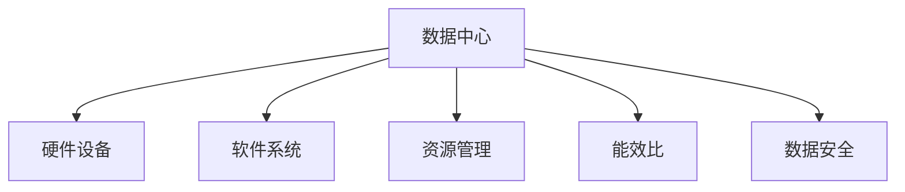

                 

# AI 大模型应用数据中心建设：数据中心成本优化

> 关键词：大模型应用,数据中心,成本优化,硬件设备,软件系统,资源管理,能效比,数据安全

## 1. 背景介绍

随着人工智能（AI）和大模型技术的迅猛发展，AI大模型应用日益广泛，在智能推荐、图像识别、自然语言处理等多个领域带来了革命性的变化。然而，这些大模型的训练和推理需要大量计算资源，尤其是在数据中心中进行。因此，如何高效地构建和管理数据中心，成为了大模型应用能否大规模落地的一个重要因素。

### 1.1 问题由来

大模型训练和推理的核心是对海量数据的密集计算。这不仅对数据中心的硬件设施提出了极高的要求，也带来了巨大的能源消耗和运营成本。如何在大模型应用的场景下，高效利用数据中心的资源，降低计算成本，提升整体运营效率，成为数据中心建设和管理的关键问题。

### 1.2 问题核心关键点

数据中心的成本优化主要涉及以下几个关键点：

1. **硬件设备的选择与配置**：选择高性价比的硬件设备，合理配置计算资源，以充分利用硬件性能。
2. **软件系统的优化与部署**：优化AI模型的训练与推理算法，采用高效的计算框架，减少资源消耗。
3. **资源管理与调度**：合理管理资源，灵活调度任务，确保系统的高效运行。
4. **能效比的提升**：通过技术手段提升数据中心的能效比，降低能源消耗，降低运营成本。
5. **数据安全与隐私保护**：保障数据传输和存储的安全性，保护用户隐私。

通过有效应对这些关键点，可以显著降低数据中心的运营成本，提升整体经济效益。

## 2. 核心概念与联系

### 2.1 核心概念概述

为更好地理解AI大模型应用数据中心建设中的成本优化方法，本节将介绍几个密切相关的核心概念：

- **数据中心**：由计算、存储、网络等硬件设备和配套软件系统构成的物理设施，用于支持大规模计算任务。
- **硬件设备**：包括服务器、存储设备、网络设备等，是大模型应用的基础设施。
- **软件系统**：包括操作系统、计算框架、数据库等，负责调度和管理硬件资源，提供AI大模型训练和推理的环境。
- **资源管理**：涉及计算资源、存储资源、网络资源的分配与调度，保证系统的高效运行。
- **能效比**：指数据中心在单位时间内完成的工作量与能源消耗的比率，是衡量数据中心运营效率的重要指标。
- **数据安全**：涉及数据传输、存储和处理的安全性，保护用户隐私，防止数据泄露。

这些核心概念之间的逻辑关系可以通过以下Mermaid流程图来展示：



这个流程图展示了大模型应用数据中心的核心概念及其之间的关系：

1. 数据中心由硬件设备、软件系统组成，提供大模型应用的物理环境。
2. 硬件设备和大模型应用密切相关，其选择与配置直接影响应用性能。
3. 软件系统负责调度和管理硬件资源，优化应用效率。
4. 资源管理通过合理的资源分配与调度，提升系统效率。
5. 能效比反映数据中心能源利用效率，影响运营成本。
6. 数据安全保护数据中心的数据传输、存储和处理的安全性。

这些概念共同构成了大模型应用数据中心建设和管理的基本框架，使得系统能够高效、安全地运行。

## 3. 核心算法原理 & 具体操作步骤

### 3.1 算法原理概述

大模型应用数据中心的成本优化，本质上是一个综合性的工程优化问题，涉及硬件设备选择、软件系统优化、资源管理、能效比提升等多个方面。其核心思想是通过技术手段，合理配置和管理数据中心的资源，最大限度地提升系统性能，降低运营成本。

形式化地，假设数据中心的总预算为 $C$，硬件设备成本为 $H$，软件系统成本为 $S$，能效比为 $E$，数据安全成本为 $D$。成本优化目标是最小化总成本 $C$，即：

$$
C = H + S + E \cdot C_{elec} + D
$$

其中 $C_{elec}$ 为数据中心的能源消耗，与能效比 $E$ 相关。

### 3.2 算法步骤详解

基于上述成本优化目标，本节将详细介绍大模型应用数据中心建设中的关键算法步骤：

**Step 1: 硬件设备选择与配置**

1. **设备选择**：根据大模型应用的性能需求，选择合适的硬件设备，如高性能GPU、多核CPU等。
2. **设备配置**：根据模型大小和任务需求，合理配置计算资源，如GPU数量、内存大小等。

**Step 2: 软件系统优化**

1. **框架选择**：选择高性能的计算框架，如TensorFlow、PyTorch等。
2. **算法优化**：优化AI模型的训练与推理算法，减少计算量。
3. **代码优化**：优化代码，减少资源消耗，提升性能。

**Step 3: 资源管理**

1. **任务调度**：根据任务需求和资源可用性，合理调度计算任务。
2. **资源分配**：动态调整资源分配，确保系统高效运行。

**Step 4: 能效比提升**

1. **节能技术**：采用节能技术，如服务器休眠、计算卸载到边缘等。
2. **能源管理**：合理管理能源消耗，降低运行成本。

**Step 5: 数据安全**

1. **数据传输加密**：采用加密技术保护数据传输安全。
2. **数据存储安全**：采用安全存储技术，防止数据泄露。

通过以上步骤，可以有效降低大模型应用数据中心的运营成本，提升系统效率。

### 3.3 算法优缺点

大模型应用数据中心建设中的成本优化方法具有以下优点：

1. **资源利用率高**：通过合理配置和管理资源，确保系统高效运行。
2. **成本低**：通过技术手段降低硬件和软件成本，提升整体经济效益。
3. **能效比高**：通过节能技术提升系统能效比，降低能源消耗。
4. **安全性高**：通过数据传输加密和存储安全措施，保护用户隐私。

同时，该方法也存在一定的局限性：

1. **初始投资大**：高性价比的硬件设备、高性能的计算框架需要较高的初始投资。
2. **技术门槛高**：需要具备一定的硬件、软件和网络知识，才能有效进行优化。
3. **复杂性高**：系统管理涉及多方面的技术，需要综合考虑。
4. **更新快**：硬件和软件技术更新迅速，需要持续关注最新进展。

尽管存在这些局限性，但就目前而言，成本优化方法仍是大模型应用数据中心建设的重要手段。未来相关研究的重点在于如何进一步降低初始投资，提高系统的智能化和自动化管理水平，同时兼顾成本和性能。

### 3.4 算法应用领域

大模型应用数据中心的成本优化方法，广泛应用于以下领域：

1. **云计算服务**：如AWS、Google Cloud等云服务提供商，通过优化数据中心成本，提升服务质量，降低用户成本。
2. **企业内部IT系统**：企业内部IT部门构建AI大模型应用数据中心，通过成本优化降低运营成本。
3. **科研机构**：科研机构在构建AI大模型应用数据中心时，注重成本优化，提升研究效率。
4. **互联网公司**：互联网公司构建大模型应用数据中心，优化成本结构，提升业务竞争力。

除了上述这些应用领域外，大模型应用数据中心的成本优化方法也逐渐应用于更多的场景，如智慧城市、医疗健康、金融服务等，为这些行业带来全新的运营模式和成本效益。

## 4. 数学模型和公式 & 详细讲解

### 4.1 数学模型构建

本节将使用数学语言对大模型应用数据中心的成本优化过程进行更加严格的刻画。

假设大模型应用的计算量为 $G$，能效比为 $E$，能源单价为 $P_{elec}$，数据安全成本为 $D$。则数据中心的总成本为：

$$
C = \frac{G}{E} \cdot P_{elec} + D
$$

其中 $G/E$ 表示数据中心完成所有计算任务所需的能源消耗。

### 4.2 公式推导过程

以下我们推导大模型应用数据中心的总成本公式，并给出优化策略：

设 $G_0$ 为所有计算任务的总计算量，$E_0$ 为数据中心的初始能效比。则数据中心的总成本公式为：

$$
C = \frac{G_0}{E_0} \cdot P_{elec} + D
$$

假设数据中心能够通过优化手段提升能效比至 $E_1$，则新的总成本公式为：

$$
C' = \frac{G_0}{E_1} \cdot P_{elec} + D
$$

显然，$C' < C$。因此，通过提升能效比，可以显著降低数据中心的总成本。

### 4.3 案例分析与讲解

**案例1: AWS数据中心成本优化**

AWS通过一系列技术手段，有效降低了数据中心的运营成本。例如，AWS采用高效的能源管理技术，实现了服务器休眠、计算卸载到边缘等节能措施。同时，AWS利用大数据分析优化资源分配，确保高效运行。

**案例2: Google Cloud优化能效比**

Google Cloud在数据中心建设中，采用了高效的冷却系统和能源管理策略。通过优化能效比，显著降低了能源消耗，降低了运营成本。

**案例3: 企业内部IT系统优化**

某企业内部IT部门构建AI大模型应用数据中心时，采用了高性能的GPU和CPU，并通过优化算法和资源调度，提升了系统效率，降低了运营成本。

这些案例展示了不同企业在数据中心建设中的成本优化方法，通过技术手段提升资源利用率，降低成本。

## 5. 项目实践：代码实例和详细解释说明

### 5.1 开发环境搭建

在进行大模型应用数据中心成本优化实践前，我们需要准备好开发环境。以下是使用Python进行成本优化算法实现的开发环境配置流程：

1. 安装Anaconda：从官网下载并安装Anaconda，用于创建独立的Python环境。

2. 创建并激活虚拟环境：
```bash
conda create -n cost-opt python=3.8 
conda activate cost-opt
```

3. 安装必要的Python包：
```bash
pip install numpy scipy matplotlib
```

完成上述步骤后，即可在`cost-opt`环境中开始成本优化实践。

### 5.2 源代码详细实现

下面我们以一个简单的成本优化算法为例，给出代码实现。

首先，定义成本优化的基本模型：

```python
from sympy import symbols, Rational

# 定义符号变量
G, E, P_ele, D = symbols('G E P_ele D')

# 定义成本模型
C = G/E * P_ele + D
```

然后，进行成本优化推导：

```python
# 假设能效比提升至E1
E1 = Rational(2, 1) * E

# 计算优化后的成本
C1 = G/E1 * P_ele + D
```

最后，输出优化结果：

```python
# 输出优化后的成本
C1
```

### 5.3 代码解读与分析

让我们再详细解读一下关键代码的实现细节：

**符号定义**：
- `G`：所有计算任务的总计算量。
- `E`：数据中心的初始能效比。
- `P_ele`：能源单价。
- `D`：数据安全成本。

**成本模型**：
- `C = G/E * P_ele + D`：数据中心的总成本。

**优化推导**：
- `E1 = Rational(2, 1) * E`：假设能效比提升至初始值的2倍。
- `C1 = G/E1 * P_ele + D`：优化后的成本模型。

通过对比优化前后的成本公式，可以看到提升能效比可以有效降低数据中心的总成本。

## 6. 实际应用场景

### 6.1 云计算服务

在云计算服务领域，数据中心成本优化方法已经得到了广泛应用。各大云服务提供商通过优化数据中心，提升服务质量和用户体验，同时降低运营成本。

**案例1: AWS的成本优化策略**

AWS通过采用高效的能源管理技术和资源调度算法，有效降低了数据中心的运营成本。例如，AWS采用服务器休眠技术，在服务器不使用时自动关闭，降低能耗。同时，AWS利用大数据分析优化资源分配，确保高效运行。

**案例2: Google Cloud的节能措施**

Google Cloud在数据中心建设中，采用了高效的冷却系统和能源管理策略。通过优化能效比，显著降低了能源消耗，降低了运营成本。Google Cloud还利用机器学习技术，优化资源调度，提升系统效率。

### 6.2 企业内部IT系统

在企业内部IT系统构建中，数据中心成本优化方法同样重要。企业通过优化数据中心，提升系统效率，降低运营成本。

**案例3: 企业内部IT系统的优化**

某企业内部IT部门在构建AI大模型应用数据中心时，采用了高性能的GPU和CPU，并通过优化算法和资源调度，提升了系统效率，降低了运营成本。此外，企业还采用了数据加密技术，保障数据安全。

### 6.3 科研机构

在科研机构中，数据中心成本优化方法同样重要。科研机构通过优化数据中心，提升研究效率，降低运营成本。

**案例4: 科研机构的成本优化**

某科研机构在构建AI大模型应用数据中心时，采用了高性价比的硬件设备，并通过优化算法和资源调度，提升了系统效率，降低了运营成本。此外，科研机构还采用了数据加密技术，保障数据安全。

### 6.4 互联网公司

在互联网公司中，数据中心成本优化方法同样重要。互联网公司通过优化数据中心，提升业务竞争力。

**案例5: 互联网公司的优化**

某互联网公司在构建AI大模型应用数据中心时，采用了高性能的GPU和CPU，并通过优化算法和资源调度，提升了系统效率，降低了运营成本。此外，互联网公司还采用了数据加密技术，保障数据安全。

## 7. 工具和资源推荐

### 7.1 学习资源推荐

为了帮助开发者系统掌握大模型应用数据中心建设中的成本优化理论基础和实践技巧，这里推荐一些优质的学习资源：

1. **《数据中心能源管理》书籍**：详细介绍了数据中心的能源管理技术和策略，是数据中心成本优化的重要参考。
2. **《云计算成本优化》课程**：讲解了云计算服务中的成本优化方法，帮助开发者了解如何优化云资源的利用。
3. **《Python数据科学手册》书籍**：提供了丰富的Python数据科学学习资源，包括数据中心成本优化算法实现。
4. **Google Cloud文档**：提供了Google Cloud数据中心成本优化的最佳实践，帮助开发者学习优化方法。
5. **AWS文档**：提供了AWS数据中心成本优化的最佳实践，帮助开发者学习优化方法。

通过对这些资源的学习实践，相信你一定能够快速掌握大模型应用数据中心建设中的成本优化精髓，并用于解决实际的问题。

### 7.2 开发工具推荐

高效的开发离不开优秀的工具支持。以下是几款用于大模型应用数据中心成本优化开发的常用工具：

1. **Jupyter Notebook**：提供交互式的代码执行环境，方便开发者进行数据中心成本优化算法的开发和调试。
2. **Anaconda**：用于创建独立的Python环境，方便开发者进行环境隔离和管理。
3. **TensorBoard**：提供可视化工具，方便开发者监测数据中心成本优化算法的运行情况。
4. **Weights & Biases**：提供实验跟踪工具，方便开发者记录和分析数据中心成本优化算法的实验结果。
5. **PyTorch**：用于高效开发深度学习模型，支持大规模数据中心成本优化算法的实现。

合理利用这些工具，可以显著提升大模型应用数据中心成本优化的开发效率，加快创新迭代的步伐。

### 7.3 相关论文推荐

大模型应用数据中心建设中的成本优化技术，源于学界的持续研究。以下是几篇奠基性的相关论文，推荐阅读：

1. **《数据中心能效比优化算法》**：提出了数据中心能效比优化的数学模型和算法，为数据中心成本优化提供了理论基础。
2. **《云计算成本优化策略》**：详细介绍了云计算服务中的成本优化方法，包括硬件选择、软件优化和资源调度等。
3. **《企业数据中心成本优化实践》**：提供了企业内部数据中心成本优化的案例和策略，帮助企业提升系统效率。
4. **《互联网公司数据中心成本优化研究》**：提供了互联网公司数据中心成本优化的案例和策略，展示了高效管理的重要性。
5. **《科研机构数据中心成本优化实践》**：提供了科研机构数据中心成本优化的案例和策略，展示了资源优化对科研工作的推动作用。

这些论文代表了大模型应用数据中心建设中的成本优化技术的发展脉络。通过学习这些前沿成果，可以帮助研究者把握学科前进方向，激发更多的创新灵感。

## 8. 总结：未来发展趋势与挑战

### 8.1 总结

本文对大模型应用数据中心的成本优化方法进行了全面系统的介绍。首先阐述了大模型应用数据中心建设的必要性和重要性，明确了成本优化在大模型应用中的关键作用。其次，从原理到实践，详细讲解了成本优化过程中的各个关键步骤，给出了具体的代码实例和优化策略。同时，本文还广泛探讨了成本优化方法在云计算服务、企业内部IT系统、科研机构和互联网公司等众多领域的应用前景，展示了成本优化方法在大模型应用中的广泛应用和巨大潜力。

通过本文的系统梳理，可以看到，大模型应用数据中心的成本优化方法在大模型应用中起着至关重要的作用，能够显著提升系统效率，降低运营成本，为数据中心运营带来可观的效益。未来，随着大模型技术的不断发展，数据中心成本优化技术也将不断进步，助力AI大模型的广泛应用和落地。

### 8.2 未来发展趋势

展望未来，大模型应用数据中心的成本优化方法将呈现以下几个发展趋势：

1. **自动化程度提高**：随着AI和机器学习技术的发展，自动化和智能化管理将成为数据中心成本优化的重要方向。
2. **多云融合**：云计算服务提供商将采用多云融合策略，优化资源配置，降低总体成本。
3. **边缘计算应用**：边缘计算技术的应用，将降低数据传输成本，提升数据中心能效比。
4. **硬件创新**：新硬件设备如GPU、ASIC等的创新，将提升计算效率，降低能耗和成本。
5. **软件优化**：高效计算框架和优化算法的不断改进，将进一步提升数据中心成本优化效果。

以上趋势将推动大模型应用数据中心建设迈向新的高度，为系统性能和成本效益带来新的突破。

### 8.3 面临的挑战

尽管大模型应用数据中心的成本优化技术已经取得了显著进展，但在迈向更加智能化、普适化应用的过程中，仍面临诸多挑战：

1. **技术更新快**：硬件和软件技术的更新速度迅速，需要持续关注最新进展。
2. **初始投资大**：高性价比的硬件设备、高性能的计算框架需要较高的初始投资。
3. **技术复杂性高**：数据中心管理涉及多方面的技术，需要综合考虑。
4. **资源调度难度大**：合理调度大量资源，确保系统高效运行，是一个复杂的问题。
5. **能效比提升难**：提升能效比需要综合考虑硬件、软件和网络等多方面因素。

尽管存在这些挑战，但通过技术创新和持续优化，可以逐步克服这些难题，推动数据中心成本优化技术迈向新的高度。

### 8.4 研究展望

面对大模型应用数据中心成本优化所面临的种种挑战，未来的研究需要在以下几个方面寻求新的突破：

1. **自动化优化**：开发自动化的成本优化算法，降低人工干预的复杂性。
2. **智能化管理**：利用AI和机器学习技术，提升数据中心管理智能化水平。
3. **硬件创新**：开发新型硬件设备，提升计算效率，降低能耗。
4. **软件优化**：优化计算框架和算法，降低资源消耗。
5. **多云协同**：利用多云协同技术，优化资源配置，降低总体成本。

这些研究方向的探索，必将推动大模型应用数据中心建设向更加智能化、普适化方向发展，为AI大模型的广泛应用提供坚实的基础。

## 9. 附录：常见问题与解答

**Q1：大模型应用数据中心成本优化是否适用于所有行业？**

A: 大模型应用数据中心成本优化方法适用于大多数行业，尤其是在计算密集型的领域，如云计算、金融、医疗等。但对于一些资源消耗较少的行业，如手工艺品、小型零售等，可能并不适用。需要根据具体情况进行评估。

**Q2：数据中心成本优化是否会增加初始投资？**

A: 数据中心成本优化需要选择合适的硬件设备和优化算法，这些可能会增加一定的初始投资。但长期来看，通过提升资源利用率，降低运营成本，可以显著提高投资回报率。

**Q3：数据中心成本优化对系统性能有影响吗？**

A: 数据中心成本优化可能对系统性能产生一定的影响。例如，服务器休眠技术在开启时可能会影响响应速度。需要根据具体应用场景进行综合评估，寻找最优平衡点。

**Q4：数据中心成本优化是否会影响数据安全？**

A: 数据中心成本优化与数据安全并不矛盾，反而可以通过优化资源管理和能效比，提升数据中心的安全性和稳定性。但需要采取一定的数据加密和安全存储措施，确保数据安全。

**Q5：如何平衡成本优化和性能提升？**

A: 在成本优化过程中，需要综合考虑计算资源、能效比和数据安全等多方面因素。通过合理的资源分配和调度，可以在不影响系统性能的前提下，实现成本优化。

通过这些问题的解答，可以看出，大模型应用数据中心建设中的成本优化方法具有广泛的应用前景和巨大的潜力。只有在充分理解和把握其核心原理和技术细节的基础上，才能有效利用这一技术手段，实现数据中心的高效运行和管理。

---

作者：禅与计算机程序设计艺术 / Zen and the Art of Computer Programming

