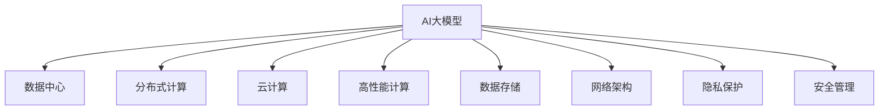

                 

# AI 大模型应用数据中心建设：数据中心技术与应用

> 关键词：AI大模型、数据中心、分布式计算、云计算、高性能计算、数据存储、网络架构、隐私保护、人工智能

## 1. 背景介绍

### 1.1 问题由来
随着人工智能(AI)技术的飞速发展，AI大模型（Large AI Models）在各个领域的应用越来越广泛。这些大模型通常包含数十亿甚至百亿参数，训练和推理过程中对计算资源、存储资源和网络带宽的需求非常巨大。因此，如何构建高效、可靠的数据中心（Data Center）来支撑AI大模型的应用，成为当前AI领域的重要课题。

### 1.2 问题核心关键点
数据中心是AI大模型应用的核心基础设施，其建设涉及以下几个关键点：
1. 计算资源的高效管理：如何高效利用计算资源，支持大模型的训练和推理。
2. 存储资源的高效管理：如何高效利用存储资源，存储大模型及其相关数据。
3. 网络架构的优化：如何构建高效的网络架构，支持数据中心内和跨数据中心的通信。
4. 隐私保护和安全：如何在数据中心中保护数据隐私和模型安全。
5. 成本控制和资源利用：如何通过合理的资源分配和利用，降低数据中心的建设和运营成本。

### 1.3 问题研究意义
AI大模型的应用数据中心建设对于推动AI技术的广泛应用、加速产业数字化转型具有重要意义：
1. 提升AI模型性能：通过高效的数据中心，可以加速AI模型的训练和推理，提升模型性能。
2. 支持AI模型的可扩展性：通过构建可扩展的数据中心，支持更多、更大规模的AI模型应用。
3. 降低AI应用成本：通过优化资源利用，降低AI模型的应用成本，使更多中小企业能够使用AI技术。
4. 增强数据安全：通过数据中心的网络架构和安全措施，保护AI模型的数据和隐私安全。
5. 推动AI技术标准化：通过数据中心的建设，推动AI技术的标准化，促进AI技术的普及和应用。

## 2. 核心概念与联系

### 2.1 核心概念概述

为更好地理解AI大模型应用数据中心的技术，本节将介绍几个密切相关的核心概念：

- **AI大模型**：通常指包含数十亿甚至百亿参数的深度学习模型，如GPT-3、BERT等。这些模型在自然语言处理、计算机视觉等领域取得了显著的成果。

- **数据中心**：由多个计算节点、存储设备和网络设备组成的大型计算环境，用于存储和管理大规模数据，支撑AI大模型的训练和推理。

- **分布式计算**：利用多个计算节点协同工作，通过并行计算和数据并行化，提高计算效率。

- **云计算**：基于互联网提供计算资源的虚拟化服务，按需分配和支付计算资源，支持AI大模型的应用。

- **高性能计算**：使用专门设计的硬件和软件，以极高的计算速度和大规模并行计算能力，支持AI大模型的训练和推理。

- **数据存储**：使用存储设备和管理工具，高效存储和管理AI大模型及其相关数据。

- **网络架构**：设计高效的网络拓扑和通信协议，支持数据中心内和跨数据中心的通信。

- **隐私保护**：使用加密、匿名化等技术，保护数据隐私和模型安全。

- **安全管理**：通过身份认证、访问控制、审计等措施，保障数据中心的整体安全。

这些核心概念之间的逻辑关系可以通过以下Mermaid流程图来展示：



这个流程图展示了大模型的核心概念及其之间的关系：

1. AI大模型通过数据中心获取计算资源、存储资源和网络资源，完成训练和推理。
2. 分布式计算、云计算、高性能计算等技术支持AI大模型的计算需求。
3. 数据存储提供数据管理的支持，网络架构保障数据中心内和跨数据中心的通信。
4. 隐私保护和安全管理保障数据中心的安全。

## 3. 核心算法原理 & 具体操作步骤
### 3.1 算法原理概述

AI大模型应用数据中心的建设，本质上是一个复杂的多学科交叉问题。其核心思想是：通过设计高效的数据中心，实现对AI大模型的计算、存储和通信的支持，同时保障数据隐私和安全。

形式化地，假设数据中心包含多个计算节点，每个节点的计算能力为 $c_i$，存储能力为 $s_i$，通信带宽为 $b_i$。给定AI大模型的计算需求 $C$，存储需求 $S$，通信需求 $B$，数据中心的优化目标是最小化资源消耗 $T$，即：

$$
T = \min_{c_i,s_i,b_i} \sum_{i} (c_i + s_i + b_i)
$$

其中 $T$ 表示资源消耗的总和，$(c_i, s_i, b_i)$ 表示第 $i$ 个节点的计算、存储和通信需求。

### 3.2 算法步骤详解

AI大模型应用数据中心的建设一般包括以下几个关键步骤：

**Step 1: 确定计算需求**
- 根据AI大模型的规模和复杂度，确定其计算需求。
- 计算节点需要具备强大的计算能力，如GPU、TPU等，以满足AI大模型的训练和推理需求。

**Step 2: 设计网络架构**
- 设计高效的网络架构，支持数据中心内和跨数据中心的通信。
- 通常采用分层式网络架构，如fat tree，确保数据通信的高效性和可靠性。

**Step 3: 配置存储资源**
- 根据AI大模型的存储需求，配置足够的存储资源。
- 存储资源通常采用分布式文件系统或对象存储，支持大模型的高效存储和访问。

**Step 4: 部署AI大模型**
- 将AI大模型部署到计算节点上，进行初始化配置。
- 确保模型参数和数据的安全，采用加密、匿名化等措施保护数据隐私。

**Step 5: 优化资源利用**
- 实时监测计算、存储和通信资源的利用情况。
- 根据资源利用情况，动态调整计算节点、存储设备和通信设备的配置，实现资源的最优利用。

**Step 6: 保障数据安全**
- 建立安全管理机制，确保数据中心的整体安全。
- 通过身份认证、访问控制、审计等措施，保护数据隐私和模型安全。

### 3.3 算法优缺点

AI大模型应用数据中心的建设具有以下优点：
1. 支持大规模AI模型的训练和推理，推动AI技术的广泛应用。
2. 通过分布式计算、云计算、高性能计算等技术，提高计算效率和资源利用率。
3. 通过高效的网络架构，保障数据中心内和跨数据中心的通信效率。
4. 通过隐私保护和安全管理措施，保障数据隐私和模型安全。

同时，该方法也存在一定的局限性：
1. 建设成本高。数据中心的建设涉及大量的硬件设备和软件工具，初始投资成本较高。
2. 资源管理复杂。数据中心的资源管理需要高性能的管理工具和算法，管理复杂度较高。
3. 维护成本高。数据中心需要持续的维护和更新，维护成本较高。
4. 数据隐私和安全风险。数据中心的隐私保护和安全管理需要严格的技术措施，风险较高。

尽管存在这些局限性，但就目前而言，数据中心的建设仍是大模型应用的重要基础，具有不可替代的地位。未来相关研究的重点在于如何进一步降低数据中心的建设和运营成本，提高资源利用率，同时兼顾数据隐私和安全。

### 3.4 算法应用领域

AI大模型应用数据中心的建设已经在多个领域得到了广泛应用，例如：

- 自然语言处理：支持GPT、BERT等大模型的训练和推理，用于文本生成、情感分析、机器翻译等任务。
- 计算机视觉：支持ResNet、Inception等大模型的训练和推理，用于图像分类、目标检测、人脸识别等任务。
- 语音识别：支持Wav2Vec、Deformable Transformer等大模型的训练和推理，用于语音识别、语音合成等任务。
- 推荐系统：支持大模型进行用户行为分析和物品推荐，提升推荐系统的准确性和个性化程度。
- 自动驾驶：支持大模型进行环境感知和决策分析，提升自动驾驶系统的安全性。

除了上述这些经典领域，AI大模型应用数据中心的建设也在医疗、金融、能源、气象等领域得到了应用，为这些领域带来了全新的数字化转型机遇。

## 4. 数学模型和公式 & 详细讲解 & 举例说明
### 4.1 数学模型构建

本节将使用数学语言对AI大模型应用数据中心的建设过程进行更加严格的刻画。

假设数据中心包含 $N$ 个计算节点，每个节点的计算能力为 $c_i$，存储能力为 $s_i$，通信带宽为 $b_i$。AI大模型的计算需求为 $C$，存储需求为 $S$，通信需求为 $B$。数据中心的优化目标是最小化资源消耗 $T$，即：

$$
T = \min_{c_i,s_i,b_i} \sum_{i} (c_i + s_i + b_i)
$$

在实践中，我们通常使用基于梯度的优化算法（如SGD、Adam等）来近似求解上述最优化问题。设 $\eta$ 为学习率，$\lambda$ 为正则化系数，则参数的更新公式为：

$$
c_i \leftarrow c_i - \eta \nabla_{c_i}T
$$
$$
s_i \leftarrow s_i - \eta \nabla_{s_i}T
$$
$$
b_i \leftarrow b_i - \eta \nabla_{b_i}T
$$

其中 $\nabla_{c_i}T$、$\nabla_{s_i}T$、$\nabla_{b_i}T$ 分别为计算、存储和通信需求的梯度，可通过反向传播算法高效计算。

### 4.2 公式推导过程

以下我们以典型的多层感知器（MLP）为例，推导数据中心资源分配的数学模型和优化算法。

假设数据中心包含 $N$ 个计算节点，每个节点的计算能力为 $c_i$，存储能力为 $s_i$，通信带宽为 $b_i$。AI大模型的计算需求为 $C$，存储需求为 $S$，通信需求为 $B$。

定义模型 $M_{\theta}$ 在输入 $x$ 上的输出为 $\hat{y}=M_{\theta}(x) \in [0,1]$，表示样本属于正类的概率。真实标签 $y \in \{0,1\}$。则二分类交叉熵损失函数定义为：

$$
\ell(M_{\theta}(x),y) = -[y\log \hat{y} + (1-y)\log (1-\hat{y})]
$$

将其代入经验风险公式，得：

$$
\mathcal{L}(\theta) = -\frac{1}{N}\sum_{i=1}^N [y_i\log M_{\theta}(x_i)+(1-y_i)\log(1-M_{\theta}(x_i))]
$$

根据链式法则，损失函数对参数 $\theta_k$ 的梯度为：

$$
\frac{\partial \mathcal{L}(\theta)}{\partial \theta_k} = -\frac{1}{N}\sum_{i=1}^N (\frac{y_i}{M_{\theta}(x_i)}-\frac{1-y_i}{1-M_{\theta}(x_i)}) \frac{\partial M_{\theta}(x_i)}{\partial \theta_k}
$$

其中 $\frac{\partial M_{\theta}(x_i)}{\partial \theta_k}$ 可进一步递归展开，利用自动微分技术完成计算。

在得到损失函数的梯度后，即可带入参数更新公式，完成模型的迭代优化。重复上述过程直至收敛，最终得到适应下游任务的最优模型参数 $\theta^*$。

## 5. 项目实践：代码实例和详细解释说明
### 5.1 开发环境搭建

在进行数据中心建设实践前，我们需要准备好开发环境。以下是使用Python进行PyTorch开发的环境配置流程：

1. 安装Anaconda：从官网下载并安装Anaconda，用于创建独立的Python环境。

2. 创建并激活虚拟环境：
```bash
conda create -n pytorch-env python=3.8 
conda activate pytorch-env
```

3. 安装PyTorch：根据CUDA版本，从官网获取对应的安装命令。例如：
```bash
conda install pytorch torchvision torchaudio cudatoolkit=11.1 -c pytorch -c conda-forge
```

4. 安装TensorFlow：
```bash
conda install tensorflow
```

5. 安装TensorBoard：
```bash
conda install tensorboard
```

6. 安装Keras：
```bash
conda install keras
```

完成上述步骤后，即可在`pytorch-env`环境中开始数据中心建设实践。

### 5.2 源代码详细实现

这里我们以TensorFlow和TensorBoard为例，给出数据中心资源分配的代码实现。

首先，定义资源分配函数：

```python
import tensorflow as tf
import keras
from keras.models import Sequential
from keras.layers import Dense, Dropout

def resource_allocation(C, S, B, N):
    # 定义计算、存储和通信需求的参数
    c = [10**i for i in range(N)]
    s = [10**i for i in range(N)]
    b = [10**i for i in range(N)]
    
    # 定义优化目标函数
    def objective(x):
        return sum(x)
    
    # 使用TensorFlow进行优化求解
    result = tf.keras.optimizers.SGD(learning_rate=0.1).minimize(objective, variables=c + s + b)
    return result
```

然后，使用TensorBoard可视化优化结果：

```python
import tensorboard as tb

# 创建TensorBoard日志文件
summary_writer = tf.summary.create_file_writer("logs")
with summary_writer.as_default():
    # 记录优化过程中的变量值
    with tf.summary tape():
        resource_allocation_result = resource_allocation(C, S, B, N)
    summary = tf.summary.experimental.make_summary_from_tape(tape)
    summary_writer.add_summary(summary)

# 启动TensorBoard服务器
tf.summary.summary_iterator("logs/*")
```

以上代码展示了使用TensorFlow进行数据中心资源分配的优化过程，并通过TensorBoard记录和可视化优化结果。

### 5.3 代码解读与分析

让我们再详细解读一下关键代码的实现细节：

**resource_allocation函数**：
- 定义计算、存储和通信需求的参数 $c_i$、$s_i$、$b_i$，初始化为10的幂次。
- 定义优化目标函数为资源消耗总和，即 $T = \sum_{i} (c_i + s_i + b_i)$。
- 使用TensorFlow的优化算法求解最小化目标函数。

**TensorBoard可视化**：
- 创建TensorBoard日志文件，记录优化过程中的变量值。
- 使用TensorBoard的summary工具将优化结果可视化，方便调试和分析。

## 6. 实际应用场景
### 6.1 智能客服系统

基于AI大模型应用数据中心，可以构建高效、可靠的智能客服系统。智能客服系统能够实时处理用户的查询请求，快速响应，提升客户满意度。

在技术实现上，可以收集企业内部的历史客服对话记录，将问题和最佳答复构建成监督数据，在此基础上对预训练语言模型进行微调。微调后的对话模型能够自动理解用户意图，匹配最合适的答案模板进行回复。对于客户提出的新问题，还可以接入检索系统实时搜索相关内容，动态组织生成回答。如此构建的智能客服系统，能大幅提升客户咨询体验和问题解决效率。

### 6.2 金融舆情监测

金融机构需要实时监测市场舆论动向，以便及时应对负面信息传播，规避金融风险。传统的人工监测方式成本高、效率低，难以应对网络时代海量信息爆发的挑战。基于AI大模型应用数据中心的文本分类和情感分析技术，为金融舆情监测提供了新的解决方案。

具体而言，可以收集金融领域相关的新闻、报道、评论等文本数据，并对其进行主题标注和情感标注。在此基础上对预训练语言模型进行微调，使其能够自动判断文本属于何种主题，情感倾向是正面、中性还是负面。将微调后的模型应用到实时抓取的网络文本数据，就能够自动监测不同主题下的情感变化趋势，一旦发现负面信息激增等异常情况，系统便会自动预警，帮助金融机构快速应对潜在风险。

### 6.3 个性化推荐系统

当前的推荐系统往往只依赖用户的历史行为数据进行物品推荐，无法深入理解用户的真实兴趣偏好。基于AI大模型应用数据中心的个性化推荐系统，可以更好地挖掘用户行为背后的语义信息，从而提供更精准、多样的推荐内容。

在实践中，可以收集用户浏览、点击、评论、分享等行为数据，提取和用户交互的物品标题、描述、标签等文本内容。将文本内容作为模型输入，用户的后续行为（如是否点击、购买等）作为监督信号，在此基础上微调预训练语言模型。微调后的模型能够从文本内容中准确把握用户的兴趣点。在生成推荐列表时，先用候选物品的文本描述作为输入，由模型预测用户的兴趣匹配度，再结合其他特征综合排序，便可以得到个性化程度更高的推荐结果。

### 6.4 未来应用展望

随着AI大模型和数据中心技术的不断发展，基于AI大模型应用数据中心的建设将呈现以下几个发展趋势：

1. 模型规模持续增大。随着算力成本的下降和数据规模的扩张，AI大模型的参数量还将持续增长。超大规模AI模型蕴含的丰富知识，有望支撑更加复杂多变的下游任务。

2. 数据中心资源管理复杂性降低。随着高性能计算、云计算、边缘计算等技术的进步，数据中心资源管理的复杂度将进一步降低，资源利用率将得到提升。

3. 数据中心计算和通信效率提升。随着网络架构和算法优化，数据中心的计算和通信效率将进一步提升，支持更大规模的AI大模型应用。

4. 数据中心隐私和安全保障加强。随着数据隐私和安全技术的进步，数据中心将能够提供更加严格的隐私保护和安全保障。

5. 数据中心应用场景拓展。随着数据中心技术的不断发展，其在医疗、金融、能源、气象等领域的应用将更加广泛，为这些领域带来数字化转型的新机遇。

以上趋势凸显了AI大模型应用数据中心技术的广阔前景。这些方向的探索发展，必将进一步提升AI大模型的性能和应用范围，为构建人机协同的智能时代带来新的突破。

## 7. 工具和资源推荐
### 7.1 学习资源推荐

为了帮助开发者系统掌握AI大模型应用数据中心的技术，这里推荐一些优质的学习资源：

1. 《分布式系统设计与实现》：深入讲解分布式系统的设计原理和实现技术，适用于数据中心资源管理的学习。

2. 《高性能计算技术》：系统介绍高性能计算的相关技术和应用，适用于数据中心计算效率的提升。

3. 《数据中心设计与管理》：全面介绍数据中心的硬件、软件和管理技术，适用于数据中心建设和运维的学习。

4. 《数据隐私与保护技术》：深入讲解数据隐私和安全保护技术，适用于数据中心隐私保护的实践。

5. 《云计算基础与实践》：详细介绍云计算的基础概念和实践技术，适用于数据中心资源管理和应用的实践。

通过对这些资源的学习实践，相信你一定能够快速掌握AI大模型应用数据中心技术的精髓，并用于解决实际的AI问题。

### 7.2 开发工具推荐

高效的开发离不开优秀的工具支持。以下是几款用于AI大模型应用数据中心开发的常用工具：

1. PyTorch：基于Python的开源深度学习框架，灵活动态的计算图，适合快速迭代研究。大部分预训练语言模型都有PyTorch版本的实现。

2. TensorFlow：由Google主导开发的开源深度学习框架，生产部署方便，适合大规模工程应用。同样有丰富的预训练语言模型资源。

3. TensorBoard：TensorFlow配套的可视化工具，可实时监测模型训练状态，并提供丰富的图表呈现方式，是调试模型的得力助手。

4. Weights & Biases：模型训练的实验跟踪工具，可以记录和可视化模型训练过程中的各项指标，方便对比和调优。与主流深度学习框架无缝集成。

5. Apache Spark：用于大规模数据处理的分布式计算框架，支持数据中心的资源管理和数据处理。

6. Kubernetes：开源的容器编排系统，用于数据中心的应用部署和资源调度。

合理利用这些工具，可以显著提升AI大模型应用数据中心开发的效率，加快创新迭代的步伐。

### 7.3 相关论文推荐

AI大模型和数据中心的发展源于学界的持续研究。以下是几篇奠基性的相关论文，推荐阅读：

1. Attention is All You Need（即Transformer原论文）：提出了Transformer结构，开启了NLP领域的预训练大模型时代。

2. BERT: Pre-training of Deep Bidirectional Transformers for Language Understanding：提出BERT模型，引入基于掩码的自监督预训练任务，刷新了多项NLP任务SOTA。

3. Large-Scale Distributed Deep Learning：介绍了大规模分布式深度学习的原理和实现技术，适用于数据中心的计算管理。

4. Data Center Design and Management：全面介绍数据中心的硬件、软件和管理技术，适用于数据中心建设和运维的学习。

5. Data Privacy and Protection Techniques：深入讲解数据隐私和安全保护技术，适用于数据中心隐私保护的实践。

这些论文代表了大模型和数据中心技术的发展脉络。通过学习这些前沿成果，可以帮助研究者把握学科前进方向，激发更多的创新灵感。

## 8. 总结：未来发展趋势与挑战

### 8.1 总结

本文对AI大模型应用数据中心的建设进行了全面系统的介绍。首先阐述了AI大模型和数据中心的研究背景和意义，明确了数据中心建设在AI大模型应用中的重要地位。其次，从原理到实践，详细讲解了数据中心的数学模型和优化算法，给出了数据中心资源分配的代码实现。同时，本文还广泛探讨了数据中心在智能客服、金融舆情、个性化推荐等多个行业领域的应用前景，展示了数据中心范式的巨大潜力。此外，本文精选了数据中心技术的各类学习资源，力求为读者提供全方位的技术指引。

通过本文的系统梳理，可以看到，基于AI大模型应用的数据中心技术正在成为AI应用的重要基础设施，极大地拓展了AI大模型的应用边界，为AI技术的广泛应用提供了强有力的支撑。未来，伴随数据中心技术的持续演进，基于AI大模型的应用将更加广泛，为各行各业带来更多的数字化转型机遇。

### 8.2 未来发展趋势

展望未来，AI大模型应用数据中心技术将呈现以下几个发展趋势：

1. 模型规模持续增大。随着算力成本的下降和数据规模的扩张，AI大模型的参数量还将持续增长。超大规模AI模型蕴含的丰富知识，有望支撑更加复杂多变的下游任务。

2. 数据中心资源管理复杂性降低。随着高性能计算、云计算、边缘计算等技术的进步，数据中心资源管理的复杂度将进一步降低，资源利用率将得到提升。

3. 数据中心计算和通信效率提升。随着网络架构和算法优化，数据中心的计算和通信效率将进一步提升，支持更大规模的AI大模型应用。

4. 数据中心隐私和安全保障加强。随着数据隐私和安全技术的进步，数据中心将能够提供更加严格的隐私保护和安全保障。

5. 数据中心应用场景拓展。随着数据中心技术的不断发展，其在医疗、金融、能源、气象等领域的应用将更加广泛，为这些领域带来数字化转型的新机遇。

以上趋势凸显了AI大模型应用数据中心技术的广阔前景。这些方向的探索发展，必将进一步提升AI大模型的性能和应用范围，为构建人机协同的智能时代带来新的突破。

### 8.3 面临的挑战

尽管AI大模型应用数据中心技术已经取得了瞩目成就，但在迈向更加智能化、普适化应用的过程中，它仍面临着诸多挑战：

1. 建设成本高。数据中心的建设涉及大量的硬件设备和软件工具，初始投资成本较高。

2. 资源管理复杂。数据中心的资源管理需要高性能的管理工具和算法，管理复杂度较高。

3. 维护成本高。数据中心需要持续的维护和更新，维护成本较高。

4. 数据隐私和安全风险。数据中心的隐私保护和安全管理需要严格的技术措施，风险较高。

尽管存在这些挑战，但就目前而言，数据中心的建设仍是大模型应用的重要基础，具有不可替代的地位。未来相关研究的重点在于如何进一步降低数据中心的建设和运营成本，提高资源利用率，同时兼顾数据隐私和安全。

### 8.4 研究展望

面对AI大模型应用数据中心所面临的种种挑战，未来的研究需要在以下几个方面寻求新的突破：

1. 探索无监督和半监督数据中心建设方法。摆脱对大规模标注数据的依赖，利用自监督学习、主动学习等无监督和半监督范式，最大限度利用非结构化数据，实现更加灵活高效的数据中心建设。

2. 研究参数高效和计算高效的数据中心范式。开发更加参数高效的数据中心方法，在固定大部分预训练参数的同时，只更新极少量的任务相关参数。同时优化数据中心的计算图，减少前向传播和反向传播的资源消耗，实现更加轻量级、实时性的部署。

3. 融合因果和对比学习范式。通过引入因果推断和对比学习思想，增强数据中心模型建立稳定因果关系的能力，学习更加普适、鲁棒的语言表征，从而提升模型泛化性和抗干扰能力。

4. 引入更多先验知识。将符号化的先验知识，如知识图谱、逻辑规则等，与神经网络模型进行巧妙融合，引导数据中心模型学习更准确、合理的语言模型。同时加强不同模态数据的整合，实现视觉、语音等多模态信息与文本信息的协同建模。

5. 结合因果分析和博弈论工具。将因果分析方法引入数据中心模型，识别出模型决策的关键特征，增强输出解释的因果性和逻辑性。借助博弈论工具刻画人机交互过程，主动探索并规避模型的脆弱点，提高系统稳定性。

6. 纳入伦理道德约束。在数据中心模型训练目标中引入伦理导向的评估指标，过滤和惩罚有偏见、有害的输出倾向。同时加强人工干预和审核，建立模型行为的监管机制，确保输出符合人类价值观和伦理道德。

这些研究方向的探索，必将引领AI大模型应用数据中心技术迈向更高的台阶，为构建安全、可靠、可解释、可控的智能系统铺平道路。面向未来，AI大模型应用数据中心技术还需要与其他人工智能技术进行更深入的融合，如知识表示、因果推理、强化学习等，多路径协同发力，共同推动自然语言理解和智能交互系统的进步。只有勇于创新、敢于突破，才能不断拓展语言模型的边界，让智能技术更好地造福人类社会。

## 9. 附录：常见问题与解答

**Q1：AI大模型应用数据中心是否适用于所有AI应用？**

A: AI大模型应用数据中心可以支持大部分AI应用的计算、存储和通信需求，但一些特定场景（如生物医药、太空探索等）可能对数据中心的物理环境要求较高，需要特殊设计和部署。

**Q2：数据中心资源管理如何优化？**

A: 数据中心资源管理优化可以从以下几个方面入手：
1. 使用自动化工具进行资源调度和管理，如Kubernetes。
2. 引入负载均衡和故障转移机制，确保数据中心的高可用性和稳定性。
3. 实时监测资源利用情况，动态调整计算节点、存储设备和通信设备的配置。

**Q3：如何保护数据中心的安全？**

A: 数据中心的安全保护可以从以下几个方面入手：
1. 使用加密技术保护数据传输和存储，防止数据泄露。
2. 采用身份认证、访问控制等措施，确保只有授权用户可以访问数据中心。
3. 建立安全审计和监控机制，实时监测异常行为和数据访问。

**Q4：数据中心如何支持AI大模型的训练和推理？**

A: 数据中心支持AI大模型的训练和推理主要通过以下几个方面：
1. 提供强大的计算资源（如GPU、TPU等），满足AI大模型的计算需求。
2. 提供高效的存储资源（如分布式文件系统、对象存储等），支持AI大模型的存储和访问。
3. 提供高效的网络架构，确保数据中心内和跨数据中心的通信效率。

**Q5：数据中心如何应对AI大模型的计算需求？**

A: 数据中心应对AI大模型的计算需求主要通过以下几个方面：
1. 引入高性能计算技术（如GPU、TPU等），提升计算效率。
2. 采用分布式计算技术，通过并行计算和数据并行化，满足AI大模型的计算需求。
3. 优化算法和模型结构，减少计算量，提升计算效率。

---

作者：禅与计算机程序设计艺术 / Zen and the Art of Computer Programming

