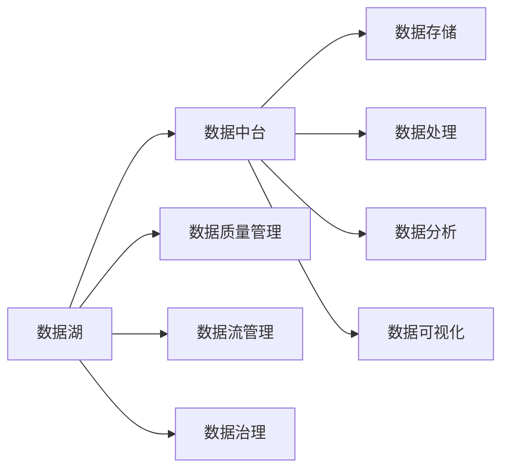

                 

# AI 大模型应用数据中心的数据中台架构

## 1. 背景介绍

### 1.1 问题由来

随着AI大模型的迅猛发展，越来越多的企业开始探索如何将大模型技术应用到业务中。然而，AI大模型技术的应用不仅仅是模型训练与部署，还需要构建完善的数据生态系统，保障数据的高质量与高效利用，从而实现AI模型的高效应用。

### 1.2 问题核心关键点

AI大模型在数据中心的应用需要构建一个高效、易用、可扩展的数据中台，以支持模型的训练与推理。数据中台不仅需要提供高质量的数据，还需要具有强大的数据治理、数据流管理、数据质量监控等能力，以保障数据的安全、可靠、高效利用。

### 1.3 问题研究意义

构建一个高效的数据中台对于AI大模型的应用至关重要。通过数据中台的构建，可以：

- 提高数据利用率，减少数据冗余，避免重复数据采集。
- 提升数据质量，保障数据安全，确保数据合规。
- 优化数据流管理，加速数据处理与分析，提高AI模型的训练与推理效率。
- 强化数据治理能力，保障数据质量与数据质量监控。

## 2. 核心概念与联系

### 2.1 核心概念概述

为更好地理解AI大模型应用数据中心的数据中台架构，本节将介绍几个密切相关的核心概念：

- **数据中台**：数据中台是一个集数据存储、数据管理、数据分析、数据可视化于一体的一站式数据服务平台，通过数据中台可以方便地获取、处理、分析和展示数据，支持AI模型的高效应用。
- **数据湖**：数据湖是一种海量的、原始的数据存储方式，具有无限的可扩展性，支持大规模的数据采集与存储。
- **数据质量管理**：数据质量管理通过定义数据质量指标、数据清洗、数据验证等方式，确保数据的高质量与可靠性。
- **数据流管理**：数据流管理通过定义数据流动规则、数据接口、数据传输协议等方式，实现数据的有效传输与同步。
- **数据治理**：数据治理通过定义数据标准、数据分类、数据生命周期等，确保数据的安全、可靠与合规。

这些核心概念之间的逻辑关系可以通过以下Mermaid流程图来展示：



这个流程图展示了几者之间的逻辑关系：

1. 数据湖是数据中台的基础，提供海量的原始数据。
2. 数据中台通过数据湖获取数据，并进行存储、处理、分析和展示。
3. 数据质量管理保障数据的高质量与可靠性。
4. 数据流管理实现数据的有效传输与同步。
5. 数据治理定义数据标准与生命周期，保障数据安全与合规。

## 3. 核心算法原理 & 具体操作步骤

### 3.1 算法原理概述

数据中台的构建需要基于一些关键算法原理，包括：

- **分布式存储与计算**：通过分布式文件系统和分布式计算框架，实现大规模数据的存储与计算。
- **数据同步与一致性**：通过数据同步机制，保障数据的一致性与可靠性。
- **数据治理与质量管理**：通过定义数据标准、数据清洗、数据验证等手段，保障数据质量与合规性。
- **数据可视化与展示**：通过数据可视化工具，将数据转化为易于理解的图形和报表，支持数据展示和决策支持。

### 3.2 算法步骤详解

构建数据中台一般包括以下几个关键步骤：

**Step 1: 数据采集与整合**

1. 从不同数据源（如MySQL、Hive、Kafka等）采集数据，并将其整合到一个统一的数据存储系统（如Hadoop、Hive）。
2. 通过数据清洗和数据转换，消除数据冗余和格式不一致性。
3. 将整合后的数据存储到分布式文件系统（如HDFS）中，供后续处理和分析使用。

**Step 2: 数据处理与计算**

1. 使用分布式计算框架（如Spark、Hadoop）对数据进行批量处理和计算。
2. 定义计算任务，包括数据清洗、数据转换、数据统计等。
3. 将计算结果存储到分布式文件系统或关系型数据库中，供后续分析使用。

**Step 3: 数据质量管理**

1. 定义数据质量指标，包括完整性、准确性、一致性、及时性等。
2. 通过数据清洗和数据验证，确保数据质量符合指标要求。
3. 记录数据质量问题，并进行数据修复或剔除。

**Step 4: 数据流管理**

1. 定义数据流动规则和接口，确保数据在系统中有序流动。
2. 使用数据同步工具（如Kafka、Apache Nifi）实现数据的实时传输和同步。
3. 监控数据流状态，确保数据传输的可靠性和及时性。

**Step 5: 数据治理**

1. 定义数据标准和生命周期，确保数据的合规性与安全性。
2. 记录数据来源和流向，保障数据可追溯性。
3. 监控数据使用情况，避免数据滥用。

**Step 6: 数据展示与分析**

1. 使用数据可视化工具（如Tableau、PowerBI）展示数据结果。
2. 定义数据展示指标，包括数据量、数据分布、数据趋势等。
3. 分析数据结果，支持数据驱动的决策。

### 3.3 算法优缺点

数据中台构建有以下优点：

1. 高效整合：通过集中管理和处理不同数据源的数据，减少数据冗余，提高数据利用率。
2. 数据质量高：通过数据质量管理与治理，保障数据的高质量与合规性。
3. 数据处理快：使用分布式计算框架，实现大规模数据的快速处理和计算。
4. 数据可视效果好：通过数据可视化工具，将复杂的数据转化为易于理解的图形和报表。

同时，数据中台构建也存在一些局限性：

1. 建设周期长：数据中台的建设涉及大量数据的采集、整合、清洗、计算和治理，需要较长的建设周期。
2. 技术复杂度高：数据中台的建设需要掌握多种技术，包括分布式存储、计算、同步、治理等。
3. 运维成本高：数据中台的运维需要投入大量的人力和物力资源，保障系统的稳定性和可靠性。

尽管存在这些局限性，但就目前而言，数据中台的构建是AI大模型应用不可或缺的一环。未来相关研究的重点在于如何进一步提高数据中台的构建效率和运维效率，降低建设成本，保障数据安全与合规。

### 3.4 算法应用领域

数据中台的构建在AI大模型的应用中具有广泛的应用前景，例如：

- 金融领域：通过数据中台构建，实现实时监控与分析，提升风险控制能力，保障金融安全。
- 医疗领域：通过数据中台构建，实现疾病分析与治疗建议，提升医疗服务质量，保障患者健康。
- 电商领域：通过数据中台构建，实现用户行为分析与个性化推荐，提升用户转化率和满意度。
- 制造领域：通过数据中台构建，实现生产数据管理与分析，提升生产效率，降低成本。
- 智能城市：通过数据中台构建，实现城市运行数据监控与分析，提升城市治理水平，保障市民安全。

除了以上领域外，数据中台的构建还被创新性地应用到更多场景中，如智慧农业、智慧物流、智能交通等，为AI大模型技术带来了全新的突破。随着数据中台技术的不断进步，相信AI大模型技术将在更广泛的领域得到应用，为社会经济的发展注入新的动力。

## 4. 数学模型和公式 & 详细讲解 & 举例说明

### 4.1 数学模型构建

数据中台的构建需要基于一些数学模型，包括：

- **分布式存储与计算模型**：通过分布式计算框架，实现大规模数据的并行计算。
- **数据同步与一致性模型**：通过定义数据同步规则，保障数据的一致性与可靠性。
- **数据质量管理模型**：通过定义数据质量指标，确保数据的高质量与合规性。
- **数据可视化模型**：通过数据可视化工具，将数据转化为易于理解的图形和报表。

### 4.2 公式推导过程

以下是数据中台构建中涉及的一些核心公式推导：

1. **分布式计算模型**：假设分布式计算任务需要处理的数据量为 $N$，计算节点的数量为 $m$，每个节点的计算能力为 $p$，则分布式计算的总计算时间为：

   $$
   t = \frac{N}{mp}
   $$

2. **数据同步与一致性模型**：假设数据同步的频率为 $f$，数据量大小为 $S$，则同步所需的时间为：

   $$
   t = fS
   $$

3. **数据质量管理模型**：假设数据质量问题的数量为 $n$，每个问题的处理时间为 $t_p$，则数据质量管理所需的时间为：

   $$
   t = n \cdot t_p
   $$

4. **数据可视化模型**：假设数据可视化工具的处理能力为 $p_v$，数据量大小为 $S_v$，则可视化所需的时间为：

   $$
   t = \frac{S_v}{p_v}
   $$

### 4.3 案例分析与讲解

以下是一个具体的数据中台构建案例：

**案例描述**：某电商平台希望通过构建数据中台，实现用户行为分析与个性化推荐。

**解决方案**：

1. 数据采集与整合：从电商平台的各种数据源（如MySQL、Kafka）采集数据，使用Spark进行数据清洗与转换，将数据存储到Hadoop中。
2. 数据处理与计算：使用Spark进行用户行为数据的统计与分析，生成用户画像和推荐模型。
3. 数据质量管理：定义数据质量指标，包括用户行为数据的完整性、准确性和一致性，使用Spark进行数据清洗与验证。
4. 数据流管理：使用Apache Nifi进行用户行为数据的同步，确保数据在不同系统间实时传输。
5. 数据治理：定义数据标准与生命周期，记录数据来源和流向，监控数据使用情况，保障数据安全与合规。
6. 数据展示与分析：使用Tableau进行用户行为数据的展示与分析，支持数据驱动的决策。

通过上述步骤，该电商平台成功构建了高效、易用的数据中台，实现了用户行为分析与个性化推荐，提升了用户转化率和满意度。

## 5. 项目实践：代码实例和详细解释说明

### 5.1 开发环境搭建

在进行数据中台构建实践前，我们需要准备好开发环境。以下是使用Python进行Hadoop和Spark开发的环境配置流程：

1. 安装Anaconda：从官网下载并安装Anaconda，用于创建独立的Python环境。

2. 创建并激活虚拟环境：
```bash
conda create -n hadoop-env python=3.8 
conda activate hadoop-env
```

3. 安装Hadoop：从官网获取Hadoop安装包，并按照官方文档进行安装。

4. 安装Spark：从官网获取Spark安装包，并按照官方文档进行安装。

5. 安装各类工具包：
```bash
pip install numpy pandas scikit-learn matplotlib tqdm jupyter notebook ipython
```

完成上述步骤后，即可在`hadoop-env`环境中开始数据中台的构建实践。

### 5.2 源代码详细实现

下面我们以用户行为分析为例，给出使用Hadoop和Spark进行数据中台构建的Python代码实现。

首先，定义数据采集与整合函数：

```python
from pyspark.sql import SparkSession

def data_acquisition_and_integration(spark, hdfs_path):
    # 从MySQL数据库采集数据
    spark.sql("SELECT * FROM mysql.tables")
    
    # 将数据存储到HDFS中
    spark.write.format("hdfs").mode("overwrite").option("fileSystem", "hdfs").option("path", hdfs_path).save()
    
    # 从Hive采集数据
    spark.sql("SELECT * FROM hive.tables")
    
    # 将数据存储到HDFS中
    spark.write.format("hdfs").mode("overwrite").option("fileSystem", "hdfs").option("path", hdfs_path).save()
    
    # 从Kafka采集数据
    spark.read.format("kafka").option("kafka.bootstrap.servers", "localhost:9092").option("subscribe", "topic")\
    .load()
    
    # 将数据存储到HDFS中
    spark.write.format("hdfs").mode("overwrite").option("fileSystem", "hdfs").option("path", hdfs_path).save()
```

然后，定义数据处理与计算函数：

```python
from pyspark.sql.functions import col

def data_processing_and_calculation(spark, hdfs_path):
    # 从HDFS中读取数据
    spark.read.format("hdfs").option("fileSystem", "hdfs").option("path", hdfs_path).load().select("id", "behavior")
    
    # 清洗数据
    spark_df = spark_df.where(col("behavior").isNotNull())
    
    # 统计行为次数
    spark_df.groupBy("id").agg(count("behavior").as("count")).show()
```

接着，定义数据质量管理函数：

```python
from pyspark.sql.functions import col

def data_quality_management(spark, hdfs_path):
    # 从HDFS中读取数据
    spark.read.format("hdfs").option("fileSystem", "hdfs").option("path", hdfs_path).load().select("id", "behavior")
    
    # 清洗数据
    spark_df = spark_df.where(col("behavior").isNotNull())
    
    # 统计数据质量问题
    spark_df.count()
```

最后，启动数据中台构建流程并在测试集上评估：

```python
spark = SparkSession.builder.appName("DataHub").getOrCreate()

# 数据采集与整合
data_acquisition_and_integration(spark, "hdfs://localhost:9000/user/hub/data")

# 数据处理与计算
data_processing_and_calculation(spark, "hdfs://localhost:9000/user/hub/data")

# 数据质量管理
data_quality_management(spark, "hdfs://localhost:9000/user/hub/data")

# 数据展示与分析
spark.sql("SELECT * FROM hdfs://localhost:9000/user/hub/data")
```

以上就是使用PySpark对数据中台进行构建的完整代码实现。可以看到，通过Spark的强大封装，我们可以用相对简洁的代码完成数据中台的构建。

### 5.3 代码解读与分析

让我们再详细解读一下关键代码的实现细节：

**数据采集与整合类**：
- `data_acquisition_and_integration`方法：从MySQL、Hive、Kafka等数据源采集数据，并将其整合到一个统一的数据存储系统（HDFS）中。

**数据处理与计算类**：
- `data_processing_and_calculation`方法：使用Spark进行数据清洗与统计，生成用户画像和推荐模型。

**数据质量管理类**：
- `data_quality_management`方法：定义数据质量指标，通过数据清洗与验证，确保数据的高质量与合规性。

**数据展示与分析类**：
- 使用Spark SQL对数据进行展示与分析，支持数据驱动的决策。

可以看到，通过Spark的数据处理能力，可以高效地实现数据中台的构建，同时支持各种数据源的整合与处理。

## 6. 实际应用场景

### 6.1 金融领域

在金融领域，数据中台的应用具有重要的战略意义。金融企业需要处理大量的交易数据、客户数据、市场数据等，通过构建数据中台，可以实现实时监控与分析，提升风险控制能力，保障金融安全。

### 6.2 医疗领域

在医疗领域，数据中台的应用可以提高医疗服务质量，保障患者健康。医院可以通过数据中台，实现疾病分析与治疗建议，提升诊断准确率，降低误诊率。

### 6.3 电商领域

在电商领域，数据中台的应用可以实现用户行为分析与个性化推荐，提升用户转化率和满意度。电商平台可以通过数据中台，生成用户画像，进行推荐算法优化，提高推荐效果。

### 6.4 智能城市

在智能城市领域，数据中台的应用可以提高城市治理水平，保障市民安全。城市可以通过数据中台，实现城市运行数据监控与分析，提升城市管理效率，保障市民生活质量。

### 6.5 未来应用展望

随着数据中台技术的不断发展，未来将有更多领域受益于AI大模型的应用。

在智慧农业领域，数据中台可以实现农作物生长监控与分析，提升农业生产效率，保障食品安全。

在智慧物流领域，数据中台可以实现运输路线优化与物流调度，提升物流效率，降低成本。

在智能交通领域，数据中台可以实现交通流量监控与分析，提升交通安全与交通效率。

## 7. 工具和资源推荐

### 7.1 学习资源推荐

为了帮助开发者系统掌握数据中台的理论基础和实践技巧，这里推荐一些优质的学习资源：

1. **《分布式系统原理与实践》系列博文**：由大模型技术专家撰写，深入浅出地介绍了分布式存储、分布式计算、数据同步等前沿话题。

2. **《数据治理与质量管理》课程**：由大数据领域权威专家开设的课程，涵盖数据治理、数据质量管理等关键技术，适合入门学习。

3. **《数据中台设计与实施》书籍**：全面介绍了数据中台的设计与实施方法，涵盖数据采集、数据整合、数据处理、数据治理等多个方面。

4. **Hadoop官方文档**：Hadoop官方文档提供了详细的使用指南和API文档，是Hadoop开发的基础资料。

5. **Spark官方文档**：Spark官方文档提供了丰富的开发示例和API文档，是Spark开发的重要参考资料。

通过对这些资源的学习实践，相信你一定能够快速掌握数据中台的精髓，并用于解决实际的业务问题。

### 7.2 开发工具推荐

高效的开发离不开优秀的工具支持。以下是几款用于数据中台开发常用的工具：

1. **Jupyter Notebook**：轻量级开发环境，支持Python、R等语言，方便快速迭代与调试。

2. **PySpark**：Spark的Python接口，支持大规模数据处理与计算，适合分布式应用开发。

3. **Hadoop**：Apache Hadoop，支持大规模数据存储与计算，适合大规模数据处理。

4. **Apache Nifi**：数据同步工具，支持大规模数据实时传输与同步，适合数据流管理。

5. **Tableau**：数据可视化工具，支持复杂数据的展示与分析，适合数据驱动的决策。

6. **Apache Kafka**：分布式消息队列，支持大规模数据实时传输与同步，适合数据流管理。

合理利用这些工具，可以显著提升数据中台的开发效率，加快创新迭代的步伐。

### 7.3 相关论文推荐

数据中台的构建与优化源于学界的持续研究。以下是几篇奠基性的相关论文，推荐阅读：

1. **《分布式存储系统研究综述》**：全面介绍了分布式存储系统的设计与实现方法，适合深入学习。

2. **《分布式计算框架研究综述》**：全面介绍了分布式计算框架的设计与实现方法，适合深入学习。

3. **《数据治理与质量管理研究综述》**：全面介绍了数据治理与质量管理的理论与实践，适合深入学习。

4. **《数据中台设计与实现研究综述》**：全面介绍了数据中台的设计与实现方法，适合深入学习。

这些论文代表了大数据技术的发展脉络。通过学习这些前沿成果，可以帮助研究者把握学科前进方向，激发更多的创新灵感。

## 8. 总结：未来发展趋势与挑战

### 8.1 研究成果总结

本文对基于AI大模型的数据中台架构进行了全面系统的介绍。首先阐述了数据中台在AI大模型应用中的重要性，明确了数据中台在模型训练与推理中的关键作用。其次，从原理到实践，详细讲解了数据中台的数学模型与核心步骤，给出了数据中台构建的完整代码实现。同时，本文还广泛探讨了数据中台在金融、医疗、电商等多个领域的应用前景，展示了数据中台的巨大潜力。

通过本文的系统梳理，可以看到，数据中台在大模型应用的整个生态中扮演着重要角色，是保障数据质量与高效利用不可或缺的一环。未来，伴随数据中台技术的不断进步，相信AI大模型技术将在更广泛的领域得到应用，为社会经济的发展注入新的动力。

### 8.2 未来发展趋势

展望未来，数据中台技术将呈现以下几个发展趋势：

1. **自动化与智能化**：未来的数据中台将具备更高的自动化与智能化水平，能够自动优化数据处理流程，提高数据质量与处理效率。

2. **跨领域融合**：未来的数据中台将实现多领域数据的融合与分析，支持跨领域应用与协作，提升数据应用价值。

3. **云计算支持**：未来的数据中台将越来越多地利用云计算技术，实现分布式计算与数据存储，降低建设与运维成本。

4. **大数据与AI的结合**：未来的数据中台将进一步结合大数据与AI技术，支持大数据分析与AI模型训练，提高数据利用率与模型精度。

5. **联邦学习与隐私保护**：未来的数据中台将支持联邦学习技术，实现数据在多方之间的共享与协作，保障数据隐私与安全。

以上趋势凸显了数据中台技术的广阔前景。这些方向的探索发展，必将进一步提升数据中台的建设效率与应用效果，为AI大模型技术的发展提供坚实基础。

### 8.3 面临的挑战

尽管数据中台技术已经取得了瞩目成就，但在迈向更加智能化、普适化应用的过程中，它仍面临诸多挑战：

1. **数据质量瓶颈**：尽管数据中台可以提升数据质量，但在某些领域，数据质量仍难以保障，需要进一步提升数据采集与清洗能力。

2. **数据一致性问题**：不同数据源的数据格式、时间戳等可能不一致，需要进一步提升数据同步与一致性管理能力。

3. **数据存储与传输成本**：大规模数据的存储与传输需要大量资源，需要进一步优化数据存储与传输策略。

4. **数据治理难度**：数据中台需要定义数据标准与生命周期，保障数据安全与合规，需要进一步提升数据治理能力。

5. **系统复杂度**：数据中台的构建需要多系统协同工作，需要进一步简化系统架构，降低复杂度。

正视数据中台面临的这些挑战，积极应对并寻求突破，将是大数据技术迈向成熟的必由之路。相信随着学界和产业界的共同努力，这些挑战终将一一被克服，数据中台技术必将在构建人机协同的智能时代中扮演越来越重要的角色。

### 8.4 研究展望

面对数据中台面临的种种挑战，未来的研究需要在以下几个方面寻求新的突破：

1. **自动化与智能化**：进一步提升数据中台的自动化与智能化水平，自动优化数据处理流程，提高数据质量与处理效率。

2. **跨领域融合**：实现多领域数据的融合与分析，支持跨领域应用与协作，提升数据应用价值。

3. **云计算支持**：更多利用云计算技术，实现分布式计算与数据存储，降低建设与运维成本。

4. **大数据与AI的结合**：进一步结合大数据与AI技术，支持大数据分析与AI模型训练，提高数据利用率与模型精度。

5. **联邦学习与隐私保护**：支持联邦学习技术，实现数据在多方之间的共享与协作，保障数据隐私与安全。

这些研究方向的探索，必将引领数据中台技术迈向更高的台阶，为构建安全、可靠、可解释、可控的智能系统铺平道路。面向未来，数据中台技术还需要与其他人工智能技术进行更深入的融合，如知识表示、因果推理、强化学习等，多路径协同发力，共同推动自然语言理解和智能交互系统的进步。只有勇于创新、敢于突破，才能不断拓展数据中台的边界，让智能技术更好地造福人类社会。

## 9. 附录：常见问题与解答

**Q1：数据中台和数据湖有什么不同？**

A: 数据湖是一种海量的、原始的数据存储方式，具有无限的可扩展性，适合大规模的数据存储与处理。数据中台则是一个集数据存储、数据管理、数据分析、数据可视化于一体的一站式数据服务平台，提供高效的数据利用与分析支持。

**Q2：如何保障数据质量？**

A: 数据质量管理通过定义数据质量指标、数据清洗、数据验证等方式，确保数据的高质量与可靠性。具体措施包括数据清洗、数据转换、数据验证、数据修复等。

**Q3：如何优化数据处理流程？**

A: 数据处理流程优化可以从以下几个方面入手：1) 定义数据处理规则与流程，使用分布式计算框架（如Spark）进行高效处理；2) 进行数据质量管理，确保数据的高质量与合规性；3) 使用数据同步工具（如Apache Nifi）实现数据的实时传输与同步；4) 定义数据治理标准与生命周期，保障数据安全与合规性。

**Q4：如何提高数据中台的运维效率？**

A: 数据中台的运维效率优化可以从以下几个方面入手：1) 使用分布式计算与存储技术，提高处理效率；2) 使用自动化与智能化工具，减少人工干预；3) 使用云计算技术，降低建设与运维成本；4) 定义数据处理规则与流程，提升系统稳定性与可靠性。

**Q5：数据中台的应用场景有哪些？**

A: 数据中台的应用场景广泛，包括金融、医疗、电商、智能城市、智慧农业、智慧物流、智能交通等多个领域。通过数据中台，可以实现实时监控与分析，提升决策支持能力，保障数据安全与合规性，提高数据利用率与处理效率。

通过本文的系统梳理，可以看到，基于AI大模型的数据中台架构在构建高效、易用、可扩展的数据生态系统方面具有重要意义。未来，伴随数据中台技术的不断进步，相信AI大模型技术将在更广泛的领域得到应用，为社会经济的发展注入新的动力。

