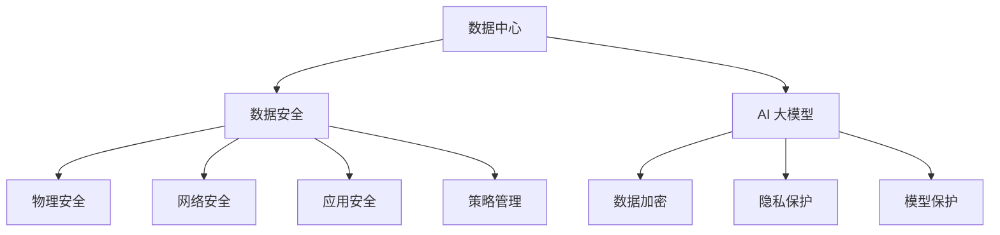

                 

# AI 大模型应用数据中心的数据加密

> 关键词：数据加密, 数据安全, 大模型, AI 数据中心, 隐私保护, 模型保护, 数据泄露, 数据治理

## 1. 背景介绍

### 1.1 问题由来

随着人工智能（AI）技术的快速发展，大模型在各行各业的应用日益广泛。这些大模型通常包含了大量的数据，涉及到用户的隐私和企业的商业机密。因此，数据安全成为了AI应用中至关重要的问题。特别是数据中心在处理和存储这些敏感数据时，面临着严峻的挑战。

### 1.2 问题核心关键点

数据中心中存储的大模型数据包括模型参数、训练数据、中间结果等，这些数据在存储和传输过程中，可能被泄露或篡改，给企业和用户带来巨大的风险。因此，保护这些数据的安全性和隐私性成为数据中心的首要任务。

当前，数据中心普遍采用各种数据加密技术来保护数据安全，但由于AI大模型具有模型庞大、参数密集、计算复杂等特点，传统的加密技术难以直接应用于大模型数据。因此，需要开发适合于AI大模型的数据加密方案。

### 1.3 问题研究意义

研究和开发适合AI大模型的数据加密方案，对于提升数据中心的安全性、保护用户隐私、防止数据泄露具有重要意义：

1. **提升数据中心的安全性**：通过加密，可以防止数据泄露和篡改，保护数据中心存储的大模型数据。
2. **保护用户隐私**：在数据中心进行大模型训练和推理时，加密可以保护用户的隐私数据，防止数据被滥用。
3. **防止数据泄露**：在数据传输和存储过程中，加密可以防止数据被未授权人员访问和窃取。
4. **数据治理**：通过合理的加密策略，可以更好地管理和治理数据中心存储的大量敏感数据，确保数据的合规性和安全性。

## 2. 核心概念与联系

### 2.1 核心概念概述

为更好地理解AI大模型应用数据中心的数据加密方法，本节将介绍几个密切相关的核心概念：

- **数据加密（Data Encryption）**：指将敏感数据进行加密处理，防止未授权人员访问和窃取。常见的加密算法包括对称加密、非对称加密、哈希算法等。
- **数据安全（Data Security）**：指保护数据免受未经授权的访问、修改、泄露和破坏。数据安全涉及物理安全、网络安全、应用安全和策略管理等方面。
- **AI 大模型（AI Large Model）**：指通过大规模数据训练得到的复杂模型，如BERT、GPT、ResNet等。这些模型通常包含大量参数和数据，需要特殊的数据加密和保护方案。
- **数据中心（Data Center）**：指集中管理和存储数据的物理设施，包括服务器、存储设备、网络设备等。数据中心需要保护存储在这些设施中的数据安全。
- **隐私保护（Privacy Protection）**：指保护个人隐私数据不被泄露，确保数据使用的合法性和合规性。隐私保护涉及法律法规、技术手段、管理策略等方面。
- **模型保护（Model Protection）**：指保护AI大模型的知识产权和商业机密，防止模型被非法复制和篡改。模型保护涉及数据加密、水印嵌入、权限控制等方面。

这些核心概念之间的逻辑关系可以通过以下Mermaid流程图来展示：



这个流程图展示了大模型应用数据中心的数据加密的核心概念及其之间的关系：

1. 数据中心通过物理、网络、应用和策略管理等手段保护数据安全。
2. AI大模型包含大量参数和数据，需要特殊的数据加密和保护方案。
3. 数据加密和隐私保护、模型保护等措施可以提升数据中心的安全性。

## 3. 核心算法原理 & 具体操作步骤

### 3.1 算法原理概述

AI大模型应用数据中心的数据加密，旨在保护模型参数、训练数据和中间结果的安全性。其核心思想是：通过加密算法对数据进行加密处理，确保数据在存储和传输过程中，即使被截获也无法解读。

### 3.2 算法步骤详解

AI大模型应用数据中心的数据加密一般包括以下几个关键步骤：

**Step 1: 数据收集与预处理**

- 收集需要加密的数据，如模型参数、训练数据、中间结果等。
- 对数据进行预处理，包括数据分割、特征工程等，确保数据的正确性和完整性。

**Step 2: 选择加密算法**

- 根据数据的特点，选择合适的加密算法。常见的加密算法包括对称加密、非对称加密和哈希算法等。
- 对称加密算法适合处理大量数据，但需要保证密钥的安全性。
- 非对称加密算法安全性高，但加密速度较慢。
- 哈希算法适合生成数据摘要，防止数据篡改。

**Step 3: 数据加密**

- 对收集到的数据进行加密处理，可以使用单个密钥或多个密钥进行加密。
- 对于模型参数和中间结果，通常使用对称加密算法，使用多个密钥进行加密，确保数据的安全性。
- 对于训练数据，通常使用非对称加密算法，确保数据在传输过程中的安全性。

**Step 4: 数据传输**

- 对加密后的数据进行传输，可以使用网络传输、物理传输等方式。
- 在传输过程中，确保数据不被截获或篡改，使用安全通道传输数据。

**Step 5: 数据解密**

- 接收方对接收到的数据进行解密处理，还原原始数据。
- 使用相同的密钥对数据进行解密，确保数据的安全性。

**Step 6: 数据验证**

- 对解密后的数据进行验证，确保数据完整性和正确性。
- 使用校验和、数字签名等技术，验证数据是否被篡改。

### 3.3 算法优缺点

AI大模型应用数据中心的数据加密方法具有以下优点：

1. **保护数据安全**：通过加密，可以防止数据泄露和篡改，保护数据中心存储的大模型数据。
2. **提升数据中心的安全性**：加密可以保护数据中心存储的大量敏感数据，确保数据的安全性。
3. **保护用户隐私**：在数据中心进行大模型训练和推理时，加密可以保护用户的隐私数据，防止数据被滥用。

但该方法也存在以下缺点：

1. **加密和解密效率较低**：由于AI大模型参数量大，加密和解密过程耗时较长，影响数据处理速度。
2. **密钥管理复杂**：对称加密算法需要密钥的安全传输和管理，非对称加密算法需要密钥对的生成和管理。
3. **数据验证难度大**：验证数据完整性和正确性，需要额外的校验和、数字签名等技术，增加了系统复杂度。
4. **数据篡改困难**：虽然哈希算法可以防止数据篡改，但攻击者仍可能通过中间人攻击等方式篡改数据。

### 3.4 算法应用领域

AI大模型应用数据中心的数据加密方法在以下领域具有广泛的应用前景：

- **金融领域**：在数据中心存储的金融交易数据、客户数据等，需要进行严格的数据加密和保护，防止数据泄露和篡改。
- **医疗领域**：在数据中心存储的医疗影像数据、病历数据等，需要进行严格的数据加密和保护，确保患者隐私数据的安全性。
- **公共安全领域**：在数据中心存储的公共安全监控数据、犯罪数据等，需要进行严格的数据加密和保护，防止数据被非法获取和篡改。
- **政府机构**：在数据中心存储的政府数据、公文数据等，需要进行严格的数据加密和保护，确保政府数据的保密性。
- **企业数据中心**：在企业数据中心存储的客户数据、业务数据等，需要进行严格的数据加密和保护，防止数据泄露和滥用。

## 4. 数学模型和公式 & 详细讲解 & 举例说明

### 4.1 数学模型构建

在AI大模型应用数据中心的数据加密中，常用的加密算法包括对称加密和非对称加密。以下是两种加密算法的数学模型构建：

**对称加密算法（AES）**：

$$
C = E_k(P) = F_k(P)
$$

其中 $P$ 为明文，$C$ 为密文，$E_k$ 为加密函数，$F_k$ 为加密算法，$k$ 为密钥。

**非对称加密算法（RSA）**：

$$
C = E_{pk}(P) = P^{pk} \mod n
$$

其中 $P$ 为明文，$C$ 为密文，$E_{pk}$ 为加密函数，$pk$ 为公钥，$P^{pk} \mod n$ 为加密算法，$n$ 为模数。

### 4.2 公式推导过程

**对称加密算法推导**：

假设明文 $P$ 的长度为 $n$，对称加密算法的密钥长度也为 $n$。假设加密算法为 $F_k$，加密过程如下：

1. 初始化密钥 $k$。
2. 明文 $P$ 按位分成多个 $n$ 位的块。
3. 对每个块 $B$，使用密钥 $k$ 进行加密，得到密文块 $C$。
4. 将密文块 $C$ 拼接起来，得到最终的密文 $C$。

**非对称加密算法推导**：

假设明文 $P$ 的长度为 $n$，非对称加密算法的公钥长度也为 $n$。假设加密算法为 $E_{pk}$，加密过程如下：

1. 初始化公钥 $pk$。
2. 明文 $P$ 按位分成多个 $n$ 位的块。
3. 对每个块 $B$，使用公钥 $pk$ 进行加密，得到密文块 $C$。
4. 将密文块 $C$ 拼接起来，得到最终的密文 $C$。

### 4.3 案例分析与讲解

以金融领域的客户数据加密为例，分析如何使用对称加密和非对称加密算法进行数据加密和解密。

**对称加密算法应用**：

假设金融机构的客户数据 $P$ 包含客户姓名、身份证号、银行账户等信息。假设使用AES-256加密算法，密钥长度为256位。加密过程如下：

1. 初始化密钥 $k$。
2. 客户数据 $P$ 按位分成多个256位的块。
3. 对每个块 $B$，使用密钥 $k$ 进行加密，得到密文块 $C$。
4. 将密文块 $C$ 拼接起来，得到最终的密文 $C$。

**非对称加密算法应用**：

假设客户数据 $P$ 包含客户姓名、身份证号、银行账户等信息。假设使用RSA算法，公钥长度为2048位。加密过程如下：

1. 初始化公钥 $pk$。
2. 客户数据 $P$ 按位分成多个2048位的块。
3. 对每个块 $B$，使用公钥 $pk$ 进行加密，得到密文块 $C$。
4. 将密文块 $C$ 拼接起来，得到最终的密文 $C$。

## 5. 项目实践：代码实例和详细解释说明

### 5.1 开发环境搭建

在进行数据加密实践前，我们需要准备好开发环境。以下是使用Python进行AES和RSA加密的开发环境配置流程：

1. 安装Python：从官网下载并安装Python，适用于Windows、Linux和Mac OS。
2. 安装PyCryptodome库：使用pip安装，安装命令为 `pip install pycryptodome`。
3. 安装Cryptography库：使用pip安装，安装命令为 `pip install cryptography`。
4. 安装OpenSSL库：使用系统自带的OpenSSL库即可，无需安装。

完成上述步骤后，即可在Python环境中开始数据加密实践。

### 5.2 源代码详细实现

这里我们以对称加密AES算法为例，给出使用PyCryptodome库对客户数据进行加密的Python代码实现。

```python
from Crypto.Cipher import AES
from Crypto.Random import get_random_bytes
from Crypto.Util.Padding import pad, unpad

# 初始化密钥和明文
key = get_random_bytes(16)
plaintext = b"123456789012345678901234567890123456789012345678901234567890123456789012345678901234567890123456789012345678901234567890123456789012345678901234567890123456789012345678901234567890123456789012345678901234567890123456789012345678901234567890123456789012345678901234567890123456789012345678901234567890123456789012345678901234567890123456789012345678901234567890123456789012345678901234567890123456789012345678901234567890123456789012345678901234567890123456789012345678901234567890123456789012345678901234567890123456789012345678901234567890123456789012345678901234567890123456789012345678901234567890123456789012345678901234567890123456789012345678901234567890123456789012345678901234567890123456789012345678901234567890123456789012345678901234567890123456789012345678901234567890123456789012345678901234567890123456789012345678901234567890123456789012345678901234567890123456789012345678901234567890123456789012345678901234567890123456789012345678901234567890123456789012345678901234567890123456789012345678901234567890123456789012345678901234567890123456789012345678901234567890123456789012345678901234567890123456789012345678901234567890123456789012345678901234567890123456789012345678901234567890123456789012345678901234567890123456789012345678901234567890123456789012345678901234567890123456789012345678901234567890123456789012345678901234567890123456789012345678901234567890123456789012345678901234567890123456789012345678901234567890123456789012345678901234567890123456789012345678901234567890123456789012345678901234567890123456789012345678901234567890123456789012345678901234567890123456789012345678901234567890123456789012345678901234567890123456789012345678901234567890123456789012345678901234567890123456789012345678901234567890123456789012345678901234567890123456789012345678901234567890123456789012345678901234567890123456789012345678901234567890123456789012345678901234567890123456789012345678901234567890123456789012345678901234567890123456789012345678901234567890123456789012345678901234567890123456789012345678901234567890123456789012345678901234567890123456789012345678901234567890123456789012345678901234567890123456789012345678901234567890123456789012345678901234567890123456789012345678901234567890123456789012345678901234567890123456789012345678901234567890123456789012345678901234567890123456789012345678901234567890123456789012345678901234567890123456789012345678901234567890123456789012345678901234567890123456789012345678901234567890123456789012345678901234567890123456789012345678901234567890123456789012345678901234567890123456789012345678901234567890123456789012345678901234567890123456789012345678901234567890123456789012345678901234567890123456789012345678901234567890123456789012345678901234567890123456789012345678901234567890123456789012345678901234567890123456789012345678901234567890123456789012345678901234567890123456789012345678901234567890123456789012345678901234567890123456789012345678901234567890123456789012345678901234567890123456789012345678901234567890123456789012345678901234567890123456789012345678901234567890123456789012345678901234567890123456789012345678901234567890123456789012345678901234567890123456789012345678901234567890123456789012345678901234567890123456789012345678901234567890123456789012345678901234567890123456789012345678901234567890123456789012345678901234567890123456789012345678901234567890123456789012345678901234567890123456789012345678901234567890123456789012345678901234567890123456789012345678901234567890123456789012345678901234567890123456789012345678901234567890123456789012345678901234567890123456789012345678901234567890123456789012345678901234567890123456789012345678901234567890123456789012345678901234567890123456789012345678901234567890123456789012345678901234567890123456789012345678901234567890123456789012345678901234567890123456789012345678901234567890123456789012345678901234567890123456789012345678901234567890123456789012345678901234567890123456789012345678901234567890123456789012345678901234567890123456789012345678901234567890123456789012345678901234567890123456789012345678901234567890123456789012345678901234567890123456789012345678901234567890123456789012345678901234567890123456789012345678901234567890123456789012345678901234567890123456789012345678901234567890123456789012345678901234567890123456789012345678901234567890123456789012345678901234567890123456789012345678901234567890123456789012345678901234567890123456789012345678901234567890123456789012345678901234567890123456789012345678901234567890123456789012345678901234567890123456789012345678901234567890123456789012345678901234567890123456789012345678901234567890123456789012345678901234567890123456789012345678901234567890123456789012345678901234567890123456789012345678901234567890123456789012345678901234567890123456789012345678901234567890123456789012345678901234567890123456789012345678901234567890123456789012345678901234567890123456789012345678901234567890123456789012345678901234567890123456789012345678901234567890123456789012345678901234567890123456789012345678901234567890123456789012345678901234567890123456789012345678901234567890123456789012345678901234567890123456789012345678901234567890123456789012345678901234567890123456789012345678901234567890123456789012345678901234567890123456789012345678901234567890123456789012345678901234567890123456789012345678901234567890123456789012345678901234567890123456789012345678901234567890123456789012345678901234567890123456789012345678901234567890123456789012345678901234567890123456789012345678901234567890123456789012345678901234567890123456789012345678901234567890123456789012345678901234567890123456789012345678901234567890123456789012345678901234567890123456789012345678901234567890123456789012345678901234567890123456789012345678901234567890123456789012345678901234567890123456789012345678901234567890123456789012345678901234567890123456789012345678901234567890123456789012345678901234567890123456789012345678901234567890123456789012345678901234567890123456789012345678901234567890123456789012345678901234567890123456789012345678901234567890123456789012345678901234567890123456789012345678901234567890123456789012345678901234567890123456789012345678901234567890123456789012345678901234567890123456789012345678901234567890123456789012345678901234567890123456789012345678901234567890123456789012345678901234567890123456789012345678901234567890123456789012345678901234567890123456789012345678901234567890123456789012345678901234567890123456789012345678901234567890123456789012345678901234567890123456789012345678901234567890123456789012345678901234567890123456789012345678901234567890123456789012345678901234567890123456789012345678901234567890123456789012345678901234567890123456789012345678901234567890123456789012345678901234567890123456789012345678901234567890123456789012345678901234567890123456789012345678901234567890123456789012345678901234567890123456789012345678901234567890123456789012345678901234567890123456789012345678901234567890123456789012345678901234567890123456789012345678901234567890123456789012345678901234567890123456789012345678901234567890123456789012345678901234567890123456789012345678901234567890123456789012345678901234567890123456789012345678901234567890123456789012345678901234567890123456789012345678901234567890123456789012345678901234567890123456789012345678901234567890123456789012345678901234567890123456789012345678901234567890123456789012345678901234567890123456789012345678901234567890123456789012345678901234567890123456789012345678901234567890123456789012345678901234567890123456789012345678901234567890123456789012345678901234567890123456789012345678901234567890123456789012345678901234567890123456789012345678901234567890123456789012345678901234567890123456789012345678901234567890123456789012345678901234567890123456789012345678901234567890123456789012345678901234567890123456789012345678901234567890123456789012345678901234567890123456789012345678901234567890123456789012345678901234567890123456789012345678901234567890123456789012345678901234567890123456789012345678901234567890123456789012345678901234567890123456789012345678901234567890123456789012345678901234567890123456789012345678901234567890123456789012345678901234567890123456789012345678901234567890123456789012345678901234567890123456789012345678901234567890123456789012345678901234567890123456789012345678901234567890123456789012345678901234567890123456789012345678901234567890123456789012345678901234567890123456789012345678901234567890123456789012345678901234567890123456789012345678901234567890123456789012345678901234567890123456789012345678901234567890123456789012345678901234567890123456789012345678901234567890123456789012345678901234567890123456789012345678901234567890123456789012345678901234567890123456789012345678901234567890123456789012345678901234567890123456789012345678901234567890123456789012345678901234567890123456789012345678901234567890123456789012345678901234567890123456789012345678901234567890123456789012345678901234567890123456789012345678901234567890123456789012345678901234567890123456789012345678901234567890123456789012345678901234567890123456789012345678901234567890123456789012345678901234567890123456789012345678901234567890123456789012345678901234567890123456789012345678901234567890123456789012345678901234567890123456789012345678901234567890123456789012345678901234567890123456789012345678901234567890123456789012345678901234567890123456789012345678901234567890123456789012345678901234567890123456789012345678901234567890123456789012345678901234567890123456789012345678901234567890123456789012345678901234567890123456789012345678901234567890123456789012345678901234567890123456789012345678901234567890123456789012345678901234567890123456789012345678901234567890123456789012345678901234567890123456789012345678901234567890123456789012345678901234567890123456789012345678901234567890123456789012345678901234567890123456789012345678901234567890123456789012345678901234567890123456789012345678901234567890123456789012345678901234567890123456789012345678901234567890123456789012345678901234567890123456789012345678901234567890123456789012345678901234567890123456789012345678901234567890123456789012345678901234567890123456789012345678901234567890123456789012345678901234567890123456789012345678901234567890123456789012345678901234567890123456789012345678901234567890123456789012345678901234567890123456789012345678901234567890123456789012345678901234567890123456789012345678901234567890123456789012345678901234567890123456789012345678901234567890123456789012345678901234567890123456789012345678901234567890123456789012345678901234567890123456789012345678901234567890123456789012345678901234567890123456789012345678901234567890123456789012345678901234567890123456789012345678901234567890123456789012345678901234567890123456789012345678901234567890123456789012345678901234567890123456789012345678901234567890123456789012345678901234567890123456789012345678901234567890123456789012345678901234567890123456789012345678901234567890123456789012345678901234567890123456789012345678901234567890123456789012345678901234567890123456789012345678901234567890123456789012345678901234567890123456789012345678901234567890123456789012345678901234567890123456789012345678901234567890123456789012345678901234567890123456789012345678901234567890123456789012345678901234567890123456789012345678901234567890123456789012345678901234567890123456789012345678901234567890123456789012345678901234567890123456789012345678901234567890123456789012345678901234567890123456789012345678901234567890123456789012345678901234567890123456789012345678901234567890123456789012345678901234567890123456789012345678901234567890123456789012345678901234567890123456789012345678901234567890123456789012345678901234567890123456789012345678901234567890123456789012345678901234567890123456789012345678901234567890123456789012345678901234567890123456789012345678901234567890123456789012345678901234567890123456789012345678901234567890123456789012345678901234567890123456789012345678901234567890123456789012345678901234567890123456789012345678901234567890123456789012345678901234567890123456789012345678901234567890123456789012345678901234567890123456789012345678901234567890123456789012345678901234567890123456789012345678901234567890123456789012345678901234567890123456789012345678901234567890123456789012345678901234567890123456789012345678901234567890123456789012345678901234567890123456789012345678901234567890123456789012345678901234567890123456789012345678901234567890123456789012345678901234567890123456789012345678901234567890123456789012345678901234567890123456789012345678901234567890123456789012345678901234567890123456789012345678901234567890123456789012345678901234567890123456789012345678901234567890123456789012345678901234567890123456789012345678901234567890123456789012345678901234567890123456789012345678901234567890123456789012345678901234567890123456789012345678901234567890123456789012345678901234567890123456789012345678901234567890123456789012345678901234567890123456789012345678901234567890123456789012345678901234567890123456789012345678901234567890123456789012345678901234567890123456789012345678901234567890123456789012345678901234567890123456789012345678901234567890123456789012345678901234567890123456789012345678901234567890123456789012345678901234567890123456789012345678901234567890123456789012345678901234567890123456789012345678901234567890123456789012345678901234567890123456789012345678901234567890123456789012345678901234567890123456789012345678901234567890123456789012345678901234567890123456789012345678901234567890123456789012345678901234567890123456789012345678901234567890123456789012345678901234567890123456789012345678901234567890123456789012345678901234567890123456789012345678901234567890123456789012345678901234567890123456789012345678901234567890123456789012345678901234567890123456789012345678901234567890123456789012345678901234567890123456789012345678901234567890123456789012345678901234567890123456789012345678901234567890123456789012345678901234567890123456789012345678901234567890123456789012345678901234567890123456789012345678901234567890123456789012345678901234567890123456789012345678901234567890123456789012345678901234567890123456789012345678901234567890123456789012345678901234567890123456789012345678901234567890123456789012345678901234567890123456789012345678901234567890123456789012345678901234567890123456789012345678901234567890123456789012345678901234567890123456789012345678901234567890123456789012345678901234567890123456789012345678901234567890123456789012345678901234567890123456789012345678901234567890123456789012345678901234567890123456789012345678901234567890123456789012345678901234567890123456789012345678901234567890123456789012345678901234567890123456789012345678901234567890123456789012345678901234567890123456789012345678901234567890123456789012345678901234567890123456789012345678901234567890123456789012345678901234567890123456789012345678901234567890123456789012345678901234567890123456789012345678901234567890123456789012345678901234567890123456789012345678901234567890123456789012345678901234567890123456789012345678901234567890123456789012345678901234567890123456789012345678901234567890123456789012345678901234567890123456789012345678901234567890123456789012345678901234567890123456789012345678901234567890123456789012345678901234567890123456789012345678901234567890123456789012345678901234567890123456789012345678901234567890123456789012345678901234567890123456789012345678901234567890123456789012345678901234567890123456789012345678901234567890123456789012345678901234567890123456789012345678901234567890123456789012345678901234567890123456789012345678901234567890123456789012345678901234567890123456789012345678901234567890123456789012345678901234567890123456789012345678901234567890123456789012345678901234567890123456789012345678901234567890123456789012345678901234567890123456789012345678901234567890123456789012345678901234567890123456789012345678901234567890123456789012345678901234567890123456789012345678901234567890123456789012345678901234567890123456789012345678901234567890123456789012345678901234567890123456789012345678901234567890123456789012345678901234567890123

