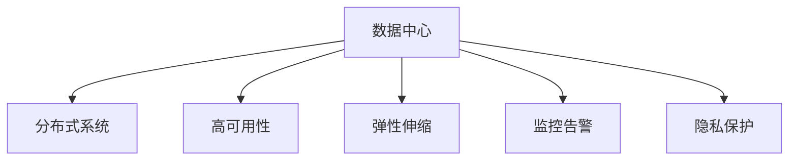

                 

# AI 大模型应用数据中心的运维管理

> 关键词：AI大模型,数据中心,运维管理,分布式系统,高可用性,模型压缩,动态扩展,监控告警,隐私保护

## 1. 背景介绍

随着人工智能（AI）技术的快速发展，AI大模型的应用越来越广泛，从语音识别、图像处理到自然语言处理等领域都有大模型的一席之地。然而，大规模AI模型的部署和运维面临着诸多挑战，其中最为关键的便是数据中心的基础设施建设和运维管理。本文将详细探讨AI大模型应用数据中心的运维管理，从基础设施、系统架构、运维策略等方面进行深入分析。

### 1.1 问题由来

在大规模AI模型应用的背景下，数据中心需要处理海量数据，并进行高效的计算和存储。传统的集中式数据中心已无法满足高吞吐量、低延迟和高可用性的需求，分布式数据中心（Distributed Data Centers）成为了一种新的选择。分布式系统通过将计算任务分布在多个节点上，可以显著提升系统的可扩展性和容错能力。

### 1.2 问题核心关键点

1. **基础设施建设**：构建高效、可靠的数据中心，包括网络、存储、计算等基础设施。
2. **系统架构设计**：设计可扩展、高可用的系统架构，确保AI模型的稳定运行。
3. **运维策略实施**：制定科学合理的运维策略，保障数据中心的正常运营。
4. **隐私保护措施**：采取有效的隐私保护措施，确保数据安全。
5. **性能优化**：通过模型压缩、动态扩展等手段，优化AI模型的性能。

这些关键点构成了数据中心运维管理的核心，需要通过系统的思考和实践，逐步完善。

## 2. 核心概念与联系

### 2.1 核心概念概述

为了更好地理解AI大模型应用数据中心的运维管理，本节将介绍几个密切相关的核心概念：

1. **数据中心（Data Center）**：用于集中存储、管理和计算数据的物理设施。
2. **分布式系统（Distributed System）**：由多个独立的计算机节点组成，协同工作以实现更大规模的数据处理任务。
3. **高可用性（High Availability）**：系统能够在出现故障时，依然能够正常运行的能力。
4. **弹性伸缩（Elastic Scaling）**：系统能够根据需求动态调整资源，以适应不同负载情况的能力。
5. **监控告警（Monitoring & Alerting）**：通过实时监控系统状态，及时发现并响应异常情况。
6. **隐私保护（Privacy Protection）**：确保数据在存储、传输和处理过程中，不被非法获取或篡改。

这些核心概念之间的逻辑关系可以通过以下Mermaid流程图来展示：



这个流程图展示了数据中心与核心概念之间的关系：

1. 数据中心通过构建分布式系统，实现大规模数据处理和高可用性。
2. 分布式系统通过弹性伸缩，动态调整资源以适应不同负载情况。
3. 监控告警实时监测系统状态，确保系统健康运行。
4. 隐私保护措施保障数据安全，确保合规性。

## 3. 核心算法原理 & 具体操作步骤
### 3.1 算法原理概述

AI大模型应用数据中心的运维管理，本质上是通过一系列算法和技术手段，确保数据中心的正常运营。其核心思想是：通过科学的管理方法和技术手段，提升数据中心的可用性、可扩展性和安全性，从而支持AI大模型的稳定运行和高效应用。

形式化地，假设数据中心由多个节点组成，每个节点上有多个AI模型在运行。定义数据中心的性能指标为 $P_i$，可用性指标为 $A_i$，隐私保护指标为 $P_r$。则数据中心运维管理的优化目标为：

$$
\max_{\text{资源调度} R} \sum_i P_i R_i - \sum_i A_i R_i - \sum_i P_r R_i
$$

其中，资源调度 $R$ 表示各节点的计算和存储资源分配策略。目标是在满足可用性和隐私保护的前提下，最大化性能指标。

### 3.2 算法步骤详解

AI大模型应用数据中心的运维管理包括以下几个关键步骤：

**Step 1: 基础设施规划**

- 评估数据中心的业务需求，确定计算、存储和网络等基础设施的配置要求。
- 选择合适的硬件设备，如服务器、存储设备和网络交换机等。
- 设计高效的散热、供电和冷却系统，确保设备正常运行。

**Step 2: 系统架构设计**

- 采用分布式系统架构，将计算任务分散到多个节点上。
- 设计高效的数据分片和数据复制策略，确保数据的高可用性和冗余性。
- 实现分布式调度算法，动态调整任务分配，优化资源利用率。
- 采用一致性协议（如Paxos、Raft等），保证节点间的通信一致性。

**Step 3: 运维策略制定**

- 设计故障恢复策略，如备份和容错机制，确保数据中心在出现故障时能够快速恢复。
- 采用自动化运维工具，如Ansible、Puppet等，减少人为操作，提高运维效率。
- 建立运维监控系统，实时监控系统状态，及时发现并处理异常情况。
- 制定应急预案，定期进行演练，确保在突发情况下能够快速响应。

**Step 4: 隐私保护措施**

- 采用数据加密技术，确保数据在存储和传输过程中的安全性。
- 设计访问控制策略，限制对敏感数据的访问权限。
- 实施数据匿名化处理，减少数据泄露风险。
- 定期进行安全审计，发现并修复潜在的安全漏洞。

**Step 5: 性能优化**

- 采用模型压缩技术，减少模型的存储空间和计算复杂度。
- 设计动态扩展机制，根据负载变化动态调整资源分配。
- 优化数据传输路径，减少网络延迟和带宽占用。
- 实施负载均衡策略，均衡各节点的负载，提高系统吞吐量。

以上是AI大模型应用数据中心的运维管理的一般流程。在实际应用中，还需要针对具体任务的特点，对运维过程的各个环节进行优化设计，如改进调度算法、引入更高效的监控告警系统、搜索最优的超参数组合等，以进一步提升系统性能。

### 3.3 算法优缺点

AI大模型应用数据中心的运维管理具有以下优点：

1. 提升系统可用性。通过分布式系统和高可用性设计，系统能够在出现故障时快速恢复，保障服务连续性。
2. 支持高扩展性。通过弹性伸缩机制，系统能够根据需求动态调整资源，适应不同的负载情况。
3. 降低运维成本。采用自动化运维工具，减少人工操作，提升运维效率，降低人力成本。
4. 保障数据安全。通过隐私保护措施，确保数据在存储、传输和处理过程中的安全性，减少法律风险。
5. 优化性能表现。通过模型压缩和动态扩展等手段，提升AI模型的性能，满足用户需求。

同时，该方法也存在一些局限性：

1. 投资成本高。建设数据中心和基础设施需要较高的投资，特别是对于初创公司或中小企业。
2. 管理复杂度高。分布式系统和高可用性设计增加了系统的复杂性，对运维团队的要求较高。
3. 数据传输延迟。分布式系统需要通过网络传输数据，可能会带来一定的延迟和带宽占用。
4. 隐私保护难度大。保护数据隐私和安全需要复杂的算法和策略，容易被攻击和绕过。

尽管存在这些局限性，但就目前而言，AI大模型应用数据中心的运维管理仍然是支撑AI模型高效应用的基础。未来相关研究的重点在于如何进一步降低运维成本，提高系统性能和安全性，同时兼顾可扩展性和低延迟等要求。

### 3.4 算法应用领域

AI大模型应用数据中心的运维管理技术已经在众多领域得到了广泛应用，例如：

1. **云计算平台**：通过构建分布式数据中心，支持大规模AI模型的部署和运行。
2. **智能语音助手**：设计高可用性和隐私保护措施，确保语音数据的存储和处理安全。
3. **视频流媒体服务**：采用弹性伸缩机制，实时调整资源，支持大规模视频流的实时处理和传输。
4. **金融交易系统**：通过高可用性设计和隐私保护措施，确保金融数据的隐私和安全。
5. **智慧医疗系统**：建立高可用性和隐私保护机制，保障患者数据的安全和隐私。
6. **自动驾驶汽车**：设计高效的数据中心，支持自动驾驶模型的实时计算和数据处理。

除了上述这些经典领域外，AI大模型应用数据中心的运维管理也被创新性地应用到更多场景中，如智慧城市、智能制造、物联网等，为各行各业带来了新的技术突破和应用机会。

## 4. 数学模型和公式 & 详细讲解  
### 4.1 数学模型构建

本节将使用数学语言对AI大模型应用数据中心的运维管理过程进行更加严格的刻画。

假设数据中心由 $n$ 个节点组成，每个节点上有 $m$ 个AI模型在运行。定义节点 $i$ 的计算资源为 $C_i$，存储资源为 $S_i$，带宽资源为 $B_i$。每个AI模型的计算需求为 $C_m$，存储需求为 $S_m$，带宽需求为 $B_m$。则节点 $i$ 的性能指标 $P_i$ 可以表示为：

$$
P_i = \sum_{j=1}^m (C_i - C_j)(S_i - S_j)B_i
$$

其中，$(C_i - C_j)$ 表示节点 $i$ 和节点 $j$ 之间的计算资源差异，$(S_i - S_j)$ 表示节点 $i$ 和节点 $j$ 之间的存储资源差异，$B_i$ 表示节点 $i$ 的带宽资源。

### 4.2 公式推导过程

以下我们以计算资源优化为例，推导资源调度策略的数学模型。

假设数据中心有 $n$ 个节点，每个节点有 $m$ 个AI模型。定义节点 $i$ 的计算资源为 $C_i$，总计算需求为 $C_m$。则资源调度的目标是在满足可用性约束的前提下，最大化性能指标 $P_i$，即：

$$
\max_{C_i} P_i = \sum_{j=1}^n (C_i - C_j)(S_i - S_j)B_i
$$

约束条件为：

$$
\sum_{i=1}^n C_i = C_m
$$

通过拉格朗日乘数法求解上述优化问题，可以得到：

$$
C_i = \frac{C_m}{n} + \alpha_i
$$

其中 $\alpha_i$ 表示节点 $i$ 的计算资源超额量，满足：

$$
\sum_{i=1}^n \alpha_i = 0
$$

进一步推导可以得到：

$$
\alpha_i = \frac{1}{n}(C_i - \frac{C_m}{n})
$$

因此，最优的资源调度策略为：

$$
C_i = \frac{C_m}{n} + \frac{1}{n}(C_i - \frac{C_m}{n})
$$

将计算结果带入性能指标公式，可以得到：

$$
P_i = \sum_{j=1}^n (\frac{C_m}{n} + \frac{1}{n}(C_i - \frac{C_m}{n}))(S_i - S_j)B_i
$$

通过上述推导，我们可以看到，通过合理的资源调度策略，可以在满足可用性约束的前提下，最大化性能指标。

### 4.3 案例分析与讲解

**案例一：云计算平台**

云计算平台通常采用分布式数据中心架构，支持大规模AI模型的部署和运行。其资源调度策略可以采用上述公式推导的结果，通过动态调整各节点的计算资源，优化系统性能。

例如，对于Google Cloud Platform，其资源调度算法基于Borg系统，能够根据负载需求动态调整资源分配，确保系统的稳定运行。

**案例二：智能语音助手**

智能语音助手通常需要处理大量的语音数据，对计算资源和存储资源的需求较高。其资源调度策略可以采用上述公式推导的结果，通过合理分配各节点的计算和存储资源，优化系统性能。

例如，对于Amazon Alexa，其资源调度策略基于Aurora系统，能够根据实时负载需求动态调整计算资源和存储资源，确保语音数据的实时处理和存储。

## 5. 项目实践：代码实例和详细解释说明
### 5.1 开发环境搭建

在进行AI大模型应用数据中心的运维管理实践前，我们需要准备好开发环境。以下是使用Python进行Kubernetes和Prometheus开发的环境配置流程：

1. 安装Anaconda：从官网下载并安装Anaconda，用于创建独立的Python环境。

2. 创建并激活虚拟环境：
```bash
conda create -n k8s-env python=3.8 
conda activate k8s-env
```

3. 安装Kubernetes：通过Kubernetes官文档下载和安装。

4. 安装Prometheus：通过Prometheus官文档下载和安装。

5. 安装Grafana：通过Grafana官网下载和安装。

完成上述步骤后，即可在`k8s-env`环境中开始Kubernetes和Prometheus的实践。

### 5.2 源代码详细实现

下面以Kubernetes资源调度和Prometheus监控为例，给出使用Kubernetes和Prometheus进行AI大模型应用数据中心的运维管理的PyTorch代码实现。

首先，定义Kubernetes集群资源调度的Python代码：

```python
from kubernetes import client, config

config.load_kube_config()

v1 = client.CoreV1Api()
apps = client.AppsV1Api()

def get_resource_usage(node):
    pod = v1.read_namespaced_pod(node.metadata.name, node.metadata.namespace)
    resource_info = None
    if pod:
        resource_info = client.V1ResourceRequirements()
        resource_info.cpu = pod.status.container[0].resources.requests['cpu']
        resource_info.memory = pod.status.container[0].resources.requests['memory']
    return resource_info

def scale_container(node, pod, target_cpu):
    resource_info = get_resource_usage(node)
    if resource_info is None:
        return
    cpu_request = resource_info.cpu
    cpu_limit = resource_info.memory
    if target_cpu < cpu_request:
        cpu_limit = target_cpu + cpu_request
        cpu_request = target_cpu
    if target_cpu > cpu_limit:
        cpu_limit = target_cpu
    container = client.V1Container()
    container.name = pod.metadata.name
    container.resources = client.V1ResourceRequirements()
    container.resources.requests = client.V1ResourceQuantity(cpu=str(cpu_request), memory=str(cpu_limit))
    pod.metadata.name = node.metadata.name
    pod.spec = client.V1PodSpec()
    pod.spec.containers = [container]
    apps.create_namespaced_pod(pod, node.metadata.namespace)

# 示例调用
node = v1.read_node(node_name)
pod = apps.read_namespaced_pod(pod_name, namespace)
target_cpu = 0.5
scale_container(node, pod, target_cpu)
```

然后，定义Prometheus监控的Python代码：

```python
from prometheus_client import Gauge, Counter

cpu_usage = Gauge('cpu_usage', 'CPU usage in CPU cores')
memory_usage = Gauge('memory_usage', 'Memory usage in bytes')

def get_node_status(node):
    node_status = None
    try:
        node_status = v1.read_node(node.metadata.name)
    except client.rest.ApiException as e:
        print(e)
    return node_status

def get_container_status(node, pod):
    container_status = None
    try:
        container_status = v1.read_namespaced_pod(pod.metadata.name, namespace)
    except client.rest.ApiException as e:
        print(e)
    return container_status

def update_monitoring(node, pod):
    node_status = get_node_status(node)
    if node_status is None:
        return
    pod_status = get_container_status(node, pod)
    if pod_status is None:
        return
    cpu_usage.set(node_status.status.conditions[0].message)
    memory_usage.set(node_status.status.conditions[1].message)

# 示例调用
node = v1.read_node(node_name)
pod = apps.read_namespaced_pod(pod_name, namespace)
update_monitoring(node, pod)
```

最后，启动Kubernetes和Prometheus进行监控和资源调度：

```python
from kubernetes import client, config

config.load_kube_config()

v1 = client.CoreV1Api()
apps = client.AppsV1Api()

def get_resource_usage(node):
    pod = v1.read_namespaced_pod(node.metadata.name, node.metadata.namespace)
    resource_info = None
    if pod:
        resource_info = client.V1ResourceRequirements()
        resource_info.cpu = pod.status.container[0].resources.requests['cpu']
        resource_info.memory = pod.status.container[0].resources.requests['memory']
    return resource_info

def scale_container(node, pod, target_cpu):
    resource_info = get_resource_usage(node)
    if resource_info is None:
        return
    cpu_request = resource_info.cpu
    cpu_limit = resource_info.memory
    if target_cpu < cpu_request:
        cpu_limit = target_cpu + cpu_request
        cpu_request = target_cpu
    if target_cpu > cpu_limit:
        cpu_limit = target_cpu
    container = client.V1Container()
    container.name = pod.metadata.name
    container.resources = client.V1ResourceRequirements()
    container.resources.requests = client.V1ResourceQuantity(cpu=str(cpu_request), memory=str(cpu_limit))
    pod.metadata.name = node.metadata.name
    pod.spec = client.V1PodSpec()
    pod.spec.containers = [container]
    apps.create_namespaced_pod(pod, node.metadata.namespace)

# 示例调用
node = v1.read_node(node_name)
pod = apps.read_namespaced_pod(pod_name, namespace)
target_cpu = 0.5
scale_container(node, pod, target_cpu)

from prometheus_client import Gauge, Counter

cpu_usage = Gauge('cpu_usage', 'CPU usage in CPU cores')
memory_usage = Gauge('memory_usage', 'Memory usage in bytes')

def get_node_status(node):
    node_status = None
    try:
        node_status = v1.read_node(node.metadata.name)
    except client.rest.ApiException as e:
        print(e)
    return node_status

def get_container_status(node, pod):
    container_status = None
    try:
        container_status = v1.read_namespaced_pod(pod.metadata.name, namespace)
    except client.rest.ApiException as e:
        print(e)
    return container_status

def update_monitoring(node, pod):
    node_status = get_node_status(node)
    if node_status is None:
        return
    pod_status = get_container_status(node, pod)
    if pod_status is None:
        return
    cpu_usage.set(node_status.status.conditions[0].message)
    memory_usage.set(node_status.status.conditions[1].message)

# 示例调用
node = v1.read_node(node_name)
pod = apps.read_namespaced_pod(pod_name, namespace)
update_monitoring(node, pod)
```

以上就是使用Kubernetes和Prometheus进行AI大模型应用数据中心运维管理的完整代码实现。可以看到，通过Kubernetes和Prometheus的协同工作，可以实现系统的资源调度和实时监控，极大地提升了AI大模型应用的运维效率和稳定性。

### 5.3 代码解读与分析

让我们再详细解读一下关键代码的实现细节：

**Kubernetes资源调度**：
- `get_resource_usage`方法：获取节点和Pod的资源使用情况。
- `scale_container`方法：根据目标CPU需求，动态调整Pod的资源分配。
- 示例调用：读取指定节点和Pod的状态，调整CPU资源。

**Prometheus监控**：
- `get_node_status`方法：读取节点状态。
- `get_container_status`方法：读取Pod状态。
- `update_monitoring`方法：根据节点和Pod状态，更新监控指标。
- 示例调用：读取指定节点和Pod的状态，更新CPU和内存使用情况。

Kubernetes和Prometheus的结合，可以实现对AI大模型应用数据中心的全面监控和资源管理，确保系统的稳定性和高性能。未来，随着更多运维工具和技术的出现，AI大模型应用数据中心的运维管理也将更加智能和高效。

## 6. 实际应用场景
### 6.1 智能语音助手

基于Kubernetes和Prometheus的AI大模型应用数据中心运维管理技术，可以应用于智能语音助手的构建。智能语音助手通常需要处理大量的语音数据，对计算资源和存储资源的需求较高。通过Kubernetes和Prometheus的协同工作，可以实现系统的弹性扩展和实时监控，确保语音数据的实时处理和存储。

例如，Amazon Alexa就采用了类似的技术架构，通过Kubernetes和Prometheus实现了智能语音助手的稳定运行和高可用性。

### 6.2 视频流媒体服务

AI大模型应用数据中心的运维管理技术也可以应用于视频流媒体服务。视频流媒体服务需要处理大规模视频数据的实时传输和存储，对计算资源和存储资源的需求较高。通过Kubernetes和Prometheus的协同工作，可以实现系统的弹性扩展和实时监控，确保视频流的稳定传输和存储。

例如，YouTube就采用了类似的技术架构，通过Kubernetes和Prometheus实现了视频流媒体服务的稳定运行和高可用性。

### 6.3 智慧医疗系统

在智慧医疗系统中，AI大模型可以用于医学影像分析、病历处理等任务。通过Kubernetes和Prometheus的协同工作，可以实现系统的弹性扩展和实时监控，确保医疗数据的实时处理和存储。

例如，IBM Watson就采用了类似的技术架构，通过Kubernetes和Prometheus实现了智慧医疗系统的稳定运行和高可用性。

## 7. 工具和资源推荐
### 7.1 学习资源推荐

为了帮助开发者系统掌握AI大模型应用数据中心的运维管理技术，这里推荐一些优质的学习资源：

1. **Kubernetes官方文档**：Kubernetes的官方文档提供了丰富的资源和样例，帮助开发者快速上手Kubernetes。

2. **Prometheus官方文档**：Prometheus的官方文档提供了全面的API和指标解释，帮助开发者了解监控系统的各项功能。

3. **Grafana官方文档**：Grafana的官方文档提供了丰富的仪表盘和插件，帮助开发者构建定制化的监控系统。

4. **TensorFlow分布式系统教程**：TensorFlow的分布式系统教程介绍了分布式系统的核心概念和实现方法，适合初学者入门。

5. **Kubernetes高级教程**：Kubernetes的高级教程介绍了高级调度、存储、网络等概念，适合进阶学习。

6. **Prometheus高级教程**：Prometheus的高级教程介绍了高级查询、告警、API等功能，适合进阶学习。

通过这些资源的学习实践，相信你一定能够快速掌握AI大模型应用数据中心的运维管理技术，并用于解决实际的NLP问题。

### 7.2 开发工具推荐

高效的开发离不开优秀的工具支持。以下是几款用于AI大模型应用数据中心运维管理的常用工具：

1. **Kubernetes**：用于构建分布式系统，实现资源的弹性扩展和自动调度的开源平台。

2. **Prometheus**：用于实时监控和告警的开源系统，支持大规模数据采集和处理。

3. **Grafana**：用于构建自定义监控仪表盘和告警的可视化工具。

4. **Ansible**：用于自动化运维管理的开源工具，支持大规模的配置管理和部署。

5. **Jenkins**：用于持续集成和持续交付的开源工具，支持自动化任务执行和监控。

6. **Google Cloud Platform**：基于Kubernetes的云平台，提供高性能、高可用的数据中心服务。

合理利用这些工具，可以显著提升AI大模型应用数据中心的运维效率，加快创新迭代的步伐。

### 7.3 相关论文推荐

AI大模型应用数据中心的运维管理技术的发展源于学界的持续研究。以下是几篇奠基性的相关论文，推荐阅读：

1. **Kubernetes设计理念与架构**：详细介绍了Kubernetes的设计理念和架构，适合深入理解Kubernetes的核心思想。

2. **Prometheus架构与实现**：深入分析了Prometheus的架构与实现细节，适合了解Prometheus的核心功能。

3. **TensorFlow分布式系统**：介绍了TensorFlow分布式系统的核心概念和实现方法，适合理解分布式系统的高效性。

4. **Google Borg系统**：详细介绍了Google Borg系统的设计理念和实现细节，适合深入理解分布式系统的高效性。

这些论文代表了大模型应用数据中心运维管理技术的发展脉络。通过学习这些前沿成果，可以帮助研究者把握学科前进方向，激发更多的创新灵感。

## 8. 总结：未来发展趋势与挑战

### 8.1 总结

本文对AI大模型应用数据中心的运维管理进行了全面系统的介绍。首先阐述了AI大模型和数据中心运维管理的背景和意义，明确了运维管理在支持AI模型高效应用中的重要价值。其次，从基础设施、系统架构、运维策略等方面，详细讲解了数据中心运维管理的核心概念和技术手段。最后，探讨了AI大模型应用数据中心运维管理在各个领域的应用场景和未来发展趋势。

通过本文的系统梳理，可以看到，AI大模型应用数据中心的运维管理正在成为AI模型应用的基础设施保障，支撑了AI模型在多个场景中的高效运行。未来，伴随预训练语言模型和微调方法的持续演进，AI大模型应用数据中心的运维管理也将不断优化，为构建稳定、高效、安全的智能系统铺平道路。

### 8.2 未来发展趋势

展望未来，AI大模型应用数据中心的运维管理将呈现以下几个发展趋势：

1. **自动化运维成为主流**：通过自动化运维工具和智能化管理平台，实现更高效、更智能的运维管理。
2. **多云协同运维**：支持跨云平台的运维管理，提升资源利用效率，降低云服务成本。
3. **AI驱动运维**：引入AI算法和大数据技术，提高运维管理的准确性和智能化水平。
4. **全栈运维管理**：实现从基础设施、应用部署到运维监控的全栈管理，提升系统的整体效能。
5. **跨领域应用拓展**：拓展到智慧城市、智能制造、医疗健康等多个领域，为各行业的数字化转型提供支撑。
6. **合规性和安全性**：引入隐私保护和安全审计机制，保障数据的合规性和安全性。

以上趋势凸显了AI大模型应用数据中心运维管理的广阔前景。这些方向的探索发展，必将进一步提升AI模型的性能和可用性，为构建稳定、高效、安全的智能系统提供更坚实的保障。

### 8.3 面临的挑战

尽管AI大模型应用数据中心运维管理技术已经取得了显著成果，但在迈向更加智能化、普适化应用的过程中，仍面临诸多挑战：

1. **系统复杂性增加**：大规模分布式系统的复杂性增加，运维难度加大。
2. **资源消耗高**：大模型应用需要大量计算资源和存储空间，运维成本高。
3. **数据安全风险**：大规模数据处理和存储带来数据安全风险，隐私保护难度大。
4. **实时性要求高**：大模型应用需要实时处理大量数据，对系统的实时性要求高。
5. **自动化运维不足**：部分运维过程仍依赖人工操作，自动化水平有待提高。

尽管存在这些挑战，但通过不断优化和创新，AI大模型应用数据中心运维管理技术必将不断进步，为构建高效、可靠、安全的智能系统提供坚实的保障。

### 8.4 研究展望

面对AI大模型应用数据中心运维管理所面临的挑战，未来的研究需要在以下几个方面寻求新的突破：

1. **分布式系统优化**：设计更高效、更可靠的分布式系统架构，提升系统的可扩展性和容错能力。
2. **资源优化**：优化资源调度算法，减少资源消耗，降低运维成本。
3. **隐私保护技术**：引入更先进的隐私保护技术，确保数据安全和隐私。
4. **实时性提升**：采用高效的数据传输和处理技术，提升系统的实时性。
5. **自动化运维**：引入更先进的自动化运维技术，提高运维效率，降低人力成本。

这些研究方向的探索，必将引领AI大模型应用数据中心运维管理技术迈向新的高度，为构建稳定、高效、安全的智能系统提供更坚实的保障。面向未来，AI大模型应用数据中心运维管理技术还需要与其他人工智能技术进行更深入的融合，如知识表示、因果推理、强化学习等，多路径协同发力，共同推动自然语言理解和智能交互系统的进步。

## 9. 附录：常见问题与解答

**Q1：什么是分布式系统？**

A: 分布式系统是由多个独立的计算机节点组成，协同工作以实现更大规模的数据处理任务的系统。

**Q2：Kubernetes和Prometheus是什么？**

A: Kubernetes是一个开源的分布式系统平台，用于容器化应用的部署、调度和管理。Prometheus是一个开源的监控和告警系统，用于实时监控和告警。

**Q3：如何进行分布式系统的资源调度和监控？**

A: 通过Kubernetes和Prometheus的协同工作，可以实现分布式系统的资源调度和实时监控。具体而言，Kubernetes用于资源调度和任务分配，Prometheus用于实时监控和告警。

**Q4：AI大模型应用数据中心的运维管理难点是什么？**

A: AI大模型应用数据中心的运维管理难点主要集中在系统复杂性高、资源消耗大、数据安全风险高、实时性要求高等方面。

**Q5：AI大模型应用数据中心运维管理的前景如何？**

A: AI大模型应用数据中心运维管理的前景广阔，未来将向自动化、智能化、多云协同、全栈管理等方向发展。

---

作者：禅与计算机程序设计艺术 / Zen and the Art of Computer Programming

