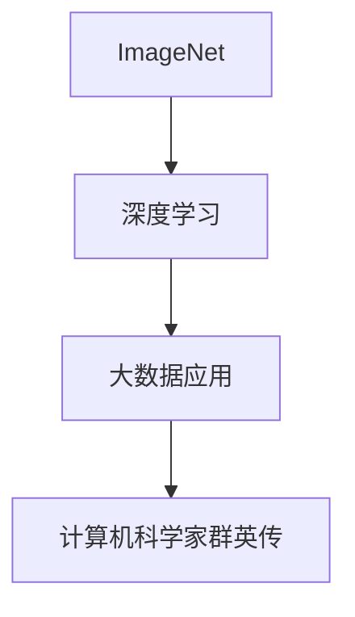

                 

# AI 大模型计算机科学家群英传：深度学习大数据应用先行者 ImageNet 发明人李飞飞

## 1. 背景介绍

在人工智能领域，李飞飞博士无疑是一位具有举足轻重影响力的人物。她不仅是斯坦福大学计算机科学系和人工智能实验室的教授，也是计算机视觉和人工智能领域的重要开创者和引领者。作为ImageNet竞赛的创始人，她的贡献不仅仅在于数据集本身，更在于推动了深度学习和大数据应用的快速进步。通过她的努力，ImageNet成为了当前几乎所有大型视觉模型预训练的基础。本文将深入探讨李飞飞博士的科研贡献及其对未来AI大模型技术发展的深远影响。

## 2. 核心概念与联系

### 2.1 核心概念概述

在深入研究李飞飞博士的科研贡献之前，首先需要了解几个核心概念：

- **ImageNet**：一个包含超过1400万张图片和1000类标签的大规模图像数据库，是计算机视觉领域最重要的数据集之一。
- **深度学习**：一种基于神经网络架构的机器学习技术，能够自动学习数据的抽象表示，广泛用于图像识别、语音识别、自然语言处理等领域。
- **大数据应用**：指利用大规模数据集进行模型训练和预测，广泛应用于推荐系统、搜索引擎、社交网络分析等领域。
- **计算机科学家群英传**：聚焦于顶尖计算机科学家的贡献和影响，展示他们在推动科技前沿中的重要作用。

### 2.2 核心概念原理和架构的 Mermaid 流程图



这个流程图展示了ImageNet、深度学习和大数据应用之间的联系，以及它们如何共同推动了人工智能技术的发展。ImageNet作为深度学习的重要基础，为模型的预训练提供了数据支持，而深度学习和大数据应用则是AI技术落地的关键工具，科学家们的创新贡献则是这一切的驱动力。

## 3. 核心算法原理 & 具体操作步骤

### 3.1 算法原理概述

李飞飞博士在计算机视觉领域的核心贡献之一是ImageNet数据集的创建。ImageNet的成功在于其巨大的规模、丰富的类别和高质量的标注数据，为深度学习模型的训练提供了宝贵的资源。深度学习算法通过大量标注数据的监督学习，逐渐学习到特征提取和分类能力，从而在各种视觉任务上取得了显著进步。

### 3.2 算法步骤详解

ImageNet数据集的创建涉及多个步骤：

1. **数据采集**：通过大规模网络爬虫和志愿者标注，收集了数百万张图片，涵盖了1000个类别，每张图片都附有详细标注信息。
2. **数据预处理**：对图片进行预处理，包括裁剪、缩放、标准化等操作，确保数据质量一致。
3. **标注规范**：制定统一的标注规范，确保数据标注的质量和一致性。
4. **分布式训练**：采用分布式计算框架，在数百台计算机上并行训练模型，以提高效率。

### 3.3 算法优缺点

ImageNet数据集的优点包括：

- **数据规模大**：丰富的图片和类别，能够训练出更强的模型。
- **标注质量高**：志愿者标注确保了数据的质量和一致性。
- **普适性强**：数据集广泛适用于各种计算机视觉任务，如分类、检测、分割等。

但同时，也存在一些缺点：

- **标注成本高**：志愿者标注的准确性和一致性可能存在一定差异。
- **数据分布不均**：某些类别的数据量远小于其他类别，可能导致模型对某些类别预测性能不足。
- **模型复杂度高**：大规模数据集可能导致模型过于复杂，训练和推理成本高。

### 3.4 算法应用领域

ImageNet数据集的成功应用领域包括：

- **视觉分类**：如物体识别、场景分类等。
- **目标检测**：如检测图像中的物体位置和类别。
- **语义分割**：将图像分割成不同的语义区域。
- **人脸识别**：识别图像中的人脸并进行身份验证。

## 4. 数学模型和公式 & 详细讲解 & 举例说明

### 4.1 数学模型构建

ImageNet数据集的数学模型可以简单描述为：给定一组图片$X$和对应的类别标签$Y$，目标是通过监督学习训练一个分类模型$f(x)$，使得$f(x)$能够准确预测图片$x$的类别标签$y$。

假设模型$f(x)$是一个深度神经网络，其输入为图片$x$，输出为类别预测概率分布$p(y|x)$。训练目标为最大化负对数似然损失：

$$
\mathcal{L} = -\frac{1}{N} \sum_{i=1}^N \sum_{c=1}^{C} y_i^c \log f(x_i)^c
$$

其中$N$为样本数量，$C$为类别数量，$y_i^c$为样本$i$的标签，$f(x_i)^c$为模型对样本$i$属于类别$c$的预测概率。

### 4.2 公式推导过程

在ImageNet数据集上训练模型的过程可以概括为以下步骤：

1. **数据准备**：收集和标注ImageNet数据集。
2. **模型选择**：选择合适的神经网络架构，如AlexNet、VGG、ResNet等。
3. **训练过程**：通过反向传播算法，使用随机梯度下降等优化算法，最小化损失函数$\mathcal{L}$。
4. **模型验证**：在验证集上评估模型性能，调整超参数。
5. **模型测试**：在测试集上评估最终模型性能。

### 4.3 案例分析与讲解

以AlexNet模型为例，其在ImageNet数据集上的训练过程可以具体分为以下步骤：

1. **模型初始化**：随机初始化神经网络的权重。
2. **前向传播**：将输入图片通过多个卷积层和池化层，提取特征。
3. **损失计算**：根据预测结果和真实标签，计算损失。
4. **反向传播**：根据损失梯度，更新模型参数。
5. **重复迭代**：不断重复前向传播和反向传播，直至损失收敛。

## 5. 项目实践：代码实例和详细解释说明

### 5.1 开发环境搭建

要实现ImageNet数据集的深度学习训练，需要准备以下几个开发环境：

1. **Python环境**：安装Python 3.x版本，确保环境变量正确设置。
2. **深度学习框架**：如TensorFlow、PyTorch、Caffe等，选择一种进行模型构建和训练。
3. **数据预处理工具**：如Pillow、OpenCV等，用于图片处理和预处理。
4. **分布式计算环境**：如Spark、Hadoop等，用于大规模数据分布式处理。

### 5.2 源代码详细实现

以下是一个基于PyTorch实现ImageNet分类任务的示例代码：

```python
import torch
import torch.nn as nn
import torch.optim as optim
from torchvision import datasets, transforms
from torch.utils.data import DataLoader

# 定义模型架构
class AlexNet(nn.Module):
    def __init__(self):
        super(AlexNet, self).__init__()
        self.features = nn.Sequential(
            nn.Conv2d(3, 64, kernel_size=11, stride=4, padding=2),
            nn.ReLU(inplace=True),
            nn.MaxPool2d(kernel_size=3, stride=2),
            nn.Conv2d(64, 192, kernel_size=5, padding=2),
            nn.ReLU(inplace=True),
            nn.MaxPool2d(kernel_size=3, stride=2),
            nn.Conv2d(192, 384, kernel_size=3, padding=1),
            nn.ReLU(inplace=True),
            nn.Conv2d(384, 256, kernel_size=3, padding=1),
            nn.ReLU(inplace=True),
            nn.MaxPool2d(kernel_size=3, stride=2),
            nn.Dropout(0.5),
            nn.Flatten(),
            nn.Linear(256*6*6, 4096),
            nn.ReLU(inplace=True),
            nn.Dropout(0.5),
            nn.Linear(4096, 1000)
        )
        self.classifier = nn.LogSoftmax(dim=1)

    def forward(self, x):
        x = self.features(x)
        x = self.classifier(x)
        return x

# 定义训练函数
def train(model, device, train_loader, optimizer, epoch):
    model.train()
    for batch_idx, (data, target) in enumerate(train_loader):
        data, target = data.to(device), target.to(device)
        optimizer.zero_grad()
        output = model(data)
        loss = nn.NLLLoss()(output, target)
        loss.backward()
        optimizer.step()

# 定义测试函数
def test(model, device, test_loader):
    model.eval()
    test_loss = 0
    correct = 0
    with torch.no_grad():
        for data, target in test_loader:
            data, target = data.to(device), target.to(device)
            output = model(data)
            test_loss += nn.NLLLoss()(output, target).item()
            pred = torch.max(output, 1)[1]
            correct += pred.eq(target).sum().item()
    test_loss /= len(test_loader.dataset)
    accuracy = 100. * correct / len(test_loader.dataset)
    print(f'Test set: Average loss: {test_loss:.4f}, Accuracy: {accuracy:.2f}%')

# 数据预处理
transform = transforms.Compose([
    transforms.ToTensor(),
    transforms.Normalize(mean=[0.485, 0.456, 0.406],
                         std=[0.229, 0.224, 0.225])
])

# 加载数据集
train_data = datasets.ImageFolder(root='data/train', transform=transform)
test_data = datasets.ImageFolder(root='data/test', transform=transform)

# 加载模型和优化器
model = AlexNet().to(device)
optimizer = optim.SGD(model.parameters(), lr=0.01, momentum=0.9)

# 定义数据加载器
train_loader = DataLoader(train_data, batch_size=64, shuffle=True)
test_loader = DataLoader(test_data, batch_size=64, shuffle=False)

# 训练和测试
device = torch.device('cuda')
for epoch in range(10):
    train(model, device, train_loader, optimizer, epoch)
    test(model, device, test_loader)
```

### 5.3 代码解读与分析

以上代码展示了使用PyTorch实现ImageNet分类任务的完整流程。关键步骤如下：

- **模型定义**：定义了一个AlexNet模型架构，包含多个卷积层、池化层、全连接层等。
- **训练函数**：定义了训练函数，前向传播、损失计算、反向传播等操作。
- **测试函数**：定义了测试函数，计算模型在测试集上的准确率。
- **数据预处理**：定义了数据预处理步骤，包括将图片转换为张量并进行归一化。
- **数据加载**：定义了数据加载器，用于批量加载训练和测试数据。
- **训练和测试**：在GPU上训练模型，并在测试集上评估性能。

## 6. 实际应用场景

### 6.1 智能推荐系统

ImageNet数据集的丰富多样性，使得其在智能推荐系统中的应用非常广泛。通过大规模数据集训练出的视觉模型，可以用于分析用户浏览行为，推荐用户可能感兴趣的图片、视频等内容。

### 6.2 医疗影像分析

在医疗影像分析领域，ImageNet数据集的图像多样性帮助模型学习到更多类型的疾病特征。通过迁移学习，将ImageNet上训练的模型应用到医疗影像数据上，可以自动识别并标记病变区域，辅助医生进行诊断和治疗。

### 6.3 自动驾驶

在自动驾驶中，ImageNet数据集可以帮助模型学习到更广泛的场景和行为，提升自动驾驶系统的感知能力和决策质量。通过融合视觉、雷达等多种传感器数据，自动驾驶系统能够更好地理解道路环境和交通规则，实现更安全的驾驶。

## 7. 工具和资源推荐

### 7.1 学习资源推荐

为了深入学习李飞飞博士的科研贡献，以下是一些推荐的学习资源：

1. **李飞飞教授的课程和讲座**：通过观看斯坦福大学和AI Challenger赛会的讲座视频，了解其最新科研动态和学术见解。
2. **ImageNet竞赛**：参加ImageNet竞赛，亲身体验大规模数据集和模型的训练过程。
3. **论文和书籍**：阅读李飞飞教授及其团队发表的论文，如《ImageNet Classification with Deep Convolutional Neural Networks》等，了解其在深度学习领域的创新和贡献。
4. **开源项目**：参与ImageNet等开源项目，了解最新的技术进展和实际应用场景。

### 7.2 开发工具推荐

在ImageNet数据集的应用中，以下工具非常有用：

1. **深度学习框架**：如TensorFlow、PyTorch、Caffe等，用于模型构建和训练。
2. **数据处理工具**：如Pillow、OpenCV等，用于数据预处理和增强。
3. **分布式计算工具**：如Spark、Hadoop等，用于大规模数据处理和存储。

### 7.3 相关论文推荐

以下几篇论文代表了大规模数据集在深度学习中的重要应用：

1. **ImageNet Classification with Deep Convolutional Neural Networks**：AlexNet论文，首次展示了在大规模数据集上训练的深度卷积神经网络在图像分类任务上的显著性能提升。
2. **Visualizing and Understanding Convolutional Networks**：可视化工具，帮助理解卷积神经网络中的特征表示和分类过程。
3. **Fast R-CNN**：基于深度神经网络的物体检测方法，利用ImageNet数据集进行预训练。

## 8. 总结：未来发展趋势与挑战

### 8.1 研究成果总结

李飞飞博士在计算机视觉和深度学习领域的贡献主要体现在以下几个方面：

1. **ImageNet数据集的创建**：为大规模深度学习模型提供了重要基础。
2. **深度学习模型的改进**：通过ImageNet数据集训练出了多个先进的深度模型，如AlexNet、VGG、ResNet等。
3. **大规模数据集的应用**：推动了计算机视觉、医疗影像、自动驾驶等多个领域的技术进步。

### 8.2 未来发展趋势

未来，ImageNet数据集和深度学习技术将在更多领域发挥重要作用，推动AI技术的进一步发展。具体趋势包括：

1. **跨领域应用**：ImageNet数据集的应用将不仅限于视觉领域，还将扩展到语音、自然语言处理等领域。
2. **大规模预训练**：未来预训练模型的规模将进一步扩大，数据集将更加多样化。
3. **混合训练**：结合多种数据源和模型架构，实现更高效、更鲁棒的模型训练。

### 8.3 面临的挑战

尽管ImageNet数据集和深度学习技术在多个领域取得了显著成果，但仍面临一些挑战：

1. **数据隐私和安全**：大规模数据集的应用可能导致数据隐私泄露和安全性问题。
2. **模型复杂度**：大规模数据集训练的模型往往过于复杂，导致推理和部署成本高。
3. **可解释性**：深度学习模型的黑盒特性可能导致其决策过程难以解释。

### 8.4 研究展望

未来的研究应在以下几个方向继续探索：

1. **数据隐私保护**：开发更安全的数据处理和存储技术，保护数据隐私。
2. **模型压缩和优化**：通过模型压缩和优化，减少模型的推理时间和资源占用。
3. **可解释性研究**：加强深度学习模型的可解释性研究，增强其透明性和可信度。

## 9. 附录：常见问题与解答

**Q1：ImageNet数据集为什么重要？**

A: ImageNet数据集之所以重要，在于其巨大的数据规模和多样性。大规模数据集可以训练出更强的模型，涵盖更多的类别和场景，提升了模型的泛化能力和鲁棒性。

**Q2：ImageNet数据集的缺点是什么？**

A: ImageNet数据集的主要缺点包括标注成本高、数据分布不均和模型复杂度高。这些缺点可能导致模型在某些类别上的预测性能不足，推理速度慢和内存占用大等问题。

**Q3：如何提高ImageNet数据集的标注效率？**

A: 提高ImageNet数据集的标注效率，可以采用以下方法：

1. **自动化标注**：利用图像处理技术和机器学习算法，自动标注一部分图片。
2. **众包标注**：通过众包平台招募志愿者进行标注，同时采用标注质量控制措施，确保标注的一致性和准确性。
3. **数据增强**：通过数据增强技术，扩充数据集，减少标注工作量。

**Q4：如何在GPU上加速ImageNet模型的训练？**

A: 在GPU上加速ImageNet模型的训练，可以采用以下方法：

1. **模型并行**：将模型并行分布在多个GPU上，加速计算。
2. **混合精度训练**：使用混合精度技术，减少内存占用和计算时间。
3. **优化器调整**：调整优化器参数，如学习率、动量等，提升训练效率。

**Q5：如何在实际应用中保护数据隐私？**

A: 在实际应用中保护数据隐私，可以采用以下方法：

1. **数据匿名化**：对数据进行匿名化处理，去除或模糊化敏感信息。
2. **数据加密**：对数据进行加密处理，防止未授权访问。
3. **访问控制**：设置严格的访问控制机制，限制数据的访问权限。

---

作者：禅与计算机程序设计艺术 / Zen and the Art of Computer Programming

