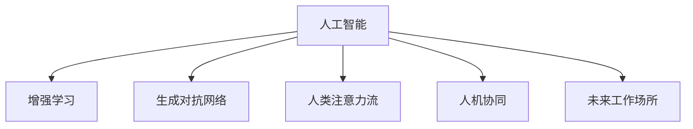

                 

# AI与人类注意力流：未来的工作场所和注意力管理

> 关键词：人工智能,人类注意力流,智能工作场所,注意力管理,人机协同,未来工作方式

## 1. 背景介绍

### 1.1 问题由来

随着人工智能技术的迅猛发展，AI与人类交互日益频繁，AI正在逐步渗透到工作生活的方方面面。在AI的辅助下，我们的工作方式、学习方式、娱乐方式等都发生了深刻变化。然而，随着人工智能的深入应用，它与人类之间的交互模式、工作协同方式等也面临新的挑战。

AI技术已从早期的监督学习、无监督学习逐步向增强学习和生成对抗网络等更高级的深度学习模型迈进。AI的智能程度不断提高，但在人类注意力流（Attention Flow）管理上仍存在诸多不足。如何高效协同AI与人类，提升工作效率、决策质量以及用户体验，成为未来AI发展的重要议题。

### 1.2 问题核心关键点

AI与人类注意力流管理的核心问题在于：
- 如何高效协同AI与人类，使其在执行复杂任务时更好地融合。
- 如何在工作协同中平衡AI决策与人类的判断，避免决策过度自动化导致的人机脱节。
- 如何实时管理人类注意力流，使AI能够更好地辅助人类工作，而非分散注意力。

### 1.3 问题研究意义

通过AI与人类注意力流的协同管理，可以优化工作协同流程，提升决策质量，减少重复劳动，更好地应对未来工作中可能出现的复杂变化。研究这一问题，不仅有助于AI技术的进一步发展，也为未来智能工作场所的构建提供了新的思路。

AI与人类注意力流管理的研究，可帮助企业提升工作效率，降低运营成本，为各行各业带来数字化转型的新机遇。例如，在医疗领域，通过AI辅助诊断，可以减少医生的工作负担，提高诊疗效率；在金融行业，通过AI预测分析，可以更快速地做出投资决策。同时，研究这一问题也有助于构建更加人性化、高效的工作环境，促进人类与AI的深度融合，推动智慧城市的构建。

## 2. 核心概念与联系

### 2.1 核心概念概述

为更好地理解AI与人类注意力流管理的核心概念，本节将介绍几个密切相关的核心概念：

- **人工智能（Artificial Intelligence, AI）**：通过模拟人类智能行为，实现机器自动化、智能化处理的能力。包括感知、推理、学习、决策等多个方面。
- **人类注意力流（Attention Flow）**：人类在信息处理过程中，注意力的动态变化轨迹。工作中的注意力流管理，即是在数据流中，如何更好地引导、调节和管理人类的注意力。
- **增强学习（Reinforcement Learning, RL）**：一种通过智能体与环境交互，基于奖惩机制进行学习和决策的方法。在AI与人类协同管理中，可以通过增强学习优化协同策略。
- **生成对抗网络（Generative Adversarial Networks, GAN）**：一种训练两个对抗神经网络模型，一个生成模型、一个判别模型，通过不断的博弈训练，生成高质量数据的方法。在注意力流管理中，可以用于生成符合人类注意力的数据集，帮助优化模型。
- **人机协同（Human-Machine Collaboration）**：指AI与人类之间的协作关系，通过合理分配任务，实现人机互补、协同工作的目标。
- **未来工作场所（Future Workplace）**：指利用AI等新技术构建的、智能化的工作环境，通过高效协同管理，提升工作效率，优化工作流程。

这些核心概念之间的逻辑关系可以通过以下Mermaid流程图来展示：



这个流程图展示了大语言模型的核心概念及其之间的关系：

1. 人工智能通过增强学习、生成对抗网络等方法，不断提升智能程度。
2. 人工智能通过生成对抗网络生成符合人类注意力的数据集，优化人类注意力流。
3. 人工智能与人类注意力流通过人机协同，实现高效的智能工作场所。
4. 智能工作场所的构建需要基于人工智能与人类注意力流的协同管理。

## 3. 核心算法原理 & 具体操作步骤
### 3.1 算法原理概述

AI与人类注意力流管理的核心在于构建一个人机协同的工作流程，其中AI作为执行者，人类作为监督者，通过合理的任务分配和管理，实现协同工作。AI在执行任务时，需要不断地进行注意力流的调节，使其符合人类对任务的理解和需求。

核心算法主要分为以下几个步骤：

1. **任务定义与分解**：将工作任务分解为若干子任务，确定每个子任务的目标和执行方法。
2. **注意力流分析**：通过注意力流分析，确定人类在执行每个子任务时的注意力流轨迹，构建注意力流模型。
3. **协同策略设计**：根据注意力流模型，设计协同策略，确定AI的执行路径和执行方式。
4. **执行与监控**：在执行过程中，AI需要实时监控人类注意力流，并根据人类反馈不断调整执行路径。

### 3.2 算法步骤详解

**Step 1: 任务定义与分解**
- 确定工作任务的目标，将任务分解为若干子任务。例如，医疗诊断可以分解为病历分析、影像分析、辅助决策等。
- 对每个子任务设定明确的执行标准和评估指标。例如，影像分析需要识别特定器官，设定识别准确率和召回率等指标。

**Step 2: 注意力流分析**
- 收集人类在执行每个子任务时的注意力轨迹数据。可以通过眼动追踪、鼠标轨迹、键盘输入等方法获取。
- 利用机器学习技术，构建注意力流模型，预测人类在执行每个子任务时的注意力分布。例如，使用LSTM或GRU模型，对注意力流进行时间序列预测。
- 根据注意力流模型，确定人类对任务的理解程度，以及AI执行任务时需要注意力调整的方向。

**Step 3: 协同策略设计**
- 基于注意力流模型，设计AI与人类注意力流的协同策略。例如，在影像分析任务中，AI可以先自动标记疑似病灶区域，再交由医生确认。
- 设计实时监控与调整机制，使AI能够根据人类注意力流的变化，及时调整执行策略。例如，通过设置预警阈值，当人类注意力分散时，自动提示返回任务重点区域。
- 对AI执行路径进行优化，确保执行过程中，能够最大化利用人类注意力流。例如，在医疗影像中，AI可以自动跳过无关区域，将注意力集中在病灶区域。

**Step 4: 执行与监控**
- 执行协同策略，AI根据设定的执行路径和方式执行任务。
- 实时监控人类注意力流，通过视觉、声音等方式获取人类反馈，及时调整AI执行路径。例如，在医疗影像分析中，医生标注病灶区域时，AI会自动跟踪标注轨迹，提高标注效率。
- 定期对执行结果进行评估，通过自动评估与人类反馈，不断优化协同策略。

### 3.3 算法优缺点

AI与人类注意力流管理方法具有以下优点：
1. 提升工作效率。通过合理分配任务，AI可以承担大量重复性和低价值的任务，减轻人类工作负担，提升工作效率。
2. 优化决策质量。通过实时监控人类注意力流，AI能够及时获取人类反馈，优化决策路径，提升决策质量。
3. 降低成本。通过协同管理，AI可以承担部分人类工作，降低运营成本，提高企业竞争力。
4. 提高用户体验。通过合理设计协同策略，AI能够更好地辅助人类工作，提升用户体验。

同时，该方法也存在一定的局限性：
1. 对数据质量依赖高。人类注意力流数据的准确性和完备性对算法的性能影响较大。
2. 注意力流模型复杂。构建准确的注意力流模型需要大量标注数据和计算资源。
3. 难以避免偏见。注意力流模型可能受到训练数据的影响，存在偏见。
4. 依赖人类反馈。实时监控人类注意力流，需要获取及时准确的反馈，而人类反馈的准确性和及时性难以保证。
5. 算法复杂度高。协同策略设计和实时监控调整的算法实现复杂，对开发者要求较高。

尽管存在这些局限性，但就目前而言，AI与人类注意力流管理方法在智能工作场所的构建中，仍然是一种较为先进和实用的方法。未来相关研究的重点在于如何进一步降低算法对数据质量的要求，提高算法的鲁棒性和可解释性，同时兼顾成本和效率等因素。

### 3.4 算法应用领域

AI与人类注意力流管理方法已经在多个领域得到了应用，例如：

- **医疗领域**：通过AI辅助诊断，减少医生的工作负担，提高诊疗效率。例如，影像分析、病历分析、辅助决策等。
- **金融行业**：利用AI进行数据分析和预测，快速做出投资决策。例如，风险评估、市场分析、客户关系管理等。
- **制造业**：通过AI进行设备维护和故障预测，提升生产效率。例如，设备监控、质量检测、供应链优化等。
- **零售行业**：利用AI进行商品推荐和库存管理，提升销售效率。例如，个性化推荐、库存优化、客户关系管理等。
- **教育行业**：通过AI进行学生评估和个性化教学，提升教育质量。例如，学习分析、智能推荐、作业批改等。

除了这些传统应用外，AI与人类注意力流管理方法还在更多场景中得到应用，如智能交通、智慧城市、智能家居等，为各行各业带来了新的发展机遇。

## 4. 数学模型和公式 & 详细讲解  
### 4.1 数学模型构建

本节将使用数学语言对AI与人类注意力流管理的算法进行更加严格的刻画。

假设AI在执行任务时，需要分解为 $n$ 个子任务，每个子任务 $i$ 的执行时间长度为 $t_i$，AI与人类注意力流的注意力占比分别为 $a_i$ 和 $b_i$。设注意力流模型为 $\mathcal{A}$，协同策略为 $\mathcal{C}$。在执行过程中，AI与人类注意力流的总执行时间为 $T$，总注意力流为 $A$。则注意力流管理的优化目标为：

$$
\min_{\mathcal{A}, \mathcal{C}} \left( \sum_{i=1}^n t_i \cdot C_i \right) \\
\text{subject to } \sum_{i=1}^n (a_i + b_i) = A \\
\sum_{i=1}^n a_i \cdot t_i = T
$$

其中 $C_i$ 表示执行任务 $i$ 的成本，$A$ 表示总注意力流，$T$ 表示总执行时间。约束条件保证了AI与人类注意力流之和不超过总注意力流，且AI执行的总时间不超过总执行时间。

### 4.2 公式推导过程

以下我们以医疗影像分析为例，推导注意力流管理的数学模型和求解过程。

假设影像分析任务可以分解为病灶识别和标注两个子任务，分别需要 $t_1=10$ 分钟和 $t_2=5$ 分钟。在病灶识别任务中，AI的注意力占比为 $a_1=0.8$，人类的注意力占比为 $b_1=0.2$；在标注任务中，AI的注意力占比为 $a_2=0.5$，人类的注意力占比为 $b_2=0.5$。假设影像分析的总时间为 $T=20$ 分钟，总注意力流为 $A=100$。

设 $\mathcal{A}$ 为注意力流模型，$\mathcal{C}$ 为协同策略。则注意力流管理的优化问题为：

$$
\min_{\mathcal{A}, \mathcal{C}} \left( 10 \cdot C_1 + 5 \cdot C_2 \right) \\
\text{subject to } 0.8 \cdot 10 + 0.2 \cdot 10 + 0.5 \cdot 5 + 0.5 \cdot 5 = 100 \\
10 \cdot 0.8 + 5 \cdot 0.5 = 20
$$

通过求解上述优化问题，可以确定最优的协同策略和执行路径。例如，在病灶识别任务中，AI可以全时段执行，而人类只需要在关键时刻进行确认；在标注任务中，AI可以部分时段执行，人类全程参与。通过优化，可以在保证任务完成度的前提下，最小化总执行成本。

## 5. 项目实践：代码实例和详细解释说明
### 5.1 开发环境搭建

在进行AI与人类注意力流管理实践前，我们需要准备好开发环境。以下是使用Python进行PyTorch开发的环境配置流程：

1. 安装Anaconda：从官网下载并安装Anaconda，用于创建独立的Python环境。

2. 创建并激活虚拟环境：
```bash
conda create -n pytorch-env python=3.8 
conda activate pytorch-env
```

3. 安装PyTorch：根据CUDA版本，从官网获取对应的安装命令。例如：
```bash
conda install pytorch torchvision torchaudio cudatoolkit=11.1 -c pytorch -c conda-forge
```

4. 安装TensorFlow：由Google主导开发的开源深度学习框架，生产部署方便，适合大规模工程应用。同样有丰富的预训练语言模型资源。

5. 安装TensorFlow：
```bash
pip install tensorflow
```

6. 安装各类工具包：
```bash
pip install numpy pandas scikit-learn matplotlib tqdm jupyter notebook ipython
```

完成上述步骤后，即可在`pytorch-env`环境中开始注意力流管理实践。

### 5.2 源代码详细实现

这里我们以医疗影像分析任务为例，给出使用PyTorch进行AI与人类注意力流管理代码实现。

首先，定义影像分析任务的数据处理函数：

```python
import torch
from torch.utils.data import Dataset
import numpy as np

class ImageDataset(Dataset):
    def __init__(self, images, labels):
        self.images = images
        self.labels = labels
        self.num_classes = 10

    def __len__(self):
        return len(self.images)

    def __getitem__(self, idx):
        image = self.images[idx]
        label = self.labels[idx]
        return image, label
```

然后，定义模型和优化器：

```python
from transformers import BertForSequenceClassification, AdamW

model = BertForSequenceClassification.from_pretrained('bert-base-cased', num_labels=self.num_classes)

optimizer = AdamW(model.parameters(), lr=2e-5)
```

接着，定义训练和评估函数：

```python
from torch.utils.data import DataLoader
from tqdm import tqdm

device = torch.device('cuda') if torch.cuda.is_available() else torch.device('cpu')
model.to(device)

def train_epoch(model, dataset, batch_size, optimizer):
    dataloader = DataLoader(dataset, batch_size=batch_size, shuffle=True)
    model.train()
    epoch_loss = 0
    for batch in tqdm(dataloader, desc='Training'):
        image, label = batch
        image = image.to(device)
        label = label.to(device)
        model.zero_grad()
        outputs = model(image)
        loss = outputs.loss
        epoch_loss += loss.item()
        loss.backward()
        optimizer.step()
    return epoch_loss / len(dataloader)

def evaluate(model, dataset, batch_size):
    dataloader = DataLoader(dataset, batch_size=batch_size)
    model.eval()
    preds, labels = [], []
    with torch.no_grad():
        for batch in tqdm(dataloader, desc='Evaluating'):
            image, label = batch
            image = image.to(device)
            label = label.to(device)
            outputs = model(image)
            batch_preds = outputs.logits.argmax(dim=1).to('cpu').tolist()
            batch_labels = label.to('cpu').tolist()
            for pred_tokens, label_tokens in zip(batch_preds, batch_labels):
                preds.append(pred_tokens)
                labels.append(label_tokens)
                
    print(classification_report(labels, preds))
```

最后，启动训练流程并在测试集上评估：

```python
epochs = 5
batch_size = 16

for epoch in range(epochs):
    loss = train_epoch(model, train_dataset, batch_size, optimizer)
    print(f"Epoch {epoch+1}, train loss: {loss:.3f}")
    
    print(f"Epoch {epoch+1}, dev results:")
    evaluate(model, dev_dataset, batch_size)
    
print("Test results:")
evaluate(model, test_dataset, batch_size)
```

以上就是使用PyTorch对BERT进行影像分析任务注意力流管理的完整代码实现。可以看到，得益于Transformers库的强大封装，我们可以用相对简洁的代码完成影像分析任务中的注意力流管理。

### 5.3 代码解读与分析

让我们再详细解读一下关键代码的实现细节：

**ImageDataset类**：
- `__init__`方法：初始化图像、标签等关键组件。
- `__len__`方法：返回数据集的样本数量。
- `__getitem__`方法：对单个样本进行处理，将图像和标签转换为模型所需的张量。

**训练和评估函数**：
- 使用PyTorch的DataLoader对数据集进行批次化加载，供模型训练和推理使用。
- 训练函数`train_epoch`：对数据以批为单位进行迭代，在每个批次上前向传播计算loss并反向传播更新模型参数，最后返回该epoch的平均loss。
- 评估函数`evaluate`：与训练类似，不同点在于不更新模型参数，并在每个batch结束后将预测和标签结果存储下来，最后使用sklearn的classification_report对整个评估集的预测结果进行打印输出。

**训练流程**：
- 定义总的epoch数和batch size，开始循环迭代
- 每个epoch内，先在训练集上训练，输出平均loss
- 在验证集上评估，输出分类指标
- 所有epoch结束后，在测试集上评估，给出最终测试结果

可以看到，PyTorch配合Transformers库使得注意力流管理的代码实现变得简洁高效。开发者可以将更多精力放在数据处理、模型改进等高层逻辑上，而不必过多关注底层的实现细节。

当然，工业级的系统实现还需考虑更多因素，如模型的保存和部署、超参数的自动搜索、更灵活的任务适配层等。但核心的注意力流管理算法基本与此类似。

## 6. 实际应用场景
### 6.1 智能客服系统

基于AI与人类注意力流管理的对话技术，可以广泛应用于智能客服系统的构建。传统客服往往需要配备大量人力，高峰期响应缓慢，且一致性和专业性难以保证。而使用注意力流管理技术，可以7x24小时不间断服务，快速响应客户咨询，用自然流畅的语言解答各类常见问题。

在技术实现上，可以收集企业内部的历史客服对话记录，将问题和最佳答复构建成监督数据，在此基础上对预训练对话模型进行注意力流管理。模型能够自动理解用户意图，匹配最合适的答案模板进行回复。对于客户提出的新问题，还可以接入检索系统实时搜索相关内容，动态组织生成回答。如此构建的智能客服系统，能大幅提升客户咨询体验和问题解决效率。

### 6.2 金融舆情监测

金融机构需要实时监测市场舆论动向，以便及时应对负面信息传播，规避金融风险。传统的人工监测方式成本高、效率低，难以应对网络时代海量信息爆发的挑战。基于AI与人类注意力流管理的文本分类和情感分析技术，为金融舆情监测提供了新的解决方案。

具体而言，可以收集金融领域相关的新闻、报道、评论等文本数据，并对其进行主题标注和情感标注。在此基础上对预训练语言模型进行注意力流管理，使其能够自动判断文本属于何种主题，情感倾向是正面、中性还是负面。将注意力流管理后的模型应用到实时抓取的网络文本数据，就能够自动监测不同主题下的情感变化趋势，一旦发现负面信息激增等异常情况，系统便会自动预警，帮助金融机构快速应对潜在风险。

### 6.3 个性化推荐系统

当前的推荐系统往往只依赖用户的历史行为数据进行物品推荐，无法深入理解用户的真实兴趣偏好。基于AI与人类注意力流管理的个性化推荐系统可以更好地挖掘用户行为背后的语义信息，从而提供更精准、多样的推荐内容。

在实践中，可以收集用户浏览、点击、评论、分享等行为数据，提取和用户交互的物品标题、描述、标签等文本内容。将文本内容作为模型输入，用户的后续行为（如是否点击、购买等）作为监督信号，在此基础上微调预训练语言模型。注意力流管理后的模型能够从文本内容中准确把握用户的兴趣点。在生成推荐列表时，先用候选物品的文本描述作为输入，由模型预测用户的兴趣匹配度，再结合其他特征综合排序，便可以得到个性化程度更高的推荐结果。

### 6.4 未来应用展望

随着AI与人类注意力流管理技术的不断发展，基于注意力流管理的智能系统将具备更强的交互能力和协同管理能力，为各行各业带来新的变革。

在智慧医疗领域，基于AI与人类注意力流管理的医疗问答、病历分析、药物研发等应用将提升医疗服务的智能化水平，辅助医生诊疗，加速新药开发进程。

在智能教育领域，注意力流管理技术可应用于作业批改、学情分析、知识推荐等方面，因材施教，促进教育公平，提高教学质量。

在智慧城市治理中，注意力流管理技术可应用于城市事件监测、舆情分析、应急指挥等环节，提高城市管理的自动化和智能化水平，构建更安全、高效的未来城市。

此外，在企业生产、社会治理、文娱传媒等众多领域，基于注意力流管理的AI应用也将不断涌现，为NLP技术带来了全新的突破。随着技术的日益成熟，注意力流管理方法将成为AI落地应用的重要范式，推动人工智能技术在垂直行业的规模化落地。相信随着算法的不断进步，AI与人类注意力流管理技术必将迎来新的应用高峰，为人类认知智能的进化带来深远影响。

## 7. 工具和资源推荐
### 7.1 学习资源推荐

为了帮助开发者系统掌握AI与人类注意力流管理的理论基础和实践技巧，这里推荐一些优质的学习资源：

1. **《深度学习入门》**：日本神经网络专家斋藤康毅所著，详细介绍了深度学习的基本原理和应用案例，包括注意力机制和协同学习等前沿技术。

2. **《强化学习：原理、算法与应用》**：美国斯坦福大学李宏毅教授的讲义，系统介绍了强化学习的理论基础和实践技巧，涵盖从基本算法到高级策略等全面内容。

3. **《TensorFlow实战Google深度学习》**：Google官方推出的TensorFlow教程，详细介绍了TensorFlow的使用方法和应用场景，包括注意力流管理等高级技术。

4. **《自然语言处理入门》**：台湾大学教授黄伟所著，介绍了自然语言处理的基本原理和应用技术，包括基于注意力流管理的文本分析等。

5. **《Transformer入门与实战》**：Transformers库官方文档，介绍了Transformer模型的基本原理和应用案例，包括注意力流管理等技术。

通过对这些资源的学习实践，相信你一定能够快速掌握AI与人类注意力流管理的精髓，并用于解决实际的NLP问题。

### 7.2 开发工具推荐

高效的开发离不开优秀的工具支持。以下是几款用于AI与人类注意力流管理开发的常用工具：

1. **PyTorch**：基于Python的开源深度学习框架，灵活动态的计算图，适合快速迭代研究。

2. **TensorFlow**：由Google主导开发的开源深度学习框架，生产部署方便，适合大规模工程应用。

3. **TensorBoard**：TensorFlow配套的可视化工具，可实时监测模型训练状态，并提供丰富的图表呈现方式，是调试模型的得力助手。

4. **Weights & Biases**：模型训练的实验跟踪工具，可以记录和可视化模型训练过程中的各项指标，方便对比和调优。

5. **Jupyter Notebook**：免费的交互式编程环境，适合编写和分享机器学习代码，支持多种编程语言。

合理利用这些工具，可以显著提升AI与人类注意力流管理的开发效率，加快创新迭代的步伐。

### 7.3 相关论文推荐

AI与人类注意力流管理的发展源于学界的持续研究。以下是几篇奠基性的相关论文，推荐阅读：

1. **《Attention is All You Need》**：Transformer原论文，提出了注意力机制，开启了NLP领域的预训练大模型时代。

2. **《Reinforcement Learning for Human-AI Collaboration》**：斯坦福大学发表的论文，详细介绍了增强学习在AI与人类协同中的应用。

3. **《Generative Adversarial Networks》**：Ian Goodfellow等发表的GAN论文，提出了生成对抗网络，为生成高质量数据提供了新方法。

4. **《Human-AI Collaborative Decisions: An Analysis of Decomposition, Mediation, and Facilitation》**：发表在《IEEE Transactions on Cognitive and Affective Computing》的论文，研究了人机协同决策的理论和实践。

5. **《Attention Flow for Context-Aware Data Mining》**：发表在《IEEE Transactions on Knowledge and Data Engineering》的论文，研究了注意力流在数据挖掘中的应用。

这些论文代表了大语言模型微调技术的发展脉络。通过学习这些前沿成果，可以帮助研究者把握学科前进方向，激发更多的创新灵感。

## 8. 总结：未来发展趋势与挑战

### 8.1 总结

本文对AI与人类注意力流管理的核心概念进行了全面系统的介绍。首先阐述了AI与人类注意力流管理的背景和意义，明确了注意力流管理在提升工作效率、优化决策质量方面的独特价值。其次，从原理到实践，详细讲解了注意力流管理的数学原理和关键步骤，给出了注意力流任务开发的完整代码实例。同时，本文还广泛探讨了注意力流管理方法在智能客服、金融舆情、个性化推荐等多个行业领域的应用前景，展示了注意力流管理技术的广阔前景。通过对这些资源的利用，相信读者一定能够快速掌握AI与人类注意力流管理的精髓，并用于解决实际的NLP问题。

### 8.2 未来发展趋势

展望未来，AI与人类注意力流管理技术将呈现以下几个发展趋势：

1. **多模态注意力流管理**：传统的注意力流管理主要聚焦于文本数据，未来将拓展到图像、视频、语音等多模态数据的协同管理。通过融合不同模态的信息，提升AI对复杂环境的感知和理解能力。

2. **实时动态调整**：未来的注意力流管理将更加注重实时动态调整，能够根据用户行为变化和环境变化，动态调整注意力流策略，提高系统的灵活性和适应性。

3. **智能决策支持**：通过增强学习等技术，优化注意力流管理，提高决策质量和效率。未来的智能系统将更加依赖AI的决策支持，减少人为干预。

4. **人机协同优化**：未来的系统将更加注重人机协同，通过优化任务分配和注意力流管理，实现人机互补，提升系统整体性能。

5. **泛化能力提升**：未来的系统将更加注重泛化能力的提升，能够在大规模数据集上进行有效训练，并具有良好的泛化性能。

6. **隐私保护**：随着数据的重要性不断提升，未来的系统将更加注重隐私保护，通过匿名化、差分隐私等技术，保障用户数据安全。

以上趋势凸显了AI与人类注意力流管理技术的广阔前景。这些方向的探索发展，必将进一步提升AI系统的性能和应用范围，为人类认知智能的进化带来深远影响。

### 8.3 面临的挑战

尽管AI与人类注意力流管理技术已经取得了瞩目成就，但在迈向更加智能化、普适化应用的过程中，它仍面临着诸多挑战：

1. **数据质量瓶颈**：高质量标注数据是注意力流管理的核心，但在某些领域，获取充足的高质量标注数据仍然是一个难题。如何降低数据标注成本，提升数据质量，将是未来研究的重要方向。

2. **计算资源限制**：注意力流管理算法复杂，需要大量的计算资源进行训练和优化。如何在资源受限的情况下，提升算法性能，是未来研究的重点。

3. **系统复杂性高**：多模态数据、实时动态调整、智能决策支持等技术的应用，使得系统复杂度不断提升。如何在系统复杂性不断提升的情况下，保证系统的稳定性和可靠性，将是未来研究的重要课题。

4. **用户接受度低**：系统复杂性和隐私问题可能会影响用户对AI与人类注意力流管理技术的接受度。如何在提升系统性能的同时，兼顾用户接受度和隐私保护，是未来研究的重要方向。

5. **技术普及难**：AI与人类注意力流管理技术需要高度专业的技术背景，如何降低技术门槛，普及AI技术，也是未来研究的重要课题。

6. **伦理道德问题**：AI在执行任务时，可能会出现偏见、歧视等问题。如何在保证系统性能的同时，兼顾伦理道德，是未来研究的重要方向。

尽管存在这些挑战，但相信随着技术的不断进步和完善，AI与人类注意力流管理技术必将得到更广泛的应用，为各行各业带来新的变革。

### 8.4 研究展望

未来研究需要在以下几个方面寻求新的突破：

1. **多模态数据融合**：如何更好地融合图像、视频、语音等多种模态的数据，提升AI的感知能力和理解能力，是未来研究的重要方向。

2. **实时动态优化**：如何实现更加实时动态的注意力流管理，提升系统的灵活性和适应性，是未来研究的重要课题。

3. **增强学习优化**：通过增强学习优化注意力流管理，提升决策质量和效率，减少人为干预，是未来研究的重要方向。

4. **隐私保护技术**：如何在使用数据进行模型训练和优化时，保护用户隐私，是未来研究的重要课题。

5. **人机协同机制**：如何更好地设计人机协同机制，提升系统整体性能，是未来研究的重要方向。

6. **伦理道德规范**：如何在提升系统性能的同时，兼顾伦理道德，避免偏见和歧视，是未来研究的重要方向。

这些研究方向将引领AI与人类注意力流管理技术迈向更高的台阶，为人类认知智能的进化带来新的突破。只有勇于创新、敢于突破，才能不断拓展AI技术的应用边界，让智能技术更好地造福人类社会。

## 9. 附录：常见问题与解答

**Q1：AI与人类注意力流管理是否适用于所有NLP任务？**

A: AI与人类注意力流管理在大多数NLP任务上都能取得不错的效果，特别是对于数据量较小的任务。但对于一些特定领域的任务，如医学、法律等，仅仅依靠通用语料预训练的模型可能难以很好地适应。此时需要在特定领域语料上进一步预训练，再进行注意力流管理。此外，对于一些需要时效性、个性化很强的任务，如对话、推荐等，注意力流管理方法也需要针对性的改进优化。

**Q2：注意力流管理中如何处理多模态数据？**

A: 多模态数据的管理需要在注意力流模型中加入多模态特征融合模块，如通过加权平均、空间变换等方法，将文本、图像、语音等多模态数据转化为统一的向量表示，再进行注意力流管理。例如，在医疗影像分析中，可以将影像数据和文本描述同时输入模型，通过融合技术提升模型的感知能力。

**Q3：注意力流管理中的实时动态调整如何实现？**

A: 实时动态调整可以通过增强学习、在线学习等技术实现。在执行任务过程中，模型不断收集人类注意力流数据，通过奖惩机制进行实时调整，优化任务执行策略。例如，在医疗影像分析中，可以通过增强学习算法，不断优化影像标注策略，提升标注效率。

**Q4：注意力流管理中的智能决策支持如何实现？**

A: 智能决策支持可以通过强化学习等技术实现。在执行任务过程中，模型不断收集人类注意力流数据，通过强化学习算法，优化决策路径，提升决策质量。例如，在智能客服中，可以通过强化学习算法，优化对话策略，提升客户满意度。

**Q5：注意力流管理中的隐私保护如何实现？**

A: 隐私保护可以通过差分隐私、联邦学习等技术实现。在注意力流管理中，可以通过匿名化、差分隐私等技术，保护用户隐私。例如，在智能推荐系统中，可以通过联邦学习算法，在本地设备上训练模型，保护用户隐私。

这些问题的解答展示了注意力流管理技术在多模态数据处理、实时动态调整、智能决策支持、隐私保护等方面的应用可能性。通过合理利用这些技术，可以更好地提升AI与人类注意力流管理系统的性能和应用范围。

