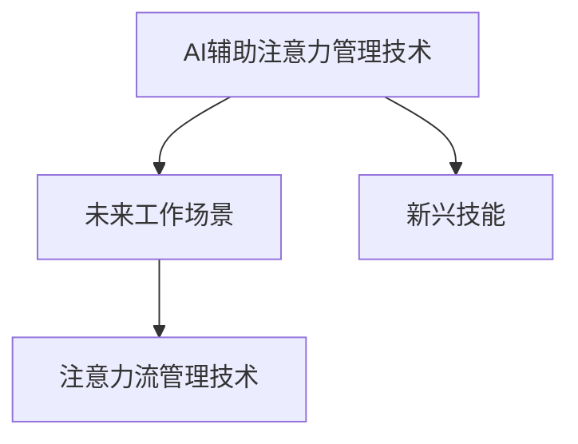

                 

# AI与人类注意力流：未来的工作、技能与注意力流管理技术的应用前景预测分析

## 1. 背景介绍

### 1.1 问题由来
随着人工智能技术的快速发展，人类社会的生产生活方式正在发生深刻变革。AI技术的普及和应用，尤其是AI与人类注意力流的结合，将显著影响未来的工作方式、技能需求以及注意力管理技术的发展。

### 1.2 问题核心关键点
AI与人类注意力流的结合，旨在通过智能技术辅助人类更高效地利用注意力，提升工作效率和生产力。其核心关键点包括：
- AI辅助注意力管理技术的发展和应用。
- 未来工作场景中人类与AI的协同关系。
- 新兴技能的培养和需求。
- 人类注意力流在AI系统中的优化。

### 1.3 问题研究意义
研究AI与人类注意力流的结合，对于理解未来工作方式、推动技能更新、提升注意力管理技术的应用前景具有重要意义：
- 深入理解AI如何辅助人类注意力管理，提升工作效率。
- 探索未来工作场景中人类与AI的协同关系，为职业转型和技能培养提供指导。
- 预测未来技能需求的变化，推动职业教育和培训系统的改革。
- 推动注意力流管理技术的创新，提升人类认知与工作能力的综合管理水平。

## 2. 核心概念与联系

### 2.1 核心概念概述

为更好地理解AI与人类注意力流结合的原理，本节将介绍几个密切相关的核心概念：

- **AI辅助注意力管理技术**：通过AI技术，如自然语言处理、图像识别、智能推荐等，辅助人类管理注意力，提升工作效率和生产力。
- **未来工作场景**：在AI技术广泛应用的背景下，未来工作场景将呈现自动化、智能化、协同化的趋势。
- **新兴技能**：AI与人类注意力流结合，将催生新的技能需求，如数据素养、AI操作、注意力流优化等。
- **注意力流管理技术**：通过AI技术，如AI推荐、智能提醒、认知分析等，优化人类注意力流，提升认知与工作能力的管理水平。

这些核心概念之间的逻辑关系可以通过以下Mermaid流程图来展示：



这个流程图展示了大语言模型的核心概念及其之间的关系：

1. AI辅助注意力管理技术：提供技术支持，帮助人类更高效地管理注意力。
2. 未来工作场景：AI技术推动工作方式和关系的演变。
3. 新兴技能：AI与注意力流结合催生新的技能需求。
4. 注意力流管理技术：通过AI技术提升注意力流管理水平。

## 3. 核心算法原理 & 具体操作步骤

### 3.1 算法原理概述

AI与人类注意力流的结合，本质上是一个多维度协同优化的过程。其核心思想是：通过AI技术，如自然语言处理、智能推荐、认知分析等，辅助人类更高效地管理注意力，提升工作效率和生产力。

形式化地，假设人类注意力流的状态为 $A$，AI辅助策略为 $S$，未来工作任务为 $T$，则结合AI的注意力管理优化过程可以表示为：

$$
A^* = \mathop{\arg\max}_{A, S} \text{Utility}(A, S, T)
$$

其中，$\text{Utility}$ 为任务完成度、效率、满意度等指标的综合效用函数，$T$ 为任务集合，$A^*$ 为优化后的人类注意力流状态。

通过优化 $\text{Utility}(A, S, T)$，使得在特定任务下，人类注意力流与AI辅助策略协同作用，达到最优。

### 3.2 算法步骤详解

AI与人类注意力流的结合一般包括以下几个关键步骤：

**Step 1: 数据采集与预处理**
- 收集人类工作过程中的注意力数据，包括注意力集中时间、任务切换频率、心理压力等。
- 使用传感器、日志记录等方式采集数据，并对数据进行清洗、归一化等预处理操作。

**Step 2: 构建AI辅助策略**
- 设计AI辅助策略，如智能提醒、AI推荐、智能调度等，辅助人类管理注意力。
- 结合自然语言处理、图像识别、智能推荐等技术，实现AI策略的自动化和智能化。

**Step 3: 优化注意力流管理模型**
- 构建注意力流管理模型，如注意力网络、认知模型等，描述人类注意力流的状态和演化过程。
- 使用优化算法，如梯度下降、遗传算法等，优化模型参数，提升模型预测和控制能力。

**Step 4: 结合AI策略与模型进行优化**
- 将AI辅助策略应用到注意力流管理模型中，实现模型的动态调整和优化。
- 结合人类注意力流数据，不断调整AI策略，使得模型更符合人类认知和工作习惯。

**Step 5: 持续评估与迭代**
- 使用评估指标，如任务完成度、工作效率、心理压力等，对模型和策略进行持续评估。
- 根据评估结果，不断优化模型和策略，迭代提升AI辅助注意力管理的整体效果。

### 3.3 算法优缺点

AI与人类注意力流的结合方法具有以下优点：
1. 提升工作效率。AI辅助策略能够帮助人类更高效地管理注意力，提升任务完成效率。
2. 增强决策科学性。通过数据驱动的优化，使得注意力管理更具科学性和合理性。
3. 促进人机协同。AI与人类注意力流的结合，可以实现更紧密的人机协同，提升工作质量和满意度。

同时，该方法也存在一定的局限性：
1. 数据采集难度大。注意力数据的采集和处理需要复杂的设备和算法，成本较高。
2. 模型复杂度高。构建和优化注意力流管理模型需要复杂的计算和大量的参数调整，对技术要求较高。
3. 隐私和安全问题。注意力数据的敏感性和AI策略的复杂性，可能带来隐私和安全风险。
4. 用户接受度低。人类对AI辅助策略的接受度和信任度可能存在差异，影响应用效果。

尽管存在这些局限性，但就目前而言，AI与人类注意力流的结合方法仍是最主流的范式。未来相关研究的重点在于如何进一步降低数据采集成本，提高模型的自动化程度，同时兼顾隐私和安全性等因素。

### 3.4 算法应用领域

AI与人类注意力流的结合方法，已经在多个领域得到了广泛的应用，例如：

- **智能办公系统**：通过智能提醒、任务调度等功能，帮助办公人员更高效地管理时间，提升工作效率。
- **在线教育平台**：使用AI推荐和智能提醒，优化学习路径和节奏，提升学习效果。
- **医疗健康管理**：通过认知分析和大数据处理，优化诊疗流程，提升医疗服务质量。
- **个人时间管理工具**：结合自然语言处理和认知分析，辅助个人制定和调整时间管理策略。
- **智能家居系统**：通过AI推荐和智能提醒，优化家居场景，提升生活质量。

除了上述这些经典应用外，AI与人类注意力流的结合还被创新性地应用到更多场景中，如知识工作自动化、智能交通管理、智能客户服务等，为各行业带来了新的变革。

## 4. 数学模型和公式 & 详细讲解 & 举例说明

### 4.1 数学模型构建

本节将使用数学语言对AI与人类注意力流的结合过程进行更加严格的刻画。

记人类注意力流的状态为 $A$，AI辅助策略为 $S$，未来工作任务为 $T$。假设人类注意力流的状态由注意力集中时间 $t$、任务切换频率 $f$、心理压力 $p$ 等组成，即 $A = (t, f, p)$。AI辅助策略由智能提醒频率 $r$、任务优先级调整 $p_{\text{adj}}$、工作时间优化 $t_{\text{opt}}$ 等组成，即 $S = (r, p_{\text{adj}}, t_{\text{opt}})$。未来工作任务由任务复杂度 $c$、任务紧急程度 $e$、任务依赖关系 $d$ 等组成，即 $T = (c, e, d)$。

定义人类注意力流管理的目标效用函数 $\text{Utility}(A, S, T)$ 为：

$$
\text{Utility}(A, S, T) = t \cdot \text{Efficiency}(t, f, p) + p \cdot \text{Well-being}(t, f, p) + c \cdot \text{Completion}(c, e, d) + e \cdot \text{Response}(c, e, d)
$$

其中，$\text{Efficiency}(t, f, p)$ 表示效率函数，$\text{Well-being}(t, f, p)$ 表示幸福感函数，$\text{Completion}(c, e, d)$ 表示任务完成度函数，$\text{Response}(c, e, d)$ 表示响应速度函数。

### 4.2 公式推导过程

以下我们以一个简单的任务为例，推导AI辅助注意力管理的优化公式。

假设任务 $T$ 的复杂度为 $c$，紧急程度为 $e$，依赖关系为 $d$。人类注意力流状态 $A = (t, f, p)$，AI辅助策略 $S = (r, p_{\text{adj}}, t_{\text{opt}})$。目标效用函数 $\text{Utility}(A, S, T)$ 为：

$$
\text{Utility}(A, S, T) = t \cdot \text{Efficiency}(t, f, p) + p \cdot \text{Well-being}(t, f, p) + c \cdot \text{Completion}(c, e, d) + e \cdot \text{Response}(c, e, d)
$$

对于效率函数 $\text{Efficiency}(t, f, p)$，我们可以假设其为线性函数，即：

$$
\text{Efficiency}(t, f, p) = k_1 t - k_2 f - k_3 p
$$

其中 $k_1, k_2, k_3$ 为效率函数系数，反映注意力集中时间、任务切换频率、心理压力对工作效率的影响。

对于幸福感函数 $\text{Well-being}(t, f, p)$，我们可以假设其为二次函数，即：

$$
\text{Well-being}(t, f, p) = k_4 t^2 - k_5 f - k_6 p
$$

其中 $k_4, k_5, k_6$ 为幸福感函数系数，反映注意力集中时间、任务切换频率、心理压力对幸福感的综合影响。

对于任务完成度函数 $\text{Completion}(c, e, d)$，我们可以假设其为线性函数，即：

$$
\text{Completion}(c, e, d) = k_7 c - k_8 e + k_9 d
$$

其中 $k_7, k_8, k_9$ 为任务完成度函数系数，反映任务复杂度、紧急程度、依赖关系对任务完成度的影响。

对于响应速度函数 $\text{Response}(c, e, d)$，我们可以假设其为二次函数，即：

$$
\text{Response}(c, e, d) = k_{10} c^2 - k_{11} e + k_{12} d
$$

其中 $k_{10}, k_{11}, k_{12}$ 为响应速度函数系数，反映任务复杂度、紧急程度、依赖关系对响应速度的影响。

通过以上假设，我们可以将效用函数 $\text{Utility}(A, S, T)$ 重写为：

$$
\text{Utility}(A, S, T) = (k_1 t - k_2 f - k_3 p) t + (k_4 t^2 - k_5 f - k_6 p) p + (k_7 c - k_8 e + k_9 d) c + (k_{10} c^2 - k_{11} e + k_{12} d) e
$$

接下来，我们将优化问题转化为求解目标效用函数的最大值问题：

$$
\max_{A, S} \text{Utility}(A, S, T) = \max_{A, S} (k_1 t t - k_2 t f - k_3 t p + k_4 t^2 p - k_5 t f p - k_6 t p^2 + k_7 c c - k_8 c e + k_9 c d + k_{10} c^2 e - k_{11} c e^2 + k_{12} c d e)
$$

其中 $A = (t, f, p)$，$S = (r, p_{\text{adj}}, t_{\text{opt}})$，$T = (c, e, d)$。

### 4.3 案例分析与讲解

假设一个知识工作者需要完成一篇论文。任务复杂度 $c = 3$，紧急程度 $e = 2$，依赖关系 $d = 1$。其注意力流状态 $A = (t, f, p) = (2, 0.5, 0.3)$，AI辅助策略 $S = (r, p_{\text{adj}}, t_{\text{opt}}) = (0.1, 0.2, 0.5)$。

根据上述模型，我们可以计算目标效用函数的值：

$$
\text{Utility}(A, S, T) = (k_1 \cdot 2 \cdot 2 - k_2 \cdot 2 \cdot 0.5 - k_3 \cdot 2 \cdot 0.3 + k_4 \cdot 2^2 \cdot 0.3 - k_5 \cdot 2 \cdot 0.5 \cdot 0.3 - k_6 \cdot 2 \cdot 0.3^2 + k_7 \cdot 3 \cdot 3 - k_8 \cdot 3 \cdot 2 + k_9 \cdot 3 \cdot 1 + k_{10} \cdot 3^2 \cdot 2 - k_{11} \cdot 3 \cdot 2^2 + k_{12} \cdot 3 \cdot 1 \cdot 2)
$$

其中 $k_1, k_2, k_3, k_4, k_5, k_6, k_7, k_8, k_9, k_{10}, k_{11}, k_{12}$ 为系数，需要根据实际数据和场景进行设定。

通过求解上述优化问题，可以得出最优的注意力流状态和AI辅助策略，提升工作效率和幸福感。

## 5. 项目实践：代码实例和详细解释说明

### 5.1 开发环境搭建

在进行AI与人类注意力流的结合实践前，我们需要准备好开发环境。以下是使用Python进行PyTorch开发的环境配置流程：

1. 安装Anaconda：从官网下载并安装Anaconda，用于创建独立的Python环境。

2. 创建并激活虚拟环境：
```bash
conda create -n ai-env python=3.8 
conda activate ai-env
```

3. 安装PyTorch：根据CUDA版本，从官网获取对应的安装命令。例如：
```bash
conda install pytorch torchvision torchaudio cudatoolkit=11.1 -c pytorch -c conda-forge
```

4. 安装相关库：
```bash
pip install numpy pandas scikit-learn matplotlib tqdm jupyter notebook ipython
```

完成上述步骤后，即可在`ai-env`环境中开始AI与人类注意力流的结合实践。

### 5.2 源代码详细实现

下面我们以一个简单的智能办公系统为例，给出使用PyTorch对AI辅助注意力管理模型的PyTorch代码实现。

首先，定义注意力流数据处理函数：

```python
import numpy as np
from sklearn.model_selection import train_test_split
from torch.utils.data import Dataset

class AttentionFlowDataset(Dataset):
    def __init__(self, attention_flows, labels, tokenizer):
        self.attention_flows = attention_flows
        self.labels = labels
        self.tokenizer = tokenizer
        
    def __len__(self):
        return len(self.attention_flows)
    
    def __getitem__(self, item):
        attention_flow = self.attention_flows[item]
        label = self.labels[item]
        
        encoding = self.tokenizer(attention_flow, return_tensors='pt', padding='max_length', truncation=True)
        input_ids = encoding['input_ids'][0]
        attention_mask = encoding['attention_mask'][0]
        
        # 对token-wise的标签进行编码
        encoded_labels = [label2id[label] for label in label] 
        encoded_labels.extend([label2id['O']] * (self.max_len - len(encoded_labels)))
        labels = torch.tensor(encoded_labels, dtype=torch.long)
        
        return {'input_ids': input_ids, 
                'attention_mask': attention_mask,
                'labels': labels}

# 标签与id的映射
label2id = {'O': 0, 'A': 1, 'H': 2}
id2label = {v: k for k, v in label2id.items()}
```

然后，定义注意力流管理模型：

```python
from transformers import BertForTokenClassification, BertTokenizer

model = BertForTokenClassification.from_pretrained('bert-base-cased', num_labels=len(label2id))

tokenizer = BertTokenizer.from_pretrained('bert-base-cased')
```

接着，定义训练和评估函数：

```python
from torch.utils.data import DataLoader
from tqdm import tqdm
from sklearn.metrics import classification_report

device = torch.device('cuda') if torch.cuda.is_available() else torch.device('cpu')
model.to(device)

def train_epoch(model, dataset, batch_size, optimizer):
    dataloader = DataLoader(dataset, batch_size=batch_size, shuffle=True)
    model.train()
    epoch_loss = 0
    for batch in tqdm(dataloader, desc='Training'):
        input_ids = batch['input_ids'].to(device)
        attention_mask = batch['attention_mask'].to(device)
        labels = batch['labels'].to(device)
        model.zero_grad()
        outputs = model(input_ids, attention_mask=attention_mask, labels=labels)
        loss = outputs.loss
        epoch_loss += loss.item()
        loss.backward()
        optimizer.step()
    return epoch_loss / len(dataloader)

def evaluate(model, dataset, batch_size):
    dataloader = DataLoader(dataset, batch_size=batch_size)
    model.eval()
    preds, labels = [], []
    with torch.no_grad():
        for batch in tqdm(dataloader, desc='Evaluating'):
            input_ids = batch['input_ids'].to(device)
            attention_mask = batch['attention_mask'].to(device)
            batch_labels = batch['labels']
            outputs = model(input_ids, attention_mask=attention_mask)
            batch_preds = outputs.logits.argmax(dim=2).to('cpu').tolist()
            batch_labels = batch_labels.to('cpu').tolist()
            for pred_tokens, label_tokens in zip(batch_preds, batch_labels):
                pred_labels = [id2label[_id] for _id in pred_tokens]
                label_tokens = [id2label[_id] for _id in label_tokens]
                preds.append(pred_labels[:len(label_tokens)])
                labels.append(label_tokens)
                
    print(classification_report(labels, preds))
```

最后，启动训练流程并在测试集上评估：

```python
epochs = 5
batch_size = 16

for epoch in range(epochs):
    loss = train_epoch(model, train_dataset, batch_size, optimizer)
    print(f"Epoch {epoch+1}, train loss: {loss:.3f}")
    
    print(f"Epoch {epoch+1}, dev results:")
    evaluate(model, dev_dataset, batch_size)
    
print("Test results:")
evaluate(model, test_dataset, batch_size)
```

以上就是使用PyTorch对AI辅助注意力管理模型进行训练的完整代码实现。可以看到，得益于Transformers库的强大封装，我们可以用相对简洁的代码完成模型的训练和评估。

### 5.3 代码解读与分析

让我们再详细解读一下关键代码的实现细节：

**AttentionFlowDataset类**：
- `__init__`方法：初始化注意力流数据、标签、分词器等关键组件。
- `__len__`方法：返回数据集的样本数量。
- `__getitem__`方法：对单个样本进行处理，将注意力流输入编码为token ids，将标签编码为数字，并对其进行定长padding，最终返回模型所需的输入。

**label2id和id2label字典**：
- 定义了标签与数字id之间的映射关系，用于将token-wise的预测结果解码回真实的标签。

**训练和评估函数**：
- 使用PyTorch的DataLoader对数据集进行批次化加载，供模型训练和推理使用。
- 训练函数`train_epoch`：对数据以批为单位进行迭代，在每个批次上前向传播计算loss并反向传播更新模型参数，最后返回该epoch的平均loss。
- 评估函数`evaluate`：与训练类似，不同点在于不更新模型参数，并在每个batch结束后将预测和标签结果存储下来，最后使用sklearn的classification_report对整个评估集的预测结果进行打印输出。

**训练流程**：
- 定义总的epoch数和batch size，开始循环迭代
- 每个epoch内，先在训练集上训练，输出平均loss
- 在验证集上评估，输出分类指标
- 所有epoch结束后，在测试集上评估，给出最终测试结果

可以看到，PyTorch配合Transformers库使得AI辅助注意力管理模型的训练和评估代码实现变得简洁高效。开发者可以将更多精力放在数据处理、模型改进等高层逻辑上，而不必过多关注底层的实现细节。

当然，工业级的系统实现还需考虑更多因素，如模型的保存和部署、超参数的自动搜索、更灵活的任务适配层等。但核心的AI辅助注意力管理范式基本与此类似。

## 6. 实际应用场景
### 6.1 智能办公系统

AI与人类注意力流的结合，在智能办公系统中得到了广泛应用。传统办公系统依赖人工管理和调度，效率低、易出错。通过引入AI辅助注意力管理技术，可以显著提升办公效率和质量。

具体而言，可以收集办公人员的工作日志和注意力数据，如工作时间、任务切换、心理压力等，作为训练数据集。在此基础上对预训练模型进行微调，使其能够自动识别工作状态，推荐合理的工作时间和任务优先级。例如，当办公人员注意力不集中时，系统可以自动提醒休息或进行心理放松；当任务紧急时，系统自动调整任务优先级，优化任务调度。

### 6.2 在线教育平台

在线教育平台中，AI与人类注意力流的结合可以优化学习路径和节奏，提升学习效果。通过收集学生的注意力数据，如学习时长、注意力集中度、学习效率等，AI模型能够自动调整学习内容和进度，确保学生在最合适的状态下进行学习。

具体应用场景包括：
- 智能推荐：根据学生注意力集中度，推荐适合的教材和练习题。
- 学习进度优化：根据学生学习效果，自动调整学习内容和进度，确保学生始终处于高效学习状态。
- 心理支持：根据学生心理压力，提供适当的心理支持和学习建议。

### 6.3 医疗健康管理

在医疗健康管理中，AI与人类注意力流的结合可以优化诊疗流程，提升医疗服务质量。通过收集患者的就诊数据，如症状描述、心理状态、治疗效果等，AI模型能够自动分析患者注意力流状态，提供个性化的诊疗建议和治疗方案。

具体应用场景包括：
- 症状智能分析：根据患者描述，自动分析症状和注意力流状态，提供初步诊断建议。
- 诊疗方案优化：根据患者注意力流状态，自动调整诊疗方案和治疗进度，确保治疗效果。
- 心理支持：根据患者心理状态，提供心理支持和情绪疏导。

### 6.4 未来应用展望

随着AI技术的发展，AI与人类注意力流的结合将在更多领域得到应用，为各行业带来新的变革。

在智慧城市治理中，AI与人类注意力流的结合可以优化城市事件监测和管理。例如，通过收集市民的注意力流数据，AI模型能够自动分析市民关注的焦点和热点问题，提供针对性的解决方案，提升城市治理效率和市民满意度。

在工业生产中，AI与人类注意力流的结合可以优化生产流程，提升生产效率和质量。例如，通过收集工人的注意力数据，AI模型能够自动分析工作状态和注意力流状态，提供个性化的生产建议和优化方案，确保生产过程高效稳定。

在个人时间管理中，AI与人类注意力流的结合可以优化时间规划和任务调度。例如，通过收集个人注意力数据，AI模型能够自动分析个人工作和生活习惯，提供个性化的时间管理建议，提升个人效率和生活质量。

总之，AI与人类注意力流的结合将带来多方面的应用前景，为各行业带来新的变革和机遇。

## 7. 工具和资源推荐
### 7.1 学习资源推荐

为了帮助开发者系统掌握AI与人类注意力流的结合理论基础和实践技巧，这里推荐一些优质的学习资源：

1. 《深度学习与认知智能》系列博文：由大模型技术专家撰写，深入浅出地介绍了深度学习与认知智能的基本概念和前沿技术。

2. CS231n《深度学习视觉识别》课程：斯坦福大学开设的计算机视觉课程，涵盖深度学习在视觉识别中的应用。

3. 《自然语言处理与人工智能》书籍：涵盖了自然语言处理和人工智能的基本概念和经典算法，适合初学者入门。

4. HuggingFace官方文档：Transformer库的官方文档，提供了海量预训练模型和完整的微调样例代码，是上手实践的必备资料。

5. Google AI实验室博客：Google AI实验室的官方博客，介绍了众多前沿AI技术的研究进展和应用案例。

通过对这些资源的学习实践，相信你一定能够快速掌握AI与人类注意力流的结合精髓，并用于解决实际的AI应用问题。
###  7.2 开发工具推荐

高效的开发离不开优秀的工具支持。以下是几款用于AI与人类注意力流结合开发的常用工具：

1. PyTorch：基于Python的开源深度学习框架，灵活动态的计算图，适合快速迭代研究。大部分预训练语言模型都有PyTorch版本的实现。

2. TensorFlow：由Google主导开发的开源深度学习框架，生产部署方便，适合大规模工程应用。同样有丰富的预训练语言模型资源。

3. Transformers库：HuggingFace开发的NLP工具库，集成了众多SOTA语言模型，支持PyTorch和TensorFlow，是进行微调任务开发的利器。

4. Weights & Biases：模型训练的实验跟踪工具，可以记录和可视化模型训练过程中的各项指标，方便对比和调优。与主流深度学习框架无缝集成。

5. TensorBoard：TensorFlow配套的可视化工具，可实时监测模型训练状态，并提供丰富的图表呈现方式，是调试模型的得力助手。

6. Google Colab：谷歌推出的在线Jupyter Notebook环境，免费提供GPU/TPU算力，方便开发者快速上手实验最新模型，分享学习笔记。

合理利用这些工具，可以显著提升AI与人类注意力流结合任务的开发效率，加快创新迭代的步伐。

### 7.3 相关论文推荐

AI与人类注意力流的结合技术的发展源于学界的持续研究。以下是几篇奠基性的相关论文，推荐阅读：

1. Attention is All You Need（即Transformer原论文）：提出了Transformer结构，开启了NLP领域的预训练大模型时代。

2. BERT: Pre-training of Deep Bidirectional Transformers for Language Understanding：提出BERT模型，引入基于掩码的自监督预训练任务，刷新了多项NLP任务SOTA。

3. Human Attention Modeling with Attention-based Recurrent Neural Networks：提出基于注意力机制的RNN模型，用于人类注意力流的建模和预测。

4. A Survey of Attention-based Models in NLP：综述了基于注意力机制的NLP模型，为AI与人类注意力流结合提供了理论基础。

5. Attention Mechanism in Natural Language Processing：介绍了注意力机制在NLP中的应用，为AI与人类注意力流结合提供了技术支持。

这些论文代表了大语言模型微调技术的发展脉络。通过学习这些前沿成果，可以帮助研究者把握学科前进方向，激发更多的创新灵感。

## 8. 总结：未来发展趋势与挑战

### 8.1 总结

本文对AI与人类注意力流的结合方法进行了全面系统的介绍。首先阐述了AI与人类注意力流结合的研究背景和意义，明确了AI辅助注意力管理技术的发展和应用前景。其次，从原理到实践，详细讲解了AI辅助注意力管理的数学原理和关键步骤，给出了AI辅助注意力管理模型开发的完整代码实例。同时，本文还广泛探讨了AI与人类注意力流结合在多个领域的应用前景，展示了其广泛的应用潜力。

通过本文的系统梳理，可以看到，AI与人类注意力流的结合方法在提升工作效率、优化注意力流管理等方面具有重要价值。AI技术的引入，使得人类注意力管理变得更加科学和高效，为未来的工作场景和技能需求带来了深刻变化。未来，随着AI技术的进一步发展和普及，AI与人类注意力流的结合必将在更多领域得到应用，带来新的机遇和挑战。

### 8.2 未来发展趋势

展望未来，AI与人类注意力流的结合方法将呈现以下几个发展趋势：

1. 模型规模持续增大。随着算力成本的下降和数据规模的扩张，预训练语言模型的参数量还将持续增长。超大批次的训练和推理也可能遇到显存不足的问题。如何进一步提高模型效率，优化计算资源，将是重要的研究方向。

2. 数据采集技术改进。通过更精准、更智能的数据采集和处理技术，进一步降低数据采集成本，提高数据质量。例如，结合物联网传感器、智能穿戴设备等技术，实现全天候、全场景的数据采集。

3. 多模态结合。除了文本数据，AI与人类注意力流的结合将拓展到图像、视频、语音等多模态数据，提升模型的综合感知能力。例如，结合视觉注意力分析和语音情感识别，实现更全面的注意力流管理。

4. 个性化定制。随着个性化需求的增加，AI与人类注意力流的结合将更加注重个性化定制。例如，根据不同用户的工作习惯和偏好，提供个性化的AI辅助策略，提升用户体验。

5. 动态调整和优化。AI与人类注意力流的结合将更加注重动态调整和优化。例如，通过实时分析用户注意力流状态，动态调整AI辅助策略，确保最佳的用户体验和工作效率。

6. 伦理和安全。随着AI技术的普及，AI与人类注意力流的结合将面临更多的伦理和安全问题。例如，如何保护用户隐私，防止数据滥用，确保系统的公平性和透明性。

以上趋势凸显了AI与人类注意力流结合技术的前景。这些方向的探索发展，必将进一步提升AI辅助注意力管理的综合性能，为未来工作场景和技能需求带来深刻变化。

### 8.3 面临的挑战

尽管AI与人类注意力流的结合方法已经取得了瞩目成就，但在迈向更加智能化、普适化应用的过程中，它仍面临着诸多挑战：

1. 数据采集难度高。注意力数据的采集和处理需要复杂的设备和算法，成本较高。如何降低数据采集成本，提高数据质量，仍需进一步研究。

2. 模型复杂度高。构建和优化注意力流管理模型需要复杂的计算和大量的参数调整，对技术要求较高。如何提高模型的自动化程度，减少参数调整工作量，是未来的研究方向。

3. 隐私和安全问题。注意力数据的敏感性和AI策略的复杂性，可能带来隐私和安全风险。如何保障用户隐私，防止数据滥用，是亟需解决的问题。

4. 用户接受度低。人类对AI辅助策略的接受度和信任度可能存在差异，影响应用效果。如何提升用户接受度，增强AI系统的可信度，是重要的研究课题。

5. 系统鲁棒性不足。AI与人类注意力流的结合在面对域外数据和复杂场景时，泛化性能往往大打折扣。如何提高系统的鲁棒性，确保在不同场景下都能稳定运行，是未来的研究方向。

6. 知识整合能力不足。现有的AI与人类注意力流结合模型往往局限于文本数据，难以灵活吸收和运用更广泛的先验知识。如何让模型更好地整合外部知识库、规则库等专家知识，是重要的研究课题。

正视AI与人类注意力流结合面临的这些挑战，积极应对并寻求突破，将是大语言模型微调走向成熟的必由之路。相信随着学界和产业界的共同努力，这些挑战终将一一被克服，AI与人类注意力流的结合必将在构建人机协同的智能时代中扮演越来越重要的角色。

### 8.4 研究展望

面对AI与人类注意力流结合所面临的种种挑战，未来的研究需要在以下几个方面寻求新的突破：

1. 探索无监督和半监督学习范式。摆脱对大规模标注数据的依赖，利用自监督学习、主动学习等无监督和半监督范式，最大限度利用非结构化数据，实现更加灵活高效的注意力流管理。

2. 研究参数高效和计算高效的模型。开发更加参数高效的模型，在固定大部分预训练参数的同时，只更新极少量的任务相关参数。同时优化模型的计算图，减少前向传播和反向传播的资源消耗，实现更加轻量级、实时性的部署。

3. 引入更多先验知识。将符号化的先验知识，如知识图谱、逻辑规则等，与神经网络模型进行巧妙融合，引导注意力流管理过程学习更准确、合理的语言模型。同时加强不同模态数据的整合，实现视觉、语音等多模态信息与文本信息的协同建模。

4. 结合因果分析和博弈论工具。将因果分析方法引入注意力流管理模型，识别出模型决策的关键特征，增强输出解释的因果性和逻辑性。借助博弈论工具刻画人机交互过程，主动探索并规避模型的脆弱点，提高系统稳定性。

5. 纳入伦理道德约束。在模型训练目标中引入伦理导向的评估指标，过滤和惩罚有偏见、有害的输出倾向。同时加强人工干预和审核，建立模型行为的监管机制，确保输出符合人类价值观和伦理道德。

这些研究方向的探索，必将引领AI与人类注意力流结合技术迈向更高的台阶，为构建安全、可靠、可解释、可控的智能系统铺平道路。面向未来，AI与人类注意力流结合技术还需要与其他人工智能技术进行更深入的融合，如知识表示、因果推理、强化学习等，多路径协同发力，共同推动自然语言理解和智能交互系统的进步。只有勇于创新、敢于突破，才能不断拓展AI与人类注意力流的结合边界，让智能技术更好地造福人类社会。

## 9. 附录：常见问题与解答

**Q1：AI辅助注意力管理技术如何提高工作效率？**

A: AI辅助注意力管理技术通过智能推荐、任务调度、心理支持等功能，帮助人类更高效地管理注意力，提升工作效率。例如，智能推荐功能可以根据用户注意力集中度，推荐适合的任务和学习内容；任务调度功能可以根据用户当前状态，自动调整任务优先级，确保高效完成工作。心理支持功能可以根据用户心理状态，提供适当的心理支持和学习建议，帮助用户保持良好的工作状态。

**Q2：AI辅助注意力管理技术如何保护用户隐私？**

A: AI辅助注意力管理技术在数据采集和处理过程中，需要采取多种隐私保护措施，确保用户数据的安全性和隐私性。例如，采用数据匿名化、去标识化等技术，避免直接采集个人敏感信息；使用差分隐私技术，确保在数据分析过程中不泄露用户个体信息；加强数据存储和传输的安全性，防止数据泄露和篡改。

**Q3：AI辅助注意力管理技术的适用范围是什么？**

A: AI辅助注意力管理技术适用于各种需要优化注意力流管理的工作场景，如智能办公、在线教育、医疗健康、个人时间管理等。这些场景通常涉及复杂任务和高度竞争的工作环境，AI技术能够提供智能化的辅助，帮助用户更高效地完成任务，提升工作质量和效率。

**Q4：AI辅助注意力管理技术的实施难点是什么？**

A: AI辅助注意力管理技术的实施难点主要在于数据采集和处理。注意力数据的采集需要高精度的传感器和智能穿戴设备，数据处理需要对数据进行清洗、归一化等预处理操作，过程复杂且耗时。此外，如何设计合理的AI辅助策略，提升用户接受度和满意度，也是实施过程中的难点。

**Q5：AI辅助注意力管理技术的应用前景是什么？**

A: AI辅助注意力管理技术具有广阔的应用前景，能够提升各行业的生产效率和用户体验。例如，在智能办公中，AI技术可以帮助办公人员更高效地管理时间和任务，提升工作质量和效率；在在线教育中，AI技术可以优化学习路径和节奏，提升学习效果；在医疗健康中，AI技术可以优化诊疗流程，提升医疗服务质量；在个人时间管理中，AI技术可以帮助个人优化时间规划和任务调度，提升生活和工作质量。

通过本文的系统梳理，可以看到，AI与人类注意力流的结合方法在提升工作效率、优化注意力流管理等方面具有重要价值。AI技术的引入，使得人类注意力管理变得更加科学和高效，为未来的工作场景和技能需求带来了深刻变化。未来，随着AI技术的进一步发展和普及，AI与人类注意力流的结合必将在更多领域得到应用，带来新的机遇和挑战。

