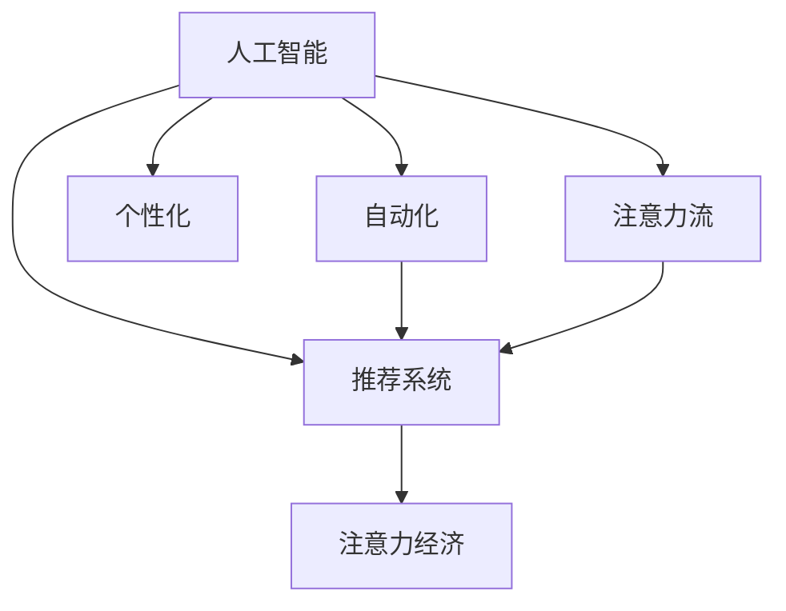

                 

# AI与人类注意力流：未来的工作、生活与注意力经济

> 关键词：人工智能,注意力流,自动化,个性化,经济,工作,生活

## 1. 背景介绍

### 1.1 问题由来
随着信息时代的发展，人类社会的注意力流呈现出了显著的转变。随着互联网、社交媒体的兴起，人们的注意力开始从传统的物理世界，逐渐转移到虚拟的网络空间。由此，注意力经济（Economy of Attention）应运而生。

注意力经济（Attention Economy）是指在信息过载的时代背景下，人们在有限的时间内对信息进行选择和消费，决定哪些内容值得关注和投入注意力。这些注意力资源被各大平台、企业和内容创作者所竞争和利用。

### 1.2 问题核心关键点
人工智能（AI）技术的发展，在很大程度上改变了注意力流的分配和利用方式。AI不仅能够自动化处理海量数据，还能够通过个性化推荐算法，精准地抓取和引导人们的注意力。这些AI系统通过分析用户的兴趣、行为等数据，为其提供个性化的内容和服务，从而影响了人们的消费习惯、工作方式和生活节奏。

AI技术在注意力经济中的作用可以概括为以下几个关键点：
1. 自动化信息处理：AI可以高效地处理和分析海量数据，自动化地进行信息筛选和匹配。
2. 个性化推荐：AI算法能够根据用户的兴趣、行为习惯等，进行个性化推荐，提高用户粘性。
3. 实时响应：AI系统能够实时捕捉用户的行为变化，动态调整推荐内容，满足用户的需求。
4. 数据驱动决策：AI系统通过分析用户数据，可以预测用户行为，辅助决策。

## 2. 核心概念与联系

### 2.1 核心概念概述

为更好地理解AI在注意力经济中的应用，本节将介绍几个密切相关的核心概念：

- **人工智能**：指通过模拟人类智能行为，使用算法和模型对数据进行处理、学习和推理的计算机技术。
- **注意力流**：指人们在获取信息时，注意力在不同信息源之间的流动和分配过程。
- **自动化**：指通过技术手段，自动化地完成信息处理、决策等任务，降低人工干预。
- **个性化**：指根据用户的个体特征，为其提供量身定制的服务和内容，提高用户满意度。
- **注意力经济**：指在信息过载时代，人们通过对有限注意力资源的分配和利用，实现商业价值的过程。
- **推荐系统**：通过分析用户行为和偏好，自动推荐相关内容或服务的系统。

这些核心概念之间的逻辑关系可以通过以下Mermaid流程图来展示：



这个流程图展示了一些关键概念及其之间的关系：

1. 人工智能技术通过自动化处理和个性化推荐，直接影响注意力流的分配。
2. 推荐系统作为AI技术的重要应用，能够捕捉用户注意力，并引导其消费行为。
3. 注意力经济则是AI技术在商业应用中的重要体现，利用用户注意力资源创造商业价值。

## 3. 核心算法原理 & 具体操作步骤
### 3.1 算法原理概述

AI在注意力经济中的应用，主要集中在个性化推荐和自动化决策两个方面。以下是这两个方面的算法原理概述：

#### 3.1.1 个性化推荐算法

个性化推荐算法的核心目标是利用用户的历史行为和偏好，预测其未来的需求，从而为其提供更精准的内容或服务。常用的个性化推荐算法包括协同过滤、内容过滤、基于深度学习的推荐模型等。

协同过滤算法通过分析用户之间的相似性，推荐与用户兴趣相似的其他用户喜欢的物品。内容过滤算法则是根据物品的特征，推荐用户可能感兴趣的内容。基于深度学习的推荐模型，如基于神经网络的推荐系统，通过学习用户行为和物品特征，预测用户对新物品的评分，从而进行推荐。

#### 3.1.2 自动化决策算法

自动化决策算法通过分析用户数据，预测用户的行为和需求，辅助企业进行决策。常用的自动化决策算法包括基于规则的系统、基于机器学习的预测模型等。

基于规则的系统通过定义一系列的规则，自动处理用户的查询和请求。基于机器学习的预测模型，如线性回归、随机森林等，通过分析用户数据，预测用户的行为，辅助企业做出决策。

### 3.2 算法步骤详解

#### 3.2.1 个性化推荐算法步骤

1. **数据采集**：收集用户的历史行为数据、兴趣标签等。
2. **特征提取**：从数据中提取有用的特征，如用户ID、物品ID、评分等。
3. **相似性计算**：计算用户之间的相似性，找出相似用户。
4. **推荐计算**：利用相似性结果，计算用户对新物品的评分，推荐用户可能感兴趣的内容。
5. **模型优化**：根据用户的反馈，不断调整模型参数，提升推荐效果。

#### 3.2.2 自动化决策算法步骤

1. **数据采集**：收集用户的历史行为数据、属性信息等。
2. **特征提取**：从数据中提取有用的特征，如用户ID、物品ID、评分等。
3. **模型训练**：利用历史数据训练预测模型，学习用户行为规律。
4. **预测决策**：输入新数据，利用训练好的模型进行预测，辅助决策。
5. **结果评估**：根据实际结果，评估模型的性能，优化模型参数。

### 3.3 算法优缺点

#### 3.3.1 个性化推荐算法的优缺点

**优点**：
- 个性化推荐算法能够精准地捕捉用户兴趣，提高用户满意度。
- 能够动态调整推荐内容，满足用户实时需求。
- 算法较为成熟，效果显著。

**缺点**：
- 对数据的依赖较大，需要大量的用户行为数据。
- 容易陷入局部最优，难以处理稀疏数据。
- 对新物品的推荐效果可能较差。

#### 3.3.2 自动化决策算法的优缺点

**优点**：
- 能够快速处理大量数据，自动化决策。
- 能够捕捉用户行为规律，辅助企业进行科学决策。
- 算法较为简单，易于实现。

**缺点**：
- 对数据的依赖较大，需要高质量的数据。
- 无法处理复杂决策问题。
- 需要频繁更新模型，维护成本较高。

### 3.4 算法应用领域

个性化推荐算法和自动化决策算法在多个领域得到了广泛应用，例如：

- **电子商务**：推荐系统能够为用户推荐商品，提高转化率和销售额。
- **媒体娱乐**：推荐系统能够为用户推荐电影、音乐、文章等，提升用户粘性。
- **金融服务**：自动化决策算法能够根据用户数据，进行风险评估和信用评分。
- **健康医疗**：自动化决策算法能够分析用户健康数据，提供健康建议和治疗方案。
- **智能家居**：自动化决策算法能够根据用户行为，调节智能设备，提供个性化服务。

## 4. 数学模型和公式 & 详细讲解 & 举例说明

### 4.1 数学模型构建

本节将使用数学语言对基于AI的个性化推荐和自动化决策算法进行更加严格的刻画。

假设用户-物品评分矩阵为 $R$，用户行为序列为 $X$，物品特征向量为 $I$，用户特征向量为 $U$。

个性化推荐的目标是最小化预测误差，即：

$$
\min_{\theta} \sum_{i,j}(R_{ij}-\hat{R}_{ij})^2
$$

其中 $\hat{R}_{ij}$ 为模型预测的用户对物品 $j$ 的评分，$\theta$ 为模型参数。

自动化决策的目标是最大化预测准确率，即：

$$
\max_{\theta} \sum_{i} \text{Accuracy}(R_{ij},\hat{R}_{ij})
$$

其中 $\text{Accuracy}$ 为预测准确率函数，$R_{ij}$ 为实际用户对物品 $j$ 的评分。

### 4.2 公式推导过程

#### 4.2.1 个性化推荐算法

以协同过滤算法为例，推导推荐函数的计算公式。

假设用户 $i$ 对物品 $j$ 的评分 $r_{ij}$ 和用户 $k$ 对物品 $j$ 的评分 $r_{kj}$。利用用户 $i$ 和用户 $k$ 之间的相似度 $s_{ik}$，计算用户 $i$ 对物品 $j$ 的推荐评分 $\hat{r}_{ij}$：

$$
\hat{r}_{ij} = \sum_{k} s_{ik} r_{kj} / \sum_{k} s_{ik}
$$

其中 $s_{ik}$ 为用户 $i$ 和用户 $k$ 之间的相似度，可以通过余弦相似度或皮尔逊相关系数计算。

#### 4.2.2 自动化决策算法

以基于随机森林的预测模型为例，推导预测函数的计算公式。

假设用户 $i$ 的历史行为数据为 $X_i$，物品 $j$ 的特征向量为 $I_j$，预测用户对物品 $j$ 的评分 $\hat{r}_{ij}$：

$$
\hat{r}_{ij} = \sum_{k} \alpha_k r_{kj} / \sum_{k} \alpha_k
$$

其中 $\alpha_k$ 为随机森林中第 $k$ 棵树的权重，$r_{kj}$ 为该树对物品 $j$ 的预测评分。

### 4.3 案例分析与讲解

#### 4.3.1 个性化推荐算法案例

假设某电子商务网站有 $M$ 个用户和 $N$ 个商品。每个用户 $i$ 对每个商品 $j$ 的评分 $r_{ij}$ 存储在矩阵 $R$ 中。利用协同过滤算法，计算用户 $i$ 对商品 $j$ 的推荐评分 $\hat{r}_{ij}$：

1. **数据采集**：收集用户的历史行为数据 $X$，商品的属性信息 $I$。
2. **特征提取**：从 $X$ 中提取用户ID、物品ID、评分等特征，从 $I$ 中提取物品ID、属性值等特征。
3. **相似性计算**：计算用户之间的相似度 $s_{ik}$。
4. **推荐计算**：利用相似度 $s_{ik}$ 和用户 $k$ 对物品 $j$ 的评分 $r_{kj}$，计算用户 $i$ 对物品 $j$ 的推荐评分 $\hat{r}_{ij}$。
5. **模型优化**：根据用户的反馈，调整相似度计算方法，优化模型参数。

#### 4.3.2 自动化决策算法案例

假设某金融公司有 $N$ 个用户，需要根据用户的历史交易数据，预测用户的信用评分。利用基于随机森林的预测模型，计算用户对信用评分的预测 $\hat{y}_i$：

1. **数据采集**：收集用户的历史交易数据 $X$，用户的属性信息 $U$。
2. **特征提取**：从 $X$ 中提取交易金额、交易时间等特征，从 $U$ 中提取用户年龄、性别等特征。
3. **模型训练**：利用历史交易数据 $X$ 和信用评分 $Y$，训练随机森林模型，学习用户行为规律。
4. **预测决策**：输入新交易数据 $X'$，利用训练好的随机森林模型，预测用户对新交易的信用评分 $\hat{y}_i$。
5. **结果评估**：根据实际信用评分 $y_i$，评估模型的预测准确率，优化模型参数。

## 5. 项目实践：代码实例和详细解释说明
### 5.1 开发环境搭建

在进行AI应用实践前，我们需要准备好开发环境。以下是使用Python进行PyTorch开发的环境配置流程：

1. 安装Anaconda：从官网下载并安装Anaconda，用于创建独立的Python环境。

2. 创建并激活虚拟环境：
```bash
conda create -n ai-env python=3.8 
conda activate ai-env
```

3. 安装PyTorch：根据CUDA版本，从官网获取对应的安装命令。例如：
```bash
conda install pytorch torchvision torchaudio cudatoolkit=11.1 -c pytorch -c conda-forge
```

4. 安装TensorBoard：
```bash
pip install tensorboard
```

5. 安装TensorFlow：
```bash
pip install tensorflow
```

6. 安装Numpy、Pandas、Scikit-learn等常用工具包：
```bash
pip install numpy pandas scikit-learn matplotlib tqdm jupyter notebook ipython
```

完成上述步骤后，即可在`ai-env`环境中开始AI应用实践。

### 5.2 源代码详细实现

这里以基于协同过滤的个性化推荐系统为例，给出使用PyTorch的代码实现。

首先，定义数据处理函数：

```python
import numpy as np
from sklearn.metrics.pairwise import cosine_similarity

def prepare_data(data):
    X = []
    Y = []
    for user, items in data:
        X.append(user)
        Y.append(items)
    X = np.array(X)
    Y = np.array(Y)
    return X, Y

# 计算用户之间的相似度
def compute_similarity(X):
    return cosine_similarity(X, X)
```

然后，定义推荐函数：

```python
import torch
from torch import nn, optim

class Recommender(nn.Module):
    def __init__(self, user_num, item_num, k=10):
        super(Recommender, self).__init__()
        self.k = k
        self.user_embed = nn.Embedding(user_num, 10)
        self.item_embed = nn.Embedding(item_num, 10)
        self.s = nn.Linear(10, 10)

    def forward(self, user, item):
        user_embed = self.user_embed(user)
        item_embed = self.item_embed(item)
        prediction = self.s(torch.mm(user_embed, item_embed.T))
        return prediction

def recommend(user, item, data, k=10):
    X, Y = prepare_data(data)
    user_index = np.where(X == user)[0][0]
    similarity = compute_similarity(X)
    recommender = Recommender(X.shape[0], Y.shape[0])
    optimizer = optim.Adam(recommender.parameters(), lr=0.01)
    for i in range(1000):
        item_index = np.where(Y == item)[0][0]
        user_index = np.where(X == user)[0][0]
        optimizer.zero_grad()
        prediction = recommender(user_index, item_index)
        loss = nn.L1Loss()(prediction, torch.tensor([0]))
        loss.backward()
        optimizer.step()
        if i % 100 == 0:
            print(f"Epoch {i}, loss: {loss.item()}")
    recommendation = recommender(user_index, torch.tensor([user_index]))
    indices = np.argsort(-prediction.cpu().numpy())[:k]
    return indices
```

最后，启动推荐系统并测试推荐结果：

```python
data = {'user': [1, 2, 3, 4, 5], 'items': [2, 3, 4, 5, 6, 7, 8, 9, 10]}
user = 3
item = 5
print(f"Recommendation for user {user} on item {item}: {recommend(user, item, data, k=5)}")
```

以上就是使用PyTorch对基于协同过滤的个性化推荐系统进行实现的完整代码。可以看到，通过简单的代码实现，我们就能构建一个初步的推荐系统，并进行推荐预测。

### 5.3 代码解读与分析

让我们再详细解读一下关键代码的实现细节：

**prepare_data函数**：
- 该函数用于准备数据，将用户ID和物品ID转换成可操作的数组形式。

**compute_similarity函数**：
- 该函数利用余弦相似度计算用户之间的相似度，返回一个用户相似度矩阵。

**Recommender类**：
- 该类定义了推荐系统的模型结构，包括用户嵌入、物品嵌入和相似度计算层。
- 在训练过程中，使用L1Loss作为损失函数，Adam优化器进行参数更新。

**recommend函数**：
- 该函数实现了基于协同过滤的推荐过程。首先，利用用户ID和物品ID准备数据，并计算用户之间的相似度。然后，初始化推荐模型和优化器，进行模型训练。在每个epoch后，输出损失值，并在训练结束后进行推荐。

**启动推荐系统**：
- 定义数据集，输入用户ID和物品ID，调用recommend函数进行推荐。

可以看到，PyTorch框架提供了丰富的深度学习工具，能够帮助我们快速构建和训练推荐系统。通过上述代码示例，读者可以更好地理解推荐系统的实现细节。

## 6. 实际应用场景
### 6.1 智能客服系统

基于AI的智能客服系统，能够自动处理用户的咨询请求，提供24小时不间断服务，极大提升了客服效率和用户体验。在智能客服系统中，个性化推荐和自动化决策算法得到了广泛应用：

- **个性化推荐**：通过分析用户的历史查询记录和行为数据，智能客服系统能够推荐相关的答案和解决方案，提高问题解决的准确性和效率。
- **自动化决策**：通过分析用户的自然语言输入，智能客服系统能够自动进行语义理解和意图识别，引导用户完成问题解答。

### 6.2 金融交易分析

金融行业需要处理海量交易数据，并进行实时风险评估和信用评分。基于AI的自动化决策算法在此场景中发挥了重要作用：

- **自动化决策**：通过分析用户的交易记录和行为数据，金融机构能够自动进行风险评估和信用评分，提高决策速度和准确性。
- **推荐系统**：在金融交易分析中，推荐系统能够为用户推荐相关交易策略和投资建议，帮助其做出更好的投资决策。

### 6.3 医疗健康管理

医疗行业需要处理大量的健康数据，并进行精准的健康建议和诊断。基于AI的自动化决策算法在此场景中同样具有重要意义：

- **自动化决策**：通过分析患者的健康数据和病史，AI系统能够自动进行疾病诊断和健康建议，提高医疗服务的效率和质量。
- **推荐系统**：在医疗健康管理中，推荐系统能够为用户推荐相关药物、治疗方案和健康建议，帮助其更好地管理健康。

## 7. 工具和资源推荐
### 7.1 学习资源推荐

为了帮助开发者系统掌握AI在注意力经济中的应用，这里推荐一些优质的学习资源：

1. 《深度学习》系列书籍：由深度学习领域的权威专家撰写，全面介绍了深度学习的基本原理和应用案例。
2. 《机器学习实战》：一本实用的机器学习入门书籍，通过大量实例代码，帮助读者快速上手机器学习技术。
3. CS231n《深度学习视觉识别》课程：斯坦福大学开设的深度学习课程，专注于计算机视觉领域的深度学习应用。
4. Kaggle数据科学竞赛平台：全球最大的数据科学竞赛平台，提供丰富的数据集和模型竞赛，帮助开发者提升实战能力。
5. Coursera《机器学习基础》课程：由斯坦福大学Andrew Ng教授主讲，深入浅出地介绍了机器学习的基本概念和算法。

通过对这些资源的学习实践，相信你一定能够快速掌握AI在注意力经济中的应用，并用于解决实际的AI问题。

### 7.2 开发工具推荐

高效的开发离不开优秀的工具支持。以下是几款用于AI开发常用的工具：

1. PyTorch：基于Python的开源深度学习框架，灵活动态的计算图，适合快速迭代研究。
2. TensorFlow：由Google主导开发的开源深度学习框架，生产部署方便，适合大规模工程应用。
3. TensorBoard：TensorFlow配套的可视化工具，可实时监测模型训练状态，并提供丰富的图表呈现方式。
4. Jupyter Notebook：一个交互式编程环境，支持Python、R、Scala等多种语言，适合数据科学和机器学习开发。
5. Anaconda：一个开源的数据科学平台，提供Python虚拟环境、包管理、容器化等功能，方便数据分析和机器学习项目的管理。

合理利用这些工具，可以显著提升AI开发效率，加快创新迭代的步伐。

### 7.3 相关论文推荐

AI技术在注意力经济中的应用源于学界的持续研究。以下是几篇奠基性的相关论文，推荐阅读：

1. Attention is All You Need：提出Transformer结构，开启了NLP领域的预训练大模型时代。
2. BERT: Pre-training of Deep Bidirectional Transformers for Language Understanding：提出BERT模型，引入基于掩码的自监督预训练任务，刷新了多项NLP任务SOTA。
3. A Survey of Recommender Systems：对推荐系统的发展进行了全面综述，介绍了各种推荐算法的优缺点和应用场景。
4. The Human Condition in Recommendation Systems：探讨了推荐系统对人类认知和行为的影响，提出了一些改进方法。
5. Attention-based Contextual Bandits：提出基于注意力机制的上下文强化学习算法，提高了推荐系统的效果。

这些论文代表了大AI技术在注意力经济中的应用发展脉络。通过学习这些前沿成果，可以帮助研究者把握学科前进方向，激发更多的创新灵感。

## 8. 总结：未来发展趋势与挑战
### 8.1 总结

本文对基于AI的个性化推荐和自动化决策算法进行了全面系统的介绍。首先阐述了AI在注意力经济中的应用背景和核心概念，明确了AI技术在个性化推荐和自动化决策中的重要地位。其次，从原理到实践，详细讲解了算法的基本思路和实现步骤，给出了具体代码实例，并进行了详细解释。同时，本文还探讨了AI在多个实际场景中的应用，展示了其广阔的应用前景。

通过本文的系统梳理，可以看到，基于AI的个性化推荐和自动化决策技术正在成为AI技术在商业应用中的重要范式，极大地提升了商业决策的科学性和用户满意度。AI技术在个性化推荐和自动化决策中的不断演进，必将进一步推动AI技术在更多领域的落地应用，为经济社会发展注入新的动力。

### 8.2 未来发展趋势

展望未来，AI在注意力经济中的应用将呈现以下几个发展趋势：

1. 模型规模持续增大。随着算力成本的下降和数据规模的扩张，预训练语言模型的参数量还将持续增长。超大规模语言模型蕴含的丰富语言知识，有望支撑更加复杂多变的推荐系统。
2. 个性化推荐将更加精准。通过引入更多维度的用户数据，如时间、情感、地理位置等，推荐系统将能够提供更加个性化的服务。
3. 自动化决策将更加智能。通过引入因果推理和强化学习思想，推荐系统将能够进行动态调整和优化，提高决策的准确性。
4. 多模态数据融合。推荐系统将能够同时利用文本、图像、音频等多模态数据，提供更全面的用户体验。
5. 推荐系统的公平性和可解释性将受到更多关注。为了应对社会对AI系统的信任和监管需求，推荐系统将更加注重公平性和可解释性。

以上趋势凸显了AI技术在个性化推荐和自动化决策中的广阔前景。这些方向的探索发展，必将进一步提升AI系统的性能和应用范围，为人类认知智能的进化带来深远影响。

### 8.3 面临的挑战

尽管AI在个性化推荐和自动化决策中的应用已经取得了瞩目成就，但在迈向更加智能化、普适化应用的过程中，仍面临诸多挑战：

1. 数据隐私和安全问题。在收集和处理用户数据时，如何保护用户隐私，防止数据泄露，将成为重要挑战。
2. 模型鲁棒性和泛化能力。当前AI系统在面对域外数据时，泛化性能往往较差，如何提高模型的鲁棒性和泛化能力，仍需进一步研究。
3. 自动化决策的透明性和可解释性。当前AI系统多为“黑盒”，难以解释其内部工作机制和决策逻辑，如何提高系统的透明性和可解释性，是亟待解决的问题。
4. 算法偏见和公平性问题。AI系统在训练过程中可能学习到有偏见的数据，导致决策不公平，如何消除算法偏见，提升系统的公平性，仍需进一步研究。
5. 计算资源和效率问题。超大规模AI系统的训练和推理，需要大量的计算资源，如何提高计算效率，降低资源消耗，是亟待解决的难题。

### 8.4 研究展望

面对AI在个性化推荐和自动化决策中面临的挑战，未来的研究需要在以下几个方面寻求新的突破：

1. 探索无监督和半监督推荐算法。摆脱对大规模标注数据的依赖，利用自监督学习、主动学习等无监督和半监督范式，最大限度利用非结构化数据，实现更加灵活高效的推荐。
2. 研究参数高效和计算高效的推荐算法。开发更加参数高效的推荐算法，在固定大部分预训练参数的同时，只更新极少量的任务相关参数。同时优化推荐系统的计算图，减少前向传播和反向传播的资源消耗，实现更加轻量级、实时性的部署。
3. 融合因果推理和强化学习技术。通过引入因果推理和强化学习思想，增强推荐系统建立稳定因果关系的能力，学习更加普适、鲁棒的语言表征，从而提升系统泛化性和抗干扰能力。
4. 结合因果分析和博弈论工具。将因果分析方法引入推荐系统，识别出系统决策的关键特征，增强输出解释的因果性和逻辑性。借助博弈论工具刻画人机交互过程，主动探索并规避系统的脆弱点，提高系统稳定性。
5. 纳入伦理道德约束。在模型训练目标中引入伦理导向的评估指标，过滤和惩罚有偏见、有害的输出倾向。同时加强人工干预和审核，建立模型行为的监管机制，确保输出符合人类价值观和伦理道德。

这些研究方向的探索，必将引领AI在个性化推荐和自动化决策技术迈向更高的台阶，为构建安全、可靠、可解释、可控的智能系统铺平道路。面向未来，AI在个性化推荐和自动化决策技术还需要与其他人工智能技术进行更深入的融合，如知识表示、因果推理、强化学习等，多路径协同发力，共同推动自然语言理解和智能交互系统的进步。只有勇于创新、敢于突破，才能不断拓展AI的边界，让智能技术更好地造福人类社会。

## 9. 附录：常见问题与解答

**Q1：AI在个性化推荐和自动化决策中的作用是什么？**

A: AI在个性化推荐和自动化决策中的作用主要体现在以下几个方面：
1. 精准推荐：通过分析用户的历史行为和偏好，AI能够精准地推荐用户感兴趣的内容或服务。
2. 实时决策：AI能够实时捕捉用户行为变化，动态调整推荐或决策，满足用户实时需求。
3. 自动化处理：AI能够自动化处理海量数据，快速生成推荐或决策，提高效率。

**Q2：在推荐系统中如何处理冷启动问题？**

A: 冷启动问题指新用户或新物品缺乏足够的历史数据，难以进行个性化推荐或决策。常见的处理方式包括：
1. 基于内容的推荐：通过分析物品的属性信息，进行相似性匹配推荐。
2. 基于协同过滤的推荐：利用已有用户的相似度，进行基于用户画像的推荐。
3. 基于深度学习的推荐：利用用户和物品的特征，训练推荐模型，进行冷启动推荐。

**Q3：如何评估推荐系统的性能？**

A: 推荐系统的性能评估指标主要包括准确率、召回率、F1分数、平均绝对误差等。其中，准确率衡量推荐系统预测的正确率，召回率衡量推荐系统对正样本的覆盖率，F1分数综合了准确率和召回率，平均绝对误差衡量推荐系统预测值与实际值的差距。

**Q4：在自动化决策系统中如何处理多模态数据？**

A: 在自动化决策系统中，可以采用以下方式处理多模态数据：
1. 数据融合：将不同模态的数据进行融合，利用深度学习模型进行联合处理。
2. 多模态表示学习：通过学习不同模态数据的联合表示，提升系统的泛化能力。
3. 联合推理：将不同模态的数据进行联合推理，提高系统的决策能力。

**Q5：AI在注意力经济中的应用如何保护用户隐私？**

A: AI在注意力经济中的应用，可以通过以下方式保护用户隐私：
1. 匿名化处理：对用户数据进行匿名化处理，防止数据泄露。
2. 数据加密：对用户数据进行加密存储和传输，防止数据被非法获取。
3. 用户控制：允许用户控制其数据的使用权限，防止数据滥用。
4. 差分隐私：采用差分隐私技术，在数据分析和处理过程中保护用户隐私。

---

作者：禅与计算机程序设计艺术 / Zen and the Art of Computer Programming

