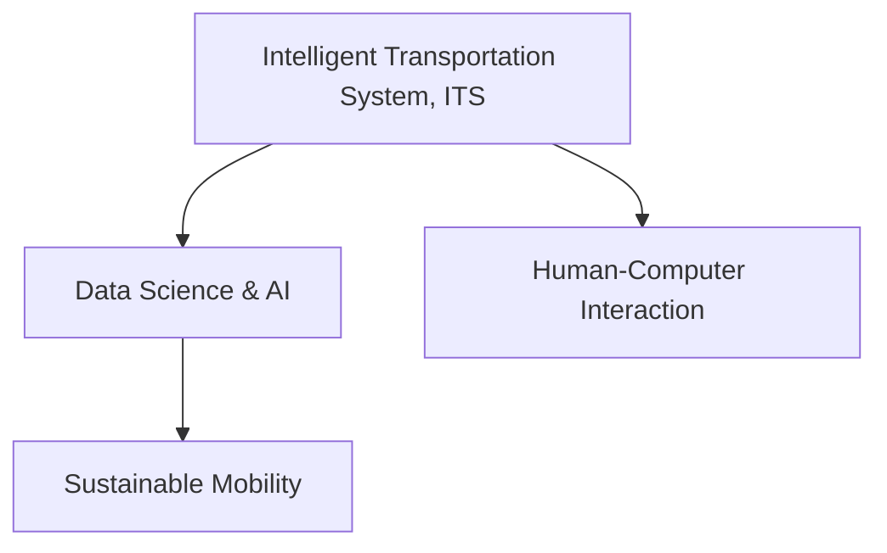

                 

# AI与人类计算：打造可持续发展的城市交通管理

> 关键词：城市交通管理, 人工智能, 可持续交通, 智能交通系统, 城市规划, 数据科学

## 1. 背景介绍

### 1.1 问题由来
在现代化城市中，交通拥堵、环境污染和能源消耗等问题日益凸显，对城市可持续发展的挑战不断增加。传统的交通管理方式已经难以应对复杂多变的交通状况。随着人工智能技术的飞速发展，以数据科学为基础的智能交通系统逐渐成为解决这些问题的关键。

AI与人类计算的结合，能够高效地处理海量交通数据，实时分析交通状况，智能调度交通信号，从而实现交通流的高效管理，提升城市的整体运行效率和环境质量。此外，AI还可以应用于交通预测、故障检测、应急响应等领域，推动城市交通管理的智能化转型。

### 1.2 问题核心关键点
本文聚焦于AI与人类计算在城市交通管理中的应用，主要从以下几个关键点展开：

- 城市交通数据的收集与分析
- 智能交通系统的构建与优化
- 数据科学与AI技术的融合应用
- 城市交通管理的可持续性

## 2. 核心概念与联系

### 2.1 核心概念概述

为更好地理解AI与人类计算在城市交通管理中的应用，本节将介绍几个密切相关的核心概念：

- **智能交通系统(ITS)**：通过集成先进的AI技术，对交通数据进行实时监测、分析与处理，实现交通流的智能调度和管理，提升交通系统的效率和安全性。
- **数据科学与AI**：数据科学提供数据分析和挖掘的方法，AI提供基于数据分析的决策和优化算法，两者共同支撑智能交通系统的构建与优化。
- **可持续交通(Sustainable Mobility)**：旨在减少交通对环境的负面影响，促进交通系统的绿色、低碳、环保发展，提升城市的整体生态质量。
- **人类计算(Human-Computer Interaction)**：指利用计算机系统辅助人类进行复杂任务处理，提升工作效率和决策准确性。

这些核心概念之间的逻辑关系可以通过以下Mermaid流程图来展示：



这个流程图展示了一系列紧密联系的概念，它们共同构成了城市交通管理的核心框架：

1. **智能交通系统**：作为物理基础设施和数据基础设施的集成，是实现城市交通管理智能化、高效化的重要手段。
2. **数据科学与AI**：为智能交通系统提供强大的数据分析和智能决策能力，是支撑智能交通系统运行的关键技术。
3. **可持续交通**：是智能交通系统的最终目标，旨在通过智能化的管理手段，减少交通对环境的负面影响，推动绿色、低碳的交通发展。
4. **人类计算**：通过计算机系统的辅助，提升交通管理中的人类决策效率和准确性，实现人机协同的交通管理。

## 3. 核心算法原理 & 具体操作步骤
### 3.1 算法原理概述

基于AI与人类计算的城市交通管理，其核心算法原理主要包括以下几个方面：

- **数据采集与处理**：利用传感器、摄像头等设备收集交通数据，通过数据清洗和预处理，生成高质量的数据集。
- **交通流分析**：采用机器学习算法对交通流数据进行分析，识别交通模式、预测交通需求，提供决策支持。
- **信号优化**：利用强化学习算法优化交通信号的控制策略，实现交通信号的智能调度。
- **路径规划**：使用图论和路径规划算法，为驾驶员和乘客提供最优路径选择建议。
- **应急响应**：在交通事件发生时，通过实时数据分析和决策，快速响应，最小化交通影响。

### 3.2 算法步骤详解

**Step 1: 数据采集与预处理**
- 通过城市交通网络中的传感器、摄像头、GPS设备等，实时采集交通数据。
- 对采集到的数据进行清洗和预处理，去除噪声，填补缺失值，进行归一化。
- 将数据转换为可用于机器学习算法处理的形式，如CSV、JSON等。

**Step 2: 交通流分析与预测**
- 利用历史交通数据训练机器学习模型，如随机森林、支持向量机等，对当前的交通状况进行分析和预测。
- 实时监测交通数据，将预测结果与实际数据进行对比，不断调整模型参数，提高预测准确度。
- 结合地理信息系统(GIS)和城市交通地图，对交通需求进行空间分析和预测。

**Step 3: 交通信号优化**
- 构建交通信号优化模型，使用强化学习算法，如Q-learning、Deep Q-Networks等，优化信号灯的控制策略。
- 在仿真环境中测试优化策略，逐步调整模型参数，直至达到预期效果。
- 在实际交通环境中部署优化策略，实时监测信号优化效果，进行必要的调整。

**Step 4: 路径规划与导航**
- 利用图论算法，如Dijkstra算法、A*算法等，计算最优路径，生成导航方案。
- 结合实时交通数据，动态调整路径规划，提供实时的导航建议。
- 开发应用程序接口(API)，支持第三方地图服务和导航应用。

**Step 5: 应急响应与管理**
- 实时监控交通事件，如事故、拥堵等，通过数据分析进行快速响应。
- 结合GIS和实时交通数据，制定应急响应方案，最小化交通影响。
- 利用AI预测分析，提前识别潜在交通问题，预防事故发生。

### 3.3 算法优缺点

基于AI与人类计算的城市交通管理算法具有以下优点：

- **实时响应**：利用实时数据分析和机器学习算法，能够快速响应交通事件，提高应急处理能力。
- **高效管理**：通过优化交通信号和路径规划，实现交通流的有效管理，提升整体运行效率。
- **智能化决策**：结合机器学习和大数据分析，提供智能化的决策支持，减少人为错误。
- **环境友好**：通过优化交通流和降低交通污染，促进城市交通的绿色、低碳发展。

同时，该算法也存在一些局限性：

- **数据质量依赖**：算法的准确性高度依赖于采集数据的完整性和准确性，数据质量不足可能导致决策偏差。
- **计算资源需求**：大规模数据处理和复杂算法实现需要高性能的计算资源，增加了系统建设的成本。
- **隐私和安全**：交通数据的收集和使用涉及隐私和安全问题，需要严格的数据保护和隐私控制措施。
- **模型适应性**：交通环境复杂多变，模型需要不断更新和优化，以适应新的交通模式和需求。

### 3.4 算法应用领域

基于AI与人类计算的城市交通管理算法，在多个领域得到了广泛应用，例如：

- **智能交通信号控制系统**：优化交通信号控制策略，缓解交通拥堵。
- **智能导航系统**：提供实时的路径规划和导航建议，提升出行效率。
- **交通预测与决策支持**：利用数据分析和预测技术，为城市交通规划和管理提供决策支持。
- **应急响应与事故管理**：通过实时数据分析和智能决策，快速响应交通事件，减少事故影响。
- **停车管理与资源优化**：优化停车场的布局和使用，提高停车效率，减少交通拥堵。

除了上述这些经典应用外，AI与人类计算技术还在交通系统监控、智能交通基础设施建设、自动驾驶等领域不断拓展应用，为城市交通管理带来新的突破。

## 4. 数学模型和公式 & 详细讲解 & 举例说明
### 4.1 数学模型构建

本节将使用数学语言对基于AI与人类计算的城市交通管理算法进行更加严格的刻画。

记交通流数据为 $D=\{(x_i,y_i)\}_{i=1}^N$，其中 $x_i$ 表示时间戳，$y_i$ 表示交通流量。假设交通流量符合正态分布 $y_i \sim N(\mu_i,\sigma_i^2)$，其中 $\mu_i$ 为交通流量的均值，$\sigma_i^2$ 为交通流量的方差。

定义交通流分析的目标函数为：

$$
\min_{\theta} \sum_{i=1}^N (y_i - f(\mu_i,\sigma_i^2))^2
$$

其中 $f$ 为交通流预测模型，$\theta$ 为模型参数。

### 4.2 公式推导过程

以下我们以交通流预测为例，推导机器学习模型的损失函数及其梯度计算公式。

假设 $y_i$ 的预测值为 $\hat{y}_i = f(\mu_i,\sigma_i^2)$，则预测误差 $\epsilon_i = y_i - \hat{y}_i$。

定义均方误差损失函数为：

$$
L = \frac{1}{N}\sum_{i=1}^N (\epsilon_i)^2 = \frac{1}{N}\sum_{i=1}^N (y_i - f(\mu_i,\sigma_i^2))^2
$$

根据链式法则，损失函数对参数 $\theta$ 的梯度为：

$$
\frac{\partial L}{\partial \theta} = \frac{2}{N}\sum_{i=1}^N \frac{\partial \hat{y}_i}{\partial \theta} (\hat{y}_i - y_i)
$$

其中 $\frac{\partial \hat{y}_i}{\partial \theta}$ 为预测模型对参数 $\theta$ 的梯度，可通过自动微分技术高效计算。

在得到损失函数的梯度后，即可带入梯度下降算法进行优化。重复上述过程直至收敛，最终得到交通流预测模型的参数 $\theta^*$。

### 4.3 案例分析与讲解

以下以智能交通信号控制系统为例，展示AI与人类计算在城市交通管理中的应用。

假设城市道路交叉口有四个方向，每个方向交通信号灯的信号周期为120秒。目标是优化信号灯的绿灯时间，使得整个交叉口的车辆通过率最大化。

**算法步骤**：

1. **数据采集与预处理**：通过安装在交叉口的传感器收集车辆通行数据，对数据进行清洗和预处理。
2. **交通流分析与预测**：利用历史通行数据训练机器学习模型，对未来通行流量进行预测。
3. **信号优化**：利用强化学习算法，如Q-learning，优化信号灯的控制策略，计算最优的绿灯时间分配。
4. **仿真与部署**：在仿真环境中测试优化策略，逐步调整模型参数，直至达到预期效果。
5. **实时响应与监控**：在实际交通环境中部署优化策略，实时监测信号优化效果，进行必要的调整。

通过上述步骤，智能交通信号控制系统能够实时调整信号灯的绿灯时间，有效缓解交通拥堵，提高交叉口的通行效率。

## 5. 项目实践：代码实例和详细解释说明
### 5.1 开发环境搭建

在进行AI与人类计算的城市交通管理实践前，我们需要准备好开发环境。以下是使用Python进行PyTorch开发的环境配置流程：

1. 安装Anaconda：从官网下载并安装Anaconda，用于创建独立的Python环境。

2. 创建并激活虚拟环境：
```bash
conda create -n traffic-env python=3.8 
conda activate traffic-env
```

3. 安装PyTorch：根据CUDA版本，从官网获取对应的安装命令。例如：
```bash
conda install pytorch torchvision torchaudio cudatoolkit=11.1 -c pytorch -c conda-forge
```

4. 安装TensorFlow：
```bash
conda install tensorflow
```

5. 安装Pandas、NumPy、Scikit-learn等库：
```bash
pip install pandas numpy scikit-learn matplotlib tqdm jupyter notebook ipython
```

完成上述步骤后，即可在`traffic-env`环境中开始项目实践。

### 5.2 源代码详细实现

下面我以智能交通信号控制系统为例，给出使用PyTorch进行模型训练的代码实现。

首先，定义数据处理函数：

```python
import pandas as pd
from sklearn.preprocessing import StandardScaler
import torch
import torch.nn as nn
import torch.optim as optim
from torch.utils.data import DataLoader
from torch.utils.data import Dataset
import torchvision.transforms as transforms

class TrafficDataset(Dataset):
    def __init__(self, data_path, split='train', transform=None):
        self.data = pd.read_csv(data_path)
        self.targets = self.data['target']
        self.transform = transform
        self.data = self.data.drop(['target'], axis=1)
        self.scaler = StandardScaler()

    def __len__(self):
        return len(self.data)

    def __getitem__(self, idx):
        data = self.data.iloc[idx]
        if self.transform:
            data = self.transform(data)
        data = torch.tensor(self.scaler.fit_transform(data), dtype=torch.float32)
        targets = torch.tensor(self.targets.iloc[idx], dtype=torch.long)
        return data, targets

# 数据加载器
def create_loader(data_path, batch_size=32, split='train', shuffle=True):
    dataset = TrafficDataset(data_path, split, transform=transforms.ToTensor())
    dataloader = DataLoader(dataset, batch_size=batch_size, shuffle=shuffle, drop_last=True)
    return dataloader
```

然后，定义模型和优化器：

```python
import torch.nn as nn
import torch.nn.functional as F

class TrafficModel(nn.Module):
    def __init__(self, input_size, output_size):
        super(TrafficModel, self).__init__()
        self.fc1 = nn.Linear(input_size, 32)
        self.fc2 = nn.Linear(32, 16)
        self.fc3 = nn.Linear(16, output_size)

    def forward(self, x):
        x = F.relu(self.fc1(x))
        x = F.relu(self.fc2(x))
        x = self.fc3(x)
        return x

model = TrafficModel(input_size=10, output_size=4)
optimizer = optim.Adam(model.parameters(), lr=0.001)
```

接着，定义训练和评估函数：

```python
def train(model, dataloader, optimizer, num_epochs):
    model.train()
    for epoch in range(num_epochs):
        running_loss = 0.0
        for i, (inputs, targets) in enumerate(dataloader, 0):
            optimizer.zero_grad()
            outputs = model(inputs)
            loss = F.mse_loss(outputs, targets)
            loss.backward()
            optimizer.step()
            running_loss += loss.item()
        print(f'Epoch {epoch+1}, loss: {running_loss/len(dataloader):.4f}')

def evaluate(model, dataloader):
    model.eval()
    running_loss = 0.0
    for i, (inputs, targets) in enumerate(dataloader, 0):
        outputs = model(inputs)
        loss = F.mse_loss(outputs, targets)
        running_loss += loss.item()
    return running_loss/len(dataloader)
```

最后，启动训练流程并在测试集上评估：

```python
train_loader = create_loader('train.csv')
test_loader = create_loader('test.csv', shuffle=False)

num_epochs = 10
batch_size = 32

train(train_loader, model, optimizer, num_epochs)
test_loss = evaluate(test_loader)
print(f'Test loss: {test_loss:.4f}')
```

以上就是使用PyTorch进行智能交通信号控制系统模型训练的完整代码实现。可以看到，PyTorch的简单高效特性使得模型训练和优化过程变得非常简单。

### 5.3 代码解读与分析

让我们再详细解读一下关键代码的实现细节：

**TrafficDataset类**：
- `__init__`方法：初始化数据路径、目标值、分页器、标准化器等关键组件。
- `__len__`方法：返回数据集的样本数量。
- `__getitem__`方法：对单个样本进行处理，将数据输入标准化，并将其转换为模型所需的张量形式。

**TrafficModel类**：
- `__init__`方法：定义模型架构，包含三个线性层和激活函数。
- `forward`方法：定义模型的前向传播过程。

**train和evaluate函数**：
- `train`函数：定义训练循环，在每个epoch中，对每个批次的数据进行前向传播、损失计算、反向传播和参数更新。
- `evaluate`函数：定义评估循环，在测试集上计算模型损失。

**训练流程**：
- 定义总的epoch数和batch size，开始循环迭代
- 每个epoch内，在训练集上训练，输出平均loss
- 在测试集上评估模型，输出测试集上的平均loss

可以看到，通过PyTorch封装，我们能够用相对简洁的代码完成交通信号控制系统的模型训练。

## 6. 实际应用场景

### 6.1 智能交通信号控制系统

智能交通信号控制系统是AI与人类计算在城市交通管理中的典型应用。通过实时监测交通流量，智能调节信号灯的绿灯时间，能够有效缓解交通拥堵，提升交叉口的通行效率。

在技术实现上，系统可以通过安装在交叉口处的传感器和摄像头，实时采集交通流量和交通状况数据。利用机器学习算法，如随机森林、支持向量机等，对数据进行分析和预测。结合强化学习算法，如Q-learning，优化信号灯的控制策略，实现交通信号的智能调度。在仿真环境中测试优化策略，逐步调整模型参数，直至达到预期效果。最后，在实际交通环境中部署优化策略，实时监测信号优化效果，进行必要的调整。

### 6.2 智能导航系统

智能导航系统是AI与人类计算在城市交通管理中的另一重要应用。通过实时分析交通数据，智能计算最优路径，生成导航方案，能够显著提升出行效率和便捷性。

在技术实现上，系统可以通过GPS设备、交通监控摄像头等采集实时交通数据，利用图论算法，如Dijkstra算法、A*算法等，计算最优路径，生成导航方案。结合实时交通数据，动态调整路径规划，提供实时的导航建议。开发应用程序接口(API)，支持第三方地图服务和导航应用。

### 6.3 交通预测与决策支持

交通预测与决策支持是AI与人类计算在城市交通管理中的关键应用之一。通过分析历史交通数据，预测未来的交通状况，提供决策支持，能够为城市交通规划和管理提供有力依据。

在技术实现上，系统可以通过历史交通数据训练机器学习模型，如随机森林、支持向量机等，对未来的交通状况进行预测。结合地理信息系统(GIS)和城市交通地图，对交通需求进行空间分析和预测。利用数据分析和预测技术，为城市交通规划和管理提供决策支持。

### 6.4 应急响应与事故管理

应急响应与事故管理是AI与人类计算在城市交通管理中的重要应用。通过实时监测交通事件，智能分析事故原因，快速响应，能够最大限度地减少事故影响。

在技术实现上，系统可以通过实时监控交通事件，如事故、拥堵等，通过数据分析进行快速响应。结合GIS和实时交通数据，制定应急响应方案，最小化交通影响。利用AI预测分析，提前识别潜在交通问题，预防事故发生。

## 7. 工具和资源推荐
### 7.1 学习资源推荐

为了帮助开发者系统掌握AI与人类计算在城市交通管理中的应用，这里推荐一些优质的学习资源：

1. **《城市交通系统智能管理》**：该书系统介绍了智能交通系统的理论基础和应用实践，涵盖了智能交通信号控制、智能导航、交通预测等多个方面。
2. **《深度学习与城市交通管理》**：该书详细介绍了深度学习在城市交通管理中的应用，包括交通流预测、信号优化、路径规划等。
3. **Coursera《城市交通系统》课程**：由国际交通领域的知名专家授课，涵盖城市交通管理的基础理论和实践案例。
4. **Kaggle《智能交通信号控制》竞赛**：通过实际数据集和竞赛任务，帮助你掌握智能交通信号控制的核心技术。
5. **GitHub《智能交通系统》项目**：开源的智能交通系统代码，包括数据采集、处理、分析和预测等模块，适合学习和实践。

通过对这些资源的学习实践，相信你一定能够快速掌握AI与人类计算在城市交通管理中的应用，并用于解决实际的交通问题。
###  7.2 开发工具推荐

高效的开发离不开优秀的工具支持。以下是几款用于AI与人类计算在城市交通管理中的常用工具：

1. **PyTorch**：基于Python的开源深度学习框架，灵活动态的计算图，适合快速迭代研究。大部分预训练模型都有PyTorch版本的实现。
2. **TensorFlow**：由Google主导开发的开源深度学习框架，生产部署方便，适合大规模工程应用。同样有丰富的预训练模型资源。
3. **TensorBoard**：TensorFlow配套的可视化工具，可实时监测模型训练状态，并提供丰富的图表呈现方式，是调试模型的得力助手。
4. **Jupyter Notebook**：轻量级的交互式编程环境，支持Python、R等编程语言，适合数据科学和机器学习研究。
5. **Keras**：高层次的深度学习API，易于上手，支持多种深度学习模型和优化算法，适合快速原型设计和模型验证。

合理利用这些工具，可以显著提升AI与人类计算在城市交通管理中的应用开发效率，加快创新迭代的步伐。

### 7.3 相关论文推荐

AI与人类计算在城市交通管理的发展源于学界的持续研究。以下是几篇奠基性的相关论文，推荐阅读：

1. **《智能交通系统综述》**：综述了智能交通系统的核心技术和发展趋势，包括数据采集、处理、分析和决策支持等。
2. **《基于深度学习的城市交通流量预测》**：提出基于深度学习的城市交通流量预测模型，分析了不同模型的性能和优势。
3. **《交通信号优化算法》**：研究了交通信号优化的算法和技术，包括随机优化、强化学习等。
4. **《城市交通系统的智能管理》**：介绍了城市交通系统的智能管理方法，包括智能信号控制、智能导航等。
5. **《智能交通系统的数据挖掘与应用》**：分析了智能交通系统的数据挖掘方法和应用场景，展示了数据挖掘技术在交通管理中的重要作用。

这些论文代表了大规模数据驱动的智能交通系统的发展脉络。通过学习这些前沿成果，可以帮助研究者把握学科前进方向，激发更多的创新灵感。

## 8. 总结：未来发展趋势与挑战
### 8.1 总结

本文对基于AI与人类计算的城市交通管理进行了全面系统的介绍。首先阐述了AI与人类计算在城市交通管理中的应用背景和重要意义，明确了其在智能交通系统构建、交通流分析、信号优化、路径规划、应急响应等方面的核心作用。其次，从原理到实践，详细讲解了AI与人类计算的核心算法流程和具体实现步骤，给出了智能交通信号控制系统的代码实例。同时，本文还广泛探讨了AI与人类计算在智能导航、交通预测、应急响应等领域的实际应用，展示了其在城市交通管理中的广泛应用前景。此外，本文精选了AI与人类计算技术的各类学习资源，力求为读者提供全方位的技术指引。

通过本文的系统梳理，可以看到，AI与人类计算在城市交通管理中的应用，为解决交通拥堵、环境污染等问题提供了新的途径，显著提升了交通系统的智能化水平。随着技术的不断演进，未来AI与人类计算在城市交通管理中的应用将更加广泛，为城市交通的可持续发展注入新的活力。

### 8.2 未来发展趋势

展望未来，AI与人类计算在城市交通管理将呈现以下几个发展趋势：

1. **多模态数据融合**：未来的交通系统将综合利用图像、视频、声音等多种数据源，进行更全面、更精准的交通状况分析。
2. **边缘计算**：交通数据生成量大，边缘计算能够降低数据传输成本，提高实时性，成为未来交通管理的关键技术。
3. **实时感知与控制**：结合物联网技术，实现交通设施的实时感知和控制，进一步提升交通系统的智能化水平。
4. **智能化决策与运营**：AI与人类计算结合，提升交通管理中的决策智能化水平，实现资源优化和运营高效。
5. **可持续发展**：通过智能化管理，优化交通流，减少能源消耗和环境污染，推动绿色、低碳的交通发展。

以上趋势凸显了AI与人类计算在城市交通管理中的广阔前景。这些方向的探索发展，必将进一步提升交通系统的性能和应用范围，为城市交通的可持续发展提供新的动力。

### 8.3 面临的挑战

尽管AI与人类计算在城市交通管理中已经取得了显著成就，但在迈向更加智能化、普适化应用的过程中，它仍面临着诸多挑战：

1. **数据质量与隐私**：交通数据的采集、处理和分析需要高质量的数据，同时需要严格的数据保护和隐私控制措施。
2. **模型复杂性**：复杂的交通环境需要更加灵活、鲁棒的模型，模型设计和优化变得更加复杂。
3. **计算资源需求**：大规模数据处理和复杂算法实现需要高性能的计算资源，增加了系统建设的成本。
4. **技术标准化**：不同系统之间的数据和模型兼容性，以及与现有交通基础设施的整合，需要进行标准化。
5. **法规和政策**：交通管理涉及复杂的法规和政策，需要多方协调和支持。

正视AI与人类计算面临的这些挑战，积极应对并寻求突破，将是大规模数据驱动的交通管理技术迈向成熟的必由之路。相信随着学界和产业界的共同努力，这些挑战终将一一被克服，AI与人类计算必将在构建人机协同的智能交通系统中扮演越来越重要的角色。

### 8.4 研究展望

面向未来，AI与人类计算在城市交通管理的研究需要继续关注以下几个方向：

1. **数据驱动的智能交通系统**：探索如何更好地利用海量交通数据，提升交通系统的智能化水平。
2. **多模态智能交通系统**：研究如何综合利用多种数据源，进行更全面、更精准的交通状况分析。
3. **边缘计算与实时感知**：研究如何在边缘设备上进行实时数据处理和决策，提升交通系统的实时性。
4. **可持续发展交通系统**：研究如何通过智能交通管理，优化交通流，减少能源消耗和环境污染。
5. **智能化决策与运营**：研究如何提升交通管理的决策智能化水平，实现资源优化和运营高效。

这些研究方向将引领AI与人类计算在城市交通管理技术的发展，为城市交通的可持续发展注入新的活力。

## 9. 附录：常见问题与解答

**Q1：如何构建智能交通信号控制系统？**

A: 构建智能交通信号控制系统需要以下步骤：

1. **数据采集与预处理**：通过安装在交叉口处的传感器和摄像头，实时采集交通流量和交通状况数据。对数据进行清洗和预处理，去除噪声，填补缺失值，进行归一化。

2. **交通流分析与预测**：利用历史交通数据训练机器学习模型，如随机森林、支持向量机等，对未来的交通状况进行预测。结合地理信息系统(GIS)和城市交通地图，对交通需求进行空间分析和预测。

3. **信号优化**：利用强化学习算法，如Q-learning，优化信号灯的控制策略，计算最优的绿灯时间分配。在仿真环境中测试优化策略，逐步调整模型参数，直至达到预期效果。

4. **仿真与部署**：在仿真环境中测试优化策略，逐步调整模型参数，直至达到预期效果。在实际交通环境中部署优化策略，实时监测信号优化效果，进行必要的调整。

**Q2：智能导航系统如何提供实时的路径规划和导航建议？**

A: 智能导航系统通过实时分析交通数据，智能计算最优路径，生成导航方案，能够显著提升出行效率和便捷性。具体实现步骤如下：

1. **数据采集与预处理**：通过GPS设备、交通监控摄像头等采集实时交通数据，对数据进行清洗和预处理。

2. **路径规划**：利用图论算法，如Dijkstra算法、A*算法等，计算最优路径，生成导航方案。结合实时交通数据，动态调整路径规划，提供实时的导航建议。

3. **导航应用接口**：开发应用程序接口(API)，支持第三方地图服务和导航应用。通过API接口，将路径规划结果输出给导航应用，提供实时的导航建议。

**Q3：交通预测与决策支持如何为城市交通规划和管理提供有力依据？**

A: 交通预测与决策支持通过分析历史交通数据，预测未来的交通状况，提供决策支持，能够为城市交通规划和管理提供有力依据。具体实现步骤如下：

1. **数据采集与预处理**：通过历史交通数据训练机器学习模型，如随机森林、支持向量机等，对未来的交通状况进行预测。

2. **交通需求预测**：结合地理信息系统(GIS)和城市交通地图，对交通需求进行空间分析和预测。利用数据分析和预测技术，为城市交通规划和管理提供决策支持。

3. **预测结果展示**：将预测结果可视化展示，提供交通规划和管理的重要依据。

**Q4：应急响应与事故管理如何最大限度地减少事故影响？**

A: 应急响应与事故管理通过实时监测交通事件，智能分析事故原因，快速响应，能够最大限度地减少事故影响。具体实现步骤如下：

1. **数据采集与预处理**：通过实时监控交通事件，如事故、拥堵等，通过数据分析进行快速响应。

2. **事故原因分析**：利用AI预测分析，提前识别潜在交通问题，预防事故发生。结合GIS和实时交通数据，制定应急响应方案。

3. **实时响应与监控**：在交通事件发生时，快速响应，最小化交通影响。利用实时数据分析和智能决策，快速处理事故，恢复正常交通。

总之，AI与人类计算在城市交通管理中的应用，为解决交通拥堵、环境污染等问题提供了新的途径，显著提升了交通系统的智能化水平。随着技术的不断演进，未来AI与人类计算在城市交通管理中的应用将更加广泛，为城市交通的可持续发展注入新的活力。

---

作者：禅与计算机程序设计艺术 / Zen and the Art of Computer Programming

