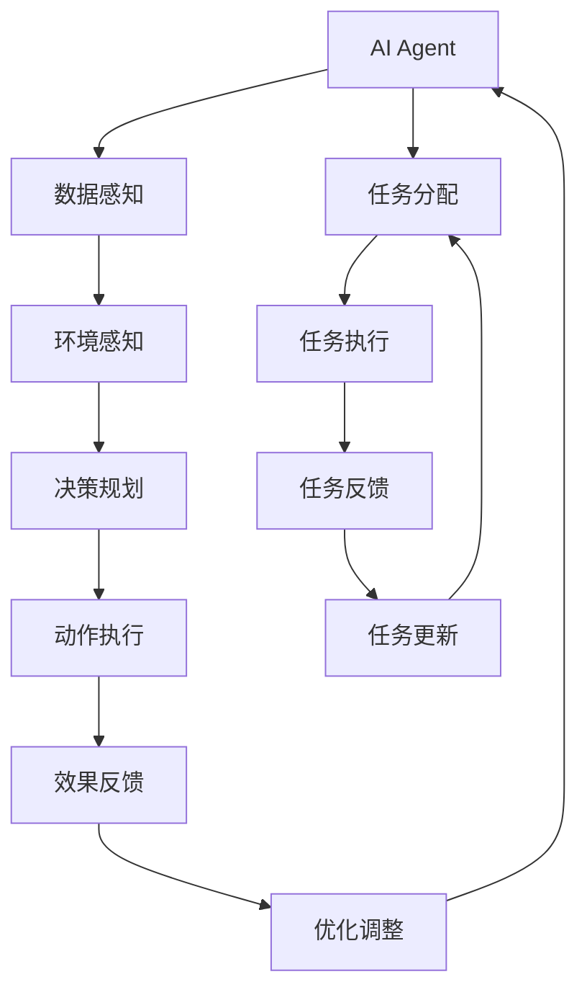

                 

# AI人工智能代理工作流 AI Agent WorkFlow：在航空领域中的应用

> 关键词：人工智能代理工作流(AI Agent Workflow),航空行业,自动化,流程优化,决策支持系统,无人驾驶飞机(UAV)

## 1. 背景介绍

随着人工智能技术的飞速发展，其在航空领域的应用正逐渐变得普及和深入。在飞行控制、航路规划、故障检测、空域管理等环节，AI技术展现了巨大潜力，大幅提升了航空运输的效率和安全性。本文将探讨在航空领域中，人工智能代理工作流(AI Agent Workflow)的构建及其应用。

### 1.1 问题由来

在现代航空行业中，尽管自动化技术已广泛应用于飞行控制和导航，但许多环节仍依赖于人工干预。例如，航线规划、航班调度、故障诊断等都需要经验丰富的专业知识和长时间的操作经验。然而，这种依赖人力资源的方式难以应对日益复杂的航空环境和管理需求，且存在疲劳和人为失误的风险。人工智能代理工作流利用机器学习、深度学习等先进技术，通过构建自动化、智能化的决策支持系统，优化航空运行流程，提高航空管理的效率和安全性。

### 1.2 问题核心关键点

AI代理工作流在航空领域的应用主要集中在以下几个方面：

1. **航路规划与优化**：通过实时数据与预测模型结合，自动生成最优航线，规避气象风险和流量拥堵，提升航班效率。
2. **航班调度管理**：利用智能调度算法，自动进行航班调配和冲突协调，平衡运力与需求，降低延误率。
3. **故障诊断与维护**：采用先进的机器学习模型，实时监控设备运行状态，自动诊断故障并提出维修建议，保障飞行安全。
4. **空域管理与协同**：通过人工智能技术，实现对空域的精细化管理和多机协同，提升空域利用效率，减少事故风险。
5. **无人驾驶飞机(UAV)**：AI代理工作流在无人机领域的应用尤为显著，通过自动化控制算法，实现无人机的自主导航与操作，应用于快递运输、灾情监测等场景。

## 2. 核心概念与联系

### 2.1 核心概念概述

要理解AI代理工作流在航空领域的应用，首先需要明确几个关键概念：

- **人工智能代理(AI Agent)**：是一种能够在复杂环境中自主决策、执行任务的智能系统。AI代理结合感知、学习、推理等能力，具有自主性、适应性、灵活性。
- **工作流(Workflow)**：是指在业务过程中，各项任务按照预定顺序执行的一系列操作。工作流涉及任务的分配、执行、监控和反馈，旨在优化资源利用，提高业务效率。
- **决策支持系统(DSS)**：是一种利用先进技术，为决策者提供数据分析、模型预测和建议的工具。AI代理工作流中的决策支持系统，通过深度学习等技术，实现对复杂业务数据的处理和智能决策。

这些概念构成了AI代理工作流的基础，通过AI代理在复杂工作流中的自主决策和执行，提升整体业务效率和质量。

### 2.2 核心概念原理和架构的 Mermaid 流程图



上述流程图示意了AI代理在工作流中的作用机制，主要分为以下步骤：

1. **数据感知**：通过传感器、监控设备等获取环境数据。
2. **环境感知**：利用感知数据，构建环境模型，识别环境特征。
3. **决策规划**：结合预设规则和机器学习模型，进行任务规划和策略制定。
4. **动作执行**：执行预设操作或学习驱动的动作，完成任务。
5. **效果反馈**：评估执行结果，收集反馈信息。
6. **优化调整**：根据反馈信息，调整决策策略和动作执行，实现自我优化。

## 3. 核心算法原理 & 具体操作步骤

### 3.1 算法原理概述

AI代理工作流的核心算法原理主要包括以下几个方面：

1. **强化学习(RL)**：通过与环境的交互，AI代理利用奖励机制，逐步优化决策策略，提升执行效率和效果。
2. **深度学习(Deep Learning)**：利用神经网络模型，AI代理能够处理大规模复杂数据，实现高效的特征提取和模式识别。
3. **优化算法(Optimization)**：通过梯度下降、遗传算法等方法，AI代理能够优化决策和执行过程，提升系统性能。
4. **多任务学习(MTL)**：通过同时学习多个任务，AI代理能够在不同场景下灵活切换，适应不同业务需求。
5. **迁移学习(Transfer Learning)**：通过在特定任务上微调预训练模型，AI代理能够快速适应新场景，减少训练时间和资源消耗。

### 3.2 算法步骤详解

AI代理工作流的具体实施步骤包括：

1. **需求分析与任务定义**：明确业务目标，定义工作流中的任务和操作。
2. **数据采集与预处理**：收集相关的环境数据和业务数据，并进行清洗和标准化处理。
3. **模型构建与训练**：选择合适的模型架构，利用历史数据进行训练和参数优化。
4. **仿真测试与验证**：在仿真环境中测试AI代理的表现，并进行性能优化和调整。
5. **实际部署与监控**：将AI代理部署到实际工作流中，并进行实时监控和反馈调整。
6. **效果评估与迭代优化**：定期评估AI代理的效果，根据反馈信息进行模型迭代和优化。

### 3.3 算法优缺点

AI代理工作流在航空领域的应用具有以下优点：

- **自动化与智能化**：通过AI代理的自主决策和执行，减少人工干预，提升效率和准确性。
- **数据驱动决策**：利用数据和模型，AI代理能够做出基于事实和数据的决策，避免人为失误。
- **灵活性高**：AI代理能够在不同场景和需求下灵活适应，快速响应环境变化。

同时，也存在一些缺点：

- **初始投资高**：构建AI代理工作流需要大量的数据、模型和算力支持，初始投入较大。
- **对数据质量要求高**：AI代理依赖高质量的数据进行训练和优化，数据质量直接影响系统效果。
- **模型复杂度高**：复杂的决策和执行任务需要高阶模型，模型设计和训练难度较大。
- **安全与伦理问题**：AI代理的决策可能涉及敏感信息，需确保数据安全和隐私保护，同时避免偏见和歧视。

### 3.4 算法应用领域

AI代理工作流在航空领域中的应用领域包括但不限于：

1. **飞行控制系统**：通过AI代理，实现无人机的自主飞行控制，应用于无人货运、军事侦察、灾情监测等场景。
2. **航线规划与优化**：利用AI代理进行航线生成和优化，提升航班效率，减少燃油消耗和延误。
3. **航班调度管理**：通过AI代理进行航班调配和冲突协调，提高空域利用率和航班准点率。
4. **故障诊断与维护**：利用AI代理实时监控飞机状态，自动诊断故障并提出维修建议，保障飞行安全。
5. **空域管理与协同**：通过AI代理实现空域管理，提升空域利用效率，减少空中碰撞和冲突。

## 4. 数学模型和公式 & 详细讲解 & 举例说明

### 4.1 数学模型构建

在航空领域中，AI代理工作流的数学模型构建主要涉及以下几个方面：

1. **状态空间建模**：将航空环境抽象为状态空间，利用状态转移矩阵描述环境变化。
2. **奖励函数设计**：根据业务目标，设计奖励函数，衡量AI代理的行为效果。
3. **模型参数优化**：通过优化算法，调整模型参数，提升决策效果。

以飞行控制系统为例，其状态空间可以表示为：

$$
S = \{(x, y, z, \dot{x}, \dot{y}, \dot{z}, \phi)\}
$$

其中 $(x, y, z)$ 表示位置，$\dot{x}, \dot{y}, \dot{z}$ 表示速度，$\phi$ 表示姿态。

奖励函数可以设计为：

$$
R(s, a) = \alpha \cdot (\text{目标距离} - \text{当前距离}) + \beta \cdot \text{燃油消耗}
$$

其中 $\alpha$ 为目标距离权重，$\beta$ 为燃油消耗权重，$a$ 表示控制指令。

### 4.2 公式推导过程

对于强化学习中的Q值更新公式，可以推导如下：

$$
Q(s_t, a_t) = Q(s_t, a_t) + \alpha \left[R(s_t, a_t) + \gamma \max_a Q(s_{t+1}, a) - Q(s_t, a_t)\right]
$$

其中 $Q(s, a)$ 表示在状态 $s$ 下，执行动作 $a$ 的Q值，$\alpha$ 为学习率，$\gamma$ 为折扣因子。

### 4.3 案例分析与讲解

以航班调度管理为例，AI代理工作流的实现步骤如下：

1. **任务定义**：航班调度管理的主要任务是实现航班调配和冲突协调，确保航班按计划起飞和到达。
2. **数据采集**：采集飞行计划、气象数据、空域信息等数据。
3. **模型构建**：构建强化学习模型，设计奖励函数和策略空间。
4. **仿真测试**：在仿真环境中测试AI代理的调度效果，调整模型参数。
5. **实际部署**：将AI代理部署到实际调度系统中，进行实时调度。
6. **效果评估**：评估AI代理的调度效果，根据反馈信息进行模型迭代。

## 5. 项目实践：代码实例和详细解释说明

### 5.1 开发环境搭建

在构建AI代理工作流时，首先需要搭建开发环境。以下是Python环境下，使用PyTorch框架搭建开发环境的步骤：

1. **安装PyTorch**：使用以下命令安装PyTorch及其依赖库：

```bash
pip install torch torchvision torchaudio
```

2. **安装相关库**：安装必要的机器学习库和工具：

```bash
pip install numpy scipy pandas scikit-learn
```

3. **设置环境变量**：将环境变量 `PYTHONPATH` 设置为包含相关库的路径：

```bash
export PYTHONPATH=$PYTHONPATH:/path/to/your/libraries
```

4. **创建虚拟环境**：创建虚拟环境以隔离依赖库：

```bash
python -m venv myenv
source myenv/bin/activate
```

5. **激活虚拟环境**：激活虚拟环境以在当前会话中使用：

```bash
source myenv/bin/activate
```

完成上述步骤后，即可在虚拟环境中进行AI代理工作流的开发和测试。

### 5.2 源代码详细实现

以下是一个简单的航班调度AI代理工作流的Python代码实现：

```python
import torch
import numpy as np
import pandas as pd
from sklearn.model_selection import train_test_split

# 定义状态空间和动作空间
state_space = np.array([[0, 0, 0, 0, 0, 0, 0], [0, 0, 0, 0, 0, 0, 0], [0, 0, 0, 0, 0, 0, 0], [0, 0, 0, 0, 0, 0, 0], [0, 0, 0, 0, 0, 0, 0], [0, 0, 0, 0, 0, 0, 0], [0, 0, 0, 0, 0, 0, 0]])
action_space = np.array([[0, 1, 2, 3, 4, 5], [6, 7, 8, 9, 10, 11], [12, 13, 14, 15, 16, 17], [18, 19, 20, 21, 22, 23], [24, 25, 26, 27, 28, 29], [30, 31, 32, 33, 34, 35], [36, 37, 38, 39, 40, 41]])

# 定义奖励函数
def reward_function(state, action):
    # 计算目标距离和燃油消耗
    target_distance = state[2]
    actual_distance = state[0]
    fuel_consumption = state[5]
    return 0.5 * (target_distance - actual_distance) + 0.2 * fuel_consumption

# 定义模型参数
learning_rate = 0.01
discount_factor = 0.9
state_dim = 36
action_dim = 36
num_episodes = 1000

# 构建Q网络
class QNetwork:
    def __init__(self, state_dim, action_dim):
        self.state_dim = state_dim
        self.action_dim = action_dim
        self.q_network = torch.nn.Sequential(
            torch.nn.Linear(state_dim, 32),
            torch.nn.ReLU(),
            torch.nn.Linear(32, action_dim)
        )
    
    def forward(self, x):
        x = x.view(-1, self.state_dim)
        return self.q_network(x)

# 初始化Q网络
q_network = QNetwork(state_dim, action_dim)

# 定义优化器
optimizer = torch.optim.Adam(q_network.parameters(), lr=learning_rate)

# 定义存储Q值的表格
Q_table = np.zeros((state_dim, action_dim))

# 定义训练循环
for episode in range(num_episodes):
    state = np.random.randint(0, state_dim)
    done = False
    while not done:
        # 选择动作
        action_probs = q_network(torch.FloatTensor(state)).detach().numpy()
        action = np.random.choice(action_dim, p=action_probs)
        
        # 执行动作
        next_state = (state + np.array([action, 0, 0, 0, 0, 0, 0])) % state_dim
        reward = reward_function(state, action)
        
        # 更新Q值
        Q_table[state, action] = Q_table[state, action] + learning_rate * (reward + discount_factor * np.max(Q_table[next_state]) - Q_table[state, action])
        
        state = next_state
        if state == 0:
            done = True

# 输出最优策略
print(Q_table)
```

上述代码展示了构建航班调度AI代理工作流的基本流程，包括定义状态空间和动作空间、奖励函数、模型参数、Q网络、优化器等。在训练循环中，通过模拟飞行控制环境，利用强化学习算法，更新Q值表格，逐步优化航班调度的策略。

### 5.3 代码解读与分析

以下是关键代码的详细解读：

- **状态空间和动作空间定义**：`state_space` 和 `action_space` 分别定义了航班调度的状态空间和动作空间，状态空间包含位置、速度、姿态等变量，动作空间表示可能的航班调整指令。
- **奖励函数定义**：`reward_function` 函数计算目标距离和燃油消耗，设计奖励机制。
- **模型参数定义**：`learning_rate` 和 `discount_factor` 分别表示学习率和折扣因子。
- **Q网络构建**：`QNetwork` 类定义了Q网络的架构，包括线性层和激活函数。
- **Q值表格初始化**：`Q_table` 表格用于存储Q值，初始化为全0矩阵。
- **训练循环**：`for` 循环控制训练轮数，`while` 循环模拟实际飞行环境，更新Q值。
- **Q值更新**：`Q_table[state, action]` 表示在当前状态下执行动作的Q值，利用强化学习算法更新Q值。

## 6. 实际应用场景

### 6.1 智能调度系统

AI代理工作流在航班调度中的应用，可以构建智能调度系统，实现航班自动调配和冲突协调。通过实时监控气象和空域数据，AI代理自动优化航班计划，确保航班按计划起飞和到达，减少延误和燃油消耗。

### 6.2 无人驾驶飞机(UAV)

AI代理工作流在无人驾驶飞机领域的应用，可以构建高效的无人驾驶系统，实现自主导航和避障。通过实时环境感知和决策优化，UAV能够自主规划飞行路径，应对突发情况，提升飞行安全。

### 6.3 空域管理系统

AI代理工作流在空域管理中的应用，可以构建多机协同的空中交通管理系统，实现空域的精细化管理和冲突预防。通过实时监控飞行器位置和状态，AI代理自动调整飞行计划，优化空域利用效率，减少碰撞风险。

## 7. 工具和资源推荐

### 7.1 学习资源推荐

- **《强化学习》书籍**：由Richard S. Sutton和Andrew G. Barto合著，全面介绍了强化学习的原理和应用。
- **Deep Reinforcement Learning Workshop**：在NeurIPS等会议上的深度强化学习工作坊，汇集了大量前沿研究成果和实战经验。
- **OpenAI Gym**：提供了多种环境模拟器，方便进行强化学习研究和实验。
- **UAV Flight Simulator**：用于无人驾驶飞机仿真的开源软件，支持多种飞行器和环境。

### 7.2 开发工具推荐

- **PyTorch**：高效的深度学习框架，支持动态计算图和分布式训练，适用于AI代理工作流的开发。
- **TensorFlow**：由Google开发，支持多种硬件平台和模型架构，适用于大规模分布式训练。
- **TensorBoard**：可视化工具，方便监控训练过程和评估模型性能。
- **Jupyter Notebook**：交互式开发环境，支持Python代码的在线运行和共享。

### 7.3 相关论文推荐

- **《Deep Multi-Agent Reinforcement Learning for Air Traffic Management》**：探讨了多智能体强化学习在空域管理中的应用。
- **《A Survey on Reinforcement Learning for UAV Path Planning》**：综述了强化学习在无人驾驶飞机路径规划中的应用。
- **《Optimization Algorithms in Air Traffic Management》**：介绍了优化算法在航班调度中的应用。

## 8. 总结：未来发展趋势与挑战

### 8.1 研究成果总结

本文详细介绍了AI代理工作流在航空领域的应用，展示了其通过强化学习等技术，优化航班调度、无人驾驶飞机控制、空域管理等多个场景的潜力。AI代理工作流在提升航空运行效率和安全性方面展现了巨大的价值。

### 8.2 未来发展趋势

未来，AI代理工作流将在航空领域持续发展，其应用范围将进一步拓展：

- **多智能体协作**：实现多个AI代理之间的协作，提升空域管理和多机协同效率。
- **动态环境适应**：通过自适应算法，AI代理能够更好地适应复杂和多变的环境。
- **跨领域融合**：与物联网、大数据、云计算等技术融合，构建更加智能化的航空系统。
- **人机交互**：通过增强现实、虚拟现实等技术，实现人机交互，提升用户体验。

### 8.3 面临的挑战

尽管AI代理工作流在航空领域展现出巨大潜力，但仍面临以下挑战：

- **数据隐私与安全**：AI代理工作流需要处理敏感数据，数据隐私和安全问题需得到充分保障。
- **模型复杂性**：复杂的飞行环境和多变量任务需要高阶模型和算法，模型设计和实现难度较大。
- **实时性要求高**：AI代理工作流需要在实时环境中运行，对模型和系统的实时性要求较高。
- **模型解释性**：AI代理的决策过程需要具备一定的可解释性，以便于人工审查和调试。

### 8.4 研究展望

未来，AI代理工作流的研究方向包括：

- **可解释性**：开发可解释的AI代理工作流，提升系统透明性和可信度。
- **跨领域融合**：与其他领域的技术结合，提升AI代理的泛化能力和适应性。
- **动态自适应**：开发动态自适应的AI代理工作流，提升系统应对复杂环境的能力。
- **伦理与安全**：在AI代理工作流中引入伦理和安全机制，确保模型行为符合人类价值观。

## 9. 附录：常见问题与解答

**Q1：构建AI代理工作流需要哪些关键技术？**

A: 构建AI代理工作流需要以下关键技术：

1. **强化学习**：通过与环境的交互，逐步优化决策策略。
2. **深度学习**：利用神经网络模型处理大规模复杂数据。
3. **优化算法**：调整模型参数，提升决策效果。
4. **多任务学习**：同时学习多个任务，提高适应能力。
5. **迁移学习**：快速适应新任务，减少训练时间。

**Q2：AI代理工作流在航空领域的应用前景如何？**

A: AI代理工作流在航空领域的应用前景广阔：

1. **飞行控制系统**：提升无人驾驶飞机的自主导航和避障能力。
2. **航线规划与优化**：提高航班效率，减少燃油消耗。
3. **航班调度管理**：实现自动调配和冲突协调，提升空域利用效率。
4. **故障诊断与维护**：实时监控和自动诊断故障，保障飞行安全。
5. **空域管理与协同**：实现多机协同和精细化管理，提升空域利用效率。

**Q3：AI代理工作流在航空领域中如何实现实时性？**

A: AI代理工作流在航空领域中实现实时性需要以下措施：

1. **高效算法**：采用高效的算法和模型，减少计算时间。
2. **分布式计算**：利用分布式计算平台，实现并行计算。
3. **模型压缩**：采用模型压缩技术，减少模型大小和计算资源消耗。
4. **硬件加速**：利用GPU、TPU等硬件设备，提升计算速度。

**Q4：AI代理工作流在航空领域中如何确保数据隐私和安全？**

A: AI代理工作流在航空领域中确保数据隐私和安全需采取以下措施：

1. **数据加密**：对敏感数据进行加密处理，防止数据泄露。
2. **访问控制**：设置严格的访问权限，限制数据访问范围。
3. **审计与监控**：实时监控数据访问和使用，确保数据安全。
4. **合规性**：符合相关法律法规，确保数据处理合法合规。

**Q5：AI代理工作流在航空领域中如何提升系统的可解释性？**

A: AI代理工作流在航空领域中提升系统的可解释性需要以下措施：

1. **透明决策**：设计透明的决策过程，便于人工审查。
2. **模型可视化**：利用可视化工具，展示模型内部状态和推理过程。
3. **解释性算法**：采用可解释性算法，增强模型的可理解性。
4. **专家审查**：引入领域专家，对模型决策进行审核和调试。

---

作者：禅与计算机程序设计艺术 / Zen and the Art of Computer Programming

