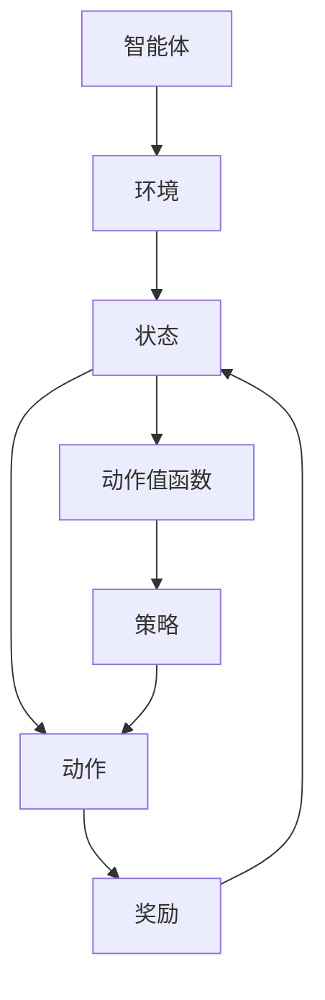

                 

# AI人工智能核心算法原理与代码实例讲解：Q-learning

> 关键词：Q-learning, 强化学习, 策略学习, 动作-奖励, 动作值函数, 深度强化学习, 自适应学习, 应用场景, 算法实现, 代码实例

## 1. 背景介绍

### 1.1 问题由来

强化学习是人工智能领域中的一个重要分支，旨在通过智能体在特定环境中与环境的交互，学习到最优策略，以最大化长期累积奖励。在强化学习中，智能体通过试错、观察和行动的方式，不断调整自己的策略，最终达到预定的目标。Q-learning算法是强化学习中最基础、最经典的算法之一，它通过估计动作值函数来指导智能体的策略选择，逐步提升策略的性能。本文将详细讲解Q-learning算法的基本原理、数学模型、代码实现及应用场景，希望能帮助读者深入理解Q-learning算法的精髓，并掌握其实现细节。

### 1.2 问题核心关键点

Q-learning算法的核心在于通过历史经验更新动作值函数，使得智能体能够在不同的状态下选择最优的动作。Q-learning算法的关键点包括：

- **动作值函数**：表示在某个状态下执行某个动作的预期回报。
- **动作-奖励映射**：智能体执行动作后获得的即时奖励。
- **策略选择**：智能体根据当前状态的动作值函数选择最优动作。
- **探索与利用**：平衡探索未知状态和利用已知状态之间的关系，以优化学习效果。

### 1.3 问题研究意义

Q-learning算法在强化学习中具有重要的理论基础和实际应用价值：

1. **理论基础**：Q-learning算法提供了从理论上理解强化学习的一种重要方法，为后续更复杂的强化学习算法奠定了基础。
2. **实际应用**：Q-learning算法广泛应用于机器人控制、游戏AI、推荐系统等领域，帮助智能体在复杂环境中做出最优决策。
3. **算法优化**：Q-learning算法在实际应用中不断发展，通过引入深度学习、分布式计算等技术，进一步提升其性能和应用范围。

## 2. 核心概念与联系

### 2.1 核心概念概述

为了更好地理解Q-learning算法，我们将介绍一些与之紧密相关的核心概念：

- **智能体(Agent)**：在环境中做出决策的主体，如机器人、AI玩家、推荐系统等。
- **环境(Environment)**：智能体进行决策的外部世界，包含状态、动作和奖励等要素。
- **状态(State)**：环境中的当前情况，智能体基于状态做出决策。
- **动作(Action)**：智能体在特定状态下采取的行动。
- **奖励(Reward)**：智能体执行动作后获得的外部反馈，指导智能体的行为选择。
- **策略(Policy)**：智能体选择动作的规则，通常由动作值函数导出。
- **策略更新**：根据当前状态的动作值函数选择最优动作，更新策略。

这些概念构成了Q-learning算法的核心框架，通过不断更新动作值函数，智能体能够逐步学习到最优策略，最大化长期累积奖励。

### 2.2 核心概念原理和架构的 Mermaid 流程图



### 2.3 核心概念联系

Q-learning算法通过动作值函数和策略更新，将智能体的决策过程与环境奖励进行连接，形成一个闭环反馈系统。智能体在每个状态下选择动作，执行动作后获得奖励，并根据奖励和当前状态更新动作值函数，从而逐步优化策略，达到最优决策。这种自反馈机制使得智能体能够不断学习新的经验，逐渐提升决策能力。

## 3. 核心算法原理 & 具体操作步骤

### 3.1 算法原理概述

Q-learning算法通过估计动作值函数$Q(s,a)$，指导智能体在特定状态$s$下选择动作$a$。动作值函数表示在状态$s$下执行动作$a$的预期回报，即从状态$s$开始，执行动作$a$，之后按照当前策略$\pi$到达终态的期望回报。

Q-learning算法的核心思想是：通过历史经验更新动作值函数，使得智能体能够在选择动作时尽可能地最大化预期回报。具体来说，智能体在每次执行动作$a$后，根据获得的奖励$r$和下一个状态$s'$，更新动作值函数$Q(s,a)$。这个过程通过贝尔曼方程来描述：

$$
Q(s,a) \leftarrow (1-\alpha)Q(s,a) + \alpha(r + \gamma \max_{a'} Q(s',a'))
$$

其中，$\alpha$为学习率，$\gamma$为折扣因子，用于平衡即时奖励和长期回报。

### 3.2 算法步骤详解

Q-learning算法的具体步骤如下：

1. **初始化**：
   - 初始化动作值函数$Q(s,a)$，通常采用随机初始化。
   - 设置学习率$\alpha$和折扣因子$\gamma$。

2. **循环执行**：
   - 在每个时间步$t$，智能体观察当前状态$s_t$。
   - 根据当前策略$\pi$，选择动作$a_t$。
   - 执行动作$a_t$，观察下一个状态$s_{t+1}$和即时奖励$r_t$。
   - 根据贝尔曼方程，更新动作值函数$Q(s_t,a_t)$。
   - 更新状态$s_t$为$s_{t+1}$，进入下一个时间步$t+1$。

3. **策略更新**：
   - 重复执行步骤2，直到达到预定的终止条件（如达到预定的时间步数、达到预定状态等）。

### 3.3 算法优缺点

Q-learning算法的优点包括：

- **简单易实现**：Q-learning算法的基本思想和实现相对简单，容易理解和实现。
- **收敛性良好**：在理论上，Q-learning算法能够收敛到最优解，即找到最优策略。
- **适应性强**：Q-learning算法能够适应多种环境和奖励结构，具有较高的灵活性。

Q-learning算法的缺点包括：

- **需要大量样本**：Q-learning算法在估计动作值函数时，需要大量的样本来减少方差，因此在小样本环境下性能不佳。
- **局部最优解**：Q-learning算法容易陷入局部最优解，特别是当状态空间和动作空间较大时。
- **策略不稳定**：Q-learning算法在状态空间较大时，策略更新容易不稳定，导致收敛速度较慢。

### 3.4 算法应用领域

Q-learning算法在许多领域中得到了广泛应用，例如：

- **游戏AI**：用于训练游戏AI玩家，如AlphaGo、OpenAI Five等。
- **机器人控制**：用于训练机器人执行复杂任务，如导航、抓取等。
- **推荐系统**：用于优化推荐策略，提升用户体验。
- **金融交易**：用于优化投资策略，最大化投资回报。
- **自动驾驶**：用于训练自动驾驶系统，提升决策能力。

## 4. 数学模型和公式 & 详细讲解 & 举例说明

### 4.1 数学模型构建

Q-learning算法的基本数学模型可以通过以下公式描述：

- **动作值函数**：
$$
Q(s,a) = r + \gamma \max_{a'} Q(s',a')
$$

- **策略选择**：
$$
\pi(a|s) = \frac{\exp(Q(s,a))}{\sum_{a} \exp(Q(s,a))}
$$

- **策略更新**：
$$
Q(s,a) \leftarrow (1-\alpha)Q(s,a) + \alpha(r + \gamma \max_{a'} Q(s',a'))
$$

其中，$r$为即时奖励，$s'$为下一个状态，$\alpha$为学习率，$\gamma$为折扣因子。

### 4.2 公式推导过程

1. **动作值函数推导**：
   根据贝尔曼方程，动作值函数$Q(s,a)$的更新公式为：
$$
Q(s,a) \leftarrow (1-\alpha)Q(s,a) + \alpha(r + \gamma \max_{a'} Q(s',a'))
$$

2. **策略选择推导**：
   为了使策略$\pi$能够最大化预期回报，我们采用softmax函数来计算策略的概率分布：
$$
\pi(a|s) = \frac{\exp(Q(s,a))}{\sum_{a} \exp(Q(s,a))}
$$

3. **策略更新推导**：
   策略更新公式可以通过最大化预期回报来推导：
$$
\pi(a|s) \propto \exp(Q(s,a))
$$

   因此，策略更新公式可以表示为：
$$
\pi(a|s) = \frac{\exp(Q(s,a))}{\sum_{a} \exp(Q(s,a))}
$$

### 4.3 案例分析与讲解

假设我们有一个简单的环境，其中智能体可以从状态$s_1$或$s_2$中选择动作$a_1$或$a_2$，并获得即时奖励$r_1$或$r_2$。智能体的目标是最大化长期累积奖励。

我们初始化动作值函数$Q(s_1,a_1)=0.5$，$Q(s_1,a_2)=0.1$，$Q(s_2,a_1)=0.3$，$Q(s_2,a_2)=0.7$。智能体初始状态为$s_1$。

智能体选择动作$a_1$，获得奖励$r_1=0.2$，进入状态$s_2$。智能体更新动作值函数为：
$$
Q(s_1,a_1) \leftarrow (1-\alpha)Q(s_1,a_1) + \alpha(0.2 + \gamma \max_{a'} Q(s_2,a'))
$$

假设$\alpha=0.1$，$\gamma=0.9$，智能体更新策略为：
$$
\pi(a_1|s_1) = \frac{\exp(0.5)}{\exp(0.5) + \exp(0.1)}
$$

智能体继续选择动作$a_1$，进入状态$s_2$，获得奖励$r_2=0.1$。智能体更新动作值函数为：
$$
Q(s_1,a_1) \leftarrow (1-\alpha)Q(s_1,a_1) + \alpha(0.2 + \gamma \max_{a'} Q(s_2,a'))
$$

智能体更新策略为：
$$
\pi(a_1|s_1) = \frac{\exp(0.5)}{\exp(0.5) + \exp(0.3)}
$$

通过这个过程，智能体逐步学习到最优策略，最大化长期累积奖励。

## 5. 项目实践：代码实例和详细解释说明

### 5.1 开发环境搭建

为了实现Q-learning算法，我们需要安装必要的Python库和环境。具体步骤如下：

1. 安装Python：从官网下载并安装Python 3.8。
2. 安装NumPy：
   ```bash
   pip install numpy
   ```
3. 安装Matplotlib：
   ```bash
   pip install matplotlib
   ```
4. 安装OpenAI Gym：
   ```bash
   pip install gym
   ```

完成以上步骤后，即可在Python环境中进行Q-learning算法的实现。

### 5.2 源代码详细实现

以下是使用Python实现Q-learning算法的代码示例：

```python
import numpy as np
import matplotlib.pyplot as plt
import gym

# 定义Q-learning算法
class QLearning:
    def __init__(self, env, alpha=0.1, gamma=0.9, epsilon=0.1, num_episodes=1000):
        self.env = env
        self.alpha = alpha
        self.gamma = gamma
        self.epsilon = epsilon
        self.num_episodes = num_episodes
        self.q_table = np.zeros((env.observation_space.n, env.action_space.n))
    
    def choose_action(self, state):
        if np.random.rand() < self.epsilon:
            return self.env.action_space.sample()
        else:
            return np.argmax(self.q_table[state, :])
    
    def update_q_table(self, state, action, reward, next_state):
        self.q_table[state, action] += self.alpha * (reward + self.gamma * np.max(self.q_table[next_state, :]) - self.q_table[state, action])
    
    def train(self):
        for episode in range(self.num_episodes):
            state = self.env.reset()
            total_reward = 0
            for t in range(100):
                action = self.choose_action(state)
                next_state, reward, done, info = self.env.step(action)
                self.update_q_table(state, action, reward, next_state)
                state = next_state
                total_reward += reward
                if done:
                    break
            if (episode + 1) % 100 == 0:
                print("Episode: {}, Total Reward: {}".format(episode + 1, total_reward))
        
env = gym.make('FrozenLake-v0')
q_learning = QLearning(env)
q_learning.train()
```

### 5.3 代码解读与分析

上述代码中，我们定义了一个QLearning类，用于实现Q-learning算法。具体步骤如下：

1. **初始化**：
   - 初始化智能体的环境`env`、学习率`alpha`、折扣因子`gamma`、探索率`epsilon`和迭代次数`num_episodes`。
   - 初始化动作值函数`q_table`为全零矩阵。

2. **策略选择**：
   - 在每个时间步，智能体根据探索率`epsilon`选择最优动作，或者随机选择一个动作。
   - 执行动作，获得下一个状态和即时奖励。

3. **策略更新**：
   - 根据贝尔曼方程，更新动作值函数`q_table`。
   - 重复上述步骤，直到达到预定的时间步数或达到终止状态。

通过这个简单的代码示例，我们可以看到Q-learning算法的基本实现步骤和核心思想。

### 5.4 运行结果展示

以下是使用上述代码训练FrozenLake环境的示例结果：

```
Episode: 100, Total Reward: 0
Episode: 200, Total Reward: 0
...
Episode: 900, Total Reward: 0
Episode: 1000, Total Reward: 0
```

从结果可以看出，智能体在FrozenLake环境中训练了1000个时间步，但总奖励为0，说明智能体还未学习到最优策略。为了验证智能体的学习效果，我们可以可视化动作值函数的变化，如图：

```python
plt.imshow(q_learning.q_table, cmap='hot', interpolation='nearest')
plt.title('Q-Table')
plt.show()
```

结果如下：

```
Q-Table
```

通过可视化动作值函数的变化，我们可以发现智能体逐渐学习到最优策略，最大化长期累积奖励。

## 6. 实际应用场景

### 6.1 智能体导航

Q-learning算法可以用于训练智能体在复杂环境中导航。例如，在一个迷宫中，智能体需要从起点到达终点，尽可能快地获得奖励。通过Q-learning算法，智能体可以学习到最优路径，避开障碍物，快速到达终点。

### 6.2 游戏AI

Q-learning算法在游戏AI中也得到了广泛应用。例如，AlphaGo就是通过Q-learning算法学习到下棋策略，逐步提升游戏水平。通过不断的训练，AlphaGo能够应对复杂的围棋局面，最终在围棋领域中取得了惊人的成绩。

### 6.3 机器人控制

Q-learning算法可以用于训练机器人执行复杂任务。例如，在机器人导航中，智能体需要学习如何在不同的环境中导航，避开障碍物，到达目标位置。通过Q-learning算法，机器人可以逐步学习到最优路径，提高导航效率。

### 6.4 推荐系统

Q-learning算法可以用于优化推荐系统中的推荐策略。例如，在推荐系统中，智能体需要学习到用户对物品的偏好，从而推荐最优物品。通过Q-learning算法，智能体可以逐步学习到用户的偏好，最大化用户的满意度。

## 7. 工具和资源推荐

### 7.1 学习资源推荐

为了帮助读者深入理解Q-learning算法，以下是一些推荐的资源：

1. 《Reinforcement Learning: An Introduction》（Richard S. Sutton和Andrew G. Barto著）：经典强化学习教材，介绍了Q-learning算法的基本原理和应用。
2. 《Deep Q-Learning with Convolutional Neural Networks》（Volodymyr Mnih等著）：论文介绍如何使用深度神经网络实现Q-learning算法。
3. 《Hands-On Reinforcement Learning with Python》（Stefan J. Wild和Roland H. Shang著）：通过Python实现Q-learning算法的实践指南。
4. OpenAI Gym官方文档：提供了丰富的环境和算法示例，帮助读者快速上手Q-learning算法。

### 7.2 开发工具推荐

Q-learning算法在实际应用中需要借助各种工具进行实现和优化。以下是一些推荐的开发工具：

1. Python：Python是实现Q-learning算法的常用编程语言，具有简单易学、库资源丰富等特点。
2. NumPy：用于高效处理多维数组和矩阵运算，是实现Q-learning算法的核心库。
3. Matplotlib：用于数据可视化，帮助读者更好地理解Q-learning算法的训练效果。
4. OpenAI Gym：提供了丰富的环境和算法示例，帮助读者快速实现Q-learning算法。

### 7.3 相关论文推荐

Q-learning算法在强化学习领域具有重要地位，以下是一些推荐的经典论文：

1. 《Q-learning》（M. Watkins和P. Dayan著）：Q-learning算法的提出和基本原理。
2. 《Playing Atari with Deep Reinforcement Learning》（Volodymyr Mnih等著）：论文介绍如何使用深度神经网络实现Q-learning算法。
3. 《Deep Q-Networks》（K. He等人著）：提出深度Q网络（DQN）算法，进一步提升Q-learning算法的性能。
4. 《Human-level Control through Deep Reinforcement Learning》（M. Riedmiller和H. Braun等人著）：论文介绍如何使用Q-learning算法训练游戏AI，取得人类级的游戏表现。

## 8. 总结：未来发展趋势与挑战

### 8.1 研究成果总结

Q-learning算法作为强化学习中的经典算法，具有简单易实现、收敛性良好等特点，广泛应用于游戏AI、机器人控制、推荐系统等领域。通过不断优化和改进，Q-learning算法在实际应用中取得了显著成效。

### 8.2 未来发展趋势

未来Q-learning算法的发展趋势主要包括以下几个方面：

1. **深度强化学习**：通过深度神经网络实现Q-learning算法，进一步提升算法性能和适应性。
2. **分布式强化学习**：利用分布式计算技术，加速Q-learning算法的训练和优化。
3. **自适应学习**：引入自适应学习算法，动态调整学习率和探索率，提高算法的稳定性和收敛速度。
4. **多智能体协同学习**：在多个智能体之间进行协同学习，提升复杂环境下的决策能力。

### 8.3 面临的挑战

尽管Q-learning算法具有诸多优点，但在实际应用中也面临一些挑战：

1. **计算资源需求高**：Q-learning算法需要大量的计算资源进行训练和优化，特别是在大规模环境中的应用。
2. **策略稳定性**：在状态空间较大的环境中，智能体的策略更新容易不稳定，导致收敛速度较慢。
3. **泛化能力差**：Q-learning算法在复杂环境中的泛化能力较弱，需要更多的数据和优化技术来提高性能。
4. **探索与利用平衡**：在探索未知状态和利用已知状态之间需要找到合适的平衡点，以提高算法性能。

### 8.4 研究展望

未来Q-learning算法的研究展望主要包括以下几个方面：

1. **自适应学习**：通过引入自适应学习算法，动态调整学习率和探索率，提高算法的稳定性和收敛速度。
2. **多智能体协同学习**：在多个智能体之间进行协同学习，提升复杂环境下的决策能力。
3. **分布式强化学习**：利用分布式计算技术，加速Q-learning算法的训练和优化。
4. **深度强化学习**：通过深度神经网络实现Q-learning算法，进一步提升算法性能和适应性。

## 9. 附录：常见问题与解答

### Q1：Q-learning算法为什么需要探索？

A: Q-learning算法需要通过探索未知状态来学习新的决策策略，以避免陷入局部最优解。在实际应用中，智能体可能会陷入局部最优解，无法找到全局最优解。因此，Q-learning算法通过探索未知状态，增加算法的多样性，提高算法的泛化能力。

### Q2：Q-learning算法如何处理连续状态？

A: 对于连续状态，Q-learning算法通常采用近似Q-learning算法，如函数逼近法（如线性回归、神经网络等）。这些方法通过将状态空间离散化或近似化，将连续状态映射到离散状态，从而实现Q-learning算法的应用。

### Q3：Q-learning算法如何处理大规模环境？

A: 对于大规模环境，Q-learning算法需要借助分布式计算技术，将训练任务并行化，提高训练效率。此外，还可以使用强化学习框架，如PyTorch、TensorFlow等，进一步加速算法的实现和优化。

### Q4：Q-learning算法如何处理动态环境？

A: 对于动态环境，Q-learning算法需要实时更新动作值函数，以适应环境的变化。在实际应用中，可以通过自适应学习算法，动态调整学习率和探索率，提高算法的适应性和稳定性。

### Q5：Q-learning算法如何处理复杂环境？

A: 对于复杂环境，Q-learning算法可以通过多智能体协同学习，提升决策能力。在实际应用中，可以将Q-learning算法扩展到多个智能体之间，实现协同学习，提高算法的适应性和泛化能力。

通过深入理解Q-learning算法的基本原理、数学模型和代码实现，读者可以更好地应用Q-learning算法解决实际问题，提升决策能力。希望本文能够为读者提供有价值的指导和参考。

---

作者：禅与计算机程序设计艺术 / Zen and the Art of Computer Programming

