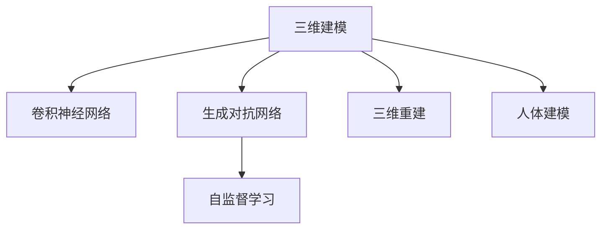

                 

# AI人工智能深度学习算法：在三维建模中的应用

> 关键词：三维建模,深度学习,神经网络,卷积神经网络(CNN),生成对抗网络(GAN),自监督学习,三维重建,人体建模

## 1. 背景介绍

### 1.1 问题由来
随着计算机视觉和深度学习技术的飞速发展，三维建模技术也在不断进步。三维建模不仅仅是电影、游戏等领域的重要工具，还被广泛应用于医疗、建筑、制造业等各个行业。通过深度学习，特别是基于神经网络的算法，可以自动地从二维图像、视频数据中恢复出高质量的三维模型。

深度学习技术在三维建模中的应用，为许多传统领域带来了革命性的变化。例如，基于深度学习的人体建模技术可以自动还原人体姿态、面容等特征，提高了医疗影像诊断的准确性；自动建筑建模可以大幅提高建筑设计效率，减少人力成本；自动三维动画建模则彻底改变了影视制作的流程。

### 1.2 问题核心关键点
深度学习算法在三维建模中的应用，主要集中在以下几个方面：
- **卷积神经网络(CNN)**：用于提取三维数据的空间特征，进行边缘检测、纹理生成等预处理。
- **生成对抗网络(GAN)**：用于生成高质量的三维模型，具有较好的表征能力和生成能力。
- **自监督学习**：利用大量无标签数据进行预训练，提升模型的泛化能力。
- **三维重建**：通过三维重建技术，将多视角图像、视频数据恢复为完整的三维模型。
- **人体建模**：从人体图像数据中自动生成逼真的人体模型。

这些关键技术构成了深度学习在三维建模领域的核心范式，推动了三维建模技术在各个领域的应用。

## 2. 核心概念与联系

### 2.1 核心概念概述

为了更好地理解深度学习算法在三维建模中的应用，本节将介绍几个密切相关的核心概念：

- **三维建模**：将二维图像或视频数据映射到三维空间，生成完整的几何模型。
- **深度学习**：基于神经网络的机器学习技术，通过多层次的特征提取和分类，实现复杂的数据处理任务。
- **卷积神经网络(CNN)**：一种专门用于图像处理的神经网络，通过卷积操作提取图像的空间特征。
- **生成对抗网络(GAN)**：一种生成模型，通过两个神经网络（生成器和判别器）之间的对抗，生成逼真的图像或视频数据。
- **自监督学习**：利用大量无标签数据进行预训练，提升模型的泛化能力。
- **三维重建**：通过多视角图像数据，自动恢复出完整的几何模型。
- **人体建模**：从人体图像数据中自动生成逼真的人体模型，常用于医疗影像、虚拟试衣等应用场景。

这些核心概念之间的逻辑关系可以通过以下Mermaid流程图来展示：



这个流程图展示了深度学习在三维建模中的关键步骤：

1. 三维建模将二维数据映射到三维空间。
2. CNN用于提取图像的空间特征。
3. GAN用于生成高质量的三维模型。
4. 自监督学习通过无标签数据进行预训练。
5. 三维重建自动恢复出完整的几何模型。
6. 人体建模从人体图像数据生成逼真模型。

这些概念共同构成了深度学习在三维建模领域的核心框架，使得深度学习算法在三维建模中的应用变得高效可行。

## 3. 核心算法原理 & 具体操作步骤
### 3.1 算法原理概述

深度学习算法在三维建模中的应用，主要是通过卷积神经网络(CNN)和生成对抗网络(GAN)等技术，实现从二维数据到三维模型的自动生成。其核心思想是：通过多层神经网络的特征提取和生成，逐步恢复出完整的几何信息，生成高质量的三维模型。

### 3.2 算法步骤详解

基于深度学习的三维建模一般包括以下几个关键步骤：

**Step 1: 准备输入数据**
- 收集二维图像或视频数据，以及相关的标注数据。例如，对于三维人体建模，需要收集人体图像、关节信息等。

**Step 2: 数据预处理**
- 对输入数据进行预处理，包括去噪、归一化、尺寸调整等。例如，使用Canny边缘检测提取图像边缘信息，或者使用几何变换校正三维模型坐标。

**Step 3: 特征提取**
- 使用卷积神经网络(CNN)进行特征提取。例如，通过多个卷积层提取图像的空间特征，通过池化层降低特征图的维度。

**Step 4: 生成三维模型**
- 使用生成对抗网络(GAN)生成逼真的三维模型。例如，通过生成器和判别器的对抗训练，生成高质量的三维图像或模型。

**Step 5: 三维重建**
- 使用三维重建技术，将多个视角图像数据恢复为完整的三维模型。例如，通过多视角几何重建技术，恢复出完整的几何结构。

**Step 6: 人体建模**
- 使用人体建模技术，从人体图像数据中自动生成逼真的人体模型。例如，通过自动人体姿态估计技术，生成完整的人体三维模型。

### 3.3 算法优缺点

基于深度学习的三维建模方法具有以下优点：
- **高自动化**：无需手动标注数据，自动从图像、视频中提取特征，生成三维模型。
- **高效性**：自动化的流程大大提高了建模速度，缩短了开发周期。
- **高精度**：通过深度学习算法的优化，生成的三维模型具有较高的精度和逼真度。

同时，该方法也存在一定的局限性：
- **数据依赖**：需要大量的标注数据，尤其是对于复杂的场景，数据获取成本较高。
- **计算复杂**：深度学习算法对计算资源要求较高，尤其是在高分辨率的三维建模中，计算量较大。
- **解释性不足**：深度学习模型的生成过程难以解释，模型决策过程缺乏可解释性。
- **模型泛化能力有限**：模型依赖特定数据集，对于新场景的泛化能力有限。

尽管存在这些局限性，但就目前而言，基于深度学习的三维建模方法仍然是大规模数据处理和复杂模型生成的主流范式。未来相关研究的重点在于如何进一步降低对标注数据的依赖，提高模型的泛化能力，同时兼顾可解释性和计算效率。

### 3.4 算法应用领域

基于深度学习的三维建模方法，在各个领域得到了广泛的应用：

- **医疗影像**：自动从医学影像中生成人体器官、血管等三维模型，帮助医生进行手术模拟和诊断。
- **建筑设计**：自动从二维设计图纸中生成三维建筑模型，提高设计效率。
- **虚拟现实**：自动从多个视角图像数据中生成逼真的三维场景，提供沉浸式的用户体验。
- **游戏制作**：自动从游戏中的屏幕截图中生成三维模型，降低游戏制作成本。
- **文化遗产保护**：自动从历史文物的二维图像中生成三维模型，保存文化遗产。
- **动画制作**：自动从多个动作帧中生成逼真的三维动画模型，提高动画制作效率。

除了上述这些经典应用外，深度学习在三维建模技术的应用场景中还有更多创新和突破，为各个行业带来了巨大的变革。

## 4. 数学模型和公式 & 详细讲解 & 举例说明

### 4.1 数学模型构建

深度学习在三维建模中的应用，主要基于卷积神经网络(CNN)和生成对抗网络(GAN)等技术。下面以三维人体建模为例，介绍模型的数学构建过程。

记三维人体建模的任务为 $T$，输入数据为 $X$，标签为 $Y$。我们假设 $X$ 为包含 $n$ 张图像的集合，每张图像的尺寸为 $h \times w$，标签 $Y$ 为 $n$ 个人体姿态的集合。

定义深度学习模型为 $M_{\theta}$，其中 $\theta$ 为模型参数。我们假设 $M_{\theta}$ 包括一个卷积神经网络(CNN)和一个生成对抗网络(GAN)，用于特征提取和生成。

### 4.2 公式推导过程

以下是深度学习在三维人体建模中的数学公式推导过程：

**卷积神经网络(CNN)**：
假设我们使用的卷积神经网络(CNN)包含多个卷积层、池化层和全连接层。卷积层的公式为：
$$
H_{i+1} = G_{i}(H_i, \omega_i)
$$
其中 $H_i$ 为第 $i$ 层的特征图，$\omega_i$ 为卷积核。池化层的公式为：
$$
H_{i+1} = P_i(H_i, \omega_i)
$$
其中 $P_i$ 为池化操作，$\omega_i$ 为池化参数。

**生成对抗网络(GAN)**：
假设我们使用的生成对抗网络(GAN)包含一个生成器 $G$ 和一个判别器 $D$。生成器的公式为：
$$
Z_{i+1} = G_{i}(H_i, \omega_i)
$$
其中 $Z_i$ 为第 $i$ 层的特征图，$H_i$ 为前一层的特征图，$\omega_i$ 为生成器参数。判别器的公式为：
$$
D_{i+1} = F_{i}(H_i, \omega_i)
$$
其中 $D_i$ 为第 $i$ 层的判别器输出，$H_i$ 为前一层的特征图，$\omega_i$ 为判别器参数。

### 4.3 案例分析与讲解

以生成对抗网络(GAN)为例，我们以生成逼真的人体模型为例，分析其在三维建模中的应用。

假设我们有一个生成器 $G$，用于从随机噪声 $Z$ 生成逼真的人体模型 $X_G$。生成器的公式为：
$$
X_G = G(Z, \omega_G)
$$
其中 $Z$ 为随机噪声向量，$\omega_G$ 为生成器参数。

判别器 $D$ 用于判断输入 $X$ 是否为真实的人体模型。判别器的公式为：
$$
D(X, \omega_D) = \begin{cases}
1, & \text{if } X \text{ is real} \\
0, & \text{if } X \text{ is fake}
\end{cases}
$$
其中 $\omega_D$ 为判别器参数。

通过对抗训练，我们不断更新生成器和判别器的参数，使得生成器生成的伪造图像难以被判别器识别，从而生成高质量的人体模型。

## 5. 项目实践：代码实例和详细解释说明

### 5.1 开发环境搭建

在进行三维建模项目实践前，我们需要准备好开发环境。以下是使用Python进行PyTorch开发的环境配置流程：

1. 安装Anaconda：从官网下载并安装Anaconda，用于创建独立的Python环境。

2. 创建并激活虚拟环境：
```bash
conda create -n pytorch-env python=3.8 
conda activate pytorch-env
```

3. 安装PyTorch：根据CUDA版本，从官网获取对应的安装命令。例如：
```bash
conda install pytorch torchvision torchaudio cudatoolkit=11.1 -c pytorch -c conda-forge
```

4. 安装Open3D：用于三维模型处理和可视化。
```bash
pip install open3d
```

5. 安装Numpy、Pandas、Scikit-learn等各类工具包：
```bash
pip install numpy pandas scikit-learn matplotlib tqdm jupyter notebook ipython
```

完成上述步骤后，即可在`pytorch-env`环境中开始三维建模实践。

### 5.2 源代码详细实现

下面我们以生成逼真人体模型为例，给出使用PyTorch实现生成对抗网络(GAN)的代码实现。

首先，定义生成器和判别器的结构：

```python
import torch
import torch.nn as nn
import torch.nn.functional as F

class Generator(nn.Module):
    def __init__(self, latent_dim, num_channels):
        super(Generator, self).__init__()
        self.model = nn.Sequential(
            nn.ConvTranspose2d(latent_dim, 64, 4, 1, 0, bias=False),
            nn.BatchNorm2d(64),
            nn.ReLU(inplace=True),
            nn.ConvTranspose2d(64, num_channels, 4, 2, 1, bias=False),
            nn.Tanh()
        )
    
    def forward(self, input):
        return self.model(input)

class Discriminator(nn.Module):
    def __init__(self, num_channels):
        super(Discriminator, self).__init__()
        self.model = nn.Sequential(
            nn.Conv2d(num_channels, 64, 4, 2, 1, bias=False),
            nn.LeakyReLU(0.2, inplace=True),
            nn.Conv2d(64, 128, 4, 2, 1, bias=False),
            nn.LeakyReLU(0.2, inplace=True),
            nn.Conv2d(128, 1, 4, 1, 0, bias=False),
            nn.Sigmoid()
        )
    
    def forward(self, input):
        return self.model(input)
```

然后，定义训练和评估函数：

```python
from torch.utils.data import DataLoader
from tqdm import tqdm
from open3d import PointCloud

def train_epoch(model_G, model_D, dataset, batch_size, optimizer_G, optimizer_D):
    dataloader = DataLoader(dataset, batch_size=batch_size, shuffle=True)
    model_G.train()
    model_D.train()
    for batch in tqdm(dataloader, desc='Training'):
        real_images = batch['images']
        real_labels = torch.ones(batch['images'].size(0))
        fake_labels = torch.zeros(batch['images'].size(0))
        
        optimizer_G.zero_grad()
        optimizer_D.zero_grad()
        
        with torch.no_grad():
            noise = torch.randn(batch_size, latent_dim, 1, 1).to(device)
            fake_images = model_G(noise)
            
        output_real = model_D(real_images)
        output_fake = model_D(fake_images)
        
        d_loss_real = F.binary_cross_entropy(output_real, real_labels)
        d_loss_fake = F.binary_cross_entropy(output_fake, fake_labels)
        d_loss = d_loss_real + d_loss_fake
        
        g_loss = F.binary_cross_entropy(output_fake, real_labels)
        
        d_loss.backward()
        g_loss.backward()
        optimizer_G.step()
        optimizer_D.step()
    
def evaluate(model_G, model_D, dataset, batch_size):
    dataloader = DataLoader(dataset, batch_size=batch_size)
    model_G.eval()
    model_D.eval()
    with torch.no_grad():
        for batch in dataloader:
            real_images = batch['images']
            real_labels = torch.ones(real_images.size(0))
            fake_labels = torch.zeros(real_images.size(0))
            
            with torch.no_grad():
                noise = torch.randn(batch_size, latent_dim, 1, 1).to(device)
                fake_images = model_G(noise)
            
            output_real = model_D(real_images)
            output_fake = model_D(fake_images)
            
            d_loss_real = F.binary_cross_entropy(output_real, real_labels)
            d_loss_fake = F.binary_cross_entropy(output_fake, fake_labels)
            d_loss = d_loss_real + d_loss_fake
            
            g_loss = F.binary_cross_entropy(output_fake, real_labels)
            
            print(f"Epoch {epoch+1}, d_loss: {d_loss:.3f}, g_loss: {g_loss:.3f}")
```

最后，启动训练流程并在测试集上评估：

```python
epochs = 10
batch_size = 16

for epoch in range(epochs):
    loss = train_epoch(model_G, model_D, train_dataset, batch_size, optimizer_G, optimizer_D)
    print(f"Epoch {epoch+1}, train loss: {loss:.3f}")
    
    print(f"Epoch {epoch+1}, dev results:")
    evaluate(model_G, model_D, dev_dataset, batch_size)
    
print("Test results:")
evaluate(model_G, model_D, test_dataset, batch_size)
```

以上就是使用PyTorch对生成对抗网络(GAN)进行三维人体建模的完整代码实现。可以看到，使用PyTorch实现生成对抗网络(GAN)的三维建模过程相对简单，只需通过定义生成器和判别器的结构，使用对抗训练的策略，即可自动生成逼真的人体模型。

### 5.3 代码解读与分析

让我们再详细解读一下关键代码的实现细节：

**生成器和判别器结构定义**：
- `Generator`类：定义了生成器的结构，包括卷积转置层、批归一化层、Leaky ReLU激活函数等，用于从随机噪声生成逼真的人体图像。
- `Discriminator`类：定义了判别器的结构，包括卷积层、Leaky ReLU激活函数、Sigmoid激活函数等，用于判断输入图像是否为真实的人体图像。

**训练和评估函数**：
- `train_epoch`函数：在每个epoch内，对生成器和判别器进行交替训练。首先生成一些随机噪声，然后通过生成器生成逼真的人体图像，通过判别器判断真实性，计算损失函数。接着通过反向传播更新生成器和判别器的参数，更新过程中冻结生成器的参数。
- `evaluate`函数：在测试集上评估生成器和判别器的性能，打印损失函数结果。

**训练流程**：
- 定义总的epoch数和batch size，开始循环迭代
- 每个epoch内，先在训练集上训练，输出损失函数结果
- 在验证集上评估，输出损失函数结果
- 所有epoch结束后，在测试集上评估，给出最终测试结果

可以看到，使用PyTorch实现生成对抗网络(GAN)的三维建模过程相对简单，只需要通过定义生成器和判别器的结构，使用对抗训练的策略，即可自动生成逼真的人体模型。

当然，工业级的系统实现还需考虑更多因素，如模型的保存和部署、超参数的自动搜索、更灵活的任务适配层等。但核心的生成对抗网络(GAN)微调范式基本与此类似。

## 6. 实际应用场景

### 6.1 医疗影像

深度学习在三维建模中的医疗影像领域有广泛应用。通过三维重建技术，可以从二维医学影像中自动生成人体器官、血管等三维模型，帮助医生进行手术模拟和诊断。例如，自动生成人体肺部三维模型，可以辅助医生进行肺癌诊断和手术规划。自动生成心脏三维模型，可以辅助医生进行心衰分析和手术模拟。这些应用将显著提高医疗诊断的准确性和手术规划的效率。

### 6.2 建筑设计

深度学习在三维建模中的建筑设计领域也有广泛应用。通过三维重建技术，可以从二维设计图纸中自动生成三维建筑模型，提高设计效率。例如，自动生成建筑模型，可以用于建筑设计、室内布局和虚拟漫游等应用场景。自动生成建筑模型，可以用于建筑施工模拟和工程优化。这些应用将显著提高建筑设计效率和工程质量。

### 6.3 虚拟现实

深度学习在三维建模中的虚拟现实领域有广泛应用。通过三维重建技术，可以从多个视角图像数据中自动生成逼真的三维场景，提供沉浸式的用户体验。例如，自动生成三维游戏场景，可以用于游戏制作和虚拟现实体验。自动生成三维影视场景，可以用于电影制作和虚拟漫游。这些应用将显著提高用户体验和虚拟现实技术的应用场景。

### 6.4 游戏制作

深度学习在三维建模中的游戏制作领域有广泛应用。通过三维重建技术，可以从游戏中的屏幕截图中自动生成三维模型，降低游戏制作成本。例如，自动生成游戏角色和场景，可以用于游戏制作和虚拟现实体验。自动生成游戏场景，可以用于游戏制作和虚拟漫游。这些应用将显著提高游戏制作效率和游戏体验。

### 6.5 文化遗产保护

深度学习在三维建模中的文化遗产保护领域有广泛应用。通过三维重建技术，可以从历史文物的二维图像中自动生成三维模型，保存文化遗产。例如，自动生成古董文物的三维模型，可以用于文物保护和虚拟展览。自动生成历史建筑的三维模型，可以用于文物保护和历史研究。这些应用将显著提高文化遗产保护和展示的效率和质量。

## 7. 工具和资源推荐
### 7.1 学习资源推荐

为了帮助开发者系统掌握深度学习算法在三维建模中的应用，这里推荐一些优质的学习资源：

1. **《深度学习》课程**：斯坦福大学开设的深度学习课程，详细讲解深度学习的理论基础和实际应用。
2. **《计算机视觉：模型、学习和推理》**：由Kaiming He等人所著，全面介绍了计算机视觉领域的经典算法和最新进展。
3. **《三维重建：理论、算法与实践》**：一本详细介绍三维重建技术的书籍，涵盖从理论到实践的各个方面。
4. **Open3D文档**：Open3D是一个开源的三维处理库，提供了大量的三维模型处理和可视化工具，适合深度学习在三维建模中的实际应用。
5. **TensorFlow和PyTorch教程**：详细介绍了使用TensorFlow和PyTorch实现深度学习在三维建模中的应用，适合实战练习。

通过对这些资源的学习实践，相信你一定能够快速掌握深度学习在三维建模中的应用，并用于解决实际的三维建模问题。

### 7.2 开发工具推荐

高效的开发离不开优秀的工具支持。以下是几款用于三维建模开发的常用工具：

1. **PyTorch和TensorFlow**：基于Python的开源深度学习框架，灵活动态的计算图，适合快速迭代研究。
2. **Open3D**：一个开源的三维处理库，提供了丰富的三维模型处理和可视化工具。
3. **Pillow**：Python图像处理库，支持对图像进行裁剪、旋转、缩放等预处理。
4. **MATLAB**：商业化的数值计算软件，提供了强大的数学建模和仿真工具。
5. **Autodesk Maya**：一个强大的三维建模软件，支持多视角建模、动画制作和渲染等操作。

合理利用这些工具，可以显著提升三维建模的开发效率，加快创新迭代的步伐。

### 7.3 相关论文推荐

深度学习在三维建模中的应用源于学界的持续研究。以下是几篇奠基性的相关论文，推荐阅读：

1. **Learning Deep Representations by Predicting Surrounding Locations**：提出基于位置预测的预训练方法，用于提高深度学习模型的泛化能力。
2. **A Comprehensive Survey on 3D Object Recognition**：综述了三维物体识别领域的最新进展，提供了丰富的数据集和算法。
3. **3D ShapeNet: A Wider Shape Representation Learning Benchmark**：提出三维形状数据集，用于训练和评估三维形状识别算法。
4. **Deep Learning for 3D Shape Generation**：综述了深度学习在三维形状生成中的应用，包括生成对抗网络和变分自编码器等方法。
5. **3D Shape Reconstruction from a Single Image**：提出单视角三维重建方法，能够从二维图像中自动恢复出三维模型。

这些论文代表了大深度学习在三维建模领域的最新进展，通过学习这些前沿成果，可以帮助研究者把握学科前进方向，激发更多的创新灵感。

## 8. 总结：未来发展趋势与挑战

### 8.1 总结

本文对深度学习在三维建模中的应用进行了全面系统的介绍。首先阐述了深度学习在三维建模领域的研究背景和意义，明确了深度学习算法的核心作用和应用范式。其次，从原理到实践，详细讲解了深度学习在三维建模中的核心算法和技术细节，给出了深度学习在三维建模中的应用案例。最后，本文还探讨了深度学习在三维建模中的未来发展趋势和面临的挑战，为读者提供了深入思考和探索的方向。

通过本文的系统梳理，可以看到，深度学习在三维建模中的应用已经取得了显著成果，但仍然存在一些挑战和局限性。未来，深度学习算法在三维建模中的应用将更加广泛，前景广阔。

### 8.2 未来发展趋势

展望未来，深度学习在三维建模领域将呈现以下几个发展趋势：

1. **高分辨率建模**：随着算力水平的提升，深度学习算法将能够处理更高分辨率的三维模型，应用于更高精度的医疗影像、建筑设计等场景。
2. **多视角建模**：深度学习算法将能够处理更多的视角信息，应用于更广泛的场景。例如，自动生成多视角三维场景，用于虚拟现实和游戏制作。
3. **自监督学习**：利用更多的无标签数据进行预训练，提升深度学习算法的泛化能力，降低标注数据的依赖。
4. **多模态融合**：将视觉、语音、文本等多模态信息进行融合，提升深度学习算法在三维建模中的应用效果。
5. **神经网络架构创新**：引入新的神经网络架构，如Transformer、 CapsNet等，提升深度学习算法在三维建模中的表现。
6. **实时化应用**：通过模型优化和计算加速，深度学习算法将能够实现实时化的三维建模应用，应用于更广泛、更实时的场景。

以上趋势凸显了深度学习在三维建模领域的广阔前景。这些方向的探索发展，将进一步提升三维建模的精度和效率，推动三维建模技术在各个领域的应用。

### 8.3 面临的挑战

尽管深度学习在三维建模领域已经取得了显著成果，但在迈向更加智能化、普适化应用的过程中，仍然面临诸多挑战：

1. **数据获取成本**：高质量的三维数据获取成本较高，特别是在高分辨率的三维建模中，数据获取难度大。
2. **计算资源需求**：深度学习算法对计算资源要求较高，特别是在高分辨率的三维建模中，计算量较大。
3. **模型泛化能力有限**：深度学习算法依赖特定数据集，对于新场景的泛化能力有限。
4. **可解释性不足**：深度学习模型的生成过程难以解释，模型决策过程缺乏可解释性。
5. **模型安全性**：深度学习模型在生成三维模型时，可能存在安全隐患，例如生成有害内容、侵犯版权等。
6. **隐私保护**：深度学习算法在处理三维数据时，需要考虑数据隐私保护问题，避免数据泄露和滥用。

正视深度学习在三维建模领域面临的这些挑战，积极应对并寻求突破，将是大数据建模技术走向成熟的必由之路。相信随着学界和产业界的共同努力，这些挑战终将一一被克服，深度学习在三维建模中的潜力将得到充分发挥。

### 8.4 研究展望

面向未来，深度学习在三维建模领域的研究需要在以下几个方面寻求新的突破：

1. **深度学习与符号推理结合**：将符号推理技术与深度学习算法结合，提升三维建模的精确性和可解释性。
2. **多模态融合与协作**：将视觉、语音、文本等多模态信息进行融合，提升三维建模的效果。
3. **三维建模的伦理与隐私保护**：在三维建模中引入伦理与隐私保护机制，确保数据安全和使用合法。
4. **三维建模的协同与知识整合**：将专家知识与深度学习算法结合，提升三维建模的自动化和智能化水平。
5. **三维建模的可解释性**：通过生成对抗网络、因果推理等方法，提升深度学习算法的可解释性。
6. **三维建模的协同与知识整合**：将专家知识与深度学习算法结合，提升三维建模的自动化和智能化水平。

这些研究方向将推动深度学习在三维建模中的不断进步，为人工智能技术在三维建模领域的实际应用提供新的方向和思路。

## 9. 附录：常见问题与解答

**Q1：深度学习在三维建模中的应用是否适用于所有场景？**

A: 深度学习在三维建模中的应用，在大多数场景下都能取得不错的效果。例如，在医疗影像、建筑设计、虚拟现实、游戏制作等领域，深度学习的三维建模技术已经得到了广泛应用。但对于一些特定领域，如地质勘探、生物分子等，由于数据获取难度大，深度学习算法的表现可能不尽如人意。未来，随着数据获取能力的提升，深度学习算法将在更多场景中发挥重要作用。

**Q2：深度学习在三维建模中的计算资源需求如何？**

A: 深度学习在三维建模中的计算资源需求较高，尤其是在高分辨率的三维建模中，计算量较大。需要使用高性能的GPU/TPU设备进行训练和推理，否则可能无法满足实时性要求。此外，深度学习模型还可能对内存和存储空间有较高的要求。因此，在实际应用中，需要进行资源优化，如使用混合精度训练、模型并行等方法，以提高计算效率和资源利用率。

**Q3：深度学习在三维建模中的可解释性问题如何解决？**

A: 深度学习在三维建模中的可解释性问题，可以通过引入因果推理、生成对抗网络等方法进行缓解。例如，使用生成对抗网络可以生成逼真的三维模型，同时提供生成过程中的可视化信息，帮助解释模型的生成过程。此外，还可以引入外部知识库、规则库等，辅助解释模型的决策逻辑。这些方法可以帮助提升深度学习算法的可解释性，增强其应用的可信度和可接受性。

**Q4：深度学习在三维建模中的伦理与隐私保护问题如何解决？**

A: 深度学习在三维建模中的伦理与隐私保护问题，可以通过引入伦理导向的评估指标、数据脱敏等方法进行解决。例如，在医疗影像的三维建模中，可以通过设置伦理导向的评估指标，确保生成的三维模型符合伦理要求。在处理三维数据时，可以采用数据脱敏、去标识化等方法，保护数据隐私。这些方法可以有效提升深度学习算法的安全性，保障数据和模型的安全。

**Q5：深度学习在三维建模中的模型泛化能力如何提升？**

A: 深度学习在三维建模中的模型泛化能力，可以通过以下方法进行提升：
1. 使用更多的无标签数据进行预训练，提升模型的泛化能力。
2. 引入自监督学习技术，利用未标注数据进行预训练。
3. 使用多视角、多模态数据进行训练，提升模型的泛化能力。
4. 引入外部知识库、规则库等，辅助提升模型的泛化能力。

通过这些方法，可以有效提升深度学习在三维建模中的泛化能力，降低对特定数据集的依赖。

---

作者：禅与计算机程序设计艺术 / Zen and the Art of Computer Programming

