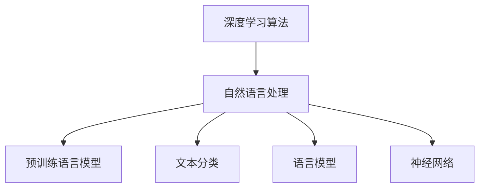

                 

# AI人工智能深度学习算法：在自然语言处理中的运用

> 关键词：深度学习算法,自然语言处理,文本分类,语言模型,神经网络,Transformer

## 1. 背景介绍

### 1.1 问题由来
人工智能（AI）正迅速改变着世界的面貌，深度学习作为AI的核心技术之一，已经在图像识别、语音识别、自然语言处理（NLP）等诸多领域取得重大突破。自然语言处理，作为人工智能的重要分支，致力于让计算机理解和生成自然语言，在机器翻译、情感分析、文本摘要、问答系统等应用中发挥着重要作用。

近年来，随着预训练语言模型（Pre-trained Language Models, PLMs）的兴起，自然语言处理技术取得了巨大进展。这些模型如BERT、GPT-3等，通过在大规模无标签文本数据上进行预训练，学习到了丰富的语言知识和常识，为下游任务提供了强大的知识基础。本文将详细介绍深度学习算法在自然语言处理中的运用，包括算法原理、具体操作步骤、实际应用场景以及未来发展趋势。

## 2. 核心概念与联系

### 2.1 核心概念概述

为更好地理解深度学习算法在自然语言处理中的应用，本节将介绍几个关键概念：

- 深度学习算法：通过多层次神经网络模型学习数据分布规律的算法，已经在图像识别、语音识别、自然语言处理等领域取得重大进展。
- 自然语言处理（NLP）：让计算机理解和生成自然语言的学科，旨在构建智能对话系统、文本分类、语言生成等应用。
- 预训练语言模型（PLMs）：在大规模无标签文本数据上预训练的模型，如BERT、GPT-3等，学习到了丰富的语言知识和常识，为下游任务提供了强大的知识基础。
- 文本分类：将文本分为不同类别的任务，如情感分类、主题分类等。
- 语言模型：根据文本序列预测下一个单词的模型，如LSTM、GRU等。
- 神经网络：由大量人工神经元组成的网络，可以用于各种机器学习任务。

这些概念之间具有紧密联系，构成了深度学习在自然语言处理中的核心框架。

### 2.2 核心概念原理和架构的 Mermaid 流程图


## 3. 核心算法原理 & 具体操作步骤
### 3.1 算法原理概述

深度学习算法在自然语言处理中的应用，主要通过构建多层神经网络模型，学习文本数据中的复杂特征和规律。其核心思想是通过反向传播算法，不断调整模型参数，使得模型输出能够最小化与真实标签之间的误差。

以文本分类任务为例，假设训练集为 $D=\{(x_i,y_i)\}_{i=1}^N, x_i \in \mathcal{X}, y_i \in \{0,1\}$，其中 $\mathcal{X}$ 为输入空间，$\{0,1\}$ 为二分类任务的可能标签。模型的目标是学习一个函数 $f: \mathcal{X} \rightarrow \{0,1\}$，使得在新的输入 $x$ 上，$f(x)$ 能够尽可能接近真实标签 $y$。

深度学习模型如卷积神经网络（CNN）、循环神经网络（RNN）、长短期记忆网络（LSTM）、门控循环单元（GRU）等，都适用于文本分类任务。这些模型通过学习文本的词向量表示，提取出文本中的关键特征，最终通过全连接层进行分类。

### 3.2 算法步骤详解

深度学习算法在自然语言处理中的应用，通常包括以下几个关键步骤：

**Step 1: 准备数据集**
- 收集和预处理文本数据，确保数据质量，去除噪声和冗余信息。
- 将文本数据进行分词、标注等处理，转化为模型可以接受的格式。
- 将数据划分为训练集、验证集和测试集，确保模型在未知数据上的泛化能力。

**Step 2: 构建模型**
- 选择合适的神经网络结构，如CNN、RNN、LSTM、GRU等。
- 设计模型输入和输出的维度，如文本长度、标签数量等。
- 确定模型的超参数，如学习率、批大小、迭代轮数等。

**Step 3: 训练模型**
- 使用反向传播算法，计算模型参数的梯度。
- 使用优化算法如Adam、SGD等，更新模型参数。
- 在训练集上进行多轮迭代训练，调整模型超参数。
- 在验证集上评估模型性能，避免过拟合。

**Step 4: 评估模型**
- 在测试集上评估模型的泛化能力，如准确率、召回率、F1分数等。
- 使用混淆矩阵、ROC曲线等可视化工具，分析模型性能。
- 对比不同模型和超参数设置，选择最优方案。

**Step 5: 部署模型**
- 将训练好的模型保存为文件，便于后续使用。
- 将模型部署到实际应用场景中，如Web应用、移动应用、API服务等。
- 持续监控模型性能，根据反馈进行优化。

以上是深度学习算法在自然语言处理中的通用流程，但在具体应用中，还需要根据任务特点进行优化调整。

### 3.3 算法优缺点

深度学习算法在自然语言处理中的应用，具有以下优点：

1. **强大的表达能力**：深度学习模型可以通过多层次神经网络，学习到文本数据的复杂特征和规律。
2. **高效的特征提取**：通过自动化的特征提取过程，显著提高了特征提取的效率和精度。
3. **可扩展性强**：深度学习模型可以扩展到大规模数据集，逐步提升模型的性能。

同时，深度学习算法也存在一些缺点：

1. **需要大量标注数据**：深度学习模型需要大量的标注数据进行训练，标注成本较高。
2. **易过拟合**：在大规模数据集上训练的模型，可能在小型数据集上表现不佳。
3. **模型复杂度高**：深度学习模型结构复杂，训练和推理过程耗时较长。
4. **解释性不足**：深度学习模型通常被视为"黑盒"，难以解释其内部工作机制。

## 4. 数学模型和公式 & 详细讲解 & 举例说明

### 4.1 数学模型构建

在自然语言处理中，深度学习模型的数学模型通常包括以下几个部分：

1. **输入表示**：将文本数据转化为模型可以接受的向量形式。
2. **嵌入层**：将单词或字符转化为高维向量，表示单词的语义信息。
3. **隐藏层**：通过多层次的神经网络，提取文本中的关键特征。
4. **输出层**：根据任务类型，设计相应的输出层，如全连接层、softmax层等。

以文本分类任务为例，假设模型输入为 $x=(x_1, x_2, \ldots, x_n)$，表示文本的词向量序列，其中 $x_i$ 为单词的向量表示。模型的输出为 $y \in \{0,1\}$，表示文本的分类标签。模型的数学模型可以表示为：

$$
f(x) = \text{softmax}(W^T \cdot \sigma(A(x)))
$$

其中 $W$ 为全连接层的权重矩阵，$\sigma$ 为激活函数，$A(x)$ 为隐藏层的输出，$\text{softmax}$ 函数将输出转化为概率分布。模型的损失函数通常为交叉熵损失函数：

$$
\mathcal{L}(f(x), y) = -\log f(x;y)
$$

### 4.2 公式推导过程

以文本分类任务为例，假设模型输入为 $x=(x_1, x_2, \ldots, x_n)$，表示文本的词向量序列，其中 $x_i$ 为单词的向量表示。模型的输出为 $y \in \{0,1\}$，表示文本的分类标签。模型的数学模型可以表示为：

$$
f(x) = \text{softmax}(W^T \cdot \sigma(A(x)))
$$

其中 $W$ 为全连接层的权重矩阵，$\sigma$ 为激活函数，$A(x)$ 为隐藏层的输出，$\text{softmax}$ 函数将输出转化为概率分布。模型的损失函数通常为交叉熵损失函数：

$$
\mathcal{L}(f(x), y) = -\log f(x;y)
$$

通过反向传播算法，计算模型参数的梯度，使用优化算法如Adam、SGD等，更新模型参数，使得模型在训练集上的损失函数最小化。

### 4.3 案例分析与讲解

假设我们有一个文本分类任务，输入为一段新闻文本，输出为0表示体育新闻，1表示科技新闻。我们使用LSTM模型进行训练。具体步骤如下：

1. **数据预处理**：将新闻文本进行分词、去除停用词、转换为小写等处理。
2. **嵌入层**：将单词向量序列输入到LSTM模型中，进行特征提取。
3. **隐藏层**：LSTM模型通过多层神经网络，提取出文本的关键特征。
4. **输出层**：全连接层将隐藏层的输出转化为二分类概率。
5. **训练模型**：使用交叉熵损失函数进行反向传播，优化模型参数。

在训练过程中，我们可以使用验证集进行模型调参，选择最优的超参数。最终，在测试集上评估模型的性能，如准确率、召回率等。

## 5. 项目实践：代码实例和详细解释说明

### 5.1 开发环境搭建

在进行深度学习项目实践前，我们需要准备好开发环境。以下是使用Python进行PyTorch开发的环境配置流程：

1. 安装Anaconda：从官网下载并安装Anaconda，用于创建独立的Python环境。

2. 创建并激活虚拟环境：
```bash
conda create -n pytorch-env python=3.8 
conda activate pytorch-env
```

3. 安装PyTorch：根据CUDA版本，从官网获取对应的安装命令。例如：
```bash
conda install pytorch torchvision torchaudio cudatoolkit=11.1 -c pytorch -c conda-forge
```

4. 安装相关库：
```bash
pip install torch torchvision torchtext numpy pandas scikit-learn matplotlib tqdm jupyter notebook ipython
```

完成上述步骤后，即可在`pytorch-env`环境中开始项目实践。

### 5.2 源代码详细实现

以下是使用PyTorch进行文本分类任务的代码实现：

```python
import torch
import torch.nn as nn
import torch.optim as optim
import torchtext.datasets as datasets
import torchtext.data as data

# 设置数据处理 pipeline
TEXT = data.Field(tokenize='spacy', lower=True, include_lengths=True)
LABEL = data.LabelField(dtype=torch.int64)

# 下载并加载 IMDB 数据集
train_data, test_data = datasets.IMDB.splits(TEXT, LABEL)

# 构建 vocabulary
TEXT.build_vocab(train_data, max_size=25_000, vectors="glove.6B.100d", unk_init=torch.Tensor.normal_)

# 构建模型
class LSTMClassifier(nn.Module):
    def __init__(self, input_dim, embedding_dim, hidden_dim, output_dim):
        super(LSTMClassifier, self).__init__()
        self.embedding = nn.Embedding(input_dim, embedding_dim)
        self.lstm = nn.LSTM(embedding_dim, hidden_dim, num_layers=1, bidirectional=True)
        self.fc = nn.Linear(hidden_dim*2, output_dim)
        self.dropout = nn.Dropout(0.2)

    def forward(self, x):
        embeddings = self.embedding(x)
        embeddings = self.dropout(embeddings)
        lstm_out, _ = self.lstm(embeddings)
        lstm_out = lstm_out.view(-1, lstm_out.size(2))
        logits = self.fc(lstm_out)
        return logits

# 定义模型超参数
INPUT_DIM = len(TEXT.vocab)
EMBEDDING_DIM = 100
HIDDEN_DIM = 256
OUTPUT_DIM = 1

# 初始化模型
model = LSTMClassifier(INPUT_DIM, EMBEDDING_DIM, HIDDEN_DIM, OUTPUT_DIM)

# 定义优化器
optimizer = optim.Adam(model.parameters(), lr=0.001)

# 定义损失函数
criterion = nn.BCEWithLogitsLoss()

# 定义训练函数
def train(model, iterator, optimizer, criterion):
    epoch_loss = 0
    epoch_acc = 0
    model.train()
    for batch in iterator:
        optimizer.zero_grad()
        predictions = model(batch.text).squeeze(1)
        loss = criterion(predictions, batch.label)
        acc = binary_accuracy(predictions, batch.label)
        loss.backward()
        optimizer.step()
        epoch_loss += loss.item()
        epoch_acc += acc.item()
    return epoch_loss / len(iterator), epoch_acc / len(iterator)

# 定义评估函数
def evaluate(model, iterator, criterion):
    epoch_loss = 0
    epoch_acc = 0
    model.eval()
    with torch.no_grad():
        for batch in iterator:
            predictions = model(batch.text).squeeze(1)
            loss = criterion(predictions, batch.label)
            acc = binary_accuracy(predictions, batch.label)
            epoch_loss += loss.item()
            epoch_acc += acc.item()
    return epoch_loss / len(iterator), epoch_acc / len(iterator)

# 定义训练循环
def train_loop(model, iterator, optimizer, criterion):
    N_EPOCHS = 5
    for epoch in range(N_EPOCHS):
        train_loss, train_acc = train(model, iterator, optimizer, criterion)
        test_loss, test_acc = evaluate(model, test_iterator, criterion)
        print(f'Epoch: {epoch+1:02}, Train Loss: {train_loss:.3f}, Train Acc: {train_acc*100:.2f}% / Test Loss: {test_loss:.3f}, Test Acc: {test_acc*100:.2f}%')

# 加载数据集
train_iterator, test_iterator = data.BucketIterator.splits((train_data, test_data), batch_size=64, device=device)

# 训练模型
train_loop(model, train_iterator, optimizer, criterion)
```

### 5.3 代码解读与分析

让我们再详细解读一下关键代码的实现细节：

**数据处理**：
- `TEXT`和`LABEL`字段定义了输入和输出的数据格式。
- 使用`datasets.IMDB.splits`加载IMDB数据集。
- 通过`build_vocab`构建词汇表。

**模型定义**：
- `LSTMClassifier`类定义了LSTM模型。
- 模型包含嵌入层、LSTM层、全连接层和Dropout层。
- `forward`方法实现了前向传播过程。

**模型训练**：
- 使用`Adam`优化器进行模型参数优化。
- 定义交叉熵损失函数。
- 定义`train`和`evaluate`函数进行模型训练和评估。
- 通过`train_loop`函数进行模型训练。

可以看到，使用PyTorch构建深度学习模型非常便捷，可以通过继承`nn.Module`类，轻松定义自定义模型。此外，PyTorch提供了丰富的优化器和损失函数，可以满足不同应用场景的需求。

## 6. 实际应用场景

深度学习算法在自然语言处理中的应用已经非常广泛，以下是一些典型应用场景：

### 6.1 机器翻译

深度学习模型如序列到序列（Seq2Seq）模型、Transformer模型等，已经广泛应用于机器翻译任务。这些模型通过学习大量的双语数据，可以自动将一种语言翻译成另一种语言。

### 6.2 情感分析

情感分析是自然语言处理中的一个重要应用，通过分析文本中的情感信息，可以识别出文本的情感倾向。深度学习模型如卷积神经网络（CNN）、循环神经网络（RNN）等，已经被广泛应用于情感分析任务。

### 6.3 文本摘要

文本摘要任务旨在从长篇文本中提取关键信息，生成简洁的摘要。深度学习模型如Transformer、Attention机制等，已经被广泛应用于文本摘要任务。

### 6.4 问答系统

问答系统是一种智能对话系统，可以回答用户提出的问题。深度学习模型如BERT、GPT等，已经被广泛应用于问答系统任务。

## 7. 工具和资源推荐

### 7.1 学习资源推荐

为了帮助开发者系统掌握深度学习算法在自然语言处理中的应用，这里推荐一些优质的学习资源：

1. 《深度学习》课程：由吴恩达教授主讲的深度学习课程，涵盖深度学习的基本概念和算法。
2. 《自然语言处理综论》书籍：李航教授的NLP经典教材，全面介绍了NLP的基本概念和算法。
3. 《PyTorch深度学习》书籍：由Ian Goodfellow等人编写的深度学习教材，介绍了PyTorch的使用方法。
4. HuggingFace官方文档：HuggingFace的官方文档，提供了丰富的预训练模型和微调样例代码。
5. CLUE开源项目：中文语言理解测评基准，涵盖大量不同类型的中文NLP数据集，并提供了基于深度学习的baseline模型。

通过对这些资源的学习实践，相信你一定能够快速掌握深度学习算法在自然语言处理中的应用，并用于解决实际的NLP问题。

### 7.2 开发工具推荐

高效的开发离不开优秀的工具支持。以下是几款用于深度学习项目开发的常用工具：

1. PyTorch：基于Python的开源深度学习框架，灵活动态的计算图，适合快速迭代研究。
2. TensorFlow：由Google主导开发的开源深度学习框架，生产部署方便，适合大规模工程应用。
3. TensorBoard：TensorFlow配套的可视化工具，可实时监测模型训练状态，并提供丰富的图表呈现方式。
4. Weights & Biases：模型训练的实验跟踪工具，可以记录和可视化模型训练过程中的各项指标。
5. Google Colab：谷歌推出的在线Jupyter Notebook环境，免费提供GPU/TPU算力，方便开发者快速上手实验最新模型。

合理利用这些工具，可以显著提升深度学习项目开发的效率，加快创新迭代的步伐。

### 7.3 相关论文推荐

深度学习算法在自然语言处理中的应用，源于学界的持续研究。以下是几篇奠基性的相关论文，推荐阅读：

1. Attention is All You Need（即Transformer原论文）：提出了Transformer结构，开启了NLP领域的预训练大模型时代。
2. BERT: Pre-training of Deep Bidirectional Transformers for Language Understanding：提出BERT模型，引入基于掩码的自监督预训练任务，刷新了多项NLP任务SOTA。
3. Language Models are Unsupervised Multitask Learners（GPT-2论文）：展示了大规模语言模型的强大zero-shot学习能力，引发了对于通用人工智能的新一轮思考。
4. Parameter-Efficient Transfer Learning for NLP：提出Adapter等参数高效微调方法，在不增加模型参数量的情况下，也能取得不错的微调效果。
5. Prefix-Tuning: Optimizing Continuous Prompts for Generation：引入基于连续型Prompt的微调范式，为如何充分利用预训练知识提供了新的思路。
6. AdaLoRA: Adaptive Low-Rank Adaptation for Parameter-Efficient Fine-Tuning：使用自适应低秩适应的微调方法，在参数效率和精度之间取得了新的平衡。

这些论文代表了大语言模型微调技术的发展脉络。通过学习这些前沿成果，可以帮助研究者把握学科前进方向，激发更多的创新灵感。

## 8. 总结：未来发展趋势与挑战

### 8.1 总结

本文对深度学习算法在自然语言处理中的应用进行了全面系统的介绍。首先阐述了深度学习算法的基本原理和结构，然后介绍了其在自然语言处理中的典型应用，包括机器翻译、情感分析、文本摘要等任务。最后，探讨了深度学习算法的优缺点和未来发展趋势。

通过本文的系统梳理，可以看到，深度学习算法在自然语言处理中的应用已经非常成熟，具有强大的表达能力和丰富的应用场景。然而，深度学习算法仍面临一些挑战，如模型鲁棒性、可解释性、资源消耗等，需要进一步研究和优化。

### 8.2 未来发展趋势

展望未来，深度学习算法在自然语言处理中的应用将呈现以下几个发展趋势：

1. **大规模预训练模型**：随着算力成本的下降和数据规模的扩张，预训练语言模型的参数量还将持续增长。超大规模语言模型蕴含的丰富语言知识，有望支撑更加复杂多变的下游任务微调。
2. **自监督学习**：基于自监督学习的方法，可以利用非标注数据进行模型训练，降低对标注数据的依赖。
3. **多模态学习**：深度学习模型将扩展到多模态数据，如文本、图像、语音等，实现跨模态信息的整合和理解。
4. **领域自适应学习**：针对特定领域的任务，通过领域自适应学习，提升模型的泛化能力和适应性。
5. **解释性增强**：增强深度学习模型的可解释性，赋予其更强的逻辑推理和因果分析能力。
6. **鲁棒性和安全性**：通过鲁棒性训练和安全性验证，提高深度学习模型的可靠性和安全性。

以上趋势凸显了深度学习算法在自然语言处理中的广阔前景。这些方向的探索发展，必将进一步提升自然语言处理系统的性能和应用范围，为构建智能对话系统、文本分类、语言生成等应用提供新的突破。

### 8.3 面临的挑战

尽管深度学习算法在自然语言处理中的应用已经取得了巨大进展，但在迈向更加智能化、普适化应用的过程中，仍面临诸多挑战：

1. **模型鲁棒性不足**：深度学习模型面对域外数据时，泛化性能往往大打折扣。对于测试样本的微小扰动，模型的预测也容易发生波动。如何提高深度学习模型的鲁棒性，避免灾难性遗忘，还需要更多理论和实践的积累。
2. **解释性不足**：深度学习模型通常被视为"黑盒"，难以解释其内部工作机制和决策逻辑。对于医疗、金融等高风险应用，算法的可解释性和可审计性尤为重要。如何赋予深度学习模型更强的可解释性，将是亟待攻克的难题。
3. **资源消耗高**：深度学习模型通常需要大量的计算资源和存储空间，在实际部署中可能面临性能瓶颈。如何优化深度学习模型的计算图，降低资源消耗，提高推理速度，是未来的一个重要研究方向。
4. **数据质量和标注成本**：深度学习模型需要大量的高质量标注数据进行训练，标注成本较高。对于长尾应用场景，难以获得充足的高质量标注数据，成为制约模型性能的瓶颈。如何进一步降低深度学习模型对标注数据的依赖，将是一大难题。
5. **对抗攻击**：深度学习模型容易受到对抗样本的攻击，导致输出错误。如何增强深度学习模型的鲁棒性，抵御对抗攻击，是未来的重要研究方向。

### 8.4 研究展望

面对深度学习算法在自然语言处理中面临的挑战，未来的研究需要在以下几个方面寻求新的突破：

1. **增强模型的鲁棒性和泛化能力**：开发更鲁棒的深度学习模型，能够更好地应对域外数据和对抗攻击。
2. **提高模型的可解释性**：通过引入可解释性技术，如因果推断、符号推理等，增强深度学习模型的逻辑推理和因果分析能力。
3. **优化模型的计算图**：通过优化深度学习模型的计算图，减少前向传播和反向传播的资源消耗，提高推理速度和模型效率。
4. **利用无监督和半监督学习方法**：通过自监督学习、主动学习等无监督和半监督学习方法，利用非标注数据进行模型训练，降低对标注数据的依赖。
5. **引入多模态信息**：通过跨模态学习，将文本、图像、语音等信息进行整合，提升深度学习模型的泛化能力和适应性。
6. **结合领域知识**：将领域知识与深度学习模型结合，增强模型的领域自适应能力和知识整合能力。

这些研究方向的探索，必将引领深度学习算法在自然语言处理中的应用迈向更高的台阶，为构建智能对话系统、文本分类、语言生成等应用提供新的突破。面向未来，深度学习算法需要与其他人工智能技术进行更深入的融合，如知识表示、因果推理、强化学习等，多路径协同发力，共同推动自然语言理解和智能交互系统的进步。只有勇于创新、敢于突破，才能不断拓展自然语言处理系统的边界，让智能技术更好地造福人类社会。

## 9. 附录：常见问题与解答

**Q1：深度学习算法在自然语言处理中的应用是否只限于文本分类、机器翻译等任务？**

A: 深度学习算法在自然语言处理中的应用不仅限于文本分类、机器翻译等任务，还可以应用于问答系统、情感分析、文本摘要、命名实体识别等任务。通过适当的模型设计和优化，深度学习算法可以广泛应用于各种NLP任务。

**Q2：深度学习模型是否容易受到对抗样本攻击？**

A: 深度学习模型容易受到对抗样本的攻击，导致输出错误。为了增强模型的鲁棒性，可以引入对抗样本训练和对抗样本检测等技术，提高模型的抗干扰能力。

**Q3：如何提高深度学习模型的可解释性？**

A: 提高深度学习模型的可解释性，可以引入可解释性技术如因果推断、符号推理等，增强模型的逻辑推理和因果分析能力。同时，可以通过模型可视化、解释性输出等手段，提高模型的透明度和可理解性。

**Q4：深度学习模型在实际应用中是否存在资源消耗高的问题？**

A: 深度学习模型通常需要大量的计算资源和存储空间，在实际部署中可能面临性能瓶颈。为了优化深度学习模型的资源消耗，可以采用模型裁剪、量化加速、分布式训练等技术，降低模型的推理速度和存储空间。

**Q5：深度学习模型是否需要大量的标注数据进行训练？**

A: 深度学习模型通常需要大量的高质量标注数据进行训练，标注成本较高。为了降低对标注数据的依赖，可以引入自监督学习、主动学习等无监督和半监督学习方法，利用非标注数据进行模型训练。

通过以上系统梳理和详细介绍，相信读者能够全面理解深度学习算法在自然语言处理中的应用，掌握其实现方法和优化策略，为实际项目开发提供有力支持。随着深度学习算法的不断进步，自然语言处理技术必将在更多领域得到应用，为社会带来更深刻的变化。

