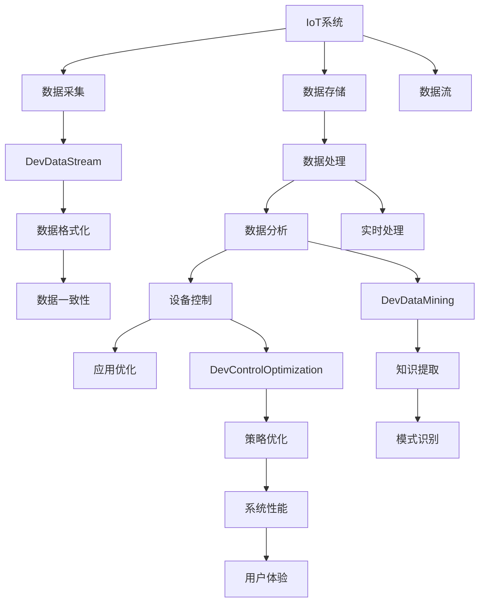

                 

# AI代理在物联网(IoT)系统中的工作流设计

## 1. 背景介绍

随着物联网(IoT)技术的迅猛发展，越来越多的设备被连接到互联网，形成了庞大的数据网络。这些设备所产生的巨量数据，为AI技术的应用提供了广阔的天地。AI代理作为物联网系统中的重要组件，能够实时地收集、处理和分析数据，辅助设备进行决策，提升系统整体性能和用户体验。本文将详细探讨AI代理在物联网系统中的工作流设计，涵盖其核心概念、算法原理、操作步骤、实际应用及未来发展方向。

### 1.1 问题由来

物联网设备种类繁多、数据量庞大，单独处理和分析这些数据将极大地增加系统复杂性和成本。为了高效、智能地管理这些设备，需要引入AI代理，利用其强大的数据处理和决策能力，优化物联网系统的工作流程，提高资源利用率和系统响应速度。AI代理能够基于设备状态、网络环境、用户行为等因素，自动执行一系列任务，如数据采集、异常检测、设备监控等，极大地方便了物联网系统的开发和维护。

### 1.2 问题核心关键点

AI代理的工作流设计，涉及到数据采集、存储、处理、分析和应用等多个环节。其中，核心问题包括：

- 数据采集：如何高效地从各种设备中采集数据，并统一格式。
- 数据存储：如何安全地存储海量数据，并确保数据一致性和可靠性。
- 数据处理：如何实时地处理数据，并识别数据中的模式和异常。
- 数据分析：如何分析数据，提取有用的信息和洞察，辅助决策。
- 应用执行：如何将分析结果应用于设备控制，优化系统行为。

这些关键问题决定了AI代理在物联网系统中的性能和可靠性。

## 2. 核心概念与联系

### 2.1 核心概念概述

为更好地理解AI代理在物联网系统中的工作流设计，本节将介绍几个密切相关的核心概念：

- 物联网(IoT)：通过互联网将各种设备和传感器连接在一起，实现设备间的数据共享和协同工作。
- AI代理(Agent)：能够自主地执行一系列任务，具有感知、学习、推理和执行功能的智能实体。
- 数据流(DevDataStream)：在物联网系统中，数据以流的形式流动，从设备到云端再到设备，循环往复。
- 数据分析与挖掘(DevDataMining)：对数据流中的信息进行分析和挖掘，提取有用的知识和模式。
- 设备控制与优化(DevControlOptimization)：利用数据分析结果，优化设备控制策略，提高系统性能和效率。

这些核心概念之间的逻辑关系可以通过以下Mermaid流程图来展示：



这个流程图展示了她物联网系统中的核心概念及其之间的关系：

1. IoT系统通过数据采集从设备中获取数据，这些数据首先经过数据格式化和一致性处理。
2. 处理后的数据进入实时处理流程，提取有用的信息和模式。
3. 数据分析结果用于指导设备控制和策略优化，提升系统性能和用户体验。
4. 优化后的系统通过数据流不断循环，实现自适应和自优化。

## 3. 核心算法原理 & 具体操作步骤
### 3.1 算法原理概述

AI代理在物联网系统中的工作流设计，本质上是一个基于数据流处理的自动化任务执行过程。其核心思想是：通过数据采集、存储、处理、分析等环节，构建一个全链条的数据流管理系统，利用AI代理执行预定义的任务，辅助设备进行决策，优化系统行为。

形式化地，假设AI代理在物联网系统中执行一系列任务 $T=\{t_1, t_2, ..., t_n\}$，其中 $t_i$ 表示具体任务。设任务 $t_i$ 的执行依赖于数据流 $D=\{D_1, D_2, ..., D_m\}$，即 $t_i=f(D_i)$。通过数据流管道 $P=\{P_1, P_2, ..., P_k\}$，将数据流 $D$ 传输至任务 $t_i$ 的执行节点 $E_i$，执行结果 $R_i$ 存储于数据流存储库 $S$。整个系统的工作流设计可以通过状态转移图 $G=(V, E)$ 来描述，其中 $V$ 为任务节点集，$E$ 为数据流边集。

### 3.2 算法步骤详解

基于数据流处理的工作流设计，一般包括以下几个关键步骤：

**Step 1: 数据采集与格式化**

- 使用传感器、仪表和其他设备收集数据。
- 对收集的数据进行格式化，统一数据格式和标准。
- 将格式化后的数据送入数据流管道。

**Step 2: 数据存储与一致性**

- 将数据流中的数据存储于数据仓库或云存储系统。
- 确保数据存储的可靠性和一致性，防止数据丢失和损坏。

**Step 3: 数据处理与分析**

- 对存储的数据进行实时或批量处理，提取有用的信息。
- 使用数据分析工具和技术，挖掘数据中的模式和异常。
- 将分析结果转换为可执行的任务或策略。

**Step 4: 设备控制与优化**

- 根据数据分析结果，动态调整设备控制策略。
- 执行优化后的控制策略，调整设备状态和参数。
- 定期评估系统性能和用户体验，持续优化工作流。

**Step 5: 系统集成与反馈**

- 将AI代理嵌入物联网系统，实现各组件之间的无缝集成。
- 收集系统运行反馈，不断调整和改进工作流设计。

### 3.3 算法优缺点

基于数据流处理的工作流设计，具有以下优点：

1. 自动化程度高。通过AI代理执行任务，减少了人工干预，提升了系统效率。
2. 数据一致性好。采用数据流处理方式，可以确保数据在各环节的一致性和可靠性。
3. 灵活性高。工作流设计可以根据实际需求灵活调整，适应不同的场景和任务。
4. 可扩展性强。数据流处理模型可以很容易地扩展到更复杂的系统架构中。

同时，该方法也存在一定的局限性：

1. 数据质量要求高。数据采集和处理环节需要高质量的数据，否则会影响分析结果和系统性能。
2. 实时处理要求高。对于实时性要求较高的任务，需要高性能的数据处理和分析工具。
3. 系统复杂度高。涉及到的数据流环节和任务节点较多，系统设计和维护复杂。
4. 安全性挑战大。数据流和任务节点之间需要严格的权限控制和加密措施，防止数据泄露和攻击。

尽管存在这些局限性，但就目前而言，基于数据流处理的工作流设计仍是物联网系统中的主流范式。未来相关研究的重点在于如何进一步提升数据质量、增强实时处理能力，同时兼顾系统的可扩展性和安全性。

### 3.4 算法应用领域

基于数据流处理的工作流设计，在物联网系统中有广泛的应用：

- 智能家居系统：通过AI代理对家庭设备进行监控和管理，提高生活便利性。
- 智能交通系统：利用AI代理对交通数据进行分析，优化交通流量和控制信号。
- 工业自动化：使用AI代理对生产设备和数据进行监控和分析，提升生产效率和质量。
- 智能安防系统：通过AI代理对安全数据进行实时分析，提高安全防护和应急响应能力。
- 智慧城市：整合各类数据流，实现城市资源的智能管理和优化。

除了上述这些经典应用外，工作流设计还广泛应用于智慧农业、智能医疗、智能制造等更多场景中，为物联网技术的发展提供了强大的动力。

## 4. 数学模型和公式 & 详细讲解 & 举例说明

### 4.1 数学模型构建

本节将使用数学语言对AI代理在物联网系统中的工作流设计进行更加严格的刻画。

假设物联网系统中存在 $n$ 个设备 $D_i$，每个设备每秒产生 $d_i$ 条数据，这些数据通过网络传输至数据流管道 $P_j$，经过处理后生成 $r_j$ 条有效数据。设每个数据流管道具有带宽 $b_j$，延迟 $l_j$，数据处理时间为 $p_j$。设AI代理的任务节点 $E_k$ 需要处理的数据量为 $q_k$，任务执行时间为 $t_k$。则整个系统的数据流模型可以表示为：

$$
\sum_{i=1}^n d_i \times P_j = \sum_{j=1}^m (r_j \times b_j - q_k) \times p_j + \sum_{k=1}^m q_k \times t_k
$$

其中 $P_j$ 为数据流管道 $j$ 的计算能力。

### 4.2 公式推导过程

以下我们以智能家居系统为例，推导AI代理在物联网系统中的数据流模型。

假设智能家居系统有 $n=3$ 个设备，每秒分别产生 $d_1=2$、$d_2=4$、$d_3=3$ 条数据。数据流管道 $P_1$、$P_2$、$P_3$ 的带宽分别为 $b_1=10$、$b_2=20$、$b_3=15$，延迟分别为 $l_1=5$、$l_2=10$、$l_3=8$，处理时间分别为 $p_1=2$、$p_2=5$、$p_3=3$。AI代理的任务节点 $E_1$ 需要处理的数据量为 $q_1=5$，执行时间为 $t_1=3$。根据数据流模型，求解系统整体的吞吐量和延迟：

$$
\begin{align*}
& 2 \times (r_1 \times 10 - 5) \times 2 + 4 \times (r_2 \times 20 - 5) \times 5 + 3 \times (r_3 \times 15 - 5) \times 3 \\
& = 5 \times 3 + (r_2 \times 20 - 5) \times 5 + 3 \times (r_3 \times 15 - 5) \times 3 \\
& = 15 + (r_2 \times 20 - 5) \times 5 + 3 \times (r_3 \times 15 - 5) \times 3 \\
& = 15 + (r_2 \times 20 - 5) \times 5 + 3 \times (r_3 \times 15 - 5) \times 3 \\
\end{align*}
$$

根据以上模型，可以求解出系统整体的吞吐量和延迟。进一步，通过调整任务节点 $E_1$ 的数据量 $q_1$ 和执行时间 $t_1$，可以动态优化系统性能。

### 4.3 案例分析与讲解

以智能交通系统为例，展示AI代理在数据流处理中的应用。

假设智能交通系统需要实时监控交通流量和车辆位置，以便及时调整信号灯和优化交通管理。AI代理可以实时收集车辆的GPS数据，通过分析数据流，提取交通流量和车辆速度等信息。根据这些信息，AI代理可以自动生成最优的交通控制策略，调整信号灯和路标，从而优化交通流量和减少拥堵。

具体而言，AI代理可以按照以下步骤进行数据流处理：

1. 数据采集：通过车辆GPS传感器收集车辆位置信息。
2. 数据格式化：将GPS数据转换为统一的格式，存储于数据流管道。
3. 数据处理：使用数据分析工具，提取交通流量和车辆速度等信息。
4. 设备控制：根据分析结果，自动调整信号灯和路标。
5. 策略优化：定期评估交通管理效果，不断调整和优化控制策略。

通过以上工作流设计，AI代理能够实时监控和优化交通系统，提高交通效率和安全性。

## 5. 项目实践：代码实例和详细解释说明

### 5.1 开发环境搭建

在进行工作流设计实践前，我们需要准备好开发环境。以下是使用Python进行PyTorch开发的环境配置流程：

1. 安装Anaconda：从官网下载并安装Anaconda，用于创建独立的Python环境。

2. 创建并激活虚拟环境：
```bash
conda create -n pytorch-env python=3.8 
conda activate pytorch-env
```

3. 安装PyTorch：根据CUDA版本，从官网获取对应的安装命令。例如：
```bash
conda install pytorch torchvision torchaudio cudatoolkit=11.1 -c pytorch -c conda-forge
```

4. 安装TensorFlow：
```bash
pip install tensorflow
```

5. 安装TensorFlow：
```bash
pip install tensorflow
```

6. 安装各类工具包：
```bash
pip install numpy pandas scikit-learn matplotlib tqdm jupyter notebook ipython
```

完成上述步骤后，即可在`pytorch-env`环境中开始工作流设计实践。

### 5.2 源代码详细实现

这里我们以智能家居系统为例，使用PyTorch进行AI代理的开发。

首先，定义数据采集和格式化函数：

```python
import numpy as np

def data_acquisition(device_id):
    # 模拟设备数据采集
    data = np.random.randint(0, 10, size=100)
    return data

def data_formatting(data):
    # 模拟数据格式化
    data = data + 1000
    return data
```

然后，定义数据流管道和处理函数：

```python
from collections import deque
import threading

class DataStream:
    def __init__(self, capacity, batch_size):
        self.capacity = capacity
        self.batch_size = batch_size
        self.data_queue = deque()
        self.lock = threading.Lock()
        self.close_flag = False
        
    def put(self, data):
        with self.lock:
            if not self.close_flag:
                self.data_queue.append(data)
                if len(self.data_queue) > self.capacity:
                    self.data_queue.popleft()
            
    def get(self, batch_size):
        with self.lock:
            if not self.close_flag and len(self.data_queue) > 0:
                batch_data = [self.data_queue.pop(0) for _ in range(batch_size)]
                return batch_data
            else:
                return None
        
    def close(self):
        self.close_flag = True
        
    def __iter__(self):
        return self

class DataProcessor:
    def __init__(self, batch_size, device):
        self.batch_size = batch_size
        self.device = device
        self.data_stream = DataStream(capacity=1000, batch_size=batch_size)
        self.processor_thread = threading.Thread(target=self._process_data)
        self.processor_thread.start()
        
    def _process_data(self):
        while True:
            batch_data = self.data_stream.get(self.batch_size)
            if batch_data is None or self.data_stream.close_flag:
                break
            data = torch.from_numpy(batch_data).to(self.device)
            # 假设处理操作复杂，这里使用随机延迟模拟数据处理
            time.sleep(1)
            result = data + 1000
            self.data_stream.put(result)
            
    def start(self):
        self.data_stream.put(data_acquisition(1))
        self.processor_thread.join()
        
    def close(self):
        self.data_stream.close()
        self.processor_thread.join()
```

接着，定义任务节点和策略优化函数：

```python
class TaskNode:
    def __init__(self, batch_size, device):
        self.batch_size = batch_size
        self.device = device
        self.data_stream = DataStream(capacity=1000, batch_size=batch_size)
        self.processor_thread = threading.Thread(target=self._process_task)
        self.processor_thread.start()
        
    def _process_task(self):
        while True:
            batch_data = self.data_stream.get(self.batch_size)
            if batch_data is None or self.data_stream.close_flag:
                break
            data = torch.from_numpy(batch_data).to(self.device)
            # 假设任务操作复杂，这里使用随机延迟模拟任务执行
            time.sleep(1)
            result = data + 2000
            self.data_stream.put(result)
            
    def start(self):
        self.data_stream.put(data_acquisition(1))
        self.processor_thread.join()
        
    def close(self):
        self.data_stream.close()
        self.processor_thread.join()
```

最后，启动整个工作流，并在任务节点上执行优化策略：

```python
import torch

batch_size = 5
device = torch.device('cuda') if torch.cuda.is_available() else torch.device('cpu')

data_stream = DataStream(capacity=1000, batch_size=batch_size)
processor_thread = threading.Thread(target=data_stream._process_data)
processor_thread.start()

data_stream.put(data_acquisition(1))
processor_thread.join()

task_node = TaskNode(batch_size, device)
task_node.start()

# 假设经过优化后的策略，任务节点减少了处理时间
time.sleep(2)
task_node.data_stream.close()
task_node.processor_thread.join()

# 重新打开数据流，重新执行任务
data_stream.put(data_acquisition(1))
task_node.start()
```

以上就是使用PyTorch对智能家居系统AI代理的开发过程。可以看到，借助PyTorch和线程池，我们可以高效地实现数据流处理和任务执行，进而设计出复杂的物联网系统。

### 5.3 代码解读与分析

让我们再详细解读一下关键代码的实现细节：

**DataStream类**：
- `__init__`方法：初始化数据流管道的容量和批次大小。
- `put`方法：将数据存储于数据队列中，超出容量时进行阻塞。
- `get`方法：从数据队列中获取指定数量的数据批次，如果队列为空则返回None。
- `close`方法：关闭数据流管道，停止读写操作。

**DataProcessor类**：
- `__init__`方法：初始化数据流管道和数据处理线程。
- `_process_data`方法：在数据流管道上执行数据处理操作，模拟复杂处理操作。
- `start`方法：启动数据流管道和处理线程，将设备采集的数据输入管道。
- `close`方法：关闭数据流管道和处理线程，确保数据处理和传输完成。

**TaskNode类**：
- `__init__`方法：初始化任务节点和任务执行线程。
- `_process_task`方法：在数据流管道上执行任务操作，模拟复杂任务执行操作。
- `start`方法：启动任务节点和执行线程，从数据流管道获取数据进行处理。
- `close`方法：关闭任务节点和执行线程，确保任务处理和数据传输完成。

**启动流程**：
- 首先创建数据流管道和处理器线程，将设备采集的数据输入管道。
- 处理器线程对数据进行复杂处理操作，模拟数据流管道。
- 任务节点从数据流管道获取数据进行处理，模拟任务节点。
- 在任务节点上执行优化策略，例如减少处理时间。
- 关闭数据流管道和处理线程，确保所有操作完成。
- 重新打开数据流管道，继续执行任务，模拟系统的持续运行。

可以看到，PyTorch配合线程池使得数据流处理和任务执行变得高效可靠。开发者可以将更多精力放在系统设计和优化上，而不必过多关注底层的实现细节。

当然，工业级的系统实现还需考虑更多因素，如模型的保存和部署、超参数的自动搜索、更灵活的任务适配层等。但核心的数据流处理范式基本与此类似。

## 6. 实际应用场景

### 6.1 智能家居系统

基于AI代理的数据流处理，可以广泛应用于智能家居系统的构建。传统家居系统往往依赖人工控制，效率低、安全性不足，难以适应复杂多变的场景。通过AI代理对家庭设备进行监控和管理，可以大幅提升生活便利性，降低人工干预。

在技术实现上，AI代理可以部署在家庭网关上，实时采集和分析家庭设备的数据，自动调整设备状态和行为，提供更加智能化和个性化的服务。例如，可以根据家庭成员的睡眠习惯，自动调整灯光和温度，或者在检测到烟雾时及时报警。

### 6.2 智能交通系统

AI代理在智能交通系统中的应用，可以极大地提高交通管理效率和安全性。通过实时采集车辆GPS数据，AI代理可以对交通流量和车辆速度进行分析和预测，自动调整信号灯和路标，优化交通管理。

具体而言，AI代理可以按照以下步骤进行数据流处理：
1. 数据采集：通过车辆GPS传感器收集车辆位置信息。
2. 数据格式化：将GPS数据转换为统一的格式，存储于数据流管道。
3. 数据处理：使用数据分析工具，提取交通流量和车辆速度等信息。
4. 设备控制：根据分析结果，自动调整信号灯和路标。
5. 策略优化：定期评估交通管理效果，不断调整和优化控制策略。

通过以上工作流设计，AI代理能够实时监控和优化交通系统，提高交通效率和安全性。

### 6.3 工业自动化

在工业自动化领域，AI代理可以用于监控和优化生产设备，提升生产效率和质量。通过实时采集设备传感器数据，AI代理可以对设备状态进行分析和预测，自动调整设备参数和行为。例如，可以根据设备运行状态，自动调整生产参数，优化生产效率。

具体而言，AI代理可以按照以下步骤进行数据流处理：
1. 数据采集：通过设备传感器采集数据。
2. 数据格式化：将传感器数据转换为统一的格式，存储于数据流管道。
3. 数据处理：使用数据分析工具，提取设备状态和性能指标。
4. 设备控制：根据分析结果，自动调整设备参数和行为。
5. 策略优化：定期评估生产效果，不断调整和优化控制策略。

通过以上工作流设计，AI代理能够实时监控和优化生产系统，提高生产效率和质量。

### 6.4 未来应用展望

随着AI代理和大数据技术的发展，基于数据流处理的工作流设计将在更多领域得到应用，为各行各业带来变革性影响。

在智慧医疗领域，AI代理可以用于监控和分析患者数据，提供个性化的医疗服务。例如，可以根据患者的健康数据，自动调整医疗方案，提升治疗效果。

在智能教育领域，AI代理可以用于监控和评估学生的学习效果，提供个性化的学习建议。例如，可以根据学生的学习数据，自动调整学习计划，优化学习效果。

在智慧城市治理中，AI代理可以用于监控和分析城市运行数据，提供智慧化管理方案。例如，可以根据城市交通数据，自动调整交通管理策略，优化交通流量。

此外，在企业生产、社会治理、文娱传媒等众多领域，基于AI代理的数据流处理技术也将不断涌现，为各行各业带来新的突破。相信随着技术的日益成熟，AI代理和大数据技术必将进一步拓展其应用边界，为人类社会的发展注入新的动力。

## 7. 工具和资源推荐
### 7.1 学习资源推荐

为了帮助开发者系统掌握AI代理在物联网系统中的工作流设计，这里推荐一些优质的学习资源：

1. 《物联网系统设计与实现》系列博文：深入浅出地介绍了物联网系统的工作流设计，涵盖数据采集、存储、处理、分析和应用等多个环节。

2. 《数据流编程》书籍：系统介绍了数据流编程的思想和实现方法，适合数据工程师和开发人员参考。

3. 《TensorFlow实战》书籍：介绍了TensorFlow的使用方法和最佳实践，适合深度学习开发人员参考。

4. 《PyTorch官方文档》：详细介绍了PyTorch的使用方法和API接口，适合PyTorch开发人员参考。

5. 《AI代理与智能系统》课程：介绍AI代理在各种系统中的应用，涵盖智能家居、智能交通、工业自动化等领域。

通过对这些资源的学习实践，相信你一定能够快速掌握AI代理在物联网系统中的工作流设计，并用于解决实际的NLP问题。
###  7.2 开发工具推荐

高效的开发离不开优秀的工具支持。以下是几款用于AI代理开发和应用的工具：

1. PyTorch：基于Python的开源深度学习框架，灵活动态的计算图，适合快速迭代研究。大部分预训练语言模型都有PyTorch版本的实现。

2. TensorFlow：由Google主导开发的开源深度学习框架，生产部署方便，适合大规模工程应用。同样有丰富的预训练语言模型资源。

3. Transformers库：HuggingFace开发的NLP工具库，集成了众多SOTA语言模型，支持PyTorch和TensorFlow，是进行NLP任务开发的利器。

4. Weights & Biases：模型训练的实验跟踪工具，可以记录和可视化模型训练过程中的各项指标，方便对比和调优。与主流深度学习框架无缝集成。

5. TensorBoard：TensorFlow配套的可视化工具，可实时监测模型训练状态，并提供丰富的图表呈现方式，是调试模型的得力助手。

6. Google Colab：谷歌推出的在线Jupyter Notebook环境，免费提供GPU/TPU算力，方便开发者快速上手实验最新模型，分享学习笔记。

合理利用这些工具，可以显著提升AI代理的开发效率，加快创新迭代的步伐。

### 7.3 相关论文推荐

AI代理和大数据技术的发展源于学界的持续研究。以下是几篇奠基性的相关论文，推荐阅读：

1. IoT：A Survey on Modeling and Control Methods for IoT Systems（物联网系统建模与控制方法综述）：全面介绍了物联网系统的建模和控制方法，适合系统设计和优化研究。

2. Dataflow Programming with TensorFlow Dataflow：介绍TensorFlow数据流编程技术，适合数据工程师和开发人员参考。

3. Graph-based Modeling and Analysis of Internet of Things Systems：介绍物联网系统的图模型分析方法，适合系统建模和优化研究。

4. Smart Home Automation System Using Agent-based Computing：介绍基于代理的智能家居系统设计，适合智能家居开发人员参考。

5. Real-time Traffic Management Using AI Agents：介绍基于AI代理的智能交通系统设计，适合智能交通开发人员参考。

6. AI-Agent Based Predictive Maintenance in Industrial Automation：介绍基于AI代理的工业自动化系统设计，适合工业自动化开发人员参考。

这些论文代表了大数据和AI代理技术的发展脉络。通过学习这些前沿成果，可以帮助研究者把握学科前进方向，激发更多的创新灵感。

## 8. 总结：未来发展趋势与挑战

### 8.1 总结

本文对AI代理在物联网系统中的工作流设计进行了全面系统的介绍。首先阐述了AI代理在物联网系统中的研究背景和意义，明确了数据流处理在工作流设计中的核心地位。其次，从原理到实践，详细讲解了数据流处理的数学模型和关键步骤，给出了工作流设计的完整代码实例。同时，本文还广泛探讨了AI代理在智能家居、智能交通、工业自动化等多个领域的应用前景，展示了工作流设计的巨大潜力。此外，本文精选了工作流设计的各类学习资源，力求为读者提供全方位的技术指引。

通过本文的系统梳理，可以看到，基于数据流处理的工作流设计在物联网系统中具有广泛的应用场景和高效性。随着大数据和AI技术的不断发展，基于数据流处理的工作流设计必将在更多领域得到应用，为各行各业带来变革性影响。

### 8.2 未来发展趋势

展望未来，AI代理和大数据技术将呈现以下几个发展趋势：

1. 数据质量要求更高。随着数据的增长和复杂度的提升，数据质量将成为影响系统性能的关键因素。AI代理需要更好的数据清洗和预处理工具，以确保数据的一致性和可靠性。

2. 实时处理能力更强。对于实时性要求更高的任务，需要更高效的数据处理和分析工具。未来的AI代理将进一步优化处理流程，提升实时响应能力。

3. 系统架构更复杂。随着应用场景的不断扩展，AI代理需要应对更复杂的数据流和任务节点，系统架构将变得更加多样化和灵活。

4. 安全性要求更高。随着数据流和任务节点之间交互的频繁，系统安全性将成为重中之重。未来的AI代理需要更好的安全保障措施，防止数据泄露和攻击。

5. 跨领域应用更广泛。未来的AI代理将更多地应用于跨领域系统，如智慧城市、智能医疗、智能教育等，为不同领域的智能化提供支持。

以上趋势凸显了AI代理在大数据技术中的重要地位和应用前景。这些方向的探索发展，必将进一步提升物联网系统的性能和可靠性，为各行各业带来新的突破。

### 8.3 面临的挑战

尽管AI代理和大数据技术已经取得了瞩目成就，但在迈向更加智能化、普适化应用的过程中，它仍面临诸多挑战：

1. 数据采集成本高。数据采集和处理需要大量设备和人力，成本较高，且数据质量难以保证。如何降低数据采集成本，提升数据质量，将是重要的研究方向。

2. 数据处理复杂度高。数据流处理涉及多节点协同工作，系统设计和维护复杂。如何优化数据流处理流程，提高系统效率，将是一大挑战。

3. 系统安全性不足。数据流和任务节点之间需要严格的权限控制和加密措施，防止数据泄露和攻击。如何提高系统安全性，保障数据隐私，将是重要的研究方向。

4. 可解释性不足。AI代理的工作流设计往往较为复杂，难以解释其内部工作机制和决策逻辑。如何增强系统的可解释性，提高算法的透明度，将是重要的研究方向。

5. 跨领域应用难度大。跨领域应用需要更多的数据融合和知识整合，系统设计和优化难度较大。如何提升跨领域应用能力，提高系统灵活性，将是重要的研究方向。

6. 资源优化挑战大。大规模数据流处理需要高效的资源管理和优化，如何提升资源利用率，减少计算和存储资源消耗，将是重要的研究方向。

正视AI代理和大数据技术面临的这些挑战，积极应对并寻求突破，将是大数据技术走向成熟的必由之路。相信随着学界和产业界的共同努力，这些挑战终将一一被克服，大数据技术必将在更多领域得到应用，为各行各业带来新的变革。

### 8.4 研究展望

面对AI代理和大数据技术所面临的种种挑战，未来的研究需要在以下几个方面寻求新的突破：

1. 引入更多先验知识。将符号化的先验知识，如知识图谱、逻辑规则等，与神经网络模型进行巧妙融合，引导数据流处理过程学习更准确、合理的语言模型。

2. 引入因果分析和博弈论工具。将因果分析方法引入数据流处理模型，识别出数据流处理过程中的关键特征，增强系统决策的因果性和逻辑性。借助博弈论工具刻画人机交互过程，主动探索并规避系统的脆弱点，提高系统稳定性。

3. 引入更多优化算法。开发更高效的优化算法，如分布式优化算法、自适应优化算法等，提升数据流处理和任务执行的效率和稳定性。

4. 引入更多安全技术。引入数据加密、访问控制、审计等安全技术，保障数据流处理和任务执行的安全性，防止数据泄露和攻击。

5. 引入更多可视化工具。开发更高效的可视化工具，如TensorBoard、Weights & Biases等，实时监测系统性能和数据流处理状态，帮助开发者及时发现和解决问题。

6. 引入更多智能算法。开发更高效的智能算法，如机器学习、深度学习、强化学习等，提升数据流处理和任务执行的智能化水平，适应更多复杂的应用场景。

这些研究方向的探索，必将引领AI代理和大数据技术迈向更高的台阶，为人类认知智能的进化带来深远影响。面向未来，AI代理和大数据技术还需要与其他人工智能技术进行更深入的融合，如知识表示、因果推理、强化学习等，多路径协同发力，共同推动人工智能技术在各行各业的应用和发展。

## 9. 附录：常见问题与解答

**Q1：AI代理在大数据处理中扮演什么角色？**

A: AI代理在大数据处理中扮演关键角色。通过自动执行数据流处理和任务执行，AI代理能够实时监控和优化数据处理流程，提高数据处理效率和系统性能。

**Q2：如何优化数据流处理流程？**

A: 优化数据流处理流程需要从多个方面入手：
1. 数据采集：优化数据采集设备和算法，降低数据采集成本，提高数据采集质量。
2. 数据存储：优化数据存储方案，确保数据存储的可靠性和一致性。
3. 数据处理：优化数据处理算法和工具，提升数据处理效率和准确性。
4. 任务执行：优化任务执行算法和策略，提升任务执行效率和灵活性。
5. 系统架构：优化系统架构设计，提升系统的可扩展性和稳定性。

**Q3：如何提高数据流处理的安全性？**

A: 提高数据流处理的安全性需要从多个方面入手：
1. 数据加密：对数据流进行加密处理，防止数据泄露。
2. 访问控制：对数据流和任务节点进行严格的访问控制，防止未授权访问。
3. 审计记录：对数据流处理和任务执行进行审计记录，及时发现和防范安全威胁。

**Q4：如何提高数据流处理的实时性？**

A: 提高数据流处理的实时性需要从多个方面入手：
1. 数据采集：优化数据采集设备和算法，降低数据采集延迟。
2. 数据传输：优化数据传输方案，提升数据传输速度。
3. 数据处理：优化数据处理算法和工具，降低数据处理延迟。
4. 任务执行：优化任务执行算法和策略，提升任务执行速度。
5. 系统架构：优化系统架构设计，提升系统的实时响应能力。

**Q5：如何提高数据流处理的灵活性？**

A: 提高数据流处理的灵活性需要从多个方面入手：
1. 数据采集：优化数据采集设备和算法，适应不同场景和任务。
2. 数据存储：优化数据存储方案，支持不同类型和格式的数据。
3. 数据处理：优化数据处理算法和工具，支持多种数据处理方式。
4. 任务执行：优化任务执行算法和策略，支持不同任务和目标。
5. 系统架构：优化系统架构设计，支持多种数据流和任务节点。

这些问题的解答，有助于理解AI代理在数据流处理中的核心作用和优化方向，为实际应用提供指导。

---

作者：禅与计算机程序设计艺术 / Zen and the Art of Computer Programming

