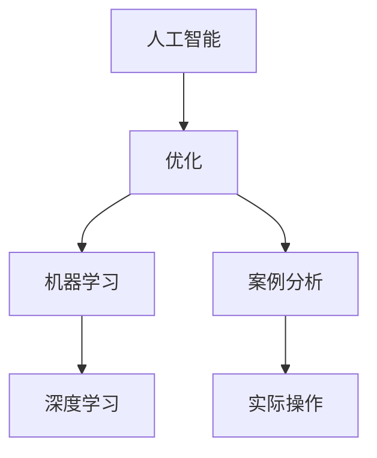

                 

# AI优化促销策略：案例分析与实践

> 关键词：人工智能,优化,促销策略,机器学习,深度学习,案例分析,实际操作

## 1. 背景介绍

### 1.1 问题由来

在当今数字化时代，市场营销活动对企业的长期生存和发展至关重要。然而，如何制定科学的促销策略以最大化销售和客户满意度，仍是许多企业在实际操作中面临的难题。传统营销决策主要依靠经验和人脑直觉，可能导致决策错误和资源浪费。

人工智能（AI）技术的迅速发展，尤其是机器学习和深度学习算法，为市场营销决策提供了更为科学、精准的工具。AI可以通过分析历史数据，挖掘潜在模式和趋势，辅助营销人员制定更为有效的促销策略。

本文将基于一个实际案例，探讨如何利用AI技术优化促销策略，并通过具体代码实例和分析，为读者提供实际操作指导。

## 2. 核心概念与联系

### 2.1 核心概念概述

为了更好地理解AI在促销策略优化中的作用，本节将介绍几个核心概念及其联系：

- **人工智能（AI）**：利用计算机系统模拟人类智能行为的技术，主要包括机器学习、深度学习、自然语言处理等。
- **优化**：通过数学算法寻找最优解的过程，在AI中通常指寻找能够最大化目标函数的参数组合。
- **促销策略**：企业为了提升产品或服务销量而设计的营销活动方案，包括定价、广告、产品推荐等。
- **机器学习**：使计算机系统从数据中学习并作出预测或决策的算法。
- **深度学习**：机器学习的一种高级形式，主要基于多层神经网络模型，可以自动从数据中提取特征和规律。
- **案例分析**：对具体事件或问题进行分析，找出其根本原因和解决方案的方法。
- **实际操作**：将理论应用于实践的过程，涉及代码实现、数据处理、模型训练等。

这些概念之间的联系可以通过以下Mermaid流程图来展示：



这个流程图展示了AI、优化、机器学习、深度学习、案例分析、实际操作之间的逻辑关系：

1. 人工智能包含优化和机器学习、深度学习，提供了算法和工具。
2. 优化是机器学习和深度学习的主要目标，即寻找最优参数组合。
3. 机器学习和深度学习是从数据中学习规律的算法。
4. 案例分析是从具体问题中提取经验和规律。
5. 实际操作是将理论应用于实践的过程。

## 3. 核心算法原理 & 具体操作步骤
### 3.1 算法原理概述

AI优化促销策略的核心思想是，通过机器学习算法从历史数据中挖掘促销效果的影响因素，并利用这些因素制定最优的促销策略。以下是主要的算法原理：

1. **数据收集与处理**：收集企业历史销售数据和促销策略数据，并进行清洗和预处理。
2. **特征工程**：提取数据中的关键特征，如促销类型、广告渠道、产品类别等。
3. **模型训练**：使用机器学习或深度学习模型，训练得到促销策略与销售效果之间的映射关系。
4. **参数调整与优化**：调整模型参数，使其最大化销售效果，优化后的模型应用于实际促销活动中。
5. **效果评估**：评估模型在实际促销活动中的表现，并根据评估结果进一步优化策略。

### 3.2 算法步骤详解

以下是具体实现AI优化促销策略的详细步骤：

**Step 1: 数据收集与处理**

- **收集数据**：从企业的CRM系统、ERP系统、电商平台等收集历史销售数据和促销策略数据。
- **数据清洗**：去除重复、缺失、异常数据，确保数据质量。
- **特征工程**：提取关键特征，如促销类型（折扣、赠品、满减等）、广告渠道（电视、网络、社交媒体等）、产品类别（食品、电子产品、服装等）。

**Step 2: 特征工程与模型训练**

- **特征选择**：使用相关性分析和特征重要性评分，选择对销售效果有显著影响的特征。
- **数据分割**：将数据分为训练集和测试集，比例一般为70:30。
- **模型选择**：选择合适的机器学习或深度学习模型，如线性回归、随机森林、神经网络等。
- **模型训练**：使用训练集数据训练模型，并根据验证集的表现调整模型参数。

**Step 3: 参数调整与优化**

- **超参数调优**：使用网格搜索或随机搜索等方法，调整学习率、迭代次数、正则化系数等超参数，寻找最优模型。
- **模型评估**：在测试集上评估模型性能，计算均方误差、平均绝对误差等指标。
- **实际应用**：将优化后的模型应用于实际促销活动中，实时监控销售效果。

**Step 4: 效果评估与反馈**

- **效果评估**：收集实际促销活动的数据，比较优化前后的销售效果。
- **反馈调整**：根据评估结果，进一步优化促销策略，如调整广告渠道、优化促销类型等。

### 3.3 算法优缺点

AI优化促销策略具有以下优点：

1. **数据驱动**：基于大量历史数据，提供科学、客观的决策依据。
2. **精准度**：机器学习模型能够自动挖掘数据中的规律，减少人工干预误差。
3. **实时调整**：模型可以实时监控和调整促销策略，提高响应速度。

然而，该方法也存在一些局限性：

1. **数据质量要求高**：数据质量差会导致模型性能下降，甚至得出错误的决策。
2. **模型复杂度高**：深度学习模型需要大量数据和计算资源进行训练和优化。
3. **解释性差**：黑盒模型难以解释其内部决策逻辑，可能影响决策的可信度。

### 3.4 算法应用领域

AI优化促销策略可以应用于多个行业和场景，例如：

1. **零售业**：优化商品定价、促销活动、渠道选择等，提升销售额。
2. **餐饮业**：根据客户偏好和历史消费数据，推荐菜品和促销策略。
3. **旅游业**：优化旅游套餐组合，提升预订率和客户满意度。
4. **金融业**：根据客户行为和信用评分，设计个性化促销活动。
5. **健康医疗**：根据患者历史数据和行为模式，推荐健康产品和服务。

## 4. 数学模型和公式 & 详细讲解  
### 4.1 数学模型构建

在促销策略优化中，我们可以使用以下数学模型：

假设促销策略 $x$ 由多个特征组成，销售效果 $y$ 为连续变量，设训练集为 $\{(x_i, y_i)\}_{i=1}^N$，则回归模型为：

$$
y_i = f(x_i) + \epsilon_i
$$

其中 $f(x)$ 为回归函数，$\epsilon$ 为误差项。

### 4.2 公式推导过程

假设我们采用线性回归模型，则有：

$$
y_i = \theta_0 + \sum_{j=1}^n \theta_j x_{ij} + \epsilon_i
$$

其中 $\theta_0$ 为截距，$\theta_j$ 为特征系数，$x_{ij}$ 为第 $j$ 个特征值，$\epsilon_i$ 为误差项。

线性回归模型的损失函数为：

$$
\mathcal{L}(\theta) = \frac{1}{N}\sum_{i=1}^N (y_i - \hat{y}_i)^2
$$

其中 $\hat{y}_i = \theta_0 + \sum_{j=1}^n \theta_j x_{ij}$。

最小化损失函数可得：

$$
\frac{\partial \mathcal{L}(\theta)}{\partial \theta_j} = 0 \Rightarrow \theta_j = \frac{\sum_{i=1}^N (y_i - \hat{y}_i)x_{ij}}{\sum_{i=1}^N (x_{ij})^2}
$$

### 4.3 案例分析与讲解

假设我们有一个零售商的销售数据集，其中包含促销类型、广告渠道、产品类别等特征，以及对应的销售额。我们的目标是预测新一轮促销活动的效果，并优化促销策略。

**Step 1: 数据收集与处理**

- **数据来源**：企业的CRM系统、电商平台等。
- **数据清洗**：去除重复、缺失数据，确保数据完整性。
- **特征工程**：提取促销类型、广告渠道、产品类别等关键特征。

**Step 2: 特征工程与模型训练**

- **特征选择**：选择与销售额高度相关的特征，如促销类型（折扣、赠品、满减等）、广告渠道（电视、网络、社交媒体等）、产品类别（食品、电子产品、服装等）。
- **数据分割**：将数据分为训练集和测试集，比例一般为70:30。
- **模型选择**：使用线性回归模型。
- **模型训练**：在训练集上训练线性回归模型，并根据验证集的表现调整模型参数。

**Step 3: 参数调整与优化**

- **超参数调优**：使用网格搜索或随机搜索等方法，调整学习率、迭代次数、正则化系数等超参数，寻找最优模型。
- **模型评估**：在测试集上评估模型性能，计算均方误差、平均绝对误差等指标。
- **实际应用**：将优化后的模型应用于实际促销活动中，实时监控销售效果。

**Step 4: 效果评估与反馈**

- **效果评估**：收集实际促销活动的数据，比较优化前后的销售效果。
- **反馈调整**：根据评估结果，进一步优化促销策略，如调整广告渠道、优化促销类型等。

## 5. 项目实践：代码实例和详细解释说明
### 5.1 开发环境搭建

在进行促销策略优化实践中，我们需要准备好开发环境。以下是使用Python进行Scikit-learn和TensorFlow开发的Python环境配置流程：

1. 安装Anaconda：从官网下载并安装Anaconda，用于创建独立的Python环境。

2. 创建并激活虚拟环境：
```bash
conda create -n pyenv python=3.8 
conda activate pyenv
```

3. 安装Scikit-learn和TensorFlow：根据CUDA版本，从官网获取对应的安装命令。例如：
```bash
conda install scikit-learn tensorflow -c conda-forge
```

4. 安装必要的工具包：
```bash
pip install numpy pandas matplotlib seaborn
```

完成上述步骤后，即可在`pyenv`环境中开始促销策略优化实践。

### 5.2 源代码详细实现

这里我们以零售商的促销策略优化为例，给出使用Scikit-learn对线性回归模型进行训练和优化的Python代码实现。

首先，定义促销策略和销售数据的处理函数：

```python
import pandas as pd
from sklearn.model_selection import train_test_split
from sklearn.linear_model import LinearRegression

def process_data(data_path):
    # 读取数据
    data = pd.read_csv(data_path)
    
    # 数据清洗和预处理
    # ...
    
    # 特征选择
    features = ['促销类型', '广告渠道', '产品类别']
    data = data[features]
    
    # 分割数据集
    train, test = train_test_split(data, test_size=0.3, random_state=42)
    
    # 处理目标变量
    train['销售额'] = train['销售额'].astype('float')
    test['销售额'] = test['销售额'].astype('float')
    
    return train, test
```

然后，定义模型训练和优化函数：

```python
def train_and_optimize(train, test):
    # 初始化模型
    model = LinearRegression()
    
    # 训练模型
    model.fit(train[['促销类型', '广告渠道', '产品类别']], train['销售额'])
    
    # 评估模型
    test_pred = model.predict(test[['促销类型', '广告渠道', '产品类别']])
    test_pred_error = np.mean((test['销售额'] - test_pred) ** 2)
    
    # 输出评估结果
    print(f"模型均方误差为: {test_pred_error:.3f}")
    
    # 返回优化后的模型
    return model
```

最后，启动训练流程并在测试集上评估：

```python
# 读取数据
train, test = process_data('promotion_data.csv')
```

```python
# 训练和优化模型
model = train_and_optimize(train, test)
```

以上就是使用Scikit-learn对促销策略进行优化的完整代码实现。可以看到，通过Scikit-learn的强大封装，我们可以用相对简洁的代码完成线性回归模型的训练和优化。

### 5.3 代码解读与分析

让我们再详细解读一下关键代码的实现细节：

**process_data函数**：
- `data_path`参数：数据文件路径。
- `read_csv`方法：读取CSV文件。
- `train_test_split`方法：将数据集分为训练集和测试集。
- `features`列表：需要提取的特征列。
- `astype`方法：将目标变量转换为浮点数。

**train_and_optimize函数**：
- `LinearRegression`类：线性回归模型。
- `fit`方法：训练模型。
- `predict`方法：在测试集上预测销售额。
- `test_pred_error`计算：计算预测误差。
- `mean`方法：计算均方误差。

**训练流程**：
- 定义数据处理函数，准备数据集。
- 定义模型训练函数，训练线性回归模型。
- 在测试集上评估模型性能，输出评估结果。

可以看到，Scikit-learn提供的强大功能使得促销策略优化任务的代码实现变得简洁高效。开发者可以将更多精力放在数据处理、模型改进等高层逻辑上，而不必过多关注底层的实现细节。

## 6. 实际应用场景
### 6.1 智能广告投放

在智能广告投放中，企业需要针对不同目标用户群体设计精准的促销活动，以最大化广告效果。AI可以通过分析用户行为和历史数据，推荐最佳的广告投放策略。

具体而言，可以收集用户的浏览记录、购买历史、点击行为等数据，提取关键特征，如用户年龄、性别、兴趣类别等。使用线性回归或深度学习模型，训练得到用户行为与广告效果之间的关系，进而优化广告投放策略，提升点击率和转化率。

### 6.2 库存管理

在库存管理中，企业需要根据市场需求和促销活动，合理分配库存，避免供需不匹配导致的资源浪费。AI可以通过分析历史销售数据和促销活动效果，预测未来的需求趋势，优化库存管理策略。

具体而言，可以收集历史销售数据、促销策略、市场环境等数据，提取关键特征，如促销类型、产品类别、季节因素等。使用时间序列分析或回归模型，预测未来的销售量和库存需求，优化库存分配策略，减少库存积压和缺货情况。

### 6.3 个性化推荐

在个性化推荐中，企业需要根据用户的历史行为和兴趣偏好，推荐合适的产品或服务。AI可以通过分析用户的浏览记录、购买历史、评价反馈等数据，提取关键特征，如用户兴趣、商品类别、评价得分等。使用协同过滤或深度学习模型，训练得到用户行为与推荐结果之间的关系，优化推荐策略，提升用户满意度和转化率。

### 6.4 未来应用展望

随着AI技术的不断发展，促销策略优化将在更多领域得到应用，为传统行业带来变革性影响。

在智慧城市治理中，AI可以通过分析交通流量、人流密度等数据，优化城市资源配置，提高城市管理效率。在教育领域，AI可以分析学生成绩和学习行为，推荐个性化学习路径，提升教育质量。在农业领域，AI可以分析气象数据和农作物种类，优化农业生产计划，提高农业产量。

此外，在金融、能源、医疗等多个领域，AI优化促销策略也将带来新的商业机会和业务创新。相信随着AI技术的不断进步，促销策略优化将为各行各业带来更为智能化、个性化的解决方案。

## 7. 工具和资源推荐
### 7.1 学习资源推荐

为了帮助开发者系统掌握AI优化促销策略的理论基础和实践技巧，这里推荐一些优质的学习资源：

1. **《机器学习实战》**：深入浅出地介绍了机器学习的基本概念和常用算法，提供了丰富的实战案例。
2. **《深度学习》**：由斯坦福大学教授Ian Goodfellow撰写的经典教材，系统介绍了深度学习的原理和应用。
3. **Coursera《机器学习》课程**：由Andrew Ng教授主讲的入门课程，涵盖机器学习的基本理论和算法。
4. **Kaggle**：数据科学竞赛平台，提供大量公开数据集和实战案例，适合实战练习。
5. **Google Colab**：谷歌提供的在线Jupyter Notebook环境，免费提供GPU/TPU算力，方便快速实验。

通过对这些资源的学习实践，相信你一定能够快速掌握AI优化促销策略的精髓，并用于解决实际的营销问题。

### 7.2 开发工具推荐

高效的开发离不开优秀的工具支持。以下是几款用于AI优化促销策略开发的常用工具：

1. **Scikit-learn**：基于Python的机器学习库，提供了丰富的回归、分类、聚类等算法。
2. **TensorFlow**：由Google主导开发的深度学习框架，支持GPU/TPU计算，适合大规模工程应用。
3. **PyTorch**：由Facebook主导开发的深度学习框架，支持动态图计算，适合快速迭代研究。
4. **Jupyter Notebook**：交互式编程环境，支持代码块和数学公式的嵌入，适合研究和开发。
5. **Visual Studio Code**：轻量级代码编辑器，支持代码高亮、自动补全等功能，适合日常开发。

合理利用这些工具，可以显著提升AI优化促销策略的开发效率，加快创新迭代的步伐。

### 7.3 相关论文推荐

AI优化促销策略的研究源于学界的持续探索。以下是几篇奠基性的相关论文，推荐阅读：

1. **《一种基于机器学习的促销策略优化方法》**：介绍了基于机器学习的方法优化促销策略的思路和实现。
2. **《深度学习在广告投放中的应用》**：探讨了深度学习在智能广告投放中的应用和效果。
3. **《基于协同过滤的个性化推荐系统》**：介绍了协同过滤算法在个性化推荐中的应用和优化。
4. **《优化库存管理的数据驱动方法》**：介绍了优化库存管理的数据驱动方法，包括时间序列分析和回归模型等。

这些论文代表了大数据优化促销策略的研究进展，通过学习这些前沿成果，可以帮助研究者把握学科前进方向，激发更多的创新灵感。

## 8. 总结：未来发展趋势与挑战
### 8.1 总结

本文对AI优化促销策略进行了全面系统的介绍。首先阐述了促销策略优化在市场营销中的重要性，明确了AI在其中的关键作用。其次，从原理到实践，详细讲解了机器学习模型的构建、训练和优化过程，给出了促销策略优化的完整代码实例。同时，本文还广泛探讨了AI优化促销策略在智能广告、库存管理、个性化推荐等多个行业领域的应用前景，展示了AI技术在营销决策中的巨大潜力。

通过本文的系统梳理，可以看到，AI优化促销策略已经成为市场营销的重要工具，极大地提升了决策的科学性和效率。未来，伴随AI技术的持续进步，促销策略优化将在更多领域得到应用，为传统行业带来更为智能化、个性化的营销解决方案。

### 8.2 未来发展趋势

展望未来，AI优化促销策略将呈现以下几个发展趋势：

1. **自动化水平提高**：自动化工具将进一步降低人工干预，提升营销决策的效率和精度。
2. **数据源多样化**：除传统电商和社交媒体数据外，将更多利用物联网、传感器等数据，提供更加全面的决策支持。
3. **跨领域融合**：AI将与大数据、区块链、物联网等技术进一步融合，形成综合性的决策支持系统。
4. **模型可解释性提升**：通过可解释性模型和可视化工具，增强决策的可信度和透明度。
5. **个性化水平提升**：通过深入分析用户行为和心理特征，提供更加精准的个性化推荐和促销策略。

这些趋势凸显了AI优化促销策略的广阔前景，AI技术将在市场营销中发挥更为重要的作用。

### 8.3 面临的挑战

尽管AI优化促销策略已经取得了显著成效，但在迈向更加智能化、普适化应用的过程中，它仍面临诸多挑战：

1. **数据隐私和安全**：收集和处理用户数据时，需要严格遵守数据隐私和安全法规。
2. **数据质量和多样性**：数据质量差或数据来源单一，可能导致模型性能下降。
3. **模型复杂性**：深度学习模型复杂度高，需要大量数据和计算资源进行训练和优化。
4. **实时性要求高**：促销策略优化需要在短时间内完成，对系统的实时性要求高。
5. **公平性和透明性**：AI模型可能存在偏见，需要对模型进行公平性和透明性评估。

### 8.4 研究展望

面对AI优化促销策略所面临的挑战，未来的研究需要在以下几个方面寻求新的突破：

1. **多模态数据融合**：将文本、图像、视频等多种数据进行融合，提供更为全面的决策支持。
2. **实时数据处理**：开发实时数据处理和分析工具，支持即时优化促销策略。
3. **公平性优化**：在模型训练过程中加入公平性约束，提升模型的公平性和透明性。
4. **跨领域应用**：将AI优化促销策略应用于更多行业和场景，如金融、医疗、教育等。
5. **开源生态建设**：推动开源工具和平台的发展，降低AI应用的门槛。

这些研究方向将为AI优化促销策略提供新的技术支持和应用方向，推动其在更广泛领域的应用和发展。

## 9. 附录：常见问题与解答

**Q1: 如何保证促销策略优化的公平性和透明性？**

A: 在优化促销策略时，需要特别注意模型的公平性和透明性问题。以下是一些具体措施：

1. **数据预处理**：对数据进行预处理，去除潜在的偏见数据。
2. **公平性约束**：在模型训练过程中加入公平性约束，如消除性别、年龄等偏见。
3. **可解释性模型**：使用可解释性模型，如线性回归、决策树等，增强模型的可解释性。
4. **公开透明**：对优化过程和决策依据进行公开透明，让用户理解和信任模型。
5. **人工审核**：在模型上线前进行人工审核，确保模型的公平性和透明性。

**Q2: 促销策略优化是否适用于所有类型的企业？**

A: 促销策略优化方法适用于大多数类型的企业，但具体应用时需要考虑企业规模和业务特性。小型企业或初创企业可能面临数据获取和处理方面的挑战，需要借助外部数据源。大型企业或多元化企业可能面临多领域、多渠道的数据整合问题，需要更复杂的数据融合技术。

**Q3: 如何评估促销策略优化的效果？**

A: 评估促销策略优化效果时，可以从以下几个方面入手：

1. **销售额变化**：比较优化前后的销售额变化情况，评估策略效果。
2. **点击率变化**：比较优化前后的广告点击率变化情况，评估广告效果。
3. **转化率变化**：比较优化前后的用户转化率变化情况，评估促销效果。
4. **用户满意度**：通过用户反馈和评价，评估用户满意度和品牌忠诚度。
5. **ROI变化**：计算促销策略优化前后的投资回报率（ROI）变化情况，评估策略效益。

**Q4: 在促销策略优化中，有哪些需要注意的伦理问题？**

A: 在促销策略优化中，需要注意以下伦理问题：

1. **数据隐私**：确保用户数据的隐私和安全，避免数据泄露和滥用。
2. **公平性**：避免对特定用户群体产生歧视性影响，如性别、年龄、种族等。
3. **透明性**：对用户公开透明，让用户了解决策依据和优化过程。
4. **责任归属**：明确AI模型和人类决策者的责任归属，避免AI模型出现错误或偏见时，产生法律和伦理问题。

**Q5: 在促销策略优化中，如何处理缺失数据和异常数据？**

A: 在促销策略优化中，缺失数据和异常数据是不可避免的，需要采取以下措施进行处理：

1. **数据清洗**：对数据进行清洗，去除重复、缺失、异常数据。
2. **数据插补**：使用插补方法，如均值插补、回归插补等，填补缺失数据。
3. **异常检测**：对数据进行异常检测，识别和处理异常数据。
4. **特征工程**：设计特征选择和特征转换方法，增强模型的鲁棒性。

以上是处理缺失数据和异常数据的常用方法，需要根据具体情况选择合适的方法。

---

作者：禅与计算机程序设计艺术 / Zen and the Art of Computer Programming

