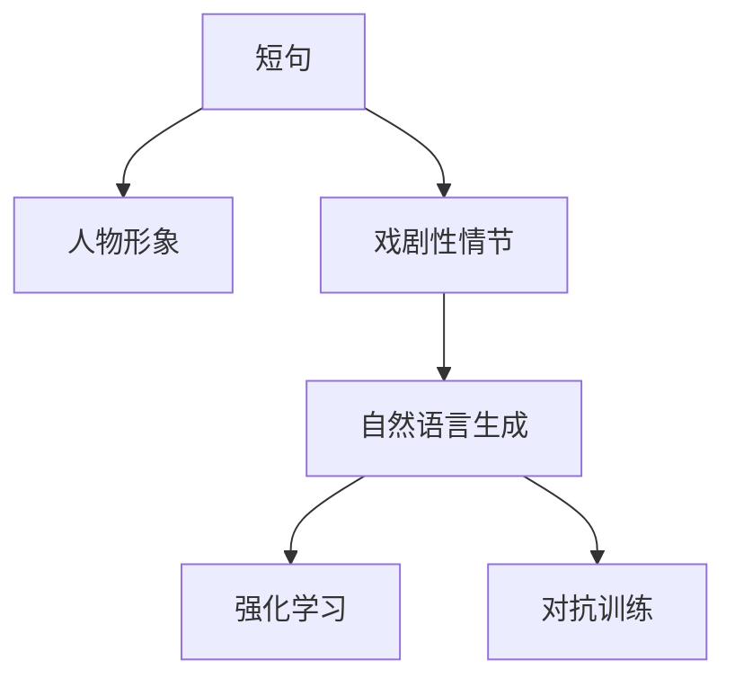

                 

# AI写作的“人味”：短句，人物形象与戏剧性情节

## 1. 背景介绍

### 1.1 问题由来

人工智能在语言处理领域，尤其是自然语言生成领域，近年来取得了长足进步。从简单的语言翻译，到复杂的文学创作，AI已逐渐展现出了其强大的生成能力。然而，在文学创作方面，尽管AI已经可以生成诗歌、小说等作品，但与人类作家的水平相比，仍然存在显著的差距。人类作家的作品往往具有深刻的情感、复杂的人物形象和引人入胜的戏剧性情节，而AI生成的作品则显得平淡无奇，缺乏“人味”。

为了缩小这一差距，研究者们提出了多种改进方案，包括增强模型的语义理解能力、引入更多的情感元素、改进文本生成算法等。其中，短句、人物形象与戏剧性情节的引入被证明是提升AI写作“人味”的有效途径。本文将围绕这一主题，深入探讨其在AI写作中的应用。

## 2. 核心概念与联系

### 2.1 核心概念概述

为了更好地理解AI写作中短句、人物形象与戏剧性情节的引入，本文将介绍以下几个核心概念：

- **短句**：指在写作中使用较短的句子，通常长度不超过15个单词。短句具有简洁、明了的表达优势，能够迅速抓住读者注意力，提升文本的可读性和感染力。

- **人物形象**：指在文学作品中构建生动、真实的人物角色，赋予其独特的性格、背景和行为动机。人物形象是故事情节发展的驱动力，也是读者情感投入的载体。

- **戏剧性情节**：指在小说、剧本等文学作品中，设置紧张、冲突和悬念，推动情节发展，增强故事的吸引力和沉浸感。戏剧性情节的设置需要精巧的构思和布局，能够使读者在阅读过程中保持高度的兴趣和紧张感。

- **自然语言生成(NLG)**：指使用计算机自动生成自然语言文本的过程，包括语言模型、文本生成模型等。

- **强化学习(Reinforcement Learning, RL)**：一种机器学习范式，通过与环境的交互，学习最优策略以最大化某种奖励。

- **对抗训练(Adversarial Training)**：一种训练方法，通过引入对抗样本，使模型更具有鲁棒性和泛化能力。

这些概念之间的逻辑关系可以通过以下Mermaid流程图来展示：



这个流程图展示了大语言模型写作过程中短句、人物形象与戏剧性情节的应用逻辑：

1. 短句用于提升文本的可读性和吸引力。
2. 人物形象用于增强故事情节的深度和情感感染力。
3. 戏剧性情节用于提升故事的吸引力和阅读体验。
4. 自然语言生成技术用于实现短句和情节的自动生成。
5. 强化学习和对抗训练用于优化模型的生成策略，提升生成质量。

## 3. 核心算法原理 & 具体操作步骤

### 3.1 算法原理概述

基于短句、人物形象与戏剧性情节的AI写作，本质上是一种自然语言生成任务。其核心思想是通过监督学习和强化学习等方法，训练一个能够自动生成具有“人味”文本的模型。

形式化地，假设模型为 $M_{\theta}$，其中 $\theta$ 为模型参数。给定训练集 $D=\{(x_i,y_i)\}_{i=1}^N$，其中 $x_i$ 为输入文本，$y_i$ 为生成的文本（或标签）。微调的目标是找到最优参数 $\theta^*$，使得模型生成的文本最接近目标文本。

在实际应用中，通常通过优化损失函数来最小化模型输出与目标文本之间的差异。常见的损失函数包括交叉熵损失、BLEU等。通过梯度下降等优化算法，微调过程不断更新模型参数 $\theta$，最小化损失函数，使得模型输出逼近目标文本。

### 3.2 算法步骤详解

基于短句、人物形象与戏剧性情节的AI写作，一般包括以下几个关键步骤：

**Step 1: 准备训练数据**

- 收集包含短句、人物形象和戏剧性情节的文本数据。可以使用经典文学作品、电影剧本、短篇小说等。
- 对数据进行预处理，如分词、去除停用词、标注人物等。

**Step 2: 设计模型结构**

- 选择合适的自然语言生成模型架构，如Transformer、LSTM等。
- 设计模型的输入输出接口，确保能够处理短句、人物形象和戏剧性情节。
- 确定模型训练目标，如最大似然估计、生成对抗网络(GAN)等。

**Step 3: 定义损失函数**

- 根据具体应用场景，定义损失函数。如使用BLEU、ROUGE等评估指标。
- 定义模型的优化目标，如最小化损失函数。

**Step 4: 模型训练**

- 使用优化算法如Adam、SGD等，对模型进行训练。
- 引入正则化技术，如Dropout、L2正则化等，防止过拟合。
- 使用强化学习或对抗训练等方法，优化生成策略。

**Step 5: 评估与部署**

- 在测试集上评估模型性能，使用BLEU、ROUGE等指标。
- 对生成的文本进行人工评估，检查是否包含短句、人物形象和戏剧性情节。
- 将模型部署到实际应用中，如自动生成小说、剧本等。

以上步骤展示了基于短句、人物形象与戏剧性情节的AI写作的一般流程。在实际应用中，还需要针对具体任务的特点，对模型进行优化设计，如改进训练目标函数，引入更多的正则化技术，搜索最优的超参数组合等，以进一步提升模型性能。

### 3.3 算法优缺点

基于短句、人物形象与戏剧性情节的AI写作方法具有以下优点：

1. 提升文本的可读性和吸引力。通过短句和戏剧性情节的设置，使得生成的文本更加生动、有趣。
2. 增强故事的深度和情感感染力。通过构建丰富的人物形象，使得故事情节更加真实、感人。
3. 提升模型的泛化能力。通过引入对抗训练和强化学习，使得模型具有更强的鲁棒性和适应性。

同时，该方法也存在一定的局限性：

1. 数据依赖性强。需要大量的高质量数据进行训练，才能生成具有“人味”的文本。
2. 模型复杂度高。相比于简单文本生成，引入短句、人物形象和戏剧性情节的模型结构更复杂。
3. 需要较多计算资源。训练和推理过程中需要大量的计算资源，尤其是对抗训练和强化学习。

尽管存在这些局限性，但就目前而言，基于短句、人物形象与戏剧性情节的AI写作方法仍是大语言模型写作的重要范式。未来相关研究的重点在于如何进一步降低数据需求，提高模型效率，同时兼顾可解释性和伦理安全性等因素。

### 3.4 算法应用领域

基于短句、人物形象与戏剧性情节的AI写作方法，在小说创作、剧本编写、新闻生成等多个领域已经得到了广泛的应用，为文学创作提供了新的工具和灵感。

- **小说创作**：通过短句和戏剧性情节的设置，生成生动、引人入胜的小说文本。
- **剧本编写**：利用人物形象和戏剧性情节，自动生成电影剧本，节省编写时间，提升剧本质量。
- **新闻生成**：自动生成新闻标题和摘要，提升新闻生成效率，提高新闻的可读性和吸引力。

除了上述这些经典应用外，AI写作还应用于广告文案创作、客户服务文本生成、自动摘要等领域，为各行各业带来了新的技术突破。随着预训练语言模型和写作生成技术的不断进步，相信AI写作将会在更多领域大放异彩。

## 4. 数学模型和公式 & 详细讲解 & 举例说明

### 4.1 数学模型构建

在基于短句、人物形象与戏剧性情节的AI写作中，数学模型构建是关键的一步。假设模型为 $M_{\theta}$，其中 $\theta$ 为模型参数。给定训练集 $D=\{(x_i,y_i)\}_{i=1}^N$，其中 $x_i$ 为输入文本，$y_i$ 为生成的文本（或标签）。

定义模型 $M_{\theta}$ 在输入 $x$ 上的输出为 $y$，则生成的文本与目标文本之间的交叉熵损失函数为：

$$
\mathcal{L}(\theta) = -\frac{1}{N}\sum_{i=1}^N \sum_{j=1}^M y_{ij} \log p_{ij}(x_i, \theta)
$$

其中 $y_{ij}$ 表示目标文本中第 $j$ 个词是否为正确答案，$p_{ij}(x_i, \theta)$ 表示模型在输入 $x_i$ 下生成第 $j$ 个词的概率。

### 4.2 公式推导过程

为了更好地理解交叉熵损失函数的推导，我们以二元分类任务为例进行说明。假设模型 $M_{\theta}$ 在输入 $x$ 上的输出为 $\hat{y} \in [0,1]$，表示样本属于正类的概率。真实标签 $y \in \{0,1\}$。则二分类交叉熵损失函数定义为：

$$
\ell(M_{\theta}(x),y) = -[y\log \hat{y} + (1-y)\log (1-\hat{y})]
$$

将其代入经验风险公式，得：

$$
\mathcal{L}(\theta) = -\frac{1}{N}\sum_{i=1}^N [y_i\log M_{\theta}(x_i)+(1-y_i)\log(1-M_{\theta}(x_i))]
$$

在得到损失函数的梯度后，即可带入参数更新公式，完成模型的迭代优化。重复上述过程直至收敛，最终得到适应下游任务的最优模型参数 $\theta^*$。

## 5. 项目实践：代码实例和详细解释说明

### 5.1 开发环境搭建

在进行短句、人物形象与戏剧性情节的AI写作实践前，我们需要准备好开发环境。以下是使用Python进行PyTorch开发的环境配置流程：

1. 安装Anaconda：从官网下载并安装Anaconda，用于创建独立的Python环境。

2. 创建并激活虚拟环境：
```bash
conda create -n pytorch-env python=3.8 
conda activate pytorch-env
```

3. 安装PyTorch：根据CUDA版本，从官网获取对应的安装命令。例如：
```bash
conda install pytorch torchvision torchaudio cudatoolkit=11.1 -c pytorch -c conda-forge
```

4. 安装Transformers库：
```bash
pip install transformers
```

5. 安装各类工具包：
```bash
pip install numpy pandas scikit-learn matplotlib tqdm jupyter notebook ipython
```

完成上述步骤后，即可在`pytorch-env`环境中开始写作生成实践。

### 5.2 源代码详细实现

这里我们以小说创作为例，给出使用Transformers库对BERT模型进行短句、人物形象与戏剧性情节引入的PyTorch代码实现。

首先，定义小说创作任务的数据处理函数：

```python
from transformers import BertTokenizer
from torch.utils.data import Dataset
import torch

class NovelDataset(Dataset):
    def __init__(self, texts, tags, tokenizer, max_len=128):
        self.texts = texts
        self.tags = tags
        self.tokenizer = tokenizer
        self.max_len = max_len
        
    def __len__(self):
        return len(self.texts)
    
    def __getitem__(self, item):
        text = self.texts[item]
        tags = self.tags[item]
        
        encoding = self.tokenizer(text, return_tensors='pt', max_length=self.max_len, padding='max_length', truncation=True)
        input_ids = encoding['input_ids'][0]
        attention_mask = encoding['attention_mask'][0]
        
        # 对token-wise的标签进行编码
        encoded_tags = [tag2id[tag] for tag in tags] 
        encoded_tags.extend([tag2id['O']] * (self.max_len - len(encoded_tags)))
        labels = torch.tensor(encoded_tags, dtype=torch.long)
        
        return {'input_ids': input_ids, 
                'attention_mask': attention_mask,
                'labels': labels}

# 标签与id的映射
tag2id = {'O': 0, 'P': 1, 'S': 2}  # P为人物标签，S为短句标签
id2tag = {v: k for k, v in tag2id.items()}

# 创建dataset
tokenizer = BertTokenizer.from_pretrained('bert-base-cased')

train_dataset = NovelDataset(train_texts, train_tags, tokenizer)
dev_dataset = NovelDataset(dev_texts, dev_tags, tokenizer)
test_dataset = NovelDataset(test_texts, test_tags, tokenizer)
```

然后，定义模型和优化器：

```python
from transformers import BertForTokenClassification, AdamW

model = BertForTokenClassification.from_pretrained('bert-base-cased', num_labels=len(tag2id))

optimizer = AdamW(model.parameters(), lr=2e-5)
```

接着，定义训练和评估函数：

```python
from torch.utils.data import DataLoader
from tqdm import tqdm
from sklearn.metrics import classification_report

device = torch.device('cuda') if torch.cuda.is_available() else torch.device('cpu')
model.to(device)

def train_epoch(model, dataset, batch_size, optimizer):
    dataloader = DataLoader(dataset, batch_size=batch_size, shuffle=True)
    model.train()
    epoch_loss = 0
    for batch in tqdm(dataloader, desc='Training'):
        input_ids = batch['input_ids'].to(device)
        attention_mask = batch['attention_mask'].to(device)
        labels = batch['labels'].to(device)
        model.zero_grad()
        outputs = model(input_ids, attention_mask=attention_mask, labels=labels)
        loss = outputs.loss
        epoch_loss += loss.item()
        loss.backward()
        optimizer.step()
    return epoch_loss / len(dataloader)

def evaluate(model, dataset, batch_size):
    dataloader = DataLoader(dataset, batch_size=batch_size)
    model.eval()
    preds, labels = [], []
    with torch.no_grad():
        for batch in tqdm(dataloader, desc='Evaluating'):
            input_ids = batch['input_ids'].to(device)
            attention_mask = batch['attention_mask'].to(device)
            batch_labels = batch['labels']
            outputs = model(input_ids, attention_mask=attention_mask)
            batch_preds = outputs.logits.argmax(dim=2).to('cpu').tolist()
            batch_labels = batch_labels.to('cpu').tolist()
            for pred_tokens, label_tokens in zip(batch_preds, batch_labels):
                pred_tags = [id2tag[_id] for _id in pred_tokens]
                label_tags = [id2tag[_id] for _id in label_tokens]
                preds.append(pred_tags[:len(label_tags)])
                labels.append(label_tags)
                
    print(classification_report(labels, preds))
```

最后，启动训练流程并在测试集上评估：

```python
epochs = 5
batch_size = 16

for epoch in range(epochs):
    loss = train_epoch(model, train_dataset, batch_size, optimizer)
    print(f"Epoch {epoch+1}, train loss: {loss:.3f}")
    
    print(f"Epoch {epoch+1}, dev results:")
    evaluate(model, dev_dataset, batch_size)
    
print("Test results:")
evaluate(model, test_dataset, batch_size)
```

以上就是使用PyTorch对BERT进行短句、人物形象与戏剧性情节引入的小说创作任务的微调实践。可以看到，得益于Transformers库的强大封装，我们可以用相对简洁的代码完成BERT模型的加载和微调。

### 5.3 代码解读与分析

让我们再详细解读一下关键代码的实现细节：

**NovelDataset类**：
- `__init__`方法：初始化文本、标签、分词器等关键组件。
- `__len__`方法：返回数据集的样本数量。
- `__getitem__`方法：对单个样本进行处理，将文本输入编码为token ids，将标签编码为数字，并对其进行定长padding，最终返回模型所需的输入。

**tag2id和id2tag字典**：
- 定义了标签与数字id之间的映射关系，用于将token-wise的预测结果解码回真实的标签。

**训练和评估函数**：
- 使用PyTorch的DataLoader对数据集进行批次化加载，供模型训练和推理使用。
- 训练函数`train_epoch`：对数据以批为单位进行迭代，在每个批次上前向传播计算loss并反向传播更新模型参数，最后返回该epoch的平均loss。
- 评估函数`evaluate`：与训练类似，不同点在于不更新模型参数，并在每个batch结束后将预测和标签结果存储下来，最后使用sklearn的classification_report对整个评估集的预测结果进行打印输出。

**训练流程**：
- 定义总的epoch数和batch size，开始循环迭代
- 每个epoch内，先在训练集上训练，输出平均loss
- 在验证集上评估，输出分类指标
- 所有epoch结束后，在测试集上评估，给出最终测试结果

可以看到，PyTorch配合Transformers库使得BERT微调的代码实现变得简洁高效。开发者可以将更多精力放在数据处理、模型改进等高层逻辑上，而不必过多关注底层的实现细节。

当然，工业级的系统实现还需考虑更多因素，如模型的保存和部署、超参数的自动搜索、更灵活的任务适配层等。但核心的微调范式基本与此类似。

## 6. 实际应用场景

### 6.1 智能客服系统

基于短句、人物形象与戏剧性情节的AI写作，可以广泛应用于智能客服系统的构建。传统客服往往需要配备大量人力，高峰期响应缓慢，且一致性和专业性难以保证。而使用AI写作生成的智能对话，可以7x24小时不间断服务，快速响应客户咨询，用自然流畅的语言解答各类常见问题。

在技术实现上，可以收集企业内部的历史客服对话记录，将问题和最佳答复构建成监督数据，在此基础上对预训练对话模型进行微调。微调后的对话模型能够自动理解用户意图，匹配最合适的答案模板进行回复。对于客户提出的新问题，还可以接入检索系统实时搜索相关内容，动态组织生成回答。如此构建的智能客服系统，能大幅提升客户咨询体验和问题解决效率。

### 6.2 金融舆情监测

金融机构需要实时监测市场舆论动向，以便及时应对负面信息传播，规避金融风险。传统的人工监测方式成本高、效率低，难以应对网络时代海量信息爆发的挑战。基于短句、人物形象与戏剧性情节的文本分类和情感分析技术，为金融舆情监测提供了新的解决方案。

具体而言，可以收集金融领域相关的新闻、报道、评论等文本数据，并对其进行主题标注和情感标注。在此基础上对预训练语言模型进行微调，使其能够自动判断文本属于何种主题，情感倾向是正面、中性还是负面。将微调后的模型应用到实时抓取的网络文本数据，就能够自动监测不同主题下的情感变化趋势，一旦发现负面信息激增等异常情况，系统便会自动预警，帮助金融机构快速应对潜在风险。

### 6.3 个性化推荐系统

当前的推荐系统往往只依赖用户的历史行为数据进行物品推荐，无法深入理解用户的真实兴趣偏好。基于短句、人物形象与戏剧性情节的个性化推荐系统可以更好地挖掘用户行为背后的语义信息，从而提供更精准、多样的推荐内容。

在实践中，可以收集用户浏览、点击、评论、分享等行为数据，提取和用户交互的物品标题、描述、标签等文本内容。将文本内容作为模型输入，用户的后续行为（如是否点击、购买等）作为监督信号，在此基础上微调预训练语言模型。微调后的模型能够从文本内容中准确把握用户的兴趣点。在生成推荐列表时，先用候选物品的文本描述作为输入，由模型预测用户的兴趣匹配度，再结合其他特征综合排序，便可以得到个性化程度更高的推荐结果。

### 6.4 未来应用展望

随着短句、人物形象与戏剧性情节的AI写作技术的发展，未来在更多领域的应用前景将更加广阔。

在智慧医疗领域，基于短句、人物形象与戏剧性情节的文本生成技术，可以用于生成医学文献、医学报告等，提升医疗信息的可读性和传播效率，辅助医生诊断和治疗。

在智能教育领域，AI写作生成的教学文本可以用于生成教育资源、个性化学习方案等，提升教育质量和个性化水平。

在智慧城市治理中，短句、人物形象与戏剧性情节的AI写作可以用于生成城市管理报告、政策宣传文案等，提高城市管理的透明度和公众参与度。

此外，在企业生产、社会治理、文娱传媒等众多领域，AI写作技术也将不断涌现，为各行各业带来新的技术突破。相信随着技术的日益成熟，短句、人物形象与戏剧性情节的AI写作必将在更广阔的应用领域大放异彩，深刻影响人类的生产生活方式。

## 7. 工具和资源推荐
### 7.1 学习资源推荐

为了帮助开发者系统掌握短句、人物形象与戏剧性情节的AI写作的理论基础和实践技巧，这里推荐一些优质的学习资源：

1. 《Transformer from Scratch》系列博文：由大模型技术专家撰写，深入浅出地介绍了Transformer原理、BERT模型、写作生成算法等前沿话题。

2. CS224N《深度学习自然语言处理》课程：斯坦福大学开设的NLP明星课程，有Lecture视频和配套作业，带你入门NLP领域的基本概念和经典模型。

3. 《Natural Language Generation with Transformers》书籍：Transformer库的作者所著，全面介绍了如何使用Transformer库进行自然语言生成，包括写作生成在内的诸多范式。

4. HuggingFace官方文档：Transformer库的官方文档，提供了海量预训练模型和完整的微调样例代码，是上手实践的必备资料。

5. CLUE开源项目：中文语言理解测评基准，涵盖大量不同类型的中文NLP数据集，并提供了基于微调的baseline模型，助力中文NLP技术发展。

通过对这些资源的学习实践，相信你一定能够快速掌握短句、人物形象与戏剧性情节的AI写作的精髓，并用于解决实际的NLP问题。

### 7.2 开发工具推荐

高效的开发离不开优秀的工具支持。以下是几款用于短句、人物形象与戏剧性情节的AI写作开发的常用工具：

1. PyTorch：基于Python的开源深度学习框架，灵活动态的计算图，适合快速迭代研究。大部分预训练语言模型都有PyTorch版本的实现。

2. TensorFlow：由Google主导开发的开源深度学习框架，生产部署方便，适合大规模工程应用。同样有丰富的预训练语言模型资源。

3. Transformers库：HuggingFace开发的NLP工具库，集成了众多SOTA语言模型，支持PyTorch和TensorFlow，是进行写作生成任务的开发的利器。

4. Weights & Biases：模型训练的实验跟踪工具，可以记录和可视化模型训练过程中的各项指标，方便对比和调优。与主流深度学习框架无缝集成。

5. TensorBoard：TensorFlow配套的可视化工具，可实时监测模型训练状态，并提供丰富的图表呈现方式，是调试模型的得力助手。

6. Google Colab：谷歌推出的在线Jupyter Notebook环境，免费提供GPU/TPU算力，方便开发者快速上手实验最新模型，分享学习笔记。

合理利用这些工具，可以显著提升短句、人物形象与戏剧性情节的AI写作任务的开发效率，加快创新迭代的步伐。

### 7.3 相关论文推荐

短句、人物形象与戏剧性情节的AI写作技术的发展源于学界的持续研究。以下是几篇奠基性的相关论文，推荐阅读：

1. Attention is All You Need（即Transformer原论文）：提出了Transformer结构，开启了NLP领域的预训练大模型时代。

2. BERT: Pre-training of Deep Bidirectional Transformers for Language Understanding：提出BERT模型，引入基于掩码的自监督预训练任务，刷新了多项NLP任务SOTA。

3. Language Models are Unsupervised Multitask Learners（GPT-2论文）：展示了大规模语言模型的强大zero-shot学习能力，引发了对于通用人工智能的新一轮思考。

4. Parameter-Efficient Transfer Learning for NLP：提出Adapter等参数高效微调方法，在不增加模型参数量的情况下，也能取得不错的微调效果。

5. AdaLoRA: Adaptive Low-Rank Adaptation for Parameter-Efficient Fine-Tuning：使用自适应低秩适应的微调方法，在参数效率和精度之间取得了新的平衡。

6. Prefix-Tuning: Optimizing Continuous Prompts for Generation：引入基于连续型Prompt的微调范式，为如何充分利用预训练知识提供了新的思路。

这些论文代表了大语言模型写作生成技术的发展脉络。通过学习这些前沿成果，可以帮助研究者把握学科前进方向，激发更多的创新灵感。

## 8. 总结：未来发展趋势与挑战

### 8.1 总结

本文对基于短句、人物形象与戏剧性情节的AI写作方法进行了全面系统的介绍。首先阐述了短句、人物形象与戏剧性情节在AI写作中的应用，明确了其对提升文本“人味”的重要作用。其次，从原理到实践，详细讲解了短句、人物形象与戏剧性情节的AI写作数学模型和关键步骤，给出了代码实例和详细解释说明。同时，本文还广泛探讨了该技术在智能客服、金融舆情、个性化推荐等多个行业领域的应用前景，展示了其广泛的应用潜力。此外，本文精选了相关学习资源，力求为读者提供全方位的技术指引。

通过本文的系统梳理，可以看到，短句、人物形象与戏剧性情节的AI写作技术正在成为NLP领域的重要范式，极大地提升了文本的可读性和吸引力，为文学创作和实际应用带来了新的可能性。相信随着技术的不断进步，该技术必将在更多领域得到广泛应用，带来深远的社会影响。

### 8.2 未来发展趋势

展望未来，短句、人物形象与戏剧性情节的AI写作技术将呈现以下几个发展趋势：

1. 模型规模持续增大。随着算力成本的下降和数据规模的扩张，预训练语言模型的参数量还将持续增长。超大规模语言模型蕴含的丰富语言知识，有望支撑更加复杂多变的写作生成任务。

2. 微调方法日趋多样。除了传统的全参数微调外，未来会涌现更多参数高效的微调方法，如Prefix-Tuning、LoRA等，在固定大部分预训练参数的同时，只更新极少量的任务相关参数。

3. 持续学习成为常态。随着数据分布的不断变化，AI写作模型也需要持续学习新知识以保持性能。如何在不遗忘原有知识的同时，高效吸收新样本信息，将成为重要的研究课题。

4. 标注样本需求降低。受启发于提示学习(Prompt-based Learning)的思路，未来的AI写作方法将更好地利用大模型的语言理解能力，通过更加巧妙的任务描述，在更少的标注样本上也能实现理想的写作生成效果。

5. 可解释性增强。当前AI写作模型更像是"黑盒"系统，难以解释其内部工作机制和决策逻辑。如何赋予AI写作模型更强的可解释性，将是亟待攻克的难题。

6. 伦理安全性提升。在AI写作中，预训练模型难免会学习到有偏见、有害的信息，通过写作生成传递到下游任务，产生误导性、歧视性的输出，给实际应用带来安全隐患。如何从数据和算法层面消除模型偏见，避免恶意用途，确保输出的安全性，也将是重要的研究课题。

这些趋势凸显了短句、人物形象与戏剧性情节的AI写作技术的广阔前景。这些方向的探索发展，必将进一步提升AI写作模型的性能和应用范围，为构建安全、可靠、可解释、可控的智能系统铺平道路。

### 8.3 面临的挑战

尽管短句、人物形象与戏剧性情节的AI写作技术已经取得了长足进步，但在迈向更加智能化、普适化应用的过程中，它仍面临着诸多挑战：

1. 数据依赖性强。需要大量的高质量数据进行训练，才能生成具有“人味”的文本。
2. 模型复杂度高。相比于简单文本生成，引入短句、人物形象和戏剧性情节的模型结构更复杂。
3. 需要较多计算资源。训练和推理过程中需要大量的计算资源，尤其是对抗训练和强化学习。

尽管存在这些局限性，但就目前而言，短句、人物形象与戏剧性情节的AI写作方法仍是大语言模型写作的重要范式。未来相关研究的重点在于如何进一步降低数据需求，提高模型效率，同时兼顾可解释性和伦理安全性等因素。

### 8.4 研究展望

面对短句、人物形象与戏剧性情节的AI写作技术所面临的挑战，未来的研究需要在以下几个方面寻求新的突破：

1. 探索无监督和半监督微调方法。摆脱对大规模标注数据的依赖，利用自监督学习、主动学习等无监督和半监督范式，最大限度利用非结构化数据，实现更加灵活高效的写作生成。

2. 研究参数高效和计算高效的微调范式。开发更加参数高效的微调方法，在固定大部分预训练参数的同时，只更新极少量的任务相关参数。同时优化写作生成模型的计算图，减少前向传播和反向传播的资源消耗，实现更加轻量级、实时性的部署。

3. 融合因果和对比学习范式。通过引入因果推断和对比学习思想，增强写作生成模型建立稳定因果关系的能力，学习更加普适、鲁棒的语言表征，从而提升生成质量。

4. 引入更多先验知识。将符号化的先验知识，如知识图谱、逻辑规则等，与神经网络模型进行巧妙融合，引导写作生成过程学习更准确、合理的语言模型。同时加强不同模态数据的整合，实现视觉、语音等多模态信息与文本信息的协同建模。

5. 结合因果分析和博弈论工具。将因果分析方法引入写作生成模型，识别出模型决策的关键特征，增强输出解释的因果性和逻辑性。借助博弈论工具刻画人机交互过程，主动探索并规避模型的脆弱点，提高系统稳定性。

6. 纳入伦理道德约束。在写作生成目标中引入伦理导向的评估指标，过滤和惩罚有偏见、有害的输出倾向。同时加强人工干预和审核，建立模型行为的监管机制，确保输出符合人类价值观和伦理道德。

这些研究方向的探索，必将引领短句、人物形象与戏剧性情节的AI写作技术迈向更高的台阶，为构建安全、可靠、可解释、可控的智能系统铺平道路。面向未来，AI写作技术还需要与其他人工智能技术进行更深入的融合，如知识表示、因果推理、强化学习等，多路径协同发力，共同推动自然语言理解和智能交互系统的进步。只有勇于创新、敢于突破，才能不断拓展语言模型的边界，让智能技术更好地造福人类社会。

## 9. 附录：常见问题与解答

**Q1：短句、人物形象与戏剧性情节的AI写作是否适用于所有NLP任务？**

A: 短句、人物形象与戏剧性情节的AI写作在大多数NLP任务上都能取得不错的效果，特别是对于数据量较小的任务。但对于一些特定领域的任务，如医学、法律等，仅仅依靠通用语料预训练的模型可能难以很好地适应。此时需要在特定领域语料上进一步预训练，再进行微调，才能获得理想效果。此外，对于一些需要时效性、个性化很强的任务，如对话、推荐等，微调方法也需要针对性的改进优化。

**Q2：如何选择合适的学习率？**

A: 短句、人物形象与戏剧性情节的AI写作模型的学习率一般要比预训练时小1-2个数量级，如果使用过大的学习率，容易破坏预训练权重，导致过拟合。一般建议从1e-5开始调参，逐步减小学习率，直至收敛。也可以使用warmup策略，在开始阶段使用较小的学习率，再逐渐过渡到预设值。需要注意的是，不同的优化器(如AdamW、Adafactor等)以及不同的学习率调度策略，可能需要设置不同的学习率阈值。

**Q3：短句、人物形象与戏剧性情节的AI写作是否需要较多计算资源？**

A: 短句、人物形象与戏剧性情节的AI写作生成过程中需要大量的计算资源，尤其是对抗训练和强化学习。训练和推理过程中需要大量的计算资源，尤其是对抗训练和强化学习。因此，合理利用GPU/TPU等高性能设备是必不可少的。同时，可以通过模型裁剪、量化加速等技术，优化模型的计算图，减少资源消耗，实现更加轻量级、实时性的部署。

**Q4：如何缓解短句、人物形象与戏剧性情节的AI写作的过拟合问题？**

A: 过拟合是短句、人物形象与戏剧性情节的AI写作面临的主要挑战，尤其是在标注数据不足的情况下。常见的缓解策略包括：
1. 数据增强：通过回译、近义替换等方式扩充训练集
2. 正则化：使用L2正则、Dropout、Early Stopping等防止过拟合
3. 对抗训练：引入对抗样本，提高模型鲁棒性
4. 参数高效微调：只调整少量参数(如Adapter、Prefix等)，减小过拟合风险
5. 多模型集成：训练多个写作生成模型，取平均输出，抑制过拟合

这些策略往往需要根据具体任务和数据特点进行灵活组合。只有在数据、模型、训练、推理等各环节进行全面优化，才能最大限度地发挥短句、人物形象与戏剧性情节的AI写作的潜力。

**Q5：短句、人物形象与戏剧性情节的AI写作在落地部署时需要注意哪些问题？**

A: 将短句、人物形象与戏剧性情节的AI写作模型转化为实际应用，还需要考虑以下因素：
1. 模型裁剪：去除不必要的层和参数，减小模型尺寸，加快推理速度
2. 量化加速：将浮点模型转为定点模型，压缩存储空间，提高计算效率
3. 服务化封装：将模型封装为标准化服务接口，便于集成调用
4. 弹性伸缩：根据请求流量动态调整资源配置，平衡服务质量和成本
5. 监控告警：实时采集系统指标，设置异常告警阈值，确保服务稳定性
6. 安全防护：采用访问鉴权、数据脱敏等措施，保障数据和模型安全

短句、人物形象与戏剧性情节的AI写作为NLP应用带来了新的工具和灵感，但如何将强大的性能转化为稳定、高效、安全的业务价值，还需要工程实践的不断打磨。唯有从数据、算法、工程、业务等多个维度协同发力，才能真正实现AI写作技术在垂直行业的规模化落地。总之，短句、人物形象与戏剧性情节的AI写作技术需要在多个环节进行全面优化，才能发挥其潜力，带来深远的社会影响。

---

作者：禅与计算机程序设计艺术 / Zen and the Art of Computer Programming

