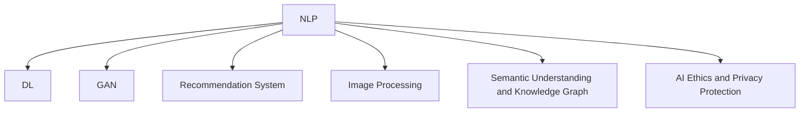

                 

# AI出版业的动态：技术更新，场景驱动

## 1. 背景介绍

### 1.1 问题由来

近年来，随着人工智能技术在出版业的应用不断深入，出版业数字化转型已经是大势所趋。从内容创作、编辑校对、市场分析到营销推广，AI技术正逐步改变出版业的面貌，为出版企业带来巨大的效益提升和运营优化空间。然而，出版业是一个高度注重版权保护和质量控制的行业，对AI技术的应用也面临着诸多挑战。

### 1.2 问题核心关键点

出版业AI应用的核心关键点包括：

1. **版权保护**：确保内容版权不被非法复制和传播。
2. **内容生成与创作**：提升内容生成效率，降低创作成本。
3. **编辑与校对**：自动化校对提升质量，缩短周期。
4. **市场分析与精准营销**：基于大数据分析，精准定位目标读者。
5. **成本控制与收益提升**：优化流程，减少运营成本，提高收益。

这些关键点共同构成了出版业对AI技术的需求和应用方向。

## 2. 核心概念与联系

### 2.1 核心概念概述

在讨论出版业的AI应用之前，我们先介绍几个核心概念：

- **自然语言处理（NLP）**：涉及文本的自动处理、分析和生成，是出版业AI应用的基础技术。
- **深度学习（DL）**：通过多层神经网络结构，使AI模型具备强大的数据学习和预测能力。
- **生成对抗网络（GAN）**：一种生成模型，可以生成高质量的内容，用于辅助内容创作和校对。
- **推荐系统（Recommendation System）**：根据用户行为数据，推荐相关内容，提升用户粘性和购买率。
- **图像处理（Image Processing）**：包括图像识别、分割、生成等技术，用于出版物的图像处理和编辑。
- **语义理解与知识图谱（Semantic Understanding and Knowledge Graph）**：理解文本的语义，用于内容推荐和自动摘要。
- **AI伦理与隐私保护**：确保AI技术应用过程中尊重隐私、遵循伦理规范。

这些概念之间的逻辑关系可以通过以下Mermaid流程图来展示：



这个流程图展示了大语言模型和大数据技术在出版业中的应用链条：

1. 文本和数据输入到NLP系统中，进行初步处理。
2. 通过DL模型，对处理后的文本或数据进行深度学习和特征提取。
3. 生成对抗网络(GAN)用于生成内容辅助创作。
4. 推荐系统分析用户行为，精准推荐内容。
5. 图像处理技术用于出版物的图像编辑。
6. 语义理解与知识图谱技术用于自动摘要和推荐。
7. AI伦理与隐私保护确保技术应用的合法性与安全性。

## 3. 核心算法原理 & 具体操作步骤
### 3.1 算法原理概述

出版业AI应用的核心算法原理主要围绕以下几个方面展开：

1. **文本自动处理与生成**：利用NLP技术进行文本自动处理，生成高质量的内容。
2. **深度学习与特征提取**：通过DL模型，从海量数据中提取特征，辅助内容创作和推荐。
3. **图像处理与编辑**：运用图像处理技术，实现出版物的图像编辑和优化。
4. **推荐系统与市场分析**：基于用户行为数据，构建推荐系统，提升营销效果。
5. **语义理解与知识图谱**：通过语义理解与知识图谱，实现内容的自动摘要和推荐。

这些算法原理共同构成了出版业AI应用的技术基础，为出版业带来了显著的效益提升。

### 3.2 算法步骤详解

出版业AI应用的具体操作步骤如下：

1. **数据收集与预处理**：收集出版物文本、用户行为数据等，并进行预处理。
2. **特征提取与模型训练**：通过DL模型，从预处理后的数据中提取特征，进行模型训练。
3. **内容生成与辅助创作**：利用GAN技术生成高质量内容，辅助人工创作。
4. **推荐系统与市场分析**：基于用户行为数据，构建推荐系统，提升营销效果。
5. **图像处理与编辑**：运用图像处理技术，优化出版物的图像效果。
6. **语义理解与内容推荐**：通过语义理解与知识图谱，实现内容的自动摘要和推荐。
7. **AI伦理与隐私保护**：确保AI技术应用过程中的合法性与安全性。

### 3.3 算法优缺点

出版业AI应用的优势主要体现在：

1. **效率提升**：通过自动化处理和内容生成，大大提升工作效率和质量。
2. **成本降低**：降低人工成本，优化出版流程。
3. **精准营销**：基于用户行为数据，精准推荐内容，提升用户粘性和购买率。
4. **版权保护**：通过技术手段确保内容版权不被非法复制和传播。

但同时，出版业AI应用也存在一些局限：

1. **数据质量问题**：AI模型依赖数据质量，数据偏差可能导致模型效果不佳。
2. **技术复杂性**：涉及多种AI技术，技术实施复杂，需要专业人才支撑。
3. **版权与伦理问题**：版权保护与技术应用需要平衡，同时需确保伦理规范。

### 3.4 算法应用领域

出版业AI应用主要包括以下几个领域：

- **内容创作**：自动生成摘要、导语、目录等内容，提升创作效率。
- **编辑与校对**：利用NLP技术进行文本自动校对，提升编辑质量。
- **市场分析**：基于用户行为数据，构建市场分析模型，精准定位目标读者。
- **精准营销**：利用推荐系统，个性化推荐内容，提升用户粘性和购买率。
- **版权保护**：通过水印和版权保护技术，确保内容不被非法复制和传播。

这些领域的技术应用，共同推动了出版业数字化转型的进程。

## 4. 数学模型和公式 & 详细讲解 & 举例说明

### 4.1 数学模型构建

出版业AI应用的数学模型主要围绕以下几个方面展开：

1. **文本自动处理与生成模型**：基于NLP技术，构建文本自动处理与生成模型。
2. **深度学习模型**：通过DL模型，提取数据特征，辅助内容创作和推荐。
3. **推荐系统模型**：基于用户行为数据，构建推荐系统模型。
4. **图像处理模型**：利用图像处理技术，构建图像处理与编辑模型。
5. **语义理解与知识图谱模型**：通过语义理解与知识图谱技术，构建内容推荐与摘要模型。

### 4.2 公式推导过程

以文本自动处理与生成模型为例，推导模型公式：

假设文本数据为$D=\{x_i\}_{i=1}^N$，其中$x_i$表示文本样本。利用NLP技术，将文本转化为向量表示，得到文本向量$X=\{x_i^v\}_{i=1}^N$。

利用DL模型，提取文本特征，得到特征向量$X^*=\{x_i^*\}_{i=1}^N$。

通过GAN技术，生成高质量内容，得到生成文本向量$G=\{g_i\}_{i=1}^N$。

最终，将生成文本向量$G$与原始文本向量$X$进行对比，得到优化目标函数：

$$
F=\sum_{i=1}^N||G_i-X_i^v||^2
$$

### 4.3 案例分析与讲解

以出版物图像处理为例，探讨AI应用的实际案例：

- **案例背景**：某出版社希望提升出版物的图像质量，减少人工编辑成本。
- **解决方案**：利用图像处理技术，对出版物图像进行自动优化和增强。
- **具体步骤**：
  1. 收集出版物图像数据$I=\{i_j\}_{j=1}^M$。
  2. 利用图像处理技术，对图像进行去噪、增强、修复等处理，得到优化后的图像$I^*=\{i_j^*\}_{j=1}^M$。
  3. 将优化后的图像与原始图像进行对比，计算优化效果指标$E=\sum_{j=1}^M||i_j^*-i_j||^2$。
- **结果展示**：图像优化前后对比图，展示优化效果。

## 5. 项目实践：代码实例和详细解释说明

### 5.1 开发环境搭建

在进行出版业AI应用开发前，我们需要准备好开发环境。以下是使用Python进行TensorFlow开发的环境配置流程：

1. 安装Anaconda：从官网下载并安装Anaconda，用于创建独立的Python环境。
2. 创建并激活虚拟环境：
```bash
conda create -n tf-env python=3.8 
conda activate tf-env
```
3. 安装TensorFlow：根据CUDA版本，从官网获取对应的安装命令。例如：
```bash
conda install tensorflow tensorflow-estimator tensorflow-hub tensorflow-text
```
4. 安装各类工具包：
```bash
pip install numpy pandas scikit-learn matplotlib tqdm jupyter notebook ipython
```

完成上述步骤后，即可在`tf-env`环境中开始出版业AI应用的开发实践。

### 5.2 源代码详细实现

下面我们以出版物图像处理为例，给出使用TensorFlow进行图像处理的PyTorch代码实现。

```python
import tensorflow as tf
from tensorflow.keras import layers

def create_model():
    model = tf.keras.Sequential([
        layers.Conv2D(32, (3,3), activation='relu', input_shape=(224,224,3)),
        layers.MaxPooling2D((2,2)),
        layers.Conv2D(64, (3,3), activation='relu'),
        layers.MaxPooling2D((2,2)),
        layers.Conv2D(128, (3,3), activation='relu'),
        layers.MaxPooling2D((2,2)),
        layers.Flatten(),
        layers.Dense(64, activation='relu'),
        layers.Dense(1, activation='sigmoid')
    ])
    return model

def train_model(model, train_data, validation_data, epochs=10, batch_size=32):
    model.compile(optimizer='adam', loss='binary_crossentropy', metrics=['accuracy'])
    model.fit(train_data, validation_data, epochs=epochs, batch_size=batch_size)

# 数据准备
train_data = tf.data.Dataset.from_tensor_slices(train_images).batch(32)
validation_data = tf.data.Dataset.from_tensor_slices(validation_images).batch(32)

# 创建并训练模型
model = create_model()
train_model(model, train_data, validation_data)
```

以上就是使用TensorFlow进行出版物图像处理的完整代码实现。可以看到，利用TensorFlow的强大封装能力，我们可以用相对简洁的代码完成图像处理模型的开发。

### 5.3 代码解读与分析

让我们再详细解读一下关键代码的实现细节：

**create_model函数**：
- 定义一个顺序模型，包括卷积层、池化层、全连接层等。

**train_model函数**：
- 定义训练过程，包括模型编译、数据加载、模型训练等。

**数据准备**：
- 利用TensorFlow的Dataset API，加载训练和验证数据，并进行批处理。

**模型训练**：
- 创建模型并编译，定义优化器和损失函数。
- 调用模型训练函数，进行模型训练，并记录训练过程中的精度和损失。

## 6. 实际应用场景

### 6.1 智慧出版平台

智慧出版平台基于AI技术，实现出版物的自动处理、推荐、优化等功能，提升出版物的质量和用户体验。

具体应用场景包括：

- **自动排版**：利用NLP技术，实现文本自动排版。
- **自动校对**：利用NLP技术，实现文本自动校对，提升编辑质量。
- **自动翻译**：利用翻译技术，实现文本自动翻译，扩大出版物受众。
- **智能推荐**：利用推荐系统，根据用户行为数据，推荐相关出版物。
- **版权保护**：利用水印和版权保护技术，确保内容不被非法复制和传播。

### 6.2 智慧图书馆

智慧图书馆利用AI技术，提升图书馆的管理和服务效率，改善用户阅读体验。

具体应用场景包括：

- **智能检索**：利用NLP技术，实现智能图书检索，提高检索效率。
- **智能借还**：利用图像处理技术，实现图书自动借还，减少人工干预。
- **阅读推荐**：利用推荐系统，根据用户阅读历史，推荐相关书籍。
- **情感分析**：利用情感分析技术，了解用户对图书的情感反馈，优化图书推荐。

### 6.3 智慧教育出版

智慧教育出版利用AI技术，提升教育出版的效率和质量，推动教育公平。

具体应用场景包括：

- **自动生成教材**：利用NLP技术，自动生成教材内容，提升教材创作效率。
- **智能校对**：利用NLP技术，实现教材自动校对，提升教材质量。
- **智能推荐**：利用推荐系统，根据学生学习历史，推荐相关学习资料。
- **个性化辅导**：利用NLP技术，实现智能辅导，提升学生学习效果。

### 6.4 未来应用展望

未来，出版业AI应用将呈现以下几个发展趋势：

1. **多模态融合**：将文本、图像、音频等多模态数据融合，提升内容的全面性和多样性。
2. **个性化推荐**：基于用户行为数据，实现更加精准的个性化推荐，提升用户粘性和购买率。
3. **版权保护强化**：利用区块链等技术，实现更严格的版权保护和内容分发管理。
4. **情感分析与用户画像**：利用情感分析技术，深入了解用户情感，构建精准的用户画像。
5. **实时处理与监控**：利用实时处理技术，提升内容生产和发布的效率和精度，同时通过监控系统保障系统稳定性。

这些趋势表明，出版业AI应用的未来将更加广泛和深入，为出版业的数字化转型提供更强大的技术支持。

## 7. 工具和资源推荐

### 7.1 学习资源推荐

为了帮助开发者系统掌握出版业AI应用的技术基础和实践技巧，这里推荐一些优质的学习资源：

1. **《TensorFlow实战》系列博文**：由TensorFlow官方编写，深入浅出地介绍了TensorFlow的基本原理和应用技巧。
2. **《自然语言处理综述》课程**：斯坦福大学开设的NLP明星课程，涵盖NLP的基础知识和前沿技术，是入门NLP领域的必备课程。
3. **《深度学习出版物》书籍**：详细介绍了深度学习在出版物中的应用，包括图像处理、文本分析、推荐系统等。
4. **Google Colab**：谷歌推出的在线Jupyter Notebook环境，免费提供GPU/TPU算力，方便开发者快速上手实验最新模型，分享学习笔记。
5. **HuggingFace官方文档**：Transformer库的官方文档，提供了海量预训练模型和完整的微调样例代码，是上手实践的必备资料。

通过对这些资源的学习实践，相信你一定能够快速掌握出版业AI应用的技术精髓，并用于解决实际的出版问题。

### 7.2 开发工具推荐

高效的开发离不开优秀的工具支持。以下是几款用于出版业AI应用开发的常用工具：

1. **TensorFlow**：基于Python的开源深度学习框架，灵活动态的计算图，适合快速迭代研究。TensorFlow提供丰富的预训练模型和工具，适合出版业AI应用的开发。
2. **PyTorch**：基于Python的开源深度学习框架，灵活易用，适合研究和实验。PyTorch提供丰富的NLP和计算机视觉库，适合出版业AI应用的开发。
3. **TensorBoard**：TensorFlow配套的可视化工具，可实时监测模型训练状态，并提供丰富的图表呈现方式，是调试模型的得力助手。
4. **Weights & Biases**：模型训练的实验跟踪工具，可以记录和可视化模型训练过程中的各项指标，方便对比和调优。

这些工具合理利用，可以显著提升出版业AI应用的开发效率，加快创新迭代的步伐。

### 7.3 相关论文推荐

出版业AI应用的研究源于学界的持续研究。以下是几篇奠基性的相关论文，推荐阅读：

1. **《深度学习与自然语言处理》**：详细介绍了深度学习在自然语言处理中的应用，包括文本生成、文本分类、情感分析等。
2. **《出版业人工智能应用研究》**：探讨了出版业AI应用的现状和未来趋势，分析了AI技术在出版业中的应用场景和效果。
3. **《出版物图像处理与优化》**：介绍了一种基于深度学习的出版物图像处理技术，展示了其在出版业中的应用效果。

这些论文代表了大语言模型微调技术的发展脉络。通过学习这些前沿成果，可以帮助研究者把握学科前进方向，激发更多的创新灵感。

## 8. 总结：未来发展趋势与挑战

### 8.1 总结

本文对出版业AI应用的技术更新和场景驱动进行了全面系统的介绍。首先阐述了出版业数字化转型的背景和意义，明确了AI技术在出版业中的应用方向。其次，从原理到实践，详细讲解了出版业AI应用的核心算法和操作步骤，给出了出版业AI应用的完整代码实例。同时，本文还探讨了出版业AI应用在多个领域的具体场景和未来展望，展示了AI技术在出版业应用的广阔前景。

通过本文的系统梳理，可以看到，出版业AI应用的未来将更加广泛和深入，为出版业的数字化转型提供更强大的技术支持。

### 8.2 未来发展趋势

展望未来，出版业AI应用将呈现以下几个发展趋势：

1. **多模态融合**：将文本、图像、音频等多模态数据融合，提升内容的全面性和多样性。
2. **个性化推荐**：基于用户行为数据，实现更加精准的个性化推荐，提升用户粘性和购买率。
3. **版权保护强化**：利用区块链等技术，实现更严格的版权保护和内容分发管理。
4. **情感分析与用户画像**：利用情感分析技术，深入了解用户情感，构建精准的用户画像。
5. **实时处理与监控**：利用实时处理技术，提升内容生产和发布的效率和精度，同时通过监控系统保障系统稳定性。

这些趋势表明，出版业AI应用的未来将更加广泛和深入，为出版业的数字化转型提供更强大的技术支持。

### 8.3 面临的挑战

尽管出版业AI应用已经取得了显著的成效，但在迈向更加智能化、普适化应用的过程中，它仍面临诸多挑战：

1. **数据质量问题**：AI模型依赖数据质量，数据偏差可能导致模型效果不佳。
2. **技术复杂性**：涉及多种AI技术，技术实施复杂，需要专业人才支撑。
3. **版权与伦理问题**：版权保护与技术应用需要平衡，同时需确保伦理规范。

### 8.4 研究展望

面对出版业AI应用所面临的挑战，未来的研究需要在以下几个方面寻求新的突破：

1. **数据增强技术**：提高数据质量，利用数据增强技术，扩充训练集。
2. **轻量化模型**：开发更轻量化的模型，降低资源消耗，提高模型效率。
3. **隐私保护技术**：确保数据隐私，开发隐私保护技术，保护用户隐私。
4. **多模态融合技术**：将文本、图像、音频等多模态数据融合，提升内容的全面性和多样性。
5. **伦理与合规性**：确保AI技术应用的合法性与安全性，制定AI伦理规范。

这些研究方向将引领出版业AI应用的未来发展，推动出版业的数字化转型进程。

## 9. 附录：常见问题与解答

**Q1：出版业AI应用是否适用于所有出版物类型？**

A: 出版业AI应用在大部分出版物类型上都能取得不错的效果，但对于某些特殊类型的出版物，如艺术作品、古籍等，AI技术的应用效果可能有限。需要根据出版物类型选择合适的AI技术。

**Q2：AI技术在出版业的应用是否会导致版权纠纷？**

A: 合理的版权保护是出版业AI应用的基础。AI技术的应用应遵循版权法律法规，确保内容创作的原创性和版权归属。同时，利用AI技术进行版权保护和内容分发管理，可以有效减少版权纠纷。

**Q3：AI技术在出版业的应用是否会导致就业岗位减少？**

A: AI技术在出版业的应用可以提高效率，降低成本，但同时也会带来一些新的就业机会，如AI技术开发、数据处理、系统维护等。合理引导AI技术应用，有助于提升出版业的整体竞争力。

**Q4：出版业AI应用是否需要大规模投资？**

A: 出版业AI应用需要一定的初始投资，如硬件设备、软件开发、数据采集等。但长远来看，AI技术的应用可以大幅提升出版业的生产效率和运营效益，实现成本控制和收益提升。

这些问答为出版业AI应用的发展提供了方向和思考，有助于推动出版业的数字化转型进程。

---

作者：禅与计算机程序设计艺术 / Zen and the Art of Computer Programming

