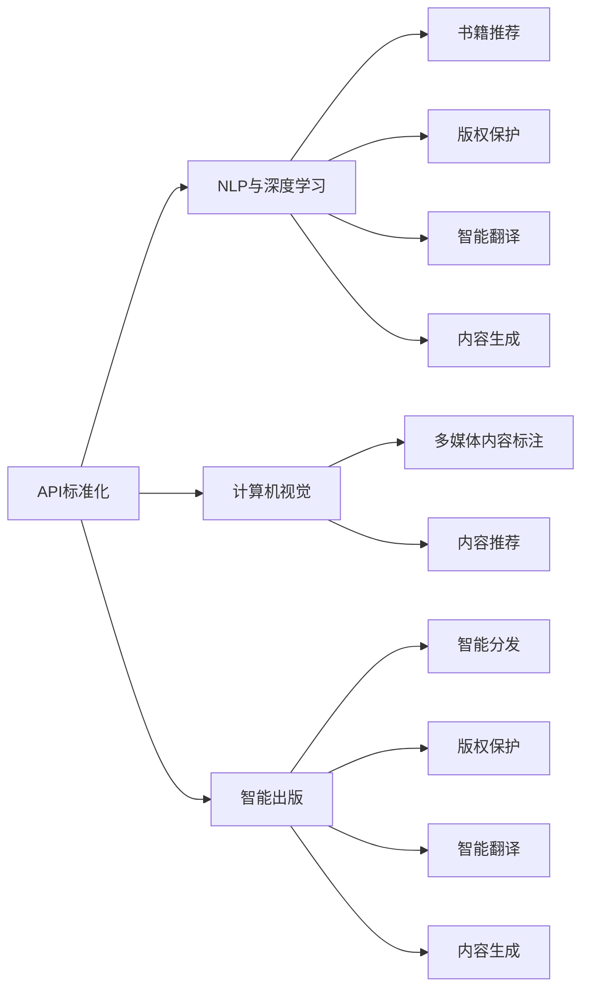

                 

# AI出版业的开发：API标准化，场景丰富

> 关键词：API标准化, 出版业, 人工智能, 机器学习, 深度学习, 自然语言处理, 图像识别, 场景丰富, 智能出版

## 1. 背景介绍

随着人工智能技术的不断发展和应用，出版业也在经历着前所未有的变革。从传统的纸质书籍到电子书的演变，再到多媒体内容的崛起，出版业正在逐步数字化、智能化。AI技术，尤其是自然语言处理(NLP)、计算机视觉、机器学习等，为出版业带来了更多的可能性。AI出版业的发展，不再局限于文字的编辑和排版，而是延伸到了内容的生成、推荐、分发、版权保护等多个环节。

API（Application Programming Interface，应用程序接口）作为连接不同系统和服务的桥梁，在AI出版业的发展中扮演着至关重要的角色。API标准化是确保不同系统之间数据流畅互通的基础，也是AI出版业开发的关键环节。通过API标准化，出版商、作者、读者、服务商可以无缝地协作和互动，实现内容的高效生成、分发和增值服务。

本文将从API标准化的角度，探讨AI出版业开发的核心概念、关键算法、操作步骤、场景应用等，以期为行业同仁提供借鉴。

## 2. 核心概念与联系

### 2.1 核心概念概述

在探讨AI出版业的API标准化时，我们需要了解以下几个关键概念：

- **API标准化**：确保不同系统间数据传输和操作的一致性和规范性，减少数据不兼容和误解的风险。
- **NLP与深度学习**：自然语言处理和深度学习技术，用于文本内容的生成、理解和分析。
- **计算机视觉**：图像识别、处理和分析技术，用于多媒体内容的生成、标注和推荐。
- **智能出版**：基于AI技术，实现内容的智能化生成、推荐、分发、版权保护等功能。
- **场景丰富**：AI出版业覆盖的应用场景广泛，包括书籍推荐、版权保护、智能翻译、内容生成等。

这些概念之间存在紧密联系，API标准化是连接不同技术和场景的纽带，而NLP和深度学习、计算机视觉等技术则是实现智能化内容生成和处理的核心工具。智能出版的发展，离不开API标准化的支撑。

### 2.2 核心概念原理和架构的 Mermaid 流程图



该图展示了API标准化与NLP、深度学习、计算机视觉、智能出版等技术之间的关系，以及它们各自的应用场景。

## 3. 核心算法原理 & 具体操作步骤

### 3.1 算法原理概述

API标准化在AI出版业中的核心算法原理主要包括：

- **接口设计**：定义接口的请求和响应格式、参数、返回值等，确保接口的一致性和可复用性。
- **数据标准化**：将不同来源、格式的数据统一转换为标准格式，便于系统间的互操作。
- **安全性**：采用加密、鉴权等手段，确保数据传输的安全性。
- **性能优化**：通过缓存、负载均衡等技术，提高API的响应速度和吞吐量。

### 3.2 算法步骤详解

以下是API标准化在AI出版业开发中的详细步骤：

1. **需求分析**：明确API的功能和数据要求，包括接口类型、参数、返回值等。
2. **接口设计**：根据需求，设计API接口的请求和响应格式，定义参数和返回值。
3. **数据标准化**：设计数据标准化流程，将不同来源、格式的数据转换为标准格式。
4. **安全性设计**：采用加密、鉴权等手段，确保数据传输的安全性。
5. **性能优化**：采用缓存、负载均衡等技术，提高API的响应速度和吞吐量。
6. **测试与验证**：对API进行测试，验证其功能、安全性和性能是否满足预期。
7. **部署与监控**：将API部署到生产环境，设置监控机制，实时跟踪API性能和安全性。

### 3.3 算法优缺点

API标准化的优缺点如下：

**优点**：
- 确保数据一致性，减少数据不兼容和误解的风险。
- 提高系统间互操作性，促进数据共享和协作。
- 提高开发效率，减少重复开发。

**缺点**：
- 设计和实现过程复杂，需要协调多方需求。
- 需要持续维护和更新，以适应技术变化和业务需求。
- 安全性和性能问题需持续关注和优化。

### 3.4 算法应用领域

API标准化在AI出版业中的应用领域包括：

- **内容生成与推荐**：通过API，实现内容的智能化生成和推荐。
- **版权保护**：通过API，实现版权信息的自动标注和版权保护。
- **智能翻译**：通过API，实现文本和多媒体内容的智能翻译。
- **智能分发**：通过API，实现内容的智能分发和个性化推荐。
- **多媒体内容标注**：通过API，实现图像、视频等多媒体内容的自动标注。

## 4. 数学模型和公式 & 详细讲解 & 举例说明

### 4.1 数学模型构建

在AI出版业中，API标准化的数学模型构建主要包括：

- **接口设计**：定义接口的请求和响应格式，包括参数、返回值等。
- **数据标准化**：定义数据转换规则，将不同格式的数据转换为标准格式。
- **安全性设计**：定义加密、鉴权算法，确保数据传输的安全性。
- **性能优化**：定义缓存策略、负载均衡算法，提高API的响应速度和吞吐量。

### 4.2 公式推导过程

以下是API标准化中常用的数学公式和推导过程：

**数据标准化公式**：
$$
\text{Standardized Data} = f(\text{Raw Data}, \text{Standard Template})
$$

**加密算法公式**：
$$
\text{Encrypted Data} = \text{Encrypt}(plaintext, key)
$$

**鉴权算法公式**：
$$
\text{Authentic} = \text{Verify}(\text{Signature}, public\_key, message)
$$

**性能优化公式**：
$$
\text{Optimized Response Time} = \text{Min}(\text{Response Time}, \text{Cache Hit Rate}, \text{Load Balancing Efficiency})
$$

### 4.3 案例分析与讲解

**案例1：书籍推荐API设计**

书籍推荐API需要考虑以下因素：
- 书籍信息的获取：通过API获取书籍的标题、作者、简介等。
- 用户信息的获取：通过API获取用户的阅读偏好、历史阅读记录等。
- 推荐算法的实现：通过API调用推荐算法，生成个性化推荐结果。

API设计如下：

```json
GET /recommend-books?user_id=123456&genre=fantasy
```

- `user_id`：用户ID，用于获取用户信息。
- `genre`：书籍类型，用于筛选推荐书籍。

**案例2：版权保护API设计**

版权保护API需要考虑以下因素：
- 版权信息的获取：通过API获取版权信息，如作者、版权期限等。
- 版权声明的生成：通过API生成版权声明，用于标注多媒体内容。
- 版权监测的实现：通过API监测版权信息，防止侵权行为。

API设计如下：

```json
POST /protect-copyright?content_id=123456&author=john_doe
```

- `content_id`：多媒体内容ID，用于获取版权信息。
- `author`：版权人信息，用于生成版权声明。

## 5. 项目实践：代码实例和详细解释说明

### 5.1 开发环境搭建

要进行API标准化的开发，首先需要搭建一个开发环境。以下是Python环境搭建的步骤：

1. **安装Python**：安装最新版本的Python，可以通过Anaconda或Miniconda进行安装。
2. **创建虚拟环境**：创建一个虚拟环境，用于隔离开发和生产环境。
3. **安装必要的库**：安装Flask、requests、numpy、pandas等必要的Python库。

### 5.2 源代码详细实现

以下是Python中实现API标准化的示例代码：

```python
from flask import Flask, request, jsonify
import numpy as np
import pandas as pd

app = Flask(__name__)

@app.route('/recommend-books', methods=['GET'])
def recommend_books():
    user_id = request.args.get('user_id')
    genre = request.args.get('genre')
    
    # 获取用户阅读偏好和历史阅读记录
    user_data = get_user_data(user_id)
    
    # 获取推荐书籍列表
    recommend_books = get_recommend_books(user_data, genre)
    
    # 返回推荐书籍列表
    return jsonify(recommend_books)

@app.route('/protect-copyright', methods=['POST'])
def protect_copyright():
    content_id = request.json.get('content_id')
    author = request.json.get('author')
    
    # 获取多媒体内容
    content = get_content(content_id)
    
    # 生成版权声明
    copyright = generate_copyright(content, author)
    
    # 返回版权声明
    return jsonify(copyright)

if __name__ == '__main__':
    app.run(debug=True)
```

**代码解释**：
- **Flask框架**：使用Flask框架，实现API的路由和响应处理。
- **请求处理**：通过`request`对象获取请求参数和JSON数据。
- **数据获取和处理**：通过`get_user_data`、`get_recommend_books`、`get_content`、`generate_copyright`等函数获取和处理数据。
- **响应处理**：通过`jsonify`函数将数据转换为JSON格式，返回给客户端。

### 5.3 代码解读与分析

**Flask框架**：
Flask是一个轻量级的Python Web框架，用于实现API的路由和请求处理。通过Flask，我们可以方便地定义API接口的URL、请求方法和数据处理逻辑。

**数据获取和处理**：
- `get_user_data`函数：根据用户ID获取用户的阅读偏好和历史阅读记录。
- `get_recommend_books`函数：根据用户数据和书籍类型，生成个性化推荐列表。
- `get_content`函数：根据多媒体内容ID获取内容信息。
- `generate_copyright`函数：根据内容信息和版权人信息，生成版权声明。

**响应处理**：
- `jsonify`函数：将Python对象转换为JSON格式，方便客户端处理。

## 6. 实际应用场景

### 6.1 智能推荐

智能推荐是AI出版业的重要应用场景之一。通过API标准化，可以实现内容的高效推荐。例如，用户在阅读完一本书后，可以通过API获取与其阅读偏好相似的书籍推荐。

**示例场景**：
- 用户阅读《哈利·波特》系列后，希望获取与其阅读偏好相似的书籍。
- 用户通过API请求：`/recommend-books?user_id=123456&genre=fantasy`
- API返回推荐书籍列表：《霍比特人》、《指环王》、《哈利波特与魔法石》等。

### 6.2 版权保护

版权保护是AI出版业的另一个重要应用场景。通过API标准化，可以实现版权信息的自动标注和版权保护。例如，用户上传多媒体内容后，可以通过API获取版权声明，并在内容中自动标注版权信息。

**示例场景**：
- 用户上传一篇文章。
- 用户通过API请求：`/protect-copyright?content_id=123456&author=john_doe`
- API返回版权声明：`版权人：John Doe，版权期限：2021-10-01`。

## 7. 工具和资源推荐

### 7.1 学习资源推荐

为了帮助开发者掌握API标准化的相关知识，以下是一些推荐的学习资源：

- **Flask官方文档**：Flask的官方文档，提供全面的API开发指南和示例代码。
- **RESTful API设计指南**：讲解RESTful API的设计原则和最佳实践。
- **Python API开发指南**：介绍Python中实现API的标准方法和工具。

### 7.2 开发工具推荐

以下是一些推荐的开发工具：

- **Flask**：轻量级的Python Web框架，适用于实现API接口。
- **requests**：Python中的HTTP库，用于发送HTTP请求和处理响应。
- **numpy**：Python中的科学计算库，用于处理复杂数据。
- **pandas**：Python中的数据分析库，用于处理结构化数据。

### 7.3 相关论文推荐

以下是一些推荐的相关论文：

- **RESTful API设计模式**：介绍RESTful API的设计模式和最佳实践。
- **API标准化与互操作性**：探讨API标准化的重要性和实现方法。
- **智能推荐系统**：介绍智能推荐系统的原理和实现方法。

## 8. 总结：未来发展趋势与挑战

### 8.1 研究成果总结

API标准化在AI出版业中的应用，已经取得了一定的研究成果。通过API标准化，可以确保不同系统间数据流畅互通，提高系统间互操作性，促进数据共享和协作，减少重复开发和数据不兼容的风险。

### 8.2 未来发展趋势

未来的API标准化将呈现以下发展趋势：

1. **微服务架构**：API将越来越多地采用微服务架构，实现更灵活的开发和部署。
2. **容器化部署**：API将越来越多地采用容器化技术，实现更高效的部署和管理。
3. **云原生技术**：API将越来越多地采用云原生技术，实现更灵活和可扩展的部署。
4. **人工智能与API结合**：API将越来越多地结合人工智能技术，实现更智能和自动化的数据处理和分析。
5. **跨平台兼容性**：API将越来越多地支持跨平台兼容性，实现更广泛的设备和服务支持。

### 8.3 面临的挑战

虽然API标准化在AI出版业中已经取得了一定的进展，但仍面临以下挑战：

1. **数据标准化问题**：不同系统间的数据格式和结构差异较大，需要制定统一的数据标准化规范。
2. **安全性和隐私问题**：API的数据传输和存储安全性需要进一步加强，确保数据的隐私和安全性。
3. **性能优化问题**：API的响应速度和吞吐量需要进一步优化，以适应大规模数据处理的需求。
4. **跨语言和跨平台问题**：API需要支持多种语言和平台，以实现更广泛的国际化支持。

### 8.4 研究展望

未来的研究将集中在以下几个方面：

1. **API标准化的新规范**：制定新的API标准化规范，确保不同系统间数据流畅互通。
2. **安全性与隐私保护**：加强API的数据传输和存储安全性，确保数据的隐私和安全性。
3. **性能优化**：优化API的响应速度和吞吐量，实现更高效的部署和管理。
4. **跨语言和跨平台支持**：实现API的跨语言和跨平台支持，实现更广泛的国际化支持。

## 9. 附录：常见问题与解答

**Q1：API标准化需要考虑哪些因素？**

A: API标准化需要考虑以下因素：
- 接口设计：定义接口的请求和响应格式，确保接口的一致性和可复用性。
- 数据标准化：将不同来源、格式的数据转换为标准格式。
- 安全性设计：采用加密、鉴权等手段，确保数据传输的安全性。
- 性能优化：通过缓存、负载均衡等技术，提高API的响应速度和吞吐量。

**Q2：如何设计API接口？**

A: 设计API接口的步骤如下：
1. 明确API的功能和数据要求，包括接口类型、参数、返回值等。
2. 根据需求，设计API接口的请求和响应格式。
3. 定义数据转换规则，将不同格式的数据转换为标准格式。
4. 设计加密、鉴权算法，确保数据传输的安全性。
5. 定义缓存策略、负载均衡算法，提高API的响应速度和吞吐量。

**Q3：API标准化在AI出版业中的作用是什么？**

A: API标准化在AI出版业中的作用包括：
- 确保不同系统间数据流畅互通，减少数据不兼容和误解的风险。
- 提高系统间互操作性，促进数据共享和协作。
- 提高开发效率，减少重复开发。

通过本文的系统梳理，我们可以看到，API标准化是AI出版业开发的关键环节。它不仅确保了数据的一致性和安全性，还促进了系统间的协作和互操作，为AI出版业的发展提供了坚实的基础。未来，随着API标准化的不断演进和完善，AI出版业必将迎来更大的发展机遇。

