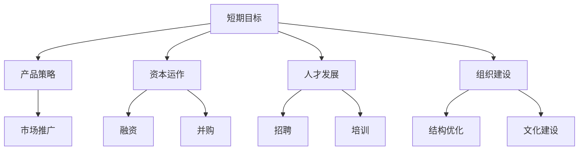

                 

# AI创业公司如何平衡短期与长期目标?

> 关键词：AI创业公司, 短期目标, 长期目标, 策略平衡, 增长模型, 产品策略, 资本运作, 人才发展

## 1. 背景介绍

### 1.1 问题由来

随着人工智能(AI)技术的快速发展和应用，越来越多的创业公司致力于利用AI解决行业痛点，提升业务效率和竞争力。然而，与传统行业的创业公司不同，AI创业公司面临更加复杂的运营环境和更大的不确定性，如何在短期资金需求和长期技术积累之间找到平衡，成为困扰创始人和管理层的重大挑战。

### 1.2 问题核心关键点

AI创业公司在平衡短期与长期目标时，需要关注的核心问题包括：

- 如何确保在市场快速变化的环境中，公司能够持续获得投资和客户。
- 如何在快速迭代的产品开发过程中，保持对技术的长期投入和积累。
- 如何建立有效的增长模型，以确保公司的可持续发展。
- 如何培养和保留一支高素质的人才队伍，为公司的长期发展奠定基础。

本文将探讨如何通过合理的产品策略、资本运作、人才发展和组织建设，帮助AI创业公司实现短期和长期目标的平衡。

## 2. 核心概念与联系

### 2.1 核心概念概述

- **AI创业公司**：利用人工智能技术解决具体业务问题的初创企业。
- **短期目标**：指公司为确保资金链稳定、市场份额提升等短期运营目标，需要进行的各种策略调整和操作。
- **长期目标**：指公司为持续技术创新、品牌建设、行业影响力等长期战略目标，需要进行的各种策略规划和技术积累。
- **产品策略**：公司通过产品设计、市场定位、客户服务等策略，确保产品能够快速迭代并满足市场需求。
- **资本运作**：公司通过融资、并购、股权激励等手段，确保资金链的稳定和公司的可持续发展。
- **人才发展**：公司通过招聘、培训、团队建设等措施，确保拥有一支高素质的技术和管理团队。
- **组织建设**：公司通过建立灵活的组织结构、清晰的职责分工等措施，确保团队的高效协作和创新能力。

这些核心概念之间的联系可以通过以下Mermaid流程图来展示：



这个流程图展示了一个AI创业公司需要关注的各个方面及其相互关系。

## 3. 核心算法原理 & 具体操作步骤
### 3.1 算法原理概述

AI创业公司平衡短期与长期目标的策略，本质上是一种动态调整资源分配的过程。其核心思想是：在确保短期生存和市场竞争力的前提下，通过合理的资源分配，逐步实现公司的长期战略目标。

形式化地，假设公司的目标函数为 $f(\mathbf{x})$，其中 $\mathbf{x}$ 为公司资源分配向量，包括资金、人力、技术等。公司的目标是最大化 $f(\mathbf{x})$，同时满足预算约束和市场竞争的要求。

基于以上模型，公司在进行策略规划时，通常需要：

- 确定短期和长期的优先级：如在初期资金紧张时，更注重市场拓展和客户获取；在资金充裕时，更注重技术研发和团队建设。
- 设计灵活的资源分配策略：如在产品开发初期，重点投入市场调研和快速迭代；在产品成熟期，重点投入技术创新和品牌建设。
- 建立动态调整机制：如在市场反馈良好时，增加技术研发投入；在市场反馈不佳时，调整产品策略，重新分配资源。

### 3.2 算法步骤详解

AI创业公司平衡短期与长期目标的策略规划一般包括以下关键步骤：

**Step 1: 制定短期目标**

- 明确公司的短期目标，如确保资金链稳定、提升市场份额等。
- 确定实现短期目标所需的关键指标，如客户获取率、产品使用率、收入增长率等。
- 制定具体的执行计划，包括时间节点、责任分工、资源配置等。

**Step 2: 制定长期目标**

- 明确公司的长期目标，如技术创新、品牌建设、行业影响力等。
- 确定实现长期目标所需的关键指标，如技术专利数、品牌知名度、行业认可度等。
- 制定具体的执行计划，包括时间节点、责任分工、资源配置等。

**Step 3: 确定资源分配优先级**

- 根据公司的资金状况、市场环境等因素，确定短期和长期的资源分配优先级。
- 在初期资金紧张时，更多地关注短期目标的实现；在资金充裕时，平衡短期和长期目标，注重长期投资。
- 在产品迭代初期，更多地关注市场调研和快速迭代；在产品成熟期，注重技术研发和品牌建设。

**Step 4: 设计灵活的资源分配策略**

- 制定灵活的资源分配策略，确保在不同阶段能够动态调整资源配置。
- 在产品开发初期，重点投入市场调研和快速迭代；在产品成熟期，重点投入技术创新和品牌建设。
- 在市场反馈良好时，增加技术研发投入；在市场反馈不佳时，调整产品策略，重新分配资源。

**Step 5: 建立动态调整机制**

- 建立动态调整机制，及时根据市场反馈和公司内部情况调整策略。
- 定期评估短期和长期目标的实现情况，必要时调整资源分配和执行计划。
- 通过数据驱动的决策，确保策略的有效性和灵活性。

以上是AI创业公司平衡短期与长期目标的一般流程。在实际应用中，还需要根据具体公司情况和市场需求，对各步骤进行优化和调整。

### 3.3 算法优缺点

平衡短期与长期目标的策略具有以下优点：

- 能够确保公司在快速变化的市场环境中，持续获得资金和客户。
- 能够平衡公司对短期运营和长期发展的需求，实现可持续发展。
- 能够通过动态调整，确保资源的有效利用，提升整体效率。

同时，该策略也存在一定的局限性：

- 需要较强的策略规划和执行能力，对公司的管理层要求较高。
- 需要及时响应市场变化，灵活调整策略，否则可能错失市场机会。
- 在平衡短期和长期目标时，可能会面临资源分配的冲突和调整的困难。

## 4. 数学模型和公式 & 详细讲解

### 4.1 数学模型构建

假设公司短期目标为 $T_S$，长期目标为 $T_L$，资源分配向量为 $\mathbf{x}$，公司总资源为 $C$。公司的目标函数为最大化 $f(\mathbf{x})$，同时满足预算约束 $C(\mathbf{x}) = \sum_{i=1}^n x_i \leq C$ 和市场竞争约束 $G(\mathbf{x}) = \sum_{i=1}^n g_i x_i \geq G_0$。

数学上，问题可以表示为：

$$
\max f(\mathbf{x}) \\
s.t. \\
C(\mathbf{x}) = \sum_{i=1}^n x_i \leq C \\
G(\mathbf{x}) = \sum_{i=1}^n g_i x_i \geq G_0
$$

其中 $x_i$ 为资源分配量，$g_i$ 为市场竞争要求，$G_0$ 为市场竞争的最低要求。

### 4.2 公式推导过程

目标函数的推导：

假设公司短期目标为市场获取率 $T_S = \frac{M}{C}$，其中 $M$ 为市场获取所需的资源。长期目标为技术创新率 $T_L = \frac{I}{C}$，其中 $I$ 为技术创新所需的资源。则目标函数为：

$$
f(\mathbf{x}) = T_S \cdot \alpha + T_L \cdot \beta
$$

其中 $\alpha$ 为短期目标的权重，$\beta$ 为长期目标的权重。

预算约束的推导：

$$
C(\mathbf{x}) = \sum_{i=1}^n x_i \leq C
$$

市场竞争约束的推导：

$$
G(\mathbf{x}) = \sum_{i=1}^n g_i x_i \geq G_0
$$

### 4.3 案例分析与讲解

假设一家AI创业公司，初期资金紧张，需要快速提升市场份额。短期目标为在6个月内，通过市场推广活动获取5%的市场份额。长期目标为在1年内，获得1项关键技术专利，提升品牌知名度。公司总资源为1000万，其中500万用于短期目标，500万用于长期目标。市场竞争要求为，市场推广活动需要投入200万资源，技术创新需要投入300万资源。

根据上述模型，公司可以制定以下策略：

1. 短期目标：在6个月内，通过市场推广活动获取5%的市场份额，需投入资源 $x_1 = 200$ 万。
2. 长期目标：在1年内，获得1项关键技术专利，提升品牌知名度，需投入资源 $x_2 = 300$ 万。
3. 预算约束：$x_1 + x_2 \leq 1000$。
4. 市场竞争约束：$x_1 \geq 200$，$x_2 \geq 300$。

解此线性规划问题，可得：

- 短期目标资源分配：$x_1 = 500$ 万。
- 长期目标资源分配：$x_2 = 500$ 万。

因此，公司可以按如下策略执行：

1. 短期目标：在6个月内，通过市场推广活动获取5%的市场份额，需投入资源 $x_1 = 500$ 万。
2. 长期目标：在1年内，获得1项关键技术专利，提升品牌知名度，需投入资源 $x_2 = 500$ 万。

## 5. 项目实践：代码实例和详细解释说明
### 5.1 开发环境搭建

在进行策略规划的实践时，需要搭建一个支持数据驱动决策的开发环境。以下是Python环境搭建的基本步骤：

1. 安装Python：从官网下载并安装Python。
2. 安装必要的工具包：如NumPy、Pandas、SciPy、Scikit-learn等。
3. 安装可视化工具：如Matplotlib、Seaborn、Plotly等。
4. 安装数据处理工具：如Pyspark、Dask等。
5. 安装机器学习框架：如TensorFlow、PyTorch、Scikit-learn等。

### 5.2 源代码详细实现

以下是一个简单的Python代码示例，用于进行资源分配策略的线性规划求解：

```python
from scipy.optimize import linprog

# 定义目标函数系数
c = [0.5, 0.5]  # 短期和长期目标的权重

# 定义约束矩阵
A = [[1, 0], [-1, -1]]  # 预算约束和市场竞争约束

# 定义约束常数
b = [1000, -500]  # 预算约束和市场竞争约束的常数

# 定义变量
x = [500, 500]  # 短期和长期目标的资源分配

# 定义目标函数
f = -1 * np.dot(c, x)

# 进行线性规划求解
result = linprog(f, A_ub=A, b_ub=b)

# 输出结果
print(result)
```

### 5.3 代码解读与分析

上述代码中，使用了SciPy库中的linprog函数进行线性规划求解。代码的主要步骤如下：

1. 定义目标函数系数和约束矩阵，表示短期和长期目标的权重和预算约束、市场竞争约束的系数。
2. 定义约束常数，表示预算约束和市场竞争约束的具体数值。
3. 定义变量，表示短期和长期目标的资源分配量。
4. 定义目标函数，表示公司追求的目标函数。
5. 使用linprog函数进行线性规划求解，得到最优的资源分配方案。
6. 输出结果，显示最优的资源分配方案。

## 6. 实际应用场景

### 6.1 智能制造

AI创业公司可以借助AI技术，为制造业企业提供智能制造解决方案。例如，通过传感器采集数据，分析生产线的运行状态，实现预测性维护。短期目标可以设定为快速获取客户，长期目标可以设定为提升产品品质和优化生产流程。通过灵活调整资源分配，平衡短期和长期目标。

### 6.2 医疗健康

AI创业公司可以提供智能诊疗解决方案，如基于AI的影像分析、病历管理等。短期目标可以设定为快速提升市场份额，长期目标可以设定为提升诊疗准确度和医疗服务质量。通过灵活调整资源分配，平衡短期和长期目标。

### 6.3 金融科技

AI创业公司可以提供智能风控和理财服务，如基于AI的风险评估、信用评分等。短期目标可以设定为快速获取客户，长期目标可以设定为提升金融产品的多样性和竞争力。通过灵活调整资源分配，平衡短期和长期目标。

### 6.4 教育培训

AI创业公司可以提供智能教育培训解决方案，如基于AI的个性化学习、智能评估等。短期目标可以设定为快速提升市场份额，长期目标可以设定为提升教育培训的质量和效果。通过灵活调整资源分配，平衡短期和长期目标。

### 6.5 农业科技

AI创业公司可以提供智能农业解决方案，如基于AI的农作物种植管理、病虫害检测等。短期目标可以设定为快速获取客户，长期目标可以设定为提升农业生产的效率和可持续性。通过灵活调整资源分配，平衡短期和长期目标。

## 7. 工具和资源推荐

### 7.1 学习资源推荐

1. 《策略管理：理论与方法》：经典管理学教材，讲解了策略管理的理论和实践方法。
2. 《数据驱动决策：线性规划与优化》：讲解了线性规划的基本理论和实际应用。
3. 《人工智能战略规划》：介绍如何利用AI技术进行企业战略规划和资源分配。
4. 《创业公司策略管理》：讲解了创业公司在不同阶段的策略规划和管理。
5. 《风险投资与创业公司管理》：讲解了创业公司在融资和管理中的风险控制。

### 7.2 开发工具推荐

1. Python：强大的编程语言，广泛用于数据科学、机器学习等领域。
2. Jupyter Notebook：交互式编程环境，支持Python代码的快速执行和可视化。
3. Scipy：用于数学、科学和工程计算的Python库，包括线性代数、优化、信号处理等功能。
4. Pandas：用于数据分析和处理的Python库，支持数据清洗、处理和分析等功能。
5. Matplotlib：用于绘制高质量图表的Python库，支持多种图表类型和自定义样式。

### 7.3 相关论文推荐

1. "The Balancing Act of Strategy and Execution" by Roger Martin：讨论了公司策略与执行之间的平衡问题。
2. "Balancing Cost of Innovation and Speed to Market" by Ramon G. Verreynne：探讨了在创新和市场速度之间寻找平衡的策略。
3. "The Role of Strategy in Entrepreneurial Organizations" by Michael A. Hitt et al.：讨论了策略在创业公司中的重要性。
4. "Balancing Short-Term Goals and Long-Term Vision: A Strategic Framework for Small Business Owners" by Scott Johnson：提供了平衡短期目标和长期愿景的战略框架。
5. "Strategic Alignment and Execution: A Systems Approach to Organizational Management" by Eric M. Albrecht：讨论了组织管理和执行中的战略对齐问题。

## 8. 总结：未来发展趋势与挑战

### 8.1 研究成果总结

本文从理论和实践两个角度，探讨了AI创业公司如何平衡短期与长期目标。通过线性规划模型，展示了如何在预算和市场竞争约束下，合理分配资源，实现短期和长期目标的平衡。

### 8.2 未来发展趋势

1. **智能化水平的提升**：随着AI技术的不断进步，AI创业公司将具备更强的数据分析和决策能力，能够更精准地预测市场变化和客户需求，进一步提升资源分配的灵活性和优化水平。
2. **数据驱动的决策**：未来的AI创业公司将更加依赖数据驱动的决策方法，通过大数据分析和机器学习技术，实现资源的动态调整和优化。
3. **跨领域融合**：AI创业公司将进一步探索与其他领域的交叉应用，如智能制造、智慧医疗等，实现更广泛的价值创造。
4. **可持续发展**：未来的AI创业公司将更加注重可持续发展，通过资源的高效利用和环保技术的引入，实现企业的长期发展和社会责任。

### 8.3 面临的挑战

1. **市场变化的不确定性**：快速变化的市场环境要求AI创业公司具备更强的灵活性和适应能力，以应对不确定性和风险。
2. **技术进步的挑战**：随着技术的不断进步，AI创业公司需要不断更新和升级技术，以保持竞争力。
3. **人才短缺问题**：高素质的技术和管理人才是AI创业公司的重要资源，如何吸引和留住人才将是重要的挑战。
4. **资本市场的波动性**：资本市场的波动性可能会影响AI创业公司的资金链稳定性和战略执行。

### 8.4 研究展望

未来，AI创业公司在平衡短期与长期目标时，需要进一步探索：

1. **动态决策模型的构建**：基于人工智能和机器学习技术，构建动态决策模型，实时调整资源分配，确保决策的及时性和准确性。
2. **跨领域应用场景的探索**：探索AI技术与不同行业的交叉应用，实现更广泛的资源优化和价值创造。
3. **可持续发展目标的实现**：通过引入环保和可持续发展的理念，推动AI创业公司实现长期的可持续发展。

总之，AI创业公司在平衡短期与长期目标时，需要在技术创新、市场竞争、人才发展等多个方面持续努力，才能在快速变化的市场环境中立于不败之地。

## 9. 附录：常见问题与解答

**Q1：如何在短期资金紧张时，确保公司的可持续发展？**

A: 在短期资金紧张时，可以采取以下措施：

1. 优先关注现金流管理，确保公司的资金链稳定。
2. 通过精简开支、优化流程等措施，减少非必要的支出。
3. 积极寻找融资渠道，如天使投资、风险投资、政府补贴等。
4. 通过灵活调整产品策略，快速适应市场需求，提升客户获取率。

**Q2：如何确定短期和长期目标的权重？**

A: 确定短期和长期目标的权重，需要考虑以下因素：

1. 公司的业务阶段和发展目标。如初创阶段，更关注市场拓展和客户获取；成熟阶段，更关注技术创新和品牌建设。
2. 市场环境和竞争态势。如市场竞争激烈时，更注重短期目标；市场竞争较缓时，可以平衡短期和长期目标。
3. 公司内部资源状况。如资金紧张时，更多地关注短期目标；资金充裕时，平衡短期和长期目标。

**Q3：如何平衡短期和长期目标中的资源分配？**

A: 平衡短期和长期目标中的资源分配，可以采取以下措施：

1. 制定灵活的资源分配策略，根据市场反馈和公司内部情况调整资源分配。
2. 在产品开发初期，重点投入市场调研和快速迭代；在产品成熟期，注重技术研发和品牌建设。
3. 在市场反馈良好时，增加技术研发投入；在市场反馈不佳时，调整产品策略，重新分配资源。

**Q4：如何在多目标优化中，确保策略的有效性和灵活性？**

A: 在多目标优化中，确保策略的有效性和灵活性，可以采取以下措施：

1. 建立数据驱动的决策机制，通过实时数据监控和分析，及时调整策略。
2. 定期评估短期和长期目标的实现情况，必要时调整资源分配和执行计划。
3. 引入风险控制机制，确保策略的稳健性和可持续性。

---

作者：禅与计算机程序设计艺术 / Zen and the Art of Computer Programming

