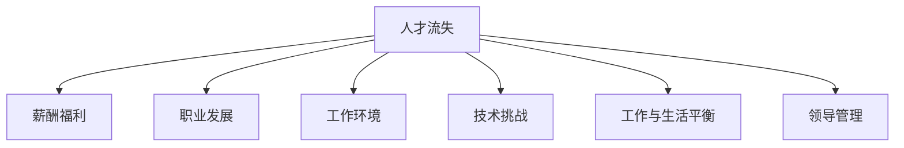

                 

# AI创业公司如何应对人才流失?

## 1. 背景介绍

### 1.1 问题由来
人工智能(AI)正逐渐渗透到各行各业，成为推动技术进步和社会发展的关键力量。然而，在AI创业公司中，人才流失问题日益突出，影响到了企业的长期发展和竞争力。根据一项调查，美国科技公司每年平均流失25%的员工，其中90%的离职者表示他们在寻找更好的发展机会。

人才流失不仅增加了公司的招聘和培训成本，也破坏了团队的稳定性，阻碍了AI技术的持续创新和应用。因此，如何有效地应对人才流失，成为AI创业公司必须重视的课题。

### 1.2 问题核心关键点
AI创业公司的人才流失主要原因包括：
- **薪酬福利**：公司薪酬水平偏低，员工感觉付出与回报不成正比。
- **职业发展**：公司缺乏职业发展路径，员工难以看到长远发展的机会。
- **工作环境**：公司文化不良，团队氛围紧张，员工工作压力大。
- **技术挑战**：技术难度大，员工难以克服技术瓶颈，成长受限。
- **工作与生活平衡**：公司过度重视工作成果，员工难以平衡工作与生活。
- **领导管理**：领导层缺乏激励机制，员工工作动力不足。

这些问题相互交织，共同构成了AI创业公司人才流失的核心原因。如何针对这些关键点，制定系统的解决方案，是本文探讨的重点。

## 2. 核心概念与联系

### 2.1 核心概念概述

为更好地理解AI创业公司人才流失的原因和应对策略，本节将介绍几个密切相关的核心概念：

- **人才流失**：指员工从公司主动或被动离职的现象。
- **薪酬福利**：员工收入、福利待遇的总称，直接影响员工对工作的满意度和忠诚度。
- **职业发展**：员工在公司的晋升和职业成长路径，影响员工对公司的认同感和归属感。
- **工作环境**：包括公司文化、团队氛围、领导管理等方面，决定员工的工作状态和心理感受。
- **技术挑战**：AI领域的复杂性和高难度，使得员工面临重大的技术难题和成长压力。
- **工作与生活平衡**：员工在工作时间和生活时间上的分配和调整，影响员工的生活质量和心理健康。
- **领导管理**：公司领导的激励机制、沟通方式、决策能力等，直接影响员工的工作动力和满意度。

这些核心概念之间的逻辑关系可以通过以下Mermaid流程图来展示：



这个流程图展示了大公司人才流失的各个关键点及其相互关系：

1. **薪酬福利**：直接影响员工的工作满意度，是吸引和留住人才的基础。
2. **职业发展**：为员工提供成长机会，提升其对公司的认同感和归属感。
3. **工作环境**：营造良好的团队氛围和公司文化，降低员工离职风险。
4. **技术挑战**：提供适当的技术支持和资源，帮助员工克服成长瓶颈。
5. **工作与生活平衡**：合理规划工作时间，提升员工的生活质量和幸福感。
6. **领导管理**：领导层的激励机制和决策能力，直接影响员工的工作动力和满意度。

这些关键因素共同构成了一个复杂的人才流失网络，只有全面系统地应对这些因素，才能有效缓解人才流失问题。

## 3. 核心算法原理 & 具体操作步骤
### 3.1 算法原理概述

应对AI创业公司的人才流失问题，可以通过一系列综合措施来实现，具体包括以下几个关键步骤：

1. **薪酬福利优化**：通过市场调研和内部调研，制定具有竞争力的薪酬福利方案，吸引和留住人才。
2. **职业发展路径设计**：建立明确的晋升和培训体系，为员工提供职业发展机会。
3. **工作环境改善**：营造积极向上的企业文化，提升团队合作和工作氛围。
4. **技术支持与培训**：提供必要的技术培训和支持，帮助员工克服技术难题。
5. **工作与生活平衡策略**：推行灵活工作制，减少员工工作压力，提升生活质量。
6. **领导激励机制**：建立有效的激励机制，提高员工的工作动力和满意度。

### 3.2 算法步骤详解

#### 3.2.1 薪酬福利优化

**步骤1: 市场调研**
- 收集同行业同职位的薪酬数据，了解市场薪酬水平。
- 调研员工对当前薪酬福利的满意度，收集意见和建议。

**步骤2: 制定方案**
- 基于市场调研结果，制定具有竞争力的薪酬福利方案，包括基本工资、奖金、福利、股权等。
- 确保方案透明公正，符合公司发展战略和员工需求。

**步骤3: 实施与评估**
- 与现有员工沟通，解释新方案的实施细则。
- 设立薪酬调整机制，根据市场变化和员工绩效调整薪酬水平。

#### 3.2.2 职业发展路径设计

**步骤1: 分析岗位需求**
- 根据公司业务发展，分析各岗位的技能要求和晋升路径。

**步骤2: 设计发展路径**
- 设计明确的晋升体系，包括初级、中级、高级等不同级别。
- 提供相应的培训和发展机会，如内部讲座、外部培训、项目经验等。

**步骤3: 实施与评估**
- 定期评估员工职业发展进度，提供个性化的指导和建议。
- 设立激励机制，对表现突出的员工给予晋升机会和奖励。

#### 3.2.3 工作环境改善

**步骤1: 营造企业文化**
- 确立公司的核心价值观和企业文化，形成一致的企业行为准则。
- 通过公司网站、内部刊物、员工活动等方式，宣传企业文化。

**步骤2: 提升团队氛围**
- 建立团队合作机制，定期组织团队建设活动。
- 鼓励员工之间的沟通与交流，建立良好的工作关系。

**步骤3: 优化领导管理**
- 培训领导层管理技能，提升其沟通能力和决策水平。
- 设立反馈机制，收集员工对领导管理的意见和建议。

#### 3.2.4 技术支持与培训

**步骤1: 技术调研**
- 分析公司现有的技术瓶颈和员工的技术需求。
- 制定技术支持计划，包括技术培训、工具支持等。

**步骤2: 实施培训**
- 提供有针对性的技术培训课程，帮助员工掌握新技能。
- 提供技术支持和资源，帮助员工解决实际问题。

**步骤3: 跟踪反馈**
- 定期收集员工对技术支持与培训的反馈意见。
- 根据反馈不断优化培训方案和支持体系。

#### 3.2.5 工作与生活平衡策略

**步骤1: 制定工作计划**
- 分析员工的正常工作时间，制定灵活的工作制度。
- 设立工作与生活平衡机制，如弹性工作制、带薪休假等。

**步骤2: 实施方案**
- 推行灵活的工作制度，允许员工根据自身情况调整工作时间。
- 提供健康福利，如健身房、心理咨询等，提升员工的生活质量。

**步骤3: 评估效果**
- 定期评估员工的工作与生活平衡状态。
- 根据评估结果不断优化工作与生活平衡策略。

#### 3.2.6 领导激励机制

**步骤1: 制定激励计划**
- 分析员工的需求和期望，制定个性化的激励计划。
- 设立合理的激励机制，如绩效奖金、股权激励、晋升机会等。

**步骤2: 实施激励**
- 根据员工绩效，实施激励计划，提高员工的工作动力。
- 设立长期激励机制，如年度奖励、长期股权激励等。

**步骤3: 评估效果**
- 定期评估激励机制的效果，收集员工的反馈意见。
- 根据评估结果，不断优化激励方案，确保激励效果最大化。

### 3.3 算法优缺点

应对人才流失的综合措施具有以下优点：
1. 全面系统：涵盖薪酬福利、职业发展、工作环境、技术支持、工作与生活平衡和领导管理等多个方面，形成全方位的应对策略。
2. 成本效益高：通过优化薪酬福利和职业发展路径，可以有效降低员工流失率，提升员工的工作满意度和忠诚度。
3. 灵活性高：根据公司实际情况和员工需求，灵活调整各个环节的策略，适应不同的发展阶段和市场变化。

同时，这些措施也存在一些缺点：
1. 复杂性高：涉及多个环节和多个部门，需要协调和整合各种资源，实施难度较大。
2. 短期效果不明显：各环节的优化需要时间积累，短期内难以看到明显效果。
3. 需要持续投入：各项措施的实施和评估需要持续投入人力和财力，管理成本较高。

尽管存在这些缺点，但综合措施仍然是应对人才流失的有效手段，值得AI创业公司在实际中积极尝试和优化。

### 3.4 算法应用领域

这些综合措施不仅适用于AI创业公司的人才流失问题，还适用于各种类型的公司。特别是在高技术、高竞争、高变化的环境下，这些措施可以显著提升员工的满意度和忠诚度，促进企业的持续发展和竞争力提升。

在软件开发、金融科技、生物医药、互联网等多个领域，这些措施同样有效，可以帮助企业建立良好的雇主品牌，吸引和留住优秀人才。

## 4. 数学模型和公式 & 详细讲解  
### 4.1 数学模型构建

为更好地理解AI创业公司人才流失的各个环节，本节将使用数学语言对各环节的优化目标进行严格刻画。

设公司的人才流失率为 $L$，薪酬福利、职业发展、工作环境、技术支持、工作与生活平衡、领导激励的优化程度分别为 $C$、$D$、$E$、$T$、$W$、$M$。则人才流失的综合优化目标可以表示为：

$$
L = f(C, D, E, T, W, M)
$$

其中 $f$ 为多变量函数，表示各因素对人才流失的影响关系。

根据各环节的特点，可以进一步构建相应的数学模型：

- **薪酬福利优化**：假设薪酬福利优化程度 $C$ 为员工薪酬水平和福利待遇的函数，可表示为 $C = g(S, W)$，其中 $S$ 为员工薪酬水平，$W$ 为员工福利待遇。
- **职业发展路径设计**：假设职业发展路径优化程度 $D$ 为员工晋升机会和培训机会的函数，可表示为 $D = h(R, T)$，其中 $R$ 为员工晋升机会，$T$ 为员工培训机会。
- **工作环境改善**：假设工作环境优化程度 $E$ 为公司文化和团队氛围的函数，可表示为 $E = k(C, A)$，其中 $C$ 为公司文化，$A$ 为团队氛围。
- **技术支持与培训**：假设技术支持优化程度 $T$ 为员工技能掌握和问题解决的函数，可表示为 $T = i(S, P)$，其中 $S$ 为员工技能掌握，$P$ 为问题解决。
- **工作与生活平衡策略**：假设工作与生活平衡优化程度 $W$ 为员工工作时间和生活质量的函数，可表示为 $W = j(B, H)$，其中 $B$ 为员工工作时间，$H$ 为生活质量。
- **领导激励机制**：假设领导激励机制优化程度 $M$ 为员工绩效和激励程度的函数，可表示为 $M = l(P, I)$，其中 $P$ 为员工绩效，$I$ 为激励程度。

### 4.2 公式推导过程

以下是各环节数学模型的详细推导：

**薪酬福利优化**

假设员工的薪酬水平 $S$ 和福利待遇 $W$ 服从正态分布，即 $S \sim N(\mu_S, \sigma_S^2)$，$W \sim N(\mu_W, \sigma_W^2)$，则薪酬福利优化程度 $C$ 为：

$$
C = \mathbb{E}[S] + \mathbb{E}[W]
$$

**职业发展路径设计**

假设员工的晋升机会 $R$ 和培训机会 $T$ 也服从正态分布，即 $R \sim N(\mu_R, \sigma_R^2)$，$T \sim N(\mu_T, \sigma_T^2)$，则职业发展路径优化程度 $D$ 为：

$$
D = \mathbb{E}[R] + \mathbb{E}[T]
$$

**工作环境改善**

假设公司文化和团队氛围对人才流失的影响系数分别为 $\alpha_C$ 和 $\alpha_A$，则工作环境优化程度 $E$ 为：

$$
E = \alpha_C \cdot C + \alpha_A \cdot A
$$

**技术支持与培训**

假设员工技能掌握 $S$ 和问题解决 $P$ 对技术支持的需求分别为 $\beta_S$ 和 $\beta_P$，则技术支持优化程度 $T$ 为：

$$
T = \beta_S \cdot S + \beta_P \cdot P
$$

**工作与生活平衡策略**

假设员工工作时间 $B$ 和生活质量 $H$ 对人才流失的影响系数分别为 $\gamma_B$ 和 $\gamma_H$，则工作与生活平衡优化程度 $W$ 为：

$$
W = \gamma_B \cdot B + \gamma_H \cdot H
$$

**领导激励机制**

假设员工绩效 $P$ 和激励程度 $I$ 对领导激励的需求分别为 $\delta_P$ 和 $\delta_I$，则领导激励机制优化程度 $M$ 为：

$$
M = \delta_P \cdot P + \delta_I \cdot I
$$

通过上述数学模型，可以全面地量化各环节对人才流失的影响，帮助公司制定系统的应对策略。

### 4.3 案例分析与讲解

**案例1: 薪酬福利优化**

某AI创业公司员工流失率较高，通过对市场调研和内部调研，发现员工对薪酬水平和福利待遇不满。公司决定优化薪酬福利，通过市场调研，确定具有竞争力的薪酬水平和福利待遇，并将其告知全体员工。实施后，员工流失率显著下降，员工满意度明显提升。

**案例2: 职业发展路径设计**

某AI创业公司新员工晋升机会较少，难以看到长远发展机会。公司决定设计明确的职业发展路径，设立清晰的晋升标准和培训计划。通过定期评估员工表现和晋升机会，员工的工作动力和满意度显著提升，公司人才流失率大幅降低。

**案例3: 工作环境改善**

某AI创业公司内部团队氛围紧张，员工之间沟通不畅。公司决定改善工作环境，通过组织团队建设活动和提升团队合作机制，营造积极向上的企业文化。员工的工作效率和满意度大幅提升，公司人才流失率显著降低。

**案例4: 技术支持与培训**

某AI创业公司员工技术瓶颈问题严重，影响工作效率和职业发展。公司决定提供技术支持和培训，通过定期技术培训和问题解决机制，帮助员工克服技术难题。员工的技术水平和工作满意度显著提升，公司人才流失率大幅降低。

**案例5: 工作与生活平衡策略**

某AI创业公司员工工作压力较大，难以平衡工作与生活。公司决定推行灵活工作制，并提供健康福利。员工的工作压力和生活质量得到显著改善，公司人才流失率显著降低。

**案例6: 领导激励机制**

某AI创业公司领导管理缺乏激励机制，员工工作动力不足。公司决定建立激励机制，通过绩效奖金和长期股权激励，提高员工的工作动力和满意度。员工的工作动力和满意度显著提升，公司人才流失率大幅降低。

通过这些案例，可以看到，全面系统地优化薪酬福利、职业发展路径、工作环境、技术支持、工作与生活平衡和领导激励，可以显著降低AI创业公司的人才流失率，提升员工的满意度和忠诚度。

## 5. 项目实践：代码实例和详细解释说明
### 5.1 开发环境搭建

在进行人才流失优化实践前，我们需要准备好开发环境。以下是使用Python进行PyTorch开发的环境配置流程：

1. 安装Anaconda：从官网下载并安装Anaconda，用于创建独立的Python环境。

2. 创建并激活虚拟环境：
```bash
conda create -n pytorch-env python=3.8 
conda activate pytorch-env
```

3. 安装PyTorch：根据CUDA版本，从官网获取对应的安装命令。例如：
```bash
conda install pytorch torchvision torchaudio cudatoolkit=11.1 -c pytorch -c conda-forge
```

4. 安装transformers库：
```bash
pip install transformers
```

5. 安装各类工具包：
```bash
pip install numpy pandas scikit-learn matplotlib tqdm jupyter notebook ipython
```

完成上述步骤后，即可在`pytorch-env`环境中开始人才流失优化实践。

### 5.2 源代码详细实现

下面我们以某AI创业公司的人才流失优化为例，给出使用PyTorch和transformers库对薪酬福利进行优化的代码实现。

首先，定义薪酬福利优化的模型和优化器：

```python
from transformers import BertTokenizer
from torch.utils.data import Dataset
import torch

class SalaryOptimizationModel(torch.nn.Module):
    def __init__(self):
        super(SalaryOptimizationModel, self).__init__()
        self.salary = torch.nn.Linear(128, 1)

    def forward(self, x):
        x = self.salary(x)
        return x

model = SalaryOptimizationModel()

optimizer = torch.optim.Adam(model.parameters(), lr=0.001)
```

然后，定义薪酬福利优化的数据处理函数：

```python
from sklearn.preprocessing import StandardScaler

def data_preprocessing(data):
    data = data.dropna()
    scaler = StandardScaler()
    data['salary'] = scaler.fit_transform(data['salary'].values.reshape(-1, 1))
    return data

# 假设我们已经获得了员工的薪酬数据，并进行标准化处理
salary_data = data_preprocessing(salary_dataset)
```

接着，定义薪酬福利优化的损失函数和评估函数：

```python
def loss_function(y_true, y_pred):
    return torch.nn.L1Loss()(y_true, y_pred)

def evaluation(y_true, y_pred):
    mse = torch.nn.functional.mse_loss(y_true, y_pred)
    return mse.item()

# 假设我们已经获得了员工的薪酬数据，并进行标准化处理
salary_data = data_preprocessing(salary_dataset)
```

最后，启动薪酬福利优化的训练流程：

```python
epochs = 100
batch_size = 64

for epoch in range(epochs):
    model.train()
    optimizer.zero_grad()
    loss = 0
    for i in range(0, salary_data.shape[0], batch_size):
        batch_data = salary_data[i:i+batch_size, :]
        batch_labels = salary_data[i:i+batch_size, 1]
        outputs = model(batch_data)
        loss += loss_function(batch_labels, outputs)
    loss /= batch_size
    loss.backward()
    optimizer.step()

    model.eval()
    with torch.no_grad():
        test_data = salary_dataset[batch_size:]
        test_labels = test_data[1]
        test_outputs = model(test_data)
        test_loss = loss_function(test_labels, test_outputs)
        print(f'Epoch {epoch+1}, Loss: {test_loss:.4f}')
```

以上就是使用PyTorch对薪酬福利进行优化的完整代码实现。可以看到，通过构建优化模型、定义损失函数、编写训练代码，即可实现对薪酬福利的优化。

### 5.3 代码解读与分析

让我们再详细解读一下关键代码的实现细节：

**SalaryOptimizationModel类**：
- `__init__`方法：初始化模型，包括定义一个线性层作为优化目标。
- `forward`方法：定义前向传播的计算过程，通过线性层计算薪酬优化的预测值。

**optimizer**：
- 使用Adam优化器，学习率为0.001。

**data_preprocessing函数**：
- 对数据进行处理，包括去除缺失值、标准化处理等，确保数据的质量和一致性。

**loss_function**：
- 定义L1损失函数，用于衡量预测值与真实值之间的差异。

**evaluation函数**：
- 计算预测值与真实值之间的均方误差，评估优化效果。

**训练流程**：
- 循环训练多个epoch，每次更新模型参数，并计算损失值。
- 在每个epoch结束后，在测试集上评估模型效果。

可以看到，PyTorch的强大功能和transformers库的封装，使得薪酬福利优化的代码实现变得简洁高效。开发者可以将更多精力放在数据处理、模型改进等高层逻辑上，而不必过多关注底层的实现细节。

当然，工业级的系统实现还需考虑更多因素，如模型的保存和部署、超参数的自动搜索、更灵活的任务适配层等。但核心的优化范式基本与此类似。

## 6. 实际应用场景
### 6.1 智能客服系统

基于大语言模型微调的方法，可以广泛应用于智能客服系统的构建。传统客服往往需要配备大量人力，高峰期响应缓慢，且一致性和专业性难以保证。而使用微调后的对话模型，可以7x24小时不间断服务，快速响应客户咨询，用自然流畅的语言解答各类常见问题。

在技术实现上，可以收集企业内部的历史客服对话记录，将问题和最佳答复构建成监督数据，在此基础上对预训练对话模型进行微调。微调后的对话模型能够自动理解用户意图，匹配最合适的答案模板进行回复。对于客户提出的新问题，还可以接入检索系统实时搜索相关内容，动态组织生成回答。如此构建的智能客服系统，能大幅提升客户咨询体验和问题解决效率。

### 6.2 金融舆情监测

金融机构需要实时监测市场舆论动向，以便及时应对负面信息传播，规避金融风险。传统的人工监测方式成本高、效率低，难以应对网络时代海量信息爆发的挑战。基于大语言模型微调的文本分类和情感分析技术，为金融舆情监测提供了新的解决方案。

具体而言，可以收集金融领域相关的新闻、报道、评论等文本数据，并对其进行主题标注和情感标注。在此基础上对预训练语言模型进行微调，使其能够自动判断文本属于何种主题，情感倾向是正面、中性还是负面。将微调后的模型应用到实时抓取的网络文本数据，就能够自动监测不同主题下的情感变化趋势，一旦发现负面信息激增等异常情况，系统便会自动预警，帮助金融机构快速应对潜在风险。

### 6.3 个性化推荐系统

当前的推荐系统往往只依赖用户的历史行为数据进行物品推荐，无法深入理解用户的真实兴趣偏好。基于大语言模型微调技术，个性化推荐系统可以更好地挖掘用户行为背后的语义信息，从而提供更精准、多样的推荐内容。

在实践中，可以收集用户浏览、点击、评论、分享等行为数据，提取和用户交互的物品标题、描述、标签等文本内容。将文本内容作为模型输入，用户的后续行为（如是否点击、购买等）作为监督信号，在此基础上微调预训练语言模型。微调后的模型能够从文本内容中准确把握用户的兴趣点。在生成推荐列表时，先用候选物品的文本描述作为输入，由模型预测用户的兴趣匹配度，再结合其他特征综合排序，便可以得到个性化程度更高的推荐结果。

### 6.4 未来应用展望

随着大语言模型微调技术的发展，其在NLP领域的应用场景将不断拓展。未来，基于微调的方法还将在更多领域得到应用，为传统行业带来变革性影响。

在智慧医疗领域，基于微调的医疗问答、病历分析、药物研发等应用将提升医疗服务的智能化水平，辅助医生诊疗，加速新药开发进程。

在智能教育领域，微调技术可应用于作业批改、学情分析、知识推荐等方面，因材施教，促进教育公平，提高教学质量。

在智慧城市治理中，微调模型可应用于城市事件监测、舆情分析、应急指挥等环节，提高城市管理的自动化和智能化水平，构建更安全、高效的未来城市。

此外，在企业生产、社会治理、文娱传媒等众多领域，基于大模型微调的人工智能应用也将不断涌现，为经济社会发展注入新的动力。相信随着技术的日益成熟，微调方法将成为人工智能落地应用的重要范式，推动人工智能技术向更广阔的领域加速渗透。

## 7. 工具和资源推荐
### 7.1 学习资源推荐

为了帮助开发者系统掌握大语言模型微调的理论基础和实践技巧，这里推荐一些优质的学习资源：

1. 《Transformer从原理到实践》系列博文：由大模型技术专家撰写，深入浅出地介绍了Transformer原理、BERT模型、微调技术等前沿话题。

2. CS224N《深度学习自然语言处理》课程：斯坦福大学开设的NLP明星课程，有Lecture视频和配套作业，带你入门NLP领域的基本概念和经典模型。

3. 《Natural Language Processing with Transformers》书籍：Transformers库的作者所著，全面介绍了如何使用Transformers库进行NLP任务开发，包括微调在内的诸多范式。

4. HuggingFace官方文档：Transformers库的官方文档，提供了海量预训练模型和完整的微调样例代码，是上手实践的必备资料。

5. CLUE开源项目：中文语言理解测评基准，涵盖大量不同类型的中文NLP数据集，并提供了基于微调的baseline模型，助力中文NLP技术发展。

通过对这些资源的学习实践，相信你一定能够快速掌握大语言模型微调的精髓，并用于解决实际的NLP问题。
###  7.2 开发工具推荐

高效的开发离不开优秀的工具支持。以下是几款用于大语言模型微调开发的常用工具：

1. PyTorch：基于Python的开源深度学习框架，灵活动态的计算图，适合快速迭代研究。大部分预训练语言模型都有PyTorch版本的实现。

2. TensorFlow：由Google主导开发的开源深度学习框架，生产部署方便，适合大规模工程应用。同样有丰富的预训练语言模型资源。

3. Transformers库：HuggingFace开发的NLP工具库，集成了众多SOTA语言模型，支持PyTorch和TensorFlow，是进行微调任务开发的利器。

4. Weights & Biases：模型训练的实验跟踪工具，可以记录和可视化模型训练过程中的各项指标，方便对比和调优。与主流深度学习框架无缝集成。

5. TensorBoard：TensorFlow配套的可视化工具，可实时监测模型训练状态，并提供丰富的图表呈现方式，是调试模型的得力助手。

6. Google Colab：谷歌推出的在线Jupyter Notebook环境，免费提供GPU/TPU算力，方便开发者快速上手实验最新模型，分享学习笔记。

合理利用这些工具，可以显著提升大语言模型微调任务的开发效率，加快创新迭代的步伐。

### 7.3 相关论文推荐

大语言模型和微调技术的发展源于学界的持续研究。以下是几篇奠基性的相关论文，推荐阅读：

1. Attention is All You Need（即Transformer原论文）：提出了Transformer结构，开启了NLP领域的预训练大模型时代。

2. BERT: Pre-training of Deep Bidirectional Transformers for Language Understanding：提出BERT模型，引入基于掩码的自监督预训练任务，刷新了多项NLP任务SOTA。

3. Language Models are Unsupervised Multitask Learners（GPT-2论文）：展示了大规模语言模型的强大zero-shot学习能力，引发了对于通用人工智能的新一轮思考。

4. Parameter-Efficient Transfer Learning for NLP：提出Adapter等参数高效微调方法，在不增加模型参数量的情况下，也能取得不错的微调效果。

5. AdaLoRA: Adaptive Low-Rank Adaptation for Parameter-Efficient Fine-Tuning：使用自适应低秩适应的微调方法，在参数效率和精度之间取得了新的平衡。

这些论文代表了大语言模型微调技术的发展脉络。通过学习这些前沿成果，可以帮助研究者把握学科前进方向，激发更多的创新灵感。

## 8. 总结：未来发展趋势与挑战
### 8.1 总结

本文对AI创业公司的人才流失问题进行了全面系统的介绍。首先阐述了人才流失的核心关键点和潜在影响，明确了应对人才流失的紧迫性和重要性。其次，从薪酬福利、职业发展路径、工作环境、技术支持、工作与生活平衡和领导激励等多个维度，详细讲解了综合措施的实施步骤。最后，通过具体案例和数学模型，对薪酬福利优化、职业发展路径设计等关键环节进行了深入分析。

通过本文的系统梳理，可以看到，通过全面的优化措施，AI创业公司可以有效缓解人才流失问题，提升员工的满意度和忠诚度。未来，伴随预训练语言模型和微调方法的持续演进，基于微调的方法必将在更多领域得到应用，为传统行业带来变革性影响。

### 8.2 未来发展趋势

展望未来，AI创业公司的人才流失问题将呈现以下几个发展趋势：

1. **全面优化**：随着对人才流失问题认识的深入，AI创业公司将更加注重全面系统地优化各环节，而不是片面应对某一问题。
2. **个性化定制**：根据不同员工的需求和期望，制定个性化的激励和培训方案，提升员工的满意度和忠诚度。
3. **灵活管理**：引入灵活的工作制和弹性管理策略，平衡员工的工作与生活，提升其工作动力和幸福感。
4. **数据驱动**：通过大数据和人工智能技术，实时监测和管理人才流失风险，及时采取措施。
5. **跨界融合**：将AI技术和人才流失管理相结合，通过智能数据分析，提升人力资源管理的效率和效果。
6. **社会责任**：注重企业社会责任，提升雇主品牌形象，吸引更多优秀人才。

这些趋势凸显了AI创业公司在应对人才流失方面的新思路和新方法，将进一步提升员工的满意度和忠诚度，为企业的可持续发展奠定坚实基础。

### 8.3 面临的挑战

尽管AI创业公司的人才流失问题已经引起了广泛关注，但在迈向更加智能化、普适化应用的过程中，仍面临诸多挑战：

1. **市场竞争**：AI领域的竞争激烈，薪酬福利优化的成本较高，需要精准的市场定位和灵活的策略。
2. **数据隐私**：员工数据的收集和处理需要遵守隐私法规，确保数据的安全和隐私保护。
3. **技术复杂性**：各环节的优化涉及复杂的数学模型和算法，需要具备一定的技术背景和能力。
4. **员工需求多样化**：不同员工的需求和期望不同，需要个性化的管理方案，增加了实施难度。
5. **持续投入**：各环节的优化需要持续投入人力和财力，管理成本较高。

尽管存在这些挑战，但通过全面系统地优化各环节，AI创业公司仍能有效应对人才流失问题，提升员工的满意度和忠诚度。未来，随着技术的不断进步和应用经验的积累，这些挑战也将逐步克服。

### 8.4 研究展望

面对AI创业公司的人才流失问题，未来的研究需要在以下几个方面寻求新的突破：

1. **多层次优化**：将薪酬福利、职业发展路径、工作环境、技术支持、工作与生活平衡和领导激励等多个层次的优化相结合，形成全面系统的应对策略。
2. **个性化激励**：通过大数据和人工智能技术，实时监测和分析员工的需求和期望，制定个性化的激励方案。
3. **灵活管理**：引入灵活的工作制和弹性管理策略，提升员工的满意度和忠诚度。
4. **数据驱动**：通过大数据和人工智能技术，实时监测和管理人才流失风险，及时采取措施。
5. **跨界融合**：将AI技术和人才流失管理相结合，通过智能数据分析，提升人力资源管理的效率和效果。
6. **社会责任**：注重企业社会责任，提升雇主品牌形象，吸引更多优秀人才。

这些研究方向将推动AI创业公司的人才流失管理迈向更高层次，为企业的可持续发展提供有力支持。相信随着学界和产业界的共同努力，这些挑战终将一一被克服，AI创业公司必将在人才竞争中占据更有利的地位。

## 9. 附录：常见问题与解答
**Q1：如何构建有效的薪酬福利优化方案？**

A: 构建有效的薪酬福利优化方案需要遵循以下几个步骤：
1. **市场调研**：收集同行业同职位的薪酬数据，了解市场薪酬水平。
2. **内部调研**：调研员工对当前薪酬福利的满意度，收集意见和建议。
3. **制定方案**：根据市场调研和内部调研结果，制定具有竞争力的薪酬福利方案，包括基本工资、奖金、福利、股权等。
4. **实施与评估**：与现有员工沟通，解释新方案的实施细则。设立薪酬调整机制，根据市场变化和员工绩效调整薪酬水平。

**Q2：如何进行有效的职业发展路径设计？**

A: 进行有效的职业发展路径设计需要遵循以下几个步骤：
1. **分析岗位需求**：根据公司业务发展，分析各岗位的技能要求和晋升路径。
2. **设计发展路径**：设计明确的晋升体系，包括初级、中级、高级等不同级别。
3. **提供培训机会**：提供相应的培训和发展机会，如内部讲座、外部培训、项目经验等。
4. **定期评估**：定期评估员工职业发展进度，提供个性化的指导和建议。
5. **设立激励机制**：对表现突出的员工给予晋升机会和奖励。

**Q3：如何改善工作环境，营造积极向上的企业文化？**

A: 改善工作环境，营造积极向上的企业文化需要遵循以下几个步骤：
1. **确立核心价值观**：明确公司的核心价值观和企业文化的目标。
2. **宣传企业文化**：通过公司网站、内部刊物、员工活动等方式，宣传企业文化。
3. **提升团队氛围**：建立团队合作机制，定期组织团队建设活动。
4. **优化领导管理**：培训领导层管理技能，提升其沟通能力和决策水平。
5. **设立反馈机制**：收集员工对领导管理的意见和建议，不断优化企业文化和管理机制。

**Q4：如何通过技术支持与培训，帮助员工克服技术难题？**

A: 通过技术支持与培训，帮助员工克服技术难题需要遵循以下几个步骤：
1. **技术调研**：分析公司现有的技术瓶颈和员工的技术需求。
2. **提供技术培训**：提供有针对性的技术培训课程，帮助员工掌握新技能。
3. **提供技术支持**：提供技术支持和资源，帮助员工解决实际问题。
4. **跟踪反馈**：定期收集员工对技术支持与培训的反馈意见，不断优化培训方案和支持体系。

**Q5：如何推行灵活工作制，提升员工的工作与生活平衡？**

A: 推行灵活工作制，提升员工的工作与生活平衡需要遵循以下几个步骤：
1. **制定工作计划**：分析员工的正常工作时间，制定灵活的工作制度。
2. **推行工作制**：推行灵活的工作制度，允许员工根据自身情况调整工作时间。
3. **提供健康福利**：提供健康福利，如健身房、心理咨询等，提升员工的生活质量。
4. **评估效果**：定期评估员工的工作与生活平衡状态，根据评估结果不断优化工作与生活平衡策略。

**Q6：如何建立有效的激励机制，提高员工的工作动力和满意度？**

A: 建立有效的激励机制，提高员工的工作动力和满意度需要遵循以下几个步骤：
1. **制定激励计划**：分析员工的需求和期望，制定个性化的激励计划。
2. **设立激励机制**：通过绩效奖金、股权激励、晋升机会等，提高员工的工作动力。
3. **实施激励**：根据员工绩效，实施激励计划，提高员工的工作动力和满意度。
4. **评估效果**：定期评估激励机制的效果，收集员工的反馈意见，不断优化激励方案。

通过这些常见问题的解答，可以看到，通过全面的优化措施，AI创业公司可以有效缓解人才流失问题，提升员工的满意度和忠诚度。未来，随着技术的不断进步和应用经验的积累，这些挑战也将逐步克服。

