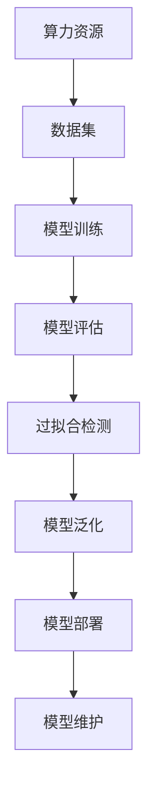

                 

# AI创业公司如何应对技术瓶颈?

在当下飞速发展的AI领域，越来越多的创业公司涌入，意图通过创新技术改变世界。然而，技术瓶颈始终是这些公司必须面对的一大难题。本文将深入探讨AI创业公司如何应对技术瓶颈，通过理论和实践结合的方式，提供系统性解决方案。

## 1. 背景介绍

### 1.1 问题由来
随着人工智能技术的迅速发展，AI创业公司如雨后春笋般涌现。然而，技术瓶颈成为这些公司发展的最大障碍。技术瓶颈主要包括算力不足、数据缺乏、模型过拟合、部署难等问题。这些问题直接影响到公司的创新速度和市场竞争力。

### 1.2 问题核心关键点
技术瓶颈的核心在于如何高效利用有限的资源，同时保持模型的性能和稳定性。关键点包括：
- 高效的资源管理：如何优化算力使用，提高数据处理效率。
- 数据的质量和规模：如何获取高质量、大规模的数据集。
- 模型的泛化能力：如何提升模型的泛化能力，避免过拟合。
- 模型的部署和维护：如何快速部署和稳定维护模型，满足实时性需求。

## 2. 核心概念与联系

### 2.1 核心概念概述
- **算力资源**：指执行深度学习任务所需的计算资源，包括CPU、GPU、TPU等硬件设施。
- **数据集**：用于训练模型的标注数据集，质量与规模直接影响模型效果。
- **过拟合**：模型在训练集上表现优异但在测试集上表现不佳的现象，需要采取正则化等方法避免。
- **模型泛化**：模型在不同数据集上均能表现出良好性能的能力，与模型复杂度、数据多样性有关。
- **部署与维护**：将训练好的模型部署到生产环境，并确保其在实时场景中的稳定运行。

### 2.2 核心概念原理和架构的 Mermaid 流程图



## 3. 核心算法原理 & 具体操作步骤

### 3.1 算法原理概述
AI创业公司面对技术瓶颈，需要从数据、模型、算力、部署等多个维度进行优化。核心算法原理主要包括：

- **数据增强**：通过扩充训练数据，提高模型泛化能力。
- **模型压缩**：减小模型规模，提高模型部署效率。
- **迁移学习**：利用已有模型知识，加快新模型训练。
- **超参数优化**：通过自动调参，提升模型性能。

### 3.2 算法步骤详解

#### 3.2.1 数据增强
数据增强是提升模型泛化能力的重要手段。具体步骤包括：
1. **数据扩充**：通过随机裁剪、旋转、缩放等方式，生成更多训练数据。
2. **数据增强**：使用数据增强技术，如SMOTE、Mixup等，进一步扩充数据集。
3. **数据增广**：引入噪声、变换等方式，增加数据多样性。

#### 3.2.2 模型压缩
模型压缩是提高模型部署效率的有效方法。具体步骤包括：
1. **剪枝**：去除冗余连接和节点，减小模型规模。
2. **量化**：将浮点数模型转换为定点数模型，减少内存占用。
3. **蒸馏**：通过知识蒸馏技术，将大模型知识传递给小模型。

#### 3.2.3 迁移学习
迁移学习是利用已有模型知识，加快新模型训练的有效方法。具体步骤包括：
1. **预训练**：在大型数据集上预训练模型，学习通用特征。
2. **微调**：在特定任务上微调模型，快速提升模型性能。
3. **迁移**：将预训练知识迁移到新模型中，提高模型泛化能力。

#### 3.2.4 超参数优化
超参数优化是提升模型性能的重要手段。具体步骤包括：
1. **网格搜索**：在预定义的超参数空间中，穷举搜索最优组合。
2. **随机搜索**：在超参数空间中，随机搜索最优组合。
3. **贝叶斯优化**：利用贝叶斯方法，高效搜索最优超参数组合。

### 3.3 算法优缺点

#### 3.3.1 数据增强
优点：
- 扩充数据集，提高模型泛化能力。
- 减少过拟合风险，提升模型鲁棒性。

缺点：
- 生成数据的分布可能与真实数据有所差异，影响模型效果。
- 数据增强过程较为复杂，需要专业技术人员进行操作。

#### 3.3.2 模型压缩
优点：
- 减小模型规模，提高模型部署效率。
- 降低计算资源消耗，降低成本。

缺点：
- 压缩后的模型可能丢失部分信息，影响模型性能。
- 压缩过程较为复杂，需要专业技术人员进行操作。

#### 3.3.3 迁移学习
优点：
- 利用已有模型知识，加快新模型训练。
- 提升模型泛化能力，避免从头训练的过拟合风险。

缺点：
- 迁移学习的效果依赖于源模型与目标任务的相似度，可能存在迁移鸿沟。
- 迁移学习需要大量标注数据，增加了标注成本。

#### 3.3.4 超参数优化
优点：
- 提升模型性能，通过优化超参数组合实现。
- 提高模型泛化能力，避免过拟合。

缺点：
- 超参数优化过程复杂，计算成本高。
- 超参数优化过程容易陷入局部最优，需要多次迭代。

### 3.4 算法应用领域

数据增强、模型压缩、迁移学习和超参数优化技术广泛应用于AI创业公司的多个领域：
- **自然语言处理**：通过数据增强和模型压缩，提高语言模型的性能。
- **计算机视觉**：利用迁移学习和超参数优化，提升图像识别和分类效果。
- **推荐系统**：通过模型压缩和超参数优化，提高推荐模型的实时性和精度。
- **医疗诊断**：通过迁移学习和大规模数据集，提升医疗诊断模型的准确性。

## 4. 数学模型和公式 & 详细讲解 & 举例说明

### 4.1 数学模型构建

以图像分类任务为例，构建深度学习模型的数学模型。假设输入数据为 $x \in \mathbb{R}^n$，输出为 $y \in \{0,1\}$。

- **模型定义**：使用深度神经网络 $f_{\theta}(x) = \sigma(Wx+b)$，其中 $\sigma$ 为激活函数，$W,b$ 为模型参数。
- **损失函数**：使用交叉熵损失函数 $\mathcal{L}(\theta) = -\sum_{i=1}^N \log f_{\theta}(x_i)^{y_i} (1-f_{\theta}(x_i))^{1-y_i}$，其中 $N$ 为样本数。

### 4.2 公式推导过程

推导损失函数的具体过程如下：
1. **定义损失函数**：根据分类任务定义交叉熵损失函数。
2. **求导**：对模型参数求导，得到损失函数的梯度。
3. **优化**：使用梯度下降等优化算法，更新模型参数，最小化损失函数。

### 4.3 案例分析与讲解

以ImageNet数据集为例，展示模型压缩的实际应用。假设原始模型参数量为 $P_0$，压缩后模型参数量为 $P_1$。

- **剪枝**：通过剪枝算法，将部分权重设置为零，减少参数量。假设剪枝率为 $\eta$，则 $P_1 = \eta P_0$。
- **量化**：将浮点数权重转换为定点数权重，减少内存占用。假设量化精度为 $q$，则 $P_1 = \frac{P_0}{q}$。
- **蒸馏**：利用预训练模型，将知识传递给新模型。假设蒸馏率 $\alpha$，则 $P_1 = \alpha P_0$。

## 5. 项目实践：代码实例和详细解释说明

### 5.1 开发环境搭建

#### 5.1.1 硬件环境
- CPU：至少8核以上，支持AVX指令集。
- GPU：至少NVIDIA Tesla V100以上，支持CUDA并行计算。
- 内存：至少16GB以上，支持高速DDR4内存。

#### 5.1.2 软件环境
- Python：版本3.7及以上，推荐使用Anaconda环境管理。
- PyTorch：版本1.9及以上，支持GPU加速。
- CUDA：版本11及以上，支持NVIDIA GPU计算。

### 5.2 源代码详细实现

以TensorFlow为例，展示图像分类任务的数据增强和模型压缩代码。

```python
import tensorflow as tf
from tensorflow.keras.preprocessing.image import ImageDataGenerator

# 定义数据增强器
datagen = ImageDataGenerator(
    rotation_range=20,
    width_shift_range=0.1,
    height_shift_range=0.1,
    shear_range=0.1,
    zoom_range=0.1,
    horizontal_flip=True,
    fill_mode='nearest')

# 加载训练数据
train_data = datagen.flow_from_directory(
    'train_dir',
    target_size=(224, 224),
    batch_size=32,
    class_mode='categorical')

# 构建模型
model = tf.keras.Sequential([
    tf.keras.layers.Conv2D(32, (3, 3), activation='relu', input_shape=(224, 224, 3)),
    tf.keras.layers.MaxPooling2D((2, 2)),
    tf.keras.layers.Conv2D(64, (3, 3), activation='relu'),
    tf.keras.layers.MaxPooling2D((2, 2)),
    tf.keras.layers.Conv2D(128, (3, 3), activation='relu'),
    tf.keras.layers.MaxPooling2D((2, 2)),
    tf.keras.layers.Flatten(),
    tf.keras.layers.Dense(128, activation='relu'),
    tf.keras.layers.Dense(10, activation='softmax')
])

# 编译模型
model.compile(
    optimizer='adam',
    loss='categorical_crossentropy',
    metrics=['accuracy'])

# 训练模型
model.fit(train_data, epochs=10)
```

### 5.3 代码解读与分析

以上代码展示了使用TensorFlow进行图像分类任务的数据增强和模型训练。具体步骤如下：
1. **数据增强**：使用`ImageDataGenerator`类，定义数据增强器，扩充训练数据集。
2. **模型构建**：定义深度神经网络模型，包含卷积层、池化层、全连接层等。
3. **模型编译**：编译模型，选择优化器和损失函数，并定义评估指标。
4. **模型训练**：使用`fit`方法，训练模型，在训练集上迭代优化。

## 6. 实际应用场景

### 6.1 自然语言处理
自然语言处理领域，数据增强和模型压缩技术应用广泛。具体场景包括：
- **语言模型训练**：通过数据增强，提升语言模型的泛化能力。
- **文本分类**：利用模型压缩技术，加快分类模型的部署速度。
- **机器翻译**：通过迁移学习，利用预训练模型提升翻译效果。

### 6.2 计算机视觉
计算机视觉领域，迁移学习和超参数优化技术应用广泛。具体场景包括：
- **图像分类**：利用迁移学习，快速提升分类模型的效果。
- **目标检测**：通过超参数优化，提高检测模型的实时性和精度。
- **图像生成**：利用数据增强和模型压缩，提高生成模型的效果和部署速度。

### 6.3 推荐系统
推荐系统领域，模型压缩和超参数优化技术应用广泛。具体场景包括：
- **个性化推荐**：通过模型压缩，提高推荐模型的实时性和准确性。
- **冷启动问题**：利用迁移学习，快速提升新用户的推荐效果。
- **实时推荐**：通过超参数优化，调整推荐模型的性能。

### 6.4 未来应用展望

未来，随着AI技术的不断进步，AI创业公司将面对更多的技术挑战。以下是几个重要的发展方向：
- **多模态学习**：将文本、图像、语音等多模态数据结合，提升模型的泛化能力。
- **因果推理**：引入因果推理技术，提高模型的可解释性和鲁棒性。
- **元学习**：利用元学习技术，提高模型对新任务的适应能力。
- **联邦学习**：通过联邦学习技术，保护数据隐私，提升模型泛化能力。

## 7. 工具和资源推荐

### 7.1 学习资源推荐

#### 7.1.1 课程与书籍
- **《深度学习》**：Ian Goodfellow著，全面介绍了深度学习的理论基础和应用。
- **《深度学习实战》**：Francois Chollet著，提供了TensorFlow和Keras的实战案例。
- **Coursera深度学习课程**：由Andrew Ng教授授课，系统介绍深度学习的各个方面。

#### 7.1.2 在线资源
- **Kaggle**：数据科学竞赛平台，提供大量公开数据集和竞赛项目。
- **GitHub**：代码托管平台，提供大量开源项目和代码示例。
- **arXiv**：学术论文库，提供最新研究成果和前沿技术。

### 7.2 开发工具推荐

#### 7.2.1 编程语言
- **Python**：广泛使用的编程语言，生态丰富，支持深度学习框架。
- **R**：适用于数据分析和统计计算，支持机器学习库。

#### 7.2.2 深度学习框架
- **TensorFlow**：开源深度学习框架，支持GPU计算。
- **PyTorch**：开源深度学习框架，支持动态图计算。
- **Keras**：高层深度学习框架，易于上手。

### 7.3 相关论文推荐

#### 7.3.1 经典论文
- **《ImageNet Classification with Deep Convolutional Neural Networks》**：Alex Krizhevsky等，ImageNet图像分类竞赛冠军论文。
- **《Deep Residual Learning for Image Recognition》**：Kaiming He等，提出深度残差网络。
- **《Attention is All You Need》**：Ashish Vaswani等，提出Transformer模型。

#### 7.3.2 最新研究
- **《SimCLR: Unsupervised Learning of Visual Representation with Contrastive Predictive Coding》**：Kaiming He等，提出自监督学习的SimCLR模型。
- **《Knowledge Distillation》**：Yoshua Bengio等，提出知识蒸馏方法。

## 8. 总结：未来发展趋势与挑战

### 8.1 未来发展趋势

#### 8.1.1 技术融合
未来，AI创业公司需要不断探索新技术与现有技术的结合，以提升模型的性能和效率。例如，将自然语言处理与计算机视觉结合，提升跨模态理解能力。

#### 8.1.2 跨领域应用
随着技术的不断发展，AI创业公司将更多地应用到医疗、金融、教育等垂直领域，解决实际问题。例如，利用自然语言处理技术，提升医疗诊断的准确性。

#### 8.1.3 数据隐私保护
数据隐私保护成为越来越重要的议题，AI创业公司需要研究如何在不泄露用户隐私的前提下，利用数据进行模型训练和优化。

### 8.2 面临的挑战

#### 8.2.1 数据获取与处理
获取高质量、大规模的数据集是一个巨大的挑战。数据标注成本高、数据隐私保护要求严，需要创新技术和方法解决这些问题。

#### 8.2.2 模型复杂度
随着模型的规模不断增大，复杂度也随之增加。如何控制模型复杂度，避免过拟合和计算资源消耗过大，是一个重要的研究方向。

#### 8.2.3 模型部署与维护
模型的部署和维护成本高，如何实现快速部署、实时维护，是一个重要的实际问题。

### 8.3 研究展望

#### 8.3.1 自动化调参
自动化调参技术能够显著提高模型训练效率，降低人工成本。如何设计高效的自动化调参算法，是一个重要的研究方向。

#### 8.3.2 轻量化模型
轻量化模型能够提高模型的实时性和部署效率，如何设计和优化轻量化模型，是一个重要的研究方向。

#### 8.3.3 模型解释性
模型解释性是提升模型可信度的重要手段，如何设计可解释性更强的模型，是一个重要的研究方向。

## 9. 附录：常见问题与解答

### 9.1 问题1：如何提高模型的泛化能力？

**解答**：
1. **数据增强**：通过扩充训练数据，提升模型的泛化能力。
2. **正则化**：通过L2正则化、Dropout等方法，避免过拟合。
3. **迁移学习**：利用预训练模型知识，提升新模型的泛化能力。

### 9.2 问题2：模型压缩有哪些方法？

**解答**：
1. **剪枝**：去除冗余权重，减小模型规模。
2. **量化**：将浮点数权重转换为定点数权重。
3. **蒸馏**：利用预训练模型知识，传递给新模型。

### 9.3 问题3：如何优化模型超参数？

**解答**：
1. **网格搜索**：在预定义的超参数空间中，穷举搜索最优组合。
2. **随机搜索**：在超参数空间中，随机搜索最优组合。
3. **贝叶斯优化**：利用贝叶斯方法，高效搜索最优超参数组合。

---

作者：禅与计算机程序设计艺术 / Zen and the Art of Computer Programming

