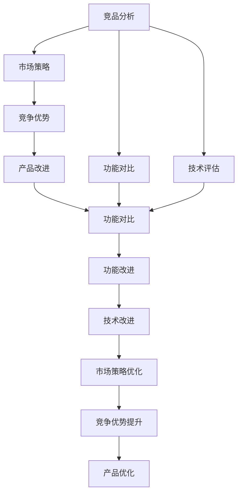

                 

# AI创业公司如何进行竞品分析?

> 关键词：竞品分析, AI创业, 市场策略, 技术评估, 竞争优势, 产品改进

## 1. 背景介绍

### 1.1 问题由来
在AI创业的浪潮中，越来越多的公司致力于利用先进的人工智能技术，开发出创新的产品和服务。然而，市场的竞争日益激烈，了解竞争对手的最新动态和产品性能成为创业公司生存和发展的关键。进行竞品分析可以帮助创业公司识别市场机会，找到差异化竞争策略，优化产品设计，提升竞争力。

### 1.2 问题核心关键点
竞品分析的核心在于深度理解竞争对手的产品功能、技术优势、市场策略等方面，以便作出更好的产品规划和市场决策。主要包括以下几个方面：
- 功能对比：比较产品的功能特点，找出差异与共性。
- 技术评估：评估产品的技术实现，识别技术优劣。
- 市场策略：分析竞争对手的市场推广策略，判断市场份额和用户接受度。
- 竞争优势：识别自身的竞争优势和劣势，明确改进方向。
- 产品改进：基于竞品分析结果，优化和改进自家产品。

## 2. 核心概念与联系

### 2.1 核心概念概述

为更好地理解如何进行竞品分析，本节将介绍几个密切相关的核心概念：

- **竞品分析**：了解竞争对手的产品、市场策略和技术优劣，以便优化自家产品的过程。
- **功能对比**：比较自家产品与竞争对手产品，找出功能上的差异和共性。
- **技术评估**：评估竞争对手的技术实现，包括算法、模型、架构等方面。
- **市场策略**：分析竞争对手的市场推广策略，如定价、渠道、营销等。
- **竞争优势**：识别自家产品相对于竞争对手的竞争优势，找到改进方向。
- **产品改进**：根据竞品分析结果，优化自家产品功能和技术，提升竞争力。

这些核心概念之间的逻辑关系可以通过以下Mermaid流程图来展示：



这个流程图展示了竞品分析的全过程：

1. 竞品分析起始于收集竞争对手的产品、市场和技术的各种数据。
2. 通过对竞争对手的功能、技术、市场策略进行对比，识别出竞争优势和劣势。
3. 基于竞品分析结果，进行产品功能的改进和技术优化。
4. 优化后的产品功能和技术回到功能对比环节，进一步迭代。

## 3. 核心算法原理 & 具体操作步骤
### 3.1 算法原理概述

竞品分析的算法原理是基于对竞争对手产品和技术的深度比较，从而评估自身的竞争优势和劣势。其核心在于收集和分析竞品的数据，通过一系列比对和评估，找出差距和机会，进而指导产品改进和市场策略制定。

### 3.2 算法步骤详解

竞品分析的算法步骤包括以下几个关键环节：

1. **数据收集**：收集竞争对手的产品文档、功能介绍、技术白皮书、市场策略和用户反馈等。
2. **功能对比**：分析自家产品与竞品产品的功能列表，找出异同点。
3. **技术评估**：对竞品产品的技术实现进行评估，包括算法、模型、架构等方面。
4. **市场策略分析**：分析竞品的市场推广策略，包括定价、渠道、营销等。
5. **竞争优势识别**：基于功能对比和技术评估结果，识别自身的竞争优势和劣势。
6. **产品改进**：根据竞争优势识别结果，优化和改进自家产品。

### 3.3 算法优缺点

竞品分析的优点在于：
- **提升竞争力**：通过了解竞争对手，优化自家产品功能和技术，提升市场竞争力。
- **市场洞察**：识别市场机会，调整产品规划和市场策略。
- **数据驱动**：以客观数据为基础，进行系统性的评估和优化。

其缺点主要体现在：
- **资源消耗**：数据收集和分析需要耗费大量时间和人力资源。
- **数据准确性**：依赖于竞品的公开信息，可能存在数据不准确或遗漏的问题。
- **动态变化**：竞争对手策略和技术在不断变化，竞品分析需要持续进行，才能保持信息的时效性。

### 3.4 算法应用领域

竞品分析广泛应用于各个行业和领域，特别是市场竞争激烈和技术更新迅速的行业：

- **科技公司**：通过竞品分析，把握技术趋势，保持技术领先。
- **消费品企业**：了解竞争对手的市场策略，调整产品定位和营销策略。
- **金融服务**：分析竞争对手的金融产品和市场策略，调整自身产品和服务。
- **互联网企业**：识别竞品的功能和用户体验，提升自家产品的市场竞争力。
- **医疗健康**：分析医疗设备和技术，改进自身产品，提升治疗效果。

## 4. 数学模型和公式 & 详细讲解  
### 4.1 数学模型构建

本节将使用数学语言对竞品分析的数学模型进行详细的构建。

假设竞争对手的产品数量为 $N$，产品编号为 $i=1,2,...,N$。对于第 $i$ 个产品，我们定义以下指标：

- 功能数量：$F_i$，表示该产品提供的功能点数量。
- 技术评分：$T_i$，表示该产品的技术实现评分。
- 市场评分：$M_i$，表示该产品的市场推广评分。

基于这些指标，我们可以构建竞品分析的数学模型。

### 4.2 公式推导过程

我们将使用以下公式对竞品产品进行综合评分：

$$
R_i = \alpha F_i + \beta T_i + \gamma M_i
$$

其中 $\alpha$、$\beta$、$\gamma$ 为不同指标的权重，满足 $\alpha+\beta+\gamma=1$。权重的选择应基于市场的重要性以及对公司战略的重要性。

接着，我们计算竞品产品的综合评分平均值和标准差，以便进行更直观的比较：

$$
\bar{R} = \frac{1}{N} \sum_{i=1}^{N} R_i
$$

$$
\sigma_R = \sqrt{\frac{1}{N} \sum_{i=1}^{N} (R_i - \bar{R})^2}
$$

### 4.3 案例分析与讲解

假设有两家AI创业公司A和B，其产品和市场数据如表所示：

| 产品 | 功能数量 | 技术评分 | 市场评分 |
| ---- | -------- | -------- | -------- |
| A    | 50       | 4.2      | 3.8      |
| B    | 60       | 4.4      | 3.5      |

选择 $\alpha=0.5, \beta=0.3, \gamma=0.2$ 的权重。根据公式：

$$
R_A = 0.5 \times 50 + 0.3 \times 4.2 + 0.2 \times 3.8 = 43.4
$$

$$
R_B = 0.5 \times 60 + 0.3 \times 4.4 + 0.2 \times 3.5 = 47.2
$$

计算平均评分和标准差：

$$
\bar{R} = \frac{43.4 + 47.2}{2} = 45.3
$$

$$
\sigma_R = \sqrt{\frac{(43.4 - 45.3)^2 + (47.2 - 45.3)^2}{2}} = 2.1
$$

这表明B公司在综合评分上略优于A公司，但在技术评分上，B公司也有明显的优势。

## 5. 项目实践：代码实例和详细解释说明
### 5.1 开发环境搭建

在进行竞品分析实践前，我们需要准备好开发环境。以下是使用Python进行数据分析的环境配置流程：

1. 安装Anaconda：从官网下载并安装Anaconda，用于创建独立的Python环境。

2. 创建并激活虚拟环境：
```bash
conda create -n pydata-env python=3.8 
conda activate pydata-env
```

3. 安装Pandas、NumPy、Scikit-learn等数据科学库：
```bash
pip install pandas numpy scikit-learn
```

4. 安装可视化工具：如Matplotlib、Seaborn等：
```bash
pip install matplotlib seaborn
```

完成上述步骤后，即可在`pydata-env`环境中开始竞品分析实践。

### 5.2 源代码详细实现

下面我们以两家AI创业公司A和B的竞品分析为例，给出使用Pandas库对竞品数据进行整理和分析的PyTorch代码实现。

首先，定义数据集：

```python
import pandas as pd
import numpy as np

data = pd.DataFrame({
    '产品': ['A', 'B'],
    '功能数量': [50, 60],
    '技术评分': [4.2, 4.4],
    '市场评分': [3.8, 3.5]
})

data.head()
```

接着，定义权重，进行综合评分计算：

```python
alpha = 0.5
beta = 0.3
gamma = 0.2

data['综合评分'] = alpha * data['功能数量'] + beta * data['技术评分'] + gamma * data['市场评分']
```

计算平均评分和标准差：

```python
mean_score = data['综合评分'].mean()
std_score = data['综合评分'].std()
mean_score, std_score
```

最后，将结果以图表形式展示：

```python
import matplotlib.pyplot as plt

plt.figure(figsize=(8, 6))
plt.hist(data['综合评分'], bins=20, alpha=0.5, label='综合评分分布')
plt.axvline(mean_score, color='r', linestyle='--', label='平均评分')
plt.axvline(mean_score + std_score, color='g', linestyle='--', label='平均评分+标准差')
plt.axvline(mean_score - std_score, color='g', linestyle='--', label='平均评分-标准差')
plt.legend()
plt.show()
```

以上就是使用Pandas对竞品数据进行整理和分析的完整代码实现。可以看到，通过简单的数据处理和可视化，我们可以直观地看出两家公司的综合评分分布和平均评分情况。

### 5.3 代码解读与分析

让我们再详细解读一下关键代码的实现细节：

**数据集定义**：
- 使用Pandas的`DataFrame`类定义数据集，方便进行各种数据操作。

**综合评分计算**：
- 根据公式计算每家公司的综合评分，并将结果存储在新的列`综合评分`中。

**评分统计**：
- 使用`mean`函数计算综合评分的平均值，`std`函数计算标准差。

**结果可视化**：
- 使用Matplotlib绘制综合评分的直方图，并通过`axvline`函数在图上绘制平均评分和标准差线。

可以看到，使用Pandas和Matplotlib，可以很方便地进行竞品分析数据的整理和可视化。在实际应用中，还需要根据具体任务的需求，进一步开发和优化数据处理和可视化工具。

## 6. 实际应用场景
### 6.1 智能推荐系统

在智能推荐系统中，竞品分析可以帮助我们识别竞争对手的产品功能和技术实现，找出自身的优势和劣势，从而优化推荐算法和产品设计。例如，电商平台可以使用竞品分析，了解竞争对手的推荐系统功能和技术，改进自家推荐算法，提升用户体验和转化率。

### 6.2 广告投放策略

竞品分析在广告投放策略中也有广泛应用。通过分析竞争对手的广告投放数据，可以了解其投放策略的效果，找出优化点，调整自家广告投放方案，提升广告效果和ROI。例如，可以通过竞品分析，了解竞争对手的广告投放渠道、广告素材、广告创意等，改进自家广告投放策略，提高广告的点击率和转化率。

### 6.3 产品开发决策

在产品开发决策中，竞品分析可以帮助我们了解市场需求和竞争格局，从而指导产品的功能设计和市场定位。例如，可以通过竞品分析，了解市场对特定功能的接受度，优化产品设计，提升用户满意度。同时，可以根据竞品分析结果，调整产品的市场定位，找到差异化竞争策略，提升产品竞争力。

### 6.4 未来应用展望

随着数据科学和人工智能技术的不断发展，竞品分析方法也将不断演进和完善。未来，竞品分析将进一步结合大数据分析、机器学习、深度学习等技术，提升分析的深度和广度。具体展望如下：

1. **大数据分析**：结合大数据技术，收集和分析更多的竞品数据，进行更全面的分析。
2. **机器学习**：应用机器学习算法，自动化竞品分析流程，提高分析的准确性和效率。
3. **深度学习**：引入深度学习模型，进行更复杂的数据特征提取和分析，提升分析的深度和准确性。
4. **实时分析**：通过实时数据流分析，及时了解竞争对手的最新动态，进行实时调整和优化。
5. **多模态分析**：结合文本、图像、视频等多模态数据，进行更全面的竞品分析。
6. **情感分析**：应用情感分析技术，了解用户对竞品的情感倾向，指导产品改进和市场策略。

未来，随着技术的不断进步，竞品分析方法将更加全面、精准、高效，为AI创业公司提供更强大的市场竞争优势。

## 7. 工具和资源推荐
### 7.1 学习资源推荐

为了帮助开发者系统掌握竞品分析的理论基础和实践技巧，这里推荐一些优质的学习资源：

1. 《数据分析与可视化》系列博文：由数据科学专家撰写，详细讲解了数据收集、处理、分析和可视化等基本概念和技能。

2. 《机器学习实战》书籍：通过实例讲解了机器学习算法的基本思想和实现，适合初学者入门。

3. 《深度学习》课程：斯坦福大学开设的深度学习课程，涵盖了深度学习的基本原理和前沿技术。

4. Kaggle竞赛：Kaggle是数据科学竞赛平台，通过参与竞赛，可以学习到数据分析和机器学习的前沿技术和实践经验。

5. GitHub代码库：GitHub上有大量开源的竞品分析项目，通过学习这些项目，可以了解竞品分析的实现细节和优化方法。

通过对这些资源的学习实践，相信你一定能够快速掌握竞品分析的理论基础和实践技巧，并用于解决实际的商业问题。
###  7.2 开发工具推荐

高效的开发离不开优秀的工具支持。以下是几款用于竞品分析开发的常用工具：

1. Python：作为数据科学和机器学习的主流语言，Python拥有丰富的第三方库和社区支持。

2. Jupyter Notebook：交互式编程环境，方便进行数据分析和可视化。

3. Pandas：数据分析的核心库，提供了强大的数据处理和分析功能。

4. NumPy：高性能数值计算库，支持高效的数组操作。

5. Matplotlib：数据可视化库，支持绘制各种图表和图形。

6. Seaborn：基于Matplotlib的数据可视化库，提供了更高级的图表和美观的样式。

7. TensorBoard：TensorFlow配套的可视化工具，支持监控和调试深度学习模型。

合理利用这些工具，可以显著提升竞品分析的开发效率，加快创新迭代的步伐。

### 7.3 相关论文推荐

竞品分析的研究始于学术界，以下是几篇奠基性的相关论文，推荐阅读：

1. "Competitive Analysis of Machine Learning Algorithms"（机器学习算法的竞争分析）：比较了各种机器学习算法的性能和效果，提供了实用的评估指标和方法。

2. "Product Analytics: Techniques and Challenges"（产品分析技术和挑战）：详细介绍了产品分析的流程和方法，包括竞品分析在内的各种分析技术。

3. "Market Analysis and Competitive Intelligence"（市场分析和竞争情报）：从市场分析的角度，介绍了竞品分析的基本原理和实践方法。

4. "Digital Marketing Analytics: An Overview"（数字营销分析概述）：介绍了数字营销分析的基本概念和方法，包括竞品分析在内的各种分析方法。

这些论文代表了大规模数据分析和竞品分析技术的发展脉络。通过学习这些前沿成果，可以帮助研究者把握学科前进方向，激发更多的创新灵感。

## 8. 总结：未来发展趋势与挑战

### 8.1 总结

本文对AI创业公司如何进行竞品分析进行了全面系统的介绍。首先阐述了竞品分析的背景和意义，明确了竞品分析在提升竞争优势、优化产品设计和调整市场策略方面的独特价值。其次，从原理到实践，详细讲解了竞品分析的数学模型和关键步骤，给出了竞品分析任务开发的完整代码实例。同时，本文还探讨了竞品分析在智能推荐、广告投放、产品开发等多个领域的实际应用，展示了竞品分析方法的广阔前景。此外，本文精选了竞品分析的学习资源和开发工具，力求为读者提供全方位的技术指引。

通过本文的系统梳理，可以看到，竞品分析方法已经成为AI创业公司获取市场情报、优化产品策略的重要手段。在数据驱动的商业环境中，通过竞品分析，企业可以更好地理解市场动态，制定科学的市场决策，提升产品竞争力和市场份额。

### 8.2 未来发展趋势

展望未来，竞品分析方法将呈现以下几个发展趋势：

1. **数据质量提升**：随着大数据技术的不断发展，竞品分析可以采集和利用更多的数据，提升数据质量和分析精度。
2. **自动化分析**：引入机器学习和深度学习算法，实现竞品分析的自动化和智能化，提高分析效率。
3. **多模态融合**：结合文本、图像、视频等多模态数据，进行更全面的竞品分析，提升分析深度和广度。
4. **实时分析**：通过实时数据流分析，及时了解竞争对手的最新动态，进行实时调整和优化。
5. **情感分析**：应用情感分析技术，了解用户对竞品的情感倾向，指导产品改进和市场策略。

以上趋势凸显了竞品分析技术的广阔前景。这些方向的探索发展，必将进一步提升竞品分析的深度和广度，为AI创业公司提供更强大的市场竞争优势。

### 8.3 面临的挑战

尽管竞品分析方法已经取得了瞩目成就，但在迈向更加智能化、普适化应用的过程中，它仍面临着诸多挑战：

1. **数据获取难度**：竞争对手可能不愿意公开其产品信息和市场策略，数据获取难度大。
2. **数据准确性**：依赖于竞品的公开信息，可能存在数据不准确或遗漏的问题。
3. **数据隐私问题**：数据收集和使用过程中，需要关注用户隐私和数据安全。
4. **动态变化**：竞争对手策略和技术在不断变化，竞品分析需要持续进行，才能保持信息的时效性。

正视竞品分析面临的这些挑战，积极应对并寻求突破，将是竞品分析方法走向成熟的必由之路。相信随着学界和产业界的共同努力，这些挑战终将一一被克服，竞品分析方法必将在构建人机协同的智能时代中扮演越来越重要的角色。

### 8.4 研究展望

面对竞品分析所面临的种种挑战，未来的研究需要在以下几个方面寻求新的突破：

1. **数据采集技术**：开发更高效的数据采集技术，减少人工干预和数据获取成本。
2. **数据处理算法**：改进数据处理算法，提升数据质量和分析精度。
3. **自动化分析方法**：引入自动化分析方法，实现竞品分析的智能化和自动化。
4. **多模态分析技术**：结合多模态数据，进行更全面的竞品分析。
5. **实时分析技术**：开发实时分析技术，及时了解竞争对手的最新动态。
6. **隐私保护技术**：研究隐私保护技术，确保数据采集和使用的合法性和安全性。

这些研究方向的探索，必将引领竞品分析方法迈向更高的台阶，为AI创业公司提供更强大的市场竞争优势。未来，竞品分析方法需要与其他人工智能技术进行更深入的融合，如知识表示、因果推理、强化学习等，多路径协同发力，共同推动自然语言理解和智能交互系统的进步。只有勇于创新、敢于突破，才能不断拓展竞品分析的边界，让智能技术更好地造福人类社会。

## 9. 附录：常见问题与解答

**Q1：竞品分析是否适用于所有行业？**

A: 竞品分析适用于大多数行业，特别是在市场竞争激烈和技术更新迅速的领域。例如，科技公司、消费品企业、金融服务、互联网企业、医疗健康等。

**Q2：如何进行数据收集和分析？**

A: 数据收集可以通过公开信息、市场调研、用户反馈等方式进行。数据分析可以使用Python、R等编程语言，结合Pandas、NumPy、Scikit-learn等数据科学库进行。

**Q3：如何选择合适的指标和权重？**

A: 选择合适的指标和权重应基于市场和公司的实际情况。例如，技术评分、市场评分等指标，可以反映产品的竞争力和市场接受度。权重的设置应考虑不同指标对公司战略的重要性。

**Q4：竞品分析结果如何应用到产品改进？**

A: 竞品分析结果可以用于指导产品改进，优化产品功能、技术、市场策略等。例如，根据竞品分析结果，调整产品功能，提升用户体验；改进技术实现，提升产品性能；调整市场策略，优化市场推广效果。

**Q5：竞品分析结果如何应用到广告投放？**

A: 竞品分析结果可以用于指导广告投放策略，优化广告素材、广告创意、广告渠道等。例如，根据竞品广告投放效果，优化自家广告投放策略，提升广告效果和ROI。

---

作者：禅与计算机程序设计艺术 / Zen and the Art of Computer Programming

