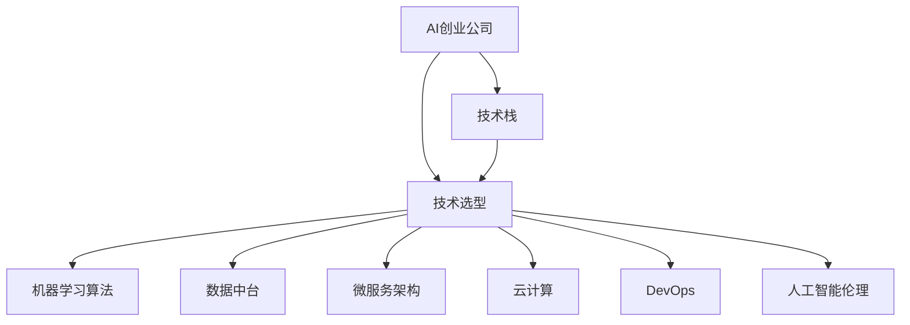

                 

# AI创业公司的技术选型策略

在大数据、云计算和人工智能飞速发展的今天，AI技术已经渗透到各行各业。对于初创公司而言，选择合适的AI技术能够大幅提升产品和服务的竞争力。本文将从技术选型的角度，探讨AI创业公司应考虑的关键因素、常用技术和典型案例，为读者提供全面系统的指导。

## 1. 背景介绍

### 1.1 问题由来

随着AI技术的不断发展，AI创业公司在技术选型方面面临诸多挑战。一方面，由于技术更新迭代速度快，市场需求变化大，初创公司往往难以快速适应。另一方面，选择不当的技术可能不仅不能带来预期收益，还可能增加企业的运营成本，甚至引入安全隐患。因此，AI创业公司必须在技术选型上慎重考虑，避免因技术问题导致的重大决策失误。

### 1.2 问题核心关键点

AI创业公司在技术选型上应重点关注以下几个核心问题：

- **技术适应性**：所选技术是否能够快速适配当前及未来的业务需求。
- **性能表现**：技术在计算速度、精度、扩展性等方面的表现。
- **成本效益**：所选技术的开发、维护和运营成本是否合理。
- **安全性与隐私保护**：技术的安全性如何，能否有效保护用户数据隐私。
- **可扩展性**：技术是否能适应业务规模的增长，支持未来的业务扩展。
- **人才可用性**：所需技术领域的人才储备情况。

## 2. 核心概念与联系

### 2.1 核心概念概述

为了更好地理解AI创业公司技术选型的过程，本节将介绍几个密切相关的核心概念：

- **AI创业公司**：利用人工智能技术进行创新和商业化的初创企业。包括但不限于数据驱动决策、个性化推荐、智能客服、自动驾驶等场景。

- **技术栈**：公司开发和部署应用程序所需的软件组件和工具的集合。常见的技术栈包括Python、R、TensorFlow、PyTorch、Docker等。

- **技术选型**：选择最适合企业当前和未来业务需求的技术方案的过程。包括但不限于选择合适的框架、库、平台等。

- **机器学习算法**：用于数据分析、模式识别、预测分析等任务的算法，如回归、分类、聚类、神经网络等。

- **数据中台**：集中管理数据资产，实现数据共享、数据治理和数据驱动决策的平台。

- **微服务架构**：将应用程序分解为多个独立、可互操作的服务单元，以实现高可用性、扩展性和灵活性。

- **云计算**：通过互联网提供动态、可扩展的计算资源，包括IaaS、PaaS、SaaS等。

- **DevOps**：将软件开发和运维相结合，通过持续集成、持续部署等实践，实现快速交付和稳定运行。

- **人工智能伦理**：在开发和应用人工智能技术时，关注其对社会、伦理和法律的影响，确保技术的正向价值。

这些核心概念之间的逻辑关系可以通过以下Mermaid流程图来展示：



这个流程图展示了一个AI创业公司在技术选型的过程中，需要考虑的关键因素：

1. 选择合适的技术栈。
2. 根据技术栈进行技术选型。
3. 选用机器学习算法、数据中台、微服务架构、云计算和DevOps工具。
4. 关注人工智能伦理，确保技术使用的合规性和安全性。

## 3. 核心算法原理 & 具体操作步骤

### 3.1 算法原理概述

AI创业公司的技术选型过程，本质上是一个技术评估和决策的过程。通常包括以下步骤：

1. **需求分析**：根据业务需求确定所需技术功能，评估技术对业务的影响。
2. **技术调研**：对市场上流行的技术进行调研，收集相关资料和案例。
3. **技术评估**：基于业务需求和技术调研结果，评估不同技术的适用性、性能、成本等因素。
4. **选型决策**：综合评估结果，做出最终的技术选型决策。
5. **实施与优化**：选择合适的技术后，进行实施部署，并根据实际效果进行优化。

### 3.2 算法步骤详解

#### 3.2.1 需求分析

需求分析是技术选型的第一步，需明确以下几个关键问题：

- **业务目标**：公司希望通过AI技术实现的具体业务目标，如提高运营效率、提升用户体验、降低运营成本等。
- **数据需求**：公司需要哪些数据支持，数据的来源、格式、质量要求等。
- **技术要求**：公司对技术的哪些方面有特殊要求，如计算资源、部署环境、隐私保护等。
- **未来规划**：公司的发展方向和未来业务拓展，对技术是否有长期规划。

#### 3.2.2 技术调研

技术调研应涵盖以下几个方面：

- **市场流行度**：查看市场上的技术趋势和应用情况。
- **性能表现**：评估技术的计算速度、精度、扩展性等性能指标。
- **社区活跃度**：评估技术社区的活跃度、贡献和支持情况。
- **开发者工具**：评估技术开发者工具的成熟度和易用性。
- **第三方库**：评估是否存在易于集成的第三方库和插件。
- **安全性和隐私**：评估技术的安全性、隐私保护措施和合规性。
- **成本效益**：评估技术的开发、维护和运营成本。

#### 3.2.3 技术评估

技术评估需根据需求分析和技术调研结果，对不同技术进行综合评估。评估指标包括但不限于：

- **适用性**：技术能否满足当前和未来的业务需求。
- **性能**：技术在性能方面的表现。
- **成本**：技术的开发、维护和运营成本。
- **安全性**：技术的安全性评估。
- **可扩展性**：技术的可扩展性和升级能力。
- **用户体验**：技术的易用性和用户反馈。
- **技术支持**：技术提供方的支持和维护情况。

#### 3.2.4 选型决策

根据技术评估结果，结合业务目标和未来规划，进行技术选型决策。选型应考虑以下几个方面：

- **功能匹配度**：技术能否实现所需功能。
- **性能指标**：技术的性能表现是否符合预期。
- **成本效益**：技术的成本是否合理，是否能带来预期的业务收益。
- **长期规划**：技术的未来可扩展性和升级能力。
- **技术支持**：技术提供方的支持和维护情况。
- **用户反馈**：技术的用户体验和用户反馈。

#### 3.2.5 实施与优化

实施阶段需关注以下几个方面：

- **部署环境**：确保技术能够在所需环境中稳定运行。
- **性能优化**：根据实际使用情况，进行性能优化，提升系统效率。
- **系统监控**：建立系统监控机制，实时跟踪系统运行状态。
- **持续优化**：根据业务需求和技术发展，不断优化和升级技术方案。

### 3.3 算法优缺点

**优点**：

- **快速响应**：技术选型过程可以快速响应市场需求变化，快速迭代产品功能。
- **灵活性**：通过选择合适的技术栈，公司可以在不同应用场景下灵活部署。
- **降低成本**：技术选型过程中，可以评估不同技术的成本效益，选择性价比高的方案。
- **增强竞争力**：合理的技术选型可以大幅提升产品和服务的竞争力。

**缺点**：

- **技术风险**：技术选型错误可能导致业务损失，增加运营成本。
- **市场变化**：市场和技术趋势不断变化，技术选型需不断更新。
- **人才挑战**：技术选型需考虑现有人才储备和未来人才需求。

### 3.4 算法应用领域

AI创业公司的技术选型策略，已广泛应用于以下多个领域：

- **智能推荐系统**：根据用户行为和兴趣，推荐相关商品或内容。
- **智能客服**：通过自然语言处理和机器学习技术，自动回答用户咨询。
- **风险评估**：利用机器学习算法，进行信用评估、欺诈检测等。
- **数据分析**：通过数据挖掘和机器学习，从大量数据中提取有价值的信息。
- **自然语言处理**：利用自然语言处理技术，进行文本分类、情感分析、语音识别等。
- **智能制造**：通过机器学习和大数据技术，优化生产流程，提升生产效率。
- **智能医疗**：利用AI技术进行疾病诊断、患者监护、医疗影像分析等。

## 4. 数学模型和公式 & 详细讲解 & 举例说明

### 4.1 数学模型构建

在技术选型中，我们常常需要建立数学模型来量化不同技术的性能和成本。以推荐系统为例，常见的评估指标包括：

- **准确率（Accuracy）**：正确推荐的比例。
- **召回率（Recall）**：相关商品被推荐的比例。
- **F1值（F1 Score）**：准确率和召回率的调和平均数。
- **ROC曲线（Receiver Operating Characteristic Curve）**：用于评估二分类模型的性能。
- **AUC值（Area Under Curve）**：ROC曲线下的面积，用于评估模型的分类能力。

### 4.2 公式推导过程

以推荐系统的准确率为例，设推荐系统将商品推荐给用户，实际需求商品的比例为$P$，推荐系统推荐给用户且实际需求的比例为$P_{pred}$，则准确率$A$计算公式为：

$$
A = \frac{P_{pred}}{P}
$$

准确率反映了推荐系统推荐的商品中，有多少是用户实际需要的。

### 4.3 案例分析与讲解

假设某电商平台的推荐系统，已采用基于协同过滤和深度学习的混合模型，评估其在不同场景下的准确率和召回率。结果如下：

| 模型 | 准确率 | 召回率 |
| --- | --- | --- |
| 协同过滤 | 0.8 | 0.6 |
| 深度学习 | 0.9 | 0.7 |
| 混合模型 | 0.85 | 0.65 |

从上述数据可以看出，深度学习模型在准确率上略优于协同过滤，但召回率略低于混合模型。根据实际业务需求，公司可以选择综合考虑准确率和召回率的混合模型，以达到最佳的推荐效果。

## 5. 项目实践：代码实例和详细解释说明

### 5.1 开发环境搭建

在开始项目实践前，需搭建开发环境。以推荐系统为例，需安装以下软件和库：

1. **Python**：推荐使用Python 3.6及以上版本。
2. **Pip**：用于安装和管理Python库。
3. **Pandas**：用于数据处理和分析。
4. **NumPy**：用于数学计算和数组操作。
5. **Scikit-learn**：用于机器学习算法的实现。
6. **TensorFlow**：用于深度学习模型的实现。
7. **Jupyter Notebook**：用于编写和运行代码。

### 5.2 源代码详细实现

以下是一个基于协同过滤的推荐系统代码实现，详细讲解每个关键步骤：

```python
# 导入所需的库和模块
import pandas as pd
import numpy as np
import os
import pickle

# 加载数据集
def load_data(path):
    data = pd.read_csv(path)
    return data

# 数据预处理
def preprocess_data(data):
    # 处理缺失值
    data = data.fillna(0)
    # 数据标准化
    data = (data - data.mean()) / data.std()
    return data

# 模型训练
def train_model(data, k):
    # 分解矩阵
    U, V = np.random.rand(data.shape[0], k), np.random.rand(data.shape[1], k)
    # 计算预测值
    preds = np.dot(U, V.T)
    # 计算误差
    err = data - preds
    # 更新U和V
    U -= err.dot(V.T) / k
    V -= err.T.dot(U) / k
    return U, V

# 预测推荐
def predict(data, U, V):
    # 预测值
    preds = np.dot(U, V.T)
    # 获取推荐商品
    recoms = np.argsort(preds, axis=0)[-1][::-1]
    return recoms

# 主函数
if __name__ == "__main__":
    # 加载数据集
    data = load_data("data.csv")
    # 数据预处理
    data = preprocess_data(data)
    # 模型训练
    k = 10
    U, V = train_model(data, k)
    # 保存模型
    with open("U.pkl", "wb") as f:
        pickle.dump(U, f)
    with open("V.pkl", "wb") as f:
        pickle.dump(V, f)
    # 预测推荐
    recoms = predict(data, U, V)
    print(recoms)
```

### 5.3 代码解读与分析

**加载数据**：使用Pandas库加载推荐系统的数据集，数据通常为CSV格式。

**数据预处理**：处理缺失值和数据标准化，提升模型训练效果。

**模型训练**：使用协同过滤算法，通过随机初始化的矩阵分解，训练得到用户-商品矩阵。

**预测推荐**：通过训练好的矩阵，计算预测值，选择预测值最高的商品进行推荐。

**保存模型**：将训练好的用户和商品矩阵保存到文件中，以便后续使用。

**运行结果展示**：通过预测推荐函数，生成推荐结果并打印输出。

## 6. 实际应用场景

### 6.1 智能推荐系统

智能推荐系统已成为电商、新闻、视频等领域的重要应用。例如，亚马逊通过推荐系统，根据用户浏览和购买历史，推荐相关商品，提升了用户体验和销售额。

### 6.2 智能客服

智能客服通过自然语言处理和机器学习技术，能够自动回答用户咨询，提高客服效率和用户体验。例如，华为的智能客服系统，可以通过对话理解和自然语言生成技术，实现多语言、多渠道的智能客服。

### 6.3 风险评估

金融领域通过风险评估技术，进行信用评估、欺诈检测等。例如，支付宝通过机器学习模型，实时监测交易行为，识别异常交易，保护用户财产安全。

### 6.4 未来应用展望

未来，随着AI技术的不断进步，AI创业公司的技术选型将更加多样化。以下技术有望成为未来的主流：

- **深度学习**：深度学习在图像、语音、自然语言处理等领域表现优异，成为AI创业公司的首选技术。
- **增强学习**：增强学习在智能推荐、游戏、机器人等领域具有广泛应用前景。
- **自然语言处理**：自然语言处理技术，将广泛应用于智能客服、机器翻译、情感分析等场景。
- **计算机视觉**：计算机视觉技术，将广泛应用于图像识别、视频分析、自动驾驶等场景。
- **区块链**：区块链技术，将广泛应用于数据安全和隐私保护等领域。

## 7. 工具和资源推荐

### 7.1 学习资源推荐

为了帮助开发者系统掌握AI创业公司的技术选型，以下推荐一些优质的学习资源：

1. **《深度学习》**：Ian Goodfellow等著，全面介绍了深度学习的基本概念和算法，适合入门学习。
2. **《Python机器学习》**：Sebastian Raschka著，介绍了Python在机器学习中的应用。
3. **《TensorFlow实战》**：Manning Publications出版的TensorFlow实战书籍，涵盖了TensorFlow的基础和进阶应用。
4. **《PyTorch深度学习》**：Zoubin Ghahramani等著，介绍了PyTorch的高级应用和最佳实践。
5. **Coursera和Udacity**：提供丰富的AI和机器学习课程，涵盖从入门到高级的内容。
6. **Google AI Blog**：Google AI官方博客，介绍了最新的AI技术和应用。

### 7.2 开发工具推荐

以下是几款用于AI创业公司技术选型的常用工具：

1. **Jupyter Notebook**：支持多种编程语言和库，用于编写和运行代码，适合数据分析和机器学习应用。
2. **TensorBoard**：TensorFlow配套的可视化工具，可实时监测模型训练状态，提供丰富的图表呈现方式。
3. **Keras**：高层次的深度学习API，易于上手和调试，适合快速迭代开发。
4. **PyTorch**：灵活的深度学习框架，适合复杂应用和研究。
5. **Scikit-learn**：Python的机器学习库，提供了多种常见的算法和工具。
6. **Docker**：容器化工具，用于部署和管理AI应用。

### 7.3 相关论文推荐

以下是几篇奠基性的相关论文，推荐阅读：

1. **深度学习与神经网络**：由Goodfellow等著，介绍了深度学习的基本概念和算法。
2. **卷积神经网络**：由LeCun等著，介绍了卷积神经网络的结构和应用。
3. **自然语言处理综述**：由Zou等著，综述了自然语言处理的主要技术和应用。
4. **强化学习综述**：由Sutton等著，介绍了强化学习的基本概念和算法。
5. **计算机视觉综述**：由Farabet等著，综述了计算机视觉的主要技术和应用。

这些论文代表了大语言模型微调技术的发展脉络，通过学习这些前沿成果，可以帮助研究者把握学科前进方向，激发更多的创新灵感。

## 8. 总结：未来发展趋势与挑战

### 8.1 总结

本文对AI创业公司的技术选型策略进行了全面系统的介绍。首先阐述了技术选型的背景和核心问题，明确了AI创业公司在技术选型上应重点关注的关键因素。其次，从原理到实践，详细讲解了技术选型的数学模型和具体操作步骤，给出了技术选型的完整代码实例。同时，本文还广泛探讨了技术选型在智能推荐、智能客服、风险评估等多个行业领域的应用前景，展示了技术选型的巨大潜力。此外，本文精选了技术选型的各类学习资源，力求为读者提供全方位的技术指引。

通过本文的系统梳理，可以看到，AI创业公司在技术选型上，需综合考虑业务需求、技术性能、成本效益、安全性与隐私保护等因素。只有在技术选型上做到全面、科学，才能有效推动公司业务的发展，提升产品和服务的竞争力。

### 8.2 未来发展趋势

展望未来，AI创业公司的技术选型策略将呈现以下几个发展趋势：

1. **技术融合**：AI技术将与其他技术进行更深入的融合，如区块链、物联网、边缘计算等，提升系统的综合能力。
2. **大数据与AI的结合**：利用大数据技术，提升AI算法的训练效果和性能表现。
3. **AI伦理**：在技术开发和应用中，更加关注AI伦理，确保技术的正向价值。
4. **自动化**：通过自动化技术，提升AI系统的开发和部署效率。
5. **可解释性**：提高AI系统的可解释性，增强用户信任和应用效果。
6. **智能决策**：通过AI技术，提升决策的科学性和准确性。

以上趋势凸显了AI创业公司在技术选型上应关注的方向。这些方向的探索发展，必将推动AI技术的广泛应用，为经济社会发展带来深远影响。

### 8.3 面临的挑战

尽管AI创业公司的技术选型技术已取得显著进展，但仍面临诸多挑战：

1. **数据隐私与安全**：AI系统需要大量数据支持，如何保障数据隐私和安全是关键挑战。
2. **技术迭代快**：AI技术发展迅猛，如何及时掌握最新技术，保持竞争力。
3. **人才短缺**：AI技术需要大量高素质人才，如何吸引和培养相关人才。
4. **算法偏见**：AI算法可能存在偏见，如何消除偏见，确保公平性。
5. **成本问题**：AI技术的开发和部署成本较高，如何降低成本，提升收益。

### 8.4 研究展望

未来的技术选型研究应在以下几个方向寻求新的突破：

1. **新算法和新模型**：开发更加高效、准确的算法和模型，提升AI系统的性能。
2. **跨领域应用**：推动AI技术在更多领域的应用，如医疗、金融、制造等。
3. **自动化技术**：利用自动化技术，提升AI系统的开发和部署效率。
4. **可解释性**：提高AI系统的可解释性，增强用户信任和应用效果。
5. **智能决策**：通过AI技术，提升决策的科学性和准确性。

这些研究方向的探索，必将推动AI创业公司技术选型的进一步发展，为构建更加智能化、普适化、安全化的AI系统奠定基础。面向未来，AI创业公司应在技术选型上不断创新、优化，才能在激烈的市场竞争中脱颖而出。

## 9. 附录：常见问题与解答

**Q1：AI创业公司应如何选择合适的技术栈？**

A: 选择合适的技术栈需考虑以下几个关键因素：

1. **技术成熟度**：选择成熟稳定的技术，减少开发风险。
2. **社区活跃度**：选择社区活跃、文档完善的技术，便于快速迭代和调试。
3. **易用性**：选择易用性高的技术，提高开发效率。
4. **性能表现**：选择性能优异的技术，提升系统性能。
5. **扩展性**：选择可扩展性高的技术，满足未来业务需求。
6. **成本效益**：选择成本效益高的技术，提高投资回报率。

**Q2：AI创业公司在选择技术时，如何评估技术性能？**

A: 技术性能评估需综合考虑以下几个方面：

1. **准确率**：衡量模型在预测结果中的正确率。
2. **召回率**：衡量模型在所有相关结果中，识别出正确结果的比例。
3. **F1值**：综合考虑准确率和召回率，衡量模型整体性能。
4. **AUC值**：衡量二分类模型的分类能力。
5. **速度**：衡量模型计算速度，评估系统性能。
6. **扩展性**：衡量模型在大规模数据上的表现。
7. **安全性**：衡量模型对数据隐私的保护能力。

**Q3：AI创业公司如何选择技术提供方？**

A: 选择技术提供方需考虑以下几个因素：

1. **技术实力**：评估技术提供方的技术实力和产品成熟度。
2. **市场口碑**：评估技术提供方的市场口碑和用户反馈。
3. **技术支持**：评估技术提供方的技术支持和售后服务。
4. **成本效益**：评估技术提供方的成本和效益，选择性价比高的方案。
5. **可扩展性**：评估技术提供方的可扩展性和升级能力。
6. **知识产权**：评估技术提供方的知识产权情况，避免潜在的法律风险。

**Q4：AI创业公司如何应对技术选型的挑战？**

A: 应对技术选型的挑战需采取以下措施：

1. **加强数据保护**：采用数据加密、匿名化等技术，保障数据隐私和安全。
2. **关注技术发展**：定期参加技术交流和培训，关注最新的技术发展动态。
3. **培养人才**：加强人才引进和培养，提升技术团队实力。
4. **消除偏见**：采用公平性约束和监督机制，消除算法偏见。
5. **控制成本**：采用云服务和开源工具，降低技术选型的成本。

---

作者：禅与计算机程序设计艺术 / Zen and the Art of Computer Programming

