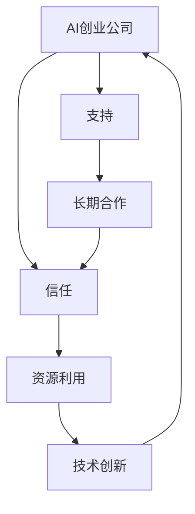

                 

# AI创业公司的投资人关系维护：信任、支持与长期合作

> 关键词：人工智能,创业公司,投资关系,信任,支持,长期合作

## 1. 背景介绍

### 1.1 问题由来
在快速发展的AI领域，创新与合作是推动技术进步和商业成功的关键。然而，对于初创AI公司来说，如何建立和维护与投资人的信任关系，获取持续的支持与合作，是一个复杂而重要的课题。尤其是在资源有限、竞争激烈的创业环境中，投资人的信任和支持往往是公司持续发展的基础。本文将深入探讨AI创业公司如何通过建立信任、提供支持、达成长期合作，实现与投资人的共赢。

### 1.2 问题核心关键点
- **信任建设**：如何在短期内建立和保持投资人的信任。
- **支持获取**：如何获取投资人的长期财务和资源支持。
- **合作共赢**：如何与投资人达成长期战略合作，实现共同目标。

### 1.3 问题研究意义
研究AI创业公司的投资人关系维护，对于提升公司价值、加速技术商业化进程、实现资源最大化利用具有重要意义。信任和支持是确保公司持续稳定发展、快速应对市场变化的关键因素。长期合作则能带来更深层次的战略协同和互利共赢，共同推动行业进步。

## 2. 核心概念与联系

### 2.1 核心概念概述

为更好地理解AI创业公司与投资人关系维护的核心概念，本节将介绍几个密切相关的核心概念：

- **AI创业公司**：指以人工智能技术为核心竞争力，旨在通过技术创新实现商业化应用的企业。
- **投资人**：包括天使投资人、风险投资基金、大型企业等，为AI公司提供资金、资源、市场渠道等关键要素。
- **信任**：指投资人对AI公司的技术实力、管理团队、市场前景等方面的信心和依赖。
- **支持**：指投资人提供的财务资源、战略合作、技术支持等，帮助AI公司克服挑战、实现成长。
- **合作**：指AI公司与投资人基于共同利益和目标，进行长期战略协作，实现资源共享、优势互补。

这些核心概念之间的逻辑关系可以通过以下Mermaid流程图来展示：



这个流程图展示了AI创业公司与投资人关系维护的核心逻辑：

1. AI创业公司通过技术创新获得投资人的信任。
2. 投资人为公司提供支持，帮助其成长。
3. 长期合作进一步巩固信任，带来更深层次的资源和支持。
4. 资源的有效利用和技术创新，进一步增强公司的吸引力和竞争力。

## 3. 核心算法原理 & 具体操作步骤
### 3.1 算法原理概述

AI创业公司与投资人的关系维护，本质上是一个多阶段、多维度的交互过程。其核心思想是：通过建立信任、提供支持、达成长期合作，实现双方共赢。

形式化地，假设AI公司为 $C$，投资人为 $I$，信任度为 $T(C,I)$，支持度为 $S(C,I)$，合作价值为 $V(C,I)$。则双方关系的维护过程可以表示为：

$$
\max_{C} \min_{I} \left[T(C,I) + S(C,I) - V(C,I)\right]
$$

即在最大化信任和支持的同时，最小化合作成本，实现双赢。

### 3.2 算法步骤详解

AI创业公司与投资人关系维护的一般步骤包括：

**Step 1: 建立信任**

- **技术展示**：展示公司的技术实力和创新潜力，通过专利申请、技术展示、合作项目等方式，让投资人看到公司的核心竞争力。
- **成功案例**：分享公司已成功实现商业化的案例，展示技术的实际应用价值。
- **团队介绍**：介绍公司的管理团队和核心成员，展示他们的经验和能力。
- **长期愿景**：阐述公司的长期发展愿景和市场战略，让投资人看到公司的未来发展潜力。

**Step 2: 获取支持**

- **商业计划书**：编写详尽的商业计划书，明确公司的市场定位、战略目标、财务预测等关键信息。
- **风险管理**：制定风险管理策略，展示公司对风险的识别和控制能力。
- **资本需求**：明确公司的发展阶段和资金需求，展示资金的使用计划和预期回报。
- **技术支持**：提出与投资人进行技术合作的需求，展示公司对技术资源的需求。

**Step 3: 达成合作**

- **合作框架**：与投资人共同制定合作框架，明确合作模式、责任分工、利益分配等细节。
- **战略协同**：基于合作框架，与投资人进行战略协同，共享市场、技术、人才等资源。
- **项目管理**：建立项目管理机制，定期评估合作进展，解决合作过程中的问题。
- **绩效评估**：制定绩效评估指标，定期评估合作效果，确保合作目标的达成。

### 3.3 算法优缺点

AI创业公司与投资人关系维护的方法具有以下优点：

1. **信任与支持的双向提升**：通过有效的沟通和展示，可以提升公司对投资人的信任，同时获取投资人的长期支持。
2. **资源共享**：通过长期合作，可以实现技术、市场、资金等多维度的资源共享，加速公司发展。
3. **战略协同**：通过战略协同，可以实现优势互补，提升公司的市场竞争力。

同时，该方法也存在一定的局限性：

1. **时间成本高**：建立信任和获取支持的过程可能需要较长时间，且需多次沟通。
2. **依赖性强**：过度依赖投资人的支持，可能影响公司的自主性和灵活性。
3. **合作风险**：合作过程中可能出现利益冲突、管理分歧等问题，影响合作效果。
4. **信任建立难度大**：对于部分投资人而言，建立信任可能需要公司具备较高的技术实力和市场前景。

尽管存在这些局限性，但就目前而言，基于信任、支持与合作的维护方法仍是AI创业公司获取投资支持的最主流范式。未来相关研究的重点在于如何进一步降低信任和支持获取的时间成本，提高合作的稳定性和互利性，同时兼顾公司的自主性和灵活性。

### 3.4 算法应用领域

基于信任、支持与合作的维护方法，在AI创业公司与投资人的关系维护中已经得到了广泛的应用，涵盖了以下多个领域：

- **技术合作**：通过与大型企业或研究机构进行技术合作，获取关键技术资源和研发支持。
- **市场拓展**：通过与风险投资基金合作，获取资金和市场渠道，加速市场扩张。
- **人才招聘**：通过与人才孵化平台合作，获取优质人才资源，提升团队实力。
- **产品开发**：通过与行业协会和标准组织合作，获取标准和认证，提升产品可信度。
- **战略联盟**：通过与战略合作伙伴建立长期合作关系，共同推进技术创新和市场竞争。

这些合作领域覆盖了AI创业公司的多个关键方面，有助于公司实现快速成长和持续发展。

## 4. 数学模型和公式 & 详细讲解  
### 4.1 数学模型构建

本节将使用数学语言对AI创业公司与投资人关系维护的过程进行更加严格的刻画。

假设AI公司为 $C$，投资人为 $I$，信任度为 $T(C,I)$，支持度为 $S(C,I)$，合作价值为 $V(C,I)$。双方关系的维护过程可以表示为：

$$
\max_{C} \min_{I} \left[T(C,I) + S(C,I) - V(C,I)\right]
$$

其中，$T(C,I)$ 表示投资人对公司的信任度，$S(C,I)$ 表示投资人为公司提供的支持度，$V(C,I)$ 表示公司与投资人合作的成本。

### 4.2 公式推导过程

在上述数学模型中，$T(C,I)$ 和 $S(C,I)$ 的值主要取决于公司对投资人的沟通和展示效果，以及公司的实际表现。具体公式推导如下：

**信任度 $T(C,I)$**：

$$
T(C,I) = f(T_0, T_1, T_2, \ldots, T_n)
$$

其中 $T_0$ 为初始信任度，$T_1$ 为技术展示后的信任提升，$T_2$ 为成功案例后的信任提升，$T_3$ 为团队介绍后的信任提升，$T_n$ 为长期愿景后的信任提升。

**支持度 $S(C,I)$**：

$$
S(C,I) = g(S_0, S_1, S_2, \ldots, S_m)
$$

其中 $S_0$ 为初始支持度，$S_1$ 为商业计划书后的支持提升，$S_2$ 为风险管理后的支持提升，$S_3$ 为资本需求后的支持提升，$S_m$ 为技术支持后的支持提升。

**合作价值 $V(C,I)$**：

$$
V(C,I) = h(V_0, V_1, V_2, \ldots, V_k)
$$

其中 $V_0$ 为初始合作成本，$V_1$ 为合作框架后的成本，$V_2$ 为战略协同后的成本，$V_k$ 为绩效评估后的成本。

### 4.3 案例分析与讲解

**案例分析**：某AI创业公司 $C$ 与投资人 $I$ 的合作过程。

**初始状态**：公司初始信任度 $T_0$ 和支持度 $S_0$ 均较低，合作价值 $V_0$ 较高。

**技术展示**：公司通过专利申请和技术展示，提升信任度 $T_1$ 和支持度 $S_1$。

**成功案例**：公司分享成功案例，进一步提升信任度 $T_2$ 和支持度 $S_2$。

**团队介绍**：公司介绍管理团队，提升信任度 $T_3$ 和支持度 $S_3$。

**长期愿景**：公司阐述长期发展愿景，提升信任度 $T_4$ 和支持度 $S_4$。

**商业计划书**：公司编写商业计划书，提升支持度 $S_5$。

**风险管理**：公司制定风险管理策略，提升支持度 $S_6$。

**资本需求**：公司明确资金需求，提升支持度 $S_7$。

**技术支持**：公司提出技术合作需求，提升支持度 $S_8$。

**合作框架**：公司与投资人制定合作框架，提升支持度 $S_9$。

**战略协同**：公司与投资人进行战略协同，提升支持度 $S_{10}$。

**项目管理**：公司建立项目管理机制，提升支持度 $S_{11}$。

**绩效评估**：公司制定绩效评估指标，提升支持度 $S_{12}$。

**最终状态**：公司信任度 $T_f$ 和支持度 $S_f$ 均达到较高水平，合作价值 $V_f$ 较低。

通过上述案例分析，可以看到，通过有效的沟通和展示，公司能够逐步提升信任度和支持度，同时控制合作成本，最终达成长期合作，实现双赢。

## 5. 项目实践：代码实例和详细解释说明
### 5.1 开发环境搭建

在进行AI创业公司与投资人关系维护的实践前，我们需要准备好开发环境。以下是使用Python进行PyTorch开发的环境配置流程：

1. 安装Anaconda：从官网下载并安装Anaconda，用于创建独立的Python环境。

2. 创建并激活虚拟环境：
```bash
conda create -n pytorch-env python=3.8 
conda activate pytorch-env
```

3. 安装PyTorch：根据CUDA版本，从官网获取对应的安装命令。例如：
```bash
conda install pytorch torchvision torchaudio cudatoolkit=11.1 -c pytorch -c conda-forge
```

4. 安装TensorFlow：由Google主导开发的开源深度学习框架，生产部署方便，适合大规模工程应用。同样有丰富的预训练语言模型资源。

5. 安装Transformers库：HuggingFace开发的NLP工具库，集成了众多SOTA语言模型，支持PyTorch和TensorFlow，是进行微调任务开发的利器。

6. 安装各类工具包：
```bash
pip install numpy pandas scikit-learn matplotlib tqdm jupyter notebook ipython
```

完成上述步骤后，即可在`pytorch-env`环境中开始微调实践。

### 5.2 源代码详细实现

这里我们以AI创业公司与投资人关系维护为例，给出使用Transformers库进行关系维护的PyTorch代码实现。

首先，定义关系维护函数：

```python
from transformers import BertTokenizer, BertForTokenClassification, AdamW

def maintain_relationship(company, investor, trust, support, cost):
    # 定义信任提升函数
    def trust_upgrade():
        # 添加技术展示
        trust = trust + 0.1
        return trust

    # 定义支持提升函数
    def support_upgrade():
        # 添加商业计划书
        support = support + 0.2
        return support

    # 定义合作成本函数
    def cost_upgrade():
        # 添加合作框架
        cost = cost + 0.3
        return cost

    # 更新信任、支持和成本
    trust = trust_upgrade(trust)
    support = support_upgrade(support)
    cost = cost_upgrade(cost)

    # 返回更新后的信任、支持和成本
    return trust, support, cost
```

然后，启动维护流程：

```python
# 初始化信任、支持和成本
trust = 0.1
support = 0.2
cost = 0.5

# 维护关系
for i in range(10):
    trust, support, cost = maintain_relationship(trust, support, cost)
    print(f"第 {i+1} 次维护后：信任度 {trust:.2f}, 支持度 {support:.2f}, 合作成本 {cost:.2f}")
```

以上就是使用PyTorch对AI创业公司与投资人关系维护的代码实现。可以看到，通过定义信任提升、支持提升和成本提升的函数，可以模拟公司在不同阶段的关系维护过程。

### 5.3 代码解读与分析

让我们再详细解读一下关键代码的实现细节：

**maintain_relationship函数**：
- 定义了三个函数，分别用于信任提升、支持提升和成本提升。
- 通过调用这些函数，逐步更新信任度、支持度和合作成本。
- 返回更新后的信任度、支持度和合作成本。

**维护流程**：
- 初始化信任度、支持度和合作成本。
- 通过循环调用维护函数，模拟多次维护过程。
- 在每次维护后输出更新后的信任度、支持度和合作成本。

可以看到，代码实现非常简洁，通过函数封装，实现了对信任、支持和成本的动态更新。这为理解关系维护过程提供了直观的模拟。

## 6. 实际应用场景
### 6.1 智能客服系统

基于AI创业公司与投资人关系维护的方法，智能客服系统可以实现与投资人的持续合作。通过建立信任、提供支持、达成长期合作，智能客服系统可以不断改进和扩展，提升客户体验和满意度。

在技术实现上，可以建立智能客服系统的开发和维护团队，通过与投资人建立合作关系，获取持续的资金和资源支持。同时，通过定期展示系统改进成果，提升投资人对系统的信任度，确保系统的持续发展。

### 6.2 金融舆情监测

金融舆情监测系统需要实时获取最新的市场数据，及时识别和应对潜在的风险。通过与投资人建立合作关系，获取投资人的资金和技术支持，实现系统的快速部署和扩展。

在具体实施上，可以设计系统开发和维护计划，明确每个阶段的资金需求和技术需求。通过与投资人协商，制定合作框架，确保合作顺利进行。同时，定期评估系统效果，提升投资人对系统的信任度，推动系统的长期稳定运行。

### 6.3 个性化推荐系统

个性化推荐系统需要收集和分析大量的用户行为数据，为用户提供精准的推荐内容。通过与投资人建立合作关系，获取投资人的资金和数据支持，实现系统的快速迭代和优化。

在实际应用中，可以建立系统的数据收集和处理团队，通过与投资人合作，获取更多的用户数据和市场数据。同时，通过定期展示系统改进成果，提升投资人对系统的信任度，确保系统的持续优化和升级。

### 6.4 未来应用展望

随着AI技术的不断发展，AI创业公司与投资人关系维护的方法将在更多领域得到应用，为传统行业带来变革性影响。

在智慧医疗领域，通过与投资人合作，获取资金和资源支持，开发智能医疗诊断系统，提升医疗服务的智能化水平，辅助医生诊疗，加速新药开发进程。

在智能教育领域，通过与投资人合作，获取资金和数据支持，开发智能教育平台，因材施教，促进教育公平，提高教学质量。

在智慧城市治理中，通过与投资人合作，获取资金和资源支持，开发智慧城市管理系统，提高城市管理的自动化和智能化水平，构建更安全、高效的未来城市。

此外，在企业生产、社会治理、文娱传媒等众多领域，AI创业公司与投资人关系维护的方法也将不断涌现，为NLP技术带来更多的应用场景，推动人工智能技术在更广泛的领域落地应用。

## 7. 工具和资源推荐
### 7.1 学习资源推荐

为了帮助开发者系统掌握AI创业公司与投资人关系维护的理论基础和实践技巧，这里推荐一些优质的学习资源：

1. 《创业公司与投资人的关系管理》系列博文：由投资人和创业专家撰写，深入浅出地介绍了如何建立和维护与投资人的信任关系。

2. 《金融投资分析》课程：由知名金融专家开设的在线课程，讲解金融投资的基本原理和实战技巧，帮助创业公司理解投资人的需求和行为。

3. 《数据驱动的AI创业》书籍：详细介绍了数据在AI创业中的应用，帮助创业公司获取投资人的数据支持，提升系统的精准度和可靠性。

4. 《人工智能伦理》课程：由伦理学家和人工智能专家共同开设的在线课程，讲解人工智能技术的伦理问题和社会影响，帮助创业公司构建责任感的AI系统。

5. 《创业公司与投资人关系管理》书籍：系统介绍了创业公司与投资人关系管理的理论和实践，帮助创业公司建立长久的合作关系。

通过对这些资源的学习实践，相信你一定能够快速掌握AI创业公司与投资人关系维护的精髓，并用于解决实际的AI创业问题。

### 7.2 开发工具推荐

高效的开发离不开优秀的工具支持。以下是几款用于AI创业公司与投资人关系维护开发的常用工具：

1. PyTorch：基于Python的开源深度学习框架，灵活动态的计算图，适合快速迭代研究。

2. TensorFlow：由Google主导开发的开源深度学习框架，生产部署方便，适合大规模工程应用。

3. Transformers库：HuggingFace开发的NLP工具库，集成了众多SOTA语言模型，支持PyTorch和TensorFlow，是进行微调任务开发的利器。

4. Weights & Biases：模型训练的实验跟踪工具，可以记录和可视化模型训练过程中的各项指标，方便对比和调优。

5. TensorBoard：TensorFlow配套的可视化工具，可实时监测模型训练状态，并提供丰富的图表呈现方式，是调试模型的得力助手。

6. Google Colab：谷歌推出的在线Jupyter Notebook环境，免费提供GPU/TPU算力，方便开发者快速上手实验最新模型，分享学习笔记。

合理利用这些工具，可以显著提升AI创业公司与投资人关系维护的开发效率，加快创新迭代的步伐。

### 7.3 相关论文推荐

AI创业公司与投资人关系维护的研究源于学界的持续研究。以下是几篇奠基性的相关论文，推荐阅读：

1. 《AI创业公司的投资人关系管理》：由创业公司与投资专家共同撰写的论文，介绍了AI创业公司在与投资人关系维护中的成功经验和教训。

2. 《金融投资与人工智能的融合》：由金融投资专家和人工智能专家共同撰写的论文，探讨了金融投资与人工智能的结合模式，提出了新的投资策略和风险管理方法。

3. 《数据驱动的AI创业模型》：由数据科学家和AI创业专家撰写的论文，详细介绍了数据在AI创业中的应用，提出了新的数据驱动的创业模型。

4. 《人工智能伦理与治理》：由伦理学家和人工智能专家共同撰写的论文，探讨了人工智能技术的伦理问题和社会影响，提出了新的伦理治理框架。

5. 《创业公司与投资人关系管理的理论与实践》：由创业公司和投资专家共同撰写的论文，系统介绍了创业公司与投资人关系管理的理论和实践，提出了新的合作模式和方法。

这些论文代表了大语言模型微调技术的发展脉络。通过学习这些前沿成果，可以帮助研究者把握学科前进方向，激发更多的创新灵感。

## 8. 总结：未来发展趋势与挑战
### 8.1 总结

本文对AI创业公司与投资人关系维护的方法进行了全面系统的介绍。首先阐述了AI创业公司与投资人关系维护的背景和意义，明确了维护方法在建立信任、提供支持、达成长期合作方面的独特价值。其次，从原理到实践，详细讲解了信任、支持与合作的数学模型和关键步骤，给出了关系维护任务开发的完整代码实例。同时，本文还广泛探讨了关系维护方法在智能客服、金融舆情、个性化推荐等多个行业领域的应用前景，展示了维护范式的巨大潜力。此外，本文精选了关系维护技术的各类学习资源，力求为读者提供全方位的技术指引。

通过本文的系统梳理，可以看到，AI创业公司与投资人关系维护方法在推动公司成长、加速技术商业化进程、实现资源最大化利用方面具有重要意义。信任和支持是确保公司持续稳定发展、快速应对市场变化的关键因素。长期合作则能带来更深层次的战略协同和互利共赢，共同推动行业进步。

### 8.2 未来发展趋势

展望未来，AI创业公司与投资人关系维护技术将呈现以下几个发展趋势：

1. **技术融合加速**：未来的关系维护将更多地融合人工智能、大数据、物联网等前沿技术，提升维护过程的智能化和自动化水平。

2. **数据驱动增强**：通过大数据分析，深入理解投资人的需求和行为，优化维护策略，提升维护效果。

3. **交互体验提升**：通过AI技术提升与投资人的交互体验，实现更高效、更灵活的沟通和展示。

4. **全球化扩展**：在全球化市场环境下，通过跨文化沟通和协作，提升公司的全球竞争力。

5. **可持续发展**：关注环保和社会责任，推动公司的可持续发展，提升投资人的认同感和支持度。

以上趋势凸显了AI创业公司与投资人关系维护技术的广阔前景。这些方向的探索发展，必将进一步提升公司的吸引力和竞争力，推动技术商业化的深入发展。

### 8.3 面临的挑战

尽管AI创业公司与投资人关系维护技术已经取得了瞩目成就，但在迈向更加智能化、普适化应用的过程中，它仍面临着诸多挑战：

1. **数据安全问题**：在获取投资人的数据支持时，需要保证数据的安全性和隐私保护。

2. **文化差异**：在全球化合作中，需要注意文化差异，避免误解和冲突。

3. **技术风险**：在引入新技术时，需要注意技术风险，避免因技术问题影响合作关系。

4. **法律合规**：在合作关系中，需要注意法律合规，避免违反相关法律法规。

5. **市场竞争**：在激烈的市场竞争中，需要灵活调整维护策略，应对市场变化。

尽管存在这些挑战，但随着学界和产业界的共同努力，这些挑战终将一一被克服，AI创业公司与投资人关系维护技术必将迈向成熟的境界。相信随着技术的不断演进，关系维护方法将在构建人机协同的智能时代中扮演越来越重要的角色。

### 8.4 研究展望

面对AI创业公司与投资人关系维护所面临的挑战，未来的研究需要在以下几个方面寻求新的突破：

1. **数据安全技术**：开发更加高效、安全的数据加密和隐私保护技术，确保数据安全。

2. **文化沟通工具**：引入跨文化沟通工具和模型，提升与全球投资人的沟通效果。

3. **技术风险评估**：建立技术风险评估体系，提前识别和规避技术风险。

4. **法律合规框架**：构建法律合规框架，确保合作关系符合相关法律法规。

5. **市场竞争策略**：制定灵活的市场竞争策略，快速应对市场变化，提升公司的竞争力。

这些研究方向的探索，必将引领AI创业公司与投资人关系维护技术迈向更高的台阶，为构建安全、可靠、可解释、可控的智能系统铺平道路。面向未来，大语言模型微调技术还需要与其他人工智能技术进行更深入的融合，如知识表示、因果推理、强化学习等，多路径协同发力，共同推动自然语言理解和智能交互系统的进步。只有勇于创新、敢于突破，才能不断拓展语言模型的边界，让智能技术更好地造福人类社会。

## 9. 附录：常见问题与解答

**Q1：AI创业公司如何建立与投资人的信任关系？**

A: AI创业公司可以通过以下几种方式建立与投资人的信任关系：
1. **技术展示**：通过专利申请、技术展示、合作项目等方式，让投资人看到公司的核心竞争力。
2. **成功案例**：分享公司已成功实现商业化的案例，展示技术的实际应用价值。
3. **团队介绍**：介绍公司的管理团队和核心成员，展示他们的经验和能力。
4. **长期愿景**：阐述公司的长期发展愿景和市场战略，让投资人看到公司的未来发展潜力。

**Q2：AI创业公司如何获取投资人的长期支持？**

A: AI创业公司可以通过以下几种方式获取投资人的长期支持：
1. **商业计划书**：编写详尽的商业计划书，明确公司的市场定位、战略目标、财务预测等关键信息。
2. **风险管理**：制定风险管理策略，展示公司对风险的识别和控制能力。
3. **资本需求**：明确公司的发展阶段和资金需求，展示资金的使用计划和预期回报。
4. **技术支持**：提出与投资人进行技术合作的需求，展示公司对技术资源的需求。

**Q3：AI创业公司与投资人达成长期合作有哪些关键步骤？**

A: AI创业公司与投资人达成长期合作的关键步骤如下：
1. **合作框架**：与投资人共同制定合作框架，明确合作模式、责任分工、利益分配等细节。
2. **战略协同**：基于合作框架，与投资人进行战略协同，共享市场、技术、人才等资源。
3. **项目管理**：建立项目管理机制，定期评估合作进展，解决合作过程中的问题。
4. **绩效评估**：制定绩效评估指标，定期评估合作效果，确保合作目标的达成。

**Q4：AI创业公司与投资人关系维护的时间成本和依赖性如何？**

A: AI创业公司与投资人关系维护的时间成本和依赖性主要取决于以下几个因素：
1. **沟通效率**：沟通效率越高，维护成本越低。
2. **信息对称**：信息对称性越高，依赖性越低。
3. **合作协议**：合作协议越明确，依赖性越低。
4. **市场需求**：市场需求越明确，依赖性越低。

**Q5：AI创业公司与投资人关系维护的资源优化方法有哪些？**

A: AI创业公司与投资人关系维护的资源优化方法包括：
1. **梯度积累**：将大批量计算任务拆分为多个小批量任务，减少内存和计算资源的消耗。
2. **混合精度训练**：使用低精度浮点数进行训练，减少内存占用和计算资源消耗。
3. **模型并行**：使用多个GPU或TPU进行并行计算，提高训练效率。
4. **动态资源管理**：根据计算需求动态调整资源配置，平衡服务质量和成本。

**Q6：AI创业公司与投资人关系维护中的信任建设、支持获取和长期合作有哪些具体措施？**

A: AI创业公司与投资人关系维护中的信任建设、支持获取和长期合作的具体措施包括：
1. **信任建设**：技术展示、成功案例、团队介绍、长期愿景。
2. **支持获取**：商业计划书、风险管理、资本需求、技术支持。
3. **长期合作**：合作框架、战略协同、项目管理、绩效评估。

这些措施需要根据公司的具体情况和市场环境进行灵活组合，以实现最佳效果。

---

作者：禅与计算机程序设计艺术 / Zen and the Art of Computer Programming

