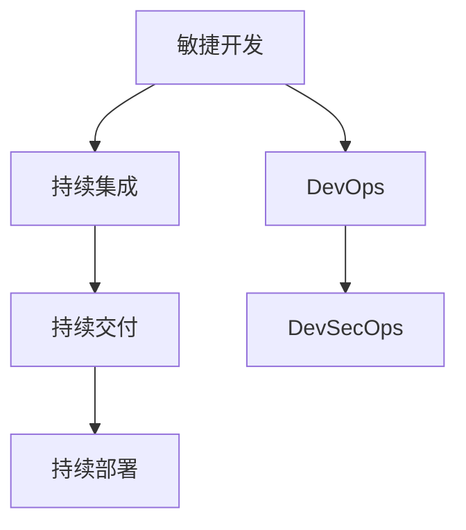

                 

# AI创业公司的敏捷开发与持续交付：快速迭代与用户反馈

> 关键词：敏捷开发,持续交付,快速迭代,用户反馈,软件开发,人工智能创业公司,DevOps,DevSecOps

## 1. 背景介绍

### 1.1 问题由来
在AI创业公司的激烈竞争环境中，迅速响应市场变化和用户需求，高效推出高质量的产品，是决定其生存与发展的关键。传统的软件开发模式（瀑布模型）通常按部就班，难以适应快速变化的市场需求。而敏捷开发与持续交付模式提供了一种快速响应变化、不断迭代优化产品的方法，使得AI创业公司能够在短期内快速构建、测试、优化产品，提升市场竞争力。

### 1.2 问题核心关键点
敏捷开发与持续交付（Agile Development & Continuous Delivery, Agile CD）是一种基于团队协作的软件开发与交付模式。通过快速迭代、持续集成和持续部署，敏捷开发与持续交付实现了软件从需求到交付的快速循环，提高了软件的质量和效率。特别是在AI创业公司，敏捷开发与持续交付可以帮助团队快速适应变化，快速迭代产品，提升用户体验，从而在竞争中占据优势。

敏捷开发与持续交付的核心在于：

1. 快速迭代：将软件开发周期分割为多个短期迭代，每个迭代都通过快速反馈和修正，不断优化产品功能与性能。
2. 持续集成：实时将代码集成到共享代码库中，并自动运行自动化测试，确保代码的稳定性和可集成性。
3. 持续部署：自动将经过测试的代码部署到生产环境，确保产品可以快速响应市场和用户需求的变化。
4. 用户反馈：在每个迭代结束时，收集用户反馈，快速迭代优化，保证产品始终符合用户需求。

### 1.3 问题研究意义
敏捷开发与持续交付在AI创业公司中的应用，对于提升产品的快速交付能力、响应市场需求、提升用户体验具有重要意义。其研究与实践能够帮助AI创业公司：

1. 提升市场竞争力：通过快速迭代与持续交付，快速响应市场需求，提升产品的快速交付能力。
2. 提升产品质量：通过持续集成与自动化测试，确保代码的稳定性和可集成性。
3. 提升用户体验：通过用户反馈的快速迭代，优化产品功能与性能，提升用户体验。
4. 降低开发成本：通过自动化工具的利用，减少人工操作，降低开发和测试成本。
5. 加速创新速度：通过持续交付，快速迭代产品，加速新技术和功能的引入，推动公司持续创新。

## 2. 核心概念与联系

### 2.1 核心概念概述

为更好地理解敏捷开发与持续交付方法，本节将介绍几个密切相关的核心概念：

- 敏捷开发（Agile Development）：一种基于团队协作的软件开发方法，以快速响应变化、提升产品质量为核心目标。
- 持续集成（Continuous Integration, CI）：实时将代码集成到共享代码库中，并自动运行自动化测试，确保代码的稳定性和可集成性。
- 持续交付（Continuous Delivery, CD）：自动将经过测试的代码部署到生产环境，确保产品可以快速响应市场和用户需求的变化。
- 持续部署（Continuous Deployment, CD）：持续交付过程中的一种自动化模式，实现自动部署至生产环境。
- DevOps：开发（Dev）与运维（Ops）的结合，通过工具链自动化实现敏捷开发与持续交付。
- DevSecOps：将安全集成到DevOps实践中，提升系统的安全性和可靠性。

这些核心概念之间的逻辑关系可以通过以下Mermaid流程图来展示：



这个流程图展示了大语言模型的核心概念及其之间的关系：

1. 敏捷开发通过快速迭代和团队协作，提升开发效率。
2. 持续集成与自动化测试，确保代码的稳定性和可集成性。
3. 持续交付和持续部署，实现代码的快速部署与交付。
4. DevOps和DevSecOps通过自动化工具链，提升开发和运维效率，保证系统安全。

这些概念共同构成了敏捷开发与持续交付的核心，使得AI创业公司能够灵活应对市场需求，快速构建和优化产品。

## 3. 核心算法原理 & 具体操作步骤
### 3.1 算法原理概述

敏捷开发与持续交付的实现原理基于以下核心算法：

- 快速迭代算法（Sprint Algorithm）：将软件开发周期分割为多个短期迭代（Sprint），每个迭代周期一般为1-4周。在每个Sprint中，团队通过快速反馈和修正，不断优化产品功能与性能。

- 持续集成算法（CI Algorithm）：实时将代码集成到共享代码库中，并通过自动化测试系统进行持续集成，确保代码的稳定性和可集成性。

- 持续交付算法（CD Algorithm）：将经过测试的代码自动部署到生产环境，确保产品可以快速响应市场和用户需求的变化。

这些算法的核心思想是实时反馈和自动化，通过快速迭代和自动化工具，提升开发和交付的效率，保证产品质量和用户体验。

### 3.2 算法步骤详解

敏捷开发与持续交付的具体操作步骤包括以下几个关键环节：

**Step 1: 需求分析与优先级排序**

- 收集用户需求和产品愿景，进行需求分析。
- 对需求进行优先级排序，确定每个Sprint的任务列表。
- 使用敏捷工具（如Jira, Trello）进行任务管理和追踪。

**Step 2: 团队协作与迭代开发**

- 团队采用Scrum等敏捷方法进行协作，每日站会（Daily Scrum）进行沟通和进度汇报。
- 在每个Sprint周期中，团队进行快速迭代开发，按优先级排序的任务列表进行快速开发和优化。

**Step 3: 持续集成与自动化测试**

- 使用CI工具（如Jenkins, GitLab CI）进行代码集成，确保代码在每次提交后即时集成到共享代码库中。
- 自动化运行测试用例，确保每次提交的代码都能通过自动化测试，避免代码质量问题。

**Step 4: 持续交付与持续部署**

- 使用CD工具（如Jenkins, GitLab CI）进行持续交付，自动将通过测试的代码部署到生产环境。
- 通过持续部署，实现代码的自动化部署，确保产品可以快速响应市场需求和用户反馈的变化。

**Step 5: 用户反馈与迭代优化**

- 在每个Sprint结束时，收集用户反馈，分析产品功能和性能的改进点。
- 根据用户反馈进行快速迭代优化，确保产品始终符合用户需求。

### 3.3 算法优缺点

敏捷开发与持续交付具有以下优点：

1. 快速响应变化：通过快速迭代和实时反馈，敏捷开发与持续交付可以迅速适应市场需求和用户反馈的变化，提升市场竞争力。
2. 提升产品质量：通过持续集成和自动化测试，确保代码的稳定性和可集成性，提升产品质量和可靠性。
3. 提升用户体验：通过用户反馈的快速迭代，优化产品功能与性能，提升用户体验。
4. 降低开发成本：通过自动化工具的利用，减少人工操作，降低开发和测试成本。
5. 加速创新速度：通过持续交付，快速迭代产品，加速新技术和功能的引入，推动公司持续创新。

同时，该方法也存在一定的局限性：

1. 团队协作复杂：敏捷开发需要高度的团队协作和沟通，团队成员需要具备较强的自我管理和自驱能力。
2. 初期学习成本高：敏捷开发需要掌握敏捷方法和工具，初学者可能面临较高的学习成本。
3. 需求变更风险高：快速迭代和频繁变更可能导致需求不稳定，增加项目风险。

尽管存在这些局限性，但就目前而言，敏捷开发与持续交付方法仍是软件开发的主流范式。未来相关研究的重点在于如何进一步降低敏捷开发的复杂度和学习成本，提高敏捷项目的成功率。

### 3.4 算法应用领域

敏捷开发与持续交付在软件开发领域已经得到了广泛的应用，覆盖了几乎所有类型的软件项目，包括但不限于：

- 互联网产品开发：如社交媒体、电商、游戏等。通过敏捷开发和持续交付，实现快速迭代和持续优化。
- 企业级应用：如ERP、CRM、BI等。通过敏捷开发和持续交付，提升企业运营效率和用户体验。
- 移动应用开发：如iOS、Android应用。通过敏捷开发和持续交付，提升产品迭代速度和质量。
- 智能硬件开发：如智能家居、智能穿戴设备。通过敏捷开发和持续交付，实现快速原型开发和产品迭代。
- AI产品开发：如机器学习模型、自然语言处理等。通过敏捷开发和持续交付，提升模型的快速迭代和优化能力。

## 4. 数学模型和公式 & 详细讲解 & 举例说明（备注：数学公式请使用latex格式，latex嵌入文中独立段落使用 $$，段落内使用 $)
### 4.1 数学模型构建

敏捷开发与持续交付的数学模型主要涉及Sprint周期时间、任务完成率、产品迭代次数等关键指标。以下是一个基本的敏捷开发与持续交付的数学模型：

设软件开发周期为 $T$，每个Sprint周期为 $s$，Sprint周期内任务数量为 $N$，任务完成率为 $p$。则敏捷开发与持续交付模型的基本公式如下：

- Sprint周期数 $C = \frac{T}{s}$
- 完成的任务数 $X = C \times N \times p$

**案例分析与讲解：**

假设一个软件开发周期为3个月，每个Sprint周期为2周，Sprint内任务数量为10个，任务完成率为0.8，则：

- Sprint周期数 $C = \frac{12}{2} = 6$
- 完成的任务数 $X = 6 \times 10 \times 0.8 = 48$

这表明在6个Sprint周期内，团队可以完成48个任务。

### 4.2 公式推导过程

敏捷开发与持续交付的数学模型推导如下：

- 假设软件开发周期为 $T$，每个Sprint周期为 $s$，Sprint周期内任务数量为 $N$，任务完成率为 $p$。
- 则Sprint周期数 $C = \frac{T}{s}$
- 完成的任务数 $X = C \times N \times p = \frac{T}{s} \times N \times p$

通过以上公式，可以清晰地分析敏捷开发与持续交付的效果，从而优化软件开发流程。

## 5. 项目实践：代码实例和详细解释说明
### 5.1 开发环境搭建

在进行敏捷开发与持续交付实践前，我们需要准备好开发环境。以下是使用GitLab进行敏捷开发与持续交付的环境配置流程：

1. 安装GitLab：从官网下载并安装GitLab，创建项目仓库。
2. 配置CI/CD pipeline：在项目仓库中配置CI/CD pipeline，定义代码集成和自动化测试步骤。
3. 配置持续部署：在项目仓库中配置持续部署，自动将通过测试的代码部署到生产环境。
4. 使用Jenkins等工具：配置Jenkins作为CI/CD工具，集成到GitLab中，自动运行代码集成和测试。

完成上述步骤后，即可在GitLab中开始敏捷开发与持续交付实践。

### 5.2 源代码详细实现

下面我们以一个简单的Web应用为例，给出使用GitLab进行敏捷开发与持续交付的代码实现。

**代码实现：**

1. 创建项目仓库：
```bash
git clone https://gitlab.com/example/repo.git
cd repo
```

2. 设置项目分支：
```bash
git checkout -b develop
```

3. 编写代码并提交变更：
```bash
echo "Hello, world!" > index.html
git add .
git commit -m "Add index.html"
git push origin develop
```

4. 配置CI/CD pipeline：
- 在项目仓库中创建`.gitlab-ci.yml`文件，定义CI/CD流程：
```yaml
stages:
  - test

build-test:
  stage: test
  script:
    - echo "Building test"
    - npm install
    - npm test
  artifacts:
    paths:
      - test-results
```

5. 配置持续部署：
- 在项目仓库中创建`.gitlab-ci.yml`文件，定义持续部署流程：
```yaml
stages:
  - deploy

deploy:
  stage: deploy
  script:
    - echo "Deploying to production"
    - npm install
    - npm run build
    - npm run deploy
```

6. 使用Jenkins等工具：
- 在Jenkins中配置Webhook，接收GitLab的变更通知。
- 在Jenkins中配置CI/CD pipeline，自动运行代码集成和测试。
- 在Jenkins中配置持续部署，自动将通过测试的代码部署到生产环境。

**代码解读与分析：**

- 代码实现部分：通过`git clone`和`git checkout`命令创建项目仓库和分支，`echo`命令编写代码并提交变更。
- CI/CD pipeline部分：在`.gitlab-ci.yml`文件中定义`build-test`和`deploy`两个阶段，分别用于测试和部署。`script`部分定义了测试和部署的具体步骤，`artifacts`部分定义了测试结果的保存路径。
- Jenkins部分：通过配置Webhook，接收GitLab的变更通知，自动运行CI/CD pipeline，实现代码集成和测试，同时配置持续部署，实现代码的自动化部署。

## 6. 实际应用场景
### 6.1 智能推荐系统开发

敏捷开发与持续交付方法在智能推荐系统开发中得到了广泛应用。传统推荐系统往往依赖于静态特征和数据模型，难以实时响应用户需求变化。通过敏捷开发与持续交付，推荐系统可以快速迭代和优化，实时响应用户反馈，提升推荐效果。

在实践中，可以采用DevOps方法进行推荐系统的开发和部署。具体步骤包括：

1. 需求分析与优先级排序：通过用户反馈和数据分析，确定推荐系统的核心功能和改进点。
2. 团队协作与迭代开发：敏捷团队根据优先级排序的任务列表，进行快速迭代开发。
3. 持续集成与自动化测试：使用CI工具自动化运行测试用例，确保每次提交的代码都能通过自动化测试。
4. 持续部署与持续反馈：使用CD工具自动化将经过测试的代码部署到生产环境，并实时收集用户反馈，进行快速迭代优化。

通过敏捷开发与持续交付，智能推荐系统能够快速响应用户需求，提升推荐效果和用户体验。

### 6.2 智慧医疗平台开发

敏捷开发与持续交付方法在智慧医疗平台开发中也得到了应用。传统医疗平台开发周期长，难以实时响应医疗需求变化。通过敏捷开发与持续交付，智慧医疗平台可以快速迭代和优化，提升医疗服务效率和质量。

在实践中，可以采用DevSecOps方法进行智慧医疗平台的开发和部署。具体步骤包括：

1. 需求分析与优先级排序：通过医疗专家和用户反馈，确定智慧医疗平台的核心功能和改进点。
2. 团队协作与迭代开发：敏捷团队根据优先级排序的任务列表，进行快速迭代开发。
3. 持续集成与自动化测试：使用CI工具自动化运行测试用例，确保每次提交的代码都能通过自动化测试。
4. 持续部署与持续反馈：使用CD工具自动化将经过测试的代码部署到生产环境，并实时收集医疗用户反馈，进行快速迭代优化。

通过敏捷开发与持续交付，智慧医疗平台能够快速响应医疗需求，提升医疗服务效率和质量，保障患者健康安全。

### 6.3 智能客服系统开发

敏捷开发与持续交付方法在智能客服系统开发中也得到了应用。传统客服系统依赖于人工服务，难以快速响应用户咨询。通过敏捷开发与持续交付，智能客服系统可以快速迭代和优化，提升客户咨询体验。

在实践中，可以采用DevOps方法进行智能客服系统的开发和部署。具体步骤包括：

1. 需求分析与优先级排序：通过客户反馈和数据分析，确定智能客服系统的核心功能和改进点。
2. 团队协作与迭代开发：敏捷团队根据优先级排序的任务列表，进行快速迭代开发。
3. 持续集成与自动化测试：使用CI工具自动化运行测试用例，确保每次提交的代码都能通过自动化测试。
4. 持续部署与持续反馈：使用CD工具自动化将经过测试的代码部署到生产环境，并实时收集客户反馈，进行快速迭代优化。

通过敏捷开发与持续交付，智能客服系统能够快速响应客户咨询，提升客户咨询体验，减轻人工客服压力，提升客服效率。

### 6.4 未来应用展望

随着敏捷开发与持续交付方法的发展，其在AI创业公司中的应用将更加广泛，为AI创业公司带来更多创新机遇。

未来，敏捷开发与持续交付将在以下几个领域得到更广泛的应用：

1. 智能交通系统开发：通过敏捷开发与持续交付，智能交通系统可以快速迭代和优化，提升交通管理效率和服务质量。
2. 智慧能源系统开发：通过敏捷开发与持续交付，智慧能源系统可以快速迭代和优化，提升能源利用效率和安全性。
3. 智能金融系统开发：通过敏捷开发与持续交付，智能金融系统可以快速迭代和优化，提升金融服务效率和用户满意度。
4. 智能制造系统开发：通过敏捷开发与持续交付，智能制造系统可以快速迭代和优化，提升生产效率和产品质量。
5. 智慧城市系统开发：通过敏捷开发与持续交付，智慧城市系统可以快速迭代和优化，提升城市管理效率和居民生活质量。

以上领域的发展，将进一步推动AI创业公司的发展，提升人工智能技术在各个垂直行业的应用效果。

## 7. 工具和资源推荐
### 7.1 学习资源推荐

为了帮助开发者系统掌握敏捷开发与持续交付的理论基础和实践技巧，这里推荐一些优质的学习资源：

1. 《敏捷软件开发》系列书籍：讲述敏捷开发的原理和实践，适合初学者入门。
2. 《持续集成和持续交付实践指南》：全面介绍CI/CD的原理和实践，涵盖CI工具和CD工具的选择和使用。
3. 《DevOps实践指南》：介绍DevOps的原理和实践，涵盖DevOps工具链和自动化流程。
4. 《GitLab DevOps实践指南》：详细介绍GitLab的CI/CD和持续交付功能，适合GitLab用户学习。
5. 《Jenkins用户指南》：详细介绍Jenkins的CI/CD和持续部署功能，适合Jenkins用户学习。

通过对这些资源的学习实践，相信你一定能够快速掌握敏捷开发与持续交付的精髓，并用于解决实际的开发问题。

### 7.2 开发工具推荐

高效的开发离不开优秀的工具支持。以下是几款用于敏捷开发与持续交付开发的常用工具：

1. GitLab：开源的CI/CD平台，支持敏捷开发、持续集成、持续交付和DevOps管理。
2. Jenkins：开源的CI/CD工具，支持多种编程语言和工具链集成。
3. Docker：开源的容器化工具，支持应用的自动化部署和测试。
4. Kubernetes：开源的容器编排工具，支持应用的自动化部署和管理。
5. Ansible：开源的自动化配置管理工具，支持应用的自动化部署和配置。

合理利用这些工具，可以显著提升敏捷开发与持续交付任务的开发效率，加快创新迭代的步伐。

### 7.3 相关论文推荐

敏捷开发与持续交付的发展源于学界的持续研究。以下是几篇奠基性的相关论文，推荐阅读：

1. Agile Software Development: Principles, Practices, and Patterns：讲述敏捷开发的原理和实践，是敏捷开发方法论的经典之作。
2. Continuous Integration: A New Way to Manage Program Changes：提出持续集成的概念，介绍了持续集成的原理和实践。
3. Continuous Delivery: Reliable Software Releases through Automated Testing in Build, Staging, and Production：提出持续交付的概念，介绍了持续交付的原理和实践。
4. The DevOps Handbook：介绍DevOps的原理和实践，涵盖DevOps工具链和自动化流程。
5. GitLab DevOps Radar：详细介绍GitLab的CI/CD和持续交付功能，适合GitLab用户学习。

这些论文代表了大语言模型微调技术的发展脉络。通过学习这些前沿成果，可以帮助研究者把握学科前进方向，激发更多的创新灵感。

## 8. 总结：未来发展趋势与挑战
### 8.1 总结

本文对敏捷开发与持续交付方法进行了全面系统的介绍。首先阐述了敏捷开发与持续交付在AI创业公司中的应用背景和重要性，明确了敏捷开发与持续交付在提升开发效率、响应市场需求、提升用户体验等方面的独特价值。其次，从原理到实践，详细讲解了敏捷开发与持续交付的数学模型和操作步骤，给出了敏捷开发与持续交付任务开发的完整代码实例。同时，本文还广泛探讨了敏捷开发与持续交付方法在多个行业领域的应用前景，展示了其广阔的应用空间。

通过本文的系统梳理，可以看到，敏捷开发与持续交付方法正在成为软件开发的主流范式，极大地提升了软件开发和部署的效率，推动了软件产业的持续创新。未来，伴随敏捷开发与持续交付方法的不断演进，相信软件开发技术必将进入更高的发展阶段，为人类生产生活带来更多便利和革新。

### 8.2 未来发展趋势

展望未来，敏捷开发与持续交付技术将呈现以下几个发展趋势：

1. 自动化程度不断提高：随着自动化工具的不断发展和成熟，自动化测试、自动化部署、自动化监控等环节将进一步优化，提升开发效率和系统稳定性。
2. 持续交付成为标准流程：越来越多的公司和组织将持续交付作为标准流程，确保产品能够快速响应市场需求和用户反馈的变化。
3. 敏捷开发与持续交付深度融合：敏捷开发与持续交付将更加紧密地结合，形成完整的开发交付体系，提升开发和运维效率。
4. DevSecOps成为普及趋势：DevSecOps将安全、合规、性能等环节融入开发和交付流程，提升系统的安全性、可靠性和可维护性。
5. 多团队协作成为常态：敏捷开发与持续交付将更加强调团队协作和跨团队协作，提升整体开发和交付效率。

以上趋势凸显了敏捷开发与持续交付技术的广阔前景。这些方向的探索发展，必将进一步提升软件开发和交付的效率，推动软件开发技术进入新的发展阶段。

### 8.3 面临的挑战

尽管敏捷开发与持续交付技术已经取得了瞩目成就，但在迈向更加智能化、普适化应用的过程中，仍面临诸多挑战：

1. 学习成本高：敏捷开发与持续交付需要掌握敏捷方法和工具，初学者可能面临较高的学习成本。
2. 需求变更风险高：快速迭代和频繁变更可能导致需求不稳定，增加项目风险。
3. 团队协作复杂：敏捷开发需要高度的团队协作和沟通，团队成员需要具备较强的自我管理和自驱能力。
4. 持续集成与部署难度大：持续集成与持续部署的自动化工具链复杂，对团队技术要求较高。
5. 持续监控与优化难度大：持续监控和优化的工具链复杂，对团队技术要求较高。

尽管存在这些挑战，但就目前而言，敏捷开发与持续交付方法仍是软件开发的主流范式。未来相关研究的重点在于如何进一步降低敏捷开发的复杂度和学习成本，提高敏捷项目的成功率。

### 8.4 研究展望

面对敏捷开发与持续交付所面临的挑战，未来的研究需要在以下几个方面寻求新的突破：

1. 探索无监督和半监督敏捷开发方法：摆脱对人工需求分析的依赖，利用自监督学习、主动学习等方法，提升敏捷开发效率。
2. 研究自动化工具的进一步优化：优化自动化测试、持续集成、持续部署和持续监控等工具链，提升开发和交付效率。
3. 探索多团队协作的方法：通过敏捷方法和工具，提升跨团队协作和沟通效率，优化敏捷开发和持续交付流程。
4. 研究DevSecOps的进一步优化：将安全、合规、性能等环节融入开发和交付流程，提升系统的安全性、可靠性和可维护性。
5. 研究多层次的持续反馈机制：通过用户反馈、系统监控、代码审查等机制，提升持续反馈和迭代优化效果。

这些研究方向的探索，必将引领敏捷开发与持续交付技术迈向更高的台阶，为软件开发和交付带来更多创新机遇。面向未来，敏捷开发与持续交付技术还需要与其他人工智能技术进行更深入的融合，如知识表示、因果推理、强化学习等，多路径协同发力，共同推动软件开发技术的进步。只有勇于创新、敢于突破，才能不断拓展软件开发技术的边界，让软件开发技术更好地造福人类社会。

## 9. 附录：常见问题与解答

**Q1：敏捷开发与持续交付是否适用于所有软件开发项目？**

A: 敏捷开发与持续交付适用于大多数软件开发项目，特别是对于需求变化频繁、用户反馈快的项目。但对于一些需要高度稳定的项目，如金融系统、医疗系统等，需要根据具体情况进行适当调整，以保证系统的稳定性和安全性。

**Q2：如何选择合适的敏捷开发方法？**

A: 选择合适的敏捷开发方法需要考虑项目需求、团队规模、技术栈等因素。常见的敏捷方法包括Scrum、Kanban、XP等，每种敏捷方法有其适用场景和优势。可以根据项目实际情况选择合适的敏捷方法，并通过持续改进提升开发效率。

**Q3：如何降低敏捷开发的复杂度？**

A: 降低敏捷开发的复杂度需要从多个方面进行优化：
1. 优化需求分析：通过敏捷工具进行需求优先级排序和管理，减少需求变更的频繁性和风险。
2. 简化迭代周期：通过调整迭代周期和任务规模，减少迭代周期中的任务量和复杂度。
3. 自动化工具的优化：选择高效、易用的自动化工具，减少手动操作，提升开发效率。
4. 团队协作的优化：通过敏捷工具和沟通工具，提升团队协作和沟通效率。

**Q4：如何提高持续交付的成功率？**

A: 提高持续交付的成功率需要从多个方面进行优化：
1. 自动化测试的优化：通过选择高效、易用的自动化测试工具，提升测试效率和覆盖率。
2. 持续集成与持续部署的优化：通过选择高效、易用的持续集成和持续部署工具，减少集成和部署中的错误和故障。
3. 持续监控与优化的优化：通过选择高效、易用的持续监控和优化工具，及时发现和解决问题，提升系统稳定性和性能。
4. 持续反馈与迭代的优化：通过选择高效、易用的持续反馈和迭代工具，快速响应用户需求和反馈，提升用户体验。

这些优化措施可以显著提高持续交付的成功率，降低持续交付的风险和成本。

**Q5：如何平衡敏捷开发与持续交付的效率和质量？**

A: 平衡敏捷开发与持续交付的效率和质量需要从多个方面进行优化：
1. 优化需求分析和优先级排序：通过敏捷工具进行需求分析和优先级排序，减少需求变更的频繁性和风险。
2. 优化迭代周期和任务规模：通过调整迭代周期和任务规模，减少迭代周期中的任务量和复杂度。
3. 优化自动化测试和持续集成：通过选择高效、易用的自动化测试和持续集成工具，提升测试效率和覆盖率。
4. 优化持续部署和持续反馈：通过选择高效、易用的持续部署和持续反馈工具，及时发现和解决问题，提升系统稳定性和用户体验。
5. 优化持续监控和优化：通过选择高效、易用的持续监控和优化工具，及时发现和解决问题，提升系统性能和可靠性。

通过以上优化措施，可以平衡敏捷开发与持续交付的效率和质量，确保开发和交付的顺利进行。

---

作者：禅与计算机程序设计艺术 / Zen and the Art of Computer Programming

