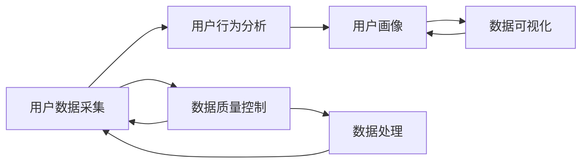

                 

# AI创业公司的用户数据采集与分析：用户行为数据采集与分析与用户画像分析

> 关键词：用户数据采集, 用户行为分析, 用户画像, 数据质量, 数据处理, 数据可视化

## 1. 背景介绍

在AI创业公司的数据驱动决策中，用户数据的采集与分析是至关重要的。为了提供高质量的客户服务和产品优化，企业需要收集和分析用户的各种行为数据，从中提取出有价值的信息，用于构建精细的用户画像，并据此进行精准营销、个性化推荐和客户细分。本博客将系统介绍用户数据的采集与分析方法，探讨如何高效、准确地处理海量用户数据，构建出详尽、精准的用户画像，为公司的业务决策提供科学依据。

## 2. 核心概念与联系

### 2.1 核心概念概述

为了更好地理解用户数据的采集与分析，本节将介绍几个密切相关的核心概念：

- **用户数据采集**：指的是通过各种手段收集用户的行为数据和属性数据，如浏览记录、购买历史、社交互动等。
- **用户行为分析**：通过分析用户行为数据，理解用户偏好和需求，为产品优化和个性化服务提供依据。
- **用户画像**：根据用户行为和属性数据构建出用户的个性化描述，帮助企业实现精细化营销和客户细分。
- **数据质量**：指的是数据采集的准确性、完整性和一致性，是数据分析和应用的基础。
- **数据处理**：包括数据清洗、归一化、去重、转换等，提升数据质量和可用性。
- **数据可视化**：将数据转化为图表、地图等直观形式，便于理解和展示，辅助决策制定。

这些概念之间的逻辑关系可以通过以下Mermaid流程图来展示：



这个流程图展示了一个用户数据从采集到可视化的全流程：

1. 通过数据采集，收集用户行为和属性数据。
2. 数据处理环节对数据进行清洗和转换，提升数据质量。
3. 用户行为分析环节利用处理后的数据，了解用户行为和偏好。
4. 基于行为分析结果构建用户画像。
5. 数据可视化将画像信息转化为图表，辅助决策。

## 3. 核心算法原理 & 具体操作步骤
### 3.1 算法原理概述

用户数据采集与分析的总体框架基于以下算法原理：

- **数据清洗**：去除噪声和异常数据，保证数据质量。
- **特征工程**：构建和选择特征，提升模型性能。
- **机器学习**：通过训练模型，提取行为规律。
- **用户画像**：根据用户特征，构建详尽的个性化描述。
- **可视化**：将画像结果转化为直观的形式，辅助决策。

基于这些原理，用户数据的采集与分析可以大致分为四个步骤：

1. 用户数据采集
2. 数据预处理和特征工程
3. 用户行为分析和建模
4. 用户画像构建和可视化

### 3.2 算法步骤详解

#### 3.2.1 用户数据采集

用户数据的采集主要包括以下几种手段：

1. **网站和应用数据**：通过网站或应用中的点击流、页面浏览记录等收集用户行为数据。
2. **交易数据**：通过电商平台的交易记录收集用户的购买历史和偏好。
3. **社交媒体数据**：通过社交媒体平台上的互动和内容收集用户兴趣和社交网络关系。
4. **设备数据**：通过设备传感数据收集用户的行为模式和环境条件。

#### 3.2.2 数据预处理和特征工程

数据预处理和特征工程主要包括以下步骤：

1. **数据清洗**：去除重复、缺失和异常数据，保证数据质量。
2. **数据归一化**：将不同数据类型的数据进行转换，统一到适合分析的格式。
3. **特征选择**：选择对用户行为预测有显著影响的关键特征。
4. **特征构建**：通过衍生操作创建新的特征，提升模型性能。

#### 3.2.3 用户行为分析和建模

用户行为分析主要包括以下步骤：

1. **用户行为分类**：将用户行为数据进行分类，识别常见行为模式。
2. **用户兴趣建模**：通过协同过滤、矩阵分解等方法构建用户兴趣模型。
3. **用户行为预测**：使用机器学习模型（如决策树、随机森林、深度学习等）对用户行为进行预测。

#### 3.2.4 用户画像构建和可视化

用户画像的构建主要包括以下步骤：

1. **画像特征提取**：从用户行为和属性数据中提取关键特征。
2. **画像融合和合并**：将不同来源的数据进行融合，构建详尽的用户画像。
3. **画像可视化**：通过可视化工具将画像结果转化为图表，便于理解和展示。

### 3.3 算法优缺点

用户数据的采集与分析方法具有以下优点：

1. **提升决策科学性**：通过分析用户数据，能够提供更准确的业务洞察，优化决策过程。
2. **个性化服务**：用户画像的构建有助于提供个性化的产品推荐和服务。
3. **客户细分**：通过用户画像，可以实现更细粒度的客户细分，进行更精准的营销。

同时，该方法也存在以下缺点：

1. **隐私问题**：用户数据的采集和使用涉及隐私保护，需要严格遵守相关法律法规。
2. **数据质量**：数据采集和处理过程中可能存在误差和噪声，影响分析结果。
3. **计算资源需求**：大规模数据处理和建模需要较高的计算资源。
4. **用户隐私保护**：在用户画像构建中，需要避免过度识别和隐私泄露。

尽管存在这些局限性，但用户数据的采集与分析方法仍在大规模应用，成为AI创业公司获取用户洞察的重要手段。未来相关研究的重点在于如何进一步提升数据采集和处理效率，确保数据质量，同时兼顾用户隐私保护。

### 3.4 算法应用领域

用户数据采集与分析技术在多个领域都有广泛应用，例如：

1. **电子商务**：通过分析用户的购物行为和偏好，提供个性化推荐和优惠券。
2. **金融服务**：分析用户的金融交易记录，提供风险评估和个性化金融产品。
3. **健康医疗**：收集用户的健康数据和行为记录，提供健康建议和疾病预警。
4. **媒体娱乐**：通过分析用户的内容消费行为，提供个性化内容推荐和广告投放。
5. **旅游行业**：收集用户的旅游行为和偏好，提供定制化的旅行建议和产品推荐。

除了上述这些经典应用外，用户数据采集与分析还被创新性地应用于更多场景中，如智能客服、智能家居、智能城市等，为各行各业带来了全新的数字化转型和创新服务。

## 4. 数学模型和公式 & 详细讲解  
### 4.1 数学模型构建

本节将使用数学语言对用户数据的采集与分析过程进行更加严格的刻画。

记用户行为数据为 $D=\{(x_i,y_i)\}_{i=1}^N$，其中 $x_i$ 为行为特征向量，$y_i$ 为行为标签。假设数据采集和预处理后得到的数据集为 $D'=\{(x_i',y_i')\}_{i=1}^N$。

定义用户画像为 $P=\{f_k\}_{k=1}^K$，其中 $f_k$ 为第 $k$ 个特征，$K$ 为特征总数。

### 4.2 公式推导过程

用户画像的构建可以通过以下数学模型进行推导：

$$
P = \mathop{\arg\min}_{P} \sum_{i=1}^N \ell(D', P)
$$

其中 $\ell$ 为损失函数，用于衡量用户画像 $P$ 对数据集 $D'$ 的拟合程度。常见的损失函数包括均方误差、交叉熵等。

假设用户画像 $P$ 可以表示为：

$$
P = \{\mu_k\}_{k=1}^K
$$

其中 $\mu_k$ 为第 $k$ 个特征的均值。则优化目标可以改写为：

$$
\{\mu_k\}_{k=1}^K = \mathop{\arg\min}_{\mu_k} \sum_{i=1}^N \ell(D', \{\mu_k\})
$$

在实践中，通常使用梯度下降等优化算法来求解上述最优化问题。设 $\eta$ 为学习率，则参数的更新公式为：

$$
\mu_k \leftarrow \mu_k - \eta \frac{\partial \ell(D', \{\mu_k\})}{\partial \mu_k}
$$

在得到用户画像后，可以通过以下公式将其转化为可视化形式：

$$
\text{Visulization}(P) = \text{Chart}(P)
$$

其中 $\text{Chart}$ 为可视化工具，如Tableau、Power BI等，可以根据用户画像生成直观的图表。

### 4.3 案例分析与讲解

以下以一个简单的用户画像构建案例进行详细讲解：

假设我们有一批用户的购买行为数据，每个用户包含以下特征：
- 购买频率
- 购买金额
- 购买时间

我们可以将这些特征作为用户画像的特征 $f_1, f_2, f_3$，将每个特征的均值作为用户画像的参数 $\mu_1, \mu_2, \mu_3$。

我们可以使用均方误差作为损失函数 $\ell$，具体公式为：

$$
\ell(D', P) = \frac{1}{N}\sum_{i=1}^N \sum_{k=1}^K (x_i' - \mu_k)^2
$$

其中 $x_i'$ 为用户 $i$ 的特征向量，$K=3$。

假设初始化 $\mu_1, \mu_2, \mu_3$，然后使用梯度下降算法进行迭代优化：

1. 初始化：设定 $\mu_1, \mu_2, \mu_3$ 的初值。
2. 前向传播：计算损失函数 $\ell(D', P)$。
3. 反向传播：计算梯度 $\frac{\partial \ell(D', P)}{\partial \mu_k}$。
4. 参数更新：使用 $\mu_k \leftarrow \mu_k - \eta \frac{\partial \ell(D', P)}{\partial \mu_k}$ 更新模型参数。
5. 重复步骤2-4直至收敛。

通过以上步骤，我们便得到了用户画像 $P=\{\mu_1, \mu_2, \mu_3\}$，并将其转化为直观的图表，辅助决策。

## 5. 项目实践：代码实例和详细解释说明
### 5.1 开发环境搭建

在进行用户数据采集与分析实践前，我们需要准备好开发环境。以下是使用Python进行Pandas、NumPy等数据处理库的环境配置流程：

1. 安装Anaconda：从官网下载并安装Anaconda，用于创建独立的Python环境。

2. 创建并激活虚拟环境：
```bash
conda create -n data-env python=3.8 
conda activate data-env
```

3. 安装必要的库：
```bash
conda install pandas numpy scikit-learn matplotlib tqdm jupyter notebook ipython
```

4. 安装相关工具：
```bash
pip install transformers seaborn plotly
```

完成上述步骤后，即可在`data-env`环境中开始用户数据采集与分析实践。

### 5.2 源代码详细实现

这里我们以用户行为数据采集与分析为例，给出使用Pandas、NumPy、Matplotlib等库进行数据分析的Python代码实现。

首先，定义用户行为数据集：

```python
import pandas as pd
from sklearn.preprocessing import MinMaxScaler

# 读取数据
data = pd.read_csv('user_behavior.csv')

# 特征工程
features = ['purchase_frequency', 'purchase_amount', 'purchase_time']
scaler = MinMaxScaler()
data[features] = scaler.fit_transform(data[features])

# 构建用户画像
user_profiles = data.groupby(['user_id']).mean()
user_profiles = user_profiles[features]

# 可视化用户画像
user_profiles.plot(kind='scatter', x='purchase_frequency', y='purchase_amount', title='User Profiles')
plt.show()
```

在这个代码片段中，我们首先使用Pandas读取用户行为数据，并进行特征工程处理。使用MinMaxScaler对购买频率、购买金额等特征进行归一化。

然后，我们通过groupby操作，计算每个用户的特征均值，构建用户画像。最后，使用Matplotlib将用户画像可视化，生成散点图。

### 5.3 代码解读与分析

让我们再详细解读一下关键代码的实现细节：

**用户行为数据读取**：
- 使用Pandas的`read_csv`方法读取用户行为数据。

**特征工程**：
- 使用`MinMaxScaler`对特征进行归一化处理，保证特征在同一个量级上。

**用户画像构建**：
- 使用`groupby`方法按用户ID进行分组，计算每个用户的特征均值。
- 只保留购买频率、购买金额等特征，构建出详尽的用户画像。

**可视化**：
- 使用Matplotlib的`plot`方法生成散点图。
- 设置横坐标为购买频率，纵坐标为购买金额，并添加标题。

可以看到，使用Pandas、NumPy、Matplotlib等库，我们能够方便地进行用户数据的采集、处理和分析，并生成直观的可视化结果。开发者可以在此基础上，进一步探索更复杂的数据分析和机器学习模型，实现更精细的用户画像构建。

## 6. 实际应用场景
### 6.1 电商平台个性化推荐

在电商平台中，用户数据的采集与分析是实现个性化推荐的核心。通过收集用户的浏览、购买历史和兴趣偏好，构建用户画像，能够提供精准的商品推荐，提升用户体验和转化率。

在技术实现上，可以收集用户的点击流记录、购买历史和评分数据，使用协同过滤、矩阵分解等方法构建用户兴趣模型，通过机器学习模型预测用户的购买行为，实现个性化推荐。具体步骤如下：

1. 数据采集：收集用户的浏览、购买历史、评分等数据。
2. 数据预处理：清洗数据、归一化特征、构建用户画像。
3. 行为预测：使用协同过滤、矩阵分解等方法对用户行为进行预测。
4. 推荐生成：根据预测结果，生成个性化商品推荐列表。

### 6.2 金融行业风险评估

在金融行业中，用户数据的采集与分析用于风险评估和信用评分。通过分析用户的交易记录和信用历史，构建用户画像，能够评估用户的信用风险和还款能力，提供个性化的金融产品和服务。

具体步骤如下：

1. 数据采集：收集用户的交易记录、信用评分、社交网络数据等。
2. 数据预处理：清洗数据、归一化特征、构建用户画像。
3. 风险评估：使用机器学习模型对用户风险进行评估。
4. 产品推荐：根据评估结果，推荐个性化的金融产品。

### 6.3 健康医疗个性化诊疗

在健康医疗领域，用户数据的采集与分析用于个性化诊疗和治疗方案推荐。通过收集用户的健康数据和行为记录，构建用户画像，能够提供个性化的诊疗建议和治疗方案，提升诊疗效果和患者满意度。

具体步骤如下：

1. 数据采集：收集用户的健康数据、行为记录、病史等。
2. 数据预处理：清洗数据、归一化特征、构建用户画像。
3. 诊疗推荐：使用机器学习模型对诊疗方案进行推荐。
4. 健康建议：根据推荐结果，提供个性化的健康建议。

### 6.4 未来应用展望

随着用户数据的采集与分析技术的不断发展，其在更多领域的应用将得到拓展，为各行各业带来新的机遇：

1. **智能家居**：通过采集和分析用户的家居行为数据，提供个性化的智能家居解决方案，提升生活便利性。
2. **智能交通**：收集和分析用户的出行数据，提供个性化的交通方案和路线建议，提升出行效率。
3. **智能教育**：收集和分析学生的学习数据，提供个性化的学习资源和建议，提升学习效果。
4. **智慧城市**：采集和分析市民的行为数据，提供个性化的城市服务和建议，提升城市管理水平。

除了上述这些经典应用外，用户数据的采集与分析还被创新性地应用于更多场景中，如智能客服、智能制造、智能物流等，为各行各业带来了全新的数字化转型和创新服务。

## 7. 工具和资源推荐
### 7.1 学习资源推荐

为了帮助开发者系统掌握用户数据的采集与分析理论基础和实践技巧，这里推荐一些优质的学习资源：

1. **《Python数据科学手册》**：一本综合介绍Python数据处理、分析、可视化的书籍，适合初学者和进阶者阅读。
2. **《用户行为分析》**：一本系统介绍用户行为分析方法的书籍，涵盖用户行为模型、数据采集与处理等关键内容。
3. **Coursera的《数据科学专业证书》**：由斯坦福大学提供的在线课程，涵盖数据采集、处理、分析和可视化等核心内容。
4. **Kaggle竞赛**：通过参与数据科学竞赛，积累实战经验，提升数据处理和分析能力。
5. **GitHub开源项目**：通过阅读和参与开源项目，学习先进的用户数据采集与分析技术，积累实践经验。

通过对这些资源的学习实践，相信你一定能够快速掌握用户数据的采集与分析精髓，并用于解决实际的业务问题。

### 7.2 开发工具推荐

高效的开发离不开优秀的工具支持。以下是几款用于用户数据采集与分析开发的常用工具：

1. **Pandas**：Python中的数据处理库，支持数据的读取、清洗、转换、统计等操作。
2. **NumPy**：Python中的数学计算库，支持高效的数值运算和数组操作。
3. **Scikit-learn**：Python中的机器学习库，支持各种机器学习模型的构建和训练。
4. **Matplotlib**：Python中的绘图库，支持生成各种类型的图表和可视化结果。
5. **Tableau**：商业智能工具，支持将数据转化为直观的图表和仪表盘，便于分析和展示。
6. **Power BI**：商业智能工具，支持将数据转化为可视化仪表盘，实现业务洞察和决策支持。

合理利用这些工具，可以显著提升用户数据的采集与分析任务开发效率，加快创新迭代的步伐。

### 7.3 相关论文推荐

用户数据的采集与分析技术的发展源于学界的持续研究。以下是几篇奠基性的相关论文，推荐阅读：

1. **《User Behavior Analysis for Recommendation Systems》**：介绍基于用户行为分析的推荐系统方法，涵盖协同过滤、矩阵分解等核心技术。
2. **《User Profiling in Recommendation Systems》**：介绍用户画像在推荐系统中的应用，涵盖特征工程、画像构建等关键技术。
3. **《A Survey of Data Mining and Statistical Learning for Recommender Systems》**：综述推荐系统的数据处理和建模方法，涵盖特征选择、模型评估等核心技术。
4. **《A Deep Learning Approach for User Profiling》**：介绍基于深度学习的用户画像构建方法，涵盖神经网络、自编码器等核心技术。
5. **《Feature Engineering for Recommendation Systems》**：介绍特征工程在推荐系统中的应用，涵盖特征选择、特征构造等关键技术。

这些论文代表了大规模用户数据处理和分析技术的发展脉络。通过学习这些前沿成果，可以帮助研究者把握学科前进方向，激发更多的创新灵感。

## 8. 总结：未来发展趋势与挑战

### 8.1 总结

本文对用户数据的采集与分析方法进行了全面系统的介绍。首先阐述了用户数据采集和分析在AI创业公司中的应用背景和重要性，明确了用户画像在业务决策中的关键作用。其次，从原理到实践，详细讲解了用户数据的采集、处理、分析和可视化过程，给出了详细的代码实现和分析。同时，本文还广泛探讨了用户数据采集与分析技术在电商、金融、医疗等多个行业领域的应用前景，展示了其巨大的商业价值。

通过本文的系统梳理，可以看到，用户数据的采集与分析技术正在成为AI创业公司获取用户洞察的重要手段，极大地提升了业务决策的科学性和效率。未来，伴随技术的不断发展，用户数据的采集与分析将更加高效、全面，为更多行业带来颠覆性变革。

### 8.2 未来发展趋势

展望未来，用户数据的采集与分析技术将呈现以下几个发展趋势：

1. **数据采集自动化**：借助物联网、传感器等技术，实现数据采集的自动化和实时化，提升数据采集效率和质量。
2. **多源数据融合**：将不同来源的数据进行融合，构建更全面、详尽的用户画像，提升数据分析的全面性和准确性。
3. **数据处理自动化**：引入自动化数据处理技术，如自动清洗、自动归一化等，降低数据处理的复杂度和成本。
4. **实时数据分析**：引入实时数据分析技术，如流式处理、实时计算等，实现对用户行为的实时监测和分析。
5. **数据隐私保护**：加强用户隐私保护，采用差分隐私、联邦学习等技术，保护用户数据安全。
6. **数据可视化智能化**：引入智能可视化工具，如自然语言生成、增强现实等，提升数据可视化的互动性和可理解性。

以上趋势凸显了用户数据的采集与分析技术的广阔前景。这些方向的探索发展，必将进一步提升用户数据处理的效率和质量，确保数据的实时性和安全性，为业务决策提供更加精准和可靠的支撑。

### 8.3 面临的挑战

尽管用户数据的采集与分析技术已经取得了显著成就，但在迈向更加智能化、普适化应用的过程中，仍面临诸多挑战：

1. **数据隐私保护**：用户数据的采集和使用涉及隐私保护，需要严格遵守相关法律法规。如何平衡数据价值和用户隐私保护，是亟待解决的问题。
2. **数据质量和完整性**：数据采集和处理过程中可能存在误差和噪声，影响数据分析结果。如何提升数据质量和完整性，是一个长期挑战。
3. **计算资源需求**：大规模数据处理和建模需要较高的计算资源。如何优化算法和系统架构，降低计算成本，提高处理效率，是一个重要研究方向。
4. **用户行为预测**：用户行为的预测难度较大，尤其是当用户行为受到多种因素影响时。如何建立更准确的预测模型，是一个技术难题。
5. **多模态数据融合**：不同模态的数据（如文本、图像、语音等）具有不同的特征和格式，如何实现有效的融合和分析，是一个复杂问题。
6. **模型公平性和鲁棒性**：用户数据的采集和分析可能存在偏见和歧视，如何确保模型公平性和鲁棒性，是一个重要的伦理问题。

正视用户数据的采集与分析面临的这些挑战，积极应对并寻求突破，将是大规模用户数据处理向更加智能化、普适化应用迈进的关键。相信随着技术的不断发展和伦理意识的提升，这些挑战终将一一被克服，用户数据的采集与分析技术必将在各行各业大放异彩。

### 8.4 研究展望

面对用户数据采集与分析所面临的种种挑战，未来的研究需要在以下几个方面寻求新的突破：

1. **自动化数据采集**：开发自动化数据采集技术，实现数据采集的自动化和实时化。
2. **多模态数据融合**：引入多模态数据融合技术，实现不同模态数据的有效整合和分析。
3. **数据隐私保护**：研究数据隐私保护技术，如差分隐私、联邦学习等，确保用户数据的安全和隐私。
4. **实时数据分析**：引入实时数据分析技术，实现对用户行为的实时监测和分析。
5. **智能数据可视化**：开发智能可视化工具，如自然语言生成、增强现实等，提升数据可视化的互动性和可理解性。
6. **公平性和鲁棒性**：研究模型公平性和鲁棒性技术，确保模型预测的准确性和可靠性。

这些研究方向的探索，必将引领用户数据采集与分析技术迈向更高的台阶，为业务决策提供更加精准和可靠的支撑，推动AI创业公司向更智能化、普适化的方向发展。面向未来，用户数据的采集与分析技术还需要与其他AI技术进行更深入的融合，如知识图谱、自然语言处理、强化学习等，多路径协同发力，共同推动AI技术的全面落地。

## 9. 附录：常见问题与解答

**Q1：如何有效采集用户数据？**

A: 有效采集用户数据需要关注以下几个方面：
1. **数据采集来源**：选择可靠的数据来源，如官方数据、第三方数据、传感器数据等。
2. **数据采集频率**：确定合适的数据采集频率，保证数据的实时性和新鲜度。
3. **数据采集方式**：采用自动采集、主动采集、用户授权等方式，保证数据的合法性和准确性。
4. **数据采集工具**：使用专业的数据采集工具，如Flume、Apache Kafka等，提高数据采集效率。

**Q2：如何进行数据预处理？**

A: 数据预处理包括数据清洗、归一化、去重、转换等，提升数据质量和可用性。具体步骤包括：
1. **数据清洗**：去除重复、缺失和异常数据，保证数据质量。
2. **数据归一化**：将不同数据类型的数据进行转换，统一到适合分析的格式。
3. **数据去重**：去除重复数据，保证数据的唯一性。
4. **数据转换**：将数据转换为适合分析的格式，如将时间戳转换为日期格式，将分类变量转换为数值变量等。

**Q3：如何选择适合的机器学习模型？**

A: 选择合适的机器学习模型需要考虑以下几个方面：
1. **任务类型**：根据任务类型选择合适的模型，如回归问题使用线性回归、分类问题使用逻辑回归、聚类问题使用K-means等。
2. **数据规模**：根据数据规模选择合适的模型，如大规模数据使用深度学习模型，小规模数据使用浅层模型。
3. **模型性能**：根据模型性能选择最优模型，如准确率、召回率、F1值等。
4. **计算资源**：根据计算资源选择合适的模型，如GPU/TPU等高性能设备。

**Q4：如何进行用户画像构建？**

A: 用户画像构建主要包括以下步骤：
1. **特征提取**：从用户行为和属性数据中提取关键特征。
2. **画像融合**：将不同来源的数据进行融合，构建详尽的用户画像。
3. **画像可视化**：通过可视化工具将画像结果转化为图表，便于理解和展示。

**Q5：用户数据采集与分析的局限性有哪些？**

A: 用户数据采集与分析面临以下局限性：
1. **数据隐私保护**：用户数据的采集和使用涉及隐私保护，需要严格遵守相关法律法规。
2. **数据质量和完整性**：数据采集和处理过程中可能存在误差和噪声，影响数据分析结果。
3. **计算资源需求**：大规模数据处理和建模需要较高的计算资源。
4. **用户行为预测**：用户行为的预测难度较大，尤其是当用户行为受到多种因素影响时。
5. **多模态数据融合**：不同模态的数据具有不同的特征和格式，如何实现有效的融合和分析，是一个复杂问题。
6. **模型公平性和鲁棒性**：用户数据的采集和分析可能存在偏见和歧视，如何确保模型公平性和鲁棒性，是一个重要的伦理问题。

正视这些局限性，积极应对并寻求突破，将是大规模用户数据处理向更加智能化、普适化应用迈进的关键。相信随着技术的不断发展和伦理意识的提升，这些局限性终将一一被克服，用户数据的采集与分析技术必将在各行各业大放异彩。

---

作者：禅与计算机程序设计艺术 / Zen and the Art of Computer Programming

