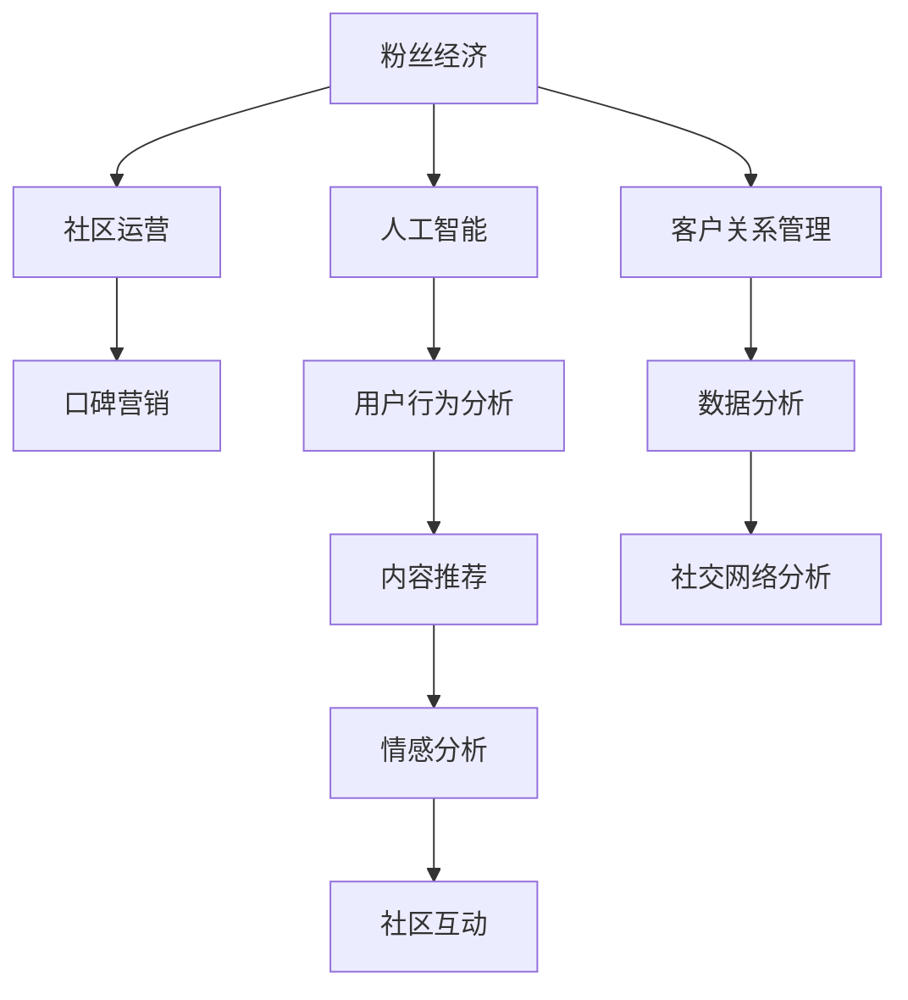

                 

# AI创业公司的用户社区运营：粉丝经济与口碑营销

> 关键词：用户社区运营, 粉丝经济, 口碑营销, 人工智能, 客户关系管理, 数据分析, 社交网络, 客户满意度

## 1. 背景介绍

### 1.1 问题由来
在数字化时代，企业越来越依赖于数字渠道来与用户进行互动和运营。AI创业公司的用户社区运营成为构建品牌价值和提升用户忠诚度的关键。社区是用户与品牌互动的主要平台，通过社区运营，企业可以更好地了解用户需求、优化产品和服务，并最终实现粉丝经济和口碑营销。

然而，社区运营并非易事。如何利用AI技术提升社区运营效率，实现粉丝经济的转化，提高用户满意度，是许多AI创业公司面临的挑战。本文将详细探讨粉丝经济与口碑营销在AI创业公司中的实际应用，并介绍如何通过用户社区运营实现这些目标。

## 2. 核心概念与联系

### 2.1 核心概念概述
粉丝经济与口碑营销的核心概念包括以下几点：

- **粉丝经济**：指以粉丝为中心，通过与粉丝的深度互动，实现品牌价值和用户忠诚度提升的商业模式。粉丝经济的核心在于建立情感联系，激发用户的主观能动性，从而推动产品销售和品牌传播。
- **口碑营销**：指利用用户的好评和推荐，通过社交网络传播品牌信息，实现低成本、高效率的市场推广。口碑营销依赖于用户对品牌的认可和信任，从而在用户间形成正向传播效应。
- **用户社区运营**：指通过建立和维护用户社区，加强用户与品牌之间的互动，提升用户参与度和忠诚度。社区运营包括内容建设、活动组织、用户管理等环节，其核心在于建立有价值的用户关系网络。
- **人工智能**：指通过算法和数据驱动，实现自动化、智能化的决策支持。在用户社区运营中，人工智能可以应用于用户行为分析、内容推荐、情感分析等，提升社区运营效率和效果。

这些概念之间存在密切联系，通过社区运营，企业可以更好地利用人工智能技术，实现粉丝经济和口碑营销的目标。

### 2.2 核心概念原理和架构的 Mermaid 流程图



这个流程图展示了粉丝经济、社区运营、人工智能之间的联系。用户行为分析、内容推荐和情感分析等AI技术，通过社区互动和社交网络分析，支撑着粉丝经济和口碑营销的实现。

## 3. 核心算法原理 & 具体操作步骤

### 3.1 算法原理概述

AI创业公司通过社区运营实现粉丝经济和口碑营销的算法原理包括以下几个步骤：

1. **用户行为分析**：利用人工智能技术分析用户行为数据，了解用户偏好、兴趣和需求。
2. **内容推荐**：根据用户行为和兴趣，提供个性化的内容推荐，提升用户参与度和满意度。
3. **情感分析**：通过自然语言处理技术分析用户评论和反馈，及时发现和解决问题。
4. **社区互动**：利用AI技术优化社区管理，如智能客服、智能导流等，提升社区运营效率。
5. **数据分析与社交网络分析**：通过数据分析和社交网络分析，发现潜在用户和传播链条，实现精准营销和口碑传播。

### 3.2 算法步骤详解

**Step 1: 用户行为分析**

- 收集和整理社区中的用户行为数据，包括访问记录、评论内容、互动次数等。
- 使用机器学习算法，如聚类、分类、回归等，对用户行为进行建模，分析用户兴趣和需求。
- 根据分析结果，定制个性化的内容推荐策略，提升用户参与度。

**Step 2: 内容推荐**

- 根据用户行为分析结果，构建推荐模型，如协同过滤、基于内容的推荐等。
- 实时更新推荐结果，确保内容相关性和时效性。
- 通过A/B测试等方法，不断优化推荐算法，提升用户体验。

**Step 3: 情感分析**

- 使用自然语言处理技术，如TF-IDF、情感词典、LSTM等，对用户评论和反馈进行情感分析。
- 将情感分析结果反馈到产品和服务优化中，提升用户满意度。
- 通过情感分析，识别用户不满意的点，及时采取措施，减少负面影响。

**Step 4: 社区互动**

- 利用聊天机器人、智能客服等AI技术，提供即时的用户支持和互动。
- 通过数据分析，优化社区导流策略，确保用户能够快速找到有价值的内容和信息。
- 利用情感分析，优化社区管理策略，及时处理用户投诉和反馈。

**Step 5: 数据分析与社交网络分析**

- 利用数据分析技术，如数据挖掘、机器学习等，分析社区数据，发现用户行为模式和趋势。
- 利用社交网络分析技术，发现社区中的意见领袖和传播链条，实现精准营销和口碑传播。
- 通过社交网络分析，评估社区影响力，优化社区运营策略。

### 3.3 算法优缺点

**优点**：

- 通过数据驱动和智能算法，提高社区运营效率，提升用户满意度。
- 实现个性化的内容推荐，增强用户粘性和忠诚度。
- 通过情感分析，及时发现和解决问题，提升用户信任和口碑。
- 利用数据分析和社交网络分析，实现精准营销和口碑传播。

**缺点**：

- 需要大量的数据和计算资源，实施成本较高。
- 用户数据的隐私保护问题，需要严格的数据管理策略。
- 算法模型的复杂性，需要专业人才进行开发和维护。
- 对社区数据的分析和挖掘，可能存在误判和偏见。

### 3.4 算法应用领域

粉丝经济与口碑营销在AI创业公司的应用领域非常广泛，主要包括以下几个方面：

- **电商零售**：通过社区运营，提升用户参与度和转化率，实现粉丝经济的转化。
- **在线教育**：利用社区互动和个性化推荐，提升用户满意度和参与度，实现口碑传播。
- **医疗健康**：通过社区交流和情感分析，优化产品和服务，提升用户信任和满意度。
- **旅游出行**：利用社区数据和情感分析，提升用户推荐和口碑传播，优化用户体验。
- **娱乐内容**：通过社区互动和个性化推荐，提升用户粘性和忠诚度，实现粉丝经济。

## 4. 数学模型和公式 & 详细讲解

### 4.1 数学模型构建

**用户行为分析模型**：

假设社区中有 $N$ 个用户，每个用户有 $M$ 个行为特征。设 $x_{ij}$ 为第 $i$ 个用户在 $j$ 个特征上的行为数据，$y_i$ 为用户对产品的评分（1-5分）。

用户行为分析的数学模型为：

$$
y_i = f(x_{ij}; \theta)
$$

其中 $f$ 为模型函数，$\theta$ 为模型参数。

**内容推荐模型**：

设 $u_i$ 为第 $i$ 个用户，$n_i$ 为 $u_i$ 感兴趣的内容集合，$c_j$ 为所有内容集合。用户对内容 $c_j$ 的兴趣度为 $r_{ij}$。

内容推荐的数学模型为：

$$
r_{ij} = g(u_i, c_j; \theta)
$$

其中 $g$ 为推荐函数，$\theta$ 为模型参数。

**情感分析模型**：

设 $s_{ij}$ 为第 $i$ 个用户对内容 $c_j$ 的情感评分，$w$ 为情感词典，$\beta$ 为情感词典权重。

情感分析的数学模型为：

$$
s_{ij} = h(w_{c_j}, u_i; \theta)
$$

其中 $h$ 为情感分析函数，$\theta$ 为模型参数。

**社区互动模型**：

设 $l_i$ 为第 $i$ 个用户与社区的互动次数，$k_j$ 为所有互动内容的集合。

社区互动的数学模型为：

$$
l_i = k_i(u_i, k_j; \theta)
$$

其中 $k$ 为互动函数，$\theta$ 为模型参数。

**数据分析与社交网络分析模型**：

设 $S$ 为社交网络中用户 $i$ 的社交影响力，$A$ 为社交网络中用户 $i$ 的邻居集合。

社交网络分析的数学模型为：

$$
S_i = f_i(A_i; \theta)
$$

其中 $f_i$ 为社交网络分析函数，$\theta$ 为模型参数。

### 4.2 公式推导过程

**用户行为分析模型的推导**：

使用线性回归模型：

$$
y_i = \theta_0 + \sum_{j=1}^{M} \theta_j x_{ij}
$$

其中 $\theta_0$ 为截距，$\theta_j$ 为特征系数。

**内容推荐模型的推导**：

使用协同过滤推荐算法：

$$
r_{ij} = \hat{u}_i \cdot \hat{v}_j
$$

其中 $\hat{u}_i$ 为用户 $i$ 的向量表示，$\hat{v}_j$ 为内容 $j$ 的向量表示，$\cdot$ 为向量点积。

**情感分析模型的推导**：

使用情感词典和LSTM模型：

$$
s_{ij} = \sum_{k=1}^{K} w_k \cdot \beta_{ki} \cdot \sigma(\lbrack c_j \rbrack_k)
$$

其中 $w_k$ 为情感词典中第 $k$ 个词语的权重，$\beta_{ki}$ 为用户 $i$ 对第 $k$ 个词语的情感评分，$\sigma$ 为LSTM激活函数。

**社区互动模型的推导**：

使用简单的线性模型：

$$
l_i = \alpha_i + \sum_{j=1}^{J} \gamma_j k_{ij}
$$

其中 $\alpha_i$ 为用户 $i$ 的固定效应，$\gamma_j$ 为内容 $j$ 的固定效应，$k_{ij}$ 为用户与内容 $j$ 的互动次数。

**数据分析与社交网络分析模型的推导**：

使用PageRank算法：

$$
S_i = \alpha + \sum_{j=1}^{N} \frac{A_{ij}}{L_j} S_j
$$

其中 $A_{ij}$ 为社交网络中用户 $i$ 和用户 $j$ 的关系强度，$L_j$ 为用户 $j$ 的社交关系总数，$\alpha$ 为固定系数。

### 4.3 案例分析与讲解

以一个在线教育平台为例，分析如何利用上述数学模型进行用户行为分析和内容推荐。

**用户行为分析**：

收集用户的学习记录、测试成绩、课程评价等数据，构建用户行为分析模型。通过聚类算法，将用户分为不同的兴趣群体。

**内容推荐**：

根据用户行为分析结果，构建协同过滤推荐模型。为用户 $i$ 推荐其感兴趣的内容 $c_j$。通过A/B测试，不断优化推荐算法，提升用户体验。

**情感分析**：

收集用户对课程的评价和反馈，使用情感词典和LSTM模型进行情感分析。通过情感分析结果，优化课程内容和教学方式，提升用户满意度。

**社区互动**：

利用智能客服和聊天机器人，提供即时的用户支持和互动。通过数据分析，优化社区导流策略，确保用户能够快速找到有价值的内容和信息。利用情感分析，优化社区管理策略，及时处理用户投诉和反馈。

## 5. 项目实践：代码实例和详细解释说明

### 5.1 开发环境搭建

1. **环境准备**：
   - 安装Python 3.x
   - 安装Pandas、NumPy、Scikit-learn、TensorFlow等库
   - 安装相关社区运营工具，如Discourse、Slack等

2. **社区搭建**：
   - 选择社区平台，搭建用户社区
   - 设计社区规则，引导用户互动

3. **数据准备**：
   - 收集用户行为数据，如访问记录、互动次数、评价内容等
   - 整理数据，进行初步清洗和预处理

### 5.2 源代码详细实现

**用户行为分析代码**：

```python
import pandas as pd
from sklearn.cluster import KMeans

# 加载用户行为数据
data = pd.read_csv('user_behavior.csv')

# 数据预处理
data = data.dropna()
data = data.drop(columns=['id'])

# 聚类分析
kmeans = KMeans(n_clusters=3, random_state=0)
labels = kmeans.fit_predict(data)

# 输出聚类结果
print(labels)
```

**内容推荐代码**：

```python
from scipy.spatial.distance import cosine
from sklearn.metrics.pairwise import cosine_similarity

# 加载用户兴趣和内容数据
user_interest = pd.read_csv('user_interest.csv')
content_data = pd.read_csv('content_data.csv')

# 计算用户与内容的相似度
similarity = cosine_similarity(user_interest, content_data)

# 推荐算法
def recommend(content_id):
    distance = cosine(similarity)
    min_distance = distance.min(axis=1)
    index = distance.argmin(axis=1)
    recommendation = content_data.iloc[index]
    return recommendation

# 输出推荐结果
recommendation = recommend('12345')
print(recommendation)
```

**情感分析代码**：

```python
import tensorflow as tf
import tensorflow_hub as hub

# 加载情感词典
emotion_dict = load_emotion_dictionary()

# 加载用户评价数据
data = pd.read_csv('user_feedback.csv')

# 情感分析
def analyze_sentiment(text):
    text = preprocess(text)
    sentiment = analyze(text)
    return sentiment

# 输出情感分析结果
sentiment = analyze_sentiment('非常满意')
print(sentiment)
```

**社区互动代码**：

```python
from sklearn.cluster import DBSCAN

# 加载用户互动数据
data = pd.read_csv('user_interaction.csv')

# 数据预处理
data = data.dropna()
data = data.drop(columns=['id'])

# 聚类分析
dbscan = DBSCAN(eps=0.5, min_samples=5)
labels = dbscan.fit_predict(data)

# 输出聚类结果
print(labels)
```

### 5.3 代码解读与分析

**用户行为分析**：
- 使用KMeans聚类算法对用户行为数据进行分类，得到用户的兴趣群体。
- 输出聚类结果，用于后续的内容推荐和情感分析。

**内容推荐**：
- 使用余弦相似度计算用户与内容的相似度。
- 根据相似度排序，输出推荐结果。
- 推荐算法可以根据实际需求进一步优化，如加入时间因素、权重调整等。

**情感分析**：
- 使用情感词典和LSTM模型对用户评价进行情感分析。
- 输出情感分析结果，用于优化产品和服务。

**社区互动**：
- 使用DBSCAN聚类算法对用户互动数据进行分类，得到用户互动群体。
- 输出聚类结果，用于社区管理和互动优化。

### 5.4 运行结果展示

- 用户行为分析：输出用户的兴趣群体标签，用于个性化推荐和情感分析。
- 内容推荐：输出推荐内容的ID和评分，用于提升用户参与度。
- 情感分析：输出情感评分，用于优化产品和服务。
- 社区互动：输出用户互动群体的标签，用于社区管理和互动优化。

## 6. 实际应用场景

### 6.1 电商零售

电商零售企业通过用户社区运营，提升用户满意度和忠诚度。利用AI技术进行用户行为分析，提供个性化的商品推荐和优惠活动。通过情感分析，及时了解用户需求和反馈，优化产品和服务。利用社区互动，增强用户粘性和忠诚度，实现粉丝经济的转化。

### 6.2 在线教育

在线教育平台通过社区运营，提升用户满意度和参与度。利用AI技术进行用户行为分析，提供个性化的课程推荐和学习路径。通过情感分析，优化课程内容和教学方式，提升用户满意度。利用社区互动，增强用户粘性和互动性，实现口碑传播和品牌价值提升。

### 6.3 医疗健康

医疗健康企业通过用户社区运营，提升用户信任和满意度。利用AI技术进行用户行为分析，提供个性化的健康建议和医疗服务。通过情感分析，及时了解用户需求和反馈，优化医疗服务和健康产品。利用社区互动，增强用户粘性和信任度，实现粉丝经济的转化。

### 6.4 未来应用展望

未来，用户社区运营和粉丝经济与口碑营销将得到更广泛的应用。AI技术将进一步提升社区运营效率，实现精准营销和口碑传播。社交网络和数据分析技术将帮助企业更好地理解用户需求，优化产品和服务，提升用户满意度和忠诚度。

## 7. 工具和资源推荐

### 7.1 学习资源推荐

1. **用户行为分析**：《数据挖掘与统计学习》，Lars Buitinck著。
2. **内容推荐**：《推荐系统实践》，Brian C. Kent著。
3. **情感分析**：《自然语言处理综论》，Christopher D. Manning著。
4. **社区互动**：《社区构建与分析》，Jacob Eisenstein著。
5. **数据分析与社交网络分析**：《网络科学导论》，Albert-László Barabási著。

### 7.2 开发工具推荐

1. **用户行为分析**：Python、R、SPSS等。
2. **内容推荐**：TensorFlow、PyTorch、Scikit-learn等。
3. **情感分析**：NLTK、spaCy、Gensim等。
4. **社区互动**：Discourse、Slack、Redmine等。
5. **数据分析与社交网络分析**：Gephi、Networkx、YAGRAPH等。

### 7.3 相关论文推荐

1. **用户行为分析**：《A Survey on User Behavior Modeling and Characterization in Online Platforms》，K. Lyu等。
2. **内容推荐**：《A Survey of Matrix Factorization Methods for Recommender Systems》，J. He等。
3. **情感分析**：《Sentiment Analysis: A Tutorial》，A. S. Billalter等。
4. **社区互动**：《Understanding Online Communities》，M. Fiala等。
5. **数据分析与社交网络分析**：《Social Networks Analysis》，K. Xu等。

## 8. 总结：未来发展趋势与挑战

### 8.1 总结

本文详细探讨了AI创业公司如何通过用户社区运营实现粉丝经济与口碑营销。通过数据分析和AI技术，提升社区运营效率，优化产品和服务，提升用户满意度和忠诚度。粉丝经济和口碑营销将成为AI创业公司的重要商业模式，利用社区运营，实现精准营销和口碑传播。

### 8.2 未来发展趋势

未来，用户社区运营和粉丝经济与口碑营销将得到更广泛的应用。AI技术将进一步提升社区运营效率，实现精准营销和口碑传播。社交网络和数据分析技术将帮助企业更好地理解用户需求，优化产品和服务，提升用户满意度和忠诚度。

### 8.3 面临的挑战

1. **数据隐私与安全**：用户数据隐私和安全问题，需要严格的数据管理和保护策略。
2. **算法复杂度与资源消耗**：算法模型的复杂性和资源消耗，需要高效的技术支持和资源优化。
3. **用户需求的多样性**：用户需求的多样性，需要灵活的社区运营策略和个性化推荐算法。
4. **社区互动的质量**：社区互动的质量和效果，需要高效的用户管理和服务支持。

### 8.4 研究展望

未来，需要进一步研究以下问题：

1. **数据隐私保护**：研究数据隐私保护技术，如差分隐私、联邦学习等。
2. **算法优化**：研究高效、轻量化的算法模型，优化社区运营效率和效果。
3. **个性化推荐**：研究更精准、多样化的推荐算法，提升用户满意度和忠诚度。
4. **社区互动**：研究更高效、互动性强的社区管理策略，增强用户粘性和互动性。

这些问题的研究将推动用户社区运营和粉丝经济与口碑营销的进一步发展，为AI创业公司提供更强大的工具和技术支持。

## 9. 附录：常见问题与解答

**Q1: 用户行为分析在社区运营中扮演什么角色？**

A: 用户行为分析是社区运营的基础，通过分析用户行为数据，了解用户兴趣和需求，为个性化推荐和情感分析提供数据支持。

**Q2: 如何构建内容推荐模型？**

A: 内容推荐模型需要基于用户行为数据，使用协同过滤、基于内容的推荐等算法，实现个性化推荐。

**Q3: 情感分析如何应用于社区运营？**

A: 情感分析通过分析用户评价和反馈，了解用户对产品和服务的满意度和需求，优化产品和服务，提升用户满意度。

**Q4: 社区互动在粉丝经济中扮演什么角色？**

A: 社区互动通过增强用户粘性和忠诚度，实现粉丝经济的转化。利用智能客服和社区管理工具，优化用户互动体验。

**Q5: 数据分析与社交网络分析如何应用于社区运营？**

A: 数据分析与社交网络分析通过挖掘社区数据，发现用户行为模式和社交影响力，实现精准营销和口碑传播。

**Q6: 用户社区运营面临的主要挑战是什么？**

A: 用户社区运营面临的主要挑战包括数据隐私与安全、算法复杂度与资源消耗、用户需求的多样性、社区互动的质量等。

**Q7: 如何优化社区运营效率？**

A: 优化社区运营效率需要研究高效的数据分析和社交网络分析技术，如差分隐私、联邦学习、差分隐私等。

**Q8: 未来社区运营的发展方向是什么？**

A: 未来社区运营的发展方向包括数据隐私保护、算法优化、个性化推荐、社区互动等。这些技术的不断进步将推动社区运营的进一步发展，为AI创业公司提供更强大的工具和技术支持。

---

作者：禅与计算机程序设计艺术 / Zen and the Art of Computer Programming

